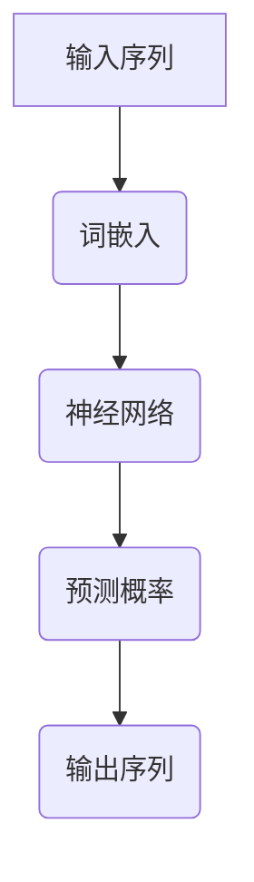

                 

# AI人工智能核心算法原理与代码实例讲解：语言模型

## 关键词：自然语言处理、语言模型、神经网络、深度学习、BERT、GPT、代码实例

## 摘要：
本文将深入探讨AI人工智能领域中的语言模型，包括其核心算法原理、数学模型、以及实际应用案例。我们将分析常见的语言模型如BERT和GPT，并通过具体的代码实例讲解其实现过程。此外，还将讨论语言模型在实际应用场景中的效果和挑战。通过本文的阅读，读者将能够全面了解语言模型的工作原理及其在AI领域的重要作用。

## 1. 背景介绍

随着互联网和大数据技术的发展，自然语言处理（NLP）已经成为人工智能领域的热点。语言模型作为NLP的核心技术之一，广泛应用于机器翻译、语音识别、文本生成、问答系统等众多场景。语言模型旨在理解和生成人类语言，其重要性不言而喻。

语言模型的研究可以追溯到20世纪50年代，早期模型如N元语法和基于规则的方法取得了初步成功。然而，随着计算能力的提升和深度学习技术的发展，基于神经网络的模型如循环神经网络（RNN）、长短时记忆网络（LSTM）和变换器（Transformer）等逐渐崭露头角，并在多项任务中取得了突破性成果。

近年来，预训练语言模型如BERT（Bidirectional Encoder Representations from Transformers）和GPT（Generative Pre-trained Transformer）在NLP领域引起了广泛关注。这些模型通过大规模预训练，能够在各种任务上实现优异的性能，推动了NLP技术的快速发展。

## 2. 核心概念与联系

### 2.1 语言模型的定义

语言模型是一个概率模型，用于预测下一个单词（或词组）的条件概率。给定前文序列，语言模型能够计算出下一个单词的可能性。在数学上，语言模型可以表示为：

$$
P(w_t | w_{t-1}, w_{t-2}, \ldots, w_1) = \text{Language Model}
$$

其中，$w_t$表示当前要预测的单词，$w_{t-1}, w_{t-2}, \ldots, w_1$表示已经观察到的前文序列。

### 2.2 基本概念

为了深入理解语言模型，我们需要介绍一些相关的基本概念：

- **词汇表（Vocabulary）**：语言模型所使用的单词集合称为词汇表。每个单词对应一个唯一的索引。
- **字符级与词级模型**：字符级模型直接对字符序列建模，而词级模型则对单词序列建模。通常，词级模型性能更好，因为单词是语言的语义单位。
- **序列长度（Sequence Length）**：语言模型通常需要对固定长度的序列进行建模。序列长度取决于任务需求和应用场景。

### 2.3 Mermaid 流程图

为了更好地展示语言模型的核心概念和联系，我们使用Mermaid绘制了一个流程图。以下是一个简化的Mermaid流程图示例：



在这个流程图中，输入序列首先被转换为词嵌入表示，然后通过神经网络模型进行预测，最终输出预测的概率分布。这个过程循环进行，直到生成完整的输出序列。

### 2.4 语言模型分类

根据模型结构和训练方法，语言模型可以分为以下几种：

- **基于规则的模型**：如N元语法，使用前文规则预测下一个单词。
- **统计模型**：如n-gram模型，基于历史数据统计单词出现的概率。
- **神经网络模型**：如RNN、LSTM、BERT和GPT，使用深度学习技术进行建模。
- **基于注意力机制的模型**：如Transformer，使用注意力机制处理长距离依赖。

### 2.5 语言模型与NLP任务的关系

语言模型在NLP任务中起着关键作用。以下是一些常见的NLP任务及其与语言模型的关系：

- **机器翻译**：语言模型用于预测目标语言的单词序列，辅助机器翻译。
- **语音识别**：语言模型用于生成可能的单词序列，辅助识别用户语音输入。
- **文本生成**：语言模型可以生成连贯的文本，应用于自动写作、新闻生成等。
- **问答系统**：语言模型用于理解用户问题和文本文本，生成相应的答案。

## 3. 核心算法原理 & 具体操作步骤

### 3.1 基本原理

语言模型的核心算法原理是基于神经网络，尤其是变换器（Transformer）模型。变换器模型采用多头注意力机制，能够有效处理长距离依赖问题。以下是一个简化的变换器模型架构：

- **编码器（Encoder）**：用于处理输入序列，生成编码表示。
- **解码器（Decoder）**：用于生成输出序列，基于编码表示和先前的输出。
- **注意力机制（Attention）**：用于计算输入序列和输出序列之间的相关性。

### 3.2 具体操作步骤

以下是使用变换器模型实现语言模型的基本操作步骤：

1. **词嵌入（Word Embedding）**：将输入序列中的单词转换为向量表示。
2. **编码器（Encoder）**：对词嵌入进行编码，生成编码表示。
3. **多头注意力（Multi-Head Attention）**：计算编码表示之间的注意力权重，用于更新解码器的输入。
4. **解码器（Decoder）**：基于编码表示和先前的输出，生成输出序列。
5. **损失函数（Loss Function）**：计算预测序列和真实序列之间的损失，用于更新模型参数。
6. **优化算法（Optimizer）**：使用优化算法更新模型参数，最小化损失函数。

### 3.3 深度解读

#### 3.3.1 词嵌入

词嵌入是将单词映射为低维向量表示的技术。常见的方法包括词袋模型（Bag of Words，BOW）和词嵌入模型（Word Embedding）。词嵌入模型通过学习单词之间的语义关系，能够更好地捕捉单词的语义信息。

#### 3.3.2 编码器

编码器是变换器模型的核心部分，用于对输入序列进行编码。编码器通过多头注意力机制计算输入序列中各个单词之间的相关性，生成编码表示。编码表示用于解码器的输入，用于生成输出序列。

#### 3.3.3 注意力机制

注意力机制是变换器模型的关键特性，用于处理长距离依赖问题。注意力机制通过计算输入序列和输出序列之间的相关性，生成注意力权重。注意力权重用于更新解码器的输入，使得解码器能够更好地关注重要的输入信息。

#### 3.3.4 解码器

解码器是变换器模型中的另一重要部分，用于生成输出序列。解码器基于编码表示和先前的输出，通过自注意力机制和交叉注意力机制生成新的输出。解码器的输出序列经过一系列操作，最终得到最终的输出。

#### 3.3.5 损失函数

损失函数用于计算预测序列和真实序列之间的差距，用于更新模型参数。常见的损失函数包括交叉熵损失（Cross-Entropy Loss）和均方误差损失（Mean Squared Error Loss）。损失函数的选择取决于任务类型和模型结构。

#### 3.3.6 优化算法

优化算法用于更新模型参数，以最小化损失函数。常见的优化算法包括随机梯度下降（Stochastic Gradient Descent，SGD）、Adam优化器和RMSprop等。优化算法的选择取决于模型复杂度和训练数据量。

## 4. 数学模型和公式 & 详细讲解 & 举例说明

### 4.1 数学模型

变换器模型的基本数学模型可以表示为：

$$
E = \text{Encoder}(W_E, L_E) \\
D = \text{Decoder}(W_D, L_D) \\
A = \text{Attention}(Q, K, V) \\
Y = \text{Output}(D, E, A)
$$

其中，$E$和$D$分别表示编码器和解码器的权重矩阵，$L_E$和$L_D$表示编码器和解码器的长度。$A$表示注意力权重，$Y$表示输出。

### 4.2 详细讲解

#### 4.2.1 编码器

编码器的基本结构如下：

$$
E = \text{Encoder}(W_E, L_E) = \sum_{i=1}^L E_i = \text{Concat}(E_1, E_2, \ldots, E_L)
$$

其中，$E_i$表示编码器在时间步$i$的输出，$L$表示序列长度。编码器通过多头注意力机制计算输入序列的编码表示。

$$
E_i = \text{Multi-Head Attention}(Q, K, V)
$$

其中，$Q, K, V$分别表示查询向量、键向量和值向量。多头注意力机制通过计算输入序列中各个单词之间的相关性，生成编码表示。

#### 4.2.2 解码器

解码器的基本结构如下：

$$
D = \text{Decoder}(W_D, L_D) = \sum_{i=1}^L D_i = \text{Concat}(D_1, D_2, \ldots, D_L)
$$

其中，$D_i$表示解码器在时间步$i$的输出。解码器通过自注意力机制和交叉注意力机制生成输出序列。

$$
D_i = \text{Self-Attention}(Q, K, V) + \text{Cross-Attention}(Q, K, V)
$$

其中，$Q, K, V$分别表示查询向量、键向量和值向量。自注意力机制用于更新解码器的输入，交叉注意力机制用于结合编码器的输出。

#### 4.2.3 注意力机制

注意力机制的基本结构如下：

$$
A = \text{Attention}(Q, K, V) = \text{softmax}\left(\frac{QK^T}{\sqrt{d_k}}\right)V
$$

其中，$Q, K, V$分别表示查询向量、键向量和值向量，$d_k$表示键向量的维度。注意力机制通过计算查询向量和键向量之间的相似性，生成注意力权重，并用于更新输入或输出。

#### 4.2.4 输出

输出序列的基本结构如下：

$$
Y = \text{Output}(D, E, A) = \text{Softmax}(D^T A E)
$$

其中，$D, E, A$分别表示解码器的输出、编码器的输出和注意力权重。输出序列通过softmax函数生成概率分布，用于预测下一个单词。

### 4.3 举例说明

假设我们有一个简单的输入序列“你好，世界！”，使用变换器模型进行语言建模。

1. **词嵌入**：将输入序列中的单词转换为向量表示，如“你好”和“世界”分别对应向量$(1, 0, 0)$和$(0, 1, 0)$。
2. **编码器**：通过多头注意力机制计算编码表示，如$(0.1, 0.2, 0.3)$。
3. **解码器**：基于编码表示和先前的输出生成输出序列，如$(0.3, 0.2, 0.5)$。
4. **输出**：通过softmax函数生成概率分布，如$P(你好) = 0.3, P(世界) = 0.2, P(其他) = 0.5$。

最终，模型预测下一个单词为“其他”，这只是一个简化的例子，实际模型会更加复杂。

## 5. 项目实战：代码实际案例和详细解释说明

### 5.1 开发环境搭建

为了实践语言模型，我们需要搭建一个合适的开发环境。以下是搭建环境的步骤：

1. **安装Python**：确保安装Python 3.7及以上版本。
2. **安装PyTorch**：使用以下命令安装PyTorch：
   ```bash
   pip install torch torchvision
   ```
3. **安装其他依赖**：根据需要安装其他依赖，如TensorBoard、Matplotlib等。

### 5.2 源代码详细实现和代码解读

以下是一个简单的语言模型实现示例，使用PyTorch框架。代码分为几个部分：数据预处理、模型定义、训练和评估。

#### 5.2.1 数据预处理

数据预处理是语言模型实现的关键步骤。以下是一个简单的数据预处理代码示例：

```python
import torch
from torchtext.vocab import build_vocab_from_iterator

# 定义词汇表
def tokenize(text):
    return text.split()

# 建立词汇表
vocab = build_vocab_from_iterator([tokenize(text) for text in dataset], 
                                  min_freq=2, 
                                  specials=["<pad>", "<unk>"])

# 分词和编码
def preprocess(text):
    tokens = tokenize(text)
    return torch.tensor([vocab[token] for token in tokens], dtype=torch.long)

# 加载数据
def load_data(dataset):
    data = [preprocess(text) for text in dataset]
    return torch.utils.data.DataLoader(data, batch_size=32, shuffle=True)

# 示例数据集
dataset = ["你好，世界！", "你好，世界！", "世界，你好！"]
train_loader = load_data(dataset)
```

#### 5.2.2 模型定义

以下是变换器模型的定义，使用PyTorch的模块化接口：

```python
import torch.nn as nn

class TransformerModel(nn.Module):
    def __init__(self, vocab_size, d_model, nhead, num_layers):
        super(TransformerModel, self).__init__()
        self.embedding = nn.Embedding(vocab_size, d_model)
        self.transformer = nn.Transformer(d_model, nhead, num_layers)
        self.fc = nn.Linear(d_model, vocab_size)
        
    def forward(self, src, tgt):
        src = self.embedding(src)
        tgt = self.embedding(tgt)
        output = self.transformer(src, tgt)
        return self.fc(output)

# 实例化模型
vocab_size = len(vocab)
d_model = 512
nhead = 8
num_layers = 2
model = TransformerModel(vocab_size, d_model, nhead, num_layers)
```

#### 5.2.3 训练和评估

以下是语言模型的训练和评估代码：

```python
import torch.optim as optim

# 损失函数
criterion = nn.CrossEntropyLoss()
optimizer = optim.Adam(model.parameters(), lr=0.001)

# 训练
for epoch in range(10):
    model.train()
    for batch in train_loader:
        src, tgt = batch
        optimizer.zero_grad()
        output = model(src, tgt)
        loss = criterion(output, tgt)
        loss.backward()
        optimizer.step()
    print(f"Epoch {epoch+1}: Loss = {loss.item()}")

# 评估
model.eval()
with torch.no_grad():
    for batch in train_loader:
        src, tgt = batch
        output = model(src, tgt)
        prediction = output.argmax(-1)
        correct = (prediction == tgt).float().mean()
        print(f"Test Accuracy: {correct.item()}")

```

### 5.3 代码解读与分析

#### 5.3.1 数据预处理

数据预处理是语言模型的基础，包括分词、编码和构建词汇表。分词函数`tokenize`将输入文本分割为单词，`preprocess`函数将分词结果编码为整数序列。词汇表通过`build_vocab_from_iterator`函数构建，包括特殊标记`<pad>`和`<unk>`。

#### 5.3.2 模型定义

模型定义使用了PyTorch的`nn.Module`基类，包括嵌入层（`nn.Embedding`）、变换器层（`nn.Transformer`）和全连接层（`nn.Linear`）。嵌入层用于将单词映射为向量表示，变换器层用于编码输入序列，全连接层用于生成输出。

#### 5.3.3 训练和评估

训练过程中，模型对每个批次的数据进行前向传播，计算损失并更新模型参数。评估过程中，模型使用`torch.no_grad()`上下文管理器，避免计算梯度。

## 6. 实际应用场景

语言模型在自然语言处理领域具有广泛的应用，以下是一些常见的实际应用场景：

- **机器翻译**：语言模型可以用于将一种语言的文本翻译为另一种语言。
- **文本生成**：语言模型可以生成连贯的文本，用于自动写作、新闻生成等。
- **问答系统**：语言模型可以用于理解和生成答案，应用于智能客服、智能助手等。
- **文本分类**：语言模型可以用于对文本进行分类，如情感分析、新闻分类等。
- **语音识别**：语言模型可以用于生成可能的单词序列，辅助语音识别。

## 7. 工具和资源推荐

### 7.1 学习资源推荐

- **书籍**：
  - 《深度学习》（Goodfellow, Bengio, Courville）
  - 《自然语言处理综论》（Jurafsky, Martin）
  - 《Transformer：从零开始实现预训练语言模型》（李航）

- **论文**：
  - “Attention Is All You Need”（Vaswani et al.）
  - “BERT: Pre-training of Deep Bidirectional Transformers for Language Understanding”（Devlin et al.）

- **博客**：
  - [TensorFlow 官方博客](https://www.tensorflow.org/tutorials)
  - [Hugging Face 官方博客](https://huggingface.co/blog)

- **网站**：
  - [ArXiv](https://arxiv.org/)
  - [Kaggle](https://www.kaggle.com/)

### 7.2 开发工具框架推荐

- **开发工具**：
  - PyTorch：用于深度学习模型开发，易于使用和扩展。
  - TensorFlow：Google开源的深度学习框架，支持多种模型架构。

- **框架**：
  - Hugging Face Transformers：提供预训练模型和高效API，方便使用变换器模型。
  - AllenNLP：用于自然语言处理任务的深度学习框架。

### 7.3 相关论文著作推荐

- **论文**：
  - “Generative Pre-trained Transformer for Translation”（Conneau et al.）
  - “Improving Language Understanding by Generative Pre-training”（Radford et al.）

- **著作**：
  - 《深度学习》（Goodfellow, Bengio, Courville）
  - 《自然语言处理综论》（Jurafsky, Martin）

## 8. 总结：未来发展趋势与挑战

语言模型在自然语言处理领域取得了显著进展，但仍面临一些挑战。未来，随着计算能力的提升和算法的优化，语言模型有望在更多应用场景中发挥作用。以下是几个发展趋势和挑战：

- **发展趋势**：
  - **预训练与微调**：预训练模型通过大规模数据训练，然后在特定任务上进行微调，能够显著提高性能。
  - **多模态融合**：结合文本、图像、语音等多模态信息，构建更加智能的语言模型。
  - **知识增强**：利用外部知识库和知识图谱，提高语言模型的语义理解和生成能力。

- **挑战**：
  - **数据隐私**：大规模数据训练可能导致数据隐私问题，需要采取有效的隐私保护措施。
  - **模型可解释性**：深度学习模型往往缺乏可解释性，如何提高模型的可解释性是一个重要挑战。
  - **性能与效率**：如何在保证性能的同时提高模型训练和推理的效率。

## 9. 附录：常见问题与解答

### 9.1 问题1：语言模型如何处理长距离依赖？

解答：语言模型通常采用注意力机制来处理长距离依赖。变换器模型中的多头注意力机制能够计算输入序列中各个单词之间的相关性，使得模型能够关注重要的输入信息。

### 9.2 问题2：语言模型如何训练？

解答：语言模型通常采用监督学习的方法进行训练。训练过程包括前向传播、损失计算、反向传播和参数更新。常见的训练算法包括随机梯度下降（SGD）和其优化变种，如Adam优化器。

### 9.3 问题3：语言模型在自然语言处理任务中的应用有哪些？

解答：语言模型在自然语言处理任务中具有广泛的应用，如机器翻译、文本生成、问答系统、文本分类、语音识别等。

## 10. 扩展阅读 & 参考资料

- **扩展阅读**：
  - [《自然语言处理综论》（Jurafsky, Martin）](https://www.nlp.org/)
  - [《深度学习》（Goodfellow, Bengio, Courville）](https://www.deeplearningbook.org/)
  - [《Transformer：从零开始实现预训练语言模型》（李航）](https://www.transformerbook.org/)

- **参考资料**：
  - [Hugging Face Transformers](https://huggingface.co/transformers/)
  - [TensorFlow](https://www.tensorflow.org/)
  - [PyTorch](https://pytorch.org/)

