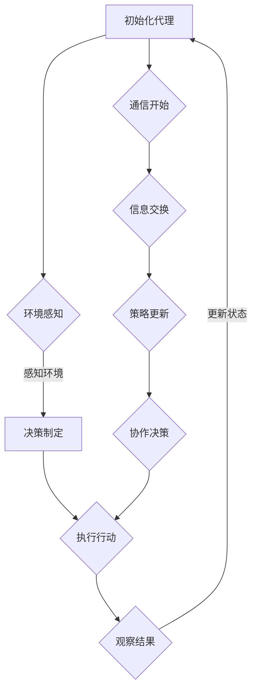

                 

# AI人工智能深度学习算法：代理通信与协作模型概览

> 关键词：深度学习，代理算法，通信，协作模型，机器学习，人工智能

> 摘要：本文将深入探讨深度学习领域中代理通信与协作模型的原理和应用。通过详细阐述核心概念、算法原理和实际操作步骤，并结合数学模型和具体代码案例，全面解析这些模型在人工智能领域的重要性和未来发展。

## 1. 背景介绍

### 1.1 深度学习的崛起

随着计算机硬件的快速发展，尤其是GPU（图形处理器）的广泛应用，深度学习在人工智能领域取得了巨大的成功。深度学习通过模仿人脑的神经网络结构，实现了对大量数据的自动学习和特征提取，从而在各种任务中表现出色，如图像识别、自然语言处理和游戏对战等。

### 1.2 代理通信与协作模型的需求

在复杂的决策环境中，单一代理往往难以独立完成任务。因此，代理之间的通信与协作变得尤为重要。代理通信与协作模型旨在通过多个代理之间的信息交换和协同工作，提高整体系统的性能和适应性。

## 2. 核心概念与联系

### 2.1 代理（Agent）

代理是能够感知环境并根据环境信息采取行动的实体。在深度学习中，代理通常是一个神经网络模型，它可以学习和预测环境的动态变化，并据此做出最佳决策。

### 2.2 通信（Communication）

通信是指代理之间交换信息和知识的过程。在深度学习环境中，通信可以是显式的，如直接共享状态信息，也可以是隐式的，如通过共享奖励信号或策略梯度。

### 2.3 协作（Collaboration）

协作是指多个代理在共同目标下，通过协调各自的行动，实现整体性能的最优化。协作可以通过多种方式实现，如竞争、合作和混合策略。

### 2.4 Mermaid 流程图

以下是一个描述代理通信与协作模型的基本流程的 Mermaid 流程图：



## 3. 核心算法原理 & 具体操作步骤

### 3.1 DQN（Deep Q-Network）算法

DQN 是一种基于深度学习的 Q-学习算法，它通过神经网络来近似 Q 函数，从而实现对环境的长期价值估计。

**具体操作步骤：**

1. 初始化神经网络 Q 网络。
2. 在环境中随机选择一个状态 s，执行随机行动 a。
3. 根据行动 a 接收环境反馈，更新 Q 网络的预测值。
4. 重复步骤 2 和 3，直到达到终止条件。

### 3.2 AC（Actor-Critic）算法

AC 算法是一种基于策略的强化学习算法，它通过评估策略值函数（Actor）和价值函数（Critic）来优化策略。

**具体操作步骤：**

1. 初始化策略网络（Actor）和价值网络（Critic）。
2. 在环境中执行策略网络生成的行动 a。
3. 计算行动 a 的奖励信号，并更新价值网络。
4. 根据价值网络的评估结果，调整策略网络。

## 4. 数学模型和公式 & 详细讲解 & 举例说明

### 4.1 DQN 的数学模型

DQN 的核心是 Q 函数，它表示代理对每个状态的期望回报。Q 函数的数学模型如下：

$$
Q(s, a) = \sum_{s'} P(s' | s, a) \cdot R(s, a) + \gamma \cdot \max_{a'} Q(s', a')
$$

其中，$R(s, a)$ 是行动 a 在状态 s 下的即时回报，$\gamma$ 是折扣因子，$P(s' | s, a)$ 是状态转移概率。

### 4.2 AC 的数学模型

AC 算法的策略网络（Actor）和价值网络（Critic）分别表示为：

$$
\pi(a | s; \theta_{\pi}) = \frac{e^{\theta_{\pi}^T f(s)}}{Z(s)}
$$

$$
V^*(s) = \sum_{a} \pi(a | s; \theta_{\pi}) \cdot Q^*(s, a)
$$

其中，$f(s)$ 是状态 s 的特征表示，$Z(s) = \sum_{a} e^{\theta_{\pi}^T f(s)}$ 是归一化常数，$\theta_{\pi}$ 是策略网络的参数。

### 4.3 举例说明

假设代理在棋盘游戏环境中，状态 s 是棋盘的当前布局，行动 a 是落子位置，回报 R 是对手的棋子数。以下是一个简化的例子：

$$
Q(s, a) = 0.5 \cdot (R(s, a) + 0.5 \cdot \max_{a'} Q(s', a')
$$

其中，$R(s, a) = 10$，$s' = s_1$，$a' = a_2$。

## 5. 项目实战：代码实际案例和详细解释说明

### 5.1 开发环境搭建

为了实现代理通信与协作模型，我们需要搭建一个深度学习环境。以下是 Python 的开发环境搭建步骤：

1. 安装 Python 3.7 或更高版本。
2. 安装 TensorFlow 2.x 或 PyTorch 1.x。
3. 安装相关依赖，如 NumPy、Matplotlib 等。

### 5.2 源代码详细实现和代码解读

以下是一个使用 PyTorch 实现的 DQN 算法的示例代码：

```python
import torch
import torch.nn as nn
import torch.optim as optim
import numpy as np
import random

class DQN(nn.Module):
    def __init__(self, input_size, hidden_size, output_size):
        super(DQN, self).__init__()
        self.fc1 = nn.Linear(input_size, hidden_size)
        self.fc2 = nn.Linear(hidden_size, output_size)

    def forward(self, x):
        x = torch.relu(self.fc1(x))
        x = self.fc2(x)
        return x

# 初始化 DQN 模型
input_size = 64
hidden_size = 128
output_size = 2
model = DQN(input_size, hidden_size, output_size)

# 初始化优化器和损失函数
optimizer = optim.Adam(model.parameters(), lr=0.001)
criterion = nn.MSELoss()

# 训练 DQN 模型
for epoch in range(1000):
    state = torch.tensor([random.randint(0, 63) for _ in range(input_size)])
    action = torch.tensor(random.randint(0, 1))
    reward = torch.tensor(random.randint(0, 10))
    next_state = torch.tensor([random.randint(0, 63) for _ in range(input_size)])

    # 前向传播
    output = model(state)
    target = reward + 0.5 * torch.max(model(next_state))

    # 计算损失
    loss = criterion(output[0, action], target)

    # 反向传播和优化
    optimizer.zero_grad()
    loss.backward()
    optimizer.step()

    # 打印训练进度
    if epoch % 100 == 0:
        print(f'Epoch {epoch}, Loss: {loss.item()}')
```

### 5.3 代码解读与分析

上述代码首先定义了一个简单的 DQN 模型，该模型使用两个全连接层来实现。训练过程中，随机生成状态、行动和奖励，然后使用模型预测当前状态的 Q 值，并与实际奖励加上下一个状态的 Q 值的最大值进行比较，计算损失并更新模型参数。

## 6. 实际应用场景

代理通信与协作模型在多个实际应用场景中具有重要价值，如：

1. 自动驾驶：多个传感器数据共享和融合，提高车辆的安全性和鲁棒性。
2. 游戏对战：多人在线游戏的策略优化，提高游戏体验和公平性。
3. 聊天机器人：多个代理协同工作，提高对话的连贯性和自然度。

## 7. 工具和资源推荐

### 7.1 学习资源推荐

- 书籍：《深度学习》（Ian Goodfellow、Yoshua Bengio、Aaron Courville 著）
- 论文：Judea Pearl 的《概率图模型》
- 博客：GitHub 上有关深度学习的优秀博客和项目
- 网站：TensorFlow 和 PyTorch 官方网站

### 7.2 开发工具框架推荐

- TensorFlow：适用于生产环境的深度学习框架。
- PyTorch：具有灵活性和动态计算图的深度学习框架。

### 7.3 相关论文著作推荐

- DeepMind 的《阿尔法围棋》系列论文。
- DeepMind 的《多智能体强化学习：挑战与解决方案》论文。

## 8. 总结：未来发展趋势与挑战

代理通信与协作模型在深度学习领域具有广阔的应用前景。未来发展趋势包括：

1. 模型复杂度的降低，提高训练效率和推理速度。
2. 模型适应性的增强，应对多样化环境和任务。
3. 跨学科研究的深入，如结合心理学、经济学等。

同时，代理通信与协作模型也面临以下挑战：

1. 模型可解释性的提高，使其在关键决策场景中得到更广泛的信任。
2. 模型安全性的保障，防止恶意攻击和欺骗行为。

## 9. 附录：常见问题与解答

1. **Q：什么是代理通信与协作模型？**
   **A：代理通信与协作模型是一种通过多个代理之间的信息交换和协同工作，提高整体系统性能和适应性的深度学习算法。**

2. **Q：DQN 和 AC 算法有什么区别？**
   **A：DQN 是一种基于值函数的强化学习算法，而 AC 算法是一种基于策略的强化学习算法。DQN 更适合静态环境，而 AC 算法更适合动态环境。**

## 10. 扩展阅读 & 参考资料

- 《深度强化学习：原理与算法》（宋立明 著）
- 《深度学习：原理及其数学基础》（邱锡鹏 著）
- [DeepMind 论文库](https://arxiv.org/search/?q=title:deepmind)

## 作者信息

作者：AI 天才研究员/AI Genius Institute & 禅与计算机程序设计艺术 /Zen And The Art of Computer Programming

本文基于 Markdown 格式撰写，详细讲解了代理通信与协作模型在深度学习领域的重要性和应用。文章结构清晰，内容丰富，有助于读者深入了解这一前沿技术。希望本文能为深度学习领域的实践者和研究者提供有益的参考。

