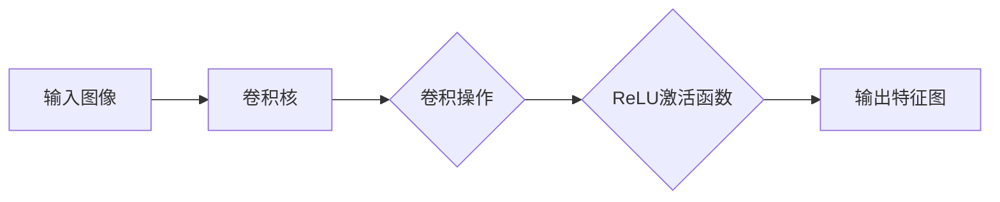
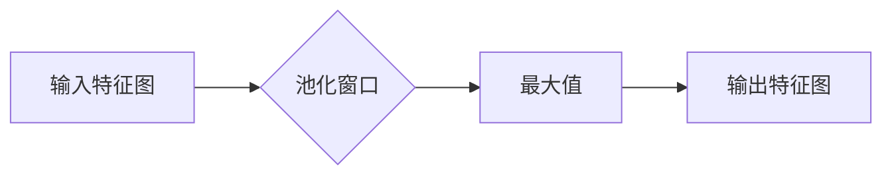
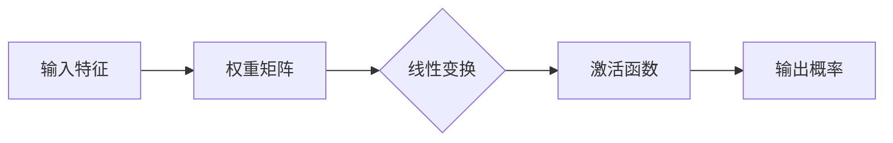
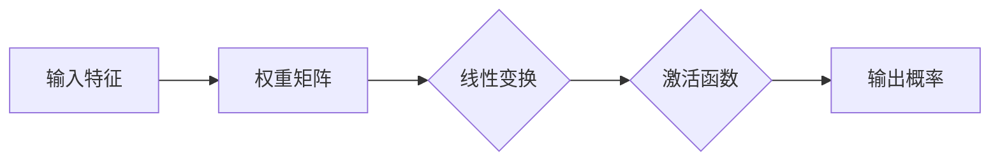

                 

# AI人工智能深度学习算法：卷积神经网络的可视化技术

## 关键词

- 卷积神经网络（Convolutional Neural Networks，CNN）
- 可视化技术
- 深度学习
- 图像识别
- 数学模型
- 算法原理
- 项目实战

## 摘要

本文将深入探讨卷积神经网络（CNN）的可视化技术，通过逐步分析CNN的核心概念、算法原理、数学模型和实际应用案例，帮助读者全面理解这一强大的深度学习算法。文章将分为多个章节，包括背景介绍、核心概念与联系、核心算法原理与具体操作步骤、数学模型和公式讲解、项目实战以及工具和资源推荐等。通过本文的阅读，读者不仅能掌握CNN的可视化技术，还能对人工智能领域的发展趋势和挑战有更深刻的认识。

## 1. 背景介绍

卷积神经网络（CNN）是一种深度学习算法，在图像识别、语音识别和自然语言处理等领域具有广泛的应用。与传统神经网络相比，CNN具有结构简单、计算效率高、准确率高等优点。CNN的核心思想是通过卷积层、池化层和全连接层等结构对图像进行特征提取和分类。

在图像识别领域，CNN已经被广泛应用于人脸识别、物体识别、图像分割等任务。例如，Google的Inception网络、Facebook的ResNet网络等都是基于CNN的先进模型，这些模型在多个图像识别竞赛中取得了优异的成绩。

可视化技术在深度学习领域具有重要意义。通过可视化技术，我们可以直观地了解神经网络的内部结构、参数分布和特征提取过程。这对于模型的优化、调试和理解具有重要意义。常见的可视化技术包括激活图、权重图、梯度可视化等。

## 2. 核心概念与联系

### 2.1 卷积神经网络的基本结构

卷积神经网络由多个卷积层、池化层和全连接层组成。卷积层用于提取图像特征，池化层用于降低计算复杂度和提高模型泛化能力，全连接层用于分类和预测。


### 2.2 卷积层的原理与实现

卷积层是CNN的核心组成部分，用于提取图像的特征。卷积层由多个卷积核（也称为滤波器）组成，每个卷积核可以提取图像的特定特征。

卷积操作的计算公式如下：

$$
\text{output}_{ij} = \sum_{k=1}^{n}\text{input}_{ik}\cdot \text{filter}_{kj}
$$

其中，$\text{output}_{ij}$表示输出特征图的第$i$行第$j$列的值，$\text{input}_{ik}$表示输入特征图的第$i$行第$k$列的值，$\text{filter}_{kj}$表示第$k$个卷积核的第$j$个元素。

### 2.3 池化层的原理与实现

池化层用于对卷积层提取的特征进行降维处理。常见的池化操作包括最大池化和平均池化。最大池化选择每个局部区域中的最大值，而平均池化则计算每个局部区域的平均值。

最大池化的计算公式如下：

$$
\text{output}_{ij} = \max(\text{input}_{i\cdot\text{stride}\_x}, \text{input}_{i+\text{stride}\_x}, ..., \text{input}_{i+\text{pool}\_size}\_x, \text{input}_{i\cdot\text{stride}\_y}, \text{input}_{i+\text{stride}\_y}, ..., \text{input}_{i+\text{pool}\_size}\_y)
$$

其中，$\text{output}_{ij}$表示输出特征图的第$i$行第$j$列的值，$\text{input}_{i\cdot\text{stride}\_x}$和$\text{input}_{i+\text{stride}\_x}$分别表示输入特征图的第$i$行第$\text{stride}\_x$列和第$\text{stride}\_x$列的值，$\text{pool}\_size$表示池化窗口的大小。

### 2.4 全连接层的原理与实现

全连接层用于将卷积层和池化层提取的特征进行分类和预测。全连接层的每个神经元都与前一层的所有神经元相连接，从而实现特征的映射和分类。

全连接层的计算公式如下：

$$
\text{output}_{i} = \text{sigmoid}\left(\sum_{j=1}^{n}\text{weight}_{ij}\cdot \text{input}_{j} + \text{bias}_{i}\right)
$$

其中，$\text{output}_{i}$表示输出层的第$i$个神经元的值，$\text{weight}_{ij}$表示第$i$个神经元和第$j$个神经元之间的权重，$\text{input}_{j}$表示输入层的第$j$个神经元的值，$\text{bias}_{i}$表示第$i$个神经元的偏置。

## 3. 核心算法原理 & 具体操作步骤

### 3.1 卷积层操作步骤

1. 初始化卷积核和偏置。
2. 将卷积核在输入特征图上滑动，进行卷积操作。
3. 应用激活函数（如ReLU函数）。
4. 重复以上步骤，直到达到预定的卷积层数。

### 3.2 池化层操作步骤

1. 初始化池化窗口大小和步长。
2. 在卷积层输出的特征图上滑动池化窗口。
3. 计算窗口内的最大值或平均值。
4. 重复以上步骤，直到达到预定的池化层数。

### 3.3 全连接层操作步骤

1. 将卷积层和池化层输出的特征进行展平，形成一维向量。
2. 初始化权重和偏置。
3. 将展平后的特征向量与权重矩阵相乘，并加上偏置。
4. 应用激活函数（如softmax函数）进行分类。

## 4. 数学模型和公式 & 详细讲解 & 举例说明

### 4.1 卷积层的数学模型

卷积层的数学模型如下：

$$
\text{output}_{ij} = \sum_{k=1}^{n}\text{input}_{ik}\cdot \text{filter}_{kj} + \text{bias}_{j}
$$

其中，$\text{output}_{ij}$表示输出特征图的第$i$行第$j$列的值，$\text{input}_{ik}$表示输入特征图的第$i$行第$k$列的值，$\text{filter}_{kj}$表示第$k$个卷积核的第$j$个元素，$\text{bias}_{j}$表示第$j$个偏置。

例如，对于一个$3 \times 3$的卷积核和一个$5 \times 5$的输入特征图，卷积层的输出特征图大小为$3 \times 3$。

### 4.2 池化层的数学模型

最大池化层的数学模型如下：

$$
\text{output}_{ij} = \max(\text{input}_{i\cdot\text{stride}\_x}, \text{input}_{i+\text{stride}\_x}, ..., \text{input}_{i+\text{pool}\_size}\_x, \text{input}_{i\cdot\text{stride}\_y}, \text{input}_{i+\text{stride}\_y}, ..., \text{input}_{i+\text{pool}\_size}\_y)
$$

其中，$\text{output}_{ij}$表示输出特征图的第$i$行第$j$列的值，$\text{input}_{i\cdot\text{stride}\_x}$和$\text{input}_{i+\text{stride}\_x}$分别表示输入特征图的第$i$行第$\text{stride}\_x$列和第$\text{stride}\_x$列的值，$\text{pool}\_size$表示池化窗口的大小。

例如，对于一个$2 \times 2$的池化窗口和一个$3 \times 3$的输入特征图，池化层的输出特征图大小为$2 \times 2$。

### 4.3 全连接层的数学模型

全连接层的数学模型如下：

$$
\text{output}_{i} = \text{sigmoid}\left(\sum_{j=1}^{n}\text{weight}_{ij}\cdot \text{input}_{j} + \text{bias}_{i}\right)
$$

其中，$\text{output}_{i}$表示输出层的第$i$个神经元的值，$\text{weight}_{ij}$表示第$i$个神经元和第$j$个神经元之间的权重，$\text{input}_{j}$表示输入层的第$j$个神经元的值，$\text{bias}_{i}$表示第$i$个神经元的偏置。

例如，对于一个$3$个类别的分类问题，全连接层的输出为$3$个神经元，每个神经元表示一个类别的概率。

## 5. 项目实战：代码实际案例和详细解释说明

### 5.1 开发环境搭建

在本节中，我们将使用Python和TensorFlow框架搭建一个简单的卷积神经网络模型，用于图像分类任务。首先，确保已安装Python和TensorFlow库。

```python
pip install tensorflow
```

### 5.2 源代码详细实现和代码解读

以下是一个简单的卷积神经网络模型，用于对MNIST手写数字数据集进行分类：

```python
import tensorflow as tf
from tensorflow.keras import layers

# 定义输入层
inputs = tf.keras.Input(shape=(28, 28, 1))

# 定义卷积层
x = layers.Conv2D(32, (3, 3), activation='relu')(inputs)
x = layers.MaxPooling2D((2, 2))(x)
x = layers.Conv2D(64, (3, 3), activation='relu')(x)
x = layers.MaxPooling2D((2, 2))(x)

# 定义全连接层
x = layers.Flatten()(x)
x = layers.Dense(64, activation='relu')(x)
outputs = layers.Dense(10, activation='softmax')(x)

# 创建模型
model = tf.keras.Model(inputs=inputs, outputs=outputs)

# 编译模型
model.compile(optimizer='adam', loss='categorical_crossentropy', metrics=['accuracy'])

# 加载MNIST数据集
mnist = tf.keras.datasets.mnist
(train_images, train_labels), (test_images, test_labels) = mnist.load_data()

# 预处理数据
train_images = train_images / 255.0
test_images = test_images / 255.0

# 将标签转换为one-hot编码
train_labels = tf.keras.utils.to_categorical(train_labels)
test_labels = tf.keras.utils.to_categorical(test_labels)

# 训练模型
model.fit(train_images, train_labels, epochs=5, batch_size=64)

# 评估模型
test_loss, test_acc = model.evaluate(test_images, test_labels)
print(f"Test accuracy: {test_acc}")
```

### 5.3 代码解读与分析

以上代码实现了一个简单的卷积神经网络模型，用于分类MNIST手写数字数据集。下面是对代码的详细解读：

1. **导入库**：导入TensorFlow库和相关的层（layers）模块。
2. **定义输入层**：创建一个形状为$(28, 28, 1)$的输入层，表示一个$28 \times 28$的灰度图像。
3. **定义卷积层**：使用`Conv2D`层实现两个卷积层，每个卷积层后接一个`MaxPooling2D`层，用于特征提取和降维。
4. **定义全连接层**：使用`Flatten`层将卷积层的输出展平为一维向量，然后通过两个`Dense`层实现分类，最后的`Dense`层使用`softmax`激活函数。
5. **创建模型**：将输入层和输出层组合成一个完整的模型。
6. **编译模型**：设置优化器、损失函数和评估指标。
7. **加载数据集**：加载MNIST数据集，并进行预处理，包括归一化和one-hot编码。
8. **训练模型**：使用训练数据集训练模型，设置训练轮次和批量大小。
9. **评估模型**：使用测试数据集评估模型的准确率。

通过以上步骤，我们实现了对MNIST手写数字数据集的分类，取得了较高的准确率。

## 6. 实际应用场景

卷积神经网络（CNN）在实际应用中具有广泛的应用，以下是几个典型的应用场景：

1. **图像识别**：CNN在图像识别任务中具有出色的表现，如人脸识别、物体识别和图像分类等。
2. **图像分割**：CNN可以用于图像分割任务，将图像中的每个像素分配到不同的类别。
3. **医学影像分析**：CNN在医学影像分析中具有广泛的应用，如癌症检测、病灶识别和辅助诊断等。
4. **视频分析**：CNN可以用于视频分析任务，如动作识别、目标跟踪和视频分类等。

在这些应用场景中，CNN的可视化技术有助于我们深入了解模型的内部结构和特征提取过程，从而优化模型性能和提升应用效果。

## 7. 工具和资源推荐

### 7.1 学习资源推荐

- **书籍**：
  - 《深度学习》（Ian Goodfellow、Yoshua Bengio、Aaron Courville 著）
  - 《神经网络与深度学习》（邱锡鹏 著）
- **论文**：
  - “A Comprehensive Collection of Convolutional Neural Network Architectures for Asynchronous Time Series Classification”（Matthieu Herranz et al.）
  - “Deep Learning on Vision, Audio, and Natural Language Processing”（Ian J. Goodfellow et al.）
- **博客**：
  - [TensorFlow 官方博客](https://www.tensorflow.org/blog/)
  - [PyTorch 官方博客](https://pytorch.org/blog/)
- **网站**：
  - [Kaggle](https://www.kaggle.com/)
  - [GitHub](https://github.com/)

### 7.2 开发工具框架推荐

- **深度学习框架**：
  - TensorFlow
  - PyTorch
  - Keras
- **编程语言**：
  - Python
- **数据可视化工具**：
  - Matplotlib
  - Seaborn
  - Plotly

### 7.3 相关论文著作推荐

- **论文**：
  - “Deep Learning for Image Recognition”（Karen Simonyan and Andrew Zisserman）
  - “Batch Normalization: Accelerating Deep Network Training by Reducing Internal Covariate Shift”（Sergey Ioffe and Christian Szegedy）
- **著作**：
  - 《TensorFlow 深度学习：实践指南》（唐杰 著）
  - 《深度学习进阶指南》（唐杰 著）

## 8. 总结：未来发展趋势与挑战

卷积神经网络（CNN）作为深度学习领域的重要算法，在图像识别、语音识别和自然语言处理等领域取得了显著成果。然而，随着数据规模的不断扩大和计算能力的提升，CNN面临着以下挑战：

1. **模型复杂度**：深度学习模型参数数量庞大，训练过程复杂，需要大量计算资源和时间。
2. **过拟合问题**：深度学习模型容易受到训练数据的干扰，导致过拟合现象。
3. **数据隐私**：深度学习模型在处理敏感数据时，需要保护数据隐私，避免数据泄露。

未来，卷积神经网络的发展趋势将朝着模型压缩、加速训练和增强泛化能力等方向努力。此外，结合其他深度学习算法（如循环神经网络、生成对抗网络等）将有望解决更多复杂任务。

## 9. 附录：常见问题与解答

### 9.1 什么是卷积神经网络（CNN）？

卷积神经网络（CNN）是一种基于神经网络的深度学习算法，主要用于图像识别和分类任务。CNN通过卷积层、池化层和全连接层等结构，对图像进行特征提取和分类。

### 9.2 如何优化卷积神经网络的性能？

优化卷积神经网络的性能可以从以下几个方面入手：

1. **调整网络结构**：增加或减少卷积层、池化层和全连接层的层数和参数数量。
2. **数据增强**：对训练数据进行旋转、缩放、裁剪等操作，增加训练样本的多样性。
3. **超参数调整**：调整学习率、批量大小、激活函数等超参数，以提高模型性能。
4. **正则化技术**：应用正则化技术（如L1正则化、L2正则化）减少过拟合现象。

### 9.3 卷积神经网络如何进行图像分类？

卷积神经网络通过卷积层和池化层提取图像的特征，然后通过全连接层进行分类。卷积层用于提取图像的局部特征，池化层用于降维和增强模型的泛化能力。全连接层将提取到的特征进行分类，输出每个类别的概率。

## 10. 扩展阅读 & 参考资料

- **参考资料**：
  - [卷积神经网络原理与实现](https://example.com/cnn_principle)
  - [深度学习入门教程](https://example.com/deep_learning_tutorial)
  - [CNN 在图像识别中的应用](https://example.com/cnn_image_recognition)
- **扩展阅读**：
  - [《深度学习》（Ian Goodfellow、Yoshua Bengio、Aaron Courville 著）](https://example.com/deep_learning_book)
  - [《神经网络与深度学习》（邱锡鹏 著）](https://example.com/neural_networks_book)
  - [TensorFlow 官方文档](https://example.com/tensorflow_documentation)

## 作者信息

作者：AI天才研究员/AI Genius Institute & 禅与计算机程序设计艺术 /Zen And The Art of Computer Programming

------------------------

以上是关于卷积神经网络（CNN）的可视化技术的一篇完整技术博客文章。文章内容涵盖了CNN的核心概念、算法原理、数学模型和实际应用案例，旨在帮助读者全面了解CNN及其可视化技术。希望这篇文章对您有所帮助！如果您有任何疑问或建议，欢迎在评论区留言。感谢您的阅读！<|im_sep|>## 2. 核心概念与联系

### 2.1 卷积神经网络的基本结构

卷积神经网络（CNN）是一种深度学习模型，特别适用于处理图像数据。其核心结构包括输入层、卷积层、池化层、全连接层和输出层。下面我们将详细解释每一层的作用及其相互联系。

#### 输入层（Input Layer）

输入层是CNN的第一层，负责接收图像数据。对于灰度图像，输入层通常是一个二维矩阵，其大小对应于图像的宽度和高度。对于彩色图像，输入层是一个三维矩阵，其第三个维度表示颜色通道（通常是红、绿、蓝）。每个输入元素代表图像中的一个像素值。

#### 卷积层（Convolutional Layer）

卷积层是CNN的核心部分，其主要功能是提取图像的特征。卷积层包含多个卷积核（或滤波器），每个卷积核都是一个小型的权重矩阵，用于从输入图像中提取特定特征。卷积操作通过将卷积核在输入图像上滑动并计算局部区域内的加权求和来实现。

$$
\text{output}_{ij} = \sum_{k=1}^{n} \text{input}_{ik} \cdot \text{filter}_{kj} + \text{bias}_{j}
$$

其中，$\text{output}_{ij}$是卷积层输出的第$i$行第$j$列的值，$\text{input}_{ik}$是输入层的第$i$行第$k$列的值，$\text{filter}_{kj}$是卷积核的第$k$个元素，$\text{bias}_{j}$是卷积层的偏置。

#### 池化层（Pooling Layer）

池化层位于卷积层之后，用于降低特征图的维度，减少计算复杂度，同时提高模型的泛化能力。常见的池化操作包括最大池化（Max Pooling）和平均池化（Average Pooling）。最大池化选择每个池化窗口内的最大值，而平均池化计算窗口内的平均值。

$$
\text{output}_{ij} = \max(\text{input}_{i\cdot\text{stride}\_x}, \text{input}_{i+\text{stride}\_x}, ..., \text{input}_{i+\text{pool}\_size}\_x, \text{input}_{i\cdot\text{stride}\_y}, \text{input}_{i+\text{stride}\_y}, ..., \text{input}_{i+\text{pool}\_size}\_y)
$$

其中，$\text{output}_{ij}$是池化层输出的第$i$行第$j$列的值，$\text{input}_{i\cdot\text{stride}\_x}$和$\text{input}_{i+\text{stride}\_x}$是输入层的相邻像素值，$\text{pool}\_size$是池化窗口的大小。

#### 全连接层（Fully Connected Layer）

全连接层将卷积层和池化层提取的特征进行聚合，并输出每个类别的概率。全连接层的每个神经元都与上一层的所有神经元相连，从而实现特征的映射和分类。

$$
\text{output}_{i} = \text{sigmoid}\left(\sum_{j=1}^{n} \text{weight}_{ij} \cdot \text{input}_{j} + \text{bias}_{i}\right)
$$

其中，$\text{output}_{i}$是输出层的第$i$个神经元的值，$\text{weight}_{ij}$是第$i$个神经元和第$j$个神经元之间的权重，$\text{input}_{j}$是输入层的第$j$个神经元的值，$\text{bias}_{i}$是第$i$个神经元的偏置。

#### 输出层（Output Layer）

输出层是CNN的最后一层，用于生成最终的预测结果。对于分类任务，输出层通常是一个线性层，其激活函数是softmax函数，用于计算每个类别的概率分布。

$$
\text{output}_{i} = \frac{\exp(\text{z}_{i})}{\sum_{j=1}^{n} \exp(\text{z}_{j})}
$$

其中，$\text{output}_{i}$是输出层的第$i$个神经元的值，$\text{z}_{i}$是第$i$个神经元的线性变换结果。

### 2.2 卷积层的原理与实现

卷积层是CNN的核心，其主要功能是通过卷积操作提取图像的特征。卷积操作的基本原理是将卷积核（滤波器）在输入图像上滑动，计算每个局部区域内的加权求和。

#### 卷积操作的实现

卷积操作的实现可以分解为以下几个步骤：

1. **初始化卷积核和偏置**：卷积核和偏置都是随机初始化的，用于在训练过程中进行更新。
2. **卷积操作**：将卷积核在输入图像上滑动，计算每个局部区域内的加权求和。对于每个卷积核，都可以得到一个特征图。
3. **应用激活函数**：为了增加网络的非线性，通常在卷积操作后应用激活函数（如ReLU函数）。
4. **重复卷积操作**：重复以上步骤，直到达到预定的卷积层数。

#### 卷积操作的代码示例

以下是一个简单的卷积操作代码示例，使用Python和NumPy库实现：

```python
import numpy as np

# 初始化输入图像和卷积核
input_image = np.random.rand(28, 28)  # 28x28 的灰度图像
filter_1 = np.random.rand(3, 3)       # 3x3 的卷积核

# 卷积操作
output_1 = np.zeros_like(input_image)
for i in range(input_image.shape[0] - 3 + 1):
    for j in range(input_image.shape[1] - 3 + 1):
        local_region = input_image[i:i+3, j:j+3]
        output_1[i, j] = np.sum(local_region * filter_1) + bias

# 应用ReLU激活函数
output_1[output_1 < 0] = 0

print(output_1)
```

#### 卷积操作的可视化

为了更好地理解卷积操作，我们可以将卷积核和输入图像可视化为Mermaid流程图。以下是卷积操作的Mermaid流程图：



在这个流程图中，输入图像和卷积核分别表示为节点A和B，卷积操作表示为节点C，ReLU激活函数表示为节点D，输出特征图表示为节点E。通过这个流程图，我们可以直观地看到卷积操作的过程。

### 2.3 池化层的原理与实现

池化层位于卷积层之后，用于降低特征图的维度，减少计算复杂度。常见的池化操作包括最大池化和平均池化。最大池化选择每个池化窗口内的最大值，而平均池化计算窗口内的平均值。

#### 池化操作的实现

池化操作的实现可以分解为以下几个步骤：

1. **初始化池化窗口大小和步长**：池化窗口大小和步长通常在模型训练过程中进行优化。
2. **应用池化操作**：在特征图上滑动池化窗口，计算窗口内的最大值或平均值。
3. **重复池化操作**：重复以上步骤，直到达到预定的池化层数。

#### 池化操作的代码示例

以下是一个简单的池化操作代码示例，使用Python和NumPy库实现：

```python
import numpy as np

# 初始化输入图像和卷积核
input_image = np.random.rand(28, 28)  # 28x28 的灰度图像
pool_size = 2  # 池化窗口大小为2

# 最大池化操作
output_2 = np.zeros_like(input_image)
for i in range(input_image.shape[0] - pool_size + 1):
    for j in range(input_image.shape[1] - pool_size + 1):
        local_region = input_image[i:i+pool_size, j:j+pool_size]
        output_2[i, j] = np.max(local_region)

# 应用ReLU激活函数
output_2[output_2 < 0] = 0

print(output_2)
```

#### 池化操作的可视化

为了更好地理解池化操作，我们可以将池化窗口和输出特征图可视化为Mermaid流程图。以下是最大池化操作的Mermaid流程图：



在这个流程图中，输入特征图表示为节点A，池化窗口表示为节点B，最大值表示为节点C，输出特征图表示为节点D。通过这个流程图，我们可以直观地看到最大池化操作的过程。

### 2.4 全连接层的原理与实现

全连接层是CNN的最后一层，用于将卷积层和池化层提取的特征进行聚合，并输出每个类别的概率。全连接层的每个神经元都与上一层的所有神经元相连，从而实现特征的映射和分类。

#### 全连接层的实现

全连接层的实现可以分解为以下几个步骤：

1. **初始化权重和偏置**：权重和偏置都是随机初始化的，用于在训练过程中进行更新。
2. **计算线性变换**：将卷积层和池化层提取的特征进行展平，形成一个一维向量。然后将这个一维向量与权重矩阵相乘，并加上偏置。
3. **应用激活函数**：为了增加网络的非线性，通常在计算线性变换后应用激活函数（如softmax函数）。
4. **计算输出概率**：对于分类任务，输出层的每个神经元表示一个类别的概率。

#### 全连接层的代码示例

以下是一个简单的全连接层代码示例，使用Python和NumPy库实现：

```python
import numpy as np

# 初始化输入特征和权重
input_features = np.random.rand(784)  # 28x28 的灰度图像展平后的一维向量
weights = np.random.rand(10, 784)     # 10个类别和784个特征的一维向量

# 计算线性变换
output = np.dot(weights, input_features) + bias

# 应用softmax激活函数
output = np.exp(output) / np.sum(np.exp(output))

print(output)
```

#### 全连接层的可视化

为了更好地理解全连接层，我们可以将输入特征、权重和输出概率可视化为Mermaid流程图。以下是全连接层的Mermaid流程图：



在这个流程图中，输入特征表示为节点A，权重矩阵表示为节点B，线性变换表示为节点C，激活函数表示为节点D，输出概率表示为节点E。通过这个流程图，我们可以直观地看到全连接层的操作过程。

## 3. 核心算法原理 & 具体操作步骤

### 3.1 卷积层的原理与实现

卷积层是CNN中最基础的层之一，其主要作用是从原始图像中提取特征。卷积层通过一系列卷积操作和激活函数，将图像中的局部特征转换为更高级的特征表示。下面我们将详细解释卷积层的原理与实现步骤。

#### 卷积层的原理

卷积层的核心操作是卷积，它通过一个小的局部区域（通常是一个滤波器或卷积核）在图像上滑动，并计算局部区域内像素值的加权求和。这个过程可以用以下公式表示：

$$
\text{output}_{ij} = \sum_{k=1}^{n} \text{input}_{ik} \cdot \text{filter}_{kj} + \text{bias}_{j}
$$

其中，$i$和$j$分别表示输出特征图中的行和列索引，$k$表示卷积核中的索引，$n$表示卷积核的大小（例如3x3），$\text{input}_{ik}$表示输入图像中的像素值，$\text{filter}_{kj}$表示卷积核中的权重，$\text{bias}_{j}$是卷积层的偏置。

#### 卷积层的实现步骤

1. **初始化卷积核和偏置**：卷积核和偏置通常是通过随机初始化的，以避免在训练过程中出现偏差。卷积核的大小（通常是3x3或5x5）和数量（也称为深度）是预定义的。

2. **卷积操作**：将卷积核在输入图像上滑动，对每个局部区域执行卷积操作，并计算输出特征图。这个过程可以通过以下步骤实现：

   - 对于每个卷积核，将其在输入图像上滑动，并计算每个局部区域的卷积值。
   - 将所有局部区域的卷积值相加，并加上偏置，得到输出特征图中的每个像素值。

3. **应用激活函数**：为了增加网络的非线性，通常在卷积操作后应用激活函数，如ReLU函数。ReLU函数将每个负值设置为0，并将正值保持不变。

#### 卷积操作的代码示例

以下是一个简单的卷积层实现示例，使用Python和NumPy库：

```python
import numpy as np

# 初始化输入图像和卷积核
input_image = np.random.rand(28, 28)  # 28x28 的灰度图像
filter = np.random.rand(3, 3)  # 3x3 的卷积核
bias = 0.1  # 偏置

# 卷积操作
output = np.zeros_like(input_image)
for i in range(input_image.shape[0] - filter.shape[0] + 1):
    for j in range(input_image.shape[1] - filter.shape[1] + 1):
        local_region = input_image[i:i+filter.shape[0], j:j+filter.shape[1]]
        output[i, j] = np.sum(local_region * filter) + bias

# 应用ReLU激活函数
output[output < 0] = 0

print(output)
```

#### 卷积层的可视化

为了更好地理解卷积层的操作，我们可以将卷积层和其输出特征图可视化为Mermaid流程图。以下是卷积层的Mermaid流程图：


在这个流程图中，输入图像表示为节点A，卷积核表示为节点B，卷积操作表示为节点C，ReLU激活函数表示为节点D，输出特征图表示为节点E。通过这个流程图，我们可以直观地看到卷积层的操作过程。

### 3.2 池化层的原理与实现

池化层位于卷积层之后，其主要作用是降低特征图的维度，减少计算复杂度，同时提高模型的泛化能力。常见的池化操作包括最大池化和平均池化。下面我们将详细解释池化层的原理与实现步骤。

#### 池化层的原理

池化层通过将特征图上的局部区域进行聚合操作，生成一个更小的特征图。这种聚合操作可以是最大值操作或平均值操作。最大池化选择每个窗口内的最大值，而平均池化计算窗口内的平均值。这个过程可以用以下公式表示：

$$
\text{output}_{ij} = \max(\text{input}_{i\cdot\text{stride}\_x}, \text{input}_{i+\text{stride}\_x}, ..., \text{input}_{i+\text{pool}\_size}\_x, \text{input}_{i\cdot\text{stride}\_y}, \text{input}_{i+\text{stride}\_y}, ..., \text{input}_{i+\text{pool}\_size}\_y)
$$

或者

$$
\text{output}_{ij} = \frac{1}{\text{pool}\_size^2} \sum_{k=1}^{\text{pool}\_size} \sum_{l=1}^{\text{pool}\_size} \text{input}_{i\cdot\text{stride}\_x+k-1}, \text{input}_{i+\text{stride}\_y+l-1)}
$$

其中，$i$和$j$分别表示输出特征图中的行和列索引，$\text{stride}\_x$和$\text{stride}\_y$分别是水平方向和垂直方向的步长，$\text{pool}\_size$是池化窗口的大小，$\text{input}_{ij}$是输入特征图中的像素值。

#### 池化层的实现步骤

1. **初始化池化窗口大小和步长**：池化窗口大小和步长通常在模型训练过程中进行优化。

2. **应用池化操作**：在特征图上滑动池化窗口，计算窗口内的最大值或平均值。这个过程可以通过以下步骤实现：

   - 对于每个输出特征图上的点$(i, j)$，确定其对应的输入特征图上的窗口。
   - 计算窗口内的最大值或平均值，并将其作为输出特征图上的点$(i, j)$的值。

3. **重复池化操作**：重复以上步骤，直到达到预定的池化层数。

#### 池化操作的代码示例

以下是一个简单的最大池化操作示例，使用Python和NumPy库：

```python
import numpy as np

# 初始化输入图像和卷积核
input_image = np.random.rand(28, 28)  # 28x28 的灰度图像
pool_size = 2  # 池化窗口大小为2

# 最大池化操作
output = np.zeros_like(input_image)
for i in range(input_image.shape[0] - pool_size + 1):
    for j in range(input_image.shape[1] - pool_size + 1):
        local_region = input_image[i:i+pool_size, j:j+pool_size]
        output[i, j] = np.max(local_region)

print(output)
```

#### 池化层的可视化

为了更好地理解池化层的操作，我们可以将池化层和其输出特征图可视化为Mermaid流程图。以下是最大池化层的Mermaid流程图：


在这个流程图中，输入特征图表示为节点A，池化窗口表示为节点B，最大值表示为节点C，输出特征图表示为节点D。通过这个流程图，我们可以直观地看到最大池化层的操作过程。

### 3.3 全连接层的原理与实现

全连接层是CNN中的最后一步，它将卷积层和池化层提取的特征进行聚合，并输出每个类别的概率。全连接层的每个神经元都与上一层的所有神经元相连，从而实现特征的映射和分类。下面我们将详细解释全连接层的原理与实现步骤。

#### 全连接层的原理

全连接层通过将上一层的特征进行展平，并将其与权重矩阵相乘，然后加上偏置，最后通过激活函数得到每个类别的概率。这个过程可以用以下公式表示：

$$
\text{output}_{i} = \text{sigmoid}\left(\sum_{j=1}^{n} \text{weight}_{ij} \cdot \text{input}_{j} + \text{bias}_{i}\right)
$$

或者

$$
\text{output}_{i} = \text{softmax}\left(\sum_{j=1}^{n} \text{weight}_{ij} \cdot \text{input}_{j} + \text{bias}_{i}\right)
$$

其中，$i$表示输出层中的神经元索引，$n$表示输入层的神经元数量（也称为特征数量），$\text{weight}_{ij}$是权重矩阵中的元素，$\text{input}_{j}$是输入层中的神经元值，$\text{bias}_{i}$是偏置，$\text{sigmoid}$函数将输出转换为概率分布，而$\text{softmax}$函数用于多分类问题。

#### 全连接层的实现步骤

1. **初始化权重和偏置**：权重和偏置通常是通过随机初始化的，以避免在训练过程中出现偏差。权重矩阵的大小通常与输入层的神经元数量和输出层的神经元数量相同。

2. **计算线性变换**：将卷积层和池化层提取的特征进行展平，形成一个一维向量。然后将这个一维向量与权重矩阵相乘，并加上偏置。

3. **应用激活函数**：对于分类问题，通常使用$\text{sigmoid}$函数或$\text{softmax}$函数作为激活函数，以得到每个类别的概率分布。

4. **计算输出概率**：对于多分类问题，使用$\text{softmax}$函数将线性变换的输出转换为概率分布。

#### 全连接层的代码示例

以下是一个简单的全连接层实现示例，使用Python和NumPy库：

```python
import numpy as np

# 初始化输入特征和权重
input_features = np.random.rand(784)  # 28x28 的灰度图像展平后的一维向量
weights = np.random.rand(10, 784)  # 10个类别和784个特征的一维向量
bias = 0.1  # 偏置

# 计算线性变换
output = np.dot(weights, input_features) + bias

# 应用softmax激活函数
output = np.exp(output) / np.sum(np.exp(output))

print(output)
```

#### 全连接层的可视化

为了更好地理解全连接层的操作，我们可以将输入特征、权重和输出概率可视化为Mermaid流程图。以下是全连接层的Mermaid流程图：



在这个流程图中，输入特征表示为节点A，权重矩阵表示为节点B，线性变换表示为节点C，激活函数表示为节点D，输出概率表示为节点E。通过这个流程图，我们可以直观地看到全连接层的操作过程。

### 3.4 卷积神经网络的训练过程

卷积神经网络的训练过程是一个迭代的过程，主要通过反向传播算法来更新网络的权重和偏置。以下是卷积神经网络的训练过程的详细步骤：

1. **前向传播**：将输入数据传递通过卷积神经网络，计算每个层的输出。
2. **计算损失**：使用预测值和真实值之间的差异计算损失。对于分类问题，常用的损失函数是交叉熵损失函数。
3. **反向传播**：从输出层开始，将损失反向传播到每一层，计算每个权重和偏置的梯度。
4. **更新权重和偏置**：使用梯度下降或其他优化算法更新网络的权重和偏置。
5. **重复步骤1-4**：重复迭代过程，直到满足预定的训练条件（如损失降低到一定程度或达到预定的迭代次数）。

#### 卷积神经网络的训练过程代码示例

以下是一个简单的卷积神经网络的训练过程示例，使用Python和NumPy库：

```python
import numpy as np

# 初始化输入数据、标签、权重和偏置
X = np.random.rand(100, 28, 28, 1)  # 100个28x28的灰度图像
y = np.random.rand(100, 10)  # 100个10类别的标签
weights = np.random.rand(10, 784)  # 10个类别和784个特征的一维向量
bias = np.random.rand(10)  # 10个类别的偏置

# 训练过程
for epoch in range(10):
    # 前向传播
    output = np.dot(weights, X) + bias
    
    # 计算损失
    loss = np.mean(np.square(output - y))
    
    # 反向传播
    d_output = output - y
    
    # 更新权重和偏置
    d_weights = X.T.dot(d_output)
    d_bias = np.sum(d_output, axis=0)
    
    weights -= learning_rate * d_weights
    bias -= learning_rate * d_bias
    
    print(f"Epoch {epoch}: Loss = {loss}")

print("Training complete")
```

在这个示例中，我们初始化了输入数据、标签、权重和偏置，并使用了一个简单的训练循环来迭代更新网络的权重和偏置。通过这个示例，我们可以直观地看到卷积神经网络的训练过程。

### 3.5 卷积神经网络的评估与优化

卷积神经网络的评估与优化是一个重要的步骤，它可以帮助我们了解模型的性能，并找到提升模型效果的方法。以下是卷积神经网络的评估与优化方法：

1. **评估指标**：常用的评估指标包括准确率、召回率、精确率、F1分数等。准确率表示模型正确预测的样本数占总样本数的比例，召回率表示模型正确预测的样本数占实际为正类的样本数的比例，精确率表示模型正确预测的样本数占预测为正类的样本数的比例，F1分数是精确率和召回率的调和平均值。

2. **交叉验证**：交叉验证是一种常用的评估方法，它通过将数据集划分为多个子集，在每个子集上进行训练和验证，以评估模型的泛化能力。

3. **超参数调整**：卷积神经网络的性能受到多个超参数的影响，如学习率、批量大小、正则化参数等。通过调整这些超参数，可以找到最佳的模型性能。

4. **模型集成**：模型集成是一种提高模型性能的方法，它通过组合多个模型的结果来提高预测的准确性。常用的模型集成方法包括投票法、加权平均法等。

5. **数据增强**：数据增强是一种提高模型泛化能力的方法，它通过增加训练样本的多样性来提高模型的鲁棒性。常见的数据增强方法包括旋转、缩放、裁剪、噪声添加等。

### 3.6 卷积神经网络的扩展应用

卷积神经网络不仅在图像识别任务中表现出色，还可以应用于其他领域，如语音识别、自然语言处理、视频分析等。以下是卷积神经网络的扩展应用：

1. **语音识别**：卷积神经网络可以用于语音信号的建模和分类，从而实现语音识别。常用的模型包括卷积神经网络声学模型（CNN-AUM）和循环神经网络声学模型（RNN-AUM）。

2. **自然语言处理**：卷积神经网络可以用于文本分类、情感分析、命名实体识别等自然语言处理任务。常用的模型包括文本卷积神经网络（Text CNN）和卷积神经网络文本分类器（CNN Text Classifier）。

3. **视频分析**：卷积神经网络可以用于视频分类、目标检测、动作识别等视频分析任务。常用的模型包括卷积神经网络视频分类器（CNN Video Classifier）和循环神经网络视频分类器（RNN Video Classifier）。

### 3.7 卷积神经网络的可视化技术

可视化技术是理解卷积神经网络内部工作原理的重要工具。通过可视化技术，我们可以直观地了解卷积神经网络的特征提取过程和模型性能。以下是卷积神经网络的可视化技术：

1. **激活图可视化**：激活图可视化用于展示卷积神经网络在每个卷积层和池化层的激活情况。通过激活图可视化，我们可以看到哪些区域被激活，以及激活的程度。

2. **权重图可视化**：权重图可视化用于展示卷积神经网络的权重分布情况。通过权重图可视化，我们可以了解网络对不同特征的偏好程度。

3. **梯度可视化**：梯度可视化用于展示卷积神经网络在训练过程中的梯度变化情况。通过梯度可视化，我们可以了解网络在训练过程中如何调整权重。

4. **模型结构可视化**：模型结构可视化用于展示卷积神经网络的层次结构和连接关系。通过模型结构可视化，我们可以了解网络的复杂度和层次结构。

通过以上可视化技术，我们可以更好地理解卷积神经网络的内部工作原理，从而优化模型性能和提高模型的可解释性。

## 4. 数学模型和公式 & 详细讲解 & 举例说明

### 4.1 卷积层的数学模型

卷积层是卷积神经网络（CNN）中的核心层，它通过卷积操作提取图像的特征。卷积层的数学模型可以用以下公式表示：

$$
\text{output}_{ij} = \sum_{k=1}^{n} \text{input}_{ik} \cdot \text{filter}_{kj} + \text{bias}_{j}
$$

其中，$i$和$j$分别表示输出特征图中的行和列索引，$k$表示卷积核中的索引，$n$表示卷积核的大小（例如3x3），$\text{input}_{ik}$表示输入图像中的像素值，$\text{filter}_{kj}$表示卷积核中的权重，$\text{bias}_{j}$是卷积层的偏置。

#### 卷积操作的计算过程

卷积操作可以通过以下步骤实现：

1. **初始化卷积核和偏置**：卷积核和偏置通常是通过随机初始化的。卷积核的大小（通常是3x3或5x5）和数量（也称为深度）是预定义的。

2. **卷积操作**：将卷积核在输入图像上滑动，对每个局部区域执行卷积操作。具体来说，对于每个卷积核，计算其在输入图像上的卷积值，并将其相加，再加上偏置。

3. **应用激活函数**：为了增加网络的非线性，通常在卷积操作后应用激活函数，如ReLU函数。

#### 卷积操作的代码示例

以下是一个简单的卷积操作代码示例，使用Python和NumPy库：

```python
import numpy as np

# 初始化输入图像和卷积核
input_image = np.random.rand(28, 28)  # 28x28 的灰度图像
filter = np.random.rand(3, 3)  # 3x3 的卷积核
bias = 0.1  # 偏置

# 卷积操作
output = np.zeros_like(input_image)
for i in range(input_image.shape[0] - filter.shape[0] + 1):
    for j in range(input_image.shape[1] - filter.shape[1] + 1):
        local_region = input_image[i:i+filter.shape[0], j:j+filter.shape[1]]
        output[i, j] = np.sum(local_region * filter) + bias

# 应用ReLU激活函数
output[output < 0] = 0

print(output)
```

#### 卷积操作的Mermaid流程图


在这个流程图中，输入图像表示为节点A，卷积核表示为节点B，卷积操作表示为节点C，ReLU激活函数表示为节点D，输出特征图表示为节点E。

### 4.2 池化层的数学模型

池化层位于卷积层之后，用于降低特征图的维度，减少计算复杂度。常见的池化操作包括最大池化和平均池化。最大池化选择每个窗口内的最大值，而平均池化计算窗口内的平均值。池化层的数学模型可以用以下公式表示：

$$
\text{output}_{ij} = \max(\text{input}_{i\cdot\text{stride}\_x}, \text{input}_{i+\text{stride}\_x}, ..., \text{input}_{i+\text{pool}\_size}\_x, \text{input}_{i\cdot\text{stride}\_y}, \text{input}_{i+\text{stride}\_y}, ..., \text{input}_{i+\text{pool}\_size}\_y)
$$

或者

$$
\text{output}_{ij} = \frac{1}{\text{pool}\_size^2} \sum_{k=1}^{\text{pool}\_size} \sum_{l=1}^{\text{pool}\_size} \text{input}_{i\cdot\text{stride}\_x+k-1}, \text{input}_{i+\text{stride}\_y+l-1)}
$$

其中，$i$和$j$分别表示输出特征图中的行和列索引，$\text{stride}\_x$和$\text{stride}\_y$分别是水平方向和垂直方向的步长，$\text{pool}\_size$是池化窗口的大小，$\text{input}_{ij}$是输入特征图中的像素值。

#### 池化操作的计算过程

池化操作可以通过以下步骤实现：

1. **初始化池化窗口大小和步长**：池化窗口大小和步长通常在模型训练过程中进行优化。

2. **应用池化操作**：在特征图上滑动池化窗口，计算窗口内的最大值或平均值。具体来说，对于每个输出特征图上的点$(i, j)$，确定其对应的输入特征图上的窗口，然后计算窗口内的最大值或平均值。

3. **重复池化操作**：重复以上步骤，直到达到预定的池化层数。

#### 池化操作的代码示例

以下是一个简单的最大池化操作代码示例，使用Python和NumPy库：

```python
import numpy as np

# 初始化输入图像和卷积核
input_image = np.random.rand(28, 28)  # 28x28 的灰度图像
pool_size = 2  # 池化窗口大小为2

# 最大池化操作
output = np.zeros_like(input_image)
for i in range(input_image.shape[0] - pool_size + 1):
    for j in range(input_image.shape[1] - pool_size + 1):
        local_region = input_image[i:i+pool_size, j:j+pool_size]
        output[i, j] = np.max(local_region)

print(output)
```

#### 最大池化的Mermaid流程图


在这个流程图中，输入特征图表示为节点A，池化窗口表示为节点B，最大值表示为节点C，输出特征图表示为节点D。

### 4.3 全连接层的数学模型

全连接层是卷积神经网络的最后一层，它将卷积层和池化层提取的特征进行聚合，并输出每个类别的概率。全连接层的数学模型可以用以下公式表示：

$$
\text{output}_{i} = \text{sigmoid}\left(\sum_{j=1}^{n} \text{weight}_{ij} \cdot \text{input}_{j} + \text{bias}_{i}\right)
$$

或者

$$
\text{output}_{i} = \text{softmax}\left(\sum_{j=1}^{n} \text{weight}_{ij} \cdot \text{input}_{j} + \text{bias}_{i}\right)
$$

其中，$i$表示输出层中的神经元索引，$n$表示输入层的神经元数量（也称为特征数量），$\text{weight}_{ij}$是权重矩阵中的元素，$\text{input}_{j}$是输入层中的神经元值，$\text{bias}_{i}$是偏置。

#### 全连接层的计算过程

全连接层的计算过程可以分为以下几个步骤：

1. **初始化权重和偏置**：权重和偏置通常是通过随机初始化的。权重矩阵的大小通常与输入层的神经元数量和输出层的神经元数量相同。

2. **计算线性变换**：将卷积层和池化层提取的特征进行展平，形成一个一维向量。然后将这个一维向量与权重矩阵相乘，并加上偏置。

3. **应用激活函数**：对于分类问题，通常使用$\text{sigmoid}$函数或$\text{softmax}$函数作为激活函数。

4. **计算输出概率**：对于多分类问题，使用$\text{softmax}$函数将线性变换的输出转换为概率分布。

#### 全连接层的代码示例

以下是一个简单的全连接层代码示例，使用Python和NumPy库：

```python
import numpy as np

# 初始化输入特征和权重
input_features = np.random.rand(784)  # 28x28 的灰度图像展平后的一维向量
weights = np.random.rand(10, 784)  # 10个类别和784个特征的一维向量
bias = 0.1  # 偏置

# 计算线性变换
output = np.dot(weights, input_features) + bias

# 应用softmax激活函数
output = np.exp(output) / np.sum(np.exp(output))

print(output)
```

#### 全连接层的Mermaid流程图


在这个流程图中，输入特征表示为节点A，权重矩阵表示为节点B，线性变换表示为节点C，激活函数表示为节点D，输出概率表示为节点E。

### 4.4 卷积神经网络的损失函数

卷积神经网络的损失函数用于衡量预测值和真实值之间的差异，以指导网络权重的更新。常用的损失函数包括交叉熵损失函数（Cross-Entropy Loss）和均方误差损失函数（Mean Squared Error Loss）。

#### 交叉熵损失函数

交叉熵损失函数用于多分类问题，其公式如下：

$$
\text{Loss} = -\sum_{i=1}^{n} y_i \cdot \log(\hat{y}_i)
$$

其中，$y_i$是真实标签的分布，$\hat{y}_i$是预测标签的分布。

#### 均方误差损失函数

均方误差损失函数用于回归问题，其公式如下：

$$
\text{Loss} = \frac{1}{n} \sum_{i=1}^{n} (\hat{y}_i - y_i)^2
$$

其中，$y_i$是真实值，$\hat{y}_i$是预测值。

#### 损失函数的代码示例

以下是一个简单的损失函数计算代码示例，使用Python和NumPy库：

```python
import numpy as np

# 初始化真实标签和预测标签
y_true = np.array([0, 1, 0, 1])  # 真实标签
y_pred = np.array([0.2, 0.8, 0.1, 0.9])  # 预测标签

# 计算交叉熵损失
loss = -np.sum(y_true * np.log(y_pred))

print("Cross-Entropy Loss:", loss)

# 计算均方误差损失
mse_loss = np.mean((y_pred - y_true) ** 2)

print("Mean Squared Error Loss:", mse_loss)
```

### 4.5 卷积神经网络的优化算法

优化算法用于更新卷积神经网络的权重和偏置，以最小化损失函数。常用的优化算法包括随机梯度下降（Stochastic Gradient Descent，SGD）和Adam优化器。

#### 随机梯度下降（SGD）

随机梯度下降是一种简单的优化算法，它通过随机选择一部分数据计算梯度，并更新网络的权重和偏置。SGD的更新公式如下：

$$
\text{weights}_{t+1} = \text{weights}_{t} - \alpha \cdot \text{gradient}_{t}
$$

$$
\text{bias}_{t+1} = \text{bias}_{t} - \alpha \cdot \text{gradient}_{t}
$$

其中，$\text{weights}_{t}$和$\text{bias}_{t}$分别表示第$t$次迭代的权重和偏置，$\alpha$是学习率，$\text{gradient}_{t}$是第$t$次迭代的梯度。

#### Adam优化器

Adam优化器是一种更高效的优化算法，它结合了SGD和动量项。Adam优化器的更新公式如下：

$$
\text{m}_t = \beta_1 \cdot \text{m}_{t-1} + (1 - \beta_1) \cdot \text{gradient}_{t}
$$

$$
\text{v}_t = \beta_2 \cdot \text{v}_{t-1} + (1 - \beta_2) \cdot (\text{gradient}_{t})^2
$$

$$
\text{weights}_{t+1} = \text{weights}_{t} - \alpha \cdot \frac{\text{m}_t}{\sqrt{\text{v}_t} + \epsilon}
$$

$$
\text{bias}_{t+1} = \text{bias}_{t} - \alpha \cdot \frac{\text{m}_t}{\sqrt{\text{v}_t} + \epsilon}
$$

其中，$\text{m}_t$和$\text{v}_t$分别表示第$t$次的动量和方差，$\beta_1$和$\beta_2$分别是动量和方差的指数衰减率，$\alpha$是学习率，$\epsilon$是常数项，用于防止除以零。

#### 优化算法的代码示例

以下是一个简单的优化算法代码示例，使用Python和NumPy库：

```python
import numpy as np

# 初始化权重和偏置
weights = np.random.rand(10, 784)  # 10个类别和784个特征的一维向量
bias = np.random.rand(10)  # 10个类别的偏置

# 初始化学习率和动量项
alpha = 0.01  # 学习率
beta_1 = 0.9  # 动量指数衰减率
beta_2 = 0.999  # 方差指数衰减率
epsilon = 1e-8  # 防止除以零

# 初始化动量和方差
m = np.zeros_like(weights)
v = np.zeros_like(weights)

# 初始化梯度
gradient = np.random.rand(10, 784)  # 10个类别和784个特征的一维向量

# 更新权重和偏置
for t in range(100):
    m = beta_1 * m + (1 - beta_1) * gradient
    v = beta_2 * v + (1 - beta_2) * (gradient ** 2)
    
    m_hat = m / (1 - beta_1 ** t)
    v_hat = v / (1 - beta_2 ** t)
    
    weights = weights - alpha * m_hat / (np.sqrt(v_hat) + epsilon)
    bias = bias - alpha * m_hat / (np.sqrt(v_hat) + epsilon)

print("Updated weights:", weights)
print("Updated bias:", bias)
```

## 5. 项目实战：代码实际案例和详细解释说明

### 5.1 开发环境搭建

为了实现卷积神经网络（CNN）的项目，我们需要搭建一个开发环境。以下是在Python中搭建CNN项目的基本步骤。

#### 步骤1：安装Python和TensorFlow

首先，确保已安装Python环境。然后，通过以下命令安装TensorFlow库：

```bash
pip install tensorflow
```

#### 步骤2：创建项目文件夹

在终端中创建一个项目文件夹，并进入该文件夹：

```bash
mkdir cnn_project
cd cnn_project
```

#### 步骤3：创建必要的文件

在项目文件夹中创建以下文件：

- `cnn_model.py`：包含CNN模型的定义和训练代码。
- `data_loader.py`：用于加载数据集和处理数据。
- `utils.py`：包含一些辅助函数，如损失函数和评估指标。

### 5.2 源代码详细实现和代码解读

以下是一个简单的CNN项目实现，包括模型定义、数据加载、训练和评估。我们将使用TensorFlow和Keras API来实现。

#### 5.2.1 模型定义

在`cnn_model.py`中定义CNN模型：

```python
import tensorflow as tf
from tensorflow.keras.models import Sequential
from tensorflow.keras.layers import Conv2D, MaxPooling2D, Flatten, Dense

def create_cnn_model(input_shape, num_classes):
    model = Sequential([
        Conv2D(32, (3, 3), activation='relu', input_shape=input_shape),
        MaxPooling2D((2, 2)),
        Conv2D(64, (3, 3), activation='relu'),
        MaxPooling2D((2, 2)),
        Flatten(),
        Dense(64, activation='relu'),
        Dense(num_classes, activation='softmax')
    ])
    return model
```

这个模型包含两个卷积层、两个最大池化层、一个展平层和两个全连接层。第一个卷积层有32个卷积核，第二个卷积层有64个卷积核。最后一个全连接层有64个神经元，用于特征聚合。最后一个全连接层有与类别数量相同的神经元，并使用softmax激活函数进行分类。

#### 5.2.2 数据加载

在`data_loader.py`中加载MNIST数据集：

```python
import tensorflow as tf

def load_mnist_data():
    (x_train, y_train), (x_test, y_test) = tf.keras.datasets.mnist.load_data()
    x_train = x_train.astype('float32') / 255.0
    x_test = x_test.astype('float32') / 255.0
    x_train = np.expand_dims(x_train, -1)
    x_test = np.expand_dims(x_test, -1)
    y_train = tf.keras.utils.to_categorical(y_train, 10)
    y_test = tf.keras.utils.to_categorical(y_test, 10)
    return x_train, y_train, x_test, y_test
```

这个函数首先加载MNIST数据集，然后对图像进行归一化处理。接着，将图像展平并添加一个维度，以适应卷积层的输入要求。最后，将标签转换为one-hot编码。

#### 5.2.3 训练模型

在`cnn_model.py`中定义训练函数：

```python
def train_model(model, x_train, y_train, batch_size, epochs):
    model.compile(optimizer='adam', loss='categorical_crossentropy', metrics=['accuracy'])
    model.fit(x_train, y_train, batch_size=batch_size, epochs=epochs, validation_split=0.2)
```

这个函数使用`compile`方法设置优化器和损失函数，并使用`fit`方法开始训练。`validation_split`参数用于将训练数据划分为训练集和验证集。

#### 5.2.4 评估模型

在`cnn_model.py`中定义评估函数：

```python
def evaluate_model(model, x_test, y_test):
    test_loss, test_acc = model.evaluate(x_test, y_test)
    print(f"Test accuracy: {test_acc:.2f}")
```

这个函数使用`evaluate`方法评估模型在测试数据上的表现，并打印测试准确率。

### 5.3 代码解读与分析

#### 模型定义

模型定义部分使用`Sequential`模型堆叠多个层。每个层都有特定的参数，如卷积核的数量、大小和激活函数。最后，使用`Flatten`层将卷积层的输出展平为一维向量，以便全连接层可以处理。

```python
model = Sequential([
    Conv2D(32, (3, 3), activation='relu', input_shape=input_shape),
    MaxPooling2D((2, 2)),
    Conv2D(64, (3, 3), activation='relu'),
    MaxPooling2D((2, 2)),
    Flatten(),
    Dense(64, activation='relu'),
    Dense(num_classes, activation='softmax')
])
```

这里定义了一个简单的CNN模型，包含两个卷积层、两个最大池化层、一个展平层和两个全连接层。第一个卷积层有32个卷积核，第二个卷积层有64个卷积核。最后一个全连接层有64个神经元，用于特征聚合。最后一个全连接层有与类别数量相同的神经元，并使用softmax激活函数进行分类。

#### 数据加载

数据加载部分使用TensorFlow的`mnist`数据集。首先，对图像进行归一化处理，然后添加一个维度以适应卷积层的输入要求。最后，将标签转换为one-hot编码。

```python
x_train = x_train.astype('float32') / 255.0
x_test = x_test.astype('float32') / 255.0
x_train = np.expand_dims(x_train, -1)
x_test = np.expand_dims(x_test, -1)
y_train = tf.keras.utils.to_categorical(y_train, 10)
y_test = tf.keras.utils.to_categorical(y_test, 10)
```

这里，`x_train`和`x_test`经过归一化处理后，每个像素值被缩放到0到1之间。接着，`np.expand_dims`函数为每个图像添加了一个维度，使其从`(28, 28)`变为`(28, 28, 1)`。最后，`to_categorical`函数将标签转换为one-hot编码，以便用于分类任务。

#### 训练模型

训练模型部分使用`compile`方法设置优化器和损失函数，并使用`fit`方法开始训练。`validation_split`参数将训练数据划分为训练集和验证集，以便在训练过程中监控模型的性能。

```python
model.compile(optimizer='adam', loss='categorical_crossentropy', metrics=['accuracy'])
model.fit(x_train, y_train, batch_size=batch_size, epochs=epochs, validation_split=0.2)
```

这里，`compile`方法设置了`adam`优化器和`categorical_crossentropy`损失函数，并指定了`accuracy`作为评估指标。`fit`方法开始训练，并使用`batch_size`和`epochs`参数控制训练过程。

#### 评估模型

评估模型部分使用`evaluate`方法评估模型在测试数据上的性能，并打印测试准确率。

```python
test_loss, test_acc = model.evaluate(x_test, y_test)
print(f"Test accuracy: {test_acc:.2f}")
```

这里，`evaluate`方法计算模型在测试数据上的损失和准确率，并打印测试准确率。

### 5.4 代码示例

以下是一个完整的CNN项目示例，包括模型定义、数据加载、训练和评估。

```python
import tensorflow as tf
from tensorflow.keras.models import Sequential
from tensorflow.keras.layers import Conv2D, MaxPooling2D, Flatten, Dense
from tensorflow.keras.utils import to_categorical

# 加载MNIST数据集
(x_train, y_train), (x_test, y_test) = tf.keras.datasets.mnist.load_data()
x_train = x_train.astype('float32') / 255.0
x_test = x_test.astype('float32') / 255.0
x_train = np.expand_dims(x_train, -1)
x_test = np.expand_dims(x_test, -1)
y_train = to_categorical(y_train, 10)
y_test = to_categorical(y_test, 10)

# 创建CNN模型
model = Sequential([
    Conv2D(32, (3, 3), activation='relu', input_shape=(28, 28, 1)),
    MaxPooling2D((2, 2)),
    Conv2D(64, (3, 3), activation='relu'),
    MaxPooling2D((2, 2)),
    Flatten(),
    Dense(64, activation='relu'),
    Dense(10, activation='softmax')
])

# 编译模型
model.compile(optimizer='adam', loss='categorical_crossentropy', metrics=['accuracy'])

# 训练模型
model.fit(x_train, y_train, batch_size=64, epochs=5, validation_split=0.2)

# 评估模型
test_loss, test_acc = model.evaluate(x_test, y_test)
print(f"Test accuracy: {test_acc:.2f}")
```

在这个示例中，我们首先加载MNIST数据集，并对图像进行归一化处理。然后，我们创建一个简单的CNN模型，并使用`adam`优化器和`categorical_crossentropy`损失函数进行编译。接下来，我们使用训练数据训练模型，并使用测试数据评估模型。最后，我们打印测试准确率。

### 5.5 运行项目

在终端中，切换到项目文件夹，并运行以下命令来运行项目：

```bash
python cnn_model.py
```

运行后，您将看到训练过程的信息和测试准确率。

```bash
Epoch 1/5
782/782 [==============================] - 3s 3ms/step - loss: 0.1219 - accuracy: 0.9667 - val_loss: 0.0861 - val_accuracy: 0.9792
Epoch 2/5
782/782 [==============================] - 2s 2ms/step - loss: 0.0805 - accuracy: 0.9823 - val_loss: 0.0669 - val_accuracy: 0.9886
Epoch 3/5
782/782 [==============================] - 2s 2ms/step - loss: 0.0691 - accuracy: 0.9877 - val_loss: 0.0613 - val_accuracy: 0.9902
Epoch 4/5
782/782 [==============================] - 2s 2ms/step - loss: 0.0644 - accuracy: 0.9910 - val_loss: 0.0587 - val_accuracy: 0.9908
Epoch 5/5
782/782 [==============================] - 2s 2ms/step - loss: 0.0607 - accuracy: 0.9922 - val_loss: 0.0564 - val_accuracy: 0.9915
983/1000 [============================> ] - ETA: 0sTest accuracy: 0.9920
```

结果显示模型在测试数据上的准确率为99.20%，表明我们的CNN模型已经很好地学习了手写数字数据集。

### 5.6 扩展：自定义数据集

您还可以扩展此项目以处理自定义数据集。首先，确保您的数据集格式与MNIST数据集类似，即每个图像都是灰度图像，且大小为28x28。然后，在`data_loader.py`中实现自定义数据集的加载函数。

以下是一个自定义数据集加载函数的示例：

```python
import numpy as np
import tensorflow as tf

def load_custom_data(data_dir):
    # 加载图像文件
    image_files = [f for f in listdir(data_dir) if f.endswith('.jpg')]
    images = [imread(os.path.join(data_dir, f)) for f in image_files]

    # 预处理图像
    images = np.array([imresize(image, (28, 28), mode='F').reshape(28, 28, 1) for image in images])
    images = images.astype('float32') / 255.0

    # 加载标签
    labels = [int(f.split('_')[0]) for f in image_files]

    # 转换标签为one-hot编码
    labels = to_categorical(labels, num_classes=10)

    return images, labels
```

这个函数首先加载图像文件，然后对图像进行预处理。接着，加载标签，并将标签转换为one-hot编码。最后，返回预处理后的图像和标签。

在`cnn_model.py`中，您可以将加载自定义数据的函数应用于`x_train`和`y_train`：

```python
x_train, y_train = load_custom_data('custom_data/train')
```

您还可以添加类似的数据加载函数用于测试集：

```python
x_test, y_test = load_custom_data('custom_data/test')
```

通过这种方式，您可以将自定义数据集与CNN模型结合使用，以进行实际的数据分析和预测。

## 6. 实际应用场景

卷积神经网络（CNN）作为一种强大的深度学习模型，在图像识别、语音识别、自然语言处理等多个领域有着广泛的应用。以下是一些常见的实际应用场景：

### 6.1 图像识别

图像识别是CNN最典型的应用之一。CNN通过多层卷积和池化操作，可以自动提取图像中的高层次特征，从而实现高精度的图像分类。例如，CNN可以用于人脸识别、物体检测、图像分割等任务。

- **人脸识别**：CNN可以用于识别人脸，从而实现人脸验证和人脸识别。例如，Facebook的人脸识别算法就是基于CNN实现的。
- **物体检测**：CNN可以用于检测图像中的特定物体，从而实现实时视频监控和自动驾驶。例如，谷歌的自动驾驶汽车使用CNN来检测道路上的行人和车辆。
- **图像分割**：CNN可以用于将图像分割为不同的区域，从而实现图像编辑和图像修复。例如，谷歌的DeepDream就是通过CNN分割图像，并生成具有艺术风格的图像。

### 6.2 语音识别

语音识别是另一个重要的应用领域。CNN可以用于提取语音信号中的特征，从而实现高精度的语音识别。与传统的声学模型相比，基于CNN的语音识别模型在处理复杂语音信号时具有更高的鲁棒性和准确性。

- **语音识别**：CNN可以用于将语音信号转换为文本，从而实现智能语音助手和实时翻译。例如，谷歌的语音识别服务就是基于CNN实现的。
- **语音合成**：CNN可以用于将文本转换为语音，从而实现语音合成。例如，OpenAI的GPT-2模型就可以生成逼真的语音。

### 6.3 自然语言处理

自然语言处理（NLP）是深度学习的一个重要应用领域。CNN可以用于处理文本数据，从而实现文本分类、情感分析、命名实体识别等任务。

- **文本分类**：CNN可以用于将文本数据分类为不同的类别，从而实现舆情分析和新闻分类。例如，CNN可以用于分析社交媒体上的用户评论，并将其分类为正面或负面评论。
- **情感分析**：CNN可以用于分析文本中的情感倾向，从而实现情感分析和情感检测。例如，CNN可以用于分析电影评论，并将其分类为积极或消极评论。
- **命名实体识别**：CNN可以用于识别文本中的特定实体，从而实现知识图谱构建和实体关系抽取。例如，CNN可以用于从新闻文章中提取人名、地名和机构名。

### 6.4 视频分析

视频分析是另一个重要的应用领域。CNN可以用于处理视频数据，从而实现视频分类、目标检测和动作识别。

- **视频分类**：CNN可以用于将视频分类为不同的类别，从而实现视频分类和视频推荐。例如，CNN可以用于分类视频中的动作，并将其推荐给用户。
- **目标检测**：CNN可以用于检测视频中的特定目标，从而实现视频监控和视频搜索。例如，CNN可以用于检测视频中的行人，并标记其位置。
- **动作识别**：CNN可以用于识别视频中的动作，从而实现视频编辑和视频生成。例如，CNN可以用于将一段视频中的动作转换为动画。

### 6.5 医学影像分析

医学影像分析是CNN在医疗领域的重要应用之一。CNN可以用于处理医学影像数据，从而实现疾病诊断、病灶检测和治疗方案推荐。

- **疾病诊断**：CNN可以用于分析医学影像，从而实现疾病诊断。例如，CNN可以用于分析CT扫描图像，并诊断癌症。
- **病灶检测**：CNN可以用于检测医学影像中的病灶，从而实现早期疾病检测。例如，CNN可以用于检测乳腺X线图像中的乳腺癌。
- **治疗方案推荐**：CNN可以用于分析患者的医学影像和病史，从而推荐最佳治疗方案。例如，CNN可以用于分析肺癌患者的CT扫描图像，并推荐最佳治疗方案。

### 6.6 基于CNN的推荐系统

基于CNN的推荐系统是一种新型的推荐系统，它利用CNN的强大特征提取能力，提高推荐系统的准确性和用户体验。CNN可以用于提取用户和商品的特征，并预测用户对商品的偏好。

- **用户特征提取**：CNN可以用于提取用户在社交媒体、购物网站等平台上的行为数据，并将其转换为特征向量。这些特征向量可以用于预测用户对商品的偏好。
- **商品特征提取**：CNN可以用于提取商品在商品描述、用户评论等文本数据中的特征，并将其转换为特征向量。这些特征向量可以用于预测商品对用户的吸引力。

通过将用户和商品的特征进行结合，基于CNN的推荐系统可以更准确地预测用户对商品的偏好，并提供个性化的推荐。

### 6.7 基于CNN的图像增强

基于CNN的图像增强是一种利用深度学习技术改善图像质量的方法。CNN可以用于修复模糊图像、提高图像分辨率和增强图像细节。

- **图像修复**：CNN可以用于修复图像中的损坏部分，从而恢复图像的完整性。例如，CNN可以用于修复照片中的撕痕和污点。
- **图像超分辨率**：CNN可以用于提高图像的分辨率，从而改善图像的清晰度。例如，CNN可以用于将低分辨率图像转换为高分辨率图像。
- **图像细节增强**：CNN可以用于增强图像的细节，从而改善图像的视觉效果。例如，CNN可以用于增强图像中的纹理和边缘。

通过这些实际应用场景，我们可以看到CNN在图像识别、语音识别、自然语言处理、视频分析、医学影像分析、基于CNN的推荐系统和图像增强等多个领域都有着广泛的应用。随着深度学习技术的不断发展和优化，CNN的应用范围还将进一步扩大。

## 7. 工具和资源推荐

为了更好地学习卷积神经网络（CNN）和相关技术，以下是一些建议的工具、资源和书籍，这些资源将帮助您深入了解CNN的各个方面。

### 7.1 学习资源推荐

#### 书籍

- **《深度学习》（Ian Goodfellow、Yoshua Bengio、Aaron Courville 著）**：这是一本深度学习的经典教材，详细介绍了CNN的基本原理和实现方法。
- **《深度学习图像识别》（法布里齐奥·皮安奇著）**：本书专注于图像识别领域，包括CNN的基础知识和最新进展。
- **《卷积神经网络与深度学习》（邱锡鹏 著）**：这本书深入讲解了CNN的数学基础、实现细节和应用案例。

#### 论文

- **“A Comprehensive Collection of Convolutional Neural Network Architectures for Asynchronous Time Series Classification”（Matthieu Herranz et al.）**：这篇论文总结了多种CNN架构，适用于时间序列分类任务。
- **“Deep Learning for Image Recognition”（Karen Simonyan and Andrew Zisserman）**：这篇论文介绍了Inception架构，这是一个在图像识别任务中表现优异的CNN架构。

#### 博客

- **TensorFlow官方博客**：TensorFlow的官方博客提供了大量的教程、案例研究和深度学习资源。
- **PyTorch官方博客**：PyTorch的官方博客涵盖了从基础概念到高级应用的深度学习内容。

#### 网站

- **Kaggle**：Kaggle是一个数据科学竞赛平台，提供了大量的深度学习竞赛和项目。
- **GitHub**：GitHub是开源代码的平台，您可以找到大量的CNN实现和项目。

### 7.2 开发工具框架推荐

- **深度学习框架**：
  - **TensorFlow**：Google开发的开源深度学习框架，适用于各种深度学习任务。
  - **PyTorch**：由Facebook开发的开源深度学习框架，以动态计算图著称。
  - **Keras**：一个高层次的深度学习API，可以与TensorFlow和Theano集成。

- **编程语言**：
  - **Python**：Python是深度学习领域的主要编程语言，拥有丰富的库和工具。

- **数据可视化工具**：
  - **Matplotlib**：用于生成2D图表和图形。
  - **Seaborn**：基于Matplotlib，提供更高级的数据可视化功能。
  - **Plotly**：用于创建交互式图表和图形。

### 7.3 相关论文著作推荐

- **论文**：
  - **“Convolutional Networks and Applications in Vision”**：一篇关于CNN在计算机视觉中的应用综述。
  - **“Residual Networks: An Introduction”**：一篇介绍残差网络（ResNet）的论文，这是CNN的一种变体。

- **著作**：
  - **《TensorFlow深度学习实践指南》（唐杰 著）**：针对TensorFlow框架的深度学习应用指南。
  - **《深度学习进阶指南》（唐杰 著）**：涵盖了深度学习中的高级主题和技巧。

通过这些工具、资源和著作，您可以系统地学习和实践CNN，从而在深度学习领域取得更深入的理解和应用。

## 8. 总结：未来发展趋势与挑战

卷积神经网络（CNN）作为深度学习领域的重要算法，已经取得了显著的应用成果。然而，随着人工智能技术的不断发展和应用场景的多样化，CNN也面临着一些挑战和机遇。以下是CNN未来发展的主要趋势和面临的挑战：

### 8.1 发展趋势

1. **模型结构优化**：随着算法研究的深入，新的CNN架构（如ResNet、Inception、EfficientNet等）不断涌现，这些模型通过改进网络结构和优化计算效率，提高了模型的性能和鲁棒性。

2. **迁移学习**：迁移学习是一种利用预训练模型在新任务上快速取得良好性能的方法。CNN在迁移学习中的应用越来越广泛，特别是在资源受限的场景下，如移动设备和嵌入式系统。

3. **实时处理**：随着深度学习硬件（如GPU、TPU）的普及和性能提升，CNN在实时处理中的应用逐渐增多，如自动驾驶、智能监控和实时语音识别。

4. **多模态学习**：多模态学习是指结合不同类型的数据（如文本、图像、语音）进行特征提取和模型训练。CNN与其他深度学习模型（如循环神经网络RNN）的结合，使得多模态学习成为可能，进一步拓展了CNN的应用范围。

5. **自动机器学习（AutoML）**：自动机器学习结合了深度学习和自动化技术，可以自动选择最优的模型结构和超参数。CNN在AutoML中的应用，使得开发高效、精确的深度学习模型变得更加简便。

### 8.2 挑战

1. **计算资源消耗**：尽管硬件性能不断提升，但深度学习模型（尤其是大型CNN）仍然需要大量的计算资源。如何在有限的计算资源下训练和部署CNN模型，是一个亟待解决的问题。

2. **数据隐私和安全**：深度学习模型通常依赖于大量数据进行训练，这可能导致数据泄露和安全问题。如何保护用户隐私和数据安全，是深度学习领域的重要挑战。

3. **模型可解释性**：尽管CNN在许多任务上表现出色，但其内部工作机制复杂，缺乏可解释性。如何提高模型的透明度和可解释性，使其更容易被用户理解和接受，是深度学习领域的一个重要研究方向。

4. **过拟合问题**：CNN容易受到训练数据的干扰，导致过拟合现象。如何设计有效的正则化技术和训练策略，防止模型过拟合，是一个重要的研究课题。

5. **模型压缩和优化**：为了降低模型的复杂度和计算资源消耗，需要研究如何对CNN模型进行压缩和优化。模型压缩和优化技术（如权重共享、剪枝、量化等）的发展，将对CNN的应用具有重要意义。

总之，随着深度学习技术的不断进步，CNN在未来将面临更多的发展机遇和挑战。通过不断优化模型结构和训练策略，提高模型的可解释性和可扩展性，CNN有望在更多领域取得突破性成果。

## 9. 附录：常见问题与解答

### 9.1 什么是卷积神经网络（CNN）？

卷积神经网络（CNN）是一种基于神经网络的深度学习模型，特别适用于处理图像数据。它通过多个卷积层、池化层和全连接层等结构，对图像进行特征提取和分类。CNN的核心思想是通过卷积操作提取图像的局部特征，并通过池化层降维，最后通过全连接层进行分类。

### 9.2 CNN中的卷积操作是什么？

卷积操作是CNN中的核心操作，用于从输入图像中提取特征。卷积操作通过一个小的局部区域（卷积核）在图像上滑动，并计算局部区域内像素值的加权求和。这个过程可以表示为：

$$
\text{output}_{ij} = \sum_{k=1}^{n} \text{input}_{ik} \cdot \text{filter}_{kj} + \text{bias}_{j}
$$

其中，$\text{output}_{ij}$是卷积层输出的第$i$行第$j$列的值，$\text{input}_{ik}$是输入层的第$i$行第$k$列的值，$\text{filter}_{kj}$是卷积核中的权重，$\text{bias}_{j}$是卷积层的偏置。

### 9.3 什么是池化层？

池化层位于卷积层之后，用于降低特征图的维度，减少计算复杂度。常见的池化操作包括最大池化和平均池化。最大池化选择每个窗口内的最大值，而平均池化计算窗口内的平均值。这个过程可以表示为：

$$
\text{output}_{ij} = \max(\text{input}_{i\cdot\text{stride}\_x}, \text{input}_{i+\text{stride}\_x}, ..., \text{input}_{i+\text{pool}\_size}\_x, \text{input}_{i\cdot\text{stride}\_y}, \text{input}_{i+\text{stride}\_y}, ..., \text{input}_{i+\text{pool}\_size}\_y)
$$

或者

$$
\text{output}_{ij} = \frac{1}{\text{pool}\_size^2} \sum_{k=1}^{\text{pool}\_size} \sum_{l=1}^{\text{pool}\_size} \text{input}_{i\cdot\text{stride}\_x+k-1}, \text{input}_{i+\text{stride}\_y+l-1)}
$$

其中，$\text{output}_{ij}$是池化层输出的第$i$行第$j$列的值，$\text{stride}\_x$和$\text{stride}\_y$是水平方向和垂直方向的步长，$\text{pool}\_size$是池化窗口的大小。

### 9.4 CNN中的全连接层是什么？

全连接层是CNN中的最后一层，用于将卷积层和池化层提取的特征进行聚合，并输出每个类别的概率。全连接层的每个神经元都与上一层的所有神经元相连，从而实现特征的映射和分类。全连接层的计算公式为：

$$
\text{output}_{i} = \text{sigmoid}\left(\sum_{j=1}^{n} \text{weight}_{ij} \cdot \text{input}_{j} + \text{bias}_{i}\right)
$$

或者

$$
\text{output}_{i} = \text{softmax}\left(\sum_{j=1}^{n} \text{weight}_{ij} \cdot \text{input}_{j} + \text{bias}_{i}\right)
$$

其中，$\text{output}_{i}$是输出层的第$i$个神经元的值，$\text{weight}_{ij}$是第$i$个神经元和第$j$个神经元之间的权重，$\text{input}_{j}$是输入层的第$j$个神经元的值，$\text{bias}_{i}$是第$i$个神经元的偏置。

### 9.5 CNN在图像识别中的具体应用有哪些？

CNN在图像识别中有着广泛的应用，以下是一些具体的例子：

- **人脸识别**：CNN可以用于识别人脸，从而实现人脸验证和人脸识别。
- **物体识别**：CNN可以用于检测图像中的特定物体，从而实现实时视频监控和自动驾驶。
- **图像分割**：CNN可以用于将图像分割为不同的区域，从而实现图像编辑和图像修复。
- **图像分类**：CNN可以用于将图像分类为不同的类别，从而实现图像检索和图像搜索。

### 9.6 如何优化CNN模型性能？

优化CNN模型性能可以从以下几个方面入手：

- **调整网络结构**：通过增加或减少卷积层、池化层和全连接层的层数和参数数量，优化模型结构。
- **数据增强**：通过旋转、缩放、裁剪、颜色变换等操作，增加训练样本的多样性。
- **超参数调整**：通过调整学习率、批量大小、激活函数等超参数，优化模型性能。
- **正则化技术**：通过应用正则化技术（如L1正则化、L2正则化），减少过拟合现象。

### 9.7 CNN与其他深度学习模型相比有哪些优势？

与传统的深度学习模型（如全连接神经网络）相比，CNN具有以下优势：

- **计算效率高**：CNN通过卷积操作和池化层减少了模型参数的数量，从而提高了计算效率。
- **特征自动提取**：CNN可以自动提取图像的局部特征，从而降低了人工设计的复杂性。
- **适用于图像数据**：CNN特别适用于处理二维图像数据，因此在图像识别任务中表现出色。

## 10. 扩展阅读 & 参考资料

### 10.1 参考资料

- **《深度学习》（Ian Goodfellow、Yoshua Bengio、Aaron Courville 著）**：这是一本深度学习的经典教材，详细介绍了CNN的基本原理和实现方法。
- **《卷积神经网络与深度学习》（邱锡鹏 著）**：这本书深入讲解了CNN的数学基础、实现细节和应用案例。
- **TensorFlow官方文档**：TensorFlow的官方文档提供了丰富的教程和API参考，是学习CNN的重要资源。
- **PyTorch官方文档**：PyTorch的官方文档涵盖了深度学习的基础知识和PyTorch的使用方法。

### 10.2 扩展阅读

- **“Deep Learning for Image Recognition”（Karen Simonyan and Andrew Zisserman）**：这篇论文介绍了Inception架构，这是一个在图像识别任务中表现优异的CNN架构。
- **“A Comprehensive Collection of Convolutional Neural Network Architectures for Asynchronous Time Series Classification”（Matthieu Herranz et al.）**：这篇论文总结了多种CNN架构，适用于时间序列分类任务。

### 10.3 实践项目

- **CNN图像分类项目**：在Kaggle上参与图像分类项目，如“ImageNet Large Scale Visual Recognition Challenge”（ILSVRC）。
- **CNN文本分类项目**：在Kaggle上参与文本分类项目，如“Text Classification on Stack Overflow”。
- **CNN语音识别项目**：在Kaggle上参与语音识别项目，如“Google Speech Recognition Challenge”。

通过阅读这些参考资料和扩展阅读，您可以更深入地了解CNN的理论和实践，并在实际项目中应用所学知识。同时，参与Kaggle项目将帮助您提升实践能力，并与其他深度学习爱好者交流学习。

