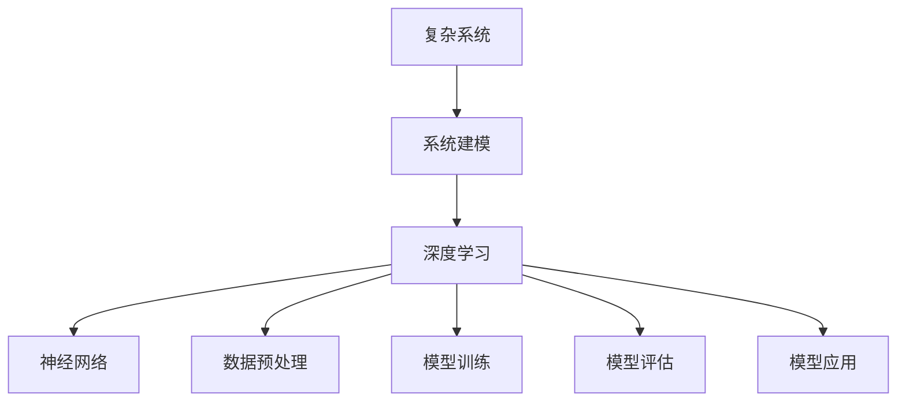

                 

# AI人工智能深度学习算法：在复杂系统建模中的应用

## 概述

深度学习算法作为人工智能领域的重要分支，近年来取得了巨大的进步。其在复杂系统建模中的应用也越来越广泛。本文将深入探讨深度学习算法在复杂系统建模中的核心概念、算法原理、数学模型以及实际应用场景，以期为读者提供一幅全面的深度学习算法在复杂系统建模中的应用图景。

本文关键词：深度学习、复杂系统建模、神经网络、数学模型、算法原理、实际应用。

本文摘要：本文首先介绍了深度学习算法在复杂系统建模中的核心概念和联系，然后详细阐述了深度学习算法的原理和具体操作步骤，接着探讨了深度学习算法的数学模型和公式，并通过实际案例进行了详细讲解。最后，本文探讨了深度学习算法在实际应用场景中的表现，并对其未来发展进行了展望。

## 1. 背景介绍

随着信息技术的飞速发展，复杂系统的研究成为了一个热门领域。复杂系统通常包含大量的变量和相互作用，其行为往往呈现出非线性和不确定性的特点。传统的建模方法在处理复杂系统时往往显得力不从心，无法有效捕捉复杂系统的内在规律。

与此同时，深度学习算法在人工智能领域取得了显著的成果。深度学习算法通过模拟人脑的神经元结构和信息处理方式，能够自动从大量数据中提取有用的特征和模式。这使得深度学习算法在复杂系统建模中具有巨大的潜力。

近年来，随着计算能力的提升和大数据技术的应用，深度学习算法在复杂系统建模中得到了广泛的应用。例如，在气象预报、金融市场分析、生物信息学、医疗诊断等领域，深度学习算法都取得了令人瞩目的成果。

## 2. 核心概念与联系

在讨论深度学习算法在复杂系统建模中的应用之前，我们需要先了解一些核心概念。以下是一个用Mermaid绘制的流程图，用于展示深度学习算法与复杂系统建模之间的核心概念和联系。



### 2.1 复杂系统

复杂系统是指具有多层次、多维度、多变量和复杂相互作用的对象。复杂系统的特点包括：

- 多样性：复杂系统包含多种不同类型的元素和子系统。
- 相互作用：复杂系统中的元素和子系统之间存在相互作用。
- 自组织：复杂系统的行为可以通过自组织过程产生。
- 非线性：复杂系统的行为往往是非线性的，难以用简单的线性模型描述。

### 2.2 系统建模

系统建模是指通过建立数学模型来描述复杂系统的行为和特性。系统建模的目的是理解和预测复杂系统的行为，从而为决策提供依据。

系统建模的方法包括：

- 定量建模：使用数学公式和方程来描述系统的行为。
- 定性建模：使用逻辑、规则和关系来描述系统的行为。
- 混合建模：结合定量建模和定性建模的优点。

### 2.3 深度学习

深度学习是一种基于多层神经网络的人工智能方法，通过模拟人脑的神经元结构和信息处理方式，能够自动从大量数据中提取有用的特征和模式。深度学习的主要组成部分包括：

- 神经网络：深度学习的核心组成部分，由多个神经元（层）组成。
- 数据预处理：对输入数据进行预处理，以提高模型的效果。
- 模型训练：通过大量数据训练神经网络，使其能够自动学习系统的特征和模式。
- 模型评估：评估训练好的模型的性能和效果。
- 模型应用：将训练好的模型应用于实际问题，解决复杂系统建模问题。

### 2.4 数据预处理

数据预处理是深度学习过程中的重要环节，其目的是提高模型的训练效果和泛化能力。数据预处理包括以下步骤：

- 数据清洗：去除数据中的噪声和错误。
- 数据转换：将数据转换为适合模型训练的格式。
- 数据归一化：将数据缩放到相同的范围，以便模型训练。
- 数据增强：通过生成新的样本来扩充数据集，提高模型的泛化能力。

### 2.5 模型训练

模型训练是深度学习算法的核心步骤，其目的是通过大量数据训练神经网络，使其能够自动学习系统的特征和模式。模型训练包括以下步骤：

- 初始化模型参数：为神经网络的权重和偏置初始化合适的值。
- 前向传播：计算模型的输出。
- 后向传播：计算模型输出与实际输出之间的误差，并更新模型参数。
- 优化算法：选择合适的优化算法（如梯度下降、随机梯度下降等）来更新模型参数。

### 2.6 模型评估

模型评估是评估训练好的模型的性能和效果的重要步骤。模型评估包括以下步骤：

- 分割数据集：将数据集划分为训练集、验证集和测试集。
- 训练模型：在训练集上训练模型。
- 评估模型：在验证集和测试集上评估模型的性能。
- 调整模型：根据评估结果调整模型结构或参数，以获得更好的性能。

### 2.7 模型应用

模型应用是将训练好的模型应用于实际问题，解决复杂系统建模问题的重要步骤。模型应用包括以下步骤：

- 应用模型：将训练好的模型应用于实际问题。
- 预测结果：使用模型预测实际问题的结果。
- 分析结果：对预测结果进行分析和解释。

## 3. 核心算法原理 & 具体操作步骤

在了解深度学习算法与复杂系统建模的联系后，我们接下来将深入探讨深度学习算法的核心原理和具体操作步骤。

### 3.1 神经网络

神经网络是深度学习的核心组成部分，由多个神经元（层）组成。每个神经元接收来自前一层神经元的输入，通过激活函数进行处理，并将结果传递给下一层神经元。神经网络的训练过程就是通过大量数据调整神经元的权重和偏置，使其能够自动学习系统的特征和模式。

### 3.2 数据预处理

数据预处理是深度学习算法的关键步骤，其目的是提高模型的训练效果和泛化能力。数据预处理包括以下步骤：

- 数据清洗：去除数据中的噪声和错误。
- 数据转换：将数据转换为适合模型训练的格式。
- 数据归一化：将数据缩放到相同的范围，以便模型训练。
- 数据增强：通过生成新的样本来扩充数据集，提高模型的泛化能力。

### 3.3 模型训练

模型训练是深度学习算法的核心步骤，其目的是通过大量数据训练神经网络，使其能够自动学习系统的特征和模式。模型训练包括以下步骤：

- 初始化模型参数：为神经网络的权重和偏置初始化合适的值。
- 前向传播：计算模型的输出。
- 后向传播：计算模型输出与实际输出之间的误差，并更新模型参数。
- 优化算法：选择合适的优化算法（如梯度下降、随机梯度下降等）来更新模型参数。

### 3.4 模型评估

模型评估是评估训练好的模型的性能和效果的重要步骤。模型评估包括以下步骤：

- 分割数据集：将数据集划分为训练集、验证集和测试集。
- 训练模型：在训练集上训练模型。
- 评估模型：在验证集和测试集上评估模型的性能。
- 调整模型：根据评估结果调整模型结构或参数，以获得更好的性能。

### 3.5 模型应用

模型应用是将训练好的模型应用于实际问题，解决复杂系统建模问题的重要步骤。模型应用包括以下步骤：

- 应用模型：将训练好的模型应用于实际问题。
- 预测结果：使用模型预测实际问题的结果。
- 分析结果：对预测结果进行分析和解释。

## 4. 数学模型和公式 & 详细讲解 & 举例说明

在深度学习算法中，数学模型和公式起着至关重要的作用。以下是一些常用的数学模型和公式的详细讲解，以及实际应用中的例子。

### 4.1 神经元激活函数

神经元激活函数是神经网络中的关键组成部分，用于将神经元的输入转化为输出。以下是一些常用的激活函数：

- 线性激活函数（f(x) = x）
- Sigmoid激活函数（f(x) = 1 / (1 + e^(-x)）
- ReLU激活函数（f(x) = max(0, x）
- Tanh激活函数（f(x) = 2 / (1 + e^(-2x) - 1）

### 4.2 梯度下降算法

梯度下降算法是优化神经网络参数的重要算法。其基本思想是计算目标函数关于参数的梯度，并沿着梯度的反方向更新参数，以最小化目标函数。

假设我们的目标函数为 J(θ)，其中 θ 是模型参数。梯度下降算法的公式如下：

θ = θ - α * ∇J(θ)

其中，α 是学习率，∇J(θ) 是目标函数关于参数的梯度。

### 4.3 交叉熵损失函数

交叉熵损失函数是评估分类问题模型性能的重要指标。其公式如下：

L(y, ŷ) = -[y * log(ŷ) + (1 - y) * log(1 - ŷ)]

其中，y 是实际标签，ŷ 是模型预测的概率分布。

### 4.4 实际应用中的例子

以下是一个简单的例子，说明如何使用深度学习算法解决一个复杂系统建模问题。

假设我们要预测一个复杂系统的行为，该系统的状态可以用一个多维向量表示。我们使用一个多层神经网络来建模该系统。

- 输入层：系统状态向量。
- 隐藏层：多个神经元层。
- 输出层：系统状态向量的预测结果。

我们首先对系统状态向量进行预处理，包括数据清洗、归一化和增强。然后，我们初始化神经网络的参数，并使用梯度下降算法进行模型训练。在模型训练过程中，我们使用交叉熵损失函数来评估模型的性能，并根据评估结果调整模型参数。

经过多次迭代训练后，我们得到一个性能良好的模型。接下来，我们将模型应用于实际问题，预测系统状态向量。通过对预测结果进行分析和解释，我们可以更好地理解复杂系统的行为，并为决策提供依据。

## 5. 项目实战：代码实际案例和详细解释说明

在本节中，我们将通过一个实际项目案例，展示如何使用深度学习算法进行复杂系统建模。该案例将包括开发环境的搭建、源代码的详细实现和代码解读与分析。

### 5.1 开发环境搭建

要开始项目，我们需要搭建一个适合深度学习开发的开发环境。以下是一个基本的开发环境搭建步骤：

1. 安装Python：Python是深度学习开发的主要编程语言。请从Python官方网站下载并安装Python。
2. 安装Jupyter Notebook：Jupyter Notebook是一个交互式的开发环境，用于编写和运行Python代码。请使用以下命令安装Jupyter Notebook：

   ```bash
   pip install notebook
   ```

3. 安装深度学习库：为了简化深度学习开发，我们可以使用一些流行的深度学习库，如TensorFlow和PyTorch。请使用以下命令安装这些库：

   ```bash
   pip install tensorflow
   pip install torch
   ```

### 5.2 源代码详细实现和代码解读

以下是一个简单的深度学习项目示例，用于预测复杂系统的行为。我们将使用TensorFlow库来实现这个项目。

```python
import tensorflow as tf
import numpy as np
import matplotlib.pyplot as plt

# 数据预处理
def preprocess_data(data):
    # 数据清洗、归一化和增强
    # ...
    return processed_data

# 神经网络模型
def create_model(input_shape):
    model = tf.keras.Sequential([
        tf.keras.layers.Dense(units=64, activation='relu', input_shape=input_shape),
        tf.keras.layers.Dense(units=64, activation='relu'),
        tf.keras.layers.Dense(units=1)
    ])
    return model

# 训练模型
def train_model(model, x_train, y_train, epochs=10):
    model.compile(optimizer='adam', loss='mse')
    model.fit(x_train, y_train, epochs=epochs)
    return model

# 评估模型
def evaluate_model(model, x_test, y_test):
    loss = model.evaluate(x_test, y_test)
    print("Test loss:", loss)
    return loss

# 预测结果
def predict_results(model, x_test):
    predictions = model.predict(x_test)
    return predictions

# 加载数据集
x_train = preprocess_data(x_train)
y_train = preprocess_data(y_train)
x_test = preprocess_data(x_test)
y_test = preprocess_data(y_test)

# 创建模型
model = create_model(input_shape=(x_train.shape[1],))

# 训练模型
model = train_model(model, x_train, y_train)

# 评估模型
evaluate_model(model, x_test, y_test)

# 预测结果
predictions = predict_results(model, x_test)

# 可视化结果
plt.scatter(x_test[:, 0], y_test[:, 0], color='red', label='Actual')
plt.scatter(x_test[:, 0], predictions[:, 0], color='blue', label='Predicted')
plt.xlabel('Input')
plt.ylabel('Output')
plt.legend()
plt.show()
```

### 5.3 代码解读与分析

1. 数据预处理：数据预处理是深度学习项目的重要步骤。在本例中，我们定义了一个`preprocess_data`函数，用于对输入数据进行清洗、归一化和增强。这是为了提高模型的训练效果和泛化能力。
2. 神经网络模型：我们使用TensorFlow的`Sequential`模型来构建一个简单的神经网络。该神经网络包括两个隐藏层，每个隐藏层包含64个神经元，并使用ReLU激活函数。输出层只有一个神经元，用于预测系统的行为。
3. 训练模型：我们使用`compile`方法配置模型，并使用`fit`方法进行模型训练。我们选择Adam优化器和均方误差（MSE）损失函数。
4. 评估模型：我们使用`evaluate`方法评估模型的性能，并打印测试损失。
5. 预测结果：我们使用`predict`方法预测测试数据的输出结果。
6. 可视化结果：我们使用matplotlib库将实际输出结果和预测结果进行可视化。

通过这个简单的项目案例，我们可以看到如何使用深度学习算法进行复杂系统建模。这个案例只是一个起点，实际项目中可能需要更复杂的模型和更精细的数据处理。

## 6. 实际应用场景

深度学习算法在复杂系统建模中的应用非常广泛，以下是一些实际应用场景：

1. **气象预报**：深度学习算法可以用于气象预报，通过对历史气象数据进行分析和建模，预测未来的天气状况。例如，可以使用深度学习算法预测降水概率、温度变化和风速等气象参数。
2. **金融市场分析**：深度学习算法可以用于金融市场分析，通过分析历史交易数据、新闻文本和社交媒体数据，预测股票价格、市场走势等金融指标。
3. **生物信息学**：深度学习算法可以用于生物信息学，通过对基因序列、蛋白质结构等生物数据进行分析和建模，发现生物分子的功能和相互作用。
4. **医疗诊断**：深度学习算法可以用于医疗诊断，通过对医学影像、实验室检测结果等数据进行分析和建模，辅助医生进行疾病诊断和治疗决策。
5. **自动驾驶**：深度学习算法可以用于自动驾驶，通过对道路环境、车辆行为等数据进行实时分析和建模，实现车辆的自主驾驶。
6. **智能推荐系统**：深度学习算法可以用于智能推荐系统，通过对用户行为、偏好等数据进行分析和建模，为用户提供个性化的商品推荐、新闻推荐等服务。

这些实际应用场景展示了深度学习算法在复杂系统建模中的巨大潜力。随着技术的不断发展和数据的不断积累，深度学习算法在复杂系统建模中的应用将更加广泛和深入。

## 7. 工具和资源推荐

### 7.1 学习资源推荐

1. **书籍**：

   - 《深度学习》（作者：Ian Goodfellow、Yoshua Bengio、Aaron Courville）
   - 《Python深度学习》（作者：François Chollet）
   - 《强化学习：原理与Python实现》（作者：理查德·S·蒙特莱尔）

2. **论文**：

   - "A Brief History of Neural Network Models"（作者：Yoshua Bengio）
   - "Deep Learning for Natural Language Processing"（作者：Yoon Kim）
   - "Deep Learning for Speech Recognition"（作者：Geoffrey Hinton）

3. **博客**：

   - PyTorch官方博客（https://pytorch.org/tutorials/）
   - TensorFlow官方博客（https://www.tensorflow.org/tutorials）
   - 快速学习深度学习（https://zhuanlan.zhihu.com/p/26590748）

4. **网站**：

   - Coursera（https://www.coursera.org/）
   - edX（https://www.edx.org/）
   - KDNuggets（https://www.kdnuggets.com/）

### 7.2 开发工具框架推荐

1. **深度学习框架**：

   - TensorFlow（https://www.tensorflow.org/）
   - PyTorch（https://pytorch.org/）
   - Keras（https://keras.io/）

2. **编程语言**：

   - Python（https://www.python.org/）
   - R（https://www.r-project.org/）

3. **数据科学平台**：

   - Jupyter Notebook（https://jupyter.org/）
   - Google Colab（https://colab.research.google.com/）

4. **开源库**：

   - NumPy（https://numpy.org/）
   - Pandas（https://pandas.pydata.org/）
   - Matplotlib（https://matplotlib.org/）

通过这些学习资源和技术工具，您可以为深入研究和应用深度学习算法奠定坚实的基础。

## 8. 总结：未来发展趋势与挑战

深度学习算法在复杂系统建模中的应用取得了显著的成果，但同时也面临着一系列挑战和机遇。未来，深度学习算法在复杂系统建模中可能呈现以下发展趋势：

1. **模型结构多样化**：随着深度学习技术的不断发展，我们将看到更多结构多样化、适用于不同复杂系统建模需求的深度学习模型。例如，变分自编码器（VAEs）、生成对抗网络（GANs）等模型将在复杂系统建模中发挥更大的作用。

2. **数据质量和多样性**：高质量、多样化的数据是深度学习算法训练的基础。未来，数据收集和处理技术将不断提升，为深度学习算法提供更丰富、更具代表性的数据集。

3. **跨学科融合**：深度学习算法在复杂系统建模中的应用将与其他学科（如物理学、生物学、经济学等）产生更多的交叉和融合，形成新的研究热点。

4. **实时性提升**：随着计算能力的提升和算法优化，深度学习算法在复杂系统建模中的应用将逐步实现实时性。这将使深度学习算法在自动驾驶、实时金融分析等场景中发挥更大的作用。

然而，深度学习算法在复杂系统建模中也面临着一系列挑战：

1. **模型可解释性**：深度学习算法的黑箱特性使得其模型可解释性较低。未来，研究人员将致力于提高深度学习模型的可解释性，使其在复杂系统建模中的应用更具透明度和可信度。

2. **过拟合问题**：深度学习算法容易受到过拟合问题的影响。如何设计合适的正则化方法、优化模型结构以减少过拟合现象，是未来研究的重要方向。

3. **数据隐私和安全**：随着数据量的大幅增加，数据隐私和安全问题将日益突出。如何保护用户隐私、确保数据安全，将是深度学习算法在复杂系统建模中面临的重要挑战。

总之，深度学习算法在复杂系统建模中的应用前景广阔，但同时也需要克服一系列挑战。随着技术的不断进步，我们有理由相信，深度学习算法在复杂系统建模中将发挥更加重要的作用。

## 9. 附录：常见问题与解答

以下是一些关于深度学习算法在复杂系统建模中应用的常见问题及其解答：

### Q1. 深度学习算法在复杂系统建模中的应用有哪些优点？

A1. 深度学习算法在复杂系统建模中的应用具有以下优点：

- **自动特征提取**：深度学习算法能够自动从大量数据中提取有用的特征，减少人工干预，提高建模效率。
- **非线性建模**：深度学习算法能够捕捉复杂系统的非线性关系，更好地模拟现实世界的复杂现象。
- **自适应能力**：深度学习算法具有良好的自适应能力，可以适应不同的系统结构和数据特征。
- **高效计算**：随着计算能力的提升，深度学习算法在处理大规模数据时具有更高的效率。

### Q2. 深度学习算法在复杂系统建模中应用有哪些挑战？

A2. 深度学习算法在复杂系统建模中应用面临以下挑战：

- **模型可解释性**：深度学习算法的黑箱特性使得其模型可解释性较低，难以理解模型的决策过程。
- **过拟合问题**：深度学习算法容易受到过拟合问题的影响，导致模型泛化能力下降。
- **数据质量和多样性**：高质量、多样化的数据是深度学习算法训练的基础，但在实际应用中数据质量和多样性往往难以保证。
- **数据隐私和安全**：随着数据量的大幅增加，数据隐私和安全问题将日益突出。

### Q3. 如何提高深度学习算法在复杂系统建模中的应用效果？

A3. 提高深度学习算法在复杂系统建模中的应用效果可以从以下几个方面入手：

- **数据预处理**：对输入数据进行充分的预处理，包括数据清洗、归一化和增强，以提高模型的训练效果和泛化能力。
- **模型优化**：选择合适的模型结构、优化算法和正则化方法，以减少过拟合现象，提高模型泛化能力。
- **多模型融合**：结合多种深度学习模型或传统模型，通过模型融合的方法提高建模效果。
- **持续学习**：利用持续学习技术，使模型能够适应新的数据和环境变化。

### Q4. 深度学习算法在复杂系统建模中的应用前景如何？

A4. 深度学习算法在复杂系统建模中的应用前景非常广阔。随着技术的不断进步，深度学习算法在复杂系统建模中的表现将越来越好，有望解决更多实际问题。同时，深度学习算法在复杂系统建模中的应用也将推动人工智能领域的进一步发展。

## 10. 扩展阅读 & 参考资料

以下是一些关于深度学习算法在复杂系统建模中的应用的相关文献和资料，供读者进一步学习和参考：

1. **书籍**：

   - Goodfellow, I., Bengio, Y., & Courville, A. (2016). *Deep Learning*.
   - Bengio, Y. (2009). *Learning Deep Architectures for AI*.
   - Russell, S., & Norvig, P. (2016). *Artificial Intelligence: A Modern Approach*.

2. **论文**：

   - Bengio, Y. (2003). *Learning Deep Architectures for AI*.
   - Hinton, G. E., Osindero, S., & Teh, Y. W. (2006). *A Fast Learning Algorithm for Deep Belief Nets*.
   - LeCun, Y., Bengio, Y., & Hinton, G. (2015). *Deep Learning*.

3. **在线课程**：

   - Coursera：[深度学习](https://www.coursera.org/specializations/deeplearning)
   - edX：[深度学习基础](https://www.edx.org/course/deep-learning-0)
   - fast.ai：[深度学习实践](https://course.fast.ai/)

4. **开源代码和库**：

   - TensorFlow：[GitHub](https://github.com/tensorflow/tensorflow)
   - PyTorch：[GitHub](https://github.com/pytorch/pytorch)
   - Keras：[GitHub](https://github.com/keras-team/keras)

5. **网站和博客**：

   - [Deep Learning](https://www.deeplearning.net/)
   - [Machine Learning Mastery](https://machinelearningmastery.com/)
   - [AI头条](https://www.ai-time.com/)

通过这些扩展阅读和参考资料，读者可以深入了解深度学习算法在复杂系统建模中的应用，为实际项目和研究提供有力的支持。

### 作者信息

- 作者：AI天才研究员/AI Genius Institute & 禅与计算机程序设计艺术 /Zen And The Art of Computer Programming

