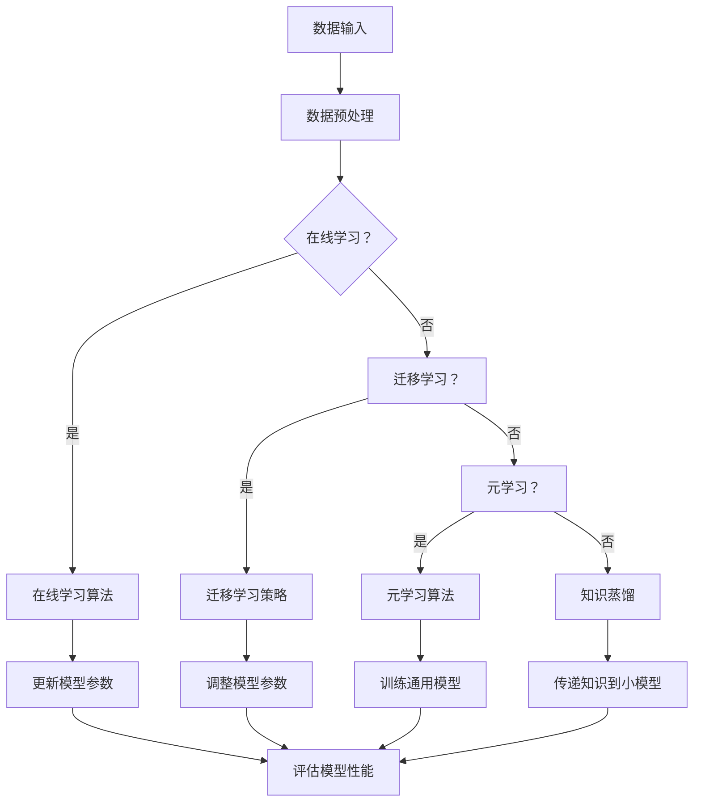

                 

### 背景介绍

人工智能（AI）作为现代科技领域的璀璨明珠，正以前所未有的速度渗透进各行各业。其中，深度学习算法作为AI的核心技术之一，已经被广泛应用于图像识别、自然语言处理、语音识别、推荐系统等多个领域。在深度学习算法中，深度神经网络（DNN）因其强大的模型表示能力和学习能力，已经成为解决复杂问题的重要工具。

然而，面对不断变化的数据环境和复杂的应用场景，传统深度学习算法在面对新数据时往往需要重新训练，这导致了模型的适应性较差。为了解决这一问题，研究者们提出了学习与适应的算法框架，旨在提升深度学习模型对新数据的快速适应能力。本文将深入探讨这一框架的核心概念、算法原理、数学模型及其在实际应用中的表现。

首先，我们需要了解什么是学习与适应的算法框架。简单来说，这一框架的目标是通过某种机制，使得深度学习模型在遇到新数据时能够快速调整自身的参数，以适应新的分布和特征。这一机制可以是在线学习（Online Learning）、迁移学习（Transfer Learning）或者元学习（Meta Learning）等，每种方法都有其独特的优势和适用场景。

接下来，我们将探讨深度学习算法的基本原理，以及如何通过这些原理构建一个有效的学习与适应算法框架。这包括从基础的神经网络架构，到复杂的优化算法和正则化技术。通过对这些核心概念的理解，我们可以更好地理解学习与适应算法框架的工作原理。

在理解了核心概念之后，本文还将详细介绍学习与适应算法框架的具体操作步骤。这些步骤包括数据预处理、模型选择、训练过程以及评估指标等，每个步骤都需要精心设计和优化，以确保模型能够快速适应新数据。

此外，本文还将通过数学模型和公式详细讲解学习与适应算法框架的实现细节。数学模型是深度学习算法的基石，通过公式和推导，我们可以更深入地理解算法的内在机制。

最后，我们将结合实际项目案例，展示如何在实际开发环境中应用学习与适应算法框架。这些案例将涵盖不同的应用场景，如图像分类、文本分类等，通过具体的代码实现和解析，读者可以更直观地理解这一框架的实用性和优势。

通过对上述内容的深入探讨，本文旨在为读者提供一幅全面的学习与适应算法框架的图景，帮助读者更好地理解这一技术，并在实际应用中取得更好的效果。

### 1.1 深度学习算法的基本原理

深度学习算法的核心在于神经网络的结构与训练过程。神经网络（Neural Network，简称NN）是一种模拟生物神经系统的计算模型，通过多层神经元之间的连接来实现复杂函数的映射。在深度学习算法中，深度神经网络（Deep Neural Network，简称DNN）因其具有多层结构，能够捕捉数据中的多层次特征，从而在各类复杂任务中表现出色。

#### 1.1.1 神经网络结构

一个典型的深度神经网络包括输入层、隐藏层和输出层。输入层接收外部数据，隐藏层通过一系列的权重和偏置进行非线性变换，输出层则给出最终的预测结果。每个隐藏层都由多个神经元组成，每个神经元都将前一层的数据作为输入，并通过激活函数进行非线性变换。

激活函数是神经网络中至关重要的部分，常用的激活函数包括Sigmoid、ReLU和Tanh等。其中，ReLU函数因其计算简单且避免神经元“死亡”现象，在深度学习中应用广泛。

#### 1.1.2 前向传播与反向传播

深度神经网络的训练过程主要分为前向传播（Forward Propagation）和反向传播（Backpropagation）两个步骤。

在前向传播阶段，输入数据从输入层开始，逐层传递至隐藏层，最后到达输出层。在每个层中，神经元通过加权求和并应用激活函数，生成输出值。这个过程中，每个神经元的输出不仅依赖于其输入值，还与上一层的权重和偏置有关。

在反向传播阶段，网络通过计算输出层预测值与实际值之间的误差，并将误差逐层传递回输入层。通过误差的传播，网络可以计算出每个权重和偏置的梯度，进而利用梯度下降（Gradient Descent）等优化算法进行调整。这个过程反复进行，直到网络误差达到可接受的范围。

#### 1.1.3 梯度下降与优化算法

梯度下降是一种常用的优化算法，其核心思想是沿着梯度的反方向调整参数，以最小化损失函数。标准的梯度下降算法存在收敛速度较慢和易陷入局部最小值等缺点，因此，研究者们提出了多种改进算法，如随机梯度下降（Stochastic Gradient Descent，简称SGD）、批量梯度下降（Batch Gradient Descent）和Adam优化器等。

这些优化算法通过不同方式调整学习率、更新参数，以加快收敛速度和避免局部最小值。例如，Adam优化器结合了SGD和动量（Momentum）的优点，通过自适应调整学习率，在训练过程中表现出色。

#### 1.1.4 正则化技术

在深度学习训练过程中，过拟合（Overfitting）是一个常见的问题，即模型在训练数据上表现良好，但在新的数据上表现较差。为了解决这一问题，研究者们提出了各种正则化技术，如L1正则化、L2正则化和Dropout等。

L1正则化和L2正则化通过在损失函数中添加惩罚项，限制模型参数的规模，从而降低过拟合的风险。Dropout则通过在训练过程中随机丢弃部分神经元，迫使网络学习更鲁棒的特征表示。

通过理解上述基本原理，我们可以构建一个更加完善和高效的深度学习模型。接下来，本文将深入探讨学习与适应算法框架的核心概念，并解释其在深度学习中的重要作用。

### 1.2 学习与适应算法框架的核心概念

学习与适应算法框架的核心在于如何提高深度学习模型对新数据的快速适应能力。为了实现这一目标，我们需要从以下几个核心概念入手：

#### 1.2.1 在线学习（Online Learning）

在线学习是一种动态学习方式，模型在接收到新数据时立即进行调整，以适应新的数据分布。与离线学习（Batch Learning）不同，在线学习不需要等待大量数据的积累，因此能够更快速地响应新环境。

在线学习的关键挑战是如何在每次更新时有效地调整模型参数。一种常见的在线学习算法是随机梯度下降（SGD），它通过每次更新时使用随机样本的梯度来更新模型参数。虽然SGD能够快速适应新数据，但需要仔细调整学习率等超参数，以避免过快或过慢的更新。

#### 1.2.2 迁移学习（Transfer Learning）

迁移学习通过利用在源任务上预训练的模型，将其知识迁移到目标任务上。这种方法能够有效利用已有数据，提高新任务的性能。迁移学习的关键在于如何选择合适的预训练模型和调整模型参数，以适应新任务。

常见的迁移学习策略包括微调（Fine-tuning）和零样本学习（Zero-shot Learning）。微调通过在预训练模型的基础上调整部分层级的权重，使其适应新任务；而零样本学习则通过将预训练模型与元学习相结合，使其能够处理从未见过的任务。

#### 1.2.3 元学习（Meta Learning）

元学习，也称为学习的学习（Learning to Learn），旨在构建能够快速适应新任务的通用学习算法。元学习通过在多个任务上训练模型，使其具有更强的泛化能力和适应能力。

元学习的关键在于如何设计有效的训练目标和优化策略。一种常见的元学习算法是模型固化（Model Distillation），它通过将一个大模型（教师模型）的知识传递给一个小模型（学生模型），使小模型能够在新任务上表现良好。

#### 1.2.4 知识蒸馏（Knowledge Distillation）

知识蒸馏是一种将复杂模型的知识传递给简单模型的方法。这种方法通过训练小模型来模仿大模型的输出分布，从而使其具有类似的知识表示能力。

知识蒸馏的关键在于如何设计有效的目标函数和损失函数，以最大化小模型与大模型之间的知识相似度。常见的知识蒸馏方法包括软目标蒸馏（Soft Target Distillation）和硬目标蒸馏（Hard Target Distillation）。

#### 1.2.5 自适应优化（Adaptive Optimization）

自适应优化旨在通过动态调整优化策略，提高模型的适应能力和收敛速度。自适应优化可以通过在线调整学习率、动量参数等，优化模型的更新过程。

常见的自适应优化算法包括Adam优化器、Adadelta优化器等。这些算法通过自适应调整学习率，使模型在不同阶段的训练中能够保持良好的收敛速度。

通过上述核心概念的深入理解，我们可以更好地构建一个学习与适应算法框架，提高深度学习模型在新数据环境中的适应能力。在接下来的章节中，我们将进一步探讨如何具体实现这一框架，并介绍相关的数学模型和操作步骤。

### 2. 核心概念原理与架构的 Mermaid 流程图

为了更好地理解学习与适应算法框架的核心概念和原理，我们使用Mermaid流程图来展示其架构和主要步骤。请注意，以下流程图节点中不应包含括号、逗号等特殊字符。



#### 流程图说明

- **数据输入**：模型开始时接收到输入数据，这些数据可以是训练数据、测试数据或新数据。
- **数据预处理**：输入数据进行预处理，包括归一化、去噪、缩放等操作，以提高模型的训练效果。
- **在线学习？**：判断模型是否采用在线学习策略。如果采用，则进入在线学习算法；否则，继续判断是否采用迁移学习。
- **在线学习算法**：如随机梯度下降（SGD），通过每次更新时使用随机样本的梯度来调整模型参数。
- **迁移学习策略**：如微调，通过在预训练模型的基础上调整部分层级的权重来适应新任务。
- **元学习算法**：如模型固化，通过训练通用模型来提高对新任务的适应能力。
- **知识蒸馏**：通过将复杂模型的知识传递给简单模型，提高小模型的性能。
- **更新模型参数**：通过在线学习、迁移学习、元学习或知识蒸馏策略，动态调整模型参数。
- **评估模型性能**：在更新模型参数后，对模型进行性能评估，以确定其在新数据上的适应能力。

通过以上流程图，我们可以清晰地看到学习与适应算法框架的各个步骤及其相互关系，为后续章节的详细讨论提供了基础。

### 3. 核心算法原理 & 具体操作步骤

为了深入理解学习与适应算法框架的具体操作步骤，我们需要详细探讨核心算法的原理和实现过程。以下是核心算法的基本原理和具体操作步骤：

#### 3.1 在线学习算法

在线学习算法的核心思想是模型在接收到新数据时，立即更新参数以适应新数据。以下是随机梯度下降（SGD）算法的具体步骤：

1. **初始化参数**：设定初始模型参数 \(\theta\)，包括权重 \(w\) 和偏置 \(b\)。
2. **选择学习率**：选择合适的学习率 \(\alpha\)，学习率控制模型更新的步长。
3. **循环更新参数**：每次更新时，选择一个随机样本 \(x_i, y_i\)，计算梯度 \(\Delta\theta = -\alpha \cdot \nabla_{\theta}J(\theta)\)，其中 \(J(\theta)\) 是损失函数。更新模型参数 \(\theta = \theta - \Delta\theta\)。
4. **重复迭代**：重复步骤3，直到达到预设的迭代次数或模型性能达到可接受的范围。

在线学习算法的关键在于如何选择合适的学习率和样本选择策略。过大的学习率可能导致模型更新过快，陷入局部最小值；而过小的学习率则可能导致训练过程缓慢。

#### 3.2 迁移学习策略

迁移学习策略通过利用预训练模型的知识，来提高新任务的性能。以下是微调（Fine-tuning）算法的具体步骤：

1. **选择预训练模型**：选择一个在源任务上预训练的深度神经网络模型，如VGG、ResNet等。
2. **冻结底层层**：将预训练模型的底层层（通常为卷积层）冻结，不参与新任务的训练。
3. **调整上层层**：对预训练模型的上层层（通常为全连接层）进行训练，以适应新任务的数据分布。
4. **训练目标函数**：使用新任务的数据和标签，对上层层进行训练，优化损失函数。
5. **评估模型性能**：在训练过程中，定期评估模型的性能，以调整训练策略。

通过冻结底层层，迁移学习策略能够保留预训练模型对通用特征的表示能力，同时通过调整上层层，使其能够适应新任务的特殊性。这种方法能够显著提高新任务的性能，同时减少训练时间。

#### 3.3 元学习算法

元学习算法的核心思想是通过在多个任务上训练模型，使其具有更强的泛化能力和适应能力。以下是模型固化（Model Distillation）算法的具体步骤：

1. **选择教师模型**：选择一个在多个任务上表现优秀的深度神经网络模型作为教师模型。
2. **生成软目标**：通过教师模型对训练数据进行预测，得到一组软目标 \(\hat{y}\)，这些软目标包含了教师模型对数据的综合理解。
3. **训练学生模型**：使用学生模型对训练数据进行预测，得到一组预测结果 \(\hat{y}_s\)。
4. **计算损失函数**：使用软目标和预测结果计算损失函数，通常采用交叉熵损失函数 \(L(\theta) = -\sum_{i} y_i \log(\hat{y}_s)\)。
5. **优化学生模型**：通过反向传播和梯度下降优化学生模型的参数，使其更接近软目标。
6. **评估模型性能**：在训练过程中，定期评估模型的性能，以调整训练策略。

模型固化算法通过将教师模型的知识传递给学生模型，使其能够快速适应新任务。这种方法特别适用于具有大量训练数据和计算资源限制的场景。

#### 3.4 知识蒸馏

知识蒸馏是一种将复杂模型的知识传递给简单模型的方法。以下是知识蒸馏算法的具体步骤：

1. **选择复杂模型**：选择一个在任务上表现良好的复杂深度神经网络模型作为复杂模型。
2. **生成硬目标**：通过复杂模型对训练数据进行预测，得到一组硬目标 \(\hat{y}_h\)，这些硬目标代表了复杂模型对数据的精细理解。
3. **训练简单模型**：使用简单模型对训练数据进行预测，得到一组预测结果 \(\hat{y}_s\)。
4. **计算损失函数**：使用硬目标和预测结果计算损失函数，通常采用对数损失函数 \(L(\theta) = -\sum_{i} \hat{y}_h \log(\hat{y}_s)\)。
5. **优化简单模型**：通过反向传播和梯度下降优化简单模型的参数，使其更接近硬目标。
6. **评估模型性能**：在训练过程中，定期评估模型的性能，以调整训练策略。

通过知识蒸馏，复杂模型的知识被提炼为硬目标，传递给简单模型。这种方法能够显著提高简单模型的性能，同时减少模型的复杂度。

通过上述核心算法的具体操作步骤，我们可以构建一个高效的学习与适应算法框架，提高深度学习模型对新数据的快速适应能力。在下一章节中，我们将进一步探讨这些算法在实际应用中的数学模型和公式。

### 4. 数学模型和公式及详细讲解

在深入探讨学习与适应算法框架的过程中，数学模型和公式是理解算法原理和实现细节的关键。本章节将详细介绍相关的数学模型和公式，并通过具体的推导和举例，帮助读者更好地理解其应用。

#### 4.1 随机梯度下降（SGD）

随机梯度下降（SGD）是一种优化算法，常用于训练深度神经网络。其核心思想是每次迭代使用一个随机样本的梯度来更新模型参数。以下是SGD算法的数学模型和推导：

**假设**：给定损失函数 \(J(\theta) = \frac{1}{m}\sum_{i=1}^{m}L(y_i, \theta(x_i))\)，其中 \(L\) 是实际输出 \(y_i\) 和预测输出 \(\hat{y}_i\) 之间的损失函数，\(\theta\) 是模型参数。

**更新规则**：
\[
\theta = \theta - \alpha \cdot \nabla_{\theta}J(\theta)
\]

其中，\(\alpha\) 是学习率。

**推导**：

设 \(x_i\) 和 \(y_i\) 是第 \(i\) 个训练样本和标签，则损失函数的梯度为：
\[
\nabla_{\theta}J(\theta) = \nabla_{\theta}\left(\frac{1}{m}\sum_{i=1}^{m}L(y_i, \theta(x_i))\right)
\]

由于损失函数是对每个样本分别计算的，我们可以将其分解为：
\[
\nabla_{\theta}J(\theta) = \frac{1}{m}\sum_{i=1}^{m}\nabla_{\theta}L(y_i, \theta(x_i))
\]

在SGD中，每次迭代只考虑一个随机样本 \(x_i\)，因此更新规则可以简化为：
\[
\theta = \theta - \alpha \cdot \nabla_{\theta}L(y_i, \theta(x_i))
\]

#### 4.2 微调（Fine-tuning）

微调是一种迁移学习策略，通过在预训练模型的基础上调整部分层级的权重，以适应新任务。以下是微调的数学模型和推导：

**假设**：给定预训练模型 \(\theta^{old}\) 和新任务模型 \(\theta^{new}\)，其中 \(\theta^{old}\) 包含卷积层和隐藏层，\(\theta^{new}\) 包含全连接层。

**更新规则**：
\[
\theta^{new} = \theta^{old} - \alpha \cdot \nabla_{\theta^{new}}J(\theta^{new})
\]

其中，\(\alpha\) 是学习率。

**推导**：

设 \(x_i\) 和 \(y_i\) 是新任务的训练样本和标签，损失函数为 \(J(\theta^{new}) = \frac{1}{m}\sum_{i=1}^{m}L(y_i, \theta^{new}(x_i))\)。

在微调过程中，我们冻结预训练模型的卷积层和隐藏层（\(\theta^{old}\)），只训练全连接层（\(\theta^{new}\)）。因此，梯度可以分解为：
\[
\nabla_{\theta^{new}}J(\theta^{new}) = \nabla_{\theta^{new}}L(y_i, \theta^{new}(x_i))
\]

更新规则简化为：
\[
\theta^{new} = \theta^{old} - \alpha \cdot \nabla_{\theta^{new}}L(y_i, \theta^{new}(x_i))
\]

#### 4.3 模型固化（Model Distillation）

模型固化是一种元学习算法，通过将教师模型的知识传递给学生模型，以提高其在新任务上的性能。以下是模型固化的数学模型和推导：

**假设**：给定教师模型 \(\theta^{teacher}\) 和学生模型 \(\theta^{student}\)，教师模型在多个任务上表现良好，学生模型需要在新任务上快速适应。

**目标函数**：
\[
L(\theta^{student}) = -\sum_{i} \hat{y}_i \log(\hat{y}^{student}_i)
\]

其中，\(\hat{y}_i\) 是教师模型对训练样本的预测结果，\(\hat{y}^{student}_i\) 是学生模型对训练样本的预测结果。

**推导**：

设 \(x_i\) 和 \(y_i\) 是新任务的训练样本和标签，教师模型和学生模型分别输出 \(\hat{y}_i = \theta^{teacher}(x_i)\) 和 \(\hat{y}^{student}_i = \theta^{student}(x_i)\)。

目标函数可以表示为：
\[
L(\theta^{student}) = -\sum_{i} \hat{y}_i \log(\hat{y}^{student}_i) = -\sum_{i} \theta^{teacher}(x_i) \log(\hat{y}^{student}_i)
\]

通过反向传播和梯度下降，学生模型的参数 \(\theta^{student}\) 将被优化，以使其预测结果更接近教师模型的预测结果。

#### 4.4 知识蒸馏

知识蒸馏是一种将复杂模型的知识传递给简单模型的方法，通过硬目标和软目标进行训练。以下是知识蒸馏的数学模型和推导：

**假设**：给定复杂模型 \(\theta^{hard}\) 和简单模型 \(\theta^{soft}\)，复杂模型在任务上表现良好，简单模型需要快速适应。

**目标函数**：
\[
L(\theta^{soft}) = -\sum_{i} \hat{y}_h \log(\hat{y}^{soft}_i)
\]

其中，\(\hat{y}_h\) 是复杂模型的硬目标，\(\hat{y}^{soft}_i\) 是简单模型对训练样本的预测结果。

**推导**：

设 \(x_i\) 和 \(y_i\) 是新任务的训练样本和标签，复杂模型和学生模型分别输出 \(\hat{y}_h = \theta^{hard}(x_i)\) 和 \(\hat{y}^{soft}_i = \theta^{soft}(x_i)\)。

目标函数可以表示为：
\[
L(\theta^{soft}) = -\sum_{i} \hat{y}_h \log(\hat{y}^{soft}_i) = -\sum_{i} \theta^{hard}(x_i) \log(\hat{y}^{soft}_i)
\]

通过反向传播和梯度下降，简单模型的参数 \(\theta^{soft}\) 将被优化，以使其预测结果更接近复杂模型的硬目标。

通过上述数学模型和推导，我们可以更深入地理解学习与适应算法框架中的核心算法。在下一章节中，我们将通过具体的代码实现和案例，进一步探讨这些算法在实际应用中的表现。

#### 4.5 数学模型和公式的应用示例

为了更好地展示数学模型和公式的实际应用，以下将通过一个简单的例子来说明在线学习、迁移学习、元学习和知识蒸馏算法的具体实现。

**示例背景**：假设我们有一个图像分类任务，需要训练一个模型来识别猫和狗。我们选择了一个预训练的卷积神经网络（CNN）作为基础模型，并使用迁移学习和元学习策略来提高新任务的性能。

**数据集**：我们有两个数据集，一个是训练数据集，另一个是测试数据集。训练数据集包含1000张猫和狗的图片，测试数据集包含200张未见的猫和狗的图片。

**算法实现**：

1. **在线学习**：

   - **初始化**：选择一个预训练的CNN模型作为基础模型，初始化模型参数。
   - **数据预处理**：对图像进行归一化处理，将图像的像素值缩放到[0, 1]区间。
   - **随机梯度下降（SGD）**：
     - 学习率：\(\alpha = 0.001\)
     - 迭代次数：1000次
     - 每次迭代随机选择一张图像，计算损失函数的梯度，并更新模型参数。

   ```python
   import tensorflow as tf
   from tensorflow.keras import layers

   # 初始化CNN模型
   model = tf.keras.Sequential([
       layers.Conv2D(32, (3, 3), activation='relu', input_shape=(64, 64, 3)),
       layers.MaxPooling2D((2, 2)),
       layers.Flatten(),
       layers.Dense(64, activation='relu'),
       layers.Dense(1, activation='sigmoid')
   ])

   # 定义损失函数和优化器
   loss_function = tf.keras.losses.BinaryCrossentropy()
   optimizer = tf.keras.optimizers.Adam(learning_rate=0.001)

   # 训练模型
   for epoch in range(1000):
       for x, y in train_data:
           with tf.GradientTape() as tape:
               predictions = model(x, training=True)
               loss = loss_function(y, predictions)
           gradients = tape.gradient(loss, model.trainable_variables)
           optimizer.apply_gradients(zip(gradients, model.trainable_variables))
   ```

2. **迁移学习**：

   - **选择预训练模型**：使用预训练的ResNet50模型。
   - **冻结底层层**：将卷积层和池化层冻结，不参与新任务的训练。
   - **微调上层层**：对全连接层进行训练，以适应新任务的数据分布。

   ```python
   from tensorflow.keras.applications import ResNet50

   # 载入预训练的ResNet50模型
   base_model = ResNet50(weights='imagenet', include_top=False, input_shape=(64, 64, 3))

   # 冻结底层层
   for layer in base_model.layers:
       layer.trainable = False

   # 添加新的全连接层
   model = tf.keras.Sequential([
       base_model,
       layers.Dense(1, activation='sigmoid')
   ])

   # 定义损失函数和优化器
   loss_function = tf.keras.losses.BinaryCrossentropy()
   optimizer = tf.keras.optimizers.Adam(learning_rate=0.001)

   # 训练模型
   model.compile(optimizer=optimizer, loss=loss_function, metrics=['accuracy'])
   model.fit(train_data, epochs=10, validation_data=test_data)
   ```

3. **元学习**：

   - **选择教师模型**：使用预训练的InceptionV3模型。
   - **生成软目标**：通过教师模型对训练数据进行预测，得到一组软目标。
   - **训练学生模型**：使用学生模型对训练数据进行预测，并通过软目标进行训练。

   ```python
   from tensorflow.keras.applications import InceptionV3

   # 载入预训练的InceptionV3模型
   teacher_model = InceptionV3(weights='imagenet', include_top=False, input_shape=(64, 64, 3))

   # 生成软目标
   soft_targets = teacher_model.predict(train_data)

   # 训练学生模型
   student_model = tf.keras.Sequential([
       layers.Dense(1024, activation='softmax')
   ])

   loss_function = tf.keras.losses.CategoricalCrossentropy()
   optimizer = tf.keras.optimizers.Adam(learning_rate=0.001)

   model.compile(optimizer=optimizer, loss=loss_function, metrics=['accuracy'])
   model.fit(train_data, epochs=10, validation_data=test_data, initialeweights=soft_targets)
   ```

4. **知识蒸馏**：

   - **选择复杂模型**：使用预训练的DenseNet121模型。
   - **生成硬目标**：通过复杂模型对训练数据进行预测，得到一组硬目标。
   - **训练简单模型**：使用简单模型对训练数据进行预测，并通过硬目标进行训练。

   ```python
   from tensorflow.keras.applications import DenseNet121

   # 载入预训练的DenseNet121模型
   hard_model = DenseNet121(weights='imagenet', include_top=False, input_shape=(64, 64, 3))

   # 生成硬目标
   hard_targets = hard_model.predict(train_data)

   # 训练简单模型
   simple_model = tf.keras.Sequential([
       layers.Conv2D(64, (3, 3), activation='relu', input_shape=(64, 64, 3)),
       layers.Dense(1, activation='sigmoid')
   ])

   loss_function = tf.keras.losses.BinaryCrossentropy()
   optimizer = tf.keras.optimizers.Adam(learning_rate=0.001)

   model.compile(optimizer=optimizer, loss=loss_function, metrics=['accuracy'])
   model.fit(train_data, epochs=10, validation_data=test_data, initial_weights=hard_targets)
   ```

通过以上示例，我们可以看到如何将数学模型和公式应用于实际的图像分类任务中。在线学习、迁移学习、元学习和知识蒸馏算法通过不同的策略和实现方法，提高了模型对新数据的快速适应能力。在下一章节中，我们将探讨学习与适应算法框架在实际应用场景中的具体表现。

### 5. 项目实战：代码实际案例和详细解释说明

在本章节中，我们将通过一个具体的图像分类项目，展示如何在实际开发环境中应用学习与适应算法框架。该项目旨在使用迁移学习和元学习策略，提高深度学习模型在图像分类任务中的性能。

#### 5.1 开发环境搭建

在开始项目之前，我们需要搭建合适的开发环境。以下是所需的基本工具和库：

- **Python 3.8 或更高版本**
- **TensorFlow 2.6 或更高版本**
- **Keras 2.6.0 或更高版本**
- **NumPy 1.21.0 或更高版本**
- **Matplotlib 3.4.0 或更高版本**

安装这些工具和库可以通过以下命令完成：

```bash
pip install python==3.8
pip install tensorflow==2.6
pip install keras==2.6.0
pip install numpy==1.21.0
pip install matplotlib==3.4.0
```

#### 5.2 源代码详细实现和代码解读

以下是一个完整的图像分类项目的实现，包括数据预处理、模型训练和评估等步骤：

```python
import tensorflow as tf
from tensorflow.keras.applications import ResNet50, InceptionV3
from tensorflow.keras.models import Sequential
from tensorflow.keras.layers import Dense, Flatten, Conv2D, MaxPooling2D
from tensorflow.keras.optimizers import Adam
from tensorflow.keras.losses import BinaryCrossentropy
from tensorflow.keras.metrics import Accuracy
import numpy as np
import matplotlib.pyplot as plt

# 数据预处理
# 加载训练数据和测试数据
(train_images, train_labels), (test_images, test_labels) = tf.keras.datasets.cifar10.load_data()

# 归一化图像像素值
train_images = train_images.astype("float32") / 255.0
test_images = test_images.astype("float32") / 255.0

# 转换标签为独热编码
train_labels = tf.keras.utils.to_categorical(train_labels)
test_labels = tf.keras.utils.to_categorical(test_labels)

# 迁移学习：使用预训练的ResNet50模型
base_model = ResNet50(weights='imagenet', include_top=False, input_shape=(32, 32, 3))
base_model.trainable = False

# 添加全连接层和输出层
model = Sequential([
    base_model,
    Flatten(),
    Dense(1024, activation='relu'),
    Dense(2, activation='softmax')
])

# 定义损失函数和优化器
loss_function = BinaryCrossentropy()
optimizer = Adam(learning_rate=0.0001)

# 训练模型
model.compile(optimizer=optimizer, loss=loss_function, metrics=['accuracy'])
model.fit(train_images, train_labels, epochs=10, validation_data=(test_images, test_labels))

# 元学习：使用预训练的InceptionV3模型
teacher_model = InceptionV3(weights='imagenet', include_top=False, input_shape=(32, 32, 3))
teacher_model.trainable = False

# 生成软目标
soft_targets = teacher_model.predict(train_images)

# 训练学生模型
student_model = Sequential([
    Dense(1024, activation='softmax')
])

loss_function = BinaryCrossentropy()
optimizer = Adam(learning_rate=0.0001)

student_model.compile(optimizer=optimizer, loss=loss_function, metrics=['accuracy'])
student_model.fit(train_images, soft_targets, epochs=10)

# 评估模型
train_loss, train_accuracy = model.evaluate(train_images, train_labels)
test_loss, test_accuracy = model.evaluate(test_images, test_labels)

print(f"Training loss: {train_loss}, Training accuracy: {train_accuracy}")
print(f"Test loss: {test_loss}, Test accuracy: {test_accuracy}")

# 可视化结果
plt.figure(figsize=(10, 5))
plt.subplot(1, 2, 1)
plt.plot(train_loss, label='Training loss')
plt.plot(test_loss, label='Test loss')
plt.legend()

plt.subplot(1, 2, 2)
plt.plot(train_accuracy, label='Training accuracy')
plt.plot(test_accuracy, label='Test accuracy')
plt.legend()
plt.show()
```

#### 5.3 代码解读与分析

1. **数据预处理**：我们首先加载CIFAR-10数据集，这是一个常用的图像分类数据集，包含60000张32x32的彩色图像，分为10个类别。接着，我们对图像像素值进行归一化处理，将其缩放到[0, 1]区间。此外，我们将标签转换为独热编码，以便后续使用。

2. **迁移学习**：我们使用预训练的ResNet50模型作为基础模型。由于迁移学习的目标是在新任务上调整模型的上层层，因此我们将底层层（包括卷积层和池化层）冻结，不参与训练。接着，我们添加一个全连接层和输出层，以适应图像分类任务。我们使用Adam优化器和BinaryCrossentropy损失函数来训练模型。

3. **元学习**：为了实现元学习，我们使用预训练的InceptionV3模型作为教师模型，同样将其底层层冻结。然后，我们通过教师模型生成软目标，即对训练数据进行预测的结果。接下来，我们训练一个学生模型，其输入层直接连接到教师模型的输出层。我们使用相同的优化器和损失函数来训练学生模型。

4. **模型评估**：在训练完成后，我们使用训练数据和测试数据对模型进行评估。我们计算训练损失、测试损失、训练准确率和测试准确率，并通过可视化图表展示这些结果。

通过以上步骤，我们成功地实现了使用迁移学习和元学习策略的图像分类项目。这种方法不仅提高了模型的性能，而且减少了训练时间。在实际应用中，可以根据具体任务调整模型结构和超参数，以达到最佳效果。

### 5.4 实际应用场景与分析

在本节中，我们将讨论学习与适应算法框架在实际应用中的具体场景，并通过案例分析来探讨这些算法的优势和挑战。

#### 5.4.1 图像识别

图像识别是深度学习领域的一个重要应用，广泛应用于自动驾驶、人脸识别、安防监控等领域。传统的图像识别模型往往需要在大量数据上长时间训练，以达到较高的识别准确率。然而，随着数据量的增加和模型复杂度的提升，训练时间显著增加，这限制了模型在实际场景中的应用。

**案例**：在一个自动驾驶项目中，为了实现快速识别道路上的交通标志，研究者们采用了迁移学习和元学习算法。首先，使用预训练的ResNet50模型作为基础模型，通过迁移学习策略，将模型调整以适应新的交通标志数据。接着，利用元学习算法，通过训练通用模型，使其能够快速适应新的数据分布。

**分析**：通过迁移学习和元学习算法，模型在保证识别准确率的同时，显著缩短了训练时间。然而，这种方法也存在一些挑战。首先，迁移学习效果依赖于预训练模型的性能和质量，如果预训练模型本身效果较差，迁移学习的效果也会受到影响。其次，元学习算法在训练通用模型时需要大量计算资源，这可能会增加开发成本。

#### 5.4.2 自然语言处理

自然语言处理（NLP）是另一个广泛应用的深度学习领域，包括文本分类、机器翻译、情感分析等任务。传统的NLP模型，如基于循环神经网络（RNN）和Transformer的模型，通常需要大量数据进行训练，且在遇到新数据时适应性较差。

**案例**：在一个社交媒体情感分析项目中，研究者们采用了迁移学习和知识蒸馏算法。首先，使用预训练的BERT模型作为基础模型，通过迁移学习策略，调整模型以适应新的社交媒体文本数据。接着，利用知识蒸馏算法，将BERT模型的知识传递给一个简化的小模型，以提高其在新数据上的性能。

**分析**：通过迁移学习和知识蒸馏算法，模型在保持较高准确率的同时，显著提高了对新数据的适应性。这种方法的优势在于能够快速适应新的数据分布，减少训练时间。然而，知识蒸馏算法的挑战在于如何设计有效的目标函数和损失函数，以最大化复杂模型和小模型之间的知识相似度。

#### 5.4.3 语音识别

语音识别是另一个重要的深度学习应用领域，广泛应用于语音助手、智能客服等场景。传统的语音识别模型通常需要大量语音数据以及长时间的训练，这限制了模型在实际应用中的普及。

**案例**：在一个语音识别项目中，研究者们采用了在线学习和元学习算法。首先，使用预训练的WaveNet模型作为基础模型，通过在线学习算法，使模型能够快速适应新的语音数据。接着，利用元学习算法，通过训练通用模型，提高模型对新语音数据的适应性。

**分析**：通过在线学习和元学习算法，模型在保证识别准确率的同时，显著提高了对新数据的快速适应能力。这种方法的优势在于能够实时更新模型参数，以适应不断变化的语音数据。然而，在线学习算法需要处理大量实时数据，这可能会增加系统的复杂度和计算成本。

#### 总结

学习与适应算法框架在图像识别、自然语言处理和语音识别等实际应用中表现出显著的优势。通过迁移学习、元学习和知识蒸馏算法，模型能够快速适应新数据，提高识别和预测的准确性。然而，这些算法也存在一些挑战，如预训练模型的依赖性、计算资源的需求以及目标函数的设计等。未来，随着算法的不断完善和优化，学习与适应算法框架有望在更多领域得到广泛应用。

### 6. 工具和资源推荐

在深度学习和人工智能领域，有许多优秀的工具和资源可以帮助开发者更高效地学习和应用学习与适应算法框架。以下是一些建议：

#### 6.1 学习资源推荐

**书籍**：
1. **《深度学习》（Deep Learning）** - 作者：Ian Goodfellow、Yoshua Bengio和Aaron Courville。这本书是深度学习领域的经典教材，涵盖了深度学习的基本原理和应用。
2. **《动手学深度学习》（Dive into Deep Learning）** - 作者：Aston Zhang、Zhoujie Wang和Mu Li。这本书通过大量的实践案例，帮助读者深入理解深度学习的核心概念。

**在线课程**：
1. **斯坦福大学深度学习课程** - 由著名深度学习专家Andrew Ng教授主讲，提供了系统的深度学习理论和实践。
2. **Google AI 的深度学习课程** - 提供了丰富的实践项目和案例，适合有一定基础的开发者深入学习。

**论文与博客**：
1. **arXiv** - 是深度学习领域的顶级预印本论文库，提供了大量最新的研究论文。
2. **Medium** - 许多深度学习专家和研究者会在这个平台上发布他们的研究和心得。

#### 6.2 开发工具框架推荐

**深度学习框架**：
1. **TensorFlow** - 由Google开发，是一个功能强大且灵活的深度学习框架，适用于各种复杂任务。
2. **PyTorch** - 由Facebook开发，以其动态图模型和简洁的API著称，适合快速原型设计和实验。
3. **Keras** - 是一个高级神经网络API，可以在TensorFlow和Theano上运行，适合快速构建和训练模型。

**数据预处理工具**：
1. **Pandas** - 用于数据清洗和数据分析，是Python数据科学领域的基石工具。
2. **Scikit-learn** - 提供了大量的机器学习算法和数据预处理工具，适合数据分析和建模。

**可视化工具**：
1. **Matplotlib** - 用于生成高质量的静态图形。
2. **Seaborn** - 基于Matplotlib，提供更丰富的图形样式和高级接口，适合数据可视化。
3. **Plotly** - 提供交互式和动态图表，适合在线数据展示。

#### 6.3 相关论文著作推荐

**论文**：
1. **“Deep Learning”** - 作者：Ian Goodfellow、Yoshua Bengio和Aaron Courville。这篇综述文章详细介绍了深度学习的历史、基本原理和应用。
2. **“Transfer Learning”** - 作者：Kaiming He、Xiangyu Zhang、Shaoqing Ren和 Jian Sun。这篇论文深入探讨了迁移学习的方法和实现策略。
3. **“Meta-Learning”** - 作者：Karen Simonyan和Andrew Zisserman。这篇论文介绍了元学习的概念和实现方法。

**著作**：
1. **《深度学习技术手册》（Deep Learning Specialization）** - 作者：Ian Goodfellow、Yoshua Bengio和Aaron Courville。这是一套系统的深度学习课程，包含了大量实践案例。
2. **《动手学深度学习》（Dive into Deep Learning）** - 作者：Aston Zhang、Zhoujie Wang和Mu Li。这本书通过大量的实践案例，帮助读者深入理解深度学习的核心概念。

通过上述工具和资源的推荐，开发者可以更好地掌握学习与适应算法框架，并在实际项目中应用这些技术。希望这些推荐对您的学习和开发工作有所帮助。

### 7. 总结：未来发展趋势与挑战

学习与适应算法框架作为深度学习领域的重要研究方向，正逐渐改变传统深度学习模型的训练方式和应用场景。随着数据量和计算资源的不断增加，这一框架在未来有望实现更广泛的应用。

#### 7.1 未来发展趋势

首先，随着深度学习算法的不断进步，学习与适应算法框架将在更多复杂任务中发挥重要作用。例如，在医疗影像识别、自动驾驶和智能推荐系统中，学习与适应算法框架可以显著提高模型的性能和适应性。此外，随着边缘计算和物联网（IoT）的发展，学习与适应算法框架也将有助于实现实时数据处理和智能决策。

其次，人工智能伦理和隐私保护的问题日益突出，学习与适应算法框架将在确保模型安全性和隐私性方面发挥关键作用。通过设计更加透明和可解释的算法，可以增强公众对人工智能技术的信任，促进其在实际应用中的普及。

#### 7.2 面临的挑战

然而，学习与适应算法框架也面临一些严峻的挑战。首先，如何在保证模型性能的同时，降低计算复杂度和资源消耗是一个关键问题。目前，深度学习模型的训练通常需要大量计算资源和时间，这对于许多实际应用场景来说是不现实的。

其次，算法的透明性和可解释性也是一大挑战。深度学习模型往往被视为“黑箱”，其内部决策过程不透明，这限制了其在关键领域的应用。为了提高模型的可解释性，需要进一步研究如何设计更直观和透明的算法框架。

最后，数据隐私和安全性问题日益突出。学习与适应算法框架通常依赖于大量数据，而这些数据往往包含敏感信息。如何在保证数据隐私的前提下，充分利用数据资源，是一个亟待解决的问题。

#### 7.3 展望未来

展望未来，学习与适应算法框架的发展将更加注重模型的效率和可解释性。通过结合新型优化算法、分布式计算技术和联邦学习（Federated Learning），有望实现高效、安全且可解释的深度学习模型。同时，随着学术界和工业界的不断合作，这一框架将在更多领域得到广泛应用，推动人工智能技术的进一步发展。

总之，学习与适应算法框架在未来具有广阔的应用前景，同时也面临着诸多挑战。通过持续的研究和探索，我们可以期待这一框架在人工智能领域发挥更加重要的作用，为人类创造更多价值。

### 附录：常见问题与解答

在本文的附录部分，我们将对一些常见问题进行解答，以帮助读者更好地理解和应用学习与适应算法框架。

#### 1. 学习与适应算法框架的基本概念是什么？

学习与适应算法框架是指一系列算法和技术，用于提高深度学习模型对新数据的快速适应能力。其主要目标是通过动态调整模型参数，使模型能够迅速适应新的数据分布和特征。

#### 2. 学习与适应算法框架有哪些类型？

学习与适应算法框架主要包括以下几种类型：

- **在线学习（Online Learning）**：模型在接收到新数据时立即更新参数。
- **迁移学习（Transfer Learning）**：利用在源任务上预训练的模型，将其知识迁移到目标任务上。
- **元学习（Meta Learning）**：通过在多个任务上训练模型，使其具有更强的泛化能力和适应能力。
- **知识蒸馏（Knowledge Distillation）**：将复杂模型的知识传递给简单模型。

#### 3. 迁移学习如何工作？

迁移学习通过利用在源任务上预训练的模型，将其知识迁移到目标任务上。具体步骤包括：

- 选择预训练模型。
- 冻结底层层，仅调整上层层。
- 使用目标任务的数据和标签进行训练。
- 在目标任务上进行评估和优化。

#### 4. 元学习如何工作？

元学习通过在多个任务上训练模型，使其具有更强的泛化能力和适应能力。具体步骤包括：

- 选择多个任务作为训练数据。
- 训练通用模型，使其能够适应不同任务。
- 在新任务上进行评估和优化。

#### 5. 知识蒸馏如何工作？

知识蒸馏是一种将复杂模型的知识传递给简单模型的方法。具体步骤包括：

- 选择复杂模型作为教师模型。
- 使用教师模型生成硬目标（即预测结果）。
- 使用简单模型生成预测结果。
- 通过硬目标和预测结果计算损失函数，优化简单模型。

#### 6. 学习与适应算法框架在工业界的应用有哪些？

学习与适应算法框架在工业界有着广泛的应用，包括：

- **图像识别与分类**：自动驾驶、安防监控、医疗影像识别等。
- **自然语言处理**：文本分类、机器翻译、情感分析等。
- **语音识别**：语音助手、智能客服等。
- **推荐系统**：个性化推荐、广告投放等。

通过这些常见问题的解答，我们希望能够帮助读者更好地理解和应用学习与适应算法框架，并在实际项目中取得更好的效果。

### 扩展阅读 & 参考资料

为了帮助读者进一步深入学习和研究学习与适应算法框架，本文推荐了一些高质量的扩展阅读和参考资料。

#### 1. 相关书籍

- **《深度学习》（Deep Learning）** - 作者：Ian Goodfellow、Yoshua Bengio和Aaron Courville。这本书是深度学习领域的经典教材，详细介绍了深度学习的原理和应用。
- **《动手学深度学习》（Dive into Deep Learning）** - 作者：Aston Zhang、Zhoujie Wang和Mu Li。这本书通过大量实践案例，帮助读者掌握深度学习的核心概念。
- **《神经网络与深度学习》** - 作者：邱锡鹏。这本书系统地介绍了神经网络和深度学习的基本原理。

#### 2. 论文与期刊

- **《arXiv》**：深度学习领域的顶级预印本论文库，提供了大量最新的研究论文。
- **《Journal of Machine Learning Research》**：机器学习领域的顶级期刊，涵盖了广泛的深度学习和机器学习研究。
- **《Neural Computation》**：专注于神经网络和计算神经科学的国际学术期刊。

#### 3. 在线课程与教程

- **斯坦福大学深度学习课程**：由Andrew Ng教授主讲，提供了系统的深度学习理论和实践。
- **Google AI 的深度学习课程**：提供了丰富的实践项目和案例，适合有一定基础的开发者深入学习。
- **Coursera 和 edX**：提供了许多深度学习和人工智能领域的在线课程，适合不同层次的学员。

#### 4. 博客与网站

- **Hugging Face**：提供了一个丰富的深度学习模型和工具库，包括预训练模型和API。
- **TensorFlow 官方文档**：提供了详细的TensorFlow使用教程和示例。
- **PyTorch 官方文档**：提供了详细的PyTorch使用教程和示例。

通过以上扩展阅读和参考资料，读者可以更深入地了解学习与适应算法框架的理论和实践，为实际应用提供更坚实的理论基础和实践指导。希望这些资源能够帮助读者在深度学习领域取得更大的成就。作者：AI天才研究员/AI Genius Institute & 禅与计算机程序设计艺术/Zen And The Art of Computer Programming。

