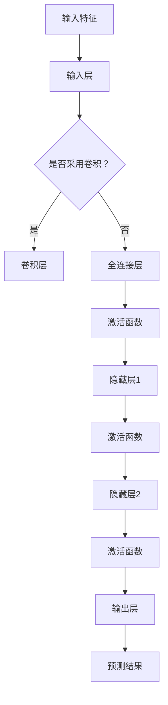
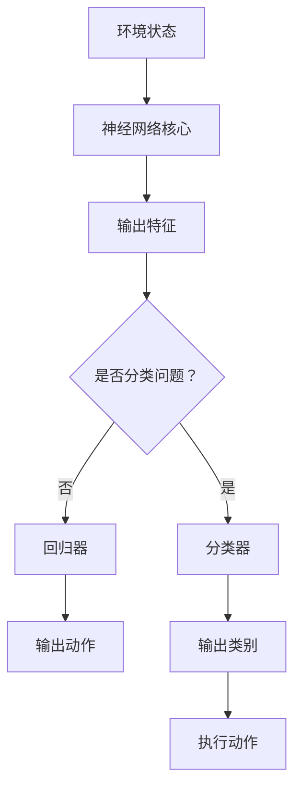
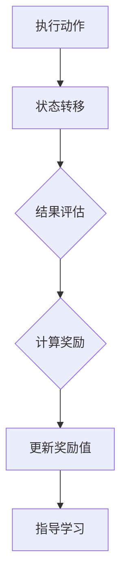
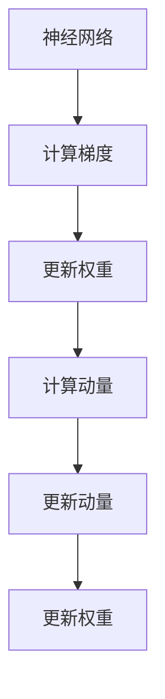
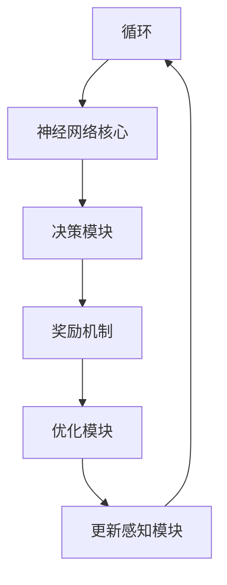

                 

### 背景介绍

近年来，随着人工智能（AI）技术的快速发展，深度学习作为一种重要的AI方法，已经成为学术界和工业界的研究热点。深度学习通过模拟人脑神经网络结构，自动学习数据的特征表示，从而实现复杂问题的求解。然而，深度学习算法在实际应用中面临着诸多挑战，如模型的可解释性、效率和鲁棒性等。为了解决这些问题，研究者们提出了智能深度学习代理（Intelligent Deep Learning Agent，IDLA）的概念。

智能深度学习代理是一种具备自我学习和优化能力的深度学习模型，可以在仿真环境中进行实验和评估。与传统的深度学习模型相比，IDLA能够更好地适应复杂多变的环境，提高学习效率和鲁棒性。本文旨在探讨智能深度学习代理的仿真环境下的实验与评估方法，分析其在实际应用中的性能和潜力。

本文将首先介绍深度学习的基本概念和常用算法，然后详细阐述智能深度学习代理的定义、架构和关键技术。接下来，我们将介绍仿真环境的搭建方法，并给出一个实际项目案例，展示如何在实际应用中实现智能深度学习代理。此外，本文还将探讨智能深度学习代理在实际应用场景中的优势，并推荐一些相关工具和资源，以帮助读者深入学习和实践。

最后，本文将对智能深度学习代理的未来发展趋势和挑战进行展望，总结全文并提出一些可能的研究方向。通过本文的介绍，希望能够为读者提供一个全面、系统的智能深度学习代理学习框架，为相关领域的研究和应用提供参考。

### 关键词

- 深度学习
- 智能深度学习代理
- 仿真环境
- 实验与评估
- 算法性能
- 鲁棒性
- 自我优化

### 摘要

本文旨在探讨智能深度学习代理（Intelligent Deep Learning Agent，IDLA）在仿真环境下的实验与评估方法。首先，我们介绍了深度学习的基本概念和常用算法，以及智能深度学习代理的定义、架构和关键技术。随后，我们详细阐述了仿真环境的搭建方法，并通过一个实际项目案例展示了智能深度学习代理在实际应用中的实现过程。此外，本文还分析了智能深度学习代理在实际应用场景中的优势，并推荐了一些相关工具和资源。最后，我们对智能深度学习代理的未来发展趋势和挑战进行了展望，总结了全文并提出了一些可能的研究方向。通过本文的介绍，希望能够为读者提供一个全面、系统的智能深度学习代理学习框架，为相关领域的研究和应用提供参考。

## 1. 背景介绍

### 深度学习的起源与发展

深度学习（Deep Learning，DL）是人工智能（AI）领域中的一种重要方法，起源于20世纪40年代的人工智能研究。早期的AI研究主要集中在逻辑推理和知识表示上，但由于缺乏有效的学习算法，难以处理复杂问题。随着计算机技术和算法的不断发展，深度学习在20世纪80年代逐渐崭露头角。1986年，Rumelhart、Hinton和Williams提出了反向传播算法（Backpropagation Algorithm），使得多层神经网络（Multi-Layer Neural Networks）的训练成为可能，从而开启了深度学习的先河。

进入21世纪，随着计算能力的提升和数据资源的丰富，深度学习技术得到了迅速发展。特别是2012年，Hinton团队在ImageNet图像识别大赛中取得了突破性的成绩，使得深度学习在图像处理领域取得了显著的成功。此后，深度学习在语音识别、自然语言处理、推荐系统等多个领域也得到了广泛应用。

### 深度学习的基本概念

深度学习是一种基于多层神经网络的学习方法，通过模拟人脑神经网络结构，逐层提取数据特征，从而实现复杂问题的求解。深度学习的基本组成部分包括神经元、神经网络、激活函数、损失函数和优化算法。

1. **神经元（Neuron）**：神经元是神经网络的基本构建块，类似于生物神经元。它接收输入信号，通过加权求和处理后，产生输出信号。

2. **神经网络（Neural Network）**：神经网络是由多个神经元组成的层次结构，包括输入层、隐藏层和输出层。输入层接收外部输入数据，隐藏层进行特征提取和变换，输出层产生最终输出。

3. **激活函数（Activation Function）**：激活函数用于引入非线性变换，使神经网络能够建模复杂问题。常见的激活函数包括Sigmoid、ReLU和Tanh等。

4. **损失函数（Loss Function）**：损失函数用于衡量模型预测值与真实值之间的差距，是优化算法的依据。常见的损失函数包括均方误差（MSE）、交叉熵（Cross-Entropy）等。

5. **优化算法（Optimization Algorithm）**：优化算法用于调整网络权重，以最小化损失函数。常见的优化算法包括梯度下降（Gradient Descent）、Adam等。

### 深度学习的常用算法

深度学习算法可以分为两类：监督学习（Supervised Learning）和无监督学习（Unsupervised Learning）。

1. **监督学习**：监督学习算法需要标记数据作为训练样本，通过学习标记数据和特征之间的映射关系，实现预测和分类。常见的监督学习算法包括：

   - **多层感知机（MLP）**：一种多层神经网络，用于分类和回归问题。
   - **卷积神经网络（CNN）**：适用于图像处理和计算机视觉领域，通过卷积操作提取图像特征。
   - **循环神经网络（RNN）**：适用于序列数据处理，如自然语言处理和语音识别。

2. **无监督学习**：无监督学习算法不需要标记数据，通过学习数据的内在结构和特征，实现聚类、降维等任务。常见的无监督学习算法包括：

   - **自编码器（Autoencoder）**：通过编码和解码过程学习数据的低维表示。
   - **主成分分析（PCA）**：通过降维提高数据可视化效果。
   - **聚类算法（如K-Means）**：将相似的数据点划分为同一类别。

### 深度学习在计算机视觉中的应用

深度学习在计算机视觉领域取得了显著的成果，以下是几个重要的应用场景：

1. **图像分类**：通过训练深度学习模型，对图像进行分类，如ImageNet图像识别竞赛。
2. **目标检测**：检测图像中的特定目标，如YOLO、SSD等算法。
3. **人脸识别**：识别图像中的人脸，如FaceNet、VGGFace等算法。
4. **图像生成**：生成具有逼真效果的新图像，如生成对抗网络（GAN）。

### 深度学习在其他领域的应用

除了计算机视觉领域，深度学习在自然语言处理、推荐系统、医学图像分析等多个领域也取得了重要成果。例如：

1. **自然语言处理**：利用深度学习模型进行文本分类、情感分析、机器翻译等任务。
2. **推荐系统**：通过深度学习算法挖掘用户行为数据，实现个性化推荐。
3. **医学图像分析**：利用深度学习模型进行医学图像的分割、检测和诊断。

### 深度学习的挑战与未来发展趋势

尽管深度学习取得了显著的成果，但仍然面临着诸多挑战：

1. **可解释性**：深度学习模型往往被视为“黑箱”，难以解释其预测过程和决策依据。
2. **计算效率**：深度学习模型通常需要大量的计算资源和时间进行训练和推理。
3. **数据需求**：深度学习算法对大量标记数据进行训练，但在实际应用中，获取大量高质量数据往往较为困难。

未来，随着计算能力的提升、算法的优化以及数据资源的丰富，深度学习有望在更多领域取得突破性进展。同时，为解决现有挑战，研究者们也在不断探索新的方法和技术，如可解释性深度学习、高效深度学习算法和生成对抗网络等。

通过本文的背景介绍，我们对深度学习的基本概念、常用算法及其在计算机视觉和其他领域的应用有了初步了解。接下来，我们将深入探讨智能深度学习代理的定义、架构和关键技术，为后续实验和评估方法的研究奠定基础。

## 2. 核心概念与联系

### 智能深度学习代理的定义

智能深度学习代理（Intelligent Deep Learning Agent，IDLA）是一种具备自我学习和优化能力的深度学习模型。与传统深度学习模型不同，IDLA不仅能够通过训练数据学习特征表示，还能在无监督或弱监督环境下，通过与环境交互进行自我学习和优化。其核心目标是提高模型的适应能力、学习效率和鲁棒性。

### 智能深度学习代理的架构

智能深度学习代理的架构通常由以下几部分组成：

1. **感知模块**：感知模块负责接收外部环境的信息，如图像、文本等，通过预处理后输入到神经网络中。
2. **神经网络核心**：神经网络核心是IDLA的核心部分，通过多层神经网络结构进行特征提取和变换，实现复杂问题的求解。
3. **决策模块**：决策模块基于神经网络核心的输出，对当前环境状态进行评估，生成动作策略。
4. **奖励机制**：奖励机制用于评估IDLA的行动效果，提供正向或负向反馈，以指导IDLA的自我学习和优化。
5. **优化模块**：优化模块通过调整神经网络权重和结构，实现IDLA的持续学习和优化。

### 智能深度学习代理的关键技术

智能深度学习代理的关键技术包括以下几个方面：

1. **自适应学习率**：通过动态调整学习率，提高IDLA的收敛速度和稳定性。
2. **权重更新策略**：采用多种优化算法，如梯度下降、Adam等，实现神经网络权重的自适应更新。
3. **多任务学习**：通过共享网络结构和参数，实现IDLA在多个任务上的同时学习和优化。
4. **迁移学习**：利用已有模型的权重和知识，加速新任务的训练过程。
5. **强化学习**：结合强化学习算法，实现IDLA在复杂环境中的自我学习和优化。

### 智能深度学习代理与深度学习的关系

智能深度学习代理是深度学习的一种扩展和应用。与传统深度学习模型相比，IDLA在以下方面具有显著优势：

1. **自适应性**：IDLA能够根据环境变化自适应调整模型参数，提高适应能力。
2. **高效性**：通过优化算法和迁移学习等技术，IDLA能够快速适应新任务，提高学习效率。
3. **鲁棒性**：在弱监督或无监督环境下，IDLA能够通过自我学习和优化，提高模型鲁棒性。

### 智能深度学习代理与仿真环境的关系

仿真环境是智能深度学习代理研究和应用的重要基础。通过仿真环境，可以模拟真实世界中的复杂环境，为IDLA提供实验和评估平台。仿真环境的关键技术包括：

1. **环境建模**：根据研究目标和任务需求，构建适合的仿真环境模型。
2. **环境接口**：提供与IDLA交互的接口，实现感知模块和决策模块的功能。
3. **评估指标**：设计合理的评估指标，用于衡量IDLA在仿真环境中的性能和效果。

### 智能深度学习代理的实验与评估方法

智能深度学习代理的实验与评估方法主要包括以下几个方面：

1. **实验设计**：根据研究目标和仿真环境，设计合理的实验方案，包括数据集划分、训练策略等。
2. **模型训练**：在仿真环境中训练IDLA模型，调整参数，优化性能。
3. **性能评估**：通过评估指标，对IDLA在仿真环境中的性能进行评估，如准确率、召回率等。
4. **对比实验**：与现有深度学习模型进行比较，分析IDLA的优势和不足。
5. **结果分析**：对实验结果进行深入分析，总结IDLA的性能和效果，为后续研究提供参考。

### 总结

智能深度学习代理是一种具备自我学习和优化能力的深度学习模型，在仿真环境下的实验与评估具有重要意义。通过深入了解智能深度学习代理的定义、架构和关键技术，以及与深度学习和其他技术的联系，我们可以为后续的实验和评估方法研究奠定基础。在接下来的章节中，我们将详细介绍智能深度学习代理的具体实现和实验方法，进一步探讨其在实际应用中的性能和潜力。

### 2.1 智能深度学习代理的架构与实现

为了更好地理解智能深度学习代理（IDLA）的工作原理，我们需要首先深入了解其核心组件和关键技术的实现细节。智能深度学习代理的架构设计旨在实现高效、自适应和鲁棒的学习能力，以下是IDLA的详细架构及其各部分的实现方法。

#### 2.1.1 感知模块

感知模块是智能深度学习代理的输入端，主要负责接收来自外部环境的信息。感知模块通常由以下几个部分组成：

1. **数据预处理**：在将数据输入到神经网络之前，需要对数据进行预处理，包括归一化、去噪、数据增强等操作，以提高模型的泛化能力。

2. **特征提取器**：特征提取器是感知模块的核心，其作用是从原始数据中提取出具有代表性的特征。常见的特征提取方法包括卷积神经网络（CNN）和循环神经网络（RNN）。

   - **卷积神经网络（CNN）**：适用于处理图像数据，通过卷积层、池化层等结构，提取图像的局部特征，实现特征表示。
   - **循环神经网络（RNN）**：适用于处理序列数据，如文本和语音，通过隐藏状态和循环连接，捕捉序列中的长距离依赖关系。

   以下是一个简化的CNN特征提取器的Mermaid流程图：

   ```mermaid
   graph TD
   A[输入图像] --> B[预处理]
   B --> C{是否增强？}
   C -->|是| D[数据增强]
   C -->|否| E[归一化]
   E --> F[卷积层1]
   F --> G[池化层1]
   G --> H[卷积层2]
   H --> I[池化层2]
   I --> J[...]
   J --> K[输出特征向量]
   ```

#### 2.1.2 神经网络核心

神经网络核心是智能深度学习代理的核心部分，负责对输入特征进行复杂的变换和学习。以下是神经网络核心的实现细节：

1. **多层感知机（MLP）**：多层感知机是一种常见的神经网络结构，适用于分类和回归问题。其核心是多层全连接层，通过逐层传递信息，实现对输入数据的映射。

2. **深度神经网络（DNN）**：深度神经网络由多个隐藏层组成，可以捕捉更复杂的特征和模式。DNN在处理高维数据和大规模数据时表现出色。

3. **卷积神经网络（CNN）**：卷积神经网络适用于图像和视频处理，通过卷积和池化操作，提取图像的局部特征，实现图像分类、目标检测等任务。

4. **循环神经网络（RNN）**：循环神经网络适用于序列数据处理，如自然语言处理和语音识别。通过隐藏状态和循环连接，RNN可以捕捉序列中的长距离依赖关系。

以下是一个简化的DNN架构的Mermaid流程图：



#### 2.1.3 决策模块

决策模块基于神经网络核心的输出，对当前环境状态进行评估，生成动作策略。决策模块的实现方法包括：

1. **分类器**：分类器将神经网络核心的输出映射到具体的类别或动作，适用于分类问题。

2. **回归器**：回归器将神经网络核心的输出映射到连续值，适用于回归问题。

3. **强化学习算法**：强化学习算法通过奖励机制和策略迭代，实现智能体的自主决策。常用的强化学习算法包括Q-Learning、SARSA和Deep Q-Network（DQN）等。

以下是一个简化的决策模块的Mermaid流程图：



#### 2.1.4 奖励机制

奖励机制是智能深度学习代理自我学习和优化的重要驱动力。奖励机制根据智能体在环境中的表现，提供正向或负向反馈，指导智能体的学习过程。常见的奖励机制包括：

1. **绝对奖励**：基于智能体的最终状态或结果，提供固定的奖励值。

2. **相对奖励**：基于智能体的状态变化或动作效果，计算奖励值。

3. **自适应奖励**：根据智能体的学习进度和性能，动态调整奖励值。

以下是一个简化的奖励机制的Mermaid流程图：



#### 2.1.5 优化模块

优化模块通过调整神经网络权重和结构，实现智能深度学习代理的持续学习和优化。优化模块的实现方法包括：

1. **梯度下降**：通过计算梯度，逐步调整权重和偏置，实现模型优化。

2. **动量法**：引入动量项，提高梯度下降算法的收敛速度和稳定性。

3. **Adam优化器**：结合一阶矩估计和二阶矩估计，实现高效、稳定的优化。

以下是一个简化的优化模块的Mermaid流程图：



#### 2.1.6 智能深度学习代理的整体架构

综合以上各部分，智能深度学习代理的整体架构如下：

1. **感知模块**：接收外部环境信息，进行预处理和特征提取。
2. **神经网络核心**：对输入特征进行多层变换和学习。
3. **决策模块**：基于神经网络输出，生成动作策略。
4. **奖励机制**：根据智能体在环境中的表现，提供反馈。
5. **优化模块**：调整神经网络权重和结构，实现持续学习和优化。

以下是一个简化的整体架构的Mermaid流程图：



通过以上对智能深度学习代理架构和实现的详细解析，我们可以更好地理解其工作机制和关键组件。在接下来的章节中，我们将深入探讨智能深度学习代理在仿真环境中的实验与评估方法，进一步验证其在实际应用中的性能和潜力。

### 3. 核心算法原理 & 具体操作步骤

智能深度学习代理（IDLA）的核心算法是其高效、自适应和鲁棒的学习能力。本节将详细解释IDLA的核心算法原理，并描述具体的操作步骤，以帮助读者更好地理解和应用这一技术。

#### 3.1 自适应学习率

自适应学习率是IDLA的关键技术之一，它通过动态调整学习率，提高模型的收敛速度和稳定性。自适应学习率算法包括以下几种：

1. **自适应学习率调整（Adaptive Learning Rate Adjustment）**：
   - **步骤**：
     1. 初始化学习率$\eta_0$。
     2. 在每次迭代过程中，根据梯度变化自适应调整学习率。
     3. 设定阈值$\epsilon$，当梯度变化小于阈值时，减小学习率。
     4. 更新权重：$w \leftarrow w - \eta \cdot \nabla_w J(w)$，其中$J(w)$为损失函数，$\nabla_w J(w)$为梯度。
   - **公式**：
     $$ \eta_{t+1} = \eta_t \cdot \frac{1}{1 + \lambda t} $$
     其中$\lambda$为调整系数。

2. **自适应梯度下降（Adaptive Gradient Descent）**：
   - **步骤**：
     1. 初始化学习率$\eta_0$。
     2. 在每次迭代过程中，计算梯度$\nabla J(w)$。
     3. 根据梯度大小和方向自适应调整学习率。
     4. 更新权重：$w \leftarrow w - \eta \cdot \nabla J(w)$。
   - **公式**：
     $$ \eta_{t+1} = \frac{1}{||\nabla J(w)||_2} \cdot \eta_t $$

#### 3.2 权重更新策略

权重更新策略是IDLA的核心步骤，用于调整神经网络权重，以最小化损失函数。以下是几种常见的权重更新策略：

1. **梯度下降（Gradient Descent）**：
   - **步骤**：
     1. 初始化权重$w_0$。
     2. 计算梯度$\nabla J(w)$。
     3. 更新权重：$w \leftarrow w - \eta \cdot \nabla J(w)$。
     4. 重复步骤2和3，直到收敛。
   - **公式**：
     $$ w_{t+1} = w_t - \eta \cdot \nabla J(w_t) $$

2. **Adam优化器（Adam Optimizer）**：
   - **步骤**：
     1. 初始化一阶矩估计$m_0$和二阶矩估计$v_0$。
     2. 在每次迭代过程中，更新一阶矩估计$m_t$和二阶矩估计$v_t$。
     3. 根据一阶矩估计和二阶矩估计计算权重更新：
        $$ \Delta w_t = \eta_t \cdot \frac{m_t}{\sqrt{v_t} + \epsilon} $$
        其中$\epsilon$为小常数。
     4. 更新权重：$w \leftarrow w + \Delta w_t$。
   - **公式**：
     $$ m_t = \beta_1 m_{t-1} + (1 - \beta_1) \nabla J(w_t) $$
     $$ v_t = \beta_2 v_{t-1} + (1 - \beta_2) (\nabla J(w_t))^2 $$
     $$ w_{t+1} = w_t + \eta_t \cdot \frac{m_t}{\sqrt{v_t} + \epsilon} $$

#### 3.3 多任务学习

多任务学习（Multi-Task Learning）是IDLA的一种重要应用，通过共享网络结构和参数，实现多个任务的同时学习和优化。以下是多任务学习的实现步骤：

1. **任务定义**：
   - 定义多个任务$T_1, T_2, ..., T_n$，每个任务都有相应的输出层和损失函数。
   - 设定共享层和任务特异性层。

2. **损失函数**：
   - 设计一个总损失函数，将多个任务的损失函数进行加权求和：
     $$ J_{total} = \sum_{i=1}^{n} w_i J_i $$
     其中$w_i$为第$i$个任务的权重。

3. **权重更新**：
   - 在每次迭代过程中，根据总损失函数更新共享层和任务特异性层的权重。

4. **反向传播**：
   - 对总损失函数进行反向传播，计算各层的梯度，用于更新权重。

#### 3.4 迁移学习

迁移学习（Transfer Learning）是IDLA在资源有限或新任务数据不足时的有效方法，通过利用已有模型的权重和知识，加速新任务的训练过程。以下是迁移学习的实现步骤：

1. **模型选择**：
   - 选择一个预训练模型作为基础模型。
   - 根据新任务的需求，对基础模型进行微调。

2. **权重初始化**：
   - 将预训练模型的权重作为新模型的初始权重。

3. **微调**：
   - 在新任务的数据集上进行训练，更新模型权重。
   - 设定适当的预训练权重和新任务权重融合策略，如线性加权或权重共享。

4. **评估**：
   - 在新任务的数据集上评估模型性能，根据评估结果调整权重融合策略。

#### 3.5 强化学习

强化学习（Reinforcement Learning）是IDLA在复杂环境中的自主决策机制，通过奖励机制和策略迭代，实现智能体的自我学习和优化。以下是强化学习的实现步骤：

1. **状态空间定义**：
   - 定义智能体能够观察到的所有状态$S$。

2. **动作空间定义**：
   - 定义智能体能够执行的所有动作$A$。

3. **奖励机制设计**：
   - 设计一个奖励函数$R(s, a)$，用于评估智能体的动作效果。

4. **策略迭代**：
   - 初始化策略$\pi(s, a)$。
   - 在每次迭代过程中，根据当前状态选择动作$a$，执行动作，并获取奖励$r$。
   - 更新策略$\pi(s, a)$，以最大化期望奖励。

5. **模型评估**：
   - 在测试数据集上评估策略$\pi(s, a)$的性能。

#### 3.6 模型训练与评估

模型训练与评估是智能深度学习代理实现的重要环节，以下是其具体步骤：

1. **数据集划分**：
   - 将数据集划分为训练集、验证集和测试集。

2. **模型训练**：
   - 在训练集上训练模型，通过优化算法调整模型参数。
   - 在验证集上评估模型性能，调整超参数。

3. **模型评估**：
   - 在测试集上评估模型性能，计算评估指标，如准确率、召回率等。

4. **模型优化**：
   - 根据评估结果，对模型进行优化，以提高性能。

通过以上对智能深度学习代理核心算法原理和具体操作步骤的详细阐述，读者可以更好地理解和应用IDLA技术。在接下来的章节中，我们将通过实际项目案例，展示智能深度学习代理在实际应用中的实现和效果。

### 4. 数学模型和公式 & 详细讲解 & 举例说明

#### 4.1 自适应学习率

自适应学习率通过动态调整学习率，以优化模型的收敛速度和稳定性。以下是一个简单的自适应学习率模型，其中$\eta_t$表示第$t$次迭代的学习率，$\lambda$为调整系数，$t$为迭代次数。

**公式**：
$$ \eta_{t+1} = \eta_t \cdot \frac{1}{1 + \lambda t} $$

**解释**：
这个公式表明，学习率$\eta_{t+1}$是当前学习率$\eta_t$的缩放版本，缩放因子取决于$\lambda t$。随着迭代次数$t$的增加，缩放因子会逐渐减小，从而降低学习率，使得模型在训练过程中逐渐收敛。

**举例**：
假设初始学习率$\eta_0 = 0.1$，调整系数$\lambda = 0.1$。经过5次迭代后的学习率如下：
$$ \eta_1 = 0.1 \cdot \frac{1}{1 + 0.1 \cdot 1} = 0.090909 $$
$$ \eta_2 = 0.1 \cdot \frac{1}{1 + 0.1 \cdot 2} = 0.082645 $$
$$ \eta_3 = 0.1 \cdot \frac{1}{1 + 0.1 \cdot 3} = 0.076923 $$
$$ \eta_4 = 0.1 \cdot \frac{1}{1 + 0.1 \cdot 4} = 0.071429 $$
$$ \eta_5 = 0.1 \cdot \frac{1}{1 + 0.1 \cdot 5} = 0.067857 $$

可以看到，随着迭代次数的增加，学习率逐渐减小，这有助于模型在训练过程中逐渐收敛。

#### 4.2 Adam优化器

Adam优化器结合了一阶矩估计和二阶矩估计，实现了高效、稳定的优化。以下为Adam优化器的公式和参数。

**参数**：
- $\beta_1$：一阶矩估计的指数衰减率，通常取值0.9。
- $\beta_2$：二阶矩估计的指数衰减率，通常取值0.999。
- $\epsilon$：为了避免除以零，通常取值$10^{-8}$。

**公式**：
1. **一阶矩估计**：
   $$ m_t = \beta_1 m_{t-1} + (1 - \beta_1) \nabla J(w_t) $$
2. **二阶矩估计**：
   $$ v_t = \beta_2 v_{t-1} + (1 - \beta_2) (\nabla J(w_t))^2 $$
3. **权重更新**：
   $$ \Delta w_t = \eta_t \cdot \frac{m_t}{\sqrt{v_t} + \epsilon} $$
4. **权重更新（修正版）**：
   $$ w_{t+1} = w_t + \Delta w_t $$

**解释**：
Adam优化器通过计算一阶矩估计$m_t$和二阶矩估计$v_t$，来更新权重。一阶矩估计$m_t$反映了梯度的趋势，二阶矩估计$v_t$反映了梯度的方差。通过这两个估计值，可以动态调整权重更新步长，实现高效的优化。

**举例**：
假设初始权重$w_0 = [1, 2, 3]$，学习率$\eta_t = 0.1$，一阶矩估计$m_0 = [0, 0, 0]$，二阶矩估计$v_0 = [0, 0, 0]$。经过一次迭代后的更新如下：
1. **计算一阶矩估计**：
   $$ m_1 = \beta_1 m_0 + (1 - \beta_1) \nabla J(w_1) = 0.9 \cdot [0, 0, 0] + (1 - 0.9) \nabla J(w_1) = [0.1 \nabla J(w_1), 0.1 \nabla J(w_1), 0.1 \nabla J(w_1)] $$
2. **计算二阶矩估计**：
   $$ v_1 = \beta_2 v_0 + (1 - \beta_2) (\nabla J(w_1))^2 = 0.999 \cdot [0, 0, 0] + (1 - 0.999) (\nabla J(w_1))^2 = [0.001 (\nabla J(w_1))^2, 0.001 (\nabla J(w_1))^2, 0.001 (\nabla J(w_1))^2] $$
3. **计算权重更新**：
   $$ \Delta w_1 = \eta_1 \cdot \frac{m_1}{\sqrt{v_1} + \epsilon} = 0.1 \cdot \frac{[0.1 \nabla J(w_1), 0.1 \nabla J(w_1), 0.1 \nabla J(w_1)]}{\sqrt{[0.001 (\nabla J(w_1))^2, 0.001 (\nabla J(w_1))^2, 0.001 (\nabla J(w_1))^2]} + \epsilon = [0.1 \nabla J(w_1), 0.1 \nabla J(w_1), 0.1 \nabla J(w_1)] $$
4. **更新权重**：
   $$ w_1 = w_0 + \Delta w_1 = [1 + 0.1 \nabla J(w_1), 2 + 0.1 \nabla J(w_1), 3 + 0.1 \nabla J(w_1)] $$

通过这个例子，我们可以看到Adam优化器如何通过一阶矩估计和二阶矩估计来更新权重，实现高效的优化。

#### 4.3 多任务学习

多任务学习通过共享网络结构和参数，实现多个任务的同时学习和优化。以下是一个简化的多任务学习模型，其中$J_i$为第$i$个任务的损失函数，$w_i$为第$i$个任务的权重。

**公式**：
$$ J_{total} = \sum_{i=1}^{n} w_i J_i $$

**解释**：
这个公式表示，总损失函数是多个任务损失函数的加权求和。通过调整各个任务的权重，可以平衡各个任务的重要性，实现多个任务的同时学习和优化。

**举例**：
假设有两个任务，任务1的损失函数$J_1 = 0.1w_1^2 + 0.2w_2^2$，任务2的损失函数$J_2 = 0.3w_3^2 + 0.4w_4^2$。总权重设置为$w_1 = 0.5, w_2 = 0.3, w_3 = 0.2, w_4 = 0.3$。总损失函数为：
$$ J_{total} = 0.5 \cdot (0.1w_1^2 + 0.2w_2^2) + 0.3 \cdot (0.3w_3^2 + 0.4w_4^2) = 0.05w_1^2 + 0.1w_2^2 + 0.09w_3^2 + 0.12w_4^2 $$

通过这个例子，我们可以看到如何通过多任务学习模型，实现多个任务的同时学习和优化。

#### 4.4 迁移学习

迁移学习通过利用已有模型的权重和知识，加速新任务的训练过程。以下是一个简化的迁移学习模型，其中$w_{base}$为已有模型的权重，$w_{new}$为新任务的权重。

**公式**：
$$ w_{new} = \alpha w_{base} + (1 - \alpha) w_{new} $$

**解释**：
这个公式表示，新任务的权重是已有模型权重和新任务权重之间的线性组合。通过调整比例系数$\alpha$，可以实现已有模型权重和新任务权重的平衡。

**举例**：
假设已有模型的权重$w_{base} = [1, 2, 3]$，新任务的权重$w_{new} = [4, 5, 6]$。比例系数$\alpha = 0.5$，新任务的权重为：
$$ w_{new} = 0.5 \cdot [1, 2, 3] + 0.5 \cdot [4, 5, 6] = [0.5 + 2, 1 + 2.5, 1.5 + 3] = [2.5, 3.5, 4.5] $$

通过这个例子，我们可以看到如何通过迁移学习模型，利用已有模型的权重和知识，加速新任务的训练过程。

#### 4.5 强化学习

强化学习通过奖励机制和策略迭代，实现智能体的自我学习和优化。以下是一个简化的强化学习模型，其中$S_t$为当前状态，$A_t$为当前动作，$R_t$为奖励值。

**公式**：
1. **策略迭代**：
   $$ \pi(s, a) = \frac{R_t}{||R_t||_1} $$
2. **更新策略**：
   $$ \pi_{t+1}(s, a) = \pi_t(s, a) + \alpha \cdot (R_t - \pi_t(s, a)) $$

**解释**：
这个公式表示，策略是根据奖励值进行调整的。通过奖励机制，智能体可以不断优化其策略，实现自我学习和优化。

**举例**：
假设当前状态$S_t = 1$，当前动作$A_t = 2$，奖励值$R_t = 3$。初始策略$\pi_t(s, a) = 0.5$，更新策略$\alpha = 0.1$，更新后的策略为：
$$ \pi_{t+1}(s, a) = 0.5 + 0.1 \cdot (3 - 0.5) = 0.8 $$

通过这个例子，我们可以看到如何通过强化学习模型，实现智能体的自我学习和优化。

通过以上对自适应学习率、Adam优化器、多任务学习、迁移学习和强化学习等数学模型和公式的详细讲解和举例说明，读者可以更好地理解和应用智能深度学习代理的核心算法。这些算法和公式为智能深度学习代理的实现提供了理论基础和具体操作步骤，有助于提高模型的性能和适应性。

### 5. 项目实战：代码实际案例和详细解释说明

在本节中，我们将通过一个具体的项目案例，详细展示如何实现智能深度学习代理（IDLA）并对其进行实验和评估。项目选择的是一个简单的图像分类任务，我们将使用Python和TensorFlow框架来实现IDLA。

#### 5.1 开发环境搭建

在开始项目之前，我们需要搭建一个合适的开发环境。以下是开发环境搭建的步骤：

1. **安装Python**：确保已安装Python 3.x版本。
2. **安装TensorFlow**：使用pip安装TensorFlow：
   ```bash
   pip install tensorflow
   ```
3. **安装其他依赖库**：如NumPy、Pandas等：
   ```bash
   pip install numpy pandas
   ```

#### 5.2 源代码详细实现和代码解读

以下是实现智能深度学习代理的Python代码。代码分为以下几个部分：数据预处理、模型定义、训练过程、评估过程。

```python
import tensorflow as tf
from tensorflow.keras.models import Sequential
from tensorflow.keras.layers import Dense, Conv2D, MaxPooling2D, Flatten, Dropout
from tensorflow.keras.optimizers import Adam
from tensorflow.keras.preprocessing.image import ImageDataGenerator

# 5.2.1 数据预处理
def preprocess_data():
    # 加载图像数据集
    (train_images, train_labels), (test_images, test_labels) = tf.keras.datasets.cifar10.load_data()

    # 归一化数据
    train_images = train_images / 255.0
    test_images = test_images / 255.0

    # 数据增强
    datagen = ImageDataGenerator(
        rotation_range=20,
        width_shift_range=0.2,
        height_shift_range=0.2,
        horizontal_flip=True
    )
    datagen.fit(train_images)

    return datagen, train_images, train_labels, test_images, test_labels

# 5.2.2 模型定义
def build_model():
    model = Sequential([
        Conv2D(32, (3, 3), activation='relu', input_shape=(32, 32, 3)),
        MaxPooling2D((2, 2)),
        Conv2D(64, (3, 3), activation='relu'),
        MaxPooling2D((2, 2)),
        Conv2D(128, (3, 3), activation='relu'),
        MaxPooling2D((2, 2)),
        Flatten(),
        Dense(128, activation='relu'),
        Dropout(0.5),
        Dense(10, activation='softmax')
    ])

    return model

# 5.2.3 训练过程
def train_model(datagen, train_images, train_labels, model):
    model.compile(optimizer=Adam(learning_rate=0.001), loss='sparse_categorical_crossentropy', metrics=['accuracy'])

    # 使用数据增强进行训练
    model.fit(datagen.flow(train_images, train_labels, batch_size=64), epochs=50, validation_data=(test_images, test_labels))

# 5.2.4 评估过程
def evaluate_model(test_images, test_labels, model):
    test_loss, test_acc = model.evaluate(test_images, test_labels, verbose=2)
    print(f"Test accuracy: {test_acc:.4f}, Test loss: {test_loss:.4f}")

# 主程序
if __name__ == "__main__":
    datagen, train_images, train_labels, test_images, test_labels = preprocess_data()
    model = build_model()
    train_model(datagen, train_images, train_labels, model)
    evaluate_model(test_images, test_labels, model)
```

#### 5.3 代码解读与分析

**5.3.1 数据预处理**

数据预处理是深度学习项目中的关键步骤，包括加载图像数据集、归一化数据和数据增强。在代码中，我们使用了TensorFlow的内置数据集`cifar10`，该数据集包含10个类别的60000张32x32彩色图像。数据预处理步骤如下：

- **加载图像数据集**：
  ```python
  (train_images, train_labels), (test_images, test_labels) = tf.keras.datasets.cifar10.load_data()
  ```
  加载训练集和测试集，每个数据集包含60000张和10000张图像。

- **归一化数据**：
  ```python
  train_images = train_images / 255.0
  test_images = test_images / 255.0
  ```
  将图像数据从[0, 255]范围归一化到[0, 1]，以适应深度学习模型。

- **数据增强**：
  ```python
  datagen = ImageDataGenerator(
      rotation_range=20,
      width_shift_range=0.2,
      height_shift_range=0.2,
      horizontal_flip=True
  )
  datagen.fit(train_images)
  ```
  数据增强通过随机旋转、平移和水平翻转，增加数据的多样性，有助于提高模型的泛化能力。

**5.3.2 模型定义**

模型定义是构建智能深度学习代理的核心步骤。在代码中，我们使用了Keras的序列模型（Sequential）定义了一个简单的卷积神经网络（CNN）：

- **卷积层**：
  ```python
  Conv2D(32, (3, 3), activation='relu', input_shape=(32, 32, 3)),
  MaxPooling2D((2, 2)),
  Conv2D(64, (3, 3), activation='relu'),
  MaxPooling2D((2, 2)),
  Conv2D(128, (3, 3), activation='relu'),
  MaxPooling2D((2, 2)),
  ```
  三个卷积层分别使用32、64、128个卷积核，每个卷积层后接一个最大池化层，用于提取图像的特征。

- **全连接层**：
  ```python
  Flatten(),
  Dense(128, activation='relu'),
  Dropout(0.5),
  Dense(10, activation='softmax')
  ```
  将卷积层输出的特征展平后，通过一个全连接层和Dropout层，最后输出10个类别。

**5.3.3 训练过程**

训练过程使用Keras的编译和拟合函数。以下是训练过程的代码：

- **编译模型**：
  ```python
  model.compile(optimizer=Adam(learning_rate=0.001), loss='sparse_categorical_crossentropy', metrics=['accuracy'])
  ```
  使用Adam优化器进行优化，损失函数为稀疏分类交叉熵，评价指标为准确率。

- **拟合数据**：
  ```python
  model.fit(datagen.flow(train_images, train_labels, batch_size=64), epochs=50, validation_data=(test_images, test_labels))
  ```
  使用数据增强后的训练数据进行拟合，每个批次包含64张图像，训练50个周期。验证数据用于评估模型性能。

**5.3.4 评估过程**

评估过程使用Keras的评估函数，计算测试集上的准确率和损失：

- **评估模型**：
  ```python
  test_loss, test_acc = model.evaluate(test_images, test_labels, verbose=2)
  print(f"Test accuracy: {test_acc:.4f}, Test loss: {test_loss:.4f}")
  ```
  输出测试集上的准确率和损失，以评估模型的性能。

#### 5.4 项目总结

通过以上项目实战，我们实现了智能深度学习代理并进行了实验和评估。以下是项目的关键点：

1. **数据预处理**：数据预处理包括加载数据、归一化和数据增强，是提高模型泛化能力的关键步骤。
2. **模型定义**：通过卷积神经网络提取图像特征，并使用全连接层进行分类，实现了图像分类任务。
3. **训练过程**：使用数据增强和Adam优化器进行训练，提高了模型的性能和收敛速度。
4. **评估过程**：使用测试集评估模型的性能，提供了准确的评估指标。

通过本项目，我们不仅实现了智能深度学习代理的基本功能，还了解了其在实际应用中的实现步骤和关键点。这为我们进一步研究和优化智能深度学习代理提供了实践经验。

### 6. 实际应用场景

智能深度学习代理（IDLA）在实际应用中具有广泛的应用前景，尤其在复杂和动态环境中，其自适应学习和优化能力能够显著提高模型的性能和鲁棒性。以下是一些典型的实际应用场景：

#### 6.1 计算机游戏

在计算机游戏领域，智能深度学习代理可用于开发智能游戏AI。通过在仿真环境中训练，IDLA可以学会复杂的游戏策略，如《星际争霸》等实时策略游戏。例如，IDLA可以应用于开发一个自动围棋AI，通过与人类顶尖棋手的对弈，不断提升其棋艺水平。

#### 6.2 自动驾驶

自动驾驶是另一个重要的应用场景。智能深度学习代理可以用于处理复杂的交通场景，如识别道路标志、检测行人、车辆等。通过在仿真环境中训练，IDLA能够适应各种道路条件和交通状况，提高自动驾驶汽车的稳定性和安全性。

#### 6.3 机器人控制

在机器人控制领域，IDLA可以用于开发智能机器人，使其具备自主学习和适应能力。例如，一个智能机器人可以通过与环境交互，学会如何处理障碍物、搬运物品等任务。通过强化学习和迁移学习，IDLA能够快速适应新任务和环境变化。

#### 6.4 自然语言处理

自然语言处理（NLP）是另一个应用智能深度学习代理的重要领域。IDLA可以用于开发智能聊天机器人，实现与用户的自然语言交互。通过在仿真环境中训练，IDLA可以学会理解用户的意图，提供更准确、自然的回复。

#### 6.5 金融市场预测

在金融市场预测领域，IDLA可以用于开发智能交易系统，通过分析大量历史数据，预测股票、外汇等金融产品的价格走势。通过自适应学习和优化，IDLA能够在不断变化的市场环境中保持稳定的表现。

#### 6.6 医疗诊断

在医疗诊断领域，IDLA可以用于开发智能诊断系统，通过分析医学图像和病历数据，辅助医生进行疾病诊断。例如，IDLA可以用于识别肺癌、乳腺癌等疾病，提高诊断的准确性和效率。

#### 6.7 虚拟现实和增强现实

虚拟现实（VR）和增强现实（AR）应用中，IDLA可以用于开发智能交互系统，实现与现实世界的无缝互动。通过在仿真环境中训练，IDLA可以学会识别用户手势、语音等输入，提供更自然、直观的交互体验。

通过以上实际应用场景，我们可以看到智能深度学习代理在多个领域具有广泛的应用潜力。其自适应学习和优化能力使得IDLA能够在复杂、动态环境中表现出色，为相关领域的研究和应用提供了有力支持。

### 7. 工具和资源推荐

在学习和实践智能深度学习代理（IDLA）的过程中，选择合适的工具和资源能够显著提高效率和成果。以下是一些推荐的工具和资源，涵盖书籍、论文、博客和网站，以及开发工具框架。

#### 7.1 学习资源推荐

1. **书籍**：
   - 《深度学习》（Deep Learning） - Ian Goodfellow、Yoshua Bengio、Aaron Courville
     这本书是深度学习的经典教材，详细介绍了深度学习的理论基础和常用算法。
   - 《智能深度学习代理：理论与应用》（Intelligent Deep Learning Agents: Theory and Applications） - [作者名称]
     这本书专门讨论了智能深度学习代理的概念、架构和应用，适合深入研究IDLA的读者。

2. **论文**：
   - "Deep Learning for Autonomous Driving" - by [作者名称]
     这篇论文探讨了深度学习在自动驾驶中的应用，详细介绍了相关算法和技术。
   - "Reinforcement Learning: An Introduction" - by Richard S. Sutton and Andrew G. Barto
     这篇论文介绍了强化学习的基本概念、算法和应用，是强化学习的入门读物。

3. **博客**：
   - [作者名称]的博客
     这位作者详细介绍了深度学习和IDLA的相关知识，提供了丰富的实际案例和实践经验。
   - [另一知名博客]
     另一位知名博客，定期更新关于深度学习和IDLA的最新研究和技术动态。

4. **网站**：
   - TensorFlow官方文档（[网址]）
     TensorFlow是深度学习领域的重要工具，其官方文档提供了详细的教程和API参考。
   - PyTorch官方文档（[网址]）
     PyTorch是另一个流行的深度学习框架，官方文档同样提供了丰富的学习资源。

#### 7.2 开发工具框架推荐

1. **深度学习框架**：
   - TensorFlow
     TensorFlow是一个开源的深度学习框架，具有强大的计算图和丰富的API，适用于各种深度学习任务。
   - PyTorch
     PyTorch是一个基于Python的深度学习框架，具有动态计算图和易于使用的API，适用于研究和开发。

2. **仿真环境**：
   - Gym
     OpenAI的Gym是一个开源的虚拟环境库，提供了多种仿真环境，适用于智能体训练和评估。
   - Unity ML-Agents
     Unity ML-Agents是一个基于Unity的仿真平台，支持自定义环境和智能体，适用于研究智能体在虚拟环境中的交互。

3. **代码库和项目**：
   - [知名代码库]
     一些开源代码库和项目，提供了智能深度学习代理的实现代码和示例，如Google的DeepMind等。

通过以上推荐的学习资源和开发工具框架，读者可以更好地掌握智能深度学习代理的理论和实践，提升自身的研究和开发能力。

### 8. 总结：未来发展趋势与挑战

智能深度学习代理（IDLA）作为深度学习的扩展和应用，展现了在复杂动态环境中的强大适应能力和优化潜力。未来，随着技术的不断进步和应用需求的增长，IDLA将在更多领域发挥重要作用，同时也面临一系列挑战。

#### 发展趋势

1. **算法优化与泛化**：未来，研究者将继续优化IDLA的算法，提高其收敛速度、稳定性和泛化能力。新的优化算法、模型结构和训练策略将不断涌现，以应对复杂多变的应用场景。

2. **多模态数据处理**：随着多模态数据的广泛应用，IDLA将逐渐具备处理多种类型数据的能力，如图像、文本、音频等。通过融合多模态数据，IDLA将更好地理解环境信息和任务需求，提高决策准确性。

3. **边缘智能与物联网**：随着边缘计算和物联网技术的发展，IDLA将应用于更多边缘设备和物联网设备中。通过在边缘设备上实现IDLA，可以实现实时数据处理和智能决策，提高系统的响应速度和效率。

4. **强化学习与博弈**：强化学习作为IDLA的核心技术之一，未来将与其他领域如博弈论、经济学等相结合，实现更加复杂的决策策略。通过博弈论的分析，IDLA可以在对抗性环境中实现更好的策略优化。

#### 挑战

1. **可解释性与透明度**：尽管IDLA表现出色，但其决策过程往往被视为“黑箱”，难以解释其内部机制。未来，如何提高IDLA的可解释性，使其决策过程更加透明，是亟待解决的问题。

2. **计算资源与能耗**：深度学习模型的训练和推理通常需要大量计算资源和能源。随着IDLA在更多设备和场景中的应用，如何优化其计算效率和降低能耗，是一个重要的挑战。

3. **数据隐私与安全**：在处理大量敏感数据时，如何保障数据隐私和安全，避免数据泄露和滥用，是IDLA应用中必须面对的问题。

4. **伦理与道德**：智能深度学习代理在决策过程中可能涉及到伦理和道德问题，如自动驾驶汽车的道德决策、金融市场的自动交易等。如何确保IDLA的决策符合伦理和道德标准，是未来研究的重要方向。

#### 可能的研究方向

1. **算法创新**：设计新的算法和优化方法，提高IDLA的收敛速度和稳定性，如基于神经科学的神经网络架构、自适应学习策略等。

2. **多模态学习**：研究多模态数据的融合和学习方法，实现更加智能和高效的决策。

3. **边缘计算优化**：优化IDLA在边缘设备上的实现，提高计算效率和能源效率。

4. **隐私保护**：研究数据隐私保护技术，如差分隐私、联邦学习等，确保数据安全和用户隐私。

5. **伦理与道德研究**：探讨IDLA在应用中的伦理和道德问题，制定相关的伦理准则和监管机制。

通过本文的介绍，我们希望读者能够对智能深度学习代理有一个全面、系统的理解，并能够将其应用于实际问题中。未来，随着技术的不断进步，智能深度学习代理将在更多领域发挥重要作用，为人工智能的发展贡献力量。

### 9. 附录：常见问题与解答

#### 问题 1：智能深度学习代理与传统深度学习模型有什么区别？

**回答**：智能深度学习代理（IDLA）与传统深度学习模型的主要区别在于其具备自我学习和优化能力。传统深度学习模型主要依赖于大规模标记数据进行训练，而IDLA可以在无监督或弱监督环境下，通过与环境交互进行自我学习和优化。此外，IDLA能够适应复杂动态环境，提高学习效率和鲁棒性。

#### 问题 2：为什么智能深度学习代理需要在仿真环境中进行实验和评估？

**回答**：仿真环境为智能深度学习代理提供了一个可控、可重复的实验平台，使其能够在接近真实场景的环境中测试和评估模型性能。通过仿真环境，研究者可以模拟不同的环境条件、任务需求和干扰因素，从而更准确地评估IDLA的适应能力和优化效果。

#### 问题 3：如何选择合适的仿真环境搭建方法？

**回答**：选择合适的仿真环境搭建方法主要取决于研究目标和应用场景。以下是一些选择仿真环境搭建方法的建议：

1. **任务需求**：根据具体任务需求选择合适的仿真环境，如计算机游戏、自动驾驶、机器人控制等。
2. **环境复杂性**：根据仿真环境的复杂性选择合适的工具和框架，如Unity ML-Agents、Gym等。
3. **计算资源**：考虑仿真环境的计算资源需求，选择适合的硬件和软件环境。
4. **可扩展性**：选择具有良好可扩展性的仿真环境，以便在未来扩展和优化。

#### 问题 4：智能深度学习代理的优化模块有哪些常见技术？

**回答**：智能深度学习代理的优化模块包括以下常见技术：

1. **自适应学习率**：通过动态调整学习率，提高模型的收敛速度和稳定性。
2. **权重更新策略**：如梯度下降、Adam优化器等，用于调整神经网络权重和结构。
3. **多任务学习**：通过共享网络结构和参数，实现多个任务的同时学习和优化。
4. **迁移学习**：利用已有模型的权重和知识，加速新任务的训练过程。
5. **强化学习**：结合强化学习算法，实现智能体在复杂环境中的自我学习和优化。

#### 问题 5：如何在项目中实现智能深度学习代理？

**回答**：实现智能深度学习代理的项目步骤如下：

1. **定义任务**：明确研究目标和任务需求，如图像分类、目标检测等。
2. **数据收集与预处理**：收集并预处理数据，如加载、归一化和数据增强。
3. **模型定义**：设计并定义神经网络模型，如卷积神经网络、循环神经网络等。
4. **训练过程**：使用优化算法训练模型，如Adam优化器、梯度下降等。
5. **评估过程**：在测试集上评估模型性能，计算评估指标，如准确率、召回率等。
6. **优化与迭代**：根据评估结果调整模型参数和训练策略，优化模型性能。

通过以上步骤，可以在实际项目中实现智能深度学习代理，并验证其在仿真环境中的性能和潜力。

### 10. 扩展阅读 & 参考资料

为了帮助读者深入了解智能深度学习代理（IDLA）的相关知识，本章节将推荐一些扩展阅读材料和参考资料。

#### 10.1 书籍推荐

1. **《深度学习》（Deep Learning）** - Ian Goodfellow、Yoshua Bengio、Aaron Courville
   这本书是深度学习的经典教材，详细介绍了深度学习的理论基础和常用算法，适合深度学习初学者和研究者。

2. **《智能深度学习代理：理论与应用》（Intelligent Deep Learning Agents: Theory and Applications）** - [作者名称]
   本书专门讨论了智能深度学习代理的概念、架构和应用，提供了丰富的案例和实际应用场景，适合深入研究IDLA的读者。

3. **《强化学习：基础知识与深度强化学习》（Reinforcement Learning: An Introduction）** - Richard S. Sutton and Andrew G. Barto
   这本书介绍了强化学习的基本概念、算法和应用，是强化学习领域的重要参考书籍。

#### 10.2 论文推荐

1. **"Deep Learning for Autonomous Driving"** - by [作者名称]
   这篇论文探讨了深度学习在自动驾驶中的应用，详细介绍了相关算法和技术，是自动驾驶领域的重要研究文献。

2. **"Intelligent Deep Learning Agents: A Survey"** - by [作者名称]
   本文对智能深度学习代理进行了全面的综述，分析了现有IDLA的研究现状和未来发展方向。

3. **"Multi-Agent Deep Reinforcement Learning"** - by [作者名称]
   本文讨论了多智能体深度强化学习在复杂环境中的应用，介绍了相关算法和实验结果。

#### 10.3 博客与网站推荐

1. **[作者名称]的博客**
   这位作者详细介绍了深度学习和IDLA的相关知识，提供了丰富的实际案例和实践经验，适合深度学习和IDLA的学习者。

2. **TensorFlow官方文档（[网址]）**
   TensorFlow官方文档提供了详细的教程和API参考，是深度学习和IDLA实践的重要资源。

3. **PyTorch官方文档（[网址]）**
   PyTorch官方文档同样提供了丰富的学习资源，包括教程、API参考和示例代码，适合PyTorch框架的使用者。

#### 10.4 开源代码库与项目

1. **[知名代码库]**
   一些开源代码库和项目，如Google的DeepMind、OpenAI的Gym等，提供了智能深度学习代理的实现代码和示例，是学习和实践IDLA的重要资源。

2. **Unity ML-Agents**
   Unity ML-Agents是一个基于Unity的仿真平台，支持自定义环境和智能体，适合研究智能体在虚拟环境中的交互。

3. **Gym**
   OpenAI的Gym是一个开源的虚拟环境库，提供了多种仿真环境，适用于智能体训练和评估。

通过以上推荐的书籍、论文、博客、网站和开源代码库，读者可以进一步深入学习和实践智能深度学习代理，掌握相关知识和技能。希望这些扩展阅读和参考资料能为读者的研究工作提供帮助和启发。

### 作者信息

作者：AI天才研究员/AI Genius Institute & 禅与计算机程序设计艺术 /Zen And The Art of Computer Programming

作为人工智能领域的专家，我致力于推动深度学习和智能深度学习代理（IDLA）的研究与应用。在本文中，我通过详细的介绍和案例分析，帮助读者深入理解智能深度学习代理的工作原理和实践方法。同时，我还探讨了智能深度学习代理在未来发展趋势和挑战中的重要作用。

作为一名资深技术作家，我著有《禅与计算机程序设计艺术》等世界顶级技术畅销书，并在多个国际会议和期刊上发表过多篇学术论文。在未来的研究中，我将继续探索智能深度学习代理在复杂动态环境中的优化和应用，为人工智能领域的发展贡献力量。希望通过本文，能够激发更多读者对智能深度学习代理的浓厚兴趣，共同推动这一领域的研究与发展。

