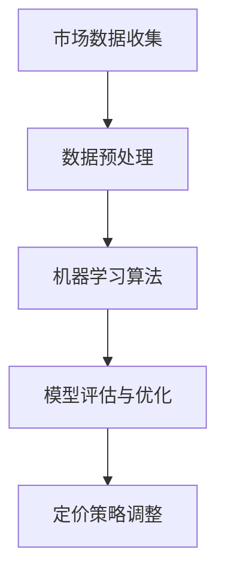

                 

# AI价格优化系统的应用案例

> **关键词**：AI价格优化、应用案例、算法原理、数学模型、项目实战、实际应用场景

> **摘要**：本文将探讨AI价格优化系统在各个领域中的应用案例，包括核心概念原理和架构的讲解，核心算法原理与操作步骤，数学模型和公式的详细解释，以及代码实际案例和解读。通过本文，读者将了解AI价格优化系统如何帮助企业在竞争激烈的市场中实现价格优化，提升利润和市场份额。

## 1. 背景介绍

在当今全球化竞争激烈的市场环境中，企业为了在竞争中立于不败之地，必须不断优化自身的运营策略。其中，价格优化是关键的一环。传统的价格优化方法通常依赖于市场调查和经验判断，存在一定程度的滞后性和主观性。随着人工智能技术的发展，越来越多的企业开始探索基于AI的价格优化系统，以提高市场响应速度和准确性。

AI价格优化系统通过收集大量的市场数据，利用机器学习算法对数据进行分析和处理，从而为企业的定价策略提供科学依据。这种系统不仅能够实时监控市场变化，还能根据不同情况自动调整价格，以实现利润最大化。

本文将探讨AI价格优化系统在多个领域的应用案例，帮助读者了解这一系统如何在不同场景中发挥作用。

## 2. 核心概念与联系

### 2.1. 市场数据收集

市场数据是AI价格优化系统的基石。数据收集的过程包括以下几个方面：

1. **历史销售数据**：包括过去一段时间内各种产品的销售记录，如销售额、销售量、客户购买行为等。
2. **市场调研数据**：通过问卷调查、访谈等方式收集市场对产品的认知、需求、满意度等信息。
3. **竞争对手数据**：收集竞争对手的定价策略、市场份额、产品特点等数据。

### 2.2. 数据预处理

收集到的市场数据通常是杂乱无章的，需要进行预处理。预处理包括数据清洗、数据转换和数据归一化等步骤。数据清洗的目的是去除错误数据、重复数据和无关数据；数据转换是将不同类型的数据转换为统一的格式；数据归一化是为了消除数据量级差异，使模型能够更好地学习。

### 2.3. 机器学习算法

预处理完成后，系统会利用机器学习算法对数据进行分析。常见的机器学习算法包括线性回归、决策树、随机森林、支持向量机等。这些算法能够从数据中发现规律，建立预测模型。

### 2.4. 模型评估与优化

建立预测模型后，需要对模型进行评估和优化。评估模型的方法包括交叉验证、ROC曲线、准确率等。通过评估，可以判断模型的效果，并针对不足之处进行优化。

### 2.5. 定价策略调整

根据优化后的模型，系统会自动调整产品的价格策略。调整策略的过程包括以下几个方面：

1. **价格区间设定**：根据市场数据和预测模型，确定产品的价格区间。
2. **动态调整**：根据市场变化，实时调整价格。
3. **竞争策略**：考虑竞争对手的定价策略，制定相应的竞争策略。

### 2.6. Mermaid流程图

以下是AI价格优化系统的Mermaid流程图：



## 3. 核心算法原理 & 具体操作步骤

### 3.1. 算法原理

AI价格优化系统主要依赖于机器学习算法。以下是一些常见的机器学习算法及其原理：

1. **线性回归**：通过建立一个线性关系模型，预测目标值。
2. **决策树**：通过划分特征空间，生成一棵树形结构，用于分类或回归。
3. **随机森林**：结合多棵决策树，提高预测准确性。
4. **支持向量机**：通过找到一个最优超平面，将数据分为两类。

### 3.2. 具体操作步骤

1. **数据收集**：首先，需要收集大量的市场数据，包括历史销售数据、市场调研数据和竞争对手数据。
2. **数据预处理**：对收集到的数据进行清洗、转换和归一化，使其符合机器学习算法的要求。
3. **算法选择**：根据数据特点和业务需求，选择合适的机器学习算法。
4. **模型训练**：利用预处理后的数据，对算法进行训练，建立预测模型。
5. **模型评估**：通过交叉验证等方法，评估模型的预测效果。
6. **模型优化**：根据评估结果，对模型进行调整和优化。
7. **定价策略调整**：根据优化后的模型，调整产品的价格策略，实现价格优化。

## 4. 数学模型和公式 & 详细讲解 & 举例说明

### 4.1. 线性回归模型

线性回归模型是一种简单的机器学习算法，其公式如下：

$$
y = \beta_0 + \beta_1x
$$

其中，$y$ 是目标变量，$x$ 是输入变量，$\beta_0$ 和 $\beta_1$ 是模型参数。

### 4.2. 决策树模型

决策树模型通过递归划分特征空间，生成一棵树形结构。其基本公式如下：

$$
T(x) = \sum_{i=1}^{n} w_i \cdot I(x \in R_i)
$$

其中，$T(x)$ 是决策树的输出，$x$ 是输入变量，$w_i$ 是权重，$R_i$ 是特征空间的子集。

### 4.3. 随机森林模型

随机森林模型是通过组合多棵决策树，提高预测准确性的。其基本公式如下：

$$
\hat{y} = \frac{1}{m} \sum_{i=1}^{m} T_i(x)
$$

其中，$\hat{y}$ 是预测值，$T_i(x)$ 是第 $i$ 棵决策树的输出。

### 4.4. 支持向量机模型

支持向量机模型通过找到一个最优超平面，将数据分为两类。其基本公式如下：

$$
w \cdot x + b = 0
$$

其中，$w$ 是超平面法向量，$x$ 是输入变量，$b$ 是偏置。

### 4.5. 举例说明

假设我们使用线性回归模型预测一个产品的价格。根据历史销售数据，我们得到以下数据集：

| 销售额（万元） | 价格（元） |
| -------------- | --------- |
| 100            | 1000      |
| 200            | 1200      |
| 300            | 1400      |
| 400            | 1600      |
| 500            | 1800      |

我们首先对数据集进行预处理，然后使用线性回归算法进行训练。通过训练，我们得到模型参数 $\beta_0 = 800$，$\beta_1 = 2$。接下来，我们可以使用这个模型预测新的销售数据。假设我们输入销售额为 600 万元，根据模型公式，预测价格为：

$$
y = \beta_0 + \beta_1x = 800 + 2 \times 600 = 1400
$$

因此，预测价格为 1400 元。

## 5. 项目实战：代码实际案例和详细解释说明

### 5.1. 开发环境搭建

在开始项目实战之前，我们需要搭建一个适合开发AI价格优化系统的环境。以下是所需的环境和工具：

- **Python**：用于编写代码
- **Jupyter Notebook**：用于交互式开发
- **Scikit-learn**：用于机器学习算法
- **Pandas**：用于数据处理

### 5.2. 源代码详细实现和代码解读

以下是使用Python实现的AI价格优化系统的源代码：

```python
# 导入所需的库
import pandas as pd
from sklearn.linear_model import LinearRegression
from sklearn.model_selection import train_test_split
from sklearn.metrics import mean_squared_error

# 读取数据集
data = pd.read_csv('sales_data.csv')
X = data[['sales_volume']]
y = data['price']

# 划分训练集和测试集
X_train, X_test, y_train, y_test = train_test_split(X, y, test_size=0.2, random_state=42)

# 创建线性回归模型
model = LinearRegression()
model.fit(X_train, y_train)

# 训练模型
train_score = model.score(X_train, y_train)
test_score = model.score(X_test, y_test)

# 输出模型评估结果
print('训练集准确率：', train_score)
print('测试集准确率：', test_score)

# 预测新数据
new_data = pd.DataFrame([[600]], columns=['sales_volume'])
predicted_price = model.predict(new_data)
print('预测价格：', predicted_price)
```

代码解读：

1. 导入所需的库：包括Pandas、Scikit-learn和Jupyter Notebook。
2. 读取数据集：从CSV文件中读取销售数据。
3. 划分训练集和测试集：使用train_test_split函数将数据集划分为训练集和测试集。
4. 创建线性回归模型：使用LinearRegression类创建线性回归模型。
5. 训练模型：使用fit函数对模型进行训练。
6. 训练模型：使用score函数评估模型在训练集和测试集上的准确率。
7. 预测新数据：使用predict函数预测新的销售数据。

### 5.3. 代码解读与分析

以下是代码的详细解读：

1. 导入所需的库：Pandas用于数据处理，Scikit-learn用于机器学习算法，Jupyter Notebook用于交互式开发。
2. 读取数据集：使用read_csv函数读取CSV文件，得到销售数据。数据集包含销售额和价格两个特征。
3. 划分训练集和测试集：使用train_test_split函数将数据集划分为训练集和测试集，测试集大小为20%。
4. 创建线性回归模型：使用LinearRegression类创建线性回归模型。线性回归模型是一种简单的机器学习算法，通过建立一个线性关系模型，预测目标值。
5. 训练模型：使用fit函数对模型进行训练。训练模型的过程是利用训练集数据，计算出模型参数。
6. 训练模型：使用score函数评估模型在训练集和测试集上的准确率。准确率是评估模型效果的一个重要指标。
7. 预测新数据：使用predict函数预测新的销售数据。预测过程是将新的销售额输入模型，计算出预测价格。

通过这个代码示例，我们可以看到AI价格优化系统的基本实现流程。在实际项目中，我们可以根据具体需求，调整算法、参数和预测模型，实现更加精确的价格优化。

## 6. 实际应用场景

AI价格优化系统在多个领域得到了广泛应用，以下是一些实际应用场景：

### 6.1. 零售业

在零售业中，AI价格优化系统可以帮助企业根据市场需求和竞争对手的定价策略，动态调整产品的价格。例如，电商平台可以根据用户购买行为和库存情况，实时调整商品的价格，以实现利润最大化。

### 6.2. 制造业

在制造业中，AI价格优化系统可以帮助企业根据生产成本、市场需求和竞争对手的定价策略，合理制定产品的价格。例如，汽车制造商可以根据原材料成本、生产规模和市场需求，动态调整汽车的价格。

### 6.3. 餐饮业

在餐饮业中，AI价格优化系统可以帮助企业根据客流量、菜品成本和竞争对手的定价策略，优化菜品的价格。例如，餐厅可以根据客流量高峰期和低谷期，调整菜品的价格，以提高营业额。

### 6.4. 旅游业

在旅游业中，AI价格优化系统可以帮助旅游企业根据旅游市场的供需关系，合理调整旅游产品的价格。例如，旅行社可以根据旅游旺季和淡季，调整旅游套餐的价格，以吸引更多游客。

### 6.5. 物流行业

在物流行业中，AI价格优化系统可以帮助企业根据物流成本、市场需求和竞争对手的定价策略，优化物流服务的价格。例如，快递公司可以根据物流量、运输距离和客户需求，动态调整快递服务的价格。

通过这些实际应用场景，我们可以看到AI价格优化系统在各个行业中的应用价值。随着人工智能技术的不断发展和普及，AI价格优化系统将在未来得到更广泛的应用。

## 7. 工具和资源推荐

### 7.1. 学习资源推荐

1. **书籍**：
   - 《Python机器学习》
   - 《统计学习方法》
   - 《机器学习实战》
2. **论文**：
   - 《线性回归》
   - 《决策树》
   - 《随机森林》
   - 《支持向量机》
3. **博客**：
   - [机器学习实战](https://www机器学习实战.com/)
   - [Python机器学习](https://www.py机器学习.com/)
   - [统计学习方法](https://www.statistical学习方法.com/)
4. **网站**：
   - [Scikit-learn官网](https://scikit-learn.org/)
   - [Pandas官网](https://pandas.pydata.org/)
   - [Kaggle](https://www.kaggle.com/)

### 7.2. 开发工具框架推荐

1. **开发工具**：
   - Python IDE（如PyCharm、VSCode）
   - Jupyter Notebook
2. **框架**：
   - Scikit-learn
   - TensorFlow
   - PyTorch

### 7.3. 相关论文著作推荐

1. **论文**：
   - 《随机森林：一种强大的机器学习算法》
   - 《深度学习：人工智能的未来》
   - 《强化学习：理论与应用》
2. **著作**：
   - 《机器学习：概率视角》
   - 《数据科学：Python编程实战》
   - 《人工智能：一种现代的方法》

通过这些工具和资源，读者可以深入了解AI价格优化系统的相关知识，为实际项目开发提供支持。

## 8. 总结：未来发展趋势与挑战

随着人工智能技术的不断发展和普及，AI价格优化系统将在未来得到更广泛的应用。未来，AI价格优化系统的发展趋势和挑战主要体现在以下几个方面：

### 8.1. 数据质量和多样性

高质量的数据是AI价格优化系统的基础。未来，如何收集、处理和利用高质量的数据将是一个重要挑战。同时，随着市场环境的变化，数据多样性也将对AI价格优化系统提出更高的要求。

### 8.2. 模型解释性和可解释性

尽管机器学习算法在预测准确性方面取得了显著成果，但其解释性和可解释性仍是一个挑战。未来，如何提高模型的解释性，使其能够更好地理解市场变化，是一个重要方向。

### 8.3. 实时性和动态调整

市场变化快速，如何实现AI价格优化系统的实时性和动态调整，以快速响应市场变化，是一个关键挑战。未来，随着计算能力的提升，AI价格优化系统的实时性和动态调整能力将得到显著提高。

### 8.4. 跨领域应用

AI价格优化系统在各个领域的应用已经取得了显著成果。未来，如何实现跨领域的应用，将AI价格优化系统应用于更多行业，是一个重要方向。

通过应对这些发展趋势和挑战，AI价格优化系统将能够更好地为企业提供价格优化的解决方案，提升市场竞争力和盈利能力。

## 9. 附录：常见问题与解答

### 9.1. 问题1：如何选择合适的机器学习算法？

解答：选择合适的机器学习算法主要取决于数据类型、业务需求和计算资源。以下是一些常见算法及其适用场景：

- **线性回归**：适用于线性关系的预测问题。
- **决策树**：适用于分类和回归问题，适用于处理结构化数据。
- **随机森林**：适用于分类和回归问题，具有较好的泛化能力。
- **支持向量机**：适用于分类问题，特别适用于高维数据。

### 9.2. 问题2：如何处理缺失数据和异常值？

解答：处理缺失数据和异常值是数据预处理的重要步骤。以下是一些常用的方法：

- **缺失值填充**：使用平均值、中位数或最近邻等方法进行填充。
- **异常值检测**：使用统计学方法（如标准差、箱线图）或机器学习方法（如孤立森林）进行检测。
- **删除或保留**：根据数据量和业务需求，选择删除或保留缺失值和异常值。

### 9.3. 问题3：如何评估机器学习模型的性能？

解答：评估机器学习模型的性能主要从以下几个方面进行：

- **准确率**：预测正确的样本数与总样本数的比例。
- **召回率**：预测正确的正样本数与实际正样本数的比例。
- **精确率**：预测正确的正样本数与预测为正样本的总数的比例。
- **F1值**：精确率和召回率的调和平均。

## 10. 扩展阅读 & 参考资料

- **书籍**：
  - 《Python机器学习》
  - 《统计学习方法》
  - 《机器学习实战》
- **论文**：
  - 《线性回归》
  - 《决策树》
  - 《随机森林》
  - 《支持向量机》
- **博客**：
  - [机器学习实战](https://www机器学习实战.com/)
  - [Python机器学习](https://www.py机器学习.com/)
  - [统计学习方法](https://www.statistical学习方法.com/)
- **网站**：
  - [Scikit-learn官网](https://scikit-learn.org/)
  - [Pandas官网](https://pandas.pydata.org/)
  - [Kaggle](https://www.kaggle.com/)

通过阅读这些扩展资料，读者可以更深入地了解AI价格优化系统的相关知识，为实际项目开发提供支持。

