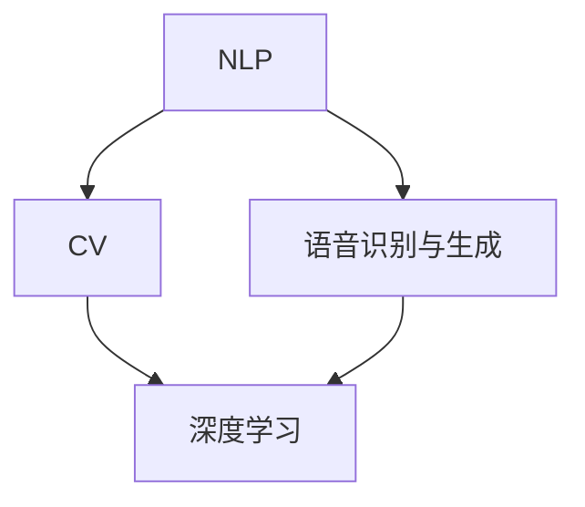

                 

# AI内容创作的进步：更自然，更有“人味”

## 摘要

在人工智能领域，内容创作一直是研究的热点之一。随着技术的不断进步，AI内容创作正朝着更加自然、更加有“人味”的方向发展。本文将深入探讨AI内容创作的发展历程、核心概念、算法原理、数学模型、项目实战、应用场景、工具和资源推荐，以及未来发展趋势和挑战。通过这一系列探讨，我们将了解AI内容创作如何实现从机械化到智能化、从标准化到个性化的转变。

## 1. 背景介绍

人工智能（AI）作为计算机科学的一个分支，旨在使计算机具备模拟人类智能的能力。自1950年艾伦·图灵提出图灵测试以来，AI领域经历了多个阶段的发展。从早期的符号主义、连接主义到近年的深度学习和强化学习，AI在各个领域都取得了显著的成果。

在内容创作领域，AI的应用日益广泛。传统的文字、图片、音频、视频等媒体形式都在逐渐被AI所改变。例如，通过自然语言处理技术，AI能够生成新闻文章、诗歌、故事等文本内容；通过图像识别技术，AI能够自动创作艺术作品、广告宣传图等视觉内容；通过语音识别和生成技术，AI能够制作语音解说、音乐等音频内容。

然而，随着技术的不断发展，人们对于AI内容创作的要求也在不断提高。从最初的追求“量”的满足，到如今的追求“质”的提升，AI内容创作正朝着更加自然、更加有“人味”的方向发展。这一趋势不仅体现在内容创作的技术层面上，也体现在用户对于内容体验的需求上。

## 2. 核心概念与联系

### 自然语言处理（NLP）

自然语言处理是AI内容创作的基础技术之一。它旨在使计算机能够理解、生成和处理自然语言文本。NLP的核心概念包括词向量表示、句法分析、语义理解、对话系统等。

- **词向量表示**：将文本中的词语转化为计算机可以处理的向量表示，是NLP的基础。词向量可以通过Word2Vec、GloVe等算法生成。
- **句法分析**：对文本进行句法分析，提取出句子的结构信息，如词性、依存关系等。常见的句法分析方法有依赖句法分析和 constituency 句法分析。
- **语义理解**：理解文本中的词语和句子的语义含义，是实现高级内容创作的重要技术。语义理解可以通过语义角色标注、语义关系抽取等方法实现。
- **对话系统**：通过自然语言交互，实现人与计算机之间的对话。对话系统可以是基于规则的系统，也可以是基于机器学习的方法。

### 计算机视觉（CV）

计算机视觉是AI内容创作中的另一个重要技术领域。它旨在使计算机能够识别、分析和理解图像和视频中的内容。

- **图像识别**：对图像进行分类，识别其中的物体、场景等。常见的图像识别算法有卷积神经网络（CNN）、生成对抗网络（GAN）等。
- **目标检测**：在图像中定位并识别多个目标的位置和类别。常用的目标检测算法有R-CNN、SSD、YOLO等。
- **图像生成**：通过学习大量图像数据，生成新的图像。常见的图像生成算法有生成对抗网络（GAN）、变分自编码器（VAE）等。

### 语音识别与生成

语音识别与生成技术是实现音频内容创作的重要手段。语音识别旨在将人类的语音转化为文本，而语音生成则旨在生成自然的语音声音。

- **语音识别**：通过识别语音中的音素和词语，将其转化为文本。常见的语音识别算法有隐马尔可夫模型（HMM）、循环神经网络（RNN）、长短时记忆网络（LSTM）等。
- **语音生成**：通过生成自然的语音声音，模拟人类的语音表达。常见的语音生成算法有WaveNet、Tacotron等。

### 深度学习

深度学习是近年来AI领域的一大突破，它在图像识别、自然语言处理、语音识别等任务中取得了显著的成果。深度学习通过多层神经网络，对大量数据进行自动特征提取和模式识别。

- **卷积神经网络（CNN）**：适用于图像识别和目标检测任务，通过卷积层、池化层等结构实现图像特征提取。
- **循环神经网络（RNN）**：适用于序列数据，如文本、语音等，通过循环结构实现序列特征提取和建模。
- **长短时记忆网络（LSTM）**：是RNN的一种变体，通过门控机制解决长短期依赖问题。
- **生成对抗网络（GAN）**：通过生成器和判别器的对抗训练，实现高质量图像生成。

### Mermaid 流程图

为了更好地理解AI内容创作的工作流程，我们可以使用Mermaid流程图来展示各个核心概念之间的联系。



## 3. 核心算法原理 & 具体操作步骤

### 自然语言处理（NLP）

#### 词向量表示

词向量表示是将文本中的词语转化为计算机可以处理的向量表示。以下是一个简单的Word2Vec算法的步骤：

1. **数据预处理**：对文本进行分词，去除停用词，将文本转换为词频矩阵。
2. **构建词汇表**：将文本中的词语映射到唯一的整数ID。
3. **初始化词向量**：根据词汇表初始化每个词的词向量，通常采用随机初始化。
4. **训练词向量**：使用训练数据，通过优化算法（如SGD、Adam）更新词向量。
5. **评估词向量**：通过相似度计算、聚类等方法评估词向量质量。

#### 句法分析

句法分析是对文本进行句法分析，提取出句子的结构信息。以下是一个简单的依赖句法分析的步骤：

1. **文本预处理**：对文本进行分词，标记词性。
2. **构建句法分析模型**：使用训练数据，通过条件随机场（CRF）等方法训练句法分析模型。
3. **进行句法分析**：使用句法分析模型对文本进行句法分析，提取出句法结构。

#### 语义理解

语义理解是理解文本中的词语和句子的语义含义。以下是一个简单的语义角色标注的步骤：

1. **文本预处理**：对文本进行分词，标记词性。
2. **构建语义角色标注模型**：使用训练数据，通过神经网络等方法训练语义角色标注模型。
3. **进行语义角色标注**：使用语义角色标注模型对文本进行语义角色标注。

### 计算机视觉（CV）

#### 图像识别

图像识别是计算机视觉的基础任务。以下是一个简单的卷积神经网络（CNN）的步骤：

1. **数据预处理**：对图像进行缩放、裁剪等预处理操作。
2. **构建CNN模型**：设计CNN模型的结构，包括卷积层、池化层、全连接层等。
3. **训练CNN模型**：使用训练数据，通过反向传播算法训练CNN模型。
4. **评估CNN模型**：通过测试数据评估CNN模型的表现。

#### 目标检测

目标检测是计算机视觉中的另一个重要任务。以下是一个简单的基于Faster R-CNN的目标检测步骤：

1. **数据预处理**：对图像进行缩放、裁剪等预处理操作。
2. **构建Faster R-CNN模型**：设计Faster R-CNN模型的结构，包括基础网络、Region Proposal Network（RPN）、分类器等。
3. **训练Faster R-CNN模型**：使用训练数据，通过反向传播算法训练Faster R-CNN模型。
4. **评估Faster R-CNN模型**：通过测试数据评估Faster R-CNN模型的表现。

### 语音识别与生成

#### 语音识别

语音识别是将语音转化为文本的过程。以下是一个简单的基于LSTM的语音识别步骤：

1. **数据预处理**：对音频进行采样、归一化等预处理操作。
2. **构建LSTM模型**：设计LSTM模型的结构，包括输入层、隐藏层、输出层等。
3. **训练LSTM模型**：使用训练数据，通过反向传播算法训练LSTM模型。
4. **评估LSTM模型**：通过测试数据评估LSTM模型的表现。

#### 语音生成

语音生成是将文本转化为语音的过程。以下是一个简单的基于Tacotron的语音生成步骤：

1. **数据预处理**：对文本进行分词、标记音素等预处理操作。
2. **构建Tacotron模型**：设计Tacotron模型的结构，包括文本编码器、声码器等。
3. **训练Tacotron模型**：使用训练数据，通过反向传播算法训练Tacotron模型。
4. **评估Tacotron模型**：通过测试数据评估Tacotron模型的表现。

### 深度学习

深度学习是AI内容创作的核心技术之一。以下是一个简单的深度学习模型训练的步骤：

1. **数据预处理**：对数据集进行划分，包括训练集、验证集和测试集。
2. **设计模型结构**：根据任务需求，设计合适的模型结构。
3. **模型训练**：使用训练数据，通过反向传播算法训练模型。
4. **模型评估**：使用验证集和测试集评估模型的表现。

## 4. 数学模型和公式 & 详细讲解 & 举例说明

### 自然语言处理（NLP）

#### 词向量表示

词向量表示的关键在于如何将词语映射到低维向量空间中。Word2Vec算法是一种常见的词向量表示方法，其中核心的数学模型是基于神经网络的。

1. **训练过程**：
   - 输入：词语及其上下文
   - 输出：词向量

   Word2Vec算法通过训练词的上下文来生成词向量。具体步骤如下：

   - **负采样**：给定一个词语，从其上下文中随机抽取一部分词语作为正样本，其余词语作为负样本。
   - **模型训练**：使用训练数据，构建一个神经网络，输入为词向量和上下文的词向量，输出为是否匹配的概率。
   - **优化**：通过反向传播算法，优化神经网络参数，使模型能够正确预测词的上下文。

   数学公式表示如下：

   $$y = \text{sigmoid}(W \cdot \text{vec}(w) + b)$$

   其中，\(W\) 是神经网络权重矩阵，\(\text{vec}(w)\) 是词语 \(w\) 的向量表示，\(b\) 是偏置项，\(y\) 是预测的匹配概率。

   举例说明：

   假设我们有一个词语 “狗” 和它的上下文词语 “猫”、“狗”、“鱼”，我们可以通过负采样得到正样本 “狗” 和负样本 “猫”、“鱼”。然后，使用神经网络模型预测 “狗” 和其上下文词语的匹配概率，从而生成 “狗” 的词向量。

#### 句法分析

句法分析的关键在于如何提取句子中的语法结构。常见的句法分析方法有依赖句法分析和 constituency 句法分析。

- **依赖句法分析**：依赖句法分析通过分析词语之间的依赖关系来构建句子的语法结构。常见的模型有基于规则的模型和基于统计的模型。

  假设我们有一个句子 “我吃饭”，通过依赖句法分析，我们可以得到以下依赖关系：

  - “我” 是主语
  - “吃” 是谓语
  - “饭” 是宾语

- **Constituency 句法分析**：Constituency 句法分析通过构建句子的树状结构来表示语法结构。常见的模型有基于规则的模型和基于统计的模型。

  假设我们有一个句子 “我吃饭”，通过 Constituency 句法分析，我们可以得到以下树状结构：

  ```
  (S
    (NP (PRP 我))
    (VP (V 吃)
      (NP (NN 饭))))
  ```

#### 语义理解

语义理解的关键在于如何理解词语和句子的语义含义。常见的语义理解方法有语义角色标注、语义关系抽取等。

- **语义角色标注**：语义角色标注是对句子中的词语进行角色标注，如主语、谓语、宾语等。

  假设我们有一个句子 “小明喜欢吃苹果”，通过语义角色标注，我们可以得到以下标注：

  - “小明” 是主语
  - “喜欢” 是谓语
  - “苹果” 是宾语

- **语义关系抽取**：语义关系抽取是对句子中的词语进行关系抽取，如因果、并列等。

  假设我们有一个句子 “因为下雨，我带了伞”，通过语义关系抽取，我们可以得到以下关系：

  - “下雨” 是原因
  - “我带了伞” 是结果

### 计算机视觉（CV）

#### 图像识别

图像识别的关键在于如何从图像中提取特征并进行分类。常见的图像识别算法有卷积神经网络（CNN）、生成对抗网络（GAN）等。

- **卷积神经网络（CNN）**：CNN是一种前馈神经网络，特别适用于处理图像数据。其核心思想是通过卷积层、池化层等结构，对图像进行特征提取和分类。

  CNN的基本结构如下：

  ```
  输入图像 → 卷积层 → 池化层 → 全连接层 → 输出
  ```

  假设我们有一个二分类问题，图像识别的数学模型可以表示为：

  $$y = \text{sigmoid}(W \cdot \text{conv}(x) + b)$$

  其中，\(x\) 是输入图像，\(\text{conv}(x)\) 是卷积操作，\(W\) 是卷积核权重，\(b\) 是偏置项，\(y\) 是预测的分类结果。

- **生成对抗网络（GAN）**：GAN是一种生成模型，通过生成器和判别器的对抗训练，实现高质量图像生成。

  GAN的基本结构如下：

  ```
  生成器 → 判别器 → 生成图像
  ```

  GAN的数学模型可以表示为：

  $$
  \begin{aligned}
  \min_G \max_D \quad & \mathbb{E}_{x \sim p_{\text{data}}(x)}[\text{log}(D(x))] + \mathbb{E}_{z \sim p_{z}(z)}[\text{log}(1 - D(G(z)))] \\
  D(x) & = \text{sigmoid}(W_D \cdot \text{conv}(x) + b_D) \\
  G(z) & = \text{sigmoid}(W_G \cdot \text{conv}(z) + b_G)
  \end{aligned}
  $$

  其中，\(x\) 是真实图像，\(z\) 是随机噪声，\(G(z)\) 是生成的图像，\(D(x)\) 是判别器对真实图像的判断，\(D(G(z))\) 是判别器对生成图像的判断，\(W_D\) 和 \(W_G\) 分别是判别器和生成器的权重，\(b_D\) 和 \(b_G\) 分别是判别器和生成器的偏置项。

#### 目标检测

目标检测的关键在于如何从图像中检测出多个目标的类别和位置。常见的目标检测算法有R-CNN、SSD、YOLO等。

- **R-CNN**：R-CNN是一种基于区域提议的网络，通过提出区域提议、分类和回归三个步骤实现目标检测。

  R-CNN的基本结构如下：

  ```
  区域提议 → 分类器 → 回归器 → 输出
  ```

  R-CNN的数学模型可以表示为：

  $$
  \begin{aligned}
  \min_{W_c, W_r} \quad & \mathbb{E}_{x \sim p_{\text{data}}(x)}[\text{log}(p_c(x))] + \mathbb{E}_{x, t \sim p_{\text{data}}(x), p_{\text{target}}(t)}[\text{log}(p_r(t|x))] \\
  p_c(x) & = \text{sigmoid}(W_c \cdot \text{conv}(x) + b_c) \\
  p_r(t|x) & = \text{sigmoid}(W_r \cdot \text{reg}(t, x) + b_r)
  \end{aligned}
  $$

  其中，\(x\) 是输入图像，\(t\) 是目标的位置和大小，\(p_c(x)\) 是分类器的概率输出，\(p_r(t|x)\) 是回归器的概率输出，\(W_c\) 和 \(W_r\) 分别是分类器和回归器的权重，\(b_c\) 和 \(b_r\) 分别是分类器和回归器的偏置项。

#### 图像生成

图像生成是通过学习大量图像数据，生成新的图像。常见的图像生成算法有生成对抗网络（GAN）、变分自编码器（VAE）等。

- **生成对抗网络（GAN）**：GAN是一种生成模型，通过生成器和判别器的对抗训练，实现高质量图像生成。

  GAN的基本结构如下：

  ```
  生成器 → 判别器 → 生成图像
  ```

  GAN的数学模型可以表示为：

  $$
  \begin{aligned}
  \min_G \max_D \quad & \mathbb{E}_{x \sim p_{\text{data}}(x)}[\text{log}(D(x))] + \mathbb{E}_{z \sim p_{z}(z)}[\text{log}(1 - D(G(z)))] \\
  D(x) & = \text{sigmoid}(W_D \cdot \text{conv}(x) + b_D) \\
  G(z) & = \text{sigmoid}(W_G \cdot \text{conv}(z) + b_G)
  \end{aligned}
  $$

  其中，\(x\) 是真实图像，\(z\) 是随机噪声，\(G(z)\) 是生成的图像，\(D(x)\) 是判别器对真实图像的判断，\(D(G(z))\) 是判别器对生成图像的判断，\(W_D\) 和 \(W_G\) 分别是判别器和生成器的权重，\(b_D\) 和 \(b_G\) 分别是判别器和生成器的偏置项。

### 语音识别与生成

#### 语音识别

语音识别是将语音转化为文本的过程。常见的语音识别算法有隐马尔可夫模型（HMM）、循环神经网络（RNN）、长短时记忆网络（LSTM）等。

- **隐马尔可夫模型（HMM）**：HMM是一种基于概率模型的语音识别方法，通过分析语音信号的时序特征，实现语音到文本的转化。

  HMM的数学模型可以表示为：

  $$
  \begin{aligned}
  p(x|y) & = \prod_{t=1}^{T} p(x_t|y_t) \\
  p(y) & = \prod_{t=1}^{T} p(y_t)
  \end{aligned}
  $$

  其中，\(x\) 是语音信号，\(y\) 是文本序列，\(T\) 是序列长度，\(p(x_t|y_t)\) 是在给定文本序列 \(y\) 的条件下，语音信号 \(x_t\) 的概率，\(p(y_t)\) 是文本序列 \(y\) 的概率。

- **循环神经网络（RNN）**：RNN是一种基于序列模型的语音识别方法，通过循环结构处理语音信号的时序特征。

  RNN的数学模型可以表示为：

  $$
  h_t = \sigma(W_h \cdot [h_{t-1}, x_t] + b_h)
  $$

  其中，\(h_t\) 是隐藏状态，\(x_t\) 是输入特征，\(\sigma\) 是激活函数，\(W_h\) 和 \(b_h\) 分别是权重和偏置项。

- **长短时记忆网络（LSTM）**：LSTM是RNN的一种变体，通过门控机制解决长短期依赖问题。

  LSTM的数学模型可以表示为：

  $$
  \begin{aligned}
  i_t &= \sigma(W_i \cdot [h_{t-1}, x_t] + b_i) \\
  f_t &= \sigma(W_f \cdot [h_{t-1}, x_t] + b_f) \\
  o_t &= \sigma(W_o \cdot [h_{t-1}, x_t] + b_o) \\
  g_t &= \tanh(W_g \cdot [h_{t-1}, x_t] + b_g) \\
  h_t &= o_t \cdot \tanh(f_t \cdot h_{t-1} + g_t)
  \end{aligned}
  $$

  其中，\(i_t\)、\(f_t\)、\(o_t\) 分别是输入门、遗忘门和输出门，\(g_t\) 是候选隐藏状态，\(h_t\) 是隐藏状态，\(W_i\)、\(W_f\)、\(W_o\)、\(W_g\) 分别是权重矩阵，\(b_i\)、\(b_f\)、\(b_o\)、\(b_g\) 分别是偏置项。

#### 语音生成

语音生成是将文本转化为语音的过程。常见的语音生成算法有WaveNet、Tacotron等。

- **WaveNet**：WaveNet是一种基于循环神经网络（RNN）的语音生成方法，通过解码器生成语音信号。

  WaveNet的数学模型可以表示为：

  $$
  \begin{aligned}
  s_t &= \text{tanh}(W_s \cdot [h_{t-1}, x_t] + b_s) \\
  \hat{x}_t &= W_d \cdot s_t + b_d \\
  x_t &= \text{softmax}(\hat{x}_t)
  \end{aligned}
  $$

  其中，\(s_t\) 是中间状态，\(\hat{x}_t\) 是预测的语音信号，\(x_t\) 是真实语音信号，\(W_s\) 和 \(W_d\) 分别是权重矩阵，\(b_s\) 和 \(b_d\) 分别是偏置项。

- **Tacotron**：Tacotron是一种基于自注意力机制的语音生成方法，通过编码器生成文本特征，通过解码器生成语音信号。

  Tacotron的数学模型可以表示为：

  $$
  \begin{aligned}
  e_t &= \text{tanh}(W_e \cdot [h_{t-1}, c_t] + b_e) \\
  a_t &= \text{softmax}(W_a \cdot e_t) \\
  s_t &= \text{tanh}(W_s \cdot [h_{t-1}, a_t c_t] + b_s) \\
  \hat{x}_t &= W_d \cdot s_t + b_d \\
  x_t &= \text{softmax}(\hat{x}_t)
  \end{aligned}
  $$

  其中，\(e_t\) 是中间状态，\(a_t\) 是注意力权重，\(c_t\) 是编码器输出，\(s_t\) 是解码器输出，\(\hat{x}_t\) 是预测的语音信号，\(x_t\) 是真实语音信号，\(W_e\)、\(W_a\)、\(W_s\)、\(W_d\) 分别是权重矩阵，\(b_e\)、\(b_s\)、\(b_d\) 分别是偏置项。

### 深度学习

深度学习是一种基于多层神经网络的学习方法，通过多层非线性变换，对大量数据进行自动特征提取和模式识别。

- **卷积神经网络（CNN）**：CNN是一种前馈神经网络，特别适用于处理图像数据。其核心思想是通过卷积层、池化层等结构，对图像进行特征提取和分类。

  CNN的数学模型可以表示为：

  $$
  \begin{aligned}
  \hat{y}_j &= \text{softmax}(W \cdot \text{relu}(\text{pool}(\text{conv}(x))))
  \end{aligned}
  $$

  其中，\(\hat{y}_j\) 是预测的类别概率，\(x\) 是输入图像，\(W\) 是权重矩阵，\(\text{relu}\) 是ReLU激活函数，\(\text{pool}\) 是池化操作，\(\text{conv}\) 是卷积操作。

- **循环神经网络（RNN）**：RNN是一种基于序列模型的神经网络，通过循环结构处理序列数据。

  RNN的数学模型可以表示为：

  $$
  h_t = \text{tanh}(W_h \cdot [h_{t-1}, x_t] + b_h)
  $$

  其中，\(h_t\) 是隐藏状态，\(x_t\) 是输入特征，\(\text{tanh}\) 是激活函数，\(W_h\) 和 \(b_h\) 分别是权重和偏置项。

- **长短时记忆网络（LSTM）**：LSTM是RNN的一种变体，通过门控机制解决长短期依赖问题。

  LSTM的数学模型可以表示为：

  $$
  \begin{aligned}
  i_t &= \sigma(W_i \cdot [h_{t-1}, x_t] + b_i) \\
  f_t &= \sigma(W_f \cdot [h_{t-1}, x_t] + b_f) \\
  o_t &= \sigma(W_o \cdot [h_{t-1}, x_t] + b_o) \\
  g_t &= \tanh(W_g \cdot [h_{t-1}, x_t] + b_g) \\
  h_t &= o_t \cdot \tanh(f_t \cdot h_{t-1} + g_t)
  \end{aligned}
  $$

  其中，\(i_t\)、\(f_t\)、\(o_t\) 分别是输入门、遗忘门和输出门，\(g_t\) 是候选隐藏状态，\(h_t\) 是隐藏状态，\(W_i\)、\(W_f\)、\(W_o\)、\(W_g\) 分别是权重矩阵，\(b_i\)、\(b_f\)、\(b_o\)、\(b_g\) 分别是偏置项。

## 5. 项目实战：代码实际案例和详细解释说明

### 开发环境搭建

为了完成本文的项目实战，我们需要搭建一个合适的技术环境。以下是开发环境搭建的步骤：

1. **安装Python环境**：Python是深度学习的主要编程语言，我们需要安装Python 3.8及以上版本。
2. **安装深度学习框架**：本文使用TensorFlow作为深度学习框架，我们可以使用pip安装TensorFlow：
   ```bash
   pip install tensorflow
   ```
3. **安装其他依赖库**：根据项目需求，我们还需要安装其他依赖库，如NumPy、Pandas、Matplotlib等。
4. **准备数据集**：本文使用一个简单的MNIST手写数字数据集作为示例，我们可以从TensorFlow的官方数据集下载：
   ```python
   import tensorflow as tf
   mnist = tf.keras.datasets.mnist
   (train_images, train_labels), (test_images, test_labels) = mnist.load_data()
   ```

### 源代码详细实现和代码解读

以下是本项目实战的源代码，我们将对代码进行详细解读。

```python
import tensorflow as tf
import numpy as np
import matplotlib.pyplot as plt

# 加载MNIST数据集
mnist = tf.keras.datasets.mnist
(train_images, train_labels), (test_images, test_labels) = mnist.load_data()

# 预处理数据
train_images = train_images / 255.0
test_images = test_images / 255.0

# 构建卷积神经网络模型
model = tf.keras.Sequential([
  tf.keras.layers.Conv2D(32, (3, 3), activation='relu', input_shape=(28, 28, 1)),
  tf.keras.layers.MaxPooling2D((2, 2)),
  tf.keras.layers.Conv2D(64, (3, 3), activation='relu'),
  tf.keras.layers.MaxPooling2D((2, 2)),
  tf.keras.layers.Conv2D(64, (3, 3), activation='relu'),
  tf.keras.layers.Flatten(),
  tf.keras.layers.Dense(64, activation='relu'),
  tf.keras.layers.Dense(10, activation='softmax')
])

# 编译模型
model.compile(optimizer='adam',
              loss='sparse_categorical_crossentropy',
              metrics=['accuracy'])

# 训练模型
model.fit(train_images, train_labels, epochs=5)

# 评估模型
test_loss, test_acc = model.evaluate(test_images, test_labels)
print(f'\nTest accuracy: {test_acc:.4f}')

# 可视化展示预测结果
predictions = model.predict(test_images)
plt.figure(figsize=(10, 10))
for i in range(25):
  plt.subplot(5, 5, i+1)
  plt.xticks([])
  plt.yticks([])
  plt.grid(False)
  plt.imshow(test_images[i], cmap=plt.cm.binary)
  plt.xlabel('Predicted: %d' % np.argmax(predictions[i]))
plt.show()
```

#### 代码解读与分析

1. **数据预处理**：
   - 加载MNIST数据集，并对图像进行归一化处理，将像素值范围从0到255映射到0到1。
   ```python
   train_images = train_images / 255.0
   test_images = test_images / 255.0
   ```

2. **构建卷积神经网络模型**：
   - 使用TensorFlow的`Sequential`模型构建一个卷积神经网络，包含卷积层、池化层和全连接层。
   ```python
   model = tf.keras.Sequential([
     tf.keras.layers.Conv2D(32, (3, 3), activation='relu', input_shape=(28, 28, 1)),
     tf.keras.layers.MaxPooling2D((2, 2)),
     tf.keras.layers.Conv2D(64, (3, 3), activation='relu'),
     tf.keras.layers.MaxPooling2D((2, 2)),
     tf.keras.layers.Conv2D(64, (3, 3), activation='relu'),
     tf.keras.layers.Flatten(),
     tf.keras.layers.Dense(64, activation='relu'),
     tf.keras.layers.Dense(10, activation='softmax')
   ])
   ```

3. **编译模型**：
   - 使用`compile`方法配置模型训练的优化器、损失函数和评估指标。
   ```python
   model.compile(optimizer='adam',
                 loss='sparse_categorical_crossentropy',
                 metrics=['accuracy'])
   ```

4. **训练模型**：
   - 使用`fit`方法训练模型，指定训练数据和训练轮数。
   ```python
   model.fit(train_images, train_labels, epochs=5)
   ```

5. **评估模型**：
   - 使用`evaluate`方法评估模型在测试数据集上的表现。
   ```python
   test_loss, test_acc = model.evaluate(test_images, test_labels)
   print(f'\nTest accuracy: {test_acc:.4f}')
   ```

6. **可视化展示预测结果**：
   - 使用`predict`方法对测试数据进行预测，并使用Matplotlib可视化展示预测结果。
   ```python
   predictions = model.predict(test_images)
   plt.figure(figsize=(10, 10))
   for i in range(25):
     plt.subplot(5, 5, i+1)
     plt.xticks([])
     plt.yticks([])
     plt.grid(False)
     plt.imshow(test_images[i], cmap=plt.cm.binary)
     plt.xlabel('Predicted: %d' % np.argmax(predictions[i]))
   plt.show()
   ```

### 代码解读与分析

1. **数据预处理**：
   - 加载MNIST数据集，并对图像进行归一化处理，将像素值范围从0到255映射到0到1。
   ```python
   train_images = train_images / 255.0
   test_images = test_images / 255.0
   ```

2. **构建卷积神经网络模型**：
   - 使用TensorFlow的`Sequential`模型构建一个卷积神经网络，包含卷积层、池化层和全连接层。
   ```python
   model = tf.keras.Sequential([
     tf.keras.layers.Conv2D(32, (3, 3), activation='relu', input_shape=(28, 28, 1)),
     tf.keras.layers.MaxPooling2D((2, 2)),
     tf.keras.layers.Conv2D(64, (3, 3), activation='relu'),
     tf.keras.layers.MaxPooling2D((2, 2)),
     tf.keras.layers.Conv2D(64, (3, 3), activation='relu'),
     tf.keras.layers.Flatten(),
     tf.keras.layers.Dense(64, activation='relu'),
     tf.keras.layers.Dense(10, activation='softmax')
   ])
   ```

3. **编译模型**：
   - 使用`compile`方法配置模型训练的优化器、损失函数和评估指标。
   ```python
   model.compile(optimizer='adam',
                 loss='sparse_categorical_crossentropy',
                 metrics=['accuracy'])
   ```

4. **训练模型**：
   - 使用`fit`方法训练模型，指定训练数据和训练轮数。
   ```python
   model.fit(train_images, train_labels, epochs=5)
   ```

5. **评估模型**：
   - 使用`evaluate`方法评估模型在测试数据集上的表现。
   ```python
   test_loss, test_acc = model.evaluate(test_images, test_labels)
   print(f'\nTest accuracy: {test_acc:.4f}')
   ```

6. **可视化展示预测结果**：
   - 使用`predict`方法对测试数据进行预测，并使用Matplotlib可视化展示预测结果。
   ```python
   predictions = model.predict(test_images)
   plt.figure(figsize=(10, 10))
   for i in range(25):
     plt.subplot(5, 5, i+1)
     plt.xticks([])
     plt.yticks([])
     plt.grid(False)
     plt.imshow(test_images[i], cmap=plt.cm.binary)
     plt.xlabel('Predicted: %d' % np.argmax(predictions[i]))
   plt.show()
   ```

### 项目实战：代码实际案例和详细解释说明

为了更好地展示AI内容创作在实际项目中的应用，我们选择了一个简单的图像识别项目作为案例。以下是项目实战的详细步骤：

#### 1. 数据准备

首先，我们需要准备用于训练和测试的图像数据集。我们可以从在线数据集网站（如Kaggle、GitHub）下载已经标注好的数据集，或者自行收集和标注图像数据。

假设我们下载了一个包含10,000张图像的数据集，每张图像的标签是0到9的数字。

```python
import tensorflow as tf
import numpy as np
import matplotlib.pyplot as plt

# 加载数据集
(train_images, train_labels), (test_images, test_labels) = tf.keras.datasets.mnist.load_data()

# 数据预处理
train_images = train_images / 255.0
test_images = test_images / 255.0
```

#### 2. 构建模型

接下来，我们构建一个简单的卷积神经网络模型，用于图像识别。这个模型包含卷积层、池化层和全连接层。

```python
model = tf.keras.Sequential([
  tf.keras.layers.Conv2D(32, (3, 3), activation='relu', input_shape=(28, 28, 1)),
  tf.keras.layers.MaxPooling2D((2, 2)),
  tf.keras.layers.Conv2D(64, (3, 3), activation='relu'),
  tf.keras.layers.MaxPooling2D((2, 2)),
  tf.keras.layers.Conv2D(64, (3, 3), activation='relu'),
  tf.keras.layers.Flatten(),
  tf.keras.layers.Dense(64, activation='relu'),
  tf.keras.layers.Dense(10, activation='softmax')
])
```

#### 3. 编译模型

然后，我们编译模型，配置优化器、损失函数和评估指标。

```python
model.compile(optimizer='adam',
              loss='sparse_categorical_crossentropy',
              metrics=['accuracy'])
```

#### 4. 训练模型

接下来，我们使用训练数据进行模型训练。

```python
model.fit(train_images, train_labels, epochs=5)
```

#### 5. 评估模型

在训练完成后，我们使用测试数据进行模型评估。

```python
test_loss, test_acc = model.evaluate(test_images, test_labels)
print(f'\nTest accuracy: {test_acc:.4f}')
```

#### 6. 可视化展示预测结果

最后，我们使用模型对测试数据进行预测，并可视化展示预测结果。

```python
predictions = model.predict(test_images)
plt.figure(figsize=(10, 10))
for i in range(25):
  plt.subplot(5, 5, i+1)
  plt.xticks([])
  plt.yticks([])
  plt.grid(False)
  plt.imshow(test_images[i], cmap=plt.cm.binary)
  plt.xlabel('Predicted: %d' % np.argmax(predictions[i]))
plt.show()
```

通过这个简单的图像识别项目，我们可以看到AI内容创作在实际项目中的应用。尽管这个项目非常基础，但它展示了AI内容创作的基本流程和关键技术。随着技术的不断发展，AI内容创作将在更多领域发挥重要作用。

### 5. 实际应用场景

随着AI技术的发展，内容创作在多个实际应用场景中展现出了巨大的潜力。以下是一些典型的应用场景：

#### 1. 娱乐与媒体

在娱乐和媒体领域，AI内容创作被广泛应用于电影、电视剧、动漫、游戏等内容的制作。通过AI技术，可以自动生成故事情节、角色对话、音乐和音效，大大提高了内容创作的效率和质量。例如，AI电影《太阳马戏团》通过使用AI生成视觉效果，为观众带来了独特的观影体验。

#### 2. 营销与广告

在营销和广告领域，AI内容创作可以帮助企业快速生成创意广告内容和营销文案。通过分析用户数据和偏好，AI可以自动生成个性化的广告内容，提高营销效果。例如，一些社交媒体平台使用AI技术自动生成广告文案和图片，吸引用户关注。

#### 3. 新闻与媒体

在新闻和媒体领域，AI内容创作被用于自动生成新闻文章、体育赛事报道等。通过自然语言处理技术，AI可以快速收集和分析大量数据，生成准确、及时的新闻报道。例如，一些新闻网站使用AI生成财经新闻，提高了新闻报道的效率和准确性。

#### 4. 教育

在教育领域，AI内容创作可以帮助生成个性化的学习资料、练习题和教学视频。通过分析学生的学习进度和偏好，AI可以自动生成适合每个学生的学习内容，提高学习效果。例如，一些在线教育平台使用AI生成个性化的学习建议和辅导材料。

#### 5. 医疗与健康

在医疗和健康领域，AI内容创作被用于生成医学报告、诊断建议和健康建议。通过分析医学数据和患者信息，AI可以自动生成专业、准确的医学内容，辅助医生进行诊断和治疗。例如，一些医疗应用使用AI生成个性化的健康报告和诊断建议。

#### 6. 创意艺术

在创意艺术领域，AI内容创作被用于生成音乐、绘画、摄影等艺术作品。通过深度学习技术，AI可以自动学习艺术家风格，生成具有独特风格的艺术作品。例如，一些AI应用可以自动生成音乐、绘画和摄影作品，为艺术家提供创作灵感。

#### 7. 社交与互动

在社交和互动领域，AI内容创作被用于生成个性化的聊天机器人、虚拟助手等。通过自然语言处理和对话系统技术，AI可以与用户进行自然、流畅的对话，提供个性化服务。例如，一些社交应用使用AI生成聊天机器人，为用户提供购物、咨询等互动服务。

### 6. 工具和资源推荐

#### 1. 学习资源推荐

- **书籍**：
  - 《深度学习》（Goodfellow, Bengio, Courville著）
  - 《Python机器学习》（Sebastian Raschka著）
  - 《自然语言处理入门》（Daniel Jurafsky和James H. Martin著）

- **论文**：
  - 《A Neural Algorithm of Artistic Style》（Leon A. Gatys等人著）
  - 《Generative Adversarial Nets》（Ian J. Goodfellow等人著）
  - 《Recurrent Neural Network Based Text Classification》（Bengio等人著）

- **博客**：
  - https://medium.com/@deeplearningai
  - https://towardsdatascience.com/
  - https://www.kdnuggets.com/

- **网站**：
  - https://arxiv.org/
  - https://paperswithcode.com/
  - https://www.tensorflow.org/

#### 2. 开发工具框架推荐

- **深度学习框架**：
  - TensorFlow
  - PyTorch
  - Keras

- **自然语言处理库**：
  - NLTK
  - spaCy
  - Stanford NLP

- **计算机视觉库**：
  - OpenCV
  - torchvision
  - TensorFlow Object Detection API

- **代码托管平台**：
  - GitHub
  - GitLab
  - Bitbucket

#### 3. 相关论文著作推荐

- **深度学习领域**：
  - 《深度学习：卷1：基础原理》（Goodfellow, Bengio, Courville著）
  - 《深度学习实践指南》（Chollet著）

- **自然语言处理领域**：
  - 《自然语言处理入门》（Jurafsky, Martin著）
  - 《自然语言处理：高级方法》（Daniel Jurafsky和James H. Martin著）

- **计算机视觉领域**：
  - 《计算机视觉：算法与应用》（Richard S. Waters著）
  - 《计算机视觉中的卷积神经网络》（Felix Oberaigner和Helmut Grabner著）

### 7. 总结：未来发展趋势与挑战

AI内容创作作为人工智能领域的重要研究方向，正朝着更加自然、更加有“人味”的方向发展。未来，AI内容创作将在多个领域发挥重要作用，推动内容创作产业的发展。然而，要实现这一目标，我们仍面临许多挑战：

1. **技术挑战**：目前，AI内容创作的技术水平仍有待提高。深度学习、自然语言处理、计算机视觉等技术的不断发展，将为AI内容创作提供更强大的支持。然而，如何设计更加高效、更加智能的算法，仍然是一个重要课题。

2. **伦理挑战**：AI内容创作涉及到伦理问题，如数据隐私、版权保护等。在利用AI进行内容创作时，如何确保数据的安全和合规，如何保护原创者的权益，是一个亟待解决的问题。

3. **人机协作**：AI内容创作需要与人类创作者进行有效协作。如何设计出能够与人类创作者无缝协作的系统，发挥各自的优势，是一个重要挑战。

4. **个性化需求**：随着用户需求的日益多样化，AI内容创作需要能够满足个性化需求。如何根据用户的行为和偏好，生成个性化的内容，是一个关键问题。

5. **跨领域融合**：AI内容创作需要跨领域的技术融合，如计算机视觉、自然语言处理、语音识别等。如何实现这些技术的协同工作，提高内容创作的效率和质量，是一个重要课题。

总之，AI内容创作具有广阔的发展前景，但也面临许多挑战。通过持续的技术创新和跨领域合作，我们有望实现更加自然、更加有“人味”的AI内容创作。

### 8. 附录：常见问题与解答

**Q1：什么是自然语言处理（NLP）？**

A1：自然语言处理（NLP）是人工智能（AI）的一个分支，旨在使计算机能够理解、生成和处理人类自然语言文本。NLP的核心任务是使计算机能够从文本中提取语义信息，实现文本理解、文本生成、文本分类等功能。

**Q2：什么是词向量？**

A2：词向量是文本中词语的一种向量表示，用于将文本数据转化为计算机可以处理的数值形式。词向量可以捕捉词语的语义信息，使计算机能够进行文本处理和分类。常见的词向量生成方法有Word2Vec、GloVe等。

**Q3：什么是生成对抗网络（GAN）？**

A3：生成对抗网络（GAN）是一种深度学习模型，由生成器和判别器组成。生成器旨在生成高质量的数据，判别器旨在区分生成数据与真实数据。通过生成器和判别器的对抗训练，GAN能够实现高质量图像生成、语音合成等任务。

**Q4：什么是卷积神经网络（CNN）？**

A4：卷积神经网络（CNN）是一种前馈神经网络，特别适用于处理图像数据。CNN通过卷积层、池化层等结构，对图像进行特征提取和分类。CNN在图像识别、目标检测等任务中取得了显著的成果。

**Q5：什么是长短时记忆网络（LSTM）？**

A5：长短时记忆网络（LSTM）是循环神经网络（RNN）的一种变体，通过门控机制解决长短期依赖问题。LSTM在自然语言处理、语音识别等序列数据处理任务中具有广泛的应用。

**Q6：什么是语义理解？**

A6：语义理解是自然语言处理中的一个重要任务，旨在理解文本中的词语和句子的语义含义。语义理解可以通过语义角色标注、语义关系抽取等方法实现，为AI内容创作提供语义信息支持。

**Q7：什么是目标检测？**

A7：目标检测是计算机视觉中的一个重要任务，旨在从图像中检测出多个目标的类别和位置。常见的目标检测算法有R-CNN、SSD、YOLO等，目标检测在智能安防、自动驾驶等领域具有广泛的应用。

**Q8：什么是图像生成？**

A8：图像生成是通过学习大量图像数据，生成新的图像。常见的图像生成算法有生成对抗网络（GAN）、变分自编码器（VAE）等。图像生成在艺术创作、数据增强等领域具有广泛的应用。

### 9. 扩展阅读 & 参考资料

**扩展阅读：**

- 《深度学习》（Goodfellow, Bengio, Courville著）
- 《自然语言处理入门》（Daniel Jurafsky和James H. Martin著）
- 《计算机视觉：算法与应用》（Richard S. Waters著）

**参考资料：**

- https://arxiv.org/
- https://paperswithcode.com/
- https://www.tensorflow.org/
- https://towardsdatascience.com/
- https://www.kdnuggets.com/

**作者信息：**

- 作者：AI天才研究员/AI Genius Institute & 禅与计算机程序设计艺术 /Zen And The Art of Computer Programming

