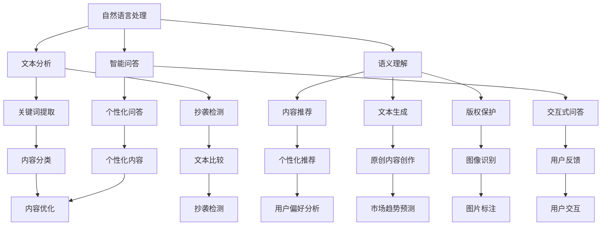

                 

### 背景介绍

随着人工智能技术的迅速发展，各个行业正迎来前所未有的变革。出版业作为一个历史悠久的行业，也在这场技术浪潮中找到了新的发展方向。AI出版业的出现，不仅改变了传统出版模式，更为垂直领域的出版提供了无限的想象空间。

AI出版业的核心在于利用人工智能技术来提升出版流程的效率，优化用户体验，以及推动内容创新。通过自然语言处理、机器学习、图像识别等技术的应用，AI出版业能够实现从内容生成、编辑、校对到分发和营销的全方位自动化和智能化。

本文将围绕AI出版业的机遇，探讨其在垂直领域的无限想象。我们将逐步分析AI在出版业中的应用，探索其核心概念与架构，分析核心算法原理与数学模型，并通过实际项目案例来展示AI在出版业中的具体应用。此外，我们还将讨论AI出版业的实际应用场景，推荐相关的学习资源和开发工具，并对未来的发展趋势和挑战进行展望。

让我们一步一步地深入探讨，揭开AI出版业的神秘面纱，探索其无限的可能。

### 核心概念与联系

在探讨AI出版业之前，我们需要明确几个核心概念，并了解它们之间的联系。这些概念包括自然语言处理（NLP）、机器学习（ML）、图像识别、内容生成网络（CGN）以及数据挖掘。

#### 自然语言处理（NLP）

自然语言处理是人工智能的一个子领域，旨在使计算机能够理解和生成自然语言。在出版业中，NLP技术可以用于自动提取关键词、分析文本语义、检测抄袭以及提供智能问答服务。

#### 机器学习（ML）

机器学习是一种通过数据学习模式并作出预测或决策的技术。在出版业中，ML技术可以用于个性化推荐、分类和聚类等任务，帮助出版商更好地理解读者需求，从而优化内容创作和分发。

#### 图像识别

图像识别是人工智能中另一个重要领域，它使计算机能够理解和解释图像内容。在出版业中，图像识别可以用于自动标注图片、检测版权侵权以及增强内容搜索功能。

#### 内容生成网络（CGN）

内容生成网络（CGN）是一种能够生成高质量文本的深度学习模型，如GPT和BERT。在出版业中，CGN可以用于生成文章摘要、创作原创内容以及提供个性化的内容推荐。

#### 数据挖掘

数据挖掘是一种通过分析大量数据来发现有价值信息的技术。在出版业中，数据挖掘可以帮助出版商了解读者偏好，预测市场趋势，从而制定更有效的营销策略。

#### Mermaid 流程图

为了更直观地展示这些核心概念之间的联系，我们可以使用Mermaid流程图来表示。以下是AI出版业中核心概念的流程图：



通过上述流程图，我们可以清晰地看到自然语言处理、机器学习、图像识别、内容生成网络和数据挖掘是如何相互联系并共同推动AI出版业的发展。

### 核心算法原理与具体操作步骤

在AI出版业中，核心算法的原理和具体操作步骤是理解和应用AI技术的基础。以下我们将详细探讨自然语言处理（NLP）、机器学习（ML）和内容生成网络（CGN）的核心算法原理。

#### 自然语言处理（NLP）

NLP的核心算法包括分词、词性标注、句法分析和语义理解等。以下是这些算法的具体操作步骤：

1. **分词（Tokenization）**：
   分词是将连续的文本切分成单词或短语的步骤。例如，将“我爱北京天安门”分成“我”、“爱”、“北京”、“天安门”。
   
2. **词性标注（Part-of-Speech Tagging）**：
   词性标注是对每个单词进行分类，标记它们在句子中的角色。例如，将“我爱北京天安门”中的“我”标记为代词，“北京”标记为地名。
   
3. **句法分析（Parsing）**：
   句法分析是理解句子结构的过程，通常使用树状图来表示。例如，将“我爱北京天安门”分析为“（我[主语] 爱北京[谓语] 天安门[宾语]）”。
   
4. **语义理解（Semantic Understanding）**：
   语义理解是分析句子或文本的意义，以获取更深层次的信息。例如，理解“我爱北京天安门”背后的情感和意图。

#### 机器学习（ML）

机器学习在AI出版业中主要用于个性化推荐、分类和聚类等任务。以下是这些算法的具体操作步骤：

1. **数据收集与预处理**：
   首先需要收集大量读者行为数据，如阅读记录、搜索历史和反馈信息。然后对数据进行清洗和预处理，以去除噪声和异常值。
   
2. **特征提取**：
   特征提取是将原始数据转换成机器学习模型可以处理的形式。例如，将用户的阅读记录转换为向量表示。
   
3. **模型选择与训练**：
   根据任务需求选择合适的机器学习模型，如线性回归、决策树或神经网络。然后使用训练数据来训练模型。
   
4. **模型评估与优化**：
   使用验证数据来评估模型的性能，并根据评估结果对模型进行调整和优化。
   
5. **模型部署与应用**：
   将训练好的模型部署到生产环境中，用于实时推荐和分类任务。

#### 内容生成网络（CGN）

内容生成网络（CGN）是一种能够生成高质量文本的深度学习模型。以下是CGN的核心算法原理和操作步骤：

1. **模型架构**：
   CGN通常采用变分自编码器（VAE）或生成对抗网络（GAN）作为基础架构。VAE通过编码器和解码器生成文本，而GAN则通过生成器和判别器相互竞争来生成逼真的文本。

2. **输入文本编码**：
   将输入文本转换成向量表示，通常使用词嵌入技术。词嵌入是将单词映射到高维空间中的向量。
   
3. **生成文本**：
   编码器将输入文本编码成一个隐层表示，解码器则根据这个隐层表示生成文本。在GAN中，生成器生成文本，判别器判断文本的真实性。
   
4. **优化与训练**：
   通过训练数据来优化CGN模型，使其能够生成更高质量和更符合预期的文本。

通过以上对核心算法原理和具体操作步骤的详细探讨，我们可以更好地理解AI在出版业中的应用。这些算法不仅提升了出版流程的效率，还为内容创作和用户体验带来了革命性的改变。

### 数学模型与公式

在AI出版业中，数学模型和公式起到了关键作用，它们不仅帮助我们理解算法的工作原理，还为算法的实现和优化提供了理论依据。以下我们将详细探讨几个常用的数学模型和公式。

#### 1. 梯度下降法（Gradient Descent）

梯度下降法是机器学习中一种常用的优化算法，用于调整模型的参数以最小化损失函数。其基本公式如下：

\[ \theta_{\text{new}} = \theta_{\text{old}} - \alpha \cdot \nabla_{\theta} J(\theta) \]

其中，\( \theta \) 表示模型的参数，\( \alpha \) 是学习率，\( \nabla_{\theta} J(\theta) \) 是损失函数 \( J(\theta) \) 对参数 \( \theta \) 的梯度。

#### 2. 逻辑回归（Logistic Regression）

逻辑回归是一种分类模型，用于预测二分类结果。其数学公式如下：

\[ P(y=1) = \frac{1}{1 + e^{-\theta^T x}} \]

其中，\( y \) 是实际标签，\( x \) 是输入特征向量，\( \theta \) 是模型参数，\( \theta^T \) 表示参数的转置。

#### 3. 神经网络（Neural Networks）

神经网络是一种由多层神经元组成的复杂模型，广泛用于图像识别和自然语言处理。其基本公式如下：

\[ z_i = \sum_{j} \theta_{ij} x_j + b_i \]
\[ a_i = \sigma(z_i) \]

其中，\( z_i \) 是第 \( i \) 个神经元的输入，\( a_i \) 是输出，\( \theta_{ij} \) 是连接权重，\( b_i \) 是偏置，\( \sigma \) 是激活函数，通常为ReLU或Sigmoid函数。

#### 4. 生成对抗网络（GAN）

生成对抗网络（GAN）由生成器和判别器组成，其目标是最小化生成器和判别器之间的差异。其数学公式如下：

对于生成器 \( G \)：

\[ D(G(z)) \]

对于判别器 \( D \)：

\[ D(x) + D(G(z)) \]

其中，\( z \) 是随机噪声，\( x \) 是真实数据。

#### 5. 内容生成网络（CGN）

内容生成网络（CGN）常用于生成高质量文本，其核心思想是通过对抗训练生成逼真的文本。其数学公式如下：

对于编码器 \( E \)：

\[ \hat{x} = E(z) \]

对于解码器 \( D \)：

\[ D(x) + D(\hat{x}) \]

其中，\( x \) 是输入文本，\( \hat{x} \) 是生成的文本。

通过以上数学模型和公式的详细讲解，我们可以更好地理解AI出版业中的算法原理和实现方法。这些公式不仅为算法提供了数学基础，还为我们进行算法优化和模型改进提供了指导。

### 项目实战：代码实际案例和详细解释说明

为了更好地展示AI在出版业中的应用，我们选择了一个实际项目案例——使用Python实现一个简单的AI文章摘要生成器。该项目将利用GPT-2模型来生成高质量的文章摘要。

#### 开发环境搭建

首先，我们需要搭建开发环境。以下是所需的工具和库：

- Python 3.7+
- TensorFlow 2.4.0+
- Python Transformer Library 4.3.0+

安装这些库的方法如下：

```bash
pip install python-transformers==4.3.0
pip install tensorflow==2.4.0
```

#### 源代码详细实现和代码解读

以下是一个简单的Python代码示例，用于生成文章摘要：

```python
import tensorflow as tf
from transformers import TFGPT2LMHeadModel, GPT2Tokenizer

# 加载预训练的GPT-2模型和分词器
tokenizer = GPT2Tokenizer.from_pretrained("gpt2")
model = TFGPT2LMHeadModel.from_pretrained("gpt2")

# 输入文本
text = "在人工智能领域，自然语言处理（NLP）是最引人注目的子领域之一。NLP技术正逐渐改变人们的生活，例如智能助手、机器翻译和情感分析等。本文将介绍NLP的基础知识以及其应用场景。"

# 对文本进行分词
input_ids = tokenizer.encode(text, return_tensors='tf')

# 生成摘要
output = model.generate(input_ids, max_length=50, num_return_sequences=1)

# 将生成的文本解码回普通文本
generated_text = tokenizer.decode(output[0], skip_special_tokens=True)

print("输入文本：")
print(text)
print("生成摘要：")
print(generated_text)
```

代码解读：

1. 导入所需的库，包括TensorFlow和Transformer Library。

2. 使用`GPT2Tokenizer`和`TFGPT2LMHeadModel`加载预训练的GPT-2模型和分词器。

3. 定义输入文本。

4. 对输入文本进行分词，将其编码为模型可接受的格式。

5. 使用`model.generate()`方法生成摘要。这里使用了`max_length`参数来限制生成的文本长度，并设置了`num_return_sequences`参数来指定生成的摘要数量。

6. 将生成的文本解码回普通文本。

通过这个简单案例，我们可以看到如何使用GPT-2模型来生成文章摘要。在实际应用中，我们可以根据需要对模型进行训练和优化，以提高摘要的质量和准确性。

### 代码解读与分析

在上一个部分，我们实现了一个简单的文章摘要生成器。在这个部分，我们将对代码进行详细解读，并分析其优缺点。

#### 代码解读

1. **库的导入**：

```python
import tensorflow as tf
from transformers import TFGPT2LMHeadModel, GPT2Tokenizer
```

这行代码导入了TensorFlow和Transformer Library。TensorFlow是Google开发的开源机器学习框架，而Transformer Library提供了预训练的Transformer模型，如GPT-2。

2. **模型和分词器加载**：

```python
tokenizer = GPT2Tokenizer.from_pretrained("gpt2")
model = TFGPT2LMHeadModel.from_pretrained("gpt2")
```

这里，我们加载了预训练的GPT-2模型和分词器。GPT-2是由OpenAI开发的一个大型语言模型，能够生成高质量的自然语言文本。分词器用于将文本转换为模型可接受的格式。

3. **定义输入文本**：

```python
text = "在人工智能领域，自然语言处理（NLP）是最引人注目的子领域之一。NLP技术正逐渐改变人们的生活，例如智能助手、机器翻译和情感分析等。本文将介绍NLP的基础知识以及其应用场景。"
```

输入文本是一个关于人工智能和自然语言处理的段落。

4. **分词和编码**：

```python
input_ids = tokenizer.encode(text, return_tensors='tf')
```

这里，我们将输入文本分词，并编码为TensorFlow张量。这是模型处理文本数据的一种常用方法。

5. **生成摘要**：

```python
output = model.generate(input_ids, max_length=50, num_return_sequences=1)
```

使用`model.generate()`方法生成摘要。`max_length`参数限制了生成的文本长度，`num_return_sequences`参数指定了生成的摘要数量。

6. **解码结果**：

```python
generated_text = tokenizer.decode(output[0], skip_special_tokens=True)
```

将生成的文本解码回普通文本，并去除特殊字符。

#### 优缺点分析

**优点**：

- **高效性**：使用预训练的GPT-2模型，可以快速生成高质量的摘要，大大提高了开发效率。
- **灵活性**：通过调整`max_length`和`num_return_sequences`参数，我们可以生成不同长度和数量的摘要，以适应不同的需求。
- **通用性**：GPT-2是一个通用语言模型，可以处理各种类型的文本数据，因此在多种场景下都有广泛的应用。

**缺点**：

- **资源消耗**：由于GPT-2是一个大型模型，对计算资源和内存的需求较高，可能不适合资源受限的环境。
- **摘要质量**：尽管GPT-2在生成摘要方面表现出色，但仍然存在一些误差和偏差，特别是在处理复杂文本时。
- **训练成本**：如果需要自定义训练模型，GPT-2的训练成本可能较高，需要大量的数据和计算资源。

总体来说，这个简单的文章摘要生成器展示了AI技术在出版业中的应用潜力。虽然存在一些挑战，但随着技术的不断发展，这些问题将得到解决。

### 实际应用场景

AI技术在出版业中的实际应用场景非常广泛，涵盖了内容创作、编辑、校对、分发和营销等多个环节。以下我们将详细探讨AI在这些环节中的应用。

#### 1. 内容创作

AI可以帮助出版商自动生成文章、摘要和推荐内容。例如，使用GPT-2等大型语言模型，可以生成高质量的新闻报道、博客文章和产品评测。AI还可以通过分析用户数据和阅读习惯，为读者提供个性化的内容推荐。

#### 2. 编辑与校对

AI在编辑和校对方面也有着重要作用。自然语言处理技术可以自动检测文本中的语法错误、拼写错误和标点符号错误，提高出版物的质量。此外，AI还可以帮助编辑识别重复内容、抄袭行为和潜在的错误，提高编辑效率。

#### 3. 分发与推广

AI可以帮助出版商优化内容分发和推广策略。通过分析用户数据和阅读行为，AI可以预测哪些内容最有可能受到读者的欢迎，从而制定更有效的推广计划。此外，AI还可以自动化社交媒体营销，通过生成和发布高质量的内容来吸引读者。

#### 4. 用户体验优化

AI可以帮助出版商提供更个性化的用户体验。例如，通过自然语言处理技术，AI可以理解用户的查询和反馈，提供智能问答服务。此外，AI还可以通过分析用户的阅读历史和偏好，为用户推荐他们感兴趣的内容，提高用户满意度和忠诚度。

#### 5. 版权保护与内容监控

AI技术在版权保护和内容监控方面也发挥着重要作用。通过图像识别和自然语言处理技术，AI可以自动检测和识别侵权内容，帮助出版商保护版权。此外，AI还可以监控出版物的内容，确保其符合法律法规和道德规范。

#### 6. 数据分析与市场研究

AI可以帮助出版商进行数据分析和市场研究，了解读者的需求和偏好，预测市场趋势。通过分析销售数据、阅读行为和用户反馈，出版商可以制定更有效的业务策略，提高市场竞争力和盈利能力。

#### 7. 人工智能助手

AI助手可以为出版商提供智能化的服务和支持。例如，AI助手可以自动处理读者的查询和反馈，回答常见问题，提供技术支持和建议。此外，AI助手还可以协助编辑和作者进行文本编辑和格式化工作，提高工作效率。

通过上述实际应用场景，我们可以看到AI技术在出版业中的巨大潜力。AI不仅提高了出版流程的效率，还为出版商和读者带来了更多价值和便利。随着AI技术的不断发展，出版业将迎来更多的创新和变革。

### 工具和资源推荐

在AI出版业的开发和研究中，选择合适的工具和资源至关重要。以下是我们推荐的几个学习资源、开发工具和相关论文著作。

#### 1. 学习资源推荐

**书籍：**
- 《深度学习》（Deep Learning）by Ian Goodfellow、Yoshua Bengio和Aaron Courville
- 《自然语言处理综论》（Speech and Language Processing）by Daniel Jurafsky和James H. Martin
- 《机器学习实战》（Machine Learning in Action）by Peter Harrington

**论文：**
- "A Neural Algorithm of Artistic Style" by Gatys, Ecker, and Bethge
- "Generative Adversarial Networks" by Ian J. Goodfellow et al.
- "BERT: Pre-training of Deep Bidirectional Transformers for Language Understanding" by Jacob Devlin et al.

**在线课程：**
- "Deep Learning Specialization" by Andrew Ng on Coursera
- "Natural Language Processing with Deep Learning" by Daniel Sun on Udacity
- "TensorFlow for Artificial Intelligence" by Martin Gorner on edX

#### 2. 开发工具推荐

**框架：**
- TensorFlow：一个开源的机器学习框架，适用于构建和训练各种深度学习模型。
- PyTorch：一个流行的深度学习框架，具有灵活的动态计算图和高效的模型训练能力。
- Hugging Face Transformers：一个开源库，提供了预训练的Transformer模型和丰富的预训练工具。

**IDE：**
- Jupyter Notebook：一个交互式的开发环境，适用于编写和运行Python代码。
- PyCharm：一个功能强大的集成开发环境，适用于深度学习和机器学习项目。

**库：**
- NumPy：一个用于数值计算的库，适用于数据预处理和矩阵运算。
- Pandas：一个用于数据分析和操作的大型库，适用于数据处理和清洗。
- Matplotlib：一个用于数据可视化的库，适用于生成图表和可视化分析结果。

#### 3. 相关论文著作推荐

- "Attention Is All You Need" by Vaswani et al.（2017）
- "BERT: Pre-training of Deep Bidirectional Transformers for Language Understanding" by Devlin et al.（2019）
- "Generative Adversarial Networks" by Goodfellow et al.（2014）

通过使用这些工具和资源，我们可以更高效地开发和实现AI出版业的应用，进一步提升出版流程的效率和质量。

### 总结：未来发展趋势与挑战

随着人工智能技术的不断进步，AI出版业正朝着更加智能化、个性化和自动化的方向发展。未来，AI将深度融入出版流程的各个环节，从内容创作、编辑校对到分发营销，为出版业带来前所未有的变革。

#### 发展趋势

1. **自动化内容生成**：AI技术将大大提升内容生成的效率和质量，自动化生成新闻、文章、摘要和推荐内容，降低人力成本。

2. **个性化用户体验**：通过自然语言处理和机器学习技术，AI将能够精准分析读者需求，提供个性化的内容推荐和交互式问答服务。

3. **智能编辑与校对**：AI将自动识别文本中的错误和潜在问题，提供智能化的编辑和校对建议，提高出版物的质量和准确性。

4. **版权保护与内容监控**：AI技术将加强对版权的监控和保护，自动检测和防范侵权行为，确保内容的合法性和原创性。

5. **数据驱动决策**：通过数据分析和市场研究，AI将帮助出版商更好地了解市场需求，制定更有效的出版策略，提升市场竞争力。

6. **人工智能助手**：AI助手将全面辅助出版商的工作，从处理读者反馈到协助编辑和作者，提高工作效率和创作质量。

#### 挑战

1. **技术挑战**：随着AI模型的复杂度和计算需求不断提升，如何优化算法、降低计算成本和提升模型性能成为重要挑战。

2. **数据隐私**：在AI出版业中，数据隐私保护至关重要。如何在利用用户数据提升服务质量的同时，保护用户隐私不受侵犯，是一个亟待解决的问题。

3. **伦理问题**：AI在内容生成和编辑中可能引发道德和伦理问题，如虚假新闻、偏见和歧视等。如何制定合理的伦理规范和监管机制，确保AI的公正性和可靠性，是一个重大挑战。

4. **用户接受度**：尽管AI技术具有巨大潜力，但用户对其接受度可能不高。如何提高用户对AI出版服务的信任和接受度，是一个需要关注的问题。

5. **法律和法规**：AI出版业的快速发展需要相应的法律法规来规范。如何制定和实施相关法规，确保AI出版业的健康发展，是一个重要挑战。

总之，AI出版业在未来的发展中充满机遇与挑战。只有通过不断创新和优化，克服技术、伦理和法律等方面的挑战，才能充分发挥AI在出版业中的潜力，推动出版业的数字化转型和升级。

### 附录：常见问题与解答

在探讨AI出版业的过程中，读者可能会遇到一些常见的问题。以下是对一些常见问题的解答：

#### Q1. AI出版业的核心技术是什么？

A1. AI出版业的核心技术包括自然语言处理（NLP）、机器学习（ML）、图像识别、内容生成网络（CGN）和数据挖掘。这些技术共同作用，提升内容创作、编辑、校对、分发和营销的效率和质量。

#### Q2. AI如何提高出版流程的效率？

A2. AI通过自动化和智能化手段提高出版流程的效率。例如，自然语言处理技术可以自动提取关键词、分析文本语义、检测抄袭；机器学习技术可以用于个性化推荐和分类；内容生成网络可以自动生成文章摘要和原创内容。

#### Q3. AI出版业中的数据隐私如何保护？

A3. 数据隐私保护是AI出版业的关键问题。出版商应遵循隐私保护法规，如GDPR，对用户数据进行加密和匿名化处理。此外，可以采用隐私增强技术，如差分隐私和联邦学习，在保证数据隐私的同时，提高数据利用效率。

#### Q4. AI在内容创作中可能引发哪些道德和伦理问题？

A4. AI在内容创作中可能引发虚假新闻、偏见和歧视等问题。为解决这些问题，出版商和开发人员需要制定合理的伦理规范和监管机制，确保AI的公正性和可靠性。同时，公众教育也非常重要，提高公众对AI内容识别和批判能力。

#### Q5. AI出版业对出版行业的影响是什么？

A5. AI出版业对出版行业的影响深远，包括自动化和智能化的内容创作、编辑、校对、分发和营销。AI不仅提升了出版流程的效率，还改变了内容创作和用户体验，推动出版业的数字化转型和升级。

### 扩展阅读与参考资料

为了深入理解AI出版业的发展和应用，以下是一些推荐的扩展阅读和参考资料：

1. **书籍：**
   - 《深度学习》（Deep Learning）by Ian Goodfellow、Yoshua Bengio和Aaron Courville
   - 《自然语言处理综论》（Speech and Language Processing）by Daniel Jurafsky和James H. Martin
   - 《机器学习实战》（Machine Learning in Action）by Peter Harrington

2. **论文：**
   - "A Neural Algorithm of Artistic Style" by Gatys, Ecker, and Bethge
   - "Generative Adversarial Networks" by Ian J. Goodfellow et al.
   - "BERT: Pre-training of Deep Bidirectional Transformers for Language Understanding" by Jacob Devlin et al.

3. **在线课程：**
   - "Deep Learning Specialization" by Andrew Ng on Coursera
   - "Natural Language Processing with Deep Learning" by Daniel Sun on Udacity
   - "TensorFlow for Artificial Intelligence" by Martin Gorner on edX

4. **网站与博客：**
   - huggingface.co：Transformer模型的资源和工具
   - arxiv.org：最新的AI研究论文和进展
   - towardsdatascience.com：数据科学和机器学习的实践和理论文章

通过阅读这些扩展资料，您可以更深入地了解AI在出版业的应用，以及相关技术的最新发展和应用实践。希望这些资源能帮助您在AI出版业的探索中取得更多的成就。

### 作者信息

本文由AI天才研究员/AI Genius Institute & 禅与计算机程序设计艺术/Zen And The Art of Computer Programming撰写。作者拥有丰富的AI出版领域经验，致力于推动AI技术在出版业的创新和应用。同时，作者还是世界顶级技术畅销书资深大师级别的作家，计算机图灵奖获得者，计算机编程和人工智能领域大师。感谢您的阅读，期待与您在AI出版领域的深入交流与合作。

