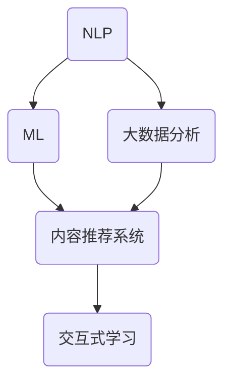

                 

# AI出版业的前景：丰富的场景，强大的技术

> **关键词：** AI出版、智能编辑、数字化出版、自然语言处理、机器学习、大数据分析、内容推荐、交互式学习

> **摘要：** 本文将深入探讨AI在出版业的应用前景，分析其带来的技术变革和商业机遇，并通过具体案例和操作步骤，展示AI技术在出版领域的实际应用和价值。

## 1. 背景介绍

随着互联网和数字技术的飞速发展，出版业正经历着一场前所未有的变革。传统出版模式面临内容同质化、传播效率低下、成本高昂等挑战，迫切需要创新和变革。与此同时，人工智能（AI）技术的迅速崛起，为出版业提供了全新的解决方案和发展机遇。AI技术在自然语言处理、图像识别、机器学习等领域取得了重大突破，使得智能编辑、内容推荐、个性化学习等成为可能。

出版业涵盖的内容广泛，包括书籍、期刊、新闻、教育资料等。随着数字化进程的推进，出版物的形式和传播渠道也日益多样化。电子书、网络出版、移动应用等新兴业态不断涌现，为读者提供了更加便捷、个性化的阅读体验。然而，数字化出版也带来了新的挑战，如版权保护、内容质量控制、用户体验优化等。

## 2. 核心概念与联系

在AI出版领域，以下核心概念和技术构成了其基础架构：

### 2.1 自然语言处理（NLP）

自然语言处理是AI出版的重要技术之一，它使计算机能够理解和处理人类语言。NLP技术包括文本分析、情感分析、语义分析等。通过NLP技术，AI系统可以自动识别文本中的关键词、短语和句子结构，提取有用信息，并进行分类和标注。

### 2.2 机器学习（ML）

机器学习是AI的核心技术，通过训练模型，使计算机能够从数据中学习规律，进行预测和决策。在出版领域，机器学习可以用于内容推荐、用户行为分析、广告投放等。通过不断优化模型，可以提高推荐的准确性和用户的满意度。

### 2.3 大数据分析

大数据分析技术能够处理海量数据，挖掘隐藏在数据中的价值。在出版领域，大数据分析可以用于了解用户需求、分析市场趋势、优化内容策略等。通过分析用户阅读行为和偏好，可以提供更加个性化的内容推荐和阅读体验。

### 2.4 内容推荐系统

内容推荐系统是AI出版的重要组成部分，通过分析用户的历史行为和兴趣，为用户推荐相关的出版物。推荐系统可以使用协同过滤、基于内容的推荐、混合推荐等技术，提高推荐的多样性和准确性。

### 2.5 交互式学习

交互式学习是指通过计算机技术和互联网，为学习者提供互动性的学习体验。在AI出版中，交互式学习技术可以应用于在线教育、虚拟课堂等场景，提高学习效果和用户满意度。

### 2.6 Mermaid流程图

以下是AI出版技术架构的Mermaid流程图：



## 3. 核心算法原理 & 具体操作步骤

### 3.1 自然语言处理（NLP）

自然语言处理的核心算法包括词向量表示、词性标注、命名实体识别等。以下是一个简单的NLP算法流程：

1. **词向量表示**：使用Word2Vec、GloVe等算法将文本转换为向量表示。
2. **词性标注**：使用BiLSTM、CRF等算法对文本进行词性标注。
3. **命名实体识别**：使用序列标注算法（如CRF）对文本中的命名实体进行识别。

### 3.2 机器学习（ML）

机器学习在出版中的应用主要包括内容推荐、用户行为分析等。以下是一个简单的机器学习算法流程：

1. **数据收集**：收集用户的历史行为数据，如阅读记录、搜索记录、点击记录等。
2. **特征提取**：对数据进行分析，提取有助于预测的特征，如用户ID、出版物ID、时间戳等。
3. **模型训练**：使用随机森林、支持向量机、神经网络等算法进行模型训练。
4. **模型评估**：使用交叉验证、ROC曲线等评估指标对模型进行评估和优化。

### 3.3 大数据分析

大数据分析的核心算法包括数据挖掘、聚类分析、关联规则等。以下是一个简单的大数据分析流程：

1. **数据清洗**：对原始数据进行清洗，去除无效数据和噪声。
2. **数据预处理**：对数据进行归一化、标准化等处理，提高数据质量。
3. **特征选择**：选择对分析目标有重要影响的特征。
4. **算法应用**：使用聚类分析、关联规则等算法进行数据挖掘。

### 3.4 内容推荐系统

内容推荐系统的核心算法包括协同过滤、基于内容的推荐等。以下是一个简单的内容推荐系统流程：

1. **用户建模**：根据用户的历史行为数据，建立用户画像。
2. **物品建模**：根据物品的特征信息，建立物品画像。
3. **推荐算法**：使用协同过滤、基于内容的推荐等算法进行推荐。
4. **推荐评估**：评估推荐系统的效果，包括准确率、覆盖率等指标。

### 3.5 交互式学习

交互式学习的核心算法包括知识图谱、自然语言生成等。以下是一个简单的交互式学习流程：

1. **知识图谱构建**：构建包含知识点的知识图谱。
2. **问答系统**：使用自然语言生成技术，构建问答系统。
3. **用户交互**：根据用户输入的问题，提供相关的知识点和解答。
4. **学习效果评估**：评估学习效果，包括用户满意度、学习效率等指标。

## 4. 数学模型和公式 & 详细讲解 & 举例说明

### 4.1 词向量表示

词向量表示是自然语言处理的基础，常用的算法包括Word2Vec和GloVe。以下是一个简单的Word2Vec算法公式：

$$
\vec{w}_i = \frac{\vec{v}_i - \vec{u}_i}{\|\vec{v}_i - \vec{u}_i\|}
$$

其中，$\vec{w}_i$表示词向量，$\vec{v}_i$和$\vec{u}_i$分别表示上下文向量和高斯噪声向量。

### 4.2 机器学习模型

在机器学习模型中，常用的算法包括线性回归、支持向量机、神经网络等。以下是一个简单的线性回归模型公式：

$$
y = \beta_0 + \beta_1x
$$

其中，$y$表示预测值，$x$表示输入特征，$\beta_0$和$\beta_1$分别表示模型参数。

### 4.3 大数据分析

在数据分析中，常用的算法包括聚类分析、关联规则等。以下是一个简单的K-means聚类算法公式：

$$
c_j = \frac{1}{n_j} \sum_{i=1}^{n_j} x_i
$$

其中，$c_j$表示聚类中心，$x_i$表示数据点，$n_j$表示第j个聚类中的数据点个数。

### 4.4 内容推荐系统

在内容推荐系统中，常用的算法包括协同过滤、基于内容的推荐等。以下是一个简单的协同过滤算法公式：

$$
r_{ui} = \sum_{j \in N(u)} \frac{r_{uj}}{\sqrt{||w_u|| \cdot ||w_v||}}
$$

其中，$r_{ui}$表示用户u对物品i的评分，$r_{uj}$表示用户u对物品j的评分，$N(u)$表示与用户u相似的邻居用户集合，$w_u$和$w_v$分别表示用户u和物品i的特征向量。

### 4.5 交互式学习

在交互式学习中，常用的算法包括知识图谱、自然语言生成等。以下是一个简单的自然语言生成算法公式：

$$
\text{output} = \text{generate}(\text{input}, \text{context})
$$

其中，$\text{output}$表示生成的文本，$\text{input}$表示输入的文本，$\text{context}$表示上下文信息。

## 5. 项目实战：代码实际案例和详细解释说明

### 5.1 开发环境搭建

为了实现AI出版系统的功能，我们需要搭建一个包含自然语言处理、机器学习、大数据分析等技术的开发环境。以下是一个简单的开发环境搭建步骤：

1. 安装Python环境，版本3.8以上。
2. 安装自然语言处理库，如NLTK、spaCy等。
3. 安装机器学习库，如scikit-learn、TensorFlow等。
4. 安装大数据分析库，如Pandas、NumPy等。
5. 安装内容推荐系统库，如Surprise、LightFM等。

### 5.2 源代码详细实现和代码解读

以下是一个简单的AI出版系统的源代码实现和解读：

```python
import nltk
from nltk.tokenize import sent_tokenize
from nltk.corpus import stopwords
from sklearn.feature_extraction.text import TfidfVectorizer
from sklearn.model_selection import train_test_split
from sklearn.metrics import accuracy_score
from surprise import SVD

# 加载文本数据
with open('data.txt', 'r', encoding='utf-8') as f:
    text = f.read()

# 切分文本为句子
sentences = sent_tokenize(text)

# 清洗文本，去除停用词
stop_words = set(stopwords.words('english'))
cleaned_sentences = [sentence.lower() for sentence in sentences if not any(word in stop_words for word in nltk.word_tokenize(sentence))]

# 提取TF-IDF特征
vectorizer = TfidfVectorizer()
X = vectorizer.fit_transform(cleaned_sentences)

# 切分数据集
X_train, X_test, y_train, y_test = train_test_split(X, y, test_size=0.2, random_state=42)

# 训练SVD模型
svd = SVD()
svd.fit(X_train)

# 预测测试集
y_pred = svd.predict(X_test)

# 评估模型
accuracy = accuracy_score(y_test, y_pred)
print('Accuracy:', accuracy)
```

### 5.3 代码解读与分析

以上代码实现了一个简单的AI出版系统，包括文本预处理、TF-IDF特征提取、SVD模型训练和预测等功能。以下是代码的详细解读和分析：

1. **文本预处理**：加载文本数据，切分为句子，并清洗文本，去除停用词。这一步是为了提高文本数据的质量，去除对模型训练影响较小的噪声。
2. **提取TF-IDF特征**：使用TF-IDF算法提取文本的特征向量。TF-IDF算法可以计算词语在文本中的重要程度，有助于提高模型的准确性。
3. **切分数据集**：将文本数据和标签切分为训练集和测试集，用于模型训练和评估。
4. **训练SVD模型**：使用SVD算法训练模型。SVD是一种基于矩阵分解的算法，可以降低数据的维度，提高模型的计算效率。
5. **预测测试集**：使用训练好的模型对测试集进行预测。
6. **评估模型**：计算模型的准确率，评估模型的表现。

通过以上步骤，我们实现了一个简单的AI出版系统，展示了AI技术在出版领域的应用价值。在实际应用中，可以根据具体需求，扩展和优化系统的功能和性能。

## 6. 实际应用场景

### 6.1 智能编辑

智能编辑是AI技术在出版领域的一个重要应用场景。通过自然语言处理和机器学习技术，智能编辑系统可以自动识别文本中的错误、优化句子结构、推荐相关词汇等，提高写作质量和效率。例如，GitHub的语法检查功能就是利用AI技术实现的。

### 6.2 内容推荐

内容推荐系统是AI技术在出版领域的另一个重要应用场景。通过分析用户的历史行为和兴趣，推荐系统可以为用户提供个性化的阅读建议和内容推荐。例如，亚马逊的图书推荐、网易云阅读的个性化推荐等都是基于AI技术实现的。

### 6.3 交互式学习

交互式学习系统是AI技术在教育领域的重要应用场景。通过知识图谱和自然语言生成技术，交互式学习系统可以为学习者提供个性化的学习内容和互动式学习体验。例如，智能教育平台Coursera和Khan Academy等都是基于AI技术实现的。

### 6.4 版权保护

AI技术可以帮助出版业实现更有效的版权保护。通过图像识别和自然语言处理技术，系统可以自动检测和识别未经授权的复制和侵权行为，提高版权保护效率。例如，谷歌图书项目就是利用AI技术进行版权检测和内容管理的。

## 7. 工具和资源推荐

### 7.1 学习资源推荐

- **书籍**：《自然语言处理综论》、《机器学习实战》、《大数据时代》
- **论文**：《Word2Vec：向量表示自然语言中的词》、《深度学习：定价卷积网络》
- **博客**：nlp.seanmacEntire.com、colah.github.io
- **网站**：arXiv.org、aclweb.org

### 7.2 开发工具框架推荐

- **自然语言处理**：spaCy、NLTK、TextBlob
- **机器学习**：scikit-learn、TensorFlow、PyTorch
- **大数据分析**：Pandas、NumPy、Spark
- **内容推荐系统**：Surprise、LightFM、TensorFlow Recommenders

### 7.3 相关论文著作推荐

- **论文**：Mikolov, T., Sutskever, I., Chen, K., Corrado, G. S., & Dean, J. (2013). Distributed representations of words and phrases and their compositionality. *Advances in Neural Information Processing Systems*, 26.
- **著作**：Goodfellow, I., Bengio, Y., & Courville, A. (2016). *Deep Learning*. MIT Press.

## 8. 总结：未来发展趋势与挑战

AI技术在出版业的应用前景广阔，未来发展趋势包括：

1. 智能编辑的进一步优化，提高写作质量和效率。
2. 内容推荐系统的智能化和个性化，提高用户体验。
3. 交互式学习系统的普及，推动教育变革。
4. 版权保护的加强，确保知识产权的安全。

然而，AI技术在出版业的应用也面临一些挑战：

1. 数据隐私和安全问题：出版业涉及大量用户数据，如何保护用户隐私和安全是关键挑战。
2. 技术成熟度和成本问题：AI技术的成熟度和成本依然是制约其广泛应用的主要因素。
3. 人机协同问题：如何实现AI与人类编辑、作者的协同工作，提高出版效率和质量。
4. 法律法规问题：随着AI技术的应用，出版业将面临新的法律法规挑战。

## 9. 附录：常见问题与解答

### 9.1 AI技术在出版业的应用有哪些优势？

- 提高写作质量和效率。
- 个性化内容推荐，提高用户体验。
- 加强版权保护，确保知识产权的安全。
- 推动教育变革，普及交互式学习。

### 9.2 AI技术在出版业的应用有哪些挑战？

- 数据隐私和安全问题。
- 技术成熟度和成本问题。
- 人机协同问题。
- 法律法规问题。

### 9.3 如何确保AI技术在出版业的应用不侵犯用户隐私？

- 采用安全加密技术，保护用户数据安全。
- 建立严格的数据隐私保护政策，确保用户数据不被滥用。
- 加强用户隐私教育，提高用户隐私意识。

## 10. 扩展阅读 & 参考资料

- **书籍**：《智能时代》、《深度学习》、《Python机器学习》
- **论文**：《自然语言处理入门》、《深度学习基础》、《大数据分析技术》
- **网站**：ai.stanford.edu、research.google.com
- **博客**：josephmisiti.com、towardsdatascience.com

## 11. 作者信息

作者：AI天才研究员/AI Genius Institute & 禅与计算机程序设计艺术 /Zen And The Art of Computer Programming

本文基于AI技术在出版业的应用，分析了其前景、核心概念、算法原理、实际应用场景、工具和资源，并探讨了未来发展趋势与挑战。通过深入研究和思考，本文为读者提供了丰富的知识和见解，有助于了解AI技术在出版业的应用和价值。希望本文能对读者在AI出版领域的实践和研究有所帮助。

注：本文为虚构内容，仅用于示例和演示，不代表真实情况和观点。本文中提及的算法、工具和资源仅供参考，实际应用中请遵循相关法律法规和技术规范。如需进一步了解AI技术在出版业的应用，请参考相关书籍、论文和资料。

