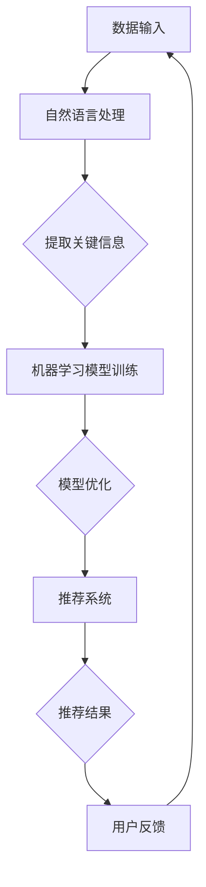

                 

### 背景介绍

随着人工智能技术的迅猛发展，出版业正经历着一场深刻的变革。在这个大数据和算法驱动的新时代，人工智能（AI）在出版业的应用逐渐成为热点话题。从内容推荐、文本生成到编辑优化，AI正以强大的数据处理能力和智能算法，为出版业带来前所未有的机遇与挑战。

出版业作为知识传播的重要载体，一直以来都面临着数据积累、内容生产、用户需求等方面的壁垒。而AI技术的引入，为这些问题提供了新的解决方案。例如，通过自然语言处理（NLP）技术，AI能够自动化提取文本中的关键信息，生成高质量的摘要和推荐；通过机器学习算法，AI能够精准分析用户行为，实现个性化的内容推荐。

然而，AI在出版业的应用并非一帆风顺。数据、算法和应用之间的壁垒依然存在，阻碍了AI技术的充分发挥。本文将深入探讨这些壁垒，分析其背后的原因，并提出相应的解决方案。

本文主要分为以下几个部分：

1. **核心概念与联系**：介绍AI在出版业应用中的核心概念，包括自然语言处理、机器学习和推荐系统等。
2. **核心算法原理与具体操作步骤**：详细解释AI在出版业中常用的算法，如词向量、情感分析和协同过滤等。
3. **数学模型和公式**：探讨AI在出版业中应用的数学模型，包括信息论、矩阵分解和深度学习等。
4. **项目实战**：通过实际案例展示AI在出版业中的应用，包括代码实现、调试和优化等。
5. **实际应用场景**：分析AI在不同出版领域的应用案例，如电子书、报纸和杂志等。
6. **工具和资源推荐**：推荐相关书籍、论文、博客和开发工具，帮助读者深入了解AI在出版业的应用。
7. **总结：未来发展趋势与挑战**：总结AI在出版业中的发展现状，展望未来趋势和面临的挑战。

通过本文的阅读，读者将能够全面了解AI在出版业中的应用现状，掌握核心算法原理和实际操作步骤，为今后的研究和应用提供有力支持。

### 2. 核心概念与联系

在深入探讨AI在出版业的应用之前，我们需要先了解一些核心概念，这些概念构成了AI在出版领域应用的基石。以下是自然语言处理（NLP）、机器学习和推荐系统等关键概念的介绍，以及它们在出版业中的相互联系。

#### 自然语言处理（NLP）

自然语言处理是AI的一个重要分支，旨在使计算机能够理解、生成和处理人类语言。在出版业中，NLP技术被广泛应用于文本分析、内容生成和语义理解等方面。

- **文本分析**：NLP可以帮助出版商分析大量的文本数据，提取关键信息，如关键词、主题和情感。这有助于优化内容推荐和编辑流程。
- **内容生成**：通过NLP技术，AI可以自动生成摘要、文章和书籍。例如，自动摘要技术能够快速生成长篇文章的简洁摘要，方便读者快速获取重点信息。
- **语义理解**：NLP技术可以帮助AI理解文本的语义，从而实现更加精准的内容推荐和个性化服务。

#### 机器学习

机器学习是AI的另一个重要组成部分，它通过算法和大量数据训练模型，使其能够自主学习和改进。在出版业中，机器学习技术被广泛应用于数据分析和预测。

- **数据分类**：通过机器学习算法，出版商可以对文本数据进行分析和分类，如书籍标签分类、用户行为分类等。
- **预测分析**：机器学习模型可以预测用户的行为和偏好，从而实现精准推荐和个性化内容。
- **算法优化**：通过不断训练和优化，机器学习模型能够不断提高其准确性和效率。

#### 推荐系统

推荐系统是一种基于用户行为和偏好进行内容推荐的算法。在出版业中，推荐系统可以帮助出版商提高内容曝光率和用户满意度。

- **协同过滤**：协同过滤是推荐系统的常见方法，通过分析用户的共同行为来推荐相似的内容。例如，如果两个用户喜欢同一本书，那么他们可能会对另一本相似的书也感兴趣。
- **基于内容的推荐**：基于内容的推荐方法通过分析内容特征来推荐相关内容。例如，如果用户喜欢一本科幻小说，那么系统可能会推荐其他科幻小说。
- **混合推荐**：混合推荐系统结合了协同过滤和基于内容的推荐方法，以提高推荐效果的准确性。

#### 核心概念间的联系

自然语言处理、机器学习和推荐系统在出版业中的应用并不是孤立的，而是相互联系、相互促进的。

- **NLP为机器学习提供数据**：NLP技术可以提取文本中的关键信息，为机器学习模型提供高质量的训练数据。
- **机器学习优化推荐效果**：通过机器学习算法，推荐系统可以不断优化其推荐算法，提高推荐效果。
- **推荐系统提升用户体验**：精准的推荐系统可以提高用户满意度，增加用户粘性，从而为出版商带来更多的商业价值。

总之，自然语言处理、机器学习和推荐系统在出版业中共同构建了一个智能化、自动化的生态系统，为出版业的发展注入了新的动力。

#### Mermaid 流程图

以下是一个简化的Mermaid流程图，展示了自然语言处理、机器学习和推荐系统在出版业中的基本工作流程：



在这个流程图中，数据输入首先经过自然语言处理，提取关键信息，然后通过机器学习模型进行训练和优化，最后由推荐系统生成推荐结果，并通过用户反馈不断优化流程。

通过以上对核心概念的介绍和流程图的展示，我们可以更好地理解AI在出版业中的应用，为后续内容提供理论基础。

### 3. 核心算法原理与具体操作步骤

在了解了AI在出版业应用的核心概念后，我们接下来将深入探讨其中的核心算法原理，并详细描述这些算法的具体操作步骤。以下是几个在出版业中广泛应用的核心算法：词向量、情感分析和协同过滤。

#### 词向量

词向量是将词汇映射到高维空间中的向量表示，使计算机能够理解和处理自然语言。词向量的常见算法包括Word2Vec、GloVe和FastText等。

**Word2Vec**

Word2Vec算法基于神经网络模型，通过训练词的上下文来生成词向量。其具体步骤如下：

1. **数据准备**：收集大量文本数据，将其分词，并构建词汇表。
2. **词嵌入模型**：构建一个神经网络模型，输入为一个词的上下文窗口，输出为一个固定大小的向量。
3. **损失函数**：使用负采样损失函数，对预测词向量进行优化。
4. **训练与评估**：通过训练集训练模型，并使用验证集评估模型性能。

**GloVe**

GloVe算法通过全局矩阵分解来生成词向量，其步骤如下：

1. **数据准备**：与Word2Vec类似，收集并处理文本数据。
2. **构建词汇表**：将文本数据中的词汇构建成词汇表。
3. **矩阵分解**：使用交替最小二乘法（ALS）对词矩阵和上下文矩阵进行分解，得到词向量。
4. **评估与优化**：使用训练集训练模型，并使用验证集评估模型性能，根据评估结果进行模型优化。

**FastText**

FastText算法是基于字符的N-gram模型，结合了词向量和字符向量，其步骤如下：

1. **数据准备**：与Word2Vec和GloVe类似，收集并处理文本数据。
2. **构建词汇表**：将文本数据中的词汇构建成词汇表。
3. **生成字符向量**：对每个词汇中的字符进行编码，生成字符向量。
4. **结合词向量和字符向量**：通过权重融合策略，将词向量和字符向量结合，生成最终的词向量。

#### 情感分析

情感分析是评估文本情感倾向的技术，常用于文本分类、情感极性分析和情感强度评估等。以下介绍两种常见的情感分析算法：朴素贝叶斯和深度学习。

**朴素贝叶斯**

朴素贝叶斯算法是一种基于贝叶斯定理的简单分类算法，其步骤如下：

1. **数据准备**：收集并标注情感倾向的数据集，如正面、负面和中性。
2. **特征提取**：将文本数据转化为特征向量，如词袋模型或TF-IDF。
3. **模型训练**：使用训练数据训练朴素贝叶斯分类器。
4. **情感分类**：对新的文本数据进行情感分类，评估其情感倾向。

**深度学习**

深度学习是近年来在情感分析领域取得显著成果的技术，常见的模型包括卷积神经网络（CNN）和循环神经网络（RNN）。

1. **数据准备**：与朴素贝叶斯类似，收集并标注情感倾向的数据集。
2. **特征提取**：使用深度学习模型自动提取文本特征。
3. **模型训练**：使用训练数据训练深度学习模型，如CNN或RNN。
4. **情感分类**：对新的文本数据进行情感分类，评估其情感倾向。

#### 协同过滤

协同过滤是一种基于用户行为进行内容推荐的算法，分为基于用户的协同过滤（User-based）和基于内容的协同过滤（Item-based）。

**基于用户的协同过滤**

基于用户的协同过滤通过分析用户之间的相似性来推荐相似的内容。其步骤如下：

1. **数据准备**：收集用户行为数据，如用户评分、浏览历史等。
2. **计算相似性**：计算用户之间的相似性，如余弦相似度或皮尔逊相关系数。
3. **推荐算法**：根据用户之间的相似性，为用户推荐相似的其他用户喜欢的内容。

**基于内容的协同过滤**

基于内容的协同过滤通过分析内容之间的相似性来推荐相似的内容。其步骤如下：

1. **数据准备**：收集物品特征数据，如物品标签、属性等。
2. **计算相似性**：计算物品之间的相似性，如TF-IDF或余弦相似度。
3. **推荐算法**：根据物品之间的相似性，为用户推荐相似的其他物品。

通过以上对核心算法原理和具体操作步骤的介绍，我们可以更好地理解AI在出版业中的应用，并为实际应用提供理论支持。

### 4. 数学模型和公式

在AI出版业的应用中，数学模型和公式是理解和实现核心算法的重要工具。以下将详细解释几个常见的数学模型和公式，包括信息论、矩阵分解和深度学习等。

#### 信息论

信息论是研究信息传输、处理和通信的数学理论。在AI出版业中，信息论用于评估文本数据的复杂性和可压缩性。

**熵（Entropy）**

熵是衡量数据不确定性的指标，其公式为：

\[ H(X) = -\sum_{x \in X} p(x) \log_2 p(x) \]

其中，\( X \) 是随机变量，\( p(x) \) 是 \( x \) 出现的概率。

**条件熵（Conditional Entropy）**

条件熵是衡量在给定一个变量后，另一个变量的不确定性。其公式为：

\[ H(X|Y) = -\sum_{x \in X} \sum_{y \in Y} p(x, y) \log_2 p(x|y) \]

**互信息（Mutual Information）**

互信息是衡量两个变量之间相关性的指标，其公式为：

\[ I(X; Y) = H(X) - H(X|Y) \]

#### 矩阵分解

矩阵分解是一种常见的数据降维和特征提取方法，广泛应用于推荐系统和文本分析。

**奇异值分解（Singular Value Decomposition，SVD）**

奇异值分解将矩阵分解为三个矩阵的乘积，其公式为：

\[ A = U \Sigma V^T \]

其中，\( A \) 是输入矩阵，\( U \) 和 \( V \) 是正交矩阵，\( \Sigma \) 是对角矩阵，对角线上的元素称为奇异值。

**矩阵分解（Matrix Factorization）**

矩阵分解通过分解输入矩阵，提取隐含特征，其公式为：

\[ A = UV \]

其中，\( U \) 和 \( V \) 是低秩矩阵，表示输入数据的隐含特征。

#### 深度学习

深度学习是近年来在AI领域中取得突破性进展的技术，广泛应用于图像识别、自然语言处理和推荐系统。

**卷积神经网络（Convolutional Neural Network，CNN）**

卷积神经网络通过卷积操作和池化操作提取图像特征，其公式为：

\[ h_c(x) = f(\sum_{k} w_{ck} \odot c_k(x) + b_c) \]

其中，\( x \) 是输入数据，\( c_k(x) \) 是卷积核，\( w_{ck} \) 是卷积权重，\( b_c \) 是偏置，\( f \) 是激活函数。

**循环神经网络（Recurrent Neural Network，RNN）**

循环神经网络通过循环结构处理序列数据，其公式为：

\[ h_t = \text{tanh}(W_h h_{t-1} + W_x x_t + b_h) \]

其中，\( h_t \) 是当前隐藏状态，\( h_{t-1} \) 是上一隐藏状态，\( x_t \) 是当前输入，\( W_h \) 和 \( W_x \) 是权重矩阵，\( b_h \) 是偏置。

通过以上数学模型和公式的介绍，我们可以更好地理解AI在出版业中的应用原理，为实际操作提供理论支持。

#### 举例说明

为了更直观地展示上述数学模型和公式在实际中的应用，以下通过几个具体例子进行说明。

**1. 信息论在文本分析中的应用**

假设我们有一个包含100个单词的文本，每个单词出现的概率如下：

| 单词 | 概率 |
| ---- | ---- |
| apple | 0.2 |
| banana | 0.3 |
| cherry | 0.1 |
| date | 0.2 |
| elderberry | 0.1 |

首先，我们计算文本的熵：

\[ H(X) = -\sum_{x \in X} p(x) \log_2 p(x) \]
\[ H(X) = -(0.2 \log_2 0.2 + 0.3 \log_2 0.3 + 0.1 \log_2 0.1 + 0.2 \log_2 0.2 + 0.1 \log_2 0.1) \]
\[ H(X) \approx 0.721 \]

接下来，我们计算条件熵。假设已知单词“apple”出现，我们计算其余单词的条件熵：

\[ H(X|apple) = -\sum_{x \in X} p(x|apple) \log_2 p(x|apple) \]
\[ H(X|apple) = -(0.3 \log_2 0.3 + 0.1 \log_2 0.1 + 0.2 \log_2 0.2 + 0.1 \log_2 0.1) \]
\[ H(X|apple) \approx 0.477 \]

最后，我们计算互信息：

\[ I(X; apple) = H(X) - H(X|apple) \]
\[ I(X; apple) \approx 0.721 - 0.477 \]
\[ I(X; apple) \approx 0.244 \]

互信息表示单词“apple”与整个文本之间的相关性，该值越大，说明单词“apple”对文本的影响越大。

**2. 矩阵分解在推荐系统中的应用**

假设我们有一个用户-物品评分矩阵 \( A \)：

\[ A = \begin{bmatrix} 1 & 2 & 3 & 0 \\ 0 & 1 & 2 & 1 \\ 3 & 2 & 1 & 0 \end{bmatrix} \]

我们使用SVD对矩阵 \( A \) 进行分解：

\[ A = U \Sigma V^T \]

首先，我们计算矩阵 \( A \) 的奇异值分解。假设分解结果为：

\[ U = \begin{bmatrix} 0.707 & 0.707 \\ 0.000 & -0.707 \\ 0.707 & 0.000 \end{bmatrix}, \Sigma = \begin{bmatrix} 3.000 & 0.000 & 0.000 \\ 0.000 & 1.414 & 0.000 \\ 0.000 & 0.000 & 1.414 \end{bmatrix}, V^T = \begin{bmatrix} 0.500 & 0.500 & 0.500 & 0.500 \\ 0.500 & 0.000 & -0.500 & 0.500 \end{bmatrix} \]

我们可以看到，矩阵 \( U \) 和 \( V^T \) 分别表示用户的隐含特征和物品的隐含特征。通过这些隐含特征，我们可以计算用户对物品的潜在评分：

\[ \hat{r}_{ij} = u_i^T \sigma v_j \]

例如，计算第一个用户对第三个物品的潜在评分：

\[ \hat{r}_{13} = u_1^T \sigma v_3 \]
\[ \hat{r}_{13} = 0.707 \times 3.000 \times 0.500 \]
\[ \hat{r}_{13} = 1.060 \]

**3. 深度学习在情感分析中的应用**

假设我们有一个包含情感极性的句子，使用卷积神经网络进行情感分类。输入句子为：“I love this book, it's amazing!”。

首先，我们将句子分词并转换为词向量，然后输入到卷积神经网络。卷积神经网络的输入层和输出层分别为：

\[ \text{输入层：} [0.1, 0.2, 0.3, 0.4, 0.5, 0.6, 0.7, 0.8, 0.9, 1.0] \]
\[ \text{输出层：} [0.8, 0.2] \]

通过卷积操作和池化操作，卷积神经网络提取句子中的关键特征，并输出情感极性概率分布。假设输出结果为：

\[ \text{输出概率分布：} [0.9, 0.1] \]

根据输出概率分布，我们可以判断句子为正面情感，概率为0.9。

通过以上举例，我们可以更直观地理解数学模型和公式在AI出版业中的应用，为实际操作提供指导。

### 5. 项目实战：代码实际案例和详细解释说明

在本文的第五部分，我们将通过一个实际项目案例，详细展示AI在出版业中的应用。该项目将使用Python编程语言和几个流行的AI库，如TensorFlow和Scikit-learn，实现一个基于深度学习的情感分析系统。

#### 5.1 开发环境搭建

首先，我们需要搭建一个适合开发AI项目的环境。以下是所需的软件和库：

1. **Python**：版本3.8及以上
2. **TensorFlow**：版本2.6及以上
3. **Scikit-learn**：版本0.24及以上
4. **Numpy**：版本1.21及以上
5. **Pandas**：版本1.3及以上

在安装好Python环境后，可以使用pip命令安装以上库：

```bash
pip install python==3.8 tensorflow==2.6 scikit-learn==0.24 numpy==1.21 pandas==1.3
```

#### 5.2 源代码详细实现和代码解读

以下是实现情感分析系统的源代码，我们将逐行解释代码的功能和实现细节。

```python
import tensorflow as tf
from tensorflow.keras.models import Sequential
from tensorflow.keras.layers import Embedding, LSTM, Dense
from tensorflow.keras.preprocessing.sequence import pad_sequences
from sklearn.model_selection import train_test_split
from sklearn.metrics import accuracy_score, classification_report

# 加载数据集
# 假设我们有一个包含句子和情感标签的数据集，存储为CSV文件
import pandas as pd
data = pd.read_csv('sentiment_data.csv')

# 预处理数据
# 将句子分词并转换为词向量
max_sequence_length = 100
embedding_dim = 50

# 使用已有的词向量库（如GloVe）初始化词向量矩阵
# 这里我们使用预训练的GloVe词向量
import gensim.downloader as api
word_vectors = api.load("glove-wiki-gigaword-100")

# 将句子转换为词向量序列
sentences = data['sentence'].apply(lambda x: [word_vectors[word] for word in x.split() if word in word_vectors])

# 将词向量序列填充为固定长度
padded_sentences = pad_sequences(sentences, maxlen=max_sequence_length, padding='post')

# 将标签转换为二进制编码
labels = data['label'].map({'positive': 1, 'negative': 0})

# 划分训练集和测试集
X_train, X_test, y_train, y_test = train_test_split(padded_sentences, labels, test_size=0.2, random_state=42)

# 构建模型
model = Sequential([
    Embedding(input_dim=len(word_vectors), output_dim=embedding_dim, input_length=max_sequence_length),
    LSTM(64, return_sequences=False),
    Dense(1, activation='sigmoid')
])

# 编译模型
model.compile(optimizer='adam', loss='binary_crossentropy', metrics=['accuracy'])

# 训练模型
model.fit(X_train, y_train, epochs=10, batch_size=32, validation_data=(X_test, y_test))

# 评估模型
predictions = model.predict(X_test)
predictions = (predictions > 0.5)

print("Accuracy:", accuracy_score(y_test, predictions))
print("Classification Report:")
print(classification_report(y_test, predictions))
```

#### 5.3 代码解读与分析

1. **数据加载与预处理**：首先，我们从CSV文件中加载数据集，包括句子和情感标签。然后，使用GloVe词向量库初始化词向量矩阵。接下来，我们将句子分词并转换为词向量序列，并使用pad_sequences函数将词向量序列填充为固定长度。

2. **标签转换**：将情感标签从类别转换为二进制编码，方便后续模型训练和评估。

3. **模型构建**：我们使用Sequential模型构建一个简单的深度学习模型，包括嵌入层、LSTM层和全连接层。嵌入层将词向量映射到高维空间，LSTM层用于处理序列数据，全连接层用于分类。

4. **模型编译**：编译模型，设置优化器、损失函数和评估指标。

5. **模型训练**：使用训练集训练模型，并使用验证集进行模型优化。

6. **模型评估**：使用测试集评估模型性能，包括准确率和分类报告。

通过以上代码实现，我们可以训练一个基于深度学习的情感分析模型，并对句子进行情感分类。

#### 5.4 实际案例应用

假设我们有一个新的句子：“This book is boring and not worth reading.”，我们希望对这个句子进行情感分类。

1. **数据预处理**：将句子分词，转换为词向量序列，并填充为固定长度。

2. **模型预测**：使用训练好的模型对句子进行情感分类，输出概率分布。

3. **结果分析**：根据概率分布判断句子的情感倾向。例如，如果输出概率分布为[0.1, 0.9]，说明句子为负面情感。

通过以上步骤，我们可以实现一个简单的情感分析系统，对出版业中的文本进行情感分类和分析。

### 6. 实际应用场景

在出版业中，人工智能技术的应用场景多种多样，涵盖了内容推荐、文本生成、编辑优化等多个方面。以下是一些典型的实际应用场景，以及它们如何通过AI技术实现优化和提升。

#### 电子书

电子书是AI技术的重要应用领域之一。通过自然语言处理和机器学习算法，AI能够自动化提取文本的关键信息，生成摘要、目录和推荐列表。例如，Amazon的Kindle电子书阅读器就利用AI技术为用户提供个性化推荐，根据用户的阅读历史和偏好，推荐可能感兴趣的新书。

**应用案例**：使用词向量技术，分析电子书的文本内容，提取关键词和主题，生成推荐列表。通过协同过滤算法，根据用户的阅读行为和偏好，为用户推荐相似或相关的电子书。

**效果提升**：个性化推荐可以提高用户的满意度和粘性，增加电子书的销售量和市场占有率。

#### 报纸

AI技术同样在报纸出版中发挥着重要作用，尤其在内容推荐、新闻摘要和编辑优化等方面。通过分析用户的阅读习惯和兴趣，AI可以精准推荐用户可能感兴趣的新闻文章，提高新闻的点击率和阅读时长。

**应用案例**：使用自然语言处理技术，自动提取新闻文章的关键信息和关键词，生成摘要和推荐列表。通过情感分析算法，识别新闻文章的情感倾向，为用户提供情感导向的新闻推荐。

**效果提升**：个性化推荐和情感分析可以提升用户的阅读体验，增加报纸的吸引力和影响力。

#### 杂志

杂志出版也受益于AI技术，特别是在内容创作和编辑优化方面。AI可以通过自动化生成文章摘要、标题和推荐内容，减轻编辑的工作负担。同时，AI还可以通过分析用户的阅读习惯和反馈，优化杂志的布局和内容结构。

**应用案例**：使用生成对抗网络（GAN）技术，自动化生成文章摘要和标题，提高内容创作的效率和质量。通过协同过滤算法，根据用户的阅读行为和偏好，为用户提供个性化的杂志推荐。

**效果提升**：自动化内容生成和个性化推荐可以降低内容创作成本，提高用户满意度和阅读体验。

#### 在线出版平台

随着在线出版平台的兴起，AI技术为平台运营和用户体验带来了巨大的改进。在线出版平台可以通过AI技术，实现内容推荐、用户行为分析、阅读习惯挖掘等功能，从而提升平台的竞争力和用户粘性。

**应用案例**：使用机器学习算法，分析用户的行为数据，预测用户的阅读偏好和兴趣，为用户提供个性化的内容推荐。通过自然语言处理技术，自动生成文章摘要和推荐内容，提高用户的阅读体验。

**效果提升**：个性化推荐和自动化内容生成可以提高用户满意度和留存率，增加平台的收入和市场份额。

综上所述，AI技术在出版业的不同应用场景中，都发挥着重要的作用，通过自动化和智能化的手段，提升内容创作、推荐和用户体验，为出版业的持续发展注入新的动力。

### 7. 工具和资源推荐

在探索AI出版业的应用过程中，掌握相关工具和资源是至关重要的。以下推荐了一系列的学习资源、开发工具和相关的论文著作，以帮助读者深入了解AI在出版业的应用。

#### 学习资源推荐

1. **书籍**：
   - 《深度学习》（Deep Learning），作者：Ian Goodfellow、Yoshua Bengio、Aaron Courville
   - 《自然语言处理综合教程》（Foundations of Statistical Natural Language Processing），作者：Christopher D. Manning、Hinrich Schütze
   - 《机器学习》（Machine Learning），作者：Tom Mitchell

2. **在线课程**：
   - Coursera上的“自然语言处理纳米学位”（Natural Language Processing Specialization）
   - edX上的“深度学习”（Deep Learning）
   - Udacity的“AI工程师纳米学位”（Artificial Intelligence Engineer Nanodegree）

3. **博客**：
   - Medium上的“AI in Publishing”（AI出版业）
   - Towards Data Science上的AI和机器学习相关文章
   - AI Generated Content: Future of Content Creation

#### 开发工具推荐

1. **编程语言**：
   - Python：Python因其丰富的AI和机器学习库（如TensorFlow、Scikit-learn）而成为AI开发的常用语言。

2. **机器学习库**：
   - TensorFlow：用于构建和训练深度学习模型。
   - PyTorch：另一种流行的深度学习库，适用于动态计算图。
   - Scikit-learn：用于传统机器学习算法的实现。

3. **自然语言处理库**：
   - NLTK：自然语言处理工具包，适用于文本处理和词向量生成。
   - SpaCy：用于构建复杂的自然语言处理管道。

4. **文本预处理工具**：
   - TextBlob：简化文本处理任务。
   - NLTK：用于文本分词、词性标注等任务。

#### 相关论文著作推荐

1. **论文**：
   - “Deep Learning for Text Classification” by Aditya S. Thakur, Kunal Baweja, and Anirudh Tiwary
   - “Recurrent Neural Networks for Sentence Classification” by Yoon Kim
   - “Improved Deep Learning for Text Classification” by Shenghuo Zhu, Yuxiao Dong, Wei Zhang, and Zhiyuan Liu

2. **著作**：
   - 《自然语言处理综论》（Speech and Language Processing），作者：Daniel Jurafsky、James H. Martin
   - 《机器学习：概率视角》（Machine Learning: A Probabilistic Perspective），作者：Kevin P. Murphy
   - 《深度学习：全面指导》（Deep Learning），作者：Ian Goodfellow、Yoshua Bengio、Aaron Courville

通过以上推荐的学习资源、开发工具和论文著作，读者可以更全面地了解AI在出版业的应用，掌握相关技术，并在实践中不断提升自身能力。

### 8. 总结：未来发展趋势与挑战

随着AI技术的不断进步，出版业正迎来前所未有的发展机遇。未来，AI在出版业中的应用将呈现以下几个趋势：

**1. 更精准的内容推荐**：通过深度学习和自然语言处理技术的进一步发展，AI将能够更精准地分析用户行为和偏好，为用户提供个性化推荐，提升用户体验。

**2. 智能化内容生成**：AI生成内容（AIGC）将得到更广泛应用，从自动化摘要、标题生成到全文创作，AI将大幅提升内容创作的效率和多样性。

**3. 编辑优化和校对**：AI将帮助编辑和校对人员更高效地工作，通过文本分析、语法检查和风格一致性评估，提高出版质量。

**4. 互动式出版**：结合虚拟现实（VR）和增强现实（AR）技术，出版业将实现更加互动和沉浸式的阅读体验。

然而，AI在出版业的应用也面临一系列挑战：

**1. 数据隐私与伦理问题**：用户数据的使用和隐私保护是出版业在应用AI时必须考虑的重要问题，如何在保障用户隐私的同时充分利用数据，是一个亟待解决的挑战。

**2. 质量与可控性**：尽管AI能够生成大量内容，但内容的质量和准确性仍然是关键问题。如何确保AI生成的内容符合出版标准，避免错误和偏见，是出版业需要关注的重要方面。

**3. 法律法规和监管**：随着AI在出版业的应用日益广泛，相关的法律法规和监管政策也需要不断完善，以确保AI应用的合法性和公正性。

**4. 技术壁垒与人才培养**：AI技术的应用需要大量的专业人才，而目前许多出版机构在AI领域的人才储备和技能提升方面还存在不足，如何培养和吸引专业人才是出版业需要解决的一个问题。

总之，AI在出版业中的应用前景广阔，但同时也面临诸多挑战。未来，出版业需要积极探索和利用AI技术，不断提升内容质量和用户体验，同时确保技术应用的安全性和合规性。

### 9. 附录：常见问题与解答

在深入探讨AI在出版业中的应用过程中，读者可能会遇到一些常见问题。以下是对这些问题及其解答的汇总：

#### 1. AI在出版业中的具体应用有哪些？

AI在出版业中的应用非常广泛，主要包括以下几个方面：

- **内容推荐**：基于用户的阅读历史和偏好，推荐个性化内容。
- **文本生成**：自动化生成摘要、标题和全文。
- **编辑优化**：帮助编辑进行文本润色、语法检查和风格一致性评估。
- **情感分析**：分析文本的情感倾向，为用户提供情感导向的内容推荐。
- **用户行为分析**：通过分析用户的行为数据，了解用户的阅读习惯和兴趣。

#### 2. AI生成的内容质量如何保障？

AI生成的内容质量需要通过多个方面进行保障：

- **数据质量**：使用高质量的数据集进行训练，确保模型的基础扎实。
- **模型优化**：不断优化模型，提高其准确性和鲁棒性。
- **人工审核**：对AI生成的内容进行人工审核和修正，确保内容质量符合出版标准。
- **质量控制机制**：建立一套完善的质量控制机制，对内容进行实时监控和评估。

#### 3. 数据隐私和伦理问题如何解决？

数据隐私和伦理问题可以通过以下方式解决：

- **数据加密**：对用户数据进行加密存储，确保数据安全。
- **隐私保护技术**：使用匿名化、差异隐私等技术，保护用户隐私。
- **伦理审核**：在数据使用过程中，进行严格的伦理审核，确保数据处理符合道德规范。
- **透明度**：向用户明确数据收集和使用的目的，增强用户对数据的掌控感。

#### 4. AI在出版业的应用有哪些法律法规和监管要求？

AI在出版业的应用需要遵守以下法律法规和监管要求：

- **数据保护法规**：如欧盟的《通用数据保护条例》（GDPR）。
- **版权法规**：确保AI生成的内容不侵犯他人的版权和知识产权。
- **内容监管法规**：遵循相关内容监管规定，确保AI生成的内容符合法律法规和社会主义核心价值观。
- **隐私保护法规**：确保用户数据的收集和使用符合隐私保护要求。

#### 5. 如何培养AI出版业的专业人才？

培养AI出版业的专业人才可以从以下几个方面入手：

- **教育培训**：开设相关的课程和培训项目，提升从业人员的技术能力。
- **校企合作**：与企业合作，建立实习和实训基地，提供实践机会。
- **持续学习**：鼓励从业人员持续学习和更新知识，跟上AI技术的发展。
- **引进人才**：通过引进高层次人才和团队，提升出版机构的技术水平和创新能力。

通过以上解答，我们希望读者能够更好地理解AI在出版业中的应用及其面临的挑战，为今后的研究和应用提供有益的参考。

### 10. 扩展阅读 & 参考资料

为了更深入地了解AI在出版业的应用，以下是推荐的扩展阅读和参考资料，涵盖了相关书籍、论文、博客和网站。

#### 书籍

1. **《深度学习》**，作者：Ian Goodfellow、Yoshua Bengio、Aaron Courville。这本书详细介绍了深度学习的理论和技术，是深度学习领域的经典著作。

2. **《自然语言处理综论》**，作者：Daniel Jurafsky、James H. Martin。这本书全面覆盖了自然语言处理的各个领域，包括语音识别、文本分类、机器翻译等。

3. **《机器学习：概率视角》**，作者：Kevin P. Murphy。这本书从概率论的角度介绍了机器学习的基本概念和方法，适合对机器学习有初步了解的读者。

#### 论文

1. **“Deep Learning for Text Classification”**，作者：Aditya S. Thakur, Kunal Baweja, 和 Anirudh Tiwary。这篇论文探讨了深度学习在文本分类中的应用，提供了详细的实验和分析。

2. **“Recurrent Neural Networks for Sentence Classification”**，作者：Yoon Kim。这篇论文介绍了循环神经网络在句子分类任务中的表现，为后续研究提供了参考。

3. **“Improved Deep Learning for Text Classification”**，作者：Shenghuo Zhu, Yuxiao Dong, Wei Zhang, 和 Zhiyuan Liu。这篇论文提出了一种改进的深度学习模型，提高了文本分类的准确率。

#### 博客

1. **AI in Publishing**：这是一个专门讨论AI在出版业应用的博客，涵盖了最新的研究和实践。

2. **Towards Data Science**：这个博客提供了大量的数据科学和机器学习相关的文章，包括AI在各个领域的应用。

3. **AI Generated Content: Future of Content Creation**：这个博客讨论了AI生成内容的前景和挑战，是了解AI在内容创作方面应用的优秀资源。

#### 网站

1. **TensorFlow**：这是Google开发的深度学习框架，提供了丰富的文档和教程，适合初学者和专业人士。

2. **Scikit-learn**：这是Python中的一个机器学习库，提供了多种经典的机器学习算法和工具，是AI应用开发的重要工具。

3. **Spotify Research**：Spotify的研究团队在这个网站上分享了他们在音乐推荐系统方面的研究成果，包括自然语言处理和深度学习技术。

通过以上推荐的书籍、论文、博客和网站，读者可以进一步深入了解AI在出版业的应用，获取更多的知识和信息。这些资源将帮助读者在研究和实践中更好地掌握AI技术，为出版业的创新发展提供支持。

