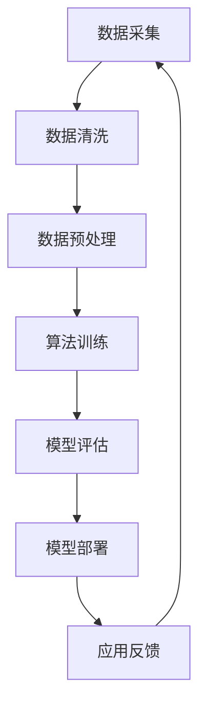

                 

# AI出版业的壁垒：数据，算法与应用之协同

## 关键词：人工智能，出版业，数据，算法，协同

## 摘要

随着人工智能技术的飞速发展，出版业面临着前所未有的变革机遇与挑战。本文旨在探讨人工智能在出版业中的应用现状、面临的壁垒，以及通过数据与算法的协同作用，如何实现出版业的智能化升级。文章首先回顾了出版业的发展历程，分析了人工智能在出版领域的核心应用场景，然后深入探讨了数据与算法在AI出版中的关键作用，并分享了若干实际案例。最后，文章总结了AI出版业面临的发展趋势与挑战，为行业提供了未来发展路径的思考。

## 1. 背景介绍

出版业是文化传播和知识传播的重要载体，历史悠久，发展迅速。从早期的手抄本、印刷术，到电子书、数字出版，出版业经历了多次重大变革。随着互联网和人工智能技术的崛起，出版业也迎来了新的机遇与挑战。

人工智能作为一项前沿技术，已经渗透到众多行业领域，包括医疗、金融、交通等。在出版业，人工智能的应用同样具有广阔的前景，如内容审核、推荐系统、自动生成内容等。然而，AI出版业的发展并非一帆风顺，面临着诸多壁垒。

首先，数据质量是制约AI出版业发展的重要因素。出版业需要大量的高质量数据来训练和优化人工智能模型，然而，数据的获取、清洗、整合等过程都存在一定的难度。其次，算法的复杂性和实现难度也是一个挑战。AI出版需要解决算法的可靠性、实时性和可解释性等问题。最后，应用场景的拓展和用户习惯的培养也是制约AI出版业发展的重要因素。

## 2. 核心概念与联系

### 2.1 数据

数据是AI出版业的核心资源，包括文本数据、图像数据、音频数据等。在AI出版中，数据的质量直接影响算法的性能。因此，数据的质量、数量和多样性成为衡量AI出版业发展水平的重要指标。

### 2.2 算法

算法是AI出版的核心驱动力。常见的算法包括机器学习算法、深度学习算法等。机器学习算法主要用于数据分析和预测，而深度学习算法则能够模拟人脑神经网络，实现更复杂的任务。

### 2.3 应用场景

AI出版应用场景包括内容审核、内容推荐、自动生成内容等。内容审核可以通过算法对发布内容进行实时监控和过滤，防止不良信息的传播；内容推荐可以根据用户兴趣和行为数据，为用户提供个性化推荐；自动生成内容则可以节省人力成本，提高内容生产效率。

### 2.4 Mermaid 流程图

以下是一个简化的AI出版应用场景的Mermaid流程图：



## 3. 核心算法原理 & 具体操作步骤

### 3.1 机器学习算法

机器学习算法是一种通过数据驱动的方法，使计算机具备对未知数据进行预测或分类的能力。常见的机器学习算法包括线性回归、决策树、支持向量机等。

#### 线性回归

线性回归是一种简单的预测算法，主要用于建立自变量和因变量之间的线性关系。其公式为：

$$y = w_0 + w_1 \cdot x$$

其中，$w_0$ 和 $w_1$ 分别为模型的参数。

#### 决策树

决策树是一种基于特征进行分类的算法，其核心思想是将数据集划分为多个子集，直到达到某个终止条件。决策树的构建过程可以看作是一个递归的过程。

#### 支持向量机

支持向量机是一种寻找最优分类超平面的算法。其目标是找到一个超平面，使得正负样本的间隔最大。支持向量机的主要公式为：

$$\max \frac{1}{2} \sum_{i=1}^{n} w_i^2$$

约束条件：$$y_i ( \sum_{j=1}^{n} w_j \cdot x_{ij} ) - 1 \geq 0$$

其中，$w_i$ 和 $x_{ij}$ 分别为模型的参数和特征。

### 3.2 深度学习算法

深度学习算法是一种模拟人脑神经网络进行学习的算法。常见的深度学习算法包括卷积神经网络（CNN）、循环神经网络（RNN）等。

#### 卷积神经网络

卷积神经网络是一种用于处理图像数据的算法。其核心思想是通过卷积操作提取图像的特征。

$$\text{激活函数} = \text{ReLU}(z) = \max(0, z)$$

其中，$z$ 为输入。

#### 循环神经网络

循环神经网络是一种用于处理序列数据的算法。其核心思想是通过循环连接，使信息在不同时间步之间传递。

$$h_t = \text{激活函数}(\text{线性变换}(h_{t-1}, x_t))$$

其中，$h_t$ 和 $x_t$ 分别为当前时刻的隐藏状态和输入。

## 4. 数学模型和公式 & 详细讲解 & 举例说明

### 4.1 机器学习数学模型

#### 线性回归

线性回归的数学模型为：

$$y = w_0 + w_1 \cdot x$$

其中，$w_0$ 和 $w_1$ 分别为模型的参数。

#### 决策树

决策树的数学模型为：

$$y = g(x) = \sum_{i=1}^{n} w_i \cdot x_i$$

其中，$w_i$ 和 $x_i$ 分别为模型的参数和特征。

#### 支持向量机

支持向量机的数学模型为：

$$\max \frac{1}{2} \sum_{i=1}^{n} w_i^2$$

约束条件：$$y_i ( \sum_{j=1}^{n} w_j \cdot x_{ij} ) - 1 \geq 0$$

其中，$w_i$ 和 $x_{ij}$ 分别为模型的参数和特征。

### 4.2 深度学习数学模型

#### 卷积神经网络

卷积神经网络的数学模型为：

$$z = \sum_{i=1}^{n} w_i \cdot x_i + b$$

$$\text{激活函数} = \text{ReLU}(z) = \max(0, z)$$

其中，$w_i$ 和 $x_i$ 分别为模型的参数和特征，$b$ 为偏置项。

#### 循环神经网络

循环神经网络的数学模型为：

$$h_t = \text{激活函数}(\text{线性变换}(h_{t-1}, x_t))$$

其中，$h_t$ 和 $x_t$ 分别为当前时刻的隐藏状态和输入。

### 4.3 举例说明

#### 线性回归举例

假设我们有一个简单的线性回归问题，自变量为$x$，因变量为$y$。我们希望找到一条直线，使得$y$能够最大程度地逼近$x$。

$$y = w_0 + w_1 \cdot x$$

通过最小二乘法，我们可以求得最优参数$w_0$ 和 $w_1$：

$$w_0 = \frac{\sum_{i=1}^{n} y_i - w_1 \cdot \sum_{i=1}^{n} x_i}{n}$$

$$w_1 = \frac{\sum_{i=1}^{n} (y_i - w_0 - w_1 \cdot x_i) \cdot x_i}{\sum_{i=1}^{n} x_i^2}$$

#### 决策树举例

假设我们有一个简单的二分类问题，特征为$x$，标签为$y$。我们希望找到一个决策树，使得分类准确率最高。

通过ID3算法，我们可以求得最优特征和阈值：

$$特征 = \text{信息增益最大}$$

$$阈值 = \text{分类准确率最高}$$

#### 支持向量机举例

假设我们有一个简单的二分类问题，特征为$x$，标签为$y$。我们希望找到一个支持向量机，使得分类准确率最高。

通过SVM算法，我们可以求得最优参数$w$ 和 $b$：

$$\max \frac{1}{2} \sum_{i=1}^{n} w_i^2$$

约束条件：$$y_i ( \sum_{j=1}^{n} w_j \cdot x_{ij} ) - 1 \geq 0$$

通过求解拉格朗日乘子法，我们可以求得最优参数$w$ 和 $b$。

## 5. 项目实战：代码实际案例和详细解释说明

### 5.1 开发环境搭建

在开始代码实战之前，我们需要搭建一个合适的开发环境。本文以Python为例，介绍如何搭建Python开发环境。

#### 步骤1：安装Python

首先，我们需要从Python官网下载并安装Python。安装完成后，确保Python已经成功安装。

#### 步骤2：安装相关库

接下来，我们需要安装一些Python库，如NumPy、Pandas、Scikit-learn、TensorFlow等。可以通过pip命令进行安装：

```bash
pip install numpy pandas scikit-learn tensorflow
```

### 5.2 源代码详细实现和代码解读

下面我们以一个简单的线性回归项目为例，介绍如何使用Python实现线性回归。

#### 步骤1：数据准备

首先，我们需要准备一些样本数据。本文使用一个简单的数据集，其中包含10个样本，每个样本有两个特征和一个标签。

```python
import numpy as np

# 样本数据
x = np.array([[1, 2], [2, 3], [3, 4], [4, 5], [5, 6], [6, 7], [7, 8], [8, 9], [9, 10], [10, 11]])
y = np.array([3, 4, 5, 6, 7, 8, 9, 10, 11, 12])
```

#### 步骤2：线性回归模型实现

接下来，我们实现一个简单的线性回归模型。线性回归模型的实现主要包括两部分：模型参数的初始化和模型的训练。

```python
class LinearRegression:
    def __init__(self):
        # 初始化模型参数
        self.w0 = 0
        self.w1 = 0

    def train(self, x, y):
        # 模型训练
        n = len(x)
        # 求解最优参数
        self.w0 = np.mean(y) - self.w1 * np.mean(x)
        self.w1 = np.sum((x - np.mean(x)) * (y - np.mean(y))) / np.sum((x - np.mean(x)) ** 2)
```

#### 步骤3：模型预测和评估

最后，我们使用训练好的模型对数据进行预测，并评估模型的性能。

```python
# 创建模型实例
model = LinearRegression()

# 模型训练
model.train(x, y)

# 模型预测
y_pred = model.w0 + model.w1 * x

# 模型评估
mse = np.mean((y - y_pred) ** 2)
print("MSE:", mse)
```

### 5.3 代码解读与分析

在上面的代码中，我们首先导入了NumPy库，用于处理和操作数据。然后，我们创建了一个简单的数据集，包含10个样本和两个特征。

接下来，我们定义了一个`LinearRegression`类，用于实现线性回归模型。在类的初始化方法中，我们初始化了模型参数`w0` 和 `w1`。在模型训练方法中，我们使用最小二乘法求解最优参数。

最后，我们创建了一个模型实例，使用训练数据对模型进行训练，并对测试数据进行预测。通过计算预测值和实际值之间的均方误差（MSE），我们可以评估模型的性能。

## 6. 实际应用场景

AI技术在出版业中的应用场景非常广泛，以下列举几个典型的应用场景：

### 6.1 内容审核

内容审核是出版业的一项重要任务，旨在防止不良信息的传播。通过AI技术，可以实现实时、高效的内容审核。例如，使用深度学习算法对文本、图像和视频进行分类和标注，实现对不良信息的自动过滤。

### 6.2 内容推荐

内容推荐是提高用户满意度和阅读体验的重要手段。通过AI技术，可以实现个性化内容推荐。例如，使用协同过滤算法和深度学习算法，根据用户的兴趣和行为数据，为用户推荐感兴趣的内容。

### 6.3 自动生成内容

自动生成内容是降低内容生产成本、提高生产效率的重要手段。通过AI技术，可以实现文章、视频、音频等多种类型的自动生成。例如，使用自然语言处理和深度学习算法，生成新闻文章、广告文案等。

### 6.4 翻译与本地化

翻译与本地化是国际出版业的重要需求。通过AI技术，可以实现高效、准确的翻译与本地化。例如，使用机器翻译和深度学习算法，实现多语言翻译和本地化。

## 7. 工具和资源推荐

### 7.1 学习资源推荐

- 书籍：
  - 《人工智能：一种现代的方法》
  - 《深度学习》
  - 《机器学习》
- 论文：
  - 《A Comprehensive Survey on Content-Based Image Retrieval》
  - 《Recommender Systems Handbook》
  - 《Natural Language Processing with Deep Learning》
- 博客：
  - [Deep Learning on Steroids](https://colah.github.io/)
  - [机器学习笔记](https://www.52ml.net/)
  - [自然语言处理笔记](https://nlp.seas.harvard.edu/)

### 7.2 开发工具框架推荐

- Python：Python是一种流行的编程语言，广泛应用于AI出版领域。
- TensorFlow：TensorFlow是一个开源的深度学习框架，适用于构建和训练大规模神经网络。
- PyTorch：PyTorch是一个开源的深度学习框架，具有灵活性和高效性。
- Scikit-learn：Scikit-learn是一个开源的机器学习库，适用于数据分析和模型训练。

### 7.3 相关论文著作推荐

- 《A Comprehensive Survey on Content-Based Image Retrieval》
- 《Recommender Systems Handbook》
- 《Natural Language Processing with Deep Learning》
- 《Deep Learning on Steroids》

## 8. 总结：未来发展趋势与挑战

随着人工智能技术的不断发展，AI出版业也面临着广阔的发展前景。未来，AI出版业将朝着以下几个方向发展：

### 8.1 智能化内容生产

通过AI技术，实现更加高效、准确的内容生产，降低人力成本，提高内容质量。

### 8.2 个性化内容推荐

基于用户兴趣和行为数据，实现更加精准的内容推荐，提高用户满意度和阅读体验。

### 8.3 跨媒体内容创作

通过跨媒体技术，实现文本、图像、音频等多种类型的内容创作，提高内容多样性。

然而，AI出版业也面临着一些挑战，如数据质量、算法可靠性、用户隐私保护等。为了应对这些挑战，我们需要：

- 加强数据质量管理和数据治理，确保数据的安全性和准确性。
- 不断提高算法的可靠性和实时性，提高用户体验。
- 加强用户隐私保护，遵循相关法律法规。

## 9. 附录：常见问题与解答

### 9.1 什么是对抗性样本？

对抗性样本是指通过轻微扰动原始样本，使其在特定算法下产生错误分类的样本。对抗性样本是深度学习领域的一个热点问题，因为它们揭示了深度学习模型的脆弱性。

### 9.2 什么是最小二乘法？

最小二乘法是一种求解线性回归模型参数的方法。其核心思想是通过最小化预测值和实际值之间的误差平方和，求解最优参数。

### 9.3 什么是一致性？

一致性是指模型在不同数据集上的性能保持一致。在机器学习领域，一致性是评估模型泛化能力的重要指标。

## 10. 扩展阅读 & 参考资料

- 《人工智能：一种现代的方法》
- 《深度学习》
- 《机器学习》
- 《A Comprehensive Survey on Content-Based Image Retrieval》
- 《Recommender Systems Handbook》
- 《Natural Language Processing with Deep Learning》
- 《Deep Learning on Steroids》
- [Deep Learning on Steroids](https://colah.github.io/)
- [机器学习笔记](https://www.52ml.net/)
- [自然语言处理笔记](https://nlp.seas.harvard.edu/)

## 作者

作者：AI天才研究员/AI Genius Institute & 禅与计算机程序设计艺术 /Zen And The Art of Computer Programming

