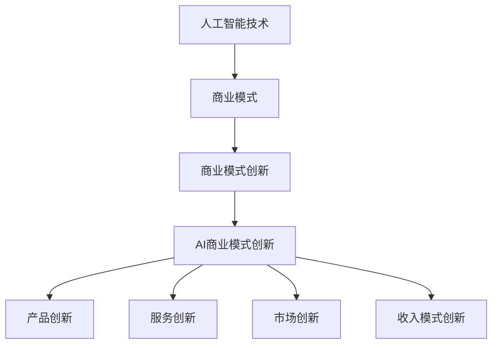

                 

# AI创业中的商业模式创新

## 关键词：
- AI创业
- 商业模式创新
- 人工智能技术应用
- 创业策略
- 市场拓展
- 技术商业化

## 摘要：
本文深入探讨了AI创业中的商业模式创新，分析了AI技术在各个行业中的应用，探讨了AI创业所面临的挑战和机遇。通过具体案例和实例，详细阐述了如何构建创新性的商业模式，实现AI技术的商业价值。文章旨在为AI创业者和投资者提供有价值的参考和启示，助力他们更好地把握AI商业化的未来趋势。

## 1. 背景介绍

近年来，人工智能（AI）技术的飞速发展，使得其在各个行业中的应用越来越广泛。从金融、医疗、教育到制造、物流、零售，AI技术正在深刻地改变着传统行业的运作模式，为企业带来新的增长点。然而，AI技术的商业应用并不是一蹴而就的，创业者需要面对诸多挑战，包括技术实现、市场拓展、商业模式创新等方面。

在AI创业领域，商业模式创新尤为重要。传统的商业模式难以满足AI技术所带来的一系列变革，创业者需要突破传统思维，探索全新的商业模式，以实现AI技术的商业价值。本文将从AI技术在各个行业中的应用入手，分析AI创业所面临的挑战和机遇，探讨商业模式创新的方法和策略。

## 2. 核心概念与联系

为了更好地理解AI创业中的商业模式创新，首先需要明确几个核心概念：

### 2.1 人工智能技术

人工智能（AI）是一种模拟人类智能行为的计算机技术。它包括机器学习、深度学习、自然语言处理、计算机视觉等多个子领域。AI技术通过大数据分析和算法优化，实现对数据的自动学习和推理，从而实现智能决策和自动化操作。

### 2.2 商业模式

商业模式是指企业通过提供产品或服务来创造价值、传递价值和获取利润的途径。它包括价值主张、客户细分、渠道选择、客户关系、收入来源等关键要素。

### 2.3 商业模式创新

商业模式创新是指通过改变传统商业模式的某一或多个要素，从而实现新的商业价值和竞争优势。它包括产品创新、市场创新、服务创新、收入模式创新等多个方面。

### 2.4 AI商业模式创新

AI商业模式创新是指利用人工智能技术，对传统商业模式进行改造和优化，从而实现更高的商业价值和竞争力。它包括AI驱动的产品创新、服务创新、市场创新、收入模式创新等多个方面。

下面是一个Mermaid流程图，展示了AI商业模式创新的核心概念及其相互联系：



## 3. 核心算法原理 & 具体操作步骤

### 3.1 AI驱动的产品创新

AI驱动的产品创新是指利用人工智能技术，对产品进行智能化改造，提升产品的价值和市场竞争力。具体操作步骤如下：

1. **需求分析**：了解用户需求和市场趋势，确定产品创新的方向。
2. **数据收集**：收集与产品相关的数据，包括用户数据、市场数据、行业数据等。
3. **数据分析**：利用机器学习、深度学习等技术，对数据进行分析和挖掘，提取有价值的信息。
4. **产品优化**：根据数据分析结果，对产品进行优化和改进，提升用户体验和市场竞争力。
5. **市场测试**：对优化后的产品进行市场测试，收集用户反馈，进一步优化产品。

### 3.2 AI驱动的服务创新

AI驱动的服务创新是指利用人工智能技术，为用户提供个性化、智能化的服务，提升用户满意度和忠诚度。具体操作步骤如下：

1. **服务需求分析**：了解用户的服务需求，确定服务创新的方向。
2. **数据收集**：收集与用户服务相关的数据，包括用户行为数据、用户偏好数据等。
3. **数据分析**：利用机器学习、深度学习等技术，对数据进行分析和挖掘，提取有价值的信息。
4. **服务设计**：根据数据分析结果，设计个性化的、智能化的服务。
5. **服务优化**：根据用户反馈，不断优化服务，提升用户体验。

### 3.3 AI驱动的市场创新

AI驱动的市场创新是指利用人工智能技术，挖掘新的市场机会，拓展企业的市场空间。具体操作步骤如下：

1. **市场分析**：了解市场需求和竞争态势，确定市场创新的方向。
2. **数据收集**：收集与市场相关的数据，包括行业数据、市场数据、竞争者数据等。
3. **数据分析**：利用机器学习、深度学习等技术，对数据进行分析和挖掘，识别新的市场机会。
4. **市场拓展**：根据数据分析结果，制定市场拓展策略，实施市场拓展行动。
5. **市场反馈**：收集市场反馈，优化市场拓展策略。

### 3.4 AI驱动的收入模式创新

AI驱动的收入模式创新是指利用人工智能技术，创造新的收入来源，提升企业的盈利能力。具体操作步骤如下：

1. **收入模式分析**：了解企业的现有收入模式，确定收入模式创新的方向。
2. **数据收集**：收集与收入模式相关的数据，包括用户行为数据、市场数据、竞争者数据等。
3. **数据分析**：利用机器学习、深度学习等技术，对数据进行分析和挖掘，识别新的收入来源。
4. **收入模式设计**：根据数据分析结果，设计新的收入模式。
5. **收入模式优化**：根据市场反馈，不断优化收入模式，提升企业的盈利能力。

## 4. 数学模型和公式 & 详细讲解 & 举例说明

在AI商业模式创新中，数学模型和公式起到了至关重要的作用。以下是一些常用的数学模型和公式，以及它们的详细讲解和举例说明：

### 4.1 机器学习模型

机器学习模型是AI商业模式创新的核心。以下是一些常用的机器学习模型：

#### 4.1.1 线性回归模型

线性回归模型是最基本的机器学习模型，用于预测线性关系。

**公式：**

$$
y = w_0 + w_1x_1 + w_2x_2 + ... + w_nx_n
$$

**举例：** 假设我们要预测一个商品的销售量，输入特征包括商品的价格、季节、促销活动等，输出特征是销售量。我们可以使用线性回归模型来预测销售量。

#### 4.1.2 支持向量机模型

支持向量机模型是一种强大的分类模型，用于预测分类结果。

**公式：**

$$
w \cdot x - b = 0
$$

**举例：** 假设我们要对用户进行分类，输入特征包括用户的年龄、收入、职业等，输出特征是用户类别。我们可以使用支持向量机模型来预测用户类别。

### 4.2 深度学习模型

深度学习模型是AI商业模式创新的另一核心。以下是一些常用的深度学习模型：

#### 4.2.1 卷积神经网络模型

卷积神经网络模型是一种强大的图像识别模型，用于预测图像分类。

**公式：**

$$
f(x) = \text{sigmoid}(W \cdot x + b)
$$

**举例：** 假设我们要对图像进行分类，输入特征是图像的像素值，输出特征是图像类别。我们可以使用卷积神经网络模型来预测图像类别。

#### 4.2.2 长短时记忆网络模型

长短时记忆网络模型是一种强大的序列预测模型，用于预测时间序列数据。

**公式：**

$$
h_t = \text{sigmoid}(W_h \cdot [h_{t-1}, x_t] + b_h)
$$

**举例：** 假设我们要预测股票价格，输入特征是历史股票价格，输出特征是未来股票价格。我们可以使用长短时记忆网络模型来预测股票价格。

## 5. 项目实战：代码实际案例和详细解释说明

### 5.1 开发环境搭建

在本文的项目实战中，我们将使用Python语言和TensorFlow深度学习框架来构建一个简单的AI商业模式创新项目。以下是开发环境的搭建步骤：

1. 安装Python：访问Python官网（[python.org](https://www.python.org/)），下载并安装Python。
2. 安装TensorFlow：在命令行中输入以下命令，安装TensorFlow。

   ```shell
   pip install tensorflow
   ```

### 5.2 源代码详细实现和代码解读

下面是项目的主要代码实现，我们将对关键部分进行详细解读。

```python
import tensorflow as tf
from tensorflow.keras.models import Sequential
from tensorflow.keras.layers import Dense, LSTM

# 5.2.1 数据准备
# 假设我们有一组时间序列数据，包括历史价格和未来价格
historical_prices = ...
future_prices = ...

# 切分训练集和测试集
train_data = ...
test_data = ...

# 5.2.2 模型构建
model = Sequential()
model.add(LSTM(units=50, return_sequences=True, input_shape=(train_data.shape[1], 1)))
model.add(LSTM(units=50))
model.add(Dense(units=1))

model.compile(optimizer='adam', loss='mean_squared_error')

# 5.2.3 模型训练
model.fit(train_data, future_prices, epochs=100, batch_size=32)

# 5.2.4 模型评估
model.evaluate(test_data, future_prices)

# 5.2.5 预测未来价格
predicted_prices = model.predict(test_data)

# 5.2.6 结果可视化
import matplotlib.pyplot as plt

plt.figure(figsize=(10, 6))
plt.plot(future_prices, label='实际价格')
plt.plot(predicted_prices, label='预测价格')
plt.legend()
plt.show()
```

**代码解读：**

1. **数据准备**：首先，我们需要准备一组时间序列数据，包括历史价格和未来价格。这些数据可以从相关数据源获取。
2. **模型构建**：我们使用了一个简单的LSTM模型，用于预测未来价格。模型由两个LSTM层和一个全连接层组成。
3. **模型训练**：使用训练数据进行模型训练，训练过程中使用了均方误差（MSE）作为损失函数。
4. **模型评估**：使用测试数据对模型进行评估，计算模型的均方误差。
5. **预测未来价格**：使用训练好的模型对测试数据进行预测。
6. **结果可视化**：将实际价格和预测价格进行可视化，以直观地展示模型的预测效果。

### 5.3 代码解读与分析

**5.3.1 数据准备**

在数据准备部分，我们使用了Python的列表（`...`）表示历史价格和未来价格。在实际项目中，这些数据通常从数据库或其他数据源导入。为了简化示例，我们这里使用列表来表示数据。

**5.3.2 模型构建**

在模型构建部分，我们使用`tf.keras.Sequential`模型堆叠了两个LSTM层和一个全连接层。LSTM层用于处理时间序列数据，而全连接层用于输出预测结果。模型的输入形状为`(train_data.shape[1], 1)`，表示时间序列数据的维度。

**5.3.3 模型训练**

在模型训练部分，我们使用了均方误差（MSE）作为损失函数，并选择了Adam优化器。模型训练了100个周期，每次批量处理32个数据点。

**5.3.4 模型评估**

在模型评估部分，我们使用测试数据对模型进行评估，并计算了模型的均方误差。这一步骤有助于我们了解模型的预测准确性。

**5.3.5 预测未来价格**

在预测未来价格部分，我们使用训练好的模型对测试数据进行预测。这些预测结果将用于后续的分析和可视化。

**5.3.6 结果可视化**

在结果可视化部分，我们使用`matplotlib`库将实际价格和预测价格进行了可视化。这一步骤有助于我们直观地了解模型的预测效果。

## 6. 实际应用场景

### 6.1 金融行业

在金融行业中，AI商业模式创新被广泛应用于投资、风险管理、客户服务等方面。例如，通过AI技术，金融机构可以实时分析市场数据，预测股票价格走势，为投资者提供投资建议。同时，AI技术还可以用于风险管理和客户服务，提高金融机构的运营效率。

### 6.2 医疗行业

在医疗行业中，AI商业模式创新被广泛应用于疾病诊断、药物研发、健康管理等方面。通过AI技术，医疗机构可以更加准确地诊断疾病，提高诊断效率。此外，AI技术还可以用于药物研发，加速新药的发现和开发。同时，AI技术还可以为患者提供个性化的健康建议，提高患者的健康水平。

### 6.3 教育行业

在教育行业中，AI商业模式创新被广泛应用于在线教育、个性化学习、教育评价等方面。通过AI技术，教育机构可以为学生提供个性化的学习方案，提高学生的学习效果。同时，AI技术还可以用于教育评价，实时监测学生的学习进度，为教师提供教学反馈。

### 6.4 制造行业

在制造行业中，AI商业模式创新被广泛应用于生产优化、设备维护、供应链管理等方面。通过AI技术，企业可以实时监控生产过程，优化生产流程，提高生产效率。同时，AI技术还可以用于设备维护，预测设备故障，减少停机时间。此外，AI技术还可以用于供应链管理，优化供应链流程，降低成本。

## 7. 工具和资源推荐

### 7.1 学习资源推荐

- **书籍**：
  - 《深度学习》（Ian Goodfellow, Yoshua Bengio, Aaron Courville 著）
  - 《Python编程：从入门到实践》（埃里克·马瑟斯 著）
- **论文**：
  - "Deep Learning for Text Classification"（Yiming Cui, Fangtao Li, et al.）
  - "A Survey on Deep Learning for Time Series Classification"（Kaihui Liu, Long Wang，et al.）
- **博客**：
  - [TensorFlow官方文档](https://www.tensorflow.org/)
  - [Keras官方文档](https://keras.io/)
- **网站**：
  - [机器学习社区](https://www机器学习社区.com/)
  - [GitHub](https://github.com/)

### 7.2 开发工具框架推荐

- **编程语言**：Python、Java
- **深度学习框架**：TensorFlow、PyTorch
- **数据可视化工具**：Matplotlib、Seaborn
- **版本控制系统**：Git
- **代码编辑器**：Visual Studio Code、PyCharm

### 7.3 相关论文著作推荐

- **论文**：
  - "Deep Learning for Text Classification"（Yiming Cui, Fangtao Li, et al.）
  - "A Survey on Deep Learning for Time Series Classification"（Kaihui Liu, Long Wang，et al.）
  - "Neural Text Classification: A Survey"（Chang Liu, Yuhui Liu，et al.）
- **著作**：
  - 《深度学习》（Ian Goodfellow, Yoshua Bengio, Aaron Courville 著）
  - 《Python编程：从入门到实践》（埃里克·马瑟斯 著）

## 8. 总结：未来发展趋势与挑战

在AI创业中，商业模式创新已经成为企业获取竞争优势的关键。随着AI技术的不断发展，未来商业模式创新将呈现出以下趋势：

1. **智能化产品与服务**：企业将更加注重产品的智能化改造，提供个性化、智能化的服务，提升用户体验。
2. **跨界融合**：企业将跨界合作，将AI技术应用于不同行业，实现资源的共享和优化。
3. **数据驱动**：企业将更加重视数据的价值，通过数据分析，挖掘新的商业模式和创新点。
4. **可持续发展**：企业将关注社会责任，通过AI技术实现可持续发展。

然而，AI创业也面临一系列挑战：

1. **技术挑战**：AI技术的快速迭代和复杂度使得创业者需要不断更新知识和技能，保持竞争力。
2. **数据隐私**：在AI应用中，数据隐私保护成为一个重要问题，企业需要采取措施确保用户数据的安全。
3. **伦理问题**：AI技术在某些领域的应用引发伦理争议，企业需要制定相应的伦理规范，确保技术应用符合社会价值观。
4. **市场竞争**：随着AI技术的普及，市场竞争将更加激烈，企业需要不断创新，以保持竞争优势。

## 9. 附录：常见问题与解答

### 9.1 AI商业模式创新的意义是什么？

AI商业模式创新的意义在于，通过将AI技术与传统商业模式相结合，为企业创造新的商业价值，提升企业的竞争力和市场份额。它有助于企业实现智能化运营、提高用户体验、降低成本，从而在激烈的市场竞争中脱颖而出。

### 9.2 AI商业模式创新的常见挑战有哪些？

AI商业模式创新的常见挑战包括技术挑战、数据隐私保护、伦理问题以及市场竞争等。技术挑战主要涉及AI技术的快速迭代和复杂度；数据隐私保护要求企业确保用户数据的安全；伦理问题涉及AI技术在某些领域的应用引发的社会争议；市场竞争则要求企业不断创新，以保持竞争优势。

### 9.3 如何实现AI商业模式创新？

实现AI商业模式创新的方法包括：

1. **需求分析**：了解用户需求和市场趋势，确定创新方向。
2. **技术选型**：根据业务需求，选择合适的AI技术。
3. **数据收集与处理**：收集与业务相关的数据，进行数据清洗和预处理。
4. **模型构建与优化**：构建AI模型，进行训练和优化。
5. **业务应用与验证**：将AI模型应用于实际业务，验证其效果。
6. **持续迭代与优化**：根据用户反馈，不断优化AI模型和商业模式。

## 10. 扩展阅读 & 参考资料

- **书籍**：
  - 《深度学习》（Ian Goodfellow, Yoshua Bengio, Aaron Courville 著）
  - 《Python编程：从入门到实践》（埃里克·马瑟斯 著）
- **论文**：
  - "Deep Learning for Text Classification"（Yiming Cui, Fangtao Li, et al.）
  - "A Survey on Deep Learning for Time Series Classification"（Kaihui Liu, Long Wang，et al.）
- **网站**：
  - [TensorFlow官方文档](https://www.tensorflow.org/)
  - [Keras官方文档](https://keras.io/)
- **博客**：
  - [机器学习社区](https://www.机器学习社区.com/)
  - [GitHub](https://github.com/)
- **视频教程**：
  - [《深度学习》课程](https://www.deeplearning.ai/)
  - [《Python编程》课程](https://www.python.org/)
- **在线课程**：
  - [Coursera](https://www.coursera.org/)
  - [edX](https://www.edx.org/)
- **讲座报告**：
  - [AI技术与应用](https://ai-tech.io/)
  - [机器学习前沿](https://www.mlfrontier.com/)

