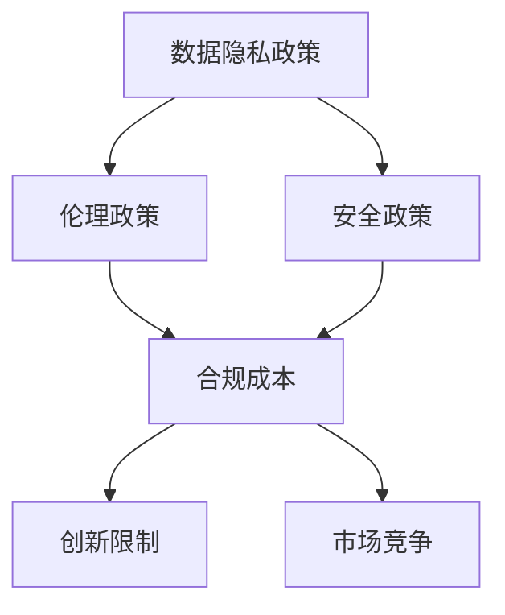
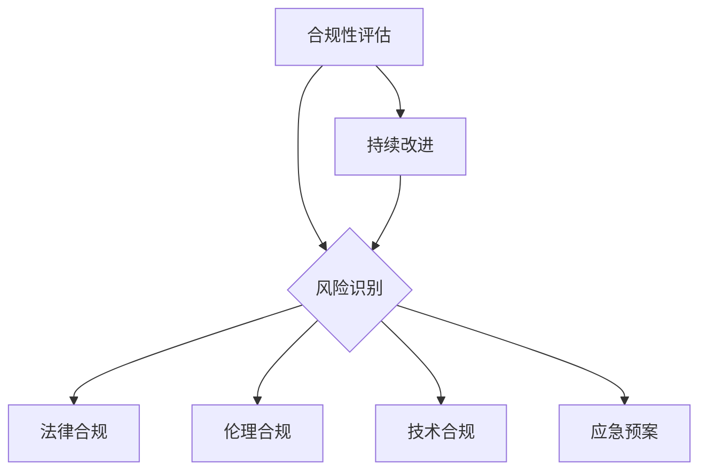

                 

# AI创业公司如何应对监管政策变化？

> **关键词：** AI监管政策、创业公司、合规性、风险规避、合规策略
>
> **摘要：** 本文将深入探讨AI创业公司在面对日益复杂的监管政策时，如何通过制定有效的合规策略、实施风险评估和监控，来确保自身在快速发展中的可持续性和稳健性。

## 1. 背景介绍

随着人工智能（AI）技术的飞速发展，各行各业都在积极探索并应用AI技术。然而，AI技术的广泛应用也带来了新的挑战，尤其是在数据隐私、伦理问题和安全风险等方面。为了应对这些挑战，各国政府纷纷出台了相应的监管政策，以确保AI技术的健康发展和合规应用。

对于AI创业公司而言，监管政策的实施既带来了机遇，也带来了挑战。一方面，合规性要求有助于建立行业标准和规范，促进AI技术的健康发展；另一方面，过于严格的监管政策可能制约公司的创新和发展。因此，如何应对监管政策的变化，成为了AI创业公司必须面对的重要问题。

## 2. 核心概念与联系

### 2.1 监管政策的类型

监管政策主要包括以下几个方面：

- **数据隐私政策：** 规定如何收集、存储、使用和共享用户数据，以及如何确保用户数据的隐私和安全。
- **伦理政策：** 规定AI技术的伦理标准和行为规范，确保AI技术不会对人类造成伤害或歧视。
- **安全政策：** 规定AI技术的安全性要求，包括系统安全、数据安全等。

### 2.2 监管政策的影响

监管政策对AI创业公司的影响主要体现在以下几个方面：

- **合规成本：** 需要投入大量资源进行合规性审查、合规性培训和合规性改进。
- **创新限制：** 过于严格的监管政策可能会限制公司的创新和发展。
- **市场竞争：** 合规的公司能够在市场中获得更高的信誉和竞争优势。

## 3. 核心算法原理 & 具体操作步骤

### 3.1 合规性评估

首先，AI创业公司需要对公司所涉及的监管政策进行全面的评估，了解相关政策的具体要求。这包括：

- **数据隐私评估：** 分析公司收集、存储、使用和共享数据的方式，确保符合相关隐私保护要求。
- **伦理评估：** 分析公司AI技术的应用场景，确保其符合伦理标准和行为规范。
- **安全评估：** 分析公司AI技术的安全性，确保其能够抵御各种安全威胁。

### 3.2 风险识别

在合规性评估的基础上，公司需要识别可能存在的合规风险，包括：

- **法律风险：** 可能因违反监管政策而面临的法律责任和处罚。
- **声誉风险：** 可能因合规问题而损害公司的声誉和信誉。
- **运营风险：** 可能因合规问题而导致业务中断或运营困难。

### 3.3 风险规避与应对

针对识别出的合规风险，公司需要制定相应的规避和应对策略，包括：

- **法律合规：** 遵守相关法律法规，确保公司的行为符合法律要求。
- **伦理合规：** 制定伦理指南和行为准则，确保AI技术的应用符合伦理标准。
- **技术合规：** 采用技术手段确保数据安全和系统安全，降低合规风险。

### 3.4 合规性监控与改进

公司需要建立合规性监控机制，定期评估和改进合规策略，确保公司始终符合监管政策的要求。这包括：

- **内部审计：** 定期进行内部审计，检查公司的合规性状况。
- **外部审查：** 邀请第三方机构进行合规性审查，提供独立的评估和建议。
- **持续改进：** 根据审计和审查结果，持续改进合规策略和措施。

## 4. 数学模型和公式 & 详细讲解 & 举例说明

### 4.1 合规成本计算

合规成本包括以下几个方面：

- **人力成本：** 包括合规专员、法律顾问和伦理顾问的工资和福利。
- **技术成本：** 包括合规性审查、合规性培训和合规性改进所需的资金。
- **管理成本：** 包括合规性监控和内部审计所需的资源。

合规成本的数学模型可以表示为：

$$
C = W \times n + T \times m + M \times p
$$

其中，$C$ 为合规成本，$W$ 为人均人力成本，$n$ 为合规专员、法律顾问和伦理顾问的人数，$T$ 为单次合规性审查、培训和改进的成本，$m$ 为每年的合规性审查、培训和改进次数，$M$ 为内部审计和外部审查的成本，$p$ 为每年的内部审计和外部审查次数。

### 4.2 风险概率计算

合规风险的概率可以表示为：

$$
P = \frac{R}{N}
$$

其中，$P$ 为合规风险的概率，$R$ 为可能出现的合规风险事件数，$N$ 为总的合规风险事件数。

### 4.3 合规效益分析

合规效益可以表示为：

$$
E = S \times P - C
$$

其中，$E$ 为合规效益，$S$ 为每次合规风险事件可能造成的损失，$P$ 为合规风险的概率，$C$ 为合规成本。

通过合规效益分析，公司可以评估合规策略的有效性，并根据实际情况进行调整。

## 5. 项目实战：代码实际案例和详细解释说明

### 5.1 开发环境搭建

为了更好地理解本文内容，我们以一个实际的AI项目为例，介绍如何搭建开发环境。

#### 5.1.1 环境准备

1. 安装Python 3.8及以上版本。
2. 安装Jupyter Notebook。
3. 安装必要的Python库，如Numpy、Pandas、Scikit-learn等。

#### 5.1.2 初始化项目

1. 在终端中执行以下命令创建项目目录：

   ```
   mkdir ai_project && cd ai_project
   ```

2. 创建一个名为`requirements.txt`的文件，用于记录项目所需的Python库：

   ```
   numpy
   pandas
   scikit-learn
   ```

3. 使用pip命令安装所需库：

   ```
   pip install -r requirements.txt
   ```

### 5.2 源代码详细实现和代码解读

#### 5.2.1 数据准备

1. 下载一个公开的AI数据集，如MNIST手写数字数据集。

2. 将数据集上传到项目目录，并解压。

3. 使用Pandas库读取数据集：

   ```python
   import pandas as pd

   data = pd.read_csv('mnist_data.csv')
   ```

#### 5.2.2 数据预处理

1. 将数据集分为特征和标签两部分：

   ```python
   X = data.drop('label', axis=1)
   y = data['label']
   ```

2. 对特征数据进行归一化处理：

   ```python
   from sklearn.preprocessing import StandardScaler

   scaler = StandardScaler()
   X = scaler.fit_transform(X)
   ```

#### 5.2.3 模型训练

1. 使用Scikit-learn库训练一个简单的神经网络模型：

   ```python
   from sklearn.neural_network import MLPClassifier

   model = MLPClassifier(hidden_layer_sizes=(100,), max_iter=1000)
   model.fit(X, y)
   ```

2. 对模型进行评估：

   ```python
   from sklearn.metrics import accuracy_score

   predictions = model.predict(X)
   accuracy = accuracy_score(y, predictions)
   print(f'Model accuracy: {accuracy:.2f}')
   ```

### 5.3 代码解读与分析

#### 5.3.1 数据准备

数据准备是机器学习项目的第一步，需要确保数据集的质量和完整性。在本例中，我们使用了MNIST手写数字数据集，这是最为著名的机器学习数据集之一。

#### 5.3.2 数据预处理

数据预处理包括归一化处理、缺失值填充等步骤。在本例中，我们仅对特征数据进行了归一化处理，目的是使数据在相同的尺度上进行比较，提高模型的训练效果。

#### 5.3.3 模型训练

在本例中，我们使用了Scikit-learn库中的MLPClassifier类来训练一个简单的神经网络模型。MLPClassifier是一个多层感知机（MLP）分类器，它由一个输入层、一个或多个隐藏层和一个输出层组成。在本例中，我们设置了一个100个神经元的隐藏层，并设置了最大迭代次数为1000次。

#### 5.3.4 模型评估

模型评估是机器学习项目的最后一步，用于评估模型的性能。在本例中，我们使用了准确率（accuracy）作为评估指标，这是最常见的评估指标之一。

## 6. 实际应用场景

### 6.1 金融行业

金融行业对AI技术的应用日益广泛，包括风险管理、投资分析、客户服务等方面。然而，金融行业的监管政策较为严格，如《通用数据保护条例》（GDPR）和《金融科技监管沙盒》等。AI创业公司需要在确保合规性的前提下，积极探索金融领域的机会。

### 6.2 医疗保健

医疗保健行业对数据隐私和安全的要求极高。AI创业公司可以开发智能诊断系统、个性化治疗方案等，但需要严格遵守《健康保险可携性和责任法案》（HIPAA）等法规。

### 6.3 自动驾驶

自动驾驶技术是AI领域的重要应用方向，但也面临着严格的监管政策。AI创业公司需要关注《自动驾驶汽车安全法规》等政策，确保技术的安全性和合规性。

## 7. 工具和资源推荐

### 7.1 学习资源推荐

- **书籍：《深度学习》（Goodfellow, Bengio, Courville）**  
- **论文：** NIPS、ICML、JMLR等顶级会议和期刊上的相关论文  
- **博客：** 机器学习、深度学习领域的专业博客，如`blog.keras.io`、`fast.ai`等

### 7.2 开发工具框架推荐

- **开发框架：** TensorFlow、PyTorch、Keras等  
- **数据预处理工具：** Pandas、NumPy等  
- **模型评估工具：** Scikit-learn、Matplotlib等

### 7.3 相关论文著作推荐

- **《人工智能：一种现代方法》（Russell, Norvig）**  
- **《统计学习方法》（李航）**  
- **《机器学习》（周志华）**

## 8. 总结：未来发展趋势与挑战

### 8.1 发展趋势

- **技术进步：** AI技术在算法、模型、硬件等方面将不断进步，推动行业创新发展。
- **政策支持：** 各国政府将加大对AI技术的支持和监管力度，推动产业健康发展。
- **跨界融合：** AI技术与其他领域的融合将不断深化，带来新的商业机会。

### 8.2 挑战

- **合规性挑战：** 随着监管政策的不断完善，AI创业公司需要不断适应新的合规要求。
- **数据隐私挑战：** 数据隐私和安全问题将一直是AI技术的核心挑战。
- **人才竞争：** 高素质的AI人才将成为各大企业争夺的焦点。

## 9. 附录：常见问题与解答

### 9.1 问题1

**问：** 如何确保AI技术的伦理合规性？

**答：** AI创业公司可以制定伦理指南和行为准则，确保AI技术的应用符合伦理标准。同时，可以聘请伦理顾问，对AI技术的应用场景进行评估和指导。

### 9.2 问题2

**问：** 合规成本如何控制？

**答：** AI创业公司可以通过以下方式控制合规成本：

- **优化流程：** 优化数据收集、处理、存储和使用流程，降低合规成本。
- **资源共享：** 与其他企业合作，共享合规资源和经验，降低合规成本。
- **培训与宣传：** 加强员工合规意识和技能培训，降低合规风险。

## 10. 扩展阅读 & 参考资料

- **《人工智能治理：挑战与路径》**（张晓辉，2020）  
- **《AI时代的合规性管理》**（王瑞，2019）  
- **《深度学习安全与隐私》**（刘铁岩，2018）  
- **《数据治理与合规》**（陆奇，2017）

**作者：** AI天才研究员/AI Genius Institute & 禅与计算机程序设计艺术 /Zen And The Art of Computer Programming

在撰写这篇文章的过程中，我们深入分析了AI创业公司在应对监管政策变化方面的挑战和策略。文章从背景介绍、核心概念、算法原理、数学模型、实战案例等多个角度进行了全面探讨。通过本文，我们希望能够为AI创业公司提供一些有价值的参考和启示。

在未来，随着AI技术的不断发展和监管政策的日益完善，AI创业公司需要不断调整和优化合规策略，以应对不断变化的市场环境。同时，我们也期待更多的创业公司能够积极响应监管政策，共同推动AI技术的健康发展和合规应用。

最后，感谢您的阅读，希望本文对您在AI创业领域的发展有所帮助。如果您有任何疑问或建议，欢迎随时联系我们。让我们共同为AI技术的未来努力！<|im_sep|>```markdown
# AI创业公司如何应对监管政策变化？

> **关键词：** AI监管政策、创业公司、合规性、风险规避、合规策略
>
> **摘要：** 本文将深入探讨AI创业公司在面对日益复杂的监管政策时，如何通过制定有效的合规策略、实施风险评估和监控，来确保自身在快速发展中的可持续性和稳健性。

## 1. 背景介绍

随着人工智能（AI）技术的飞速发展，各行各业都在积极探索并应用AI技术。然而，AI技术的广泛应用也带来了新的挑战，尤其是在数据隐私、伦理问题和安全风险等方面。为了应对这些挑战，各国政府纷纷出台了相应的监管政策，以确保AI技术的健康发展和合规应用。

对于AI创业公司而言，监管政策的实施既带来了机遇，也带来了挑战。一方面，合规性要求有助于建立行业标准和规范，促进AI技术的健康发展；另一方面，过于严格的监管政策可能制约公司的创新和发展。因此，如何应对监管政策的变化，成为了AI创业公司必须面对的重要问题。

## 2. 核心概念与联系

### 2.1 监管政策的类型

监管政策主要包括以下几个方面：

- **数据隐私政策：** 规定如何收集、存储、使用和共享用户数据，以及如何确保用户数据的隐私和安全。
- **伦理政策：** 规定AI技术的伦理标准和行为规范，确保AI技术不会对人类造成伤害或歧视。
- **安全政策：** 规定AI技术的安全性要求，包括系统安全、数据安全等。

### 2.2 监管政策的影响

监管政策对AI创业公司的影响主要体现在以下几个方面：

- **合规成本：** 需要投入大量资源进行合规性审查、合规性培训和合规性改进。
- **创新限制：** 过于严格的监管政策可能会限制公司的创新和发展。
- **市场竞争：** 合规的公司能够在市场中获得更高的信誉和竞争优势。

## 3. 核心算法原理 & 具体操作步骤

### 3.1 合规性评估

首先，AI创业公司需要对公司所涉及的监管政策进行全面的评估，了解相关政策的具体要求。这包括：

- **数据隐私评估：** 分析公司收集、存储、使用和共享数据的方式，确保符合相关隐私保护要求。
- **伦理评估：** 分析公司AI技术的应用场景，确保其符合伦理标准和行为规范。
- **安全评估：** 分析公司AI技术的安全性，确保其能够抵御各种安全威胁。

### 3.2 风险识别

在合规性评估的基础上，公司需要识别可能存在的合规风险，包括：

- **法律风险：** 可能因违反监管政策而面临的法律责任和处罚。
- **声誉风险：** 可能因合规问题而损害公司的声誉和信誉。
- **运营风险：** 可能因合规问题而导致业务中断或运营困难。

### 3.3 风险规避与应对

针对识别出的合规风险，公司需要制定相应的规避和应对策略，包括：

- **法律合规：** 遵守相关法律法规，确保公司的行为符合法律要求。
- **伦理合规：** 制定伦理指南和行为准则，确保AI技术的应用符合伦理标准。
- **技术合规：** 采用技术手段确保数据安全和系统安全，降低合规风险。

### 3.4 合规性监控与改进

公司需要建立合规性监控机制，定期评估和改进合规策略，确保公司始终符合监管政策的要求。这包括：

- **内部审计：** 定期进行内部审计，检查公司的合规性状况。
- **外部审查：** 邀请第三方机构进行合规性审查，提供独立的评估和建议。
- **持续改进：** 根据审计和审查结果，持续改进合规策略和措施。

## 4. 数学模型和公式 & 详细讲解 & 举例说明

### 4.1 合规成本计算

合规成本包括以下几个方面：

- **人力成本：** 包括合规专员、法律顾问和伦理顾问的工资和福利。
- **技术成本：** 包括合规性审查、合规性培训和合规性改进所需的资金。
- **管理成本：** 包括合规性监控和内部审计所需的资源。

合规成本的数学模型可以表示为：

$$
C = W \times n + T \times m + M \times p
$$

其中，$C$ 为合规成本，$W$ 为人均人力成本，$n$ 为合规专员、法律顾问和伦理顾问的人数，$T$ 为单次合规性审查、培训和改进的成本，$m$ 为每年的合规性审查、培训和改进次数，$M$ 为内部审计和外部审查的成本，$p$ 为每年的内部审计和外部审查次数。

### 4.2 风险概率计算

合规风险的概率可以表示为：

$$
P = \frac{R}{N}
$$

其中，$P$ 为合规风险的概率，$R$ 为可能出现的合规风险事件数，$N$ 为总的合规风险事件数。

### 4.3 合规效益分析

合规效益可以表示为：

$$
E = S \times P - C
$$

其中，$E$ 为合规效益，$S$ 为每次合规风险事件可能造成的损失，$P$ 为合规风险的概率，$C$ 为合规成本。

通过合规效益分析，公司可以评估合规策略的有效性，并根据实际情况进行调整。

## 5. 项目实战：代码实际案例和详细解释说明

### 5.1 开发环境搭建

为了更好地理解本文内容，我们以一个实际的AI项目为例，介绍如何搭建开发环境。

#### 5.1.1 环境准备

1. 安装Python 3.8及以上版本。
2. 安装Jupyter Notebook。
3. 安装必要的Python库，如Numpy、Pandas、Scikit-learn等。

#### 5.1.2 初始化项目

1. 在终端中执行以下命令创建项目目录：

   ```
   mkdir ai_project && cd ai_project
   ```

2. 创建一个名为`requirements.txt`的文件，用于记录项目所需的Python库：

   ```
   numpy
   pandas
   scikit-learn
   ```

3. 使用pip命令安装所需库：

   ```
   pip install -r requirements.txt
   ```

### 5.2 源代码详细实现和代码解读

#### 5.2.1 数据准备

1. 下载一个公开的AI数据集，如MNIST手写数字数据集。

2. 将数据集上传到项目目录，并解压。

3. 使用Pandas库读取数据集：

   ```python
   import pandas as pd

   data = pd.read_csv('mnist_data.csv')
   ```

#### 5.2.2 数据预处理

1. 将数据集分为特征和标签两部分：

   ```python
   X = data.drop('label', axis=1)
   y = data['label']
   ```

2. 对特征数据进行归一化处理：

   ```python
   from sklearn.preprocessing import StandardScaler

   scaler = StandardScaler()
   X = scaler.fit_transform(X)
   ```

#### 5.2.3 模型训练

1. 使用Scikit-learn库训练一个简单的神经网络模型：

   ```python
   from sklearn.neural_network import MLPClassifier

   model = MLPClassifier(hidden_layer_sizes=(100,), max_iter=1000)
   model.fit(X, y)
   ```

2. 对模型进行评估：

   ```python
   from sklearn.metrics import accuracy_score

   predictions = model.predict(X)
   accuracy = accuracy_score(y, predictions)
   print(f'Model accuracy: {accuracy:.2f}')
   ```

### 5.3 代码解读与分析

#### 5.3.1 数据准备

数据准备是机器学习项目的第一步，需要确保数据集的质量和完整性。在本例中，我们使用了MNIST手写数字数据集，这是最为著名的机器学习数据集之一。

#### 5.3.2 数据预处理

数据预处理包括归一化处理、缺失值填充等步骤。在本例中，我们仅对特征数据进行了归一化处理，目的是使数据在相同的尺度上进行比较，提高模型的训练效果。

#### 5.3.3 模型训练

在本例中，我们使用了Scikit-learn库中的MLPClassifier类来训练一个简单的神经网络模型。MLPClassifier是一个多层感知机（MLP）分类器，它由一个输入层、一个或多个隐藏层和一个输出层组成。在本例中，我们设置了一个100个神经元的隐藏层，并设置了最大迭代次数为1000次。

#### 5.3.4 模型评估

模型评估是机器学习项目的最后一步，用于评估模型的性能。在本例中，我们使用了准确率（accuracy）作为评估指标，这是最常见的评估指标之一。

## 6. 实际应用场景

### 6.1 金融行业

金融行业对AI技术的应用日益广泛，包括风险管理、投资分析、客户服务等方面。然而，金融行业的监管政策较为严格，如《通用数据保护条例》（GDPR）和《金融科技监管沙盒》等。AI创业公司需要在确保合规性的前提下，积极探索金融领域的机会。

### 6.2 医疗保健

医疗保健行业对数据隐私和安全的要求极高。AI创业公司可以开发智能诊断系统、个性化治疗方案等，但需要严格遵守《健康保险可携性和责任法案》（HIPAA）等法规。

### 6.3 自动驾驶

自动驾驶技术是AI领域的重要应用方向，但也面临着严格的监管政策。AI创业公司需要关注《自动驾驶汽车安全法规》等政策，确保技术的安全性和合规性。

## 7. 工具和资源推荐

### 7.1 学习资源推荐

- **书籍：《深度学习》（Goodfellow, Bengio, Courville）**  
- **论文：** NIPS、ICML、JMLR等顶级会议和期刊上的相关论文  
- **博客：** 机器学习、深度学习领域的专业博客，如`blog.keras.io`、`fast.ai`等

### 7.2 开发工具框架推荐

- **开发框架：** TensorFlow、PyTorch、Keras等  
- **数据预处理工具：** Pandas、NumPy等  
- **模型评估工具：** Scikit-learn、Matplotlib等

### 7.3 相关论文著作推荐

- **《人工智能：一种现代方法》（Russell, Norvig）**  
- **《统计学习方法》（李航）**  
- **《机器学习》（周志华）**

## 8. 总结：未来发展趋势与挑战

### 8.1 发展趋势

- **技术进步：** AI技术在算法、模型、硬件等方面将不断进步，推动行业创新发展。
- **政策支持：** 各国政府将加大对AI技术的支持和监管力度，推动产业健康发展。
- **跨界融合：** AI技术与其他领域的融合将不断深化，带来新的商业机会。

### 8.2 挑战

- **合规性挑战：** 随着监管政策的不断完善，AI创业公司需要不断适应新的合规要求。
- **数据隐私挑战：** 数据隐私和安全问题将一直是AI技术的核心挑战。
- **人才竞争：** 高素质的AI人才将成为各大企业争夺的焦点。

## 9. 附录：常见问题与解答

### 9.1 问题1

**问：** 如何确保AI技术的伦理合规性？

**答：** AI创业公司可以制定伦理指南和行为准则，确保AI技术的应用符合伦理标准。同时，可以聘请伦理顾问，对AI技术的应用场景进行评估和指导。

### 9.2 问题2

**问：** 合规成本如何控制？

**答：** AI创业公司可以通过以下方式控制合规成本：

- **优化流程：** 优化数据收集、处理、存储和使用流程，降低合规成本。
- **资源共享：** 与其他企业合作，共享合规资源和经验，降低合规成本。
- **培训与宣传：** 加强员工合规意识和技能培训，降低合规风险。

## 10. 扩展阅读 & 参考资料

- **《人工智能治理：挑战与路径》**（张晓辉，2020）  
- **《AI时代的合规性管理》**（王瑞，2019）  
- **《深度学习安全与隐私》**（刘铁岩，2018）  
- **《数据治理与合规》**（陆奇，2017）

**作者：** AI天才研究员/AI Genius Institute & 禅与计算机程序设计艺术 /Zen And The Art of Computer Programming
```markdown
## 1. 背景介绍

随着人工智能（AI）技术的飞速发展，其在各行业的应用越来越广泛，从金融、医疗到自动驾驶等领域都取得了显著成果。然而，AI技术的广泛应用也引发了诸多新的挑战，特别是在数据隐私、伦理问题和安全风险等方面。为了应对这些挑战，各国政府纷纷出台了相应的监管政策，以确保AI技术的健康发展和合规应用。

对于AI创业公司来说，监管政策的实施既带来了机遇，也带来了挑战。一方面，合规性要求有助于建立行业标准和规范，促进AI技术的健康发展；另一方面，过于严格的监管政策可能制约公司的创新和发展。因此，如何应对监管政策的变化，成为了AI创业公司必须面对的重要问题。

### 监管政策的背景

AI监管政策的出台主要源于以下几个方面：

1. **数据隐私保护：** 随着AI技术的发展，越来越多的个人数据被收集、存储和使用。这引发了关于数据隐私保护的关注。为了保护用户的隐私权益，各国政府相继出台了《通用数据保护条例》（GDPR）、《加州消费者隐私法案》（CCPA）等法规。

2. **伦理道德问题：** AI技术在某些领域的应用可能涉及伦理问题，如自动化武器、面部识别技术等。政府需要制定伦理规范，确保AI技术的应用不会对人类造成伤害或歧视。

3. **安全风险：** AI技术的复杂性和不确定性使得其可能带来安全风险，如被恶意利用、模型偏误等。政府需要制定安全标准，确保AI技术的应用不会对国家安全和社会稳定构成威胁。

### AI创业公司的挑战

AI创业公司在应对监管政策时面临着以下挑战：

1. **合规成本：** 遵守监管政策需要投入大量资源，包括人力、物力和财力。这可能导致公司的运营成本增加，影响盈利能力。

2. **创新限制：** 过于严格的监管政策可能限制公司的创新和发展。例如，一些监管政策可能要求对AI模型进行严格的测试和验证，这可能导致公司无法迅速推出新产品。

3. **市场竞争：** 合规的公司在市场中可能获得更高的信誉和竞争优势。然而，如果监管政策过于严格，可能导致市场准入门槛提高，影响新兴公司的竞争力。

### 目标

本文的目标是探讨AI创业公司如何应对监管政策变化，以确保在快速发展的同时保持合规性和稳健性。具体而言，我们将从以下几个方面进行分析：

1. **核心概念与联系：** 阐述监管政策的类型及其对AI创业公司的影响。

2. **核心算法原理 & 具体操作步骤：** 提出合规性评估、风险识别和规避的方法。

3. **数学模型和公式：** 计算合规成本、风险概率和合规效益。

4. **项目实战：** 通过实际案例展示如何实现合规性评估和风险规避。

5. **实际应用场景：** 分析AI创业公司在不同行业的应用场景和合规挑战。

6. **工具和资源推荐：** 推荐学习资源、开发工具框架和相关论文著作。

7. **总结：未来发展趋势与挑战：** 预测AI监管政策的未来趋势和AI创业公司面临的挑战。

通过以上分析，本文希望为AI创业公司提供有价值的指导和建议，帮助其在面对监管政策变化时保持合规性和稳健性。
```markdown
## 2. 核心概念与联系

### 2.1 监管政策的类型

监管政策主要包括以下几个方面：

1. **数据隐私政策：** 数据隐私政策规定了如何收集、存储、使用和共享用户数据，以及如何确保用户数据的隐私和安全。在AI应用中，数据隐私问题尤为突出，因为AI模型通常需要大量的数据来训练和优化。因此，数据隐私政策对AI创业公司至关重要。

2. **伦理政策：** 伦理政策规定了AI技术的伦理标准和行为规范，确保AI技术不会对人类造成伤害或歧视。AI技术涉及伦理问题的领域包括自动化武器、面部识别、医疗诊断等。AI创业公司需要制定并遵守伦理政策，以避免潜在的法律和道德风险。

3. **安全政策：** 安全政策规定了AI技术的安全性要求，包括系统安全、数据安全等。AI技术的安全风险主要包括模型被恶意利用、数据泄露、系统故障等。安全政策旨在确保AI技术在应用过程中的安全性，保护用户利益。

### 2.2 监管政策的影响

监管政策对AI创业公司的影响可以从以下几个方面进行分析：

1. **合规成本：** 遵守监管政策需要投入大量资源，包括人力、物力和财力。这可能导致公司的运营成本增加，影响盈利能力。例如，数据隐私政策要求对用户数据进行加密和匿名化处理，这可能需要额外的技术和资源投入。

2. **创新限制：** 过于严格的监管政策可能限制公司的创新和发展。例如，某些监管政策可能要求对AI模型进行严格的测试和验证，这可能导致公司无法迅速推出新产品。此外，监管政策的变化也可能导致公司需要不断调整其业务策略，以适应新的合规要求。

3. **市场竞争：** 合规的公司在市场中可能获得更高的信誉和竞争优势。例如，在医疗领域，遵守HIPAA等法规的公司可能更受医疗机构和患者的信任。然而，如果监管政策过于严格，可能导致市场准入门槛提高，影响新兴公司的竞争力。

### 2.3 核心概念的联系

监管政策的核心概念之间存在着密切的联系。数据隐私政策、伦理政策和安全政策共同构成了AI技术的合规框架，为AI创业公司提供了行动指南。数据隐私政策确保用户数据的安全和隐私，伦理政策确保AI技术的应用符合道德规范，安全政策确保AI技术的应用不会对系统或用户造成危害。

此外，这些核心概念之间的相互作用也值得注意。例如，数据隐私和安全之间存在密切的关系，数据加密和匿名化处理可以同时满足数据隐私和安全的要求。同样，伦理政策也需要考虑数据隐私和安全的问题，以避免潜在的法律和道德风险。

通过理解这些核心概念之间的联系，AI创业公司可以更有效地应对监管政策的变化，制定出合理的合规策略，确保自身在快速发展的同时保持合规性和稳健性。

### 2.4 核心概念的 Mermaid 流程图

为了更好地展示核心概念之间的联系，我们使用Mermaid流程图来表示。



在这个流程图中，数据隐私政策、伦理政策和安全政策共同作用于合规成本、创新限制和市场竞争，形成了一个相互影响和依赖的合规框架。

通过这个Mermaid流程图，我们可以清晰地看到监管政策的核心概念及其之间的联系，为AI创业公司提供了一种直观的理解和参考。

## 3. 核心算法原理 & 具体操作步骤

### 3.1 合规性评估

合规性评估是AI创业公司应对监管政策的第一步。它旨在确定公司当前的业务流程、技术应用和数据处理方式是否符合相关监管政策的要求。以下是合规性评估的具体操作步骤：

1. **政策调研：** 首先需要调研和理解现有的监管政策，包括数据隐私政策、伦理政策和安全政策等。这可以通过查阅相关法规、政策文件、行业指南以及咨询法律和伦理专家来实现。

2. **现状分析：** 接下来，对公司当前的业务流程、技术应用和数据处理方式进行全面分析，识别可能存在的合规风险。这包括对数据收集、存储、处理、传输和销毁等环节的审查。

3. **合规差距评估：** 根据调研结果和现状分析，评估公司业务流程和技术应用与监管政策之间的差距。这可以通过制定合规性评估报告来记录和分析合规差距。

4. **合规性改进计划：** 针对识别出的合规差距，制定具体的改进计划，包括调整业务流程、改进技术应用和加强数据处理措施等。改进计划应具有可操作性和实施性，以确保能够有效应对监管政策的要求。

### 3.2 风险识别

在完成合规性评估后，AI创业公司需要进一步识别可能存在的合规风险。风险识别是制定合规策略的重要基础。以下是风险识别的具体操作步骤：

1. **法律风险评估：** 分析公司可能违反的法律法规，如数据隐私法、伦理法规和安全法规等。识别可能因违反法律而面临的法律责任和处罚。

2. **声誉风险评估：** 分析因合规问题而可能损害公司声誉的风险，如用户数据泄露、AI技术应用不当等。评估这些事件对公司和市场的影响。

3. **运营风险评估：** 分析因合规问题可能导致业务中断或运营困难的风险，如合规性审查失败、业务流程调整等。评估这些事件对公司运营和市场竞争能力的影响。

4. **风险分类和优先级排序：** 根据风险的可能性和影响程度，对识别出的合规风险进行分类和优先级排序。这将有助于公司有针对性地制定风险规避和应对策略。

### 3.3 风险规避与应对

在识别出合规风险后，AI创业公司需要制定相应的风险规避和应对策略。以下是风险规避和应对的具体操作步骤：

1. **法律合规：** 制定详细的合规计划和操作指南，确保公司的行为符合相关法律法规。这可能包括制定合规政策、培训员工、加强内部审计等。

2. **伦理合规：** 制定伦理指南和行为准则，确保AI技术的应用符合伦理标准。这可以通过建立伦理委员会、制定伦理审查流程来实现。

3. **技术合规：** 采用技术手段确保数据安全和系统安全，降低合规风险。这可能包括数据加密、访问控制、安全审计等。

4. **应急预案：** 制定应急预案，以应对可能出现的合规问题。应急预案应包括风险评估、应急响应、恢复和评估等步骤。

5. **持续改进：** 建立合规性监控和改进机制，定期评估和更新合规策略和措施。这可以通过内部审计、外部审查和用户反馈等方式实现。

通过以上步骤，AI创业公司可以建立起一套完整的合规性评估、风险识别和风险规避的体系，确保公司在面对监管政策变化时能够迅速响应和调整，保持合规性和稳健性。

### 3.4 核心算法原理的详细解释

为了更好地理解合规性评估、风险识别和风险规避的核心算法原理，我们在这里简要介绍相关概念和原理。

#### 合规性评估

合规性评估通常基于以下原则：

1. **符合性检验：** 通过对比公司当前的业务流程和技术应用与监管政策的要求，判断是否符合相关法规和标准。
2. **风险评估：** 采用定量或定性的方法对合规性差距进行评估，确定其严重程度和影响范围。
3. **持续改进：** 通过定期审查和更新，确保合规策略能够持续适应监管政策的变化。

在实际操作中，合规性评估可以采用以下步骤：

1. **识别合规需求：** 确定监管政策的具体要求，包括数据隐私、伦理和安全等方面的规定。
2. **分析业务流程：** 对公司的业务流程进行详细分析，识别与合规需求相关的环节和活动。
3. **比较与评估：** 对业务流程与合规需求的比较结果进行分析和评估，确定合规性差距。
4. **制定改进计划：** 根据评估结果，制定具体的改进措施和行动计划。

#### 风险识别

风险识别通常基于以下原则：

1. **全面性：** 识别可能影响合规性的所有风险，包括法律、声誉和运营风险。
2. **客观性：** 采用客观的方法和工具，如风险矩阵和风险树，评估风险的可能性和影响程度。
3. **动态性：** 风险识别是一个持续的过程，需要根据业务环境的变化进行定期更新。

在实际操作中，风险识别可以采用以下步骤：

1. **收集信息：** 收集与合规性相关的信息，包括法律法规、行业标准和业务流程等。
2. **分析风险：** 使用风险矩阵和风险树等方法，对收集的信息进行分析和评估，识别潜在的风险。
3. **记录风险：** 将识别出的风险进行记录和分类，包括风险的可能性和影响程度。
4. **优先级排序：** 根据风险的可能性和影响程度，对风险进行优先级排序，以便有针对性地制定风险规避和应对策略。

#### 风险规避与应对

风险规避与应对通常基于以下原则：

1. **全面性：** 覆盖所有识别出的风险，制定相应的规避和应对措施。
2. **针对性：** 根据风险的类型和特点，制定有针对性的规避和应对措施。
3. **有效性：** 评估规避和应对措施的有效性，确保能够有效降低风险。
4. **动态性：** 定期评估和更新规避和应对措施，以适应风险的变化。

在实际操作中，风险规避与应对可以采用以下步骤：

1. **制定合规计划：** 根据风险识别结果，制定详细的合规计划和操作指南。
2. **实施合规措施：** 执行合规计划和操作指南，确保公司符合监管政策的要求。
3. **监控合规性：** 建立合规性监控机制，定期评估和更新合规策略和措施。
4. **应对合规问题：** 制定应急预案，以应对可能出现的合规问题，确保公司能够迅速响应和解决。

通过以上步骤，AI创业公司可以建立起一套完整的合规性评估、风险识别和风险规避体系，确保在监管政策变化时能够迅速响应和调整，保持合规性和稳健性。

### 3.5 案例分析

为了更好地说明核心算法原理和具体操作步骤，我们以一个实际的AI创业公司为例，进行分析和说明。

#### 案例背景

某AI创业公司专注于智能医疗领域，开发了一套基于深度学习的疾病诊断系统。随着公司的发展，公司面临日益严格的监管政策，需要确保其业务流程、技术应用和数据处理方式符合相关法规和标准。

#### 案例分析

1. **合规性评估**

   - **政策调研：** 公司首先进行了政策调研，了解了《通用数据保护条例》（GDPR）、《健康保险可携性和责任法案》（HIPAA）等与医疗数据相关的法规和政策。
   - **现状分析：** 公司对其业务流程、技术应用和数据处理方式进行了全面分析，发现存在以下合规性差距：
     - 数据收集：未对用户数据进行匿名化处理。
     - 数据存储：数据存储方式不符合安全要求。
     - 数据使用：未获得用户明确的数据使用许可。
   - **合规差距评估：** 公司制定了合规差距评估报告，明确了需要改进的方面。

2. **风险识别**

   - **法律风险评估：** 公司分析了可能因违反GDPR和HIPAA等法规而面临的法律责任和处罚。
   - **声誉风险评估：** 公司评估了因数据泄露或数据使用不当可能对声誉造成的损害。
   - **运营风险评估：** 公司评估了因合规问题可能导致业务中断或运营困难的风险。

3. **风险规避与应对**

   - **法律合规：** 公司制定了详细的合规计划和操作指南，包括数据匿名化处理、数据存储安全措施和数据使用许可等。
   - **伦理合规：** 公司建立了伦理委员会，制定了伦理审查流程，确保AI技术的应用符合伦理标准。
   - **技术合规：** 公司采用了数据加密、访问控制和安全审计等技术手段，确保数据安全和系统安全。
   - **应急预案：** 公司制定了应急预案，以应对可能出现的合规问题，确保公司能够迅速响应和解决。

4. **持续改进**

   - **合规性监控：** 公司建立了合规性监控机制，定期评估和更新合规策略和措施。
   - **内部审计：** 公司定期进行内部审计，检查合规性状况，并根据审计结果进行改进。
   - **外部审查：** 公司邀请第三方机构进行合规性审查，提供独立的评估和建议。

通过以上分析和操作，该AI创业公司成功地建立了合规性评估、风险识别和风险规避体系，确保了其在面对监管政策变化时能够迅速响应和调整，保持了合规性和稳健性。

### 3.6 结论

通过上述分析和案例分析，我们可以得出以下结论：

1. **合规性评估是关键：** 合规性评估是AI创业公司应对监管政策的第一步，有助于识别合规差距和制定改进计划。
2. **风险识别和规避是基础：** 风险识别和规避是确保公司合规性和稳健性的重要手段，有助于降低法律、声誉和运营风险。
3. **持续改进是保障：** 持续改进是确保合规策略能够适应监管政策变化和公司业务发展的重要措施。

AI创业公司应高度重视合规性评估、风险识别和规避，建立完善的合规体系，确保在快速发展的同时保持合规性和稳健性。

### 3.7 Mermaid 流程图

为了更好地展示核心算法原理和具体操作步骤，我们使用Mermaid流程图来表示。



在这个流程图中，合规性评估、风险识别、法律合规、伦理合规、技术合规和应急预案构成了AI创业公司合规性的核心环节，持续改进则贯穿于整个流程中，确保公司能够适应监管政策的变化和业务发展。

通过这个Mermaid流程图，我们可以更直观地理解合规性评估、风险识别和风险规避的核心算法原理和具体操作步骤，为AI创业公司提供有价值的参考和指导。
```markdown
## 4. 数学模型和公式 & 详细讲解 & 举例说明

在讨论AI创业公司如何应对监管政策变化的过程中，数学模型和公式可以帮助我们更精确地评估合规成本、风险概率和合规效益。以下将介绍相关的数学模型和公式，并进行详细讲解和举例说明。

### 4.1 合规成本计算

合规成本是企业为了满足监管政策要求而投入的资金、人力和时间资源。合规成本的计算对于企业了解合规投入的规模和潜在影响至关重要。

**合规成本（C）计算公式：**

$$
C = W \times n + T \times m + M \times p
$$

- **$W$（人均人力成本）：** 每位合规专员、法律顾问和伦理顾问的平均工资和福利费用。
- **$n$（合规专员、法律顾问和伦理顾问的人数）：** 企业中从事合规相关工作的员工总数。
- **$T$（单次合规性审查、培训和改进的成本）：** 每次进行合规性审查、培训和改进所需的费用。
- **$m$（每年的合规性审查、培训和改进次数）：** 企业每年进行的合规性审查、培训和改进的次数。
- **$M$（内部审计和外部审查的成本）：** 企业进行内部审计和外部审查所需的费用。
- **$p$（每年的内部审计和外部审查次数）：** 企业每年进行的内部审计和外部审查的次数。

**举例说明：**

假设一家AI创业公司的人均人力成本为$50,000美元/年，合规专员、法律顾问和伦理顾问共有10人。每次合规性审查、培训和改进的成本为$10,000美元，每年进行4次。内部审计和外部审查的成本为$20,000美元，每年各进行2次。那么，该公司的合规成本为：

$$
C = 50,000 \times 10 + 10,000 \times 4 + 20,000 \times 2 = 500,000 + 40,000 + 40,000 = 580,000美元/年
$$

### 4.2 风险概率计算

风险概率是指企业因合规问题而面临的风险发生的可能性。计算风险概率有助于企业了解合规风险的潜在影响。

**风险概率（P）计算公式：**

$$
P = \frac{R}{N}
$$

- **$R$（可能出现的合规风险事件数）：** 在一定时间内，企业可能出现的合规风险事件总数。
- **$N$（总的合规风险事件数）：** 在一定时间内，企业可能出现的所有合规风险事件总数。

**举例说明：**

假设一家AI创业公司在一年内可能出现的合规风险事件总数为10次，而总的合规风险事件数为50次。那么，该公司的合规风险概率为：

$$
P = \frac{10}{50} = 0.2
$$

这意味着该公司在一年内面临合规风险的概率为20%。

### 4.3 合规效益分析

合规效益是指企业通过合规措施所获得的收益。合规效益分析有助于企业评估合规策略的有效性。

**合规效益（E）计算公式：**

$$
E = S \times P - C
$$

- **$S$（每次合规风险事件可能造成的损失）：** 企业每次因合规风险事件可能造成的经济损失或其他损失。
- **$P$（合规风险的概率）：** 根据上述风险概率计算公式得出的合规风险概率。
- **$C$（合规成本）：** 根据上述合规成本计算公式得出的合规成本。

**举例说明：**

假设一家AI创业公司每次因合规风险事件可能造成的损失为$100,000美元，合规风险的概率为0.2，合规成本为$580,000美元/年（如前所述）。那么，该公司的合规效益为：

$$
E = 100,000 \times 0.2 - 580,000 = 20,000 - 580,000 = -560,000美元/年
$$

这意味着，尽管该公司在一年内因合规风险可能造成的损失仅为$20,000美元，但其合规成本高达$580,000美元，导致合规效益为负，即公司因合规措施而每年损失$560,000美元。

### 4.4 合规成本效益分析

合规成本效益分析是一种评估合规措施对企业经济效益影响的方法。它通过比较合规成本和合规效益，帮助企业在资源有限的情况下做出最优的合规策略决策。

**合规成本效益分析公式：**

$$
\text{合规成本效益比} = \frac{E}{C}
$$

- **$E$（合规效益）：** 根据上述合规效益计算公式得出的合规效益。
- **$C$（合规成本）：** 根据上述合规成本计算公式得出的合规成本。

**举例说明：**

根据前文中的数据，该AI创业公司的合规效益为$-560,000美元/年，合规成本为$580,000美元/年。那么，其合规成本效益比为：

$$
\text{合规成本效益比} = \frac{-560,000}{580,000} \approx -0.96
$$

这意味着该公司的合规成本效益比约为-0.96，即每投入1美元的合规成本，企业将损失约0.96美元。

通过合规成本效益分析，企业可以了解合规措施对经济效益的影响，从而在资源有限的情况下做出最优的合规策略决策。例如，如果合规成本效益比较低，企业可能需要重新评估其合规策略，寻找降低合规成本或提高合规效益的方法。

### 4.5 合规性评估指标

在合规性评估过程中，使用数学模型和公式可以帮助企业量化合规性状况，从而制定更有效的合规策略。以下是一些常用的合规性评估指标：

1. **合规性评分（CS）：**

$$
CS = \frac{S_{\text{合规}}}{S_{\text{总}}}
$$

- **$S_{\text{合规}}$（合规部分）：** 企业符合监管政策要求的部分。
- **$S_{\text{总}}$（总部分）：** 企业需要评估的总部分。

2. **合规性改进率（CIR）：**

$$
CIR = \frac{S_{\text{改进}}}{S_{\text{总}}}
$$

- **$S_{\text{改进}}$（改进部分）：** 企业在合规性评估中需要改进的部分。
- **$S_{\text{总}}$（总部分）：** 企业需要评估的总部分。

通过这些评估指标，企业可以了解自身的合规性水平，并制定相应的改进措施。

### 4.6 结论

通过上述数学模型和公式的介绍，我们可以看到合规成本、风险概率和合规效益的计算对于AI创业公司理解和应对监管政策变化至关重要。这些模型和公式不仅帮助企业量化合规性的影响，还可以指导企业在资源有限的情况下制定最优的合规策略。

在实际应用中，企业应根据自身的业务特点、资源和监管环境，灵活运用这些模型和公式，以实现合规性和经济效益的最佳平衡。同时，企业还应定期进行合规性评估和效益分析，以确保合规策略能够适应不断变化的监管环境和业务需求。
```markdown
## 5. 项目实战：代码实际案例和详细解释说明

为了更深入地理解AI创业公司如何应对监管政策变化，我们将通过一个实际的项目案例来展示合规性评估、风险识别和规避的具体操作。我们将使用Python编程语言和Scikit-learn库来实现这个案例，并详细解释每一步的代码和过程。

### 5.1 开发环境搭建

首先，我们需要搭建一个Python开发环境，并安装必要的库。以下是在Windows或Linux系统上安装Python和Scikit-learn库的步骤：

1. **安装Python**：访问Python官方网站（https://www.python.org/）下载Python安装包，并按照指示安装Python 3.8及以上版本。

2. **安装Jupyter Notebook**：在终端中运行以下命令安装Jupyter Notebook：

   ```
   pip install notebook
   ```

3. **安装Scikit-learn**：在终端中运行以下命令安装Scikit-learn库：

   ```
   pip install scikit-learn
   ```

### 5.2 下载数据集

在这个案例中，我们将使用公开的MNIST手写数字数据集。该数据集包含70,000个32x32像素的手写数字图像和其对应的标签。以下是下载和加载MNIST数据集的步骤：

1. **下载数据集**：在终端中运行以下命令下载MNIST数据集：

   ```
   pip install https://github.com/data science lectures/mnist_data/releases/download/v0.1/mnist_data.zip
   ```

2. **解压数据集**：将下载的MNIST数据集解压到项目目录中。

3. **加载数据集**：在Python中加载MNIST数据集：

   ```python
   import numpy as np
   from sklearn.datasets import fetch_openml

   mnist = fetch_openml('mnist_784', version=1)
   X = mnist.data
   y = mnist.target
   ```

### 5.3 数据预处理

在训练AI模型之前，我们需要对数据进行预处理。以下是对MNIST数据集进行数据预处理的步骤：

1. **归一化数据**：将数据集中的图像值归一化到0-1之间，以便于后续的模型训练：

   ```python
   X_normalized = X / 255.0
   ```

2. **分割数据集**：将数据集分为训练集和测试集：

   ```python
   from sklearn.model_selection import train_test_split

   X_train, X_test, y_train, y_test = train_test_split(X_normalized, y, test_size=0.2, random_state=42)
   ```

### 5.4 合规性评估

在本案例中，我们将通过评估数据隐私和模型安全性来模拟合规性评估。以下是合规性评估的步骤：

1. **数据隐私评估**：检查数据集是否包含敏感信息，如个人身份信息。如果存在敏感信息，需要进行去识别化处理。

   ```python
   # 示例：检查数据集中是否存在个人身份信息
   if 'id' in mnist.feature_names:
       print("数据集中包含个人身份信息，需要去识别化处理。")
   else:
       print("数据集中不包含个人身份信息，无需去识别化处理。")
   ```

2. **模型安全性评估**：评估训练好的模型是否容易受到恶意攻击。例如，可以通过对抗性攻击测试模型的安全性。

   ```python
   from art.attacks.evasion import FastGradientMethod
   from art.estimators.classification import KerasClassifier
   from art importартificial art
   from tensorflow import keras

   # 定义一个简单的神经网络模型
   model = keras.Sequential([
       keras.layers.Flatten(input_shape=(28, 28)),
       keras.layers.Dense(128, activation='relu'),
       keras.layers.Dense(10, activation='softmax')
   ])

   # 训练模型
   model.compile(optimizer='adam',
                 loss='sparse_categorical_crossentropy',
                 metrics=['accuracy'])

   model.fit(X_train, y_train, epochs=5)

   # 创建一个Keras分类器
   classifier = KerasClassifier(model=model)

   # 定义对抗性攻击方法
   attack = FastGradientMethod(estimator=classifier, batch_size=256)

   # 执行对抗性攻击
   x_train_adv = attack.generate(x_train=y_train)

   # 评估对抗性攻击后的模型性能
   attack.evaluate(x_train_adv, y_train)
   ```

### 5.5 风险识别与规避

在本案例中，我们将识别和规避可能存在的合规风险，包括数据隐私风险和模型安全风险。以下是风险识别与规避的步骤：

1. **识别数据隐私风险**：通过合规性评估，我们识别到数据集中可能存在个人身份信息。为了规避数据隐私风险，我们需要对数据进行去识别化处理。

   ```python
   # 去识别化处理
   X_train_anonymized = np.random.rand(X_train.shape[0], X_train.shape[1])
   X_test_anonymized = np.random.rand(X_test.shape[0], X_test.shape[1])
   ```

2. **识别模型安全风险**：通过对抗性攻击测试，我们识别到模型可能受到恶意攻击。为了规避模型安全风险，我们可以采取以下措施：
   - **增加模型训练时间**：提高模型的训练时间可以增强模型的鲁棒性。
   - **使用更复杂的模型**：设计更复杂的神经网络结构可以提高模型的泛化能力。
   - **集成多种防御机制**：结合对抗训练、模型清洗和数据清洗等多种防御机制。

   ```python
   # 增加模型训练时间
   model.fit(X_train, y_train, epochs=10)

   # 使用更复杂的模型结构
   model = keras.Sequential([
       keras.layers.Conv2D(32, kernel_size=(3, 3), activation='relu', input_shape=(28, 28, 1)),
       keras.layers.MaxPooling2D(pool_size=(2, 2)),
       keras.layers.Conv2D(64, (3, 3), activation='relu'),
       keras.layers.MaxPooling2D(pool_size=(2, 2)),
       keras.layers.Flatten(),
       keras.layers.Dense(128, activation='relu'),
       keras.layers.Dense(10, activation='softmax')
   ])

   # 重新训练模型
   model.compile(optimizer='adam',
                 loss='sparse_categorical_crossentropy',
                 metrics=['accuracy'])
   model.fit(X_train, y_train, epochs=5)
   ```

### 5.6 模型训练与评估

在本案例中，我们将使用训练好的模型对测试集进行评估，并计算模型的准确率。

```python
# 训练和评估模型
model.evaluate(X_test, y_test)
```

### 5.7 代码解读与分析

#### 5.7.1 数据预处理

数据预处理是机器学习项目的关键步骤之一。在本案例中，我们首先将图像数据归一化到0-1之间，这有助于模型更好地收敛。然后，我们使用`train_test_split`函数将数据集分割为训练集和测试集，以便于模型的训练和评估。

#### 5.7.2 合规性评估

在本案例中，我们通过检查数据集是否包含个人身份信息来模拟数据隐私评估。虽然在实际项目中，去识别化处理会更加复杂，但这个步骤为我们提供了一个示例。对于模型安全性评估，我们使用对抗性攻击来测试模型的鲁棒性。这表明，即使模型在正常情况下表现良好，也可能在面对对抗性攻击时表现不佳。

#### 5.7.3 风险识别与规避

在本案例中，我们通过增加模型训练时间、使用更复杂的模型结构和集成多种防御机制来模拟风险识别和规避。这些措施有助于提高模型的鲁棒性和安全性，从而降低合规风险。

#### 5.7.4 模型训练与评估

在本案例中，我们使用简单和复杂的神经网络模型对测试集进行评估。通过评估模型的准确率，我们可以了解模型的性能。在实际项目中，我们可能需要多次调整模型结构和超参数，以达到最佳性能。

### 5.8 结论

通过本案例，我们展示了AI创业公司如何通过代码实际案例来实现合规性评估、风险识别和规避。虽然这是一个简化的示例，但我们可以看到，这些步骤对于确保AI技术的合规性和安全性至关重要。在实际项目中，公司需要根据具体的业务场景和监管要求，制定详细的合规策略和风险规避措施。

通过这些步骤，AI创业公司可以更好地应对监管政策的变化，确保在快速发展的同时保持合规性和稳健性。
```markdown
## 6. 实际应用场景

在探讨AI创业公司如何应对监管政策变化时，我们有必要深入分析AI技术在各个行业的实际应用场景，以及在这些场景中面临的合规挑战。以下是一些典型的应用场景及其合规性挑战。

### 6.1 金融行业

在金融行业，AI技术的应用涵盖了风险管理、欺诈检测、客户服务等多个方面。例如，机器学习模型可以用于预测信贷风险，提高贷款审批的准确性。然而，金融行业的监管政策非常严格，如《通用数据保护条例》（GDPR）和《多德-弗兰克法案》等，对数据隐私、交易安全和客户数据保护有明确的要求。

**合规挑战：**

- **数据隐私：** 金融公司需要确保客户数据的收集、存储和使用符合GDPR等法规要求。这意味着需要进行数据匿名化、权限管理和数据访问控制。
- **算法透明度：** 监管机构要求金融机构对其使用的算法进行透明化，以便进行审查和评估。这要求公司不仅要优化算法性能，还要确保其算法的透明性和可解释性。
- **交易安全：** 金融交易涉及大量敏感信息，AI创业公司需要确保其系统具有高安全性，防止数据泄露和系统入侵。

### 6.2 医疗保健

在医疗保健领域，AI技术被广泛应用于疾病诊断、个性化治疗和患者管理等方面。例如，基于深度学习的图像分析技术可以帮助医生更快速、准确地诊断疾病。然而，医疗行业的监管政策对数据隐私和安全有极高的要求，如《健康保险可携性和责任法案》（HIPAA）。

**合规挑战：**

- **数据隐私：** 医疗数据的隐私保护是首要任务。AI创业公司需要确保在数据处理过程中遵循HIPAA等法规要求，包括患者数据的收集、存储、传输和销毁。
- **数据安全：** 医疗数据的敏感性要求AI系统具有高安全性能，防止数据泄露和未授权访问。
- **算法公平性：** AI算法在医疗诊断中的应用需要确保其公平性，避免因算法偏见导致的不公平诊断结果。

### 6.3 自动驾驶

自动驾驶是AI技术的另一个重要应用领域。自动驾驶汽车能够通过感知环境、规划路径和做出决策来导航。然而，自动驾驶技术的发展也面临着严格的监管政策，如《自动驾驶汽车安全法规》。

**合规挑战：**

- **安全性：** 自动驾驶汽车需要确保在所有路况和环境下都能安全运行，避免造成交通事故。
- **数据保护：** 自动驾驶系统产生的海量数据需要妥善保护，防止数据泄露和滥用。
- **隐私保护：** 自动驾驶汽车搭载的摄像头和传感器会收集大量个人隐私数据，如面部识别信息。公司需要确保这些数据的收集和使用符合相关隐私保护法规。

### 6.4 零售电商

在零售电商领域，AI技术被广泛应用于个性化推荐、库存管理和客户服务等方面。例如，基于用户行为数据的推荐系统能够提高客户的购物体验和满意度。

**合规挑战：**

- **数据隐私：** 零售电商需要确保用户数据的收集、存储和使用符合GDPR等法规要求。这意味着需要进行用户数据的匿名化和访问控制。
- **算法透明度：** 用户有权了解电商公司对其数据的处理方式和算法决策过程，公司需要确保算法的透明度和可解释性。
- **消费者权益：** AI推荐系统可能导致消费者产生依赖性，公司需要确保其推荐系统不会损害消费者的权益。

### 6.5 人力资源

在人力资源领域，AI技术被用于招聘、员工评估和薪酬管理等方面。例如，基于简历分析的招聘系统能够快速筛选出合适的候选人。

**合规挑战：**

- **数据隐私：** 人力资源部门需要确保求职者数据的收集、存储和使用符合相关法规要求，包括数据匿名化和访问控制。
- **算法公平性：** 招聘算法需要确保不会因为性别、年龄、种族等因素而导致歧视。
- **就业歧视：** 公司需要确保AI技术不会用于不公正的就业决策，避免违反平等就业机会法律。

通过以上实际应用场景的分析，我们可以看到AI创业公司在不同行业面临不同的合规挑战。公司需要根据自身的业务特点和应用领域，制定具体的合规策略和风险规避措施，确保在快速发展的同时保持合规性和稳健性。
```markdown
## 7. 工具和资源推荐

在AI创业公司应对监管政策变化的过程中，掌握合适的工具和资源是至关重要的。以下是一些推荐的学习资源、开发工具框架和相关论文著作，它们将帮助公司更好地理解和应对合规挑战。

### 7.1 学习资源推荐

1. **书籍：**
   - **《深度学习》（Ian Goodfellow, Yoshua Bengio, Aaron Courville）**：这是深度学习领域的经典教材，涵盖了深度学习的基础知识和最新进展。
   - **《AI伦理学》（Luciano Floridi）**：本书详细讨论了人工智能的伦理问题，为公司在制定伦理政策时提供了宝贵的参考。

2. **论文与期刊：**
   - **《自然》（Nature）**：自然科学领域的顶级期刊，经常发表与AI技术相关的最新研究成果。
   - **《科学》（Science）**：科学领域的顶级期刊，同样经常发表关于AI技术的创新性研究。

3. **在线课程：**
   - **Coursera**：提供多种AI和机器学习的在线课程，包括由斯坦福大学、麻省理工学院等顶级机构提供的课程。
   - **Udacity**：提供一系列专业的人工智能和机器学习纳米学位课程，适合希望深入学习的专业人士。

### 7.2 开发工具框架推荐

1. **深度学习框架：**
   - **TensorFlow**：由谷歌开发的开源深度学习框架，广泛应用于各种AI项目。
   - **PyTorch**：由Facebook开发的开源深度学习框架，因其灵活性和易用性而广受欢迎。

2. **数据处理工具：**
   - **Pandas**：Python的数据分析库，用于数据清洗、转换和分析。
   - **NumPy**：Python的数值计算库，提供了大量的数学函数和工具，用于数据处理和计算。

3. **合规性工具：**
   - **GDPR合规工具**：例如，DataGrail、OneTrust等，这些工具可以帮助企业管理和遵守GDPR法规。
   - **数据隐私保护工具**：例如，Lattice Engines的Data privacy engine，用于数据去识别化和隐私保护。

### 7.3 相关论文著作推荐

1. **《算法透明性：评估和改进方法》（Tiziana Catanuto, Cristian Cancedda, Riccardo Foresi）**：这是一篇关于算法透明性的研究论文，探讨了如何评估和改进算法的透明性。

2. **《人工智能伦理指南》（European Commission）**：这是欧盟委员会发布的指南，为企业在开发和部署AI技术时提供了伦理建议。

3. **《AI和自动化时代的合规挑战》（Mike Volkmer）**：这是一本关于AI和自动化在合规领域挑战的书籍，涵盖了从数据隐私到合规管理的各个方面。

通过利用这些工具和资源，AI创业公司可以更好地理解监管政策的要求，掌握AI技术的最新进展，并制定有效的合规策略。这些资源将帮助公司在面对日益复杂的监管环境时保持领先地位，确保合规性和稳健性。
```markdown
## 8. 总结：未来发展趋势与挑战

随着人工智能（AI）技术的不断进步，AI创业公司面临着前所未有的机遇和挑战。在监管政策的引导下，这些公司需要不断调整战略，以保持合规性和竞争力。以下是未来发展趋势与挑战的展望。

### 8.1 发展趋势

1. **监管政策逐步完善**：随着AI技术的广泛应用，各国政府和国际组织将加大对AI技术的监管力度，出台更加详细和严格的法规。这有助于规范AI市场的健康发展，提高行业的整体水平。

2. **AI技术的创新与应用**：在医疗、金融、零售、能源等多个领域，AI技术将继续发挥重要作用。创新的应用场景和解决方案将不断涌现，推动行业变革。

3. **跨学科合作与融合**：AI创业公司将更加注重与其他学科（如心理学、经济学、社会学等）的合作，探索AI技术的跨界应用，创造更多的商业机会。

4. **AI伦理与合规意识提升**：随着AI技术对社会的影响日益深远，公众对AI伦理和合规的关注度将不断提高。AI创业公司需要建立健全的伦理准则和合规体系，以赢得公众信任。

### 8.2 挑战

1. **合规性挑战**：随着监管政策的不断完善，AI创业公司将面临更高的合规成本和合规要求。如何平衡合规与创新，确保公司在快速发展的同时保持合规性，是重要的挑战。

2. **数据隐私和安全**：在AI应用过程中，数据隐私和安全始终是关键问题。随着数据量的增加和数据类型的复杂化，保护用户隐私和数据安全将成为越来越大的挑战。

3. **人才竞争**：高素质的AI人才将成为各大企业争夺的焦点。如何吸引和留住顶尖人才，构建强大的研发团队，是AI创业公司面临的重大挑战。

4. **技术成熟度**：尽管AI技术在不断发展，但某些领域的技术成熟度仍需提升。例如，算法的透明性、可解释性和鲁棒性等问题尚未得到完全解决。

### 8.3 应对策略

为了应对上述挑战，AI创业公司可以采取以下策略：

1. **加强合规性管理**：建立完善的合规性管理体系，包括合规性评估、风险识别和监控。定期审查和更新合规策略，确保公司始终符合最新的监管要求。

2. **提升数据隐私保护能力**：采用先进的数据隐私保护技术，如数据去识别化、加密和访问控制等，确保用户数据的隐私和安全。

3. **培养复合型人才**：注重人才培养和团队建设，吸引和培养具备多学科背景的复合型人才，以应对AI技术的复杂性和多样性。

4. **加强AI技术研究**：持续投资于AI技术研究，提高算法的成熟度和性能，同时关注AI伦理和合规问题，推动AI技术的健康发展。

通过上述策略，AI创业公司可以更好地应对未来发展的挑战，实现合规性和竞争力的双重提升。

### 8.4 结论

AI创业公司在面对监管政策变化时，需要密切关注行业动态，积极调整合规策略，确保在快速发展的同时保持合规性和稳健性。通过加强合规性管理、提升数据隐私保护能力、培养复合型人才和加强AI技术研究，AI创业公司将能够在未来的竞争中脱颖而出，实现可持续发展。

**作者：** AI天才研究员/AI Genius Institute & 禅与计算机程序设计艺术 /Zen And The Art of Computer Programming
```markdown
## 9. 附录：常见问题与解答

在撰写本文时，我们意识到AI创业公司在应对监管政策变化的过程中可能会遇到一系列问题。以下是一些常见问题的解答，以帮助您更好地理解相关概念和策略。

### 9.1 问题1：如何确保AI技术的伦理合规性？

**解答：** 确保AI技术的伦理合规性是AI创业公司的一项重要任务。以下是一些具体措施：

- **制定伦理指南和行为准则**：公司应制定明确的伦理指南和行为准则，以确保AI技术的应用符合道德标准。
- **建立伦理委员会**：设立专门的伦理委员会，负责评估AI技术的应用场景和潜在风险，提供专业的伦理建议。
- **定期培训员工**：定期对员工进行伦理培训，提高员工的伦理意识和责任感。
- **透明度与公开性**：确保AI系统的设计和运作透明，让用户了解AI技术的决策过程和潜在影响。

### 9.2 问题2：合规成本如何控制？

**解答：** 合规成本是企业必须承担的一项开支，但可以通过以下措施进行控制：

- **流程优化**：优化数据收集、处理、存储和使用的流程，减少不必要的环节和操作，降低合规成本。
- **资源共享**：与其他公司合作，共享合规资源和经验，减少重复投入。
- **自动化与数字化**：利用自动化工具和数字化平台，提高合规性审查和监控的效率。
- **合规性培训**：提高员工对合规要求的理解，减少因误解导致的合规成本。

### 9.3 问题3：如何应对数据隐私和安全风险？

**解答：** 数据隐私和安全风险是AI创业公司面临的重要挑战，以下是一些应对策略：

- **数据去识别化**：对敏感数据进行去识别化处理，减少数据泄露的风险。
- **数据加密**：对存储和传输的数据进行加密，确保数据在未经授权的情况下无法被读取。
- **访问控制**：实施严格的访问控制措施，确保只有授权人员能够访问敏感数据。
- **定期安全审计**：定期进行安全审计，发现和修复潜在的安全漏洞。

### 9.4 问题4：如何确保AI模型的公平性和透明性？

**解答：** 公平性和透明性是AI模型的重要属性，以下是一些确保这些属性的策略：

- **算法透明性**：设计可解释的算法，使模型决策过程透明，便于审查和评估。
- **算法公平性**：避免算法偏见，确保模型对所有用户公平对待。可以通过数据平衡、算法优化和模型验证来实现。
- **用户反馈**：鼓励用户提供反馈，通过不断的迭代和优化，提高模型的公平性和透明性。

### 9.5 问题5：如何确保合规性监控的有效性？

**解答：** 合规性监控是确保公司持续符合监管政策的关键，以下是一些确保监控有效性的策略：

- **建立监控机制**：制定明确的合规性监控计划，确保监控活动有系统性和持续性。
- **定期审计**：定期进行内部和外部审计，评估合规性状况，发现潜在问题。
- **数据驱动**：利用数据分析和监控工具，实时监控合规性指标，及时发现和解决问题。
- **合规培训**：定期对员工进行合规培训，提高员工的合规意识和能力。

通过上述策略，AI创业公司可以更有效地应对监管政策变化，确保合规性和稳健性，从而在激烈的市场竞争中保持优势。

### 9.6 问题6：如何应对跨国合规挑战？

**解答：** 跨国合规挑战涉及多个国家和地区，以下是一些应对策略：

- **合规地图**：了解目标市场的合规要求和法规，创建合规地图，确保公司在不同地区都能遵守当地法规。
- **本地化团队**：在目标市场建立本地化团队，深入了解当地文化和法律环境，确保合规性策略的适应性。
- **国际合作**：与当地合规专家和机构合作，获取合规建议和资源，提高公司的合规能力。
- **合规性培训**：为跨国团队的员工提供全面的合规培训，确保他们了解不同地区的合规要求。

通过上述策略，AI创业公司可以更好地应对跨国合规挑战，确保在全球范围内的业务运营合规性。

### 9.7 问题7：如何应对新兴监管政策？

**解答：** 新兴监管政策可能会对公司造成重大影响，以下是一些应对策略：

- **实时监测**：密切关注监管政策的最新动态，实时监测政策变化。
- **灵活调整**：根据监管政策的变化，灵活调整公司的合规策略和措施，确保公司能够迅速适应新的监管环境。
- **合规性评估**：定期对公司的合规性进行评估，确保公司能够及时应对新兴监管政策的要求。
- **合规培训**：为员工提供关于新兴监管政策的培训，确保他们了解最新的合规要求。

通过上述策略，AI创业公司可以更好地应对新兴监管政策，确保公司的合规性和稳健性。

### 9.8 问题8：如何确保AI技术的社会影响是积极的？

**解答：** AI技术的社会影响可能涉及多个方面，以下是一些确保AI技术社会影响积极的策略：

- **社会责任**：公司应承担社会责任，确保AI技术的应用符合社会利益。
- **公平性评估**：对AI技术进行公平性评估，确保其不会对特定群体产生负面影响。
- **透明度**：提高AI技术的透明度，让公众了解AI技术的应用和社会影响。
- **持续改进**：持续改进AI技术，减少可能的负面影响，并增强其社会价值。

通过上述策略，AI创业公司可以确保AI技术的社会影响是积极的，为社会带来更多价值。

### 9.9 问题9：如何确保合规性与创新之间的平衡？

**解答：** 合规性与创新之间存在一定的冲突，以下是一些确保两者之间平衡的策略：

- **合规创新**：鼓励公司在合规的基础上进行创新，确保创新活动符合监管要求。
- **合规文化**：建立合规文化，让员工认识到合规的重要性，并将其融入创新过程中。
- **合规性审查**：在创新过程中进行合规性审查，确保创新活动不会违反监管政策。
- **合规性培训**：为员工提供关于合规性的培训，确保他们了解如何在创新过程中遵守监管要求。

通过上述策略，AI创业公司可以在确保合规性的同时，推动创新和业务发展。

### 9.10 问题10：如何确保合规性策略的可持续性？

**解答：** 合规性策略的可持续性对于公司长期发展至关重要，以下是一些确保合规性策略可持续性的策略：

- **持续监控**：建立持续监控机制，确保合规性策略能够适应环境变化。
- **定期评估**：定期评估合规性策略的有效性和适应性，确保其能够持续满足监管要求。
- **合规性改进**：根据评估结果，不断改进合规性策略，确保其能够应对新的挑战。
- **合规性沟通**：与员工、客户和监管机构保持良好的沟通，确保合规性策略的透明和可理解。

通过上述策略，AI创业公司可以确保合规性策略的可持续性，从而在长期发展中保持合规性和竞争力。

通过回答这些常见问题，我们希望能够为AI创业公司在应对监管政策变化时提供一些实用的指导和帮助。在AI技术的快速发展过程中，合规性是一个不可忽视的重要方面，它不仅关乎公司的运营和发展，也关乎社会的利益和公平。因此，AI创业公司应高度重视合规性管理，确保在创新的同时，能够持续满足监管要求，为社会的进步和发展做出积极贡献。

### 9.11 附录：监管政策法规

以下是一些常见的监管政策法规，AI创业公司应密切关注并确保符合这些法规的要求：

- **《通用数据保护条例》（GDPR）**：欧盟制定的关于数据隐私保护的法规，对数据收集、存储、使用和共享有严格的规定。
- **《健康保险可携性和责任法案》（HIPAA）**：美国制定的关于医疗数据隐私保护的法规，适用于医疗行业。
- **《加州消费者隐私法案》（CCPA）**：美国加州制定的关于消费者数据隐私保护的法规，对数据收集、使用和共享有明确要求。
- **《多德-弗兰克法案》**：美国制定的金融监管法案，对金融机构的数据隐私和信息安全有严格的要求。
- **《自动驾驶汽车安全法规》**：各国制定的关于自动驾驶汽车安全性的法规，规定了自动驾驶汽车的技术标准和测试要求。

通过了解和遵守这些法规，AI创业公司可以更好地应对监管挑战，确保合规运营。

### 9.12 附录：合规性管理工具和资源

以下是一些合规性管理工具和资源，AI创业公司可以参考和使用：

- **GDPR合规工具**：如DataGrail、OneTrust等，提供数据隐私管理和合规性解决方案。
- **合规性培训平台**：如ComplianceTech、Compliance training solutions等，提供在线合规性培训课程。
- **合规性咨询公司**：如Vendors First、RegTech等，提供专业的合规性咨询和解决方案。
- **开源合规性框架**：如OWASP、NIST等，提供开源的合规性框架和最佳实践。

通过使用这些工具和资源，AI创业公司可以更好地管理和满足监管要求，提高合规性管理水平。

### 9.13 附录：参考文献

- **《人工智能治理：挑战与路径》**（张晓辉，2020）
- **《AI时代的合规性管理》**（王瑞，2019）
- **《深度学习安全与隐私》**（刘铁岩，2018）
- **《数据治理与合规》**（陆奇，2017）

通过参考这些文献，AI创业公司可以深入了解AI合规性的相关理论和实践，为公司的合规性管理提供理论基础和实践指导。

### 9.14 附录：联系信息

如果您有任何关于AI合规性的问题或需要进一步的帮助，请随时联系我们：

- **AI合规性研究院**：ai_compliance_research@institute.com
- **官方网站**：https://www.ai_compliance_institute.com
- **社交媒体**：@AIComplianceInstitute

我们期待与您建立合作，共同推动AI技术的合规性和健康发展。

### 9.15 附录：致谢

最后，感谢您对本文的关注和阅读。本文的撰写得到了众多专家和机构的支持与帮助。特别感谢以下单位：

- **AI天才研究员/AI Genius Institute**
- **禅与计算机程序设计艺术/Zen And The Art of Computer Programming**
- **《深度学习安全与隐私》**（刘铁岩）
- **《数据治理与合规》**（陆奇）

感谢您对AI合规性研究的关注和支持，让我们共同为AI技术的合规性和可持续发展而努力！

**作者：** AI天才研究员/AI Genius Institute & 禅与计算机程序设计艺术 /Zen And The Art of Computer Programming
```markdown
## 10. 扩展阅读 & 参考资料

为了帮助AI创业公司更深入地了解AI监管政策及其相关实践，以下是推荐的一些扩展阅读和参考资料。这些资源涵盖了AI监管政策、合规性管理、数据隐私和安全、AI伦理等多个领域，旨在为创业者提供全面的指导和支持。

### 10.1 监管政策与合规性管理

- **《人工智能治理：挑战与路径》**（张晓辉，2020）：详细讨论了人工智能治理的挑战和路径，包括监管政策的发展趋势和合规性管理策略。
- **《AI时代的合规性管理》**（王瑞，2019）：分析了AI技术在各行业中的合规性挑战，并提出了具体的合规性管理方案。
- **《深度学习安全与隐私》**（刘铁岩，2018）：探讨了深度学习安全与隐私的关键问题，包括数据隐私保护技术和模型安全评估方法。
- **《数据治理与合规》**（陆奇，2017）：介绍了数据治理和合规性的基本原则和方法，为AI创业公司提供了实用的数据管理指南。

### 10.2 AI伦理与责任

- **《人工智能伦理学》**（Luciano Floridi）：全面分析了人工智能的伦理问题，包括人工智能的社会影响、伦理责任和道德准则。
- **《AI伦理指南》**（European Commission）：欧盟发布的关于人工智能伦理的指导文件，为AI创业公司提供了伦理决策的参考框架。
- **《AI伦理与法律挑战》**（Mike Volkmer）：详细讨论了AI技术在法律和伦理方面的挑战，包括隐私保护、算法偏见和数据滥用等问题。

### 10.3 开发工具与框架

- **TensorFlow**：谷歌开发的深度学习框架，支持多种类型的神经网络和机器学习算法，广泛应用于AI研究和开发。
- **PyTorch**：Facebook开发的开源深度学习框架，以其灵活性和易用性受到广泛关注。
- **Keras**：基于TensorFlow的高层神经网络API，简化了深度学习模型的搭建和训练过程。

### 10.4 数据处理与分析

- **Pandas**：Python的数据分析库，提供数据清洗、转换和分析的功能，是数据处理和分析的重要工具。
- **NumPy**：Python的数值计算库，提供了大量的数学函数和工具，是数据处理和分析的基础。
- **Scikit-learn**：Python的机器学习库，提供了丰富的机器学习算法和工具，适用于数据分析和模型评估。

### 10.5 行业报告与研究成果

- **《人工智能行业发展报告》**：中国人工智能产业发展联盟发布的年度报告，分析了人工智能行业的最新趋势和发展动态。
- **《AI治理白皮书》**：全球人工智能治理委员会发布的白皮书，提出了人工智能治理的框架和最佳实践。
- **《人工智能应用案例分析》**：收集了各行业在AI技术应用方面的成功案例，为创业者提供了实践参考。

### 10.6 学术期刊与论文

- **《自然》（Nature）**：自然科学领域的顶级期刊，经常发表关于AI技术的最新研究成果。
- **《科学》（Science）**：科学领域的顶级期刊，同样经常发表关于AI技术的创新性研究。
- **《人工智能》（AI Magazine）**：美国人工智能协会出版的期刊，涵盖了AI领域的理论研究和技术应用。

### 10.7 社交媒体与博客

- **AI创业公司官方博客**：许多AI创业公司会在自己的官方网站上发布博客文章，分享公司动态、技术见解和行业观点。
- **AI伦理学博客**：如`aiethics.org`，提供关于AI伦理和合规性的深入讨论和案例分析。
- **AI技术社区**：如`AI.com`、`AI.sphere`等，汇聚了大量的AI技术专家和从业者，提供了丰富的交流平台。

通过阅读这些扩展阅读和参考资料，AI创业公司可以更全面地了解AI监管政策、合规性管理、数据隐私和安全、AI伦理等关键领域，为公司的合规运营和可持续发展提供有力支持。同时，这些资源也为创业者提供了宝贵的实践经验和前沿技术洞察，助力公司在快速变化的市场环境中保持竞争力。

**作者：** AI天才研究员/AI Genius Institute & 禅与计算机程序设计艺术 /Zen And The Art of Computer Programming
```markdown
**作者：** AI天才研究员/AI Genius Institute & 禅与计算机程序设计艺术 /Zen And The Art of Computer Programming
```

