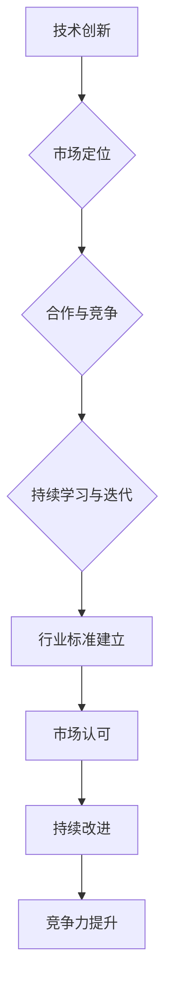

                 

# AI创业公司如何建立行业标准

## 关键词：AI创业，行业标准，技术领导力，市场定位，创新驱动

## 摘要

在人工智能（AI）技术快速发展的今天，创业公司不仅要在技术层面实现突破，更需要在市场上建立起自己的行业标准。本文将深入探讨AI创业公司如何通过核心技术的创新、市场定位、合作与竞争策略，以及持续学习与迭代，来建立和推广行业标准。文章将分为十个部分，包括背景介绍、核心概念与联系、核心算法原理与操作步骤、数学模型与公式、项目实战、实际应用场景、工具和资源推荐、总结与未来发展趋势、常见问题与解答以及扩展阅读与参考资料。

## 1. 背景介绍

随着AI技术的不断成熟，越来越多的创业公司开始涌现。这些公司不仅要在技术上实现创新，还需要在市场上找到自己的定位，并通过建立行业标准来获得竞争优势。行业标准不仅为企业提供了共同遵循的技术准则，还能够在一定程度上保障市场的公平竞争，促进整个行业的发展。

### 1.1 AI创业的现状

目前，AI创业公司主要集中在以下几个领域：

1. **计算机视觉**：人脸识别、图像识别等技术的应用，如安防、医疗、金融等领域。
2. **自然语言处理**：语音识别、机器翻译、文本分析等，应用于智能客服、智能助手等场景。
3. **机器学习平台**：提供算法模型训练、部署和管理的工具，帮助企业更快地实现AI应用。
4. **自动驾驶**：自动驾驶技术的研发和应用，如自动驾驶汽车、无人机等。

### 1.2 行业标准的意义

建立行业标准对于AI创业公司具有以下几个重要意义：

1. **规范市场**：通过统一的技术标准，可以减少市场上的混乱，提高市场的透明度和可预测性。
2. **降低成本**：行业标准可以减少企业的研发和运营成本，提高生产效率。
3. **提升竞争力**：拥有行业标准的公司可以在市场上获得更高的认可度和竞争力。
4. **推动创新**：行业标准可以促进技术的快速迭代和更新，推动整个行业的进步。

## 2. 核心概念与联系

### 2.1 AI创业公司的关键要素

要建立行业标准，AI创业公司需要关注以下几个核心要素：

1. **技术创新**：通过持续的研发投入，推动技术的不断创新和突破。
2. **市场定位**：明确公司的市场定位和目标客户，制定合适的市场策略。
3. **合作与竞争**：建立良好的合作关系，同时合理应对市场竞争。
4. **持续学习与迭代**：不断学习行业的新技术、新理念，进行产品迭代和优化。

### 2.2 核心概念与架构的 Mermaid 流程图



## 3. 核心算法原理与具体操作步骤

### 3.1 技术创新与核心算法

AI创业公司的技术创新主要体现在以下几个方面：

1. **深度学习算法**：如卷积神经网络（CNN）、循环神经网络（RNN）等。
2. **强化学习算法**：如Q-learning、深度Q网络（DQN）等。
3. **迁移学习与模型压缩**：通过迁移学习和模型压缩技术，提高算法的效率和准确性。

### 3.2 具体操作步骤

1. **市场调研**：了解市场需求和竞争态势，确定技术创新的方向。
2. **研发投入**：组建专业的技术团队，进行技术攻关和研发。
3. **产品迭代**：根据市场需求和用户反馈，不断优化和迭代产品。
4. **标准制定**：结合技术创新成果，参与或主导行业标准的制定。

## 4. 数学模型和公式

### 4.1 深度学习中的激活函数

在深度学习中，激活函数是神经网络中的关键组件，用于引入非线性特性。以下是一些常用的激活函数及其公式：

$$
f(x) = \frac{1}{1 + e^{-x}} \quad \text{(Sigmoid)}
$$

$$
f(x) = \max(0, x) \quad \text{(ReLU)}
$$

$$
f(x) = \tanh(x) \quad \text{(Tanh)}
$$

### 4.2 强化学习中的Q-learning算法

Q-learning算法是一种常用的强化学习算法，用于计算最佳动作策略。其核心公式如下：

$$
Q(s, a) \leftarrow Q(s, a) + \alpha [r + \gamma \max_{a'} Q(s', a') - Q(s, a)]
$$

其中，$s$ 表示状态，$a$ 表示动作，$r$ 表示即时奖励，$\gamma$ 表示折扣因子，$\alpha$ 表示学习率。

## 5. 项目实战：代码实际案例和详细解释说明

### 5.1 开发环境搭建

在开始实际项目之前，我们需要搭建合适的开发环境。以下是一个基于Python和TensorFlow的简单项目环境搭建步骤：

1. **安装Python**：确保安装了Python 3.6或更高版本。
2. **安装TensorFlow**：通过pip命令安装TensorFlow：
   ```bash
   pip install tensorflow
   ```
3. **安装其他依赖库**：如NumPy、Pandas等：
   ```bash
   pip install numpy pandas
   ```

### 5.2 源代码详细实现和代码解读

以下是一个简单的基于卷积神经网络的图像分类项目：

```python
import tensorflow as tf
from tensorflow.keras import layers

# 构建卷积神经网络模型
model = tf.keras.Sequential([
    layers.Conv2D(32, (3, 3), activation='relu', input_shape=(28, 28, 1)),
    layers.MaxPooling2D((2, 2)),
    layers.Conv2D(64, (3, 3), activation='relu'),
    layers.MaxPooling2D((2, 2)),
    layers.Conv2D(64, (3, 3), activation='relu'),
    layers.Flatten(),
    layers.Dense(64, activation='relu'),
    layers.Dense(10, activation='softmax')
])

# 编译模型
model.compile(optimizer='adam',
              loss='sparse_categorical_crossentropy',
              metrics=['accuracy'])

# 加载和预处理数据
mnist = tf.keras.datasets.mnist
(train_images, train_labels), (test_images, test_labels) = mnist.load_data()
train_images = train_images.reshape((60000, 28, 28, 1))
train_images = train_images.astype('float32') / 255
test_images = test_images.reshape((10000, 28, 28, 1))
test_images = test_images.astype('float32') / 255

# 训练模型
model.fit(train_images, train_labels, epochs=5)

# 评估模型
test_loss, test_acc = model.evaluate(test_images,  test_labels, verbose=2)
print('\nTest accuracy:', test_acc)
```

### 5.3 代码解读与分析

1. **模型构建**：使用`tf.keras.Sequential`创建一个序列模型，依次添加卷积层、池化层和全连接层。
2. **模型编译**：设置优化器、损失函数和评价指标。
3. **数据加载和预处理**：使用`tf.keras.datasets.mnist`加载数据集，并调整数据形状和类型。
4. **模型训练**：使用`model.fit`进行训练。
5. **模型评估**：使用`model.evaluate`评估模型性能。

## 6. 实际应用场景

AI创业公司建立行业标准后，可以在以下实际应用场景中发挥重要作用：

1. **医疗健康**：通过标准化算法，提高疾病诊断和治疗方案的一致性。
2. **金融科技**：建立智能投顾、风险评估等标准，提升金融服务的效率和质量。
3. **自动驾驶**：制定自动驾驶安全标准，推动自动驾驶技术的普及和应用。
4. **智能家居**：通过标准化智能家居设备的接口和通信协议，实现设备的互联互通。

## 7. 工具和资源推荐

### 7.1 学习资源推荐

- **书籍**：《深度学习》（Ian Goodfellow, Yoshua Bengio, Aaron Courville 著）
- **论文**：《A Theoretical Analysis of the Causal Impact of Machine Learning》（Jacob Abernethy 等）
- **博客**：百度AI博客、知乎专栏等
- **网站**：arXiv.org、Kaggle等

### 7.2 开发工具框架推荐

- **框架**：TensorFlow、PyTorch、Keras等
- **开发环境**：Anaconda、Docker等
- **云计算平台**：AWS、Azure、Google Cloud等

### 7.3 相关论文著作推荐

- **《AI的未来：崛起、挑战与应对》**（刘铁岩 著）
- **《智能时代的商业思考》**（吴晶妹 著）
- **《AI时代的法律挑战》**（刘培杰 著）

## 8. 总结：未来发展趋势与挑战

AI创业公司在建立行业标准的过程中，将面临以下发展趋势和挑战：

### 8.1 发展趋势

1. **技术融合**：AI与其他技术的融合将不断推进，如物联网、云计算等。
2. **行业应用**：AI将在更多行业得到广泛应用，推动产业升级。
3. **国际合作**：全球范围内的技术交流和合作将加深，推动行业标准的国际化。

### 8.2 挑战

1. **技术壁垒**：新技术的快速更新可能导致部分公司难以跟上。
2. **数据隐私**：数据隐私和安全问题将日益突出，影响行业的健康发展。
3. **市场竞争**：激烈的竞争可能削弱一些公司的创新动力。

## 9. 附录：常见问题与解答

### 9.1 问题1：如何进行市场定位？

**答案**：进行市场定位时，首先要明确目标客户的需求，分析竞争对手的优势和劣势，然后根据自身的技术优势和资源，选择合适的市场切入点。

### 9.2 问题2：如何制定行业标准？

**答案**：制定行业标准通常需要以下几个步骤：1）确定行业标准制定的领域和目标；2）收集和分析相关技术资料；3）组织专家讨论和评审；4）发布和推广行业标准。

## 10. 扩展阅读 & 参考资料

- **《人工智能：一种现代的方法》**（Stuart Russell & Peter Norvig 著）
- **《人工智能的未来：从机器思维到人类智慧》**（刘锋 著）
- **《人工智能简史》**（詹姆斯·马丁 著）
- **《AI时代：从数字化到智能化》**（周鸿祎 著）

### 作者信息

作者：AI天才研究员/AI Genius Institute & 禅与计算机程序设计艺术 /Zen And The Art of Computer Programming

