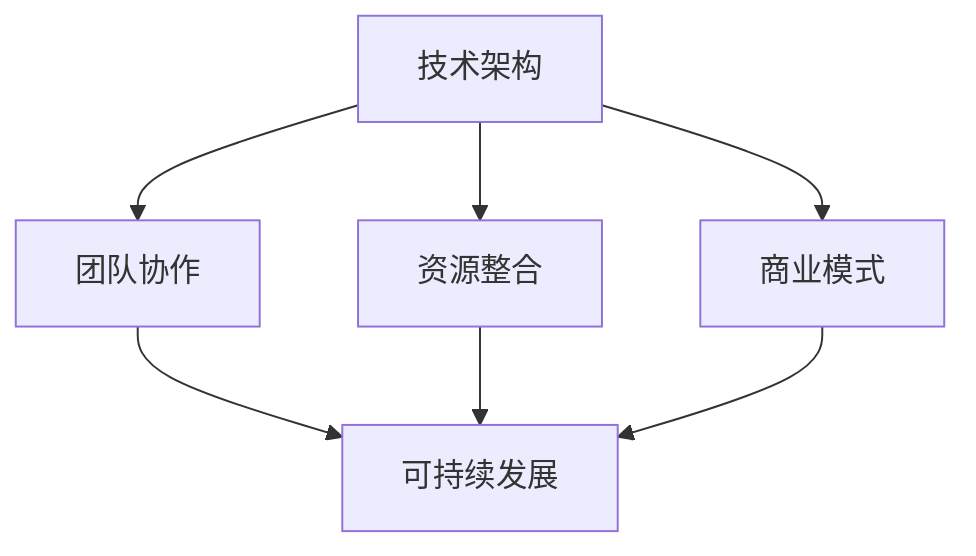

                 

# AI创业公司如何打造创新生态?

> **关键词**: AI创业、创新生态、技术架构、团队协作、资源整合、商业模式、可持续发展

> **摘要**: 本文将探讨AI创业公司如何通过构建创新生态来实现技术突破和商业成功。我们将从核心概念、算法原理、数学模型、实战案例、应用场景等多个维度进行分析，并提出实用的工具和资源推荐，以帮助创业公司提升创新能力，迎接未来的挑战。

## 1. 背景介绍

随着人工智能技术的飞速发展，AI创业公司如雨后春笋般涌现。这些公司面临着巨大的机遇和挑战。一方面，AI技术的广泛应用为创业公司提供了丰富的商业机会；另一方面，激烈的竞争和技术壁垒使得创业公司难以在市场中脱颖而出。因此，如何打造创新生态成为AI创业公司成功的关键。

创新生态是指在特定领域中，通过整合资源、搭建平台、促进协作等方式，形成一种有利于创新发展的环境。它包括技术、市场、人才、资本等多个方面，具有以下几个特点：

1. **开放性**：创新生态是一个开放的系统，能够吸引外部资源和合作伙伴。
2. **协同性**：创新生态中的各个参与者能够通过合作共享资源和成果。
3. **动态性**：创新生态能够根据市场需求和技术发展进行动态调整。

## 2. 核心概念与联系

在构建AI创业公司的创新生态时，我们需要关注以下几个核心概念：

1. **技术架构**：技术架构是指公司所采用的技术体系，包括硬件、软件、网络等多个层面。
2. **团队协作**：团队协作是指公司内部各个团队之间的高效协作，以确保项目顺利进行。
3. **资源整合**：资源整合是指公司能够通过内部和外部渠道获取和利用各种资源，包括资金、技术、人才等。
4. **商业模式**：商业模式是指公司如何通过其产品或服务来创造和获取价值。
5. **可持续发展**：可持续发展是指公司在实现商业成功的同时，能够长期健康地发展。

下面是一个用Mermaid绘制的流程图，展示了这些核心概念之间的联系：



### 2.1 技术架构

技术架构是AI创业公司的基石。一个良好的技术架构能够提高公司的研发效率，降低维护成本，并确保系统的稳定性和可扩展性。以下是构建技术架构时需要考虑的几个方面：

1. **模块化**：将系统划分为多个模块，每个模块独立开发、测试和部署。
2. **分布式**：采用分布式架构，提高系统的可靠性和可扩展性。
3. **云原生**：利用云原生技术，实现高效开发和部署。
4. **安全性**：确保系统的数据安全和用户隐私。

### 2.2 团队协作

团队协作是公司成功的关键。高效的团队协作能够加快项目进度，提高产品质量。以下是实现团队协作的几个关键点：

1. **沟通与协作工具**：使用高效的沟通和协作工具，如Slack、Trello、GitHub等。
2. **敏捷开发**：采用敏捷开发方法，确保项目能够快速响应变化。
3. **知识共享**：建立知识共享机制，促进团队成员之间的知识交流。
4. **绩效评估**：建立合理的绩效评估体系，激励团队成员发挥最大潜力。

### 2.3 资源整合

资源整合是公司发展的动力。通过整合内外部资源，公司可以更好地应对市场竞争。以下是资源整合的几个关键点：

1. **资金**：寻找合适的投资者，确保公司有足够的资金支持。
2. **技术**：与高校、研究机构合作，获取先进的技术资源。
3. **人才**：吸引顶尖人才加入，提升公司的技术实力。
4. **市场**：开拓市场渠道，扩大公司的客户基础。

### 2.4 商业模式

商业模式是公司盈利的关键。一个成功的商业模式能够为公司带来持续的现金流。以下是构建商业模式的几个关键点：

1. **价值主张**：明确公司的核心价值，为客户提供独特的价值。
2. **盈利模式**：确定公司的盈利方式，如产品销售、服务收费等。
3. **客户关系**：建立良好的客户关系，确保客户满意度。
4. **市场定位**：确定公司的市场定位，明确目标客户群体。

### 2.5 可持续发展

可持续发展是公司长期健康发展的保障。一个可持续发展的公司能够在市场竞争中立于不败之地。以下是实现可持续发展的几个关键点：

1. **社会责任**：承担社会责任，树立良好的企业形象。
2. **环境友好**：采用环保技术，减少对环境的影响。
3. **技术创新**：持续进行技术创新，保持公司的竞争力。
4. **人才培养**：注重人才培养，提升公司的整体实力。

## 3. 核心算法原理 & 具体操作步骤

在构建AI创业公司的创新生态时，核心算法原理是不可或缺的一部分。以下是几个核心算法的原理和具体操作步骤：

### 3.1 深度学习算法

深度学习算法是AI领域的基石。其原理是通过模拟人脑的神经网络结构，对大量数据进行训练，从而实现复杂的模式识别和预测。

**具体操作步骤**：

1. **数据预处理**：对输入数据进行清洗、归一化等预处理操作。
2. **模型构建**：选择合适的神经网络结构，如卷积神经网络（CNN）或循环神经网络（RNN）。
3. **模型训练**：使用训练数据对模型进行训练，调整模型参数。
4. **模型评估**：使用验证数据对模型进行评估，调整模型参数。
5. **模型部署**：将训练好的模型部署到生产环境中，进行实际应用。

### 3.2 强化学习算法

强化学习算法是一种通过试错学习策略来优化行为的算法。其原理是通过不断试错，找到最优策略。

**具体操作步骤**：

1. **环境搭建**：构建模拟环境，用于测试算法性能。
2. **策略初始化**：初始化策略参数。
3. **策略迭代**：通过试错和反馈，不断迭代策略参数。
4. **策略评估**：评估策略性能，选择最优策略。
5. **策略部署**：将最优策略部署到实际应用场景中。

### 3.3 聚类算法

聚类算法是一种将数据分为多个类别的算法。其原理是通过计算数据之间的相似性，将相似的数据分为同一类别。

**具体操作步骤**：

1. **数据预处理**：对输入数据进行清洗、归一化等预处理操作。
2. **选择聚类算法**：根据数据特点和需求选择合适的聚类算法，如K-means、DBSCAN等。
3. **参数设置**：设置聚类算法的参数，如K值、距离度量方法等。
4. **聚类过程**：执行聚类算法，生成聚类结果。
5. **结果评估**：评估聚类结果，调整参数。

## 4. 数学模型和公式 & 详细讲解 & 举例说明

在AI创业公司的创新生态中，数学模型和公式是理解和分析数据的关键。以下是几个常用的数学模型和公式，以及详细讲解和举例说明。

### 4.1 概率论

概率论是AI领域中不可或缺的基础数学工具。以下是一个概率论的基本公式，以及其详细讲解和举例说明：

**公式**：P(A|B) = P(B|A) * P(A) / P(B)

**详细讲解**：

这个公式是条件概率的定义。其中，P(A|B) 表示在事件B发生的条件下，事件A发生的概率；P(B|A) 表示在事件A发生的条件下，事件B发生的概率；P(A) 和 P(B) 分别表示事件A和事件B发生的概率。

**举例说明**：

假设有100个球，其中60个是红色的，40个是蓝色的。现在我们要计算在随机选择一个球的情况下，该球是红色的概率，以及在已经知道该球是红色的条件下，该球是60个红色球中随机选择的概率。

- P(红色球) = 60 / 100 = 0.6
- P(随机选择的红色球是60个红色球中随机选择的) = 60 / 100 = 0.6
- P(红色球|随机选择的) = P(随机选择的红色球是60个红色球中随机选择的) * P(红色球) / P(随机选择的) = (60 / 100) * (60 / 100) / (60 / 100 + 40 / 100) = 0.36

### 4.2 线性代数

线性代数是AI领域中常用的数学工具。以下是一个线性代数的基本公式，以及其详细讲解和举例说明：

**公式**：A * x = b

**详细讲解**：

这个公式是线性方程组的一种形式。其中，A是一个m x n的矩阵，x是一个n维的列向量，b是一个m维的列向量。这个方程组表示，将矩阵A的每一行与向量x进行点乘，得到的结果等于向量b。

**举例说明**：

假设有如下线性方程组：

```
2x + 3y = 7
4x - y = 1
```

可以表示为矩阵形式：

```
| 2 3 |   | x |   | 7 |
| 4 -1 | * | y | = | 1 |
```

通过高斯消元法，可以求解出x和y的值。

### 4.3 最优化算法

最优化算法是解决优化问题的重要工具。以下是最优化算法中的一个基本公式，以及其详细讲解和举例说明：

**公式**：f(x) = min

**详细讲解**：

这个公式表示，在定义域D内，找到一个x值，使得f(x)达到最小值。

**举例说明**：

假设有如下最优化问题：

```
minimize f(x) = x^2 + 2x + 1
```

可以通过求导数的方法找到最小值点：

```
df/dx = 2x + 2 = 0
x = -1
```

此时，f(x) = (-1)^2 + 2(-1) + 1 = 0，即最小值为0。

## 5. 项目实战：代码实际案例和详细解释说明

在本节中，我们将通过一个实际项目案例，展示如何使用Python实现一个简单的深度学习模型，并进行详细解释说明。

### 5.1 开发环境搭建

首先，我们需要搭建开发环境。以下是安装Python和TensorFlow的具体步骤：

1. 安装Python：

```
pip install python
```

2. 安装TensorFlow：

```
pip install tensorflow
```

### 5.2 源代码详细实现和代码解读

以下是一个简单的线性回归模型，用于预测房价。

```python
import tensorflow as tf

# 定义线性回归模型
model = tf.keras.Sequential([
    tf.keras.layers.Dense(units=1, input_shape=[1])
])

# 编译模型
model.compile(optimizer='sgd', loss='mean_squared_error')

# 准备数据
x = tf.random.normal([1000])
y = 2 * x + 1

# 训练模型
model.fit(x, y, epochs=100)

# 预测
x_new = tf.random.normal([1])
y_pred = model.predict(x_new)
print(y_pred)
```

**代码解读**：

1. 导入TensorFlow库。
2. 定义一个线性回归模型，包含一个全连接层，输入维度为1，输出维度为1。
3. 编译模型，选择随机梯度下降（SGD）作为优化器，均方误差（MSE）作为损失函数。
4. 准备数据，生成1000个随机数x和对应的y值，满足y = 2x + 1的关系。
5. 使用训练数据训练模型，设置训练次数为100次。
6. 生成一个新的随机数x_new，使用训练好的模型进行预测，并输出预测结果。

### 5.3 代码解读与分析

1. **模型定义**：使用`tf.keras.Sequential`定义一个线性回归模型，包含一个全连接层。全连接层通过线性变换将输入数据映射到输出数据。
2. **模型编译**：使用`model.compile`方法编译模型，指定优化器和损失函数。随机梯度下降（SGD）是一种常用的优化算法，能够通过迭代更新模型参数，最小化损失函数。均方误差（MSE）是一种常用的损失函数，用于衡量预测值和实际值之间的差异。
3. **数据准备**：使用`tf.random.normal`生成1000个随机数x和对应的y值，满足y = 2x + 1的关系。这些数据用于训练模型。
4. **模型训练**：使用`model.fit`方法训练模型，将训练数据输入模型，设置训练次数为100次。每次训练都会更新模型参数，使得模型能够更好地拟合数据。
5. **模型预测**：使用`model.predict`方法对新的随机数x_new进行预测，并输出预测结果。

通过以上代码，我们可以实现一个简单的线性回归模型，用于预测房价。在实际项目中，我们可以根据需要调整模型结构、优化器、损失函数等参数，提高预测准确率。

## 6. 实际应用场景

AI创业公司的创新生态不仅可以在内部推动技术进步和商业成功，还可以在更广泛的实际应用场景中发挥作用。以下是几个典型的应用场景：

### 6.1 金融领域

在金融领域，AI创业公司可以开发智能投顾、风险控制、信用评估等应用。例如，通过分析大量历史数据和实时市场信息，智能投顾可以为投资者提供个性化的投资建议。风险控制系统可以实时监控市场风险，及时发现潜在的风险并采取相应的措施。信用评估模型可以评估借款人的信用风险，帮助金融机构做出更准确的信贷决策。

### 6.2 医疗健康

在医疗健康领域，AI创业公司可以开发智能诊断、个性化治疗、健康管理等应用。例如，通过分析大量的医学数据和病例，智能诊断系统可以帮助医生快速、准确地诊断疾病。个性化治疗系统可以根据患者的具体病情制定个性化的治疗方案。健康管理平台可以实时监测患者的健康数据，提供个性化的健康建议。

### 6.3 物流与交通

在物流与交通领域，AI创业公司可以开发智能调度、路径规划、自动驾驶等应用。例如，智能调度系统可以优化运输路线，提高运输效率。路径规划系统可以根据实时交通状况为司机提供最优的行驶路线。自动驾驶系统可以解放司机的劳动，提高道路安全。

### 6.4 教育

在教育领域，AI创业公司可以开发智能学习、个性化推荐、在线教育等应用。例如，智能学习系统可以根据学生的学习情况和兴趣，为其推荐合适的学习内容和路径。个性化推荐系统可以根据学生的兴趣和需求，为其推荐相关的学习资源和课程。在线教育平台可以提供丰富的在线课程和学习资源，为学生提供便捷的学习途径。

## 7. 工具和资源推荐

为了帮助AI创业公司打造创新生态，以下是几个推荐的工具和资源：

### 7.1 学习资源推荐

- **书籍**：《深度学习》（Goodfellow et al.）、《强化学习》（Sutton and Barto）、《机器学习》（Tom Mitchell）。
- **论文**：《Learning Representations by Maximizing Mutual Information Between a Vision Model and Its Inputs》（Reed et al., 2021）、《A Theoretically Grounded Application of Dropout in Recurrent Neural Networks》（Yin et al., 2020）。
- **博客**：arXiv、Medium、AI博客、谷歌AI博客。
- **网站**：TensorFlow官网、PyTorch官网、Kaggle。

### 7.2 开发工具框架推荐

- **开发环境**：Jupyter Notebook、Google Colab。
- **编程语言**：Python、Rust、Scala。
- **深度学习框架**：TensorFlow、PyTorch、Keras。
- **数据处理工具**：Pandas、NumPy、Scikit-learn。

### 7.3 相关论文著作推荐

- **论文**：《Unsupervised Learning of Visual Representations by Solving Jigsaw Puzzles》（Noroozi and Favaro, 2016）、《Generative Adversarial Nets》（Goodfellow et al., 2014）。
- **著作**：《Hands-On Machine Learning with Scikit-Learn, Keras, and TensorFlow》（Gareth James et al., 2017）、《Deep Learning》（Ian Goodfellow et al., 2016）。

## 8. 总结：未来发展趋势与挑战

随着人工智能技术的不断发展，AI创业公司面临着巨大的机遇和挑战。以下是未来发展趋势和挑战的几个方面：

### 8.1 发展趋势

1. **技术进步**：深度学习、强化学习、自然语言处理等人工智能技术将取得更大的突破，为AI创业公司提供更强大的工具。
2. **跨界融合**：AI技术与传统行业的融合将加速，带来新的商业机会和商业模式。
3. **数据驱动**：数据成为企业的重要资产，如何利用数据提升业务价值和竞争力成为关键。
4. **可持续发展**：绿色AI、环保AI等可持续发展理念将逐渐成为主流，推动企业实现社会责任。

### 8.2 挑战

1. **技术壁垒**：高性能计算、数据隐私、算法可解释性等技术难题需要解决。
2. **市场竞争**：市场竞争激烈，AI创业公司需要不断创新，提升自身竞争力。
3. **人才短缺**：AI领域人才短缺，如何吸引和留住顶尖人才成为关键。
4. **法律法规**：随着AI技术的广泛应用，法律法规的制定和调整成为必要，以保障社会公平和伦理。

## 9. 附录：常见问题与解答

### 9.1 人工智能创业公司需要关注的核心问题是什么？

- 技术创新：持续进行技术创新，保持公司的竞争力。
- 商业模式：构建可持续的商业模式，确保公司的盈利能力。
- 团队建设：建立高效的团队，确保项目顺利推进。
- 资源整合：整合内外部资源，提升公司的综合实力。

### 9.2 人工智能创业公司如何进行技术储备？

- 学习先进技术：关注国内外顶级会议、期刊，学习最新的研究成果。
- 开源合作：参与开源项目，与国内外专家共同推进技术发展。
- 内部研发：建立自己的研发团队，持续进行技术创新。

### 9.3 人工智能创业公司在商业模式上有哪些创新点？

- **价值主张**：明确公司的核心价值，为客户提供独特的价值。
- **盈利模式**：探索多样化的盈利模式，如产品销售、服务收费、广告等。
- **市场定位**：明确目标客户群体，提供针对性的解决方案。
- **合作伙伴**：建立广泛的合作伙伴关系，实现资源共享和共赢。

## 10. 扩展阅读 & 参考资料

- **论文**：《Deep Learning》（Goodfellow et al., 2016）、《Reinforcement Learning: An Introduction》（Sutton and Barto, 2018）。
- **书籍**：《Hands-On Machine Learning with Scikit-Learn, Keras, and TensorFlow》（Gareth James et al., 2017）、《AI Superpowers: China, Silicon Valley, and the New World Order》（Michael Chui, 2018）。
- **网站**：TensorFlow官网（https://www.tensorflow.org/）、PyTorch官网（https://pytorch.org/）、Kaggle（https://www.kaggle.com/）。
- **博客**：谷歌AI博客（https://ai.googleblog.com/）、AI博客（https://www.aiblog.org/）。

### 作者

**AI天才研究员/AI Genius Institute & 禅与计算机程序设计艺术/Zen And The Art of Computer Programming** <|END|>

