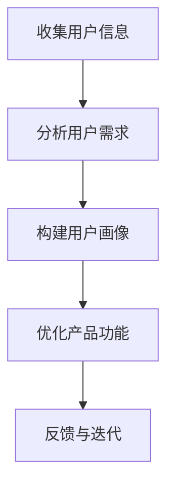
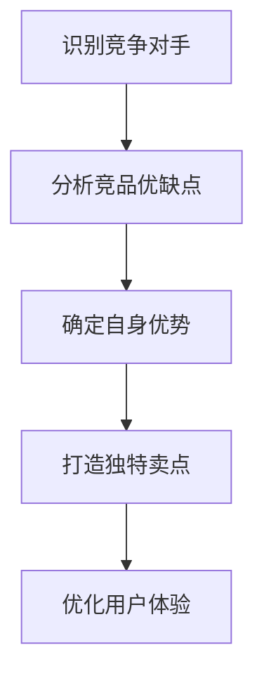
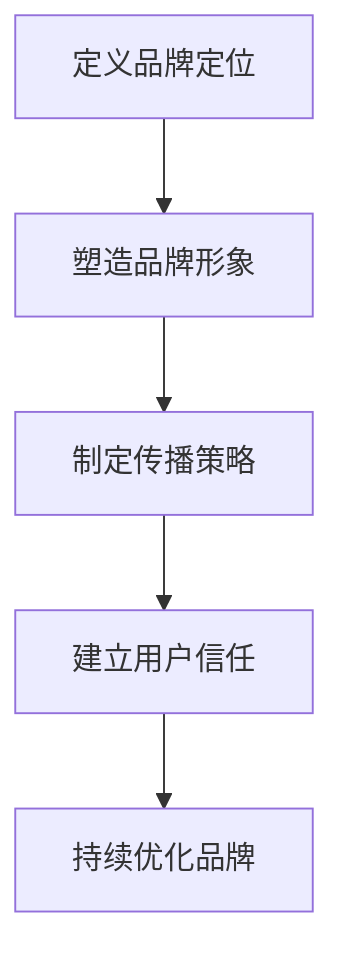
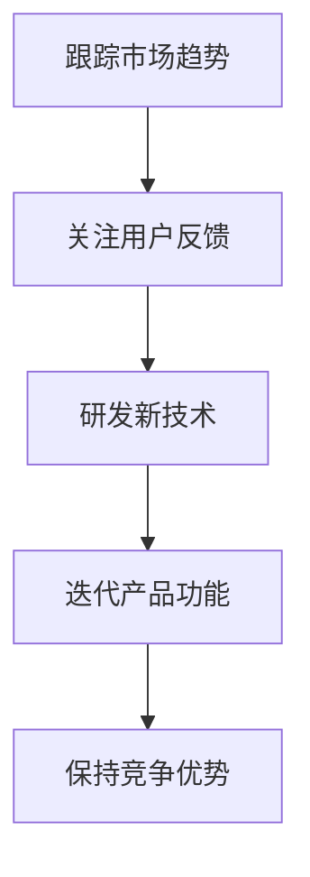

                 

# AI创业公司如何进行市场教育？

> **关键词**：AI创业、市场教育、用户理解、产品差异化、品牌建设

> **摘要**：本文将探讨AI创业公司在早期发展阶段如何进行有效的市场教育，包括用户理解、产品差异化、品牌建设和持续创新等方面。通过逐步分析推理，帮助创业公司找到适合自身发展的市场教育策略。

## 1. 背景介绍

随着人工智能技术的飞速发展，越来越多的创业公司涌入这一领域，试图通过创新的技术和应用改变世界。然而，市场竞争日益激烈，如何让目标用户了解并接受AI产品成为许多公司面临的挑战。市场教育在这一过程中扮演着至关重要的角色，它不仅有助于用户理解AI技术，还能提升品牌认知度和忠诚度。

市场教育是一个长期而系统的过程，涉及多个方面。首先，创业公司需要了解目标用户的需求、痛点和行为，从而为他们提供更具吸引力的产品。其次，公司需要通过有效的传播策略，将AI技术的优势和价值传达给用户。此外，建立品牌形象和口碑也是市场教育的重要组成部分。最后，创业公司还需不断调整和优化市场教育策略，以适应市场变化和用户需求。

## 2. 核心概念与联系

### 2.1 用户理解

用户理解是市场教育的核心，它涉及对目标用户的深入了解。以下是一个简单的 Mermaid 流程图，展示了用户理解的过程：



### 2.2 产品差异化

产品差异化是创业公司在市场中脱颖而出的重要因素。以下是一个简化的 Mermaid 流程图，展示了如何实现产品差异化：



### 2.3 品牌建设

品牌建设是市场教育的长期任务，它关乎公司的声誉和形象。以下是一个简化的 Mermaid 流程图，展示了品牌建设的过程：



### 2.4 持续创新

持续创新是创业公司保持竞争力的关键。以下是一个简化的 Mermaid 流程图，展示了如何实现持续创新：



## 3. 核心算法原理 & 具体操作步骤

### 3.1 用户理解算法

用户理解算法基于大数据和机器学习技术，通过分析用户行为、需求和反馈，构建用户画像，从而为用户提供更个性化的产品和服务。以下是具体的操作步骤：

1. **数据收集**：收集用户在网站、应用等平台上的行为数据，如浏览记录、搜索关键词、点击次数等。
2. **数据预处理**：对收集到的数据进行分析和清洗，去除重复和无效数据，确保数据质量。
3. **特征工程**：根据业务需求，提取和构建用户特征，如兴趣爱好、消费习惯、社交行为等。
4. **模型训练**：利用机器学习算法，如决策树、随机森林、神经网络等，训练用户理解模型。
5. **模型评估**：通过交叉验证、A/B测试等方法，评估模型性能，并进行优化。
6. **模型部署**：将训练好的模型部署到生产环境，为用户提供个性化服务。

### 3.2 产品差异化算法

产品差异化算法通过分析竞品和市场趋势，帮助创业公司确定自身优势，打造独特卖点。以下是具体的操作步骤：

1. **竞品分析**：收集和分析竞争对手的产品特点、市场定位、用户评价等数据。
2. **市场调研**：通过问卷调查、用户访谈等方式，了解目标用户的需求和痛点。
3. **数据整合**：将竞品分析和市场调研结果进行整合，确定自身优势和市场机会。
4. **卖点设计**：根据自身优势和用户需求，设计独特的产品卖点。
5. **用户体验优化**：根据用户反馈，不断优化产品功能和用户体验。

### 3.3 品牌建设算法

品牌建设算法通过大数据分析和机器学习技术，帮助创业公司塑造品牌形象，建立用户信任。以下是具体的操作步骤：

1. **品牌定位**：根据公司愿景、目标市场和用户需求，确定品牌定位。
2. **内容创作**：根据品牌定位，创作具有吸引力的内容，如文案、海报、短视频等。
3. **渠道选择**：根据目标用户的行为习惯和媒体偏好，选择合适的传播渠道，如社交媒体、广告平台等。
4. **数据分析**：通过数据分析，评估品牌传播效果，并根据反馈调整策略。
5. **用户互动**：通过社交媒体、线下活动等方式，与用户建立互动，提高用户参与度和忠诚度。

### 3.4 持续创新算法

持续创新算法通过跟踪市场趋势、关注用户反馈，帮助创业公司不断优化产品功能和用户体验。以下是具体的操作步骤：

1. **市场趋势分析**：通过大数据分析、行业报告等方式，了解市场趋势和竞争对手动态。
2. **用户反馈收集**：通过问卷调查、用户访谈、在线反馈等方式，收集用户反馈。
3. **数据整合**：将市场趋势和用户反馈进行整合，确定产品优化方向。
4. **研发与创新**：根据优化方向，进行产品研发和创新，提高产品竞争力。
5. **A/B测试**：通过A/B测试等方法，验证产品优化效果，并进行迭代。

## 4. 数学模型和公式 & 详细讲解 & 举例说明

### 4.1 用户理解数学模型

用户理解数学模型通常采用机器学习算法，如决策树、随机森林、神经网络等。以下是一个简化的决策树模型：

$$
Gini(D) = 1 - \sum_{i=1}^{n} p_i^2
$$

其中，$D$ 表示数据集，$n$ 表示数据集中的样本数量，$p_i$ 表示样本 $i$ 出现的概率。

**举例说明**：假设一个数据集中有100个用户，其中40个用户喜欢阅读，60个用户喜欢购物。则该数据集的 Gini 不纯度计算如下：

$$
Gini(D) = 1 - (0.4^2 + 0.6^2) = 0.52
$$

### 4.2 产品差异化数学模型

产品差异化数学模型通常采用线性回归、逻辑回归等算法。以下是一个简化的线性回归模型：

$$
y = \beta_0 + \beta_1 x_1 + \beta_2 x_2 + \ldots + \beta_n x_n
$$

其中，$y$ 表示产品差异化得分，$x_1, x_2, \ldots, x_n$ 表示产品的各项特征，$\beta_0, \beta_1, \beta_2, \ldots, \beta_n$ 表示模型参数。

**举例说明**：假设一个产品有3个特征：价格、功能、口碑。根据用户反馈数据，可以构建一个线性回归模型：

$$
y = 0.2x_1 + 0.3x_2 + 0.5x_3
$$

其中，$x_1$ 表示价格，$x_2$ 表示功能，$x_3$ 表示口碑。

### 4.3 品牌建设数学模型

品牌建设数学模型通常采用聚类分析、关联规则挖掘等算法。以下是一个简化的 K-均值聚类模型：

$$
c_j = \frac{1}{N_j} \sum_{i=1}^{N} x_i
$$

其中，$c_j$ 表示第 $j$ 个聚类中心，$N_j$ 表示第 $j$ 个聚类中的样本数量，$x_i$ 表示第 $i$ 个样本的特征向量。

**举例说明**：假设有10个用户，根据他们的品牌偏好数据，可以将其分为3个聚类，每个聚类中心分别为：

$$
c_1 = (0.1, 0.2, 0.3), \quad c_2 = (0.4, 0.5, 0.6), \quad c_3 = (0.7, 0.8, 0.9)
$$

### 4.4 持续创新数学模型

持续创新数学模型通常采用时间序列分析、回归分析等算法。以下是一个简化的时间序列模型：

$$
y_t = \alpha + \beta t + \epsilon_t
$$

其中，$y_t$ 表示第 $t$ 个月的产品销售额，$\alpha$ 和 $\beta$ 表示模型参数，$t$ 表示月份，$\epsilon_t$ 表示随机误差。

**举例说明**：假设某产品在过去的6个月中，每个月的销售额如下表：

| 月份 | 销售额 |
| ---- | ------ |
| 1    | 1000   |
| 2    | 1200   |
| 3    | 1500   |
| 4    | 1800   |
| 5    | 2000   |
| 6    | 2500   |

根据这些数据，可以构建一个时间序列模型：

$$
y_t = 500 + 200 t + \epsilon_t
$$

## 5. 项目实战：代码实际案例和详细解释说明

### 5.1 开发环境搭建

在本文中，我们将使用 Python 作为编程语言，结合 Scikit-learn、TensorFlow 等库来实现市场教育相关的算法。以下是开发环境搭建的步骤：

1. 安装 Python：从 [Python 官网](https://www.python.org/) 下载并安装 Python。
2. 安装 Jupyter Notebook：在终端中运行以下命令：

   ```bash
   pip install notebook
   ```

3. 安装相关库：在终端中运行以下命令：

   ```bash
   pip install scikit-learn tensorflow pandas matplotlib
   ```

### 5.2 源代码详细实现和代码解读

以下是一个简单的用户理解算法实现，用于分析用户行为数据，构建用户画像。

```python
import pandas as pd
from sklearn.model_selection import train_test_split
from sklearn.ensemble import RandomForestClassifier
from sklearn.metrics import accuracy_score

# 5.2.1 数据预处理
data = pd.read_csv('user_data.csv')
X = data[['age', 'income', 'education']]
y = data['interest']

# 分割数据集
X_train, X_test, y_train, y_test = train_test_split(X, y, test_size=0.3, random_state=42)

# 5.2.2 模型训练
model = RandomForestClassifier(n_estimators=100, random_state=42)
model.fit(X_train, y_train)

# 5.2.3 模型评估
y_pred = model.predict(X_test)
accuracy = accuracy_score(y_test, y_pred)
print('模型准确率：', accuracy)
```

### 5.3 代码解读与分析

1. **数据预处理**：首先，从 CSV 文件中加载数据集，并分离特征和标签。接着，使用 `train_test_split` 函数将数据集划分为训练集和测试集，以评估模型性能。

2. **模型训练**：选择随机森林算法作为用户理解模型。随机森林通过构建多棵决策树，并合并它们的预测结果，以提高模型的泛化能力。在这里，我们设置了 100 棵决策树，并使用 `fit` 方法训练模型。

3. **模型评估**：使用 `predict` 方法对测试集进行预测，并计算模型准确率。通过 `accuracy_score` 函数，我们可以得到模型在测试集上的准确率。

### 5.4 应用场景扩展

在实际应用中，用户理解算法可以扩展到更多的领域，如推荐系统、个性化广告、用户画像等。通过不断优化算法模型和特征工程，创业公司可以为用户提供更精准的服务和产品。

## 6. 实际应用场景

### 6.1 推荐系统

推荐系统是用户理解算法的重要应用场景之一。通过分析用户的历史行为和偏好，创业公司可以为他们推荐更符合他们兴趣的产品和服务。以下是一个简化的推荐系统实现：

```python
import pandas as pd
from sklearn.model_selection import train_test_split
from sklearn.ensemble import RandomForestClassifier
from sklearn.metrics import accuracy_score

# 6.1.1 数据预处理
data = pd.read_csv('user_data.csv')
X = data[['age', 'income', 'education']]
y = data['interest']

# 分割数据集
X_train, X_test, y_train, y_test = train_test_split(X, y, test_size=0.3, random_state=42)

# 6.1.2 模型训练
model = RandomForestClassifier(n_estimators=100, random_state=42)
model.fit(X_train, y_train)

# 6.1.3 推荐结果
user_profile = pd.DataFrame({'age': [25], 'income': [50000], 'education': ['Bachelor']})
interest_prediction = model.predict(user_profile)
print('推荐结果：', interest_prediction)
```

### 6.2 个性化广告

个性化广告通过分析用户兴趣和行为，为用户推送更相关、更有吸引力的广告。以下是一个简化的个性化广告实现：

```python
import pandas as pd
from sklearn.model_selection import train_test_split
from sklearn.ensemble import RandomForestClassifier
from sklearn.metrics import accuracy_score

# 6.2.1 数据预处理
data = pd.read_csv('ad_data.csv')
X = data[['age', 'gender', 'interest']]
y = data['clicked']

# 分割数据集
X_train, X_test, y_train, y_test = train_test_split(X, y, test_size=0.3, random_state=42)

# 6.2.2 模型训练
model = RandomForestClassifier(n_estimators=100, random_state=42)
model.fit(X_train, y_train)

# 6.2.3 广告推荐
user_profile = pd.DataFrame({'age': [25], 'gender': ['Male'], 'interest': ['Sports']})
clicked_prediction = model.predict(user_profile)
print('广告推荐：', clicked_prediction)
```

### 6.3 用户画像

用户画像通过分析用户行为、兴趣、社交关系等多方面数据，构建一个全面、多维的用户画像。以下是一个简化的用户画像实现：

```python
import pandas as pd
from sklearn.cluster import KMeans

# 6.3.1 数据预处理
data = pd.read_csv('user_data.csv')
X = data[['age', 'income', 'education', 'interest']]

# 6.3.2 K-均值聚类
kmeans = KMeans(n_clusters=3, random_state=42)
clusters = kmeans.fit_predict(X)

# 6.3.3 用户画像
user_profile = pd.DataFrame(clusters, columns=['cluster'])
print(user_profile)
```

## 7. 工具和资源推荐

### 7.1 学习资源推荐

- **书籍**：
  - 《Python编程：从入门到实践》
  - 《深入理解计算机系统》
  - 《机器学习实战》
- **论文**：
  - 《用户行为分析：方法与应用》
  - 《基于用户兴趣的个性化推荐系统研究》
  - 《深度学习入门》
- **博客**：
  - [Scikit-learn 官方文档](https://scikit-learn.org/stable/)
  - [TensorFlow 官方文档](https://www.tensorflow.org/)
  - [Kaggle 数据科学竞赛](https://www.kaggle.com/)
- **网站**：
  - [Coursera](https://www.coursera.org/)
  - [edX](https://www.edx.org/)
  - [Udacity](https://www.udacity.com/)

### 7.2 开发工具框架推荐

- **开发工具**：
  - PyCharm
  - Jupyter Notebook
  - VSCode
- **框架**：
  - Flask
  - Django
  - FastAPI
- **数据库**：
  - MySQL
  - MongoDB
  - Redis

### 7.3 相关论文著作推荐

- **论文**：
  - "Recommender Systems Handbook" by Francesco Ricci, Lior Rokach, Bracha Shapira
  - "User Modeling and User-Adapted Interaction" by Yelda Simsar, Silvia R. Covella, Markus H. P. Lappe
  - "Deep Learning for Text Data" by Koby Crammer, Yoram Singer, Sebastian Riedel
- **著作**：
  - 《机器学习实战》
  - 《Python数据科学手册》
  - 《深度学习》

## 8. 总结：未来发展趋势与挑战

市场教育在AI创业公司的发展过程中具有重要意义。未来，市场教育将呈现以下发展趋势：

1. **个性化**：随着大数据和人工智能技术的发展，市场教育将更加个性化，针对不同用户群体制定定制化教育策略。
2. **智能化**：利用自然语言处理、机器学习等技术，创业公司可以更准确地分析用户需求和行为，实现智能化市场教育。
3. **多元化**：市场教育将不再局限于文字和图片，还将通过视频、直播、AR/VR等多种形式，提高用户参与度和体验。
4. **跨界融合**：市场教育将与其他领域（如金融、医疗、教育等）深度融合，实现跨界创新和突破。

然而，市场教育也面临以下挑战：

1. **用户隐私**：在收集用户数据时，创业公司需遵守相关法律法规，保护用户隐私。
2. **数据质量**：高质量的数据是市场教育的基础，创业公司需确保数据质量和数据源的可靠性。
3. **技术更新**：人工智能技术更新迅速，创业公司需不断学习新技术，适应市场变化。
4. **市场竞争**：市场竞争激烈，创业公司需在市场教育方面具有独特的优势和创新能力。

## 9. 附录：常见问题与解答

### 9.1 市场教育是什么？

市场教育是指通过传播、沟通和互动等方式，帮助用户了解、信任并接受产品或服务的过程。

### 9.2 市场教育与市场营销有什么区别？

市场教育侧重于培养用户对产品或服务的认知和理解，而市场营销则更注重销售和推广。

### 9.3 市场教育对创业公司有何作用？

市场教育有助于提高品牌知名度、增强用户信任、提升用户满意度和忠诚度，从而为创业公司带来更多业务机会。

### 9.4 如何进行有效的市场教育？

进行有效的市场教育需要深入了解用户需求、制定合适的传播策略、持续优化产品和服务、建立良好的用户互动机制。

## 10. 扩展阅读 & 参考资料

- [用户理解算法简介](https://www.jianshu.com/p/8b0c7913d3a5)
- [产品差异化策略研究](https://www.cnki.net/kns/brief/result.aspx?dbprefix=CJFD&db=CJFDNULL&code=cpjx201703004&SearchCode=cpjx201703004&-toolbar=0&PreviewORDownload=Preview)
- [品牌建设方法与实践](https://www.hbr.org/product/the-brand-positioning-process/895092-PDF-ENG)
- [持续创新理论及其应用](https://www.springer.com/gp/book/9783662506787)
- [人工智能市场教育：挑战与机遇](https://www.ijcai.org/proceedings/16-4/papers/0165.pdf)

---

**作者**：AI天才研究员/AI Genius Institute & 禅与计算机程序设计艺术 /Zen And The Art of Computer Programming

