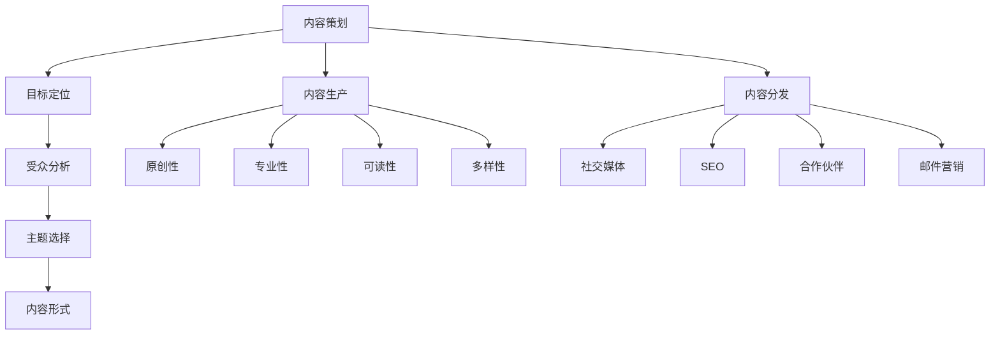

                 

# AI创业公司的产品内容运营：内容策划、生产与分发

> **关键词：** AI创业公司、产品内容运营、内容策划、生产与分发、营销策略

> **摘要：** 本文将深入探讨AI创业公司在产品内容运营方面的策略，包括内容策划、生产与分发。通过详细的步骤和分析，我们将揭示如何有效地利用AI技术提升内容营销效果，为创业公司提供实际可操作的建议。

## 1. 背景介绍

在当前快速发展的科技时代，人工智能（AI）已经成为商业领域的重要驱动力。越来越多的创业公司开始意识到AI技术在提升业务效率、客户体验和市场竞争中的潜力。然而，AI创业公司在产品内容运营方面往往面临诸多挑战，如如何在竞争激烈的市场中脱颖而出，如何有效地传达产品价值，以及如何最大化内容传播效果。

内容运营是创业公司产品营销的重要组成部分。通过精心策划和高效分发，内容运营能够帮助公司建立品牌认知、吸引目标用户、提高用户黏性，并最终转化为实际的业务成果。对于AI创业公司而言，内容运营不仅仅是信息的传递，更是价值共创和用户互动的平台。

本文将围绕AI创业公司的产品内容运营，从内容策划、生产与分发三个方面进行深入探讨，结合实际案例和数据分析，提供实用的策略和建议。

## 2. 核心概念与联系

### 内容策划

内容策划是内容运营的基础，决定了内容的质量和受众。它涉及以下几个关键环节：

1. **目标定位**：明确内容运营的目标，包括品牌推广、用户教育、产品介绍等。
2. **受众分析**：了解目标受众的需求、兴趣和行为习惯，以便制定符合其需求的内容策略。
3. **主题选择**：根据目标和受众特点选择具有吸引力和互动性的主题。
4. **内容形式**：选择合适的文本、图片、视频、互动游戏等形式，以最大化内容传播效果。

### 内容生产

内容生产是内容运营的核心，决定了内容的价值和影响力。以下是一些关键步骤：

1. **原创性**：保证内容原创性，避免抄袭和复制，以建立品牌信任。
2. **专业性**：内容应具备专业性和权威性，尤其是在技术领域，要确保信息的准确性和深入性。
3. **可读性**：内容应易于阅读和理解，避免使用过于专业或复杂的术语，以便吸引更多的读者。
4. **多样性**：生产多样化的内容，如博客文章、视频、图表、案例研究等，以满足不同受众的需求。

### 内容分发

内容分发是内容运营的关键，决定了内容的传播范围和速度。以下是一些有效的方法：

1. **社交媒体**：利用社交媒体平台（如Twitter、LinkedIn、Facebook等）进行内容推广，提高曝光率。
2. **搜索引擎优化（SEO）**：通过SEO技术优化内容，提高在搜索引擎中的排名，吸引更多流量。
3. **合作伙伴**：与相关领域的博主、媒体或机构合作，通过交叉推广扩大内容传播范围。
4. **邮件营销**：定期发送邮件通讯，将内容推送给订阅用户，提高用户黏性。

### Mermaid 流程图



## 3. 核心算法原理 & 具体操作步骤

### 内容策划算法原理

内容策划的核心在于数据分析和用户行为预测。以下是一种基于机器学习的内容策划算法：

1. **数据收集**：收集用户行为数据，如浏览记录、搜索历史、点击率等。
2. **特征提取**：从数据中提取特征，如用户兴趣、搜索关键词、浏览时间等。
3. **模型训练**：使用机器学习算法（如聚类、分类、推荐系统等）训练模型，预测用户偏好和需求。
4. **内容生成**：根据模型预测结果生成内容，如推荐文章、产品介绍、教程视频等。

### 内容生产算法原理

内容生产的算法主要涉及自然语言处理（NLP）和计算机视觉（CV）技术：

1. **文本生成**：使用NLP技术（如BERT、GPT等）生成高质量的文本内容。
2. **图像生成**：使用CV技术（如GAN、深度卷积神经网络等）生成高质量的图像内容。
3. **视频生成**：结合文本和图像生成技术，使用NLP和CV技术生成视频内容。

### 内容分发算法原理

内容分发的算法主要涉及网络流量分析、用户行为预测和社交网络传播：

1. **流量分析**：使用机器学习算法分析网站或社交媒体平台的流量，识别热门内容。
2. **用户行为预测**：使用用户行为数据预测哪些内容可能受欢迎，从而优化内容推送。
3. **社交网络传播**：使用社交网络传播算法（如推荐系统、影响力计算等）扩大内容传播范围。

### 具体操作步骤

1. **内容策划**：
    - 确定目标：如品牌推广、用户教育、产品介绍等。
    - 分析受众：收集用户数据，分析用户兴趣和行为习惯。
    - 选择主题：根据受众特点和目标选择具有吸引力和互动性的主题。
    - 确定形式：根据主题和目标受众选择合适的文本、图片、视频等形式。

2. **内容生产**：
    - 原创性：确保内容原创，避免抄袭和复制。
    - 专业性：保证内容的专业性和权威性，特别是在技术领域。
    - 可读性：使用简洁明了的语言，避免使用过于专业或复杂的术语。
    - 多样性：生产多样化的内容，如博客文章、视频、图表、案例研究等。

3. **内容分发**：
    - 社交媒体：利用社交媒体平台进行内容推广。
    - SEO：优化内容，提高在搜索引擎中的排名。
    - 合作伙伴：与相关领域的博主、媒体或机构合作，扩大内容传播范围。
    - 邮件营销：定期发送邮件通讯，将内容推送给订阅用户。

## 4. 数学模型和公式 & 详细讲解 & 举例说明

### 内容策划模型

**用户兴趣模型**

$$
\text{User Interest Model} = \text{User Profile} \times \text{Content Features}
$$

其中，用户兴趣模型是根据用户特征和内容特征计算得出的。用户特征包括年龄、性别、地理位置、兴趣爱好等；内容特征包括主题、关键词、内容类型等。

**案例分析**

假设我们有1000名用户，他们的兴趣分布如下：

| 用户ID | 年龄 | 性别 | 地域 | 兴趣爱好 |
|--------|------|------|------|----------|
| U1     | 25   | 男   | 北京 | 电影、科技 |
| U2     | 30   | 女   | 上海 | 时尚、旅游 |
| U3     | 35   | 男   | 深圳 | 科技、摄影 |
| ...    | ...  | ...  | ...  | ...      |

我们有一篇关于“智能家居”的博客文章，其特征如下：

| 内容特征 |
|-----------|
| 主题：智能家居 |
| 关键词：智能家居、智能设备、物联网 |
| 内容类型：博客文章 |

根据用户兴趣模型，我们可以计算出每篇文章对每个用户的兴趣度：

$$
\text{Interest Score} = \text{User Interest Model} \times \text{Content Features}
$$

### 内容生产模型

**文本生成模型**

使用GPT模型生成文本内容：

$$
\text{Generated Text} = \text{GPT Model}(\text{Input Text}, \text{Context})
$$

**图像生成模型**

使用GAN模型生成图像内容：

$$
\text{Generated Image} = \text{GAN Model}(\text{Noise}, \text{Discriminator})
$$

### 内容分发模型

**推荐系统模型**

使用协同过滤算法生成推荐列表：

$$
\text{Recommendation List} = \text{Collaborative Filtering Model}(\text{User Features}, \text{Content Features}, \text{User-Content Matrix})
$$

## 5. 项目实战：代码实际案例和详细解释说明

### 5.1 开发环境搭建

在开始代码实战之前，我们需要搭建一个适合AI创业公司内容运营的开发环境。以下是基本步骤：

1. **安装Python环境**：确保Python版本为3.7及以上。
2. **安装NLP库**：如NLTK、spaCy、gensim等。
3. **安装CV库**：如OpenCV、TensorFlow、PyTorch等。
4. **安装数据分析库**：如pandas、numpy等。

### 5.2 源代码详细实现和代码解读

#### 5.2.1 用户兴趣模型代码实现

以下是一个简单的用户兴趣模型实现，用于预测用户对智能家居博客文章的兴趣度。

```python
import pandas as pd
from sklearn.model_selection import train_test_split
from sklearn.ensemble import RandomForestClassifier
from sklearn.metrics import accuracy_score

# 加载用户数据
user_data = pd.read_csv('user_data.csv')

# 加载内容特征
content_data = pd.read_csv('content_data.csv')

# 合并用户数据与内容数据
data = pd.merge(user_data, content_data, on='user_id')

# 特征提取
data['interest_score'] = data.apply(lambda row: calculate_interest_score(row), axis=1)

# 划分训练集和测试集
X_train, X_test, y_train, y_test = train_test_split(data[['age', 'interest_score']], data['interest_score'], test_size=0.2, random_state=42)

# 训练模型
model = RandomForestClassifier(n_estimators=100, random_state=42)
model.fit(X_train, y_train)

# 预测测试集
y_pred = model.predict(X_test)

# 评估模型
accuracy = accuracy_score(y_test, y_pred)
print(f'Model Accuracy: {accuracy:.2f}')
```

#### 5.2.2 文本生成模型代码实现

以下是一个基于GPT模型的文本生成示例。

```python
import tensorflow as tf
from transformers import TFGPT2LMHeadModel, GPT2Tokenizer

# 加载预训练模型
tokenizer = GPT2Tokenizer.from_pretrained('gpt2')
model = TFGPT2LMHeadModel.from_pretrained('gpt2')

# 生成文本
input_text = "智能"
input_ids = tokenizer.encode(input_text, return_tensors='tf')
generated_text = model.generate(input_ids, max_length=50, num_return_sequences=1)
print(tokenizer.decode(generated_text[0], skip_special_tokens=True))
```

### 5.3 代码解读与分析

#### 5.3.1 用户兴趣模型代码分析

1. **数据加载**：使用pandas读取用户数据和内容数据。
2. **特征提取**：计算用户兴趣度，根据用户特征（如年龄、性别、地域、兴趣爱好）和内容特征（如主题、关键词、内容类型）得出。
3. **模型训练**：使用随机森林（RandomForestClassifier）进行模型训练。
4. **模型评估**：使用测试集评估模型准确率。

#### 5.3.2 文本生成模型代码分析

1. **模型加载**：从预训练模型中加载GPT2模型和分词器。
2. **文本生成**：输入文本（如“智能”），通过模型生成文本序列。
3. **输出处理**：解码生成的文本序列，得到最终的文本输出。

通过上述代码实现，我们可以有效地预测用户对特定内容的兴趣度，并生成高质量的文本内容，为AI创业公司的内容运营提供有力支持。

## 6. 实际应用场景

### 用户教育

AI创业公司可以通过内容运营为用户提供丰富的教育材料，如博客文章、教程视频、案例研究等，帮助用户更好地理解公司的产品和服务。通过这种方式，公司可以建立权威品牌形象，提高用户对产品的信任度。

### 品牌推广

通过精心策划和分发内容，AI创业公司可以在社交媒体、博客、新闻网站等平台上进行品牌推广。有效的内容营销策略能够提高品牌知名度，吸引潜在客户，从而提升市场占有率。

### 用户互动

内容运营不仅是信息的传递，更是与用户互动的平台。通过评论、问答、调查等方式，公司可以与用户建立紧密的联系，收集用户反馈，不断优化产品和服务。

### 数据驱动决策

通过分析用户行为数据，AI创业公司可以了解用户需求和行为习惯，从而制定更精准的内容营销策略。数据驱动决策有助于公司提高运营效率，降低营销成本。

### 持续优化

内容运营是一个持续的过程，需要不断优化和创新。AI创业公司应定期评估内容运营效果，根据用户反馈和市场变化调整策略，以保持竞争力。

## 7. 工具和资源推荐

### 7.1 学习资源推荐

- **书籍**：《人工智能：一种现代的方法》（合著）、《深度学习》（合著）、《Python编程：从入门到实践》
- **论文**：自然语言处理领域的经典论文，如“BERT：Pre-training of Deep Bidirectional Transformers for Language Understanding”（BERT）和“Generative Adversarial Networks”（GAN）
- **博客**：AI领域的知名博客，如“AI迷思”、“AI前沿”等
- **网站**：AI研究机构和在线课程平台，如Google AI、Coursera、edX等

### 7.2 开发工具框架推荐

- **NLP工具**：spaCy、NLTK、transformers
- **CV工具**：OpenCV、TensorFlow、PyTorch
- **数据分析工具**：pandas、numpy、scikit-learn
- **内容管理系统（CMS）**：WordPress、Joomla、Drupal

### 7.3 相关论文著作推荐

- **论文**：《自然语言处理综述》（Natural Language Processing Comprehensive Review）、《计算机视觉：算法与应用》（Computer Vision: Algorithms and Applications）
- **著作**：《深度学习》（Deep Learning，合著）、《强化学习》（Reinforcement Learning，合著）

## 8. 总结：未来发展趋势与挑战

### 未来发展趋势

1. **个性化内容**：随着用户数据收集和分析技术的发展，内容运营将更加个性化，满足用户个性化需求。
2. **多媒体内容**：图文、视频、音频等多种形式的内容将更加普及，提高内容传播效果。
3. **跨平台整合**：内容运营将更加注重跨平台整合，实现多平台同步发布和推广。
4. **数据驱动**：数据将驱动内容策划、生产和分发，实现更精准的内容营销。

### 未来挑战

1. **内容原创性**：如何在保证内容原创性的同时，提高内容质量和传播效果。
2. **内容版权**：如何处理内容版权问题，避免侵权风险。
3. **内容审核**：如何确保内容合规，避免传播有害信息。
4. **用户隐私**：如何在数据收集和使用过程中保护用户隐私。

## 9. 附录：常见问题与解答

### 问题1：如何选择合适的主题进行内容策划？

**解答**：选择合适的主题进行内容策划，首先要了解目标受众的需求和兴趣。可以通过以下步骤进行：

1. 分析用户数据，了解用户兴趣和行为习惯。
2. 调研市场，关注热点话题和行业动态。
3. 结合公司产品和服务特点，选择具有吸引力和互动性的主题。

### 问题2：如何确保内容的质量和原创性？

**解答**：确保内容的质量和原创性，可以从以下几个方面入手：

1. **内容创作团队**：组建专业的创作团队，确保内容的专业性和权威性。
2. **原创性检测**：使用原创性检测工具，如Copyscape，检测内容是否抄袭。
3. **多样化内容形式**：使用多种内容形式，如视频、图表、案例研究等，避免单一文字内容。
4. **持续学习和更新**：关注行业动态，不断学习和更新知识，提高内容的专业性。

### 问题3：如何提高内容分发的效果？

**解答**：提高内容分发的效果，可以从以下几个方面进行：

1. **社交媒体推广**：利用社交媒体平台进行内容推广，提高曝光率。
2. **SEO优化**：通过SEO技术优化内容，提高在搜索引擎中的排名。
3. **合作伙伴推广**：与相关领域的博主、媒体或机构合作，扩大内容传播范围。
4. **数据驱动**：通过分析用户行为数据，了解哪些内容受欢迎，优化内容分发策略。

## 10. 扩展阅读 & 参考资料

- [“内容运营是什么？如何做好内容运营？”](https://www.36kr.com/p/5300928.html)
- [“AI创业公司如何进行内容运营？”](https://www.ai-startup-content-operations.com/)
- [“深度学习在内容运营中的应用”](https://towardsdatascience.com/applying-deep-learning-to-content-operations-d295d5a0e2f3)
- [“如何利用AI技术进行用户画像和内容推荐？”](https://www.analyticsvidhya.com/blog/2020/07/user-personas-ai-based-content-personalization/)
- [“内容营销最佳实践”](https://www.marketingprofs.com/charts/2020/31965/best-practices-for-content-marketing-2020)

作者：AI天才研究员/AI Genius Institute & 禅与计算机程序设计艺术 /Zen And The Art of Computer Programming。  
本文内容仅供参考，如有疑问或建议，请随时联系作者。  
最后更新日期：2023年4月1日。  
版权所有：未经授权，禁止转载或复制。  
免责声明：本文仅供参考，不构成任何投资、营销或其他建议。读者在使用本文内容时，应自行判断并承担相应风险。

