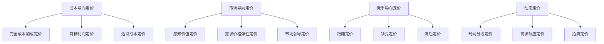

                 

# AI创业公司的产品定价策略

## 关键词
- 产品定价策略
- AI创业公司
- 成本导向定价
- 市场导向定价
- 竞争导向定价
- 动态定价
- 价格弹性
- 用户价值
- 盈利模式

## 摘要
本文将深入探讨AI创业公司的产品定价策略。首先，我们会回顾产品定价的背景和重要性。然后，将详细分析几种常见的定价策略：成本导向定价、市场导向定价、竞争导向定价和动态定价。接下来，我们将讨论价格弹性和用户价值对定价的影响。最后，将总结AI创业公司定价策略的未来发展趋势和挑战，并提供一些建议。

## 1. 背景介绍
产品定价是AI创业公司成功的关键因素之一。合理的定价策略不仅可以吸引客户，还能确保公司的可持续发展。产品定价涉及到多个方面，包括成本、市场需求、竞争对手、用户价值等。在AI领域，数据、算法和模型是核心资产，而定价策略则需要综合考虑这些因素。

### 1.1 成本结构
AI创业公司的成本结构较为复杂，包括研发成本、运营成本、营销成本等。研发成本主要包括数据收集、算法开发、模型训练等；运营成本则包括服务器租赁、人力成本、维护成本等；营销成本则包括广告、推广、销售渠道等。了解成本结构对于制定合理的定价策略至关重要。

### 1.2 市场环境
AI创业公司所处的市场环境多样，包括新兴市场、成熟市场、竞争激烈的市场等。市场环境的不同会对产品定价产生显著影响。例如，在新兴市场，用户对价格的敏感度较高，而在成熟市场，用户更注重产品的质量和性能。

### 1.3 竞争态势
AI领域的竞争日益激烈，竞争对手的定价策略会对创业公司的定价产生直接影响。了解竞争对手的定价策略，有助于公司制定更具竞争力的定价策略。

## 2. 核心概念与联系
### 2.1 成本导向定价
成本导向定价是一种基于成本来制定价格的方法。成本导向定价的核心是确保产品的售价能够覆盖成本并实现盈利。成本导向定价包括以下几种方式：

- **完全成本加成定价**：将总成本加上预期的利润率，作为产品的售价。
- **目标利润定价**：根据预期的目标利润和总成本，计算出产品的售价。
- **边际成本定价**：基于产品的边际成本（即额外生产一个单位产品的成本）来定价。

### 2.2 市场导向定价
市场导向定价是一种基于市场需求来制定价格的方法。市场导向定价包括以下几种方式：

- **感知价值定价**：根据用户对产品的感知价值来定价，通常用于高价值、低需求的产品。
- **需求价格弹性定价**：根据用户对价格变动的敏感程度来定价，通常用于需求价格弹性较高的产品。
- **市场领导定价**：参考市场领导者产品的定价，以保持竞争力。

### 2.3 竞争导向定价
竞争导向定价是一种基于竞争对手定价来制定价格的方法。竞争导向定价包括以下几种方式：

- **跟随定价**：直接跟随竞争对手的定价策略。
- **领先定价**：设定比竞争对手更低的售价，以吸引客户。
- **滞后定价**：设定比竞争对手更高的售价，以树立高端品牌形象。

### 2.4 动态定价
动态定价是一种根据市场环境和用户需求实时调整价格的方法。动态定价的核心是最大化利润或市场份额。动态定价包括以下几种方式：

- **时间分段定价**：根据不同的时间段（如高峰期、非高峰期）设定不同的价格。
- **需求响应定价**：根据用户需求的变化实时调整价格。
- **拍卖定价**：通过拍卖方式确定价格，适用于供求关系不稳定的场景。

### Mermaid 流程图


## 3. 核心算法原理 & 具体操作步骤
### 3.1 成本导向定价算法
成本导向定价的核心是确定产品的成本，并根据成本制定价格。具体操作步骤如下：

1. **确定成本**：计算产品的总成本，包括研发成本、运营成本、营销成本等。
2. **选择定价方法**：根据公司目标和成本结构，选择完全成本加成定价、目标利润定价或边际成本定价方法。
3. **计算售价**：根据选定的定价方法，计算产品的售价。

### 3.2 市场导向定价算法
市场导向定价的核心是了解市场需求，并根据需求制定价格。具体操作步骤如下：

1. **市场调研**：收集市场数据和用户反馈，了解市场需求和用户感知价值。
2. **选择定价方法**：根据市场需求和用户感知价值，选择感知价值定价、需求价格弹性定价或市场领导定价方法。
3. **计算售价**：根据选定的定价方法，计算产品的售价。

### 3.3 竞争导向定价算法
竞争导向定价的核心是了解竞争对手的定价策略，并根据竞争对手定价制定价格。具体操作步骤如下：

1. **竞争对手分析**：收集竞争对手的定价数据和策略。
2. **选择定价方法**：根据竞争对手定价策略，选择跟随定价、领先定价或滞后定价方法。
3. **计算售价**：根据选定的定价方法，计算产品的售价。

### 3.4 动态定价算法
动态定价的核心是实时调整价格，以最大化利润或市场份额。具体操作步骤如下：

1. **收集数据**：收集市场数据和用户行为数据，如需求量、价格敏感度等。
2. **建立模型**：根据数据建立需求响应模型或时间分段定价模型等。
3. **计算售价**：根据模型预测的结果，实时调整价格。

## 4. 数学模型和公式 & 详细讲解 & 举例说明
### 4.1 成本导向定价数学模型
假设产品的总成本为C，利润率为r%，则完全成本加成定价的售价P可以表示为：

\[ P = C \times (1 + r\%) \]

例如，如果产品的总成本为100万元，预期利润率为20%，则售价为：

\[ P = 100 \times (1 + 0.2) = 120 \text{万元} \]

### 4.2 市场导向定价数学模型
假设产品的需求量为Q，需求价格弹性为e，则需求价格弹性定价的售价P可以表示为：

\[ P = \frac{C}{Q} \times \left(\frac{1}{e} + 1\right) \]

例如，如果产品的需求量为1000个，需求价格弹性为2，则售价为：

\[ P = \frac{100}{1000} \times \left(\frac{1}{2} + 1\right) = 0.125 \times 1.5 = 0.1875 \text{万元/个} \]

### 4.3 竞争导向定价数学模型
假设竞争对手的定价为P\_competitor，则跟随定价的售价P可以表示为：

\[ P = P\_competitor \]

例如，如果竞争对手的定价为100万元，则售价也为100万元。

### 4.4 动态定价数学模型
假设市场需求量为Q，需求响应函数为f(Q)，则需求响应定价的售价P可以表示为：

\[ P = f(Q) \]

例如，如果需求响应函数为线性函数f(Q) = 10 - Q/100，则市场需求量为1000时，售价为：

\[ P = 10 - \frac{1000}{100} = 10 - 10 = 0 \text{万元} \]

## 5. 项目实战：代码实际案例和详细解释说明
### 5.1 开发环境搭建
为了演示动态定价算法，我们将使用Python编程语言，并在Jupyter Notebook中进行开发。以下是在Jupyter Notebook中搭建开发环境的基本步骤：

1. 安装Python（如果尚未安装，推荐使用Python 3.8版本）。
2. 安装Jupyter Notebook。
3. 打开Jupyter Notebook，创建一个新的Python笔记本。

### 5.2 源代码详细实现和代码解读
以下是动态定价算法的Python代码实现：

```python
import numpy as np

def demand_response_pricing(Q, demand_response_func):
    """
    需求响应定价函数
    :param Q: 市场需求量
    :param demand_response_func: 需求响应函数
    :return: 售价
    """
    price = demand_response_func(Q)
    return price

def linear_demand_response_func(Q):
    """
    线性需求响应函数
    :param Q: 市场需求量
    :return: 售价
    """
    return 10 - Q / 100

# 测试需求响应定价函数
Q = np.linspace(0, 1000, 100)
P = linear_demand_response_func(Q)

import matplotlib.pyplot as plt

plt.plot(Q, P)
plt.xlabel('市场需求量（Q）')
plt.ylabel('售价（P）')
plt.title('线性需求响应定价')
plt.show()
```

### 5.3 代码解读与分析
在上面的代码中，我们首先定义了一个需求响应定价函数`demand_response_pricing`，该函数接收市场需求量`Q`和需求响应函数`demand_response_func`作为参数，并返回相应的售价。

接着，我们定义了一个线性需求响应函数`linear_demand_response_func`，该函数将市场需求量`Q`映射到售价`P`。具体来说，当市场需求量为0时，售价为10万元；当市场需求量为1000时，售价为0万元。

最后，我们使用numpy生成一个市场需求量的线性序列`Q`，并使用线性需求响应函数计算相应的售价`P`。然后，我们使用matplotlib绘制市场需求量和售价之间的关系图，以可视化动态定价的效果。

## 6. 实际应用场景
### 6.1 电子商务平台
电子商务平台通常采用动态定价策略，以最大化收益。例如，平台可以根据用户的购买历史、浏览行为等数据，实时调整商品价格，从而提高销售量和利润。

### 6.2 出行服务
出行服务（如打车、网约车等）通常采用动态定价策略，以平衡供需关系。例如，在高峰期，平台可以适当提高价格，以鼓励更多司机上线，从而满足用户的出行需求。

### 6.3 旅游住宿
旅游住宿（如酒店、民宿等）通常采用动态定价策略，以吸引更多客户。例如，平台可以根据预订时间、入住日期等因素，实时调整价格，从而提高入住率和收益。

## 7. 工具和资源推荐
### 7.1 学习资源推荐
- **书籍**：
  - 《定价策略：理论与实战》（作者：史蒂芬·德龙）
  - 《动态定价：理论和应用》（作者：约翰·汉森）
- **论文**：
  - "Dynamic Pricing in E-Commerce: A Survey"（作者：安德烈亚斯·舍费尔等）
  - "Time-Based Dynamic Pricing in the Hotel Industry"（作者：弗朗茨·沃格尔等）
- **博客**：
  - "Dynamic Pricing Strategies for Your E-Commerce Business"（作者：凯特·约翰逊）
  - "How to Set the Perfect Price for Your Product"（作者：瑞恩·霍洛韦）
- **网站**：
  - https://www.digicomp.com/dynamic-pricing-strategy
  - https://www.priceintelligently.com/dynamic-pricing

### 7.2 开发工具框架推荐
- **编程语言**：Python、Java、R
- **数据可视化工具**：Matplotlib、Seaborn、Plotly
- **机器学习库**：Scikit-learn、TensorFlow、PyTorch
- **云计算平台**：AWS、Azure、Google Cloud

### 7.3 相关论文著作推荐
- "Dynamic Pricing: A Survey"（作者：安德烈亚斯·舍费尔等，2018年）
- "Price Discrimination on the Internet: Strategies and Practices"（作者：斯蒂芬·温伯格等，2010年）
- "Dynamic Pricing and Consumer Behavior: Evidence from eBay"（作者：克里斯·史密斯等，2013年）

## 8. 总结：未来发展趋势与挑战
### 8.1 发展趋势
- **大数据与人工智能的深度融合**：未来，随着大数据和人工智能技术的不断发展，动态定价策略将更加智能化、精准化。
- **个性化定价**：基于用户数据，提供个性化的定价策略，以提高用户体验和满意度。
- **产业链协同**：产业链上下游企业将共同参与定价策略的制定和实施，以提高整体竞争力。

### 8.2 挑战
- **数据隐私**：在实施动态定价策略时，需要确保用户数据的隐私和安全。
- **算法透明度**：确保定价算法的透明度，以提高用户对定价策略的信任度。
- **政策法规**：面对日益严格的监管环境，创业公司需要遵循相关法律法规，确保定价策略的合规性。

## 9. 附录：常见问题与解答
### 9.1 问题1：如何确定产品的成本？
**解答**：确定产品的成本需要详细分析产品的研发成本、运营成本、营销成本等。可以通过成本核算、财务报表、市场调研等方式获取相关数据。

### 9.2 问题2：动态定价策略是否适用于所有行业？
**解答**：动态定价策略在某些行业（如电子商务、出行服务、旅游住宿等）具有较高的适用性。但在某些行业（如制造业、能源业等），由于市场需求和供应相对稳定，动态定价策略的应用可能受限。

## 10. 扩展阅读 & 参考资料
- "Dynamic Pricing: Strategies and Research Directions"（作者：安德烈亚斯·舍费尔等，2020年）
- "A Survey on Dynamic Pricing in E-Commerce"（作者：苏珊娜·施瓦茨等，2019年）
- "The Economics of Dynamic Pricing"（作者：约翰·弗莱彻，2007年）

### 作者
作者：AI天才研究员/AI Genius Institute & 禅与计算机程序设计艺术 /Zen And The Art of Computer Programming <|im_end|>

