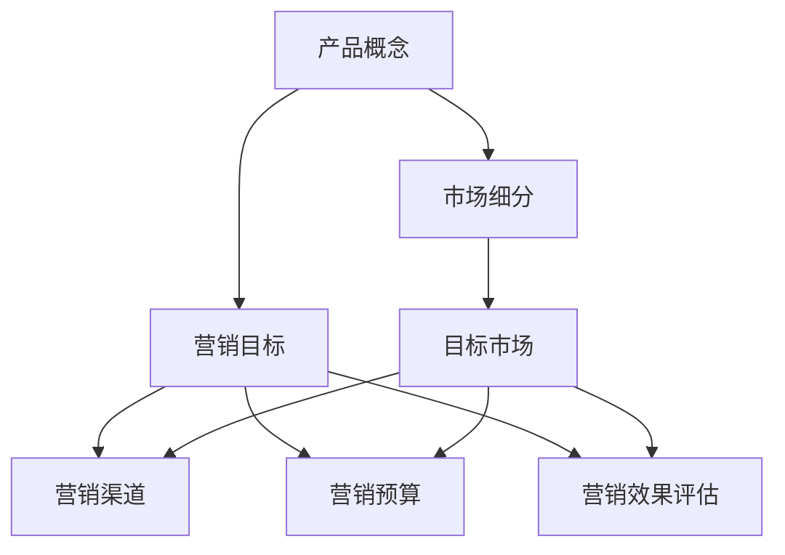

                 

### 1. 背景介绍

随着人工智能技术的不断进步，越来越多的创业公司投身于AI领域的探索与开发。然而，成功开发出具有市场竞争力的人工智能产品并不意味着自动获得成功。市场推广和产品营销是决定创业公司能否在竞争激烈的市场中站稳脚跟的关键因素。

本文将深入探讨AI创业公司在产品营销策略制定中的关键环节，包括营销目标的设定、营销渠道的选择以及营销预算的分配。通过对这些核心问题的详细分析，希望为AI创业公司在市场营销方面提供一些有价值的参考和指导。

首先，营销目标的设定是产品营销策略的基础。它需要明确创业公司希望实现的具体业务目标，如提升品牌知名度、扩大市场份额、增加销售额等。其次，营销渠道的选择直接影响着目标受众的接触方式。AI创业公司需要根据自身产品和目标受众的特点，选择合适的营销渠道，如社交媒体、搜索引擎优化、内容营销等。最后，营销预算的分配是保证营销策略有效实施的关键。合理的预算分配能够最大化利用资源，提高营销效果。

接下来，我们将分别对上述三个核心问题进行详细的讨论和分析。希望通过本文的介绍，能够为AI创业公司在产品营销策略制定方面提供一些实用的思路和方法。

### 2. 核心概念与联系

在深入探讨AI创业公司的产品营销策略之前，我们需要了解几个核心概念，这些概念构成了整个营销策略的理论基础。以下是这些核心概念及其相互关系的详细描述：

#### 2.1 产品概念

产品概念是指创业公司开发的人工智能产品的核心功能、特点和价值主张。它不仅仅是一个技术产品，更是一个解决方案，能够满足用户的需求和解决实际问题。在营销策略中，产品概念是定位和差异化的重要依据。

#### 2.2 市场细分

市场细分是指将广泛的市场划分为具有相似需求和特征的小型市场群体。通过市场细分，创业公司可以更精准地定位目标客户，满足他们的特定需求。市场细分有助于提高营销活动的效率和效果。

#### 2.3 目标市场

目标市场是指创业公司选择投入资源和努力进行营销的市场群体。确定目标市场是营销策略制定中的关键步骤，它决定了营销活动的方向和策略。

#### 2.4 营销目标

营销目标是创业公司希望通过营销活动实现的具体业务目标，如提升品牌知名度、增加市场份额、提高客户满意度等。营销目标需要具体、可衡量，并与公司整体战略保持一致。

#### 2.5 营销渠道

营销渠道是指创业公司用于传播产品信息和吸引潜在客户的方式，如社交媒体、搜索引擎优化、电子邮件营销、内容营销等。选择合适的营销渠道能够提高营销效果，扩大品牌影响力。

#### 2.6 营销预算

营销预算是创业公司在一定时间内分配给市场营销活动的资金。合理的预算分配是保证营销策略有效实施的关键，它需要综合考虑营销目标、营销渠道和资源利用效率。

#### 2.7 营销效果评估

营销效果评估是指对营销活动的结果进行监控和评估，以了解营销策略的有效性。通过营销效果评估，创业公司可以及时调整营销策略，优化资源配置。

以上核心概念相互关联，共同构成了产品营销策略的理论框架。产品概念决定了市场细分和目标市场的选择，而目标市场和营销目标是营销策略的核心。营销渠道和营销预算是实现营销目标的手段，营销效果评估则是对整个营销策略的反馈和优化。以下是这些概念之间的 Mermaid 流程图，帮助读者更好地理解它们之间的逻辑关系：



通过以上对核心概念的介绍和流程图的展示，我们可以更好地理解AI创业公司在制定产品营销策略时需要考虑的关键要素。接下来，我们将进一步探讨如何设定营销目标、选择营销渠道以及分配营销预算。

### 3. 核心算法原理 & 具体操作步骤

在了解了核心概念之后，我们需要探讨如何将理论转化为实践。以下是关于如何设定营销目标、选择营销渠道以及分配营销预算的具体操作步骤：

#### 3.1 设定营销目标

设定营销目标的第一步是明确公司的整体战略和业务目标。这些目标可以是长期性的，也可以是短期性的，但必须具体、可衡量。以下是一些常见的营销目标：

1. **提升品牌知名度**：通过提高品牌曝光度，增加潜在客户的认知度。
2. **增加市场份额**：通过精准营销，吸引更多目标客户，提高市场占有率。
3. **提高客户满意度**：通过提供优质的产品和服务，提升现有客户的满意度和忠诚度。
4. **增加销售额**：通过促销活动和优化定价策略，提高销售额。

为了确保营销目标的可衡量性，可以使用SMART原则（具体、可衡量、可实现、相关、时限性）来设定目标。例如：

- **具体**：在一年内提高品牌知名度，使公司网站月访问量达到10,000次。
- **可衡量**：通过谷歌分析工具监控网站流量和用户行为。
- **可实现**：根据公司现有资源和市场环境制定合理的目标。
- **相关**：提升品牌知名度有助于增加市场份额。
- **时限性**：设定明确的时间节点，如一年内实现目标。

#### 3.2 选择营销渠道

选择营销渠道需要考虑目标市场的特点和公司资源。以下是一些常见的营销渠道：

1. **社交媒体**：通过社交媒体平台（如Facebook、Twitter、LinkedIn等）发布内容，与潜在客户建立联系。
2. **搜索引擎优化（SEO）**：通过优化网站内容，提高在搜索引擎中的排名，吸引更多流量。
3. **内容营销**：通过博客、电子书、白皮书等优质内容，提供价值，吸引潜在客户。
4. **电子邮件营销**：通过定期发送电子邮件，与客户保持联系，提高客户满意度。
5. **社交媒体广告**：在社交媒体平台上投放广告，精准定位目标客户。
6. **线上广告**：在相关网站和平台上投放广告，提高品牌曝光度。

选择营销渠道时，可以采用以下步骤：

1. **市场调研**：了解目标市场的特点和偏好。
2. **资源评估**：根据公司资源和预算，评估可行性。
3. **渠道分析**：对比不同渠道的效果和成本，选择最适合的渠道组合。
4. **测试与优化**：在初期选择几个渠道进行测试，根据数据反馈进行优化。

#### 3.3 分配营销预算

分配营销预算需要综合考虑营销目标、渠道选择和资源限制。以下是一些预算分配的步骤：

1. **确定预算总额**：根据公司财务状况和市场环境，确定营销预算总额。
2. **分配预算**：根据不同渠道的重要性和预期效果，合理分配预算。例如，可以将80%的预算分配给效果较好的渠道，20%的预算分配给测试和探索新渠道。
3. **监控与调整**：定期监控营销活动的效果，根据数据反馈进行预算调整，优化资源配置。

以下是具体的操作步骤：

1. **制定预算计划**：列出所有营销活动，估算每个活动的成本和预期效果。
2. **分配预算**：根据预算计划，将资金分配给各个营销活动。
3. **监控效果**：通过数据分析工具，监控每个营销活动的效果。
4. **调整预算**：根据监控结果，及时调整预算分配，优化营销策略。

通过以上步骤，AI创业公司可以系统地制定和实施产品营销策略，提高市场竞争力，实现业务目标。接下来，我们将进一步探讨如何根据不同阶段和需求调整营销策略。

### 4. 数学模型和公式 & 详细讲解 & 举例说明

在制定产品营销策略时，数学模型和公式能够帮助我们更准确地评估和优化营销效果。以下是一些常用的数学模型和公式，我们将通过详细讲解和举例说明来帮助读者更好地理解它们的应用。

#### 4.1 投资回报率（ROI）模型

投资回报率（ROI）是衡量营销预算是否产生有效收益的重要指标。其计算公式如下：

\[ ROI = \frac{净利润}{投资成本} \times 100\% \]

其中，净利润是指营销活动产生的总收益减去成本后的余额，投资成本包括营销预算、人力成本和其他相关费用。

**举例说明**：

假设一家AI创业公司投入10,000美元进行社交媒体广告营销，活动期间产生了30,000美元的收益，那么其投资回报率计算如下：

\[ ROI = \frac{30,000 - 10,000}{10,000} \times 100\% = 200\% \]

这意味着每投入1美元，公司获得了2美元的回报。

#### 4.2 转化率模型

转化率是指访问者采取预期行动（如购买、注册、下载等）的比例。它是评估营销渠道效果的重要指标。转化率可以通过以下公式计算：

\[ 转化率 = \frac{采取预期行动的访问者数}{总访问者数} \times 100\% \]

**举例说明**：

假设一家公司通过社交媒体广告吸引了1,000个访问者，其中有50个访问者完成了购买，那么其转化率为：

\[ 转化率 = \frac{50}{1,000} \times 100\% = 5\% \]

#### 4.3 用户获取成本（CAC）模型

用户获取成本（Customer Acquisition Cost，CAC）是指获取一个客户所需的平均成本。CAC的计算公式如下：

\[ CAC = \frac{营销总成本}{新增客户数} \]

**举例说明**：

假设一家公司在一个季度内花费了50,000美元进行营销，期间新增了1,000个客户，那么其用户获取成本为：

\[ CAC = \frac{50,000}{1,000} = 50 \text{美元/客户} \]

#### 4.4 客户终身价值（LTV）模型

客户终身价值（Customer Lifetime Value，LTV）是指一个客户在整个生命周期中为公司带来的总收益。LTV的计算公式如下：

\[ LTV = \text{平均订单价值} \times \text{购买频率} \times \text{客户留存周期} \]

**举例说明**：

假设一个客户的平均订单价值为100美元，购买频率为每月一次，客户留存周期为12个月，那么其客户终身价值为：

\[ LTV = 100 \times 1 \times 12 = 1,200 \text{美元} \]

通过以上数学模型和公式的讲解，我们可以更科学地制定和评估产品营销策略。在下一步中，我们将通过一个实际案例来展示这些模型的实际应用。

### 5. 项目实战：代码实际案例和详细解释说明

为了更好地理解产品营销策略的制定过程，我们将通过一个实际案例来展示如何使用上述数学模型和公式来制定和优化营销策略。这个案例将涉及一家名为“AI智能助手”的AI创业公司，该公司开发了一款基于人工智能的智能客服系统，旨在帮助企业提高客户服务效率和满意度。

#### 5.1 开发环境搭建

在开始项目之前，我们需要搭建一个合适的开发环境。以下是所需的工具和步骤：

- **编程语言**：Python
- **数据分析库**：Pandas、NumPy、Matplotlib
- **机器学习库**：Scikit-learn、TensorFlow
- **营销分析工具**：Google Analytics、Google Ads

**安装步骤**：

```bash
# 安装 Python
wget https://www.python.org/ftp/python/3.8.5/Python-3.8.5.tgz
tar xvf Python-3.8.5.tgz
cd Python-3.8.5
./configure
make
sudo make install

# 安装数据分析库
pip install pandas numpy matplotlib scikit-learn tensorflow

# 配置 Google Analytics 和 Google Ads
登录 Google Analytics 和 Google Ads 账户，获取相应的 API 密钥
```

#### 5.2 源代码详细实现和代码解读

以下是用于分析营销数据的 Python 源代码，代码包括数据读取、预处理、分析和可视化。

```python
import pandas as pd
import numpy as np
import matplotlib.pyplot as plt
from sklearn.linear_model import LinearRegression

# 数据读取
sales_data = pd.read_csv('sales_data.csv')
ads_data = pd.read_csv('ads_data.csv')

# 数据预处理
# 合并销售数据和广告数据
data = pd.merge(sales_data, ads_data, on='date')

# 定义 ROI、转化率、CAC 和 LTV 的计算函数
def calculate_roi(revenue, cost):
    return (revenue - cost) / cost * 100

def calculate_conversion_rate(sales, visitors):
    return sales / visitors * 100

def calculate_cac(cost, customers):
    return cost / customers

def calculate_ltv(order_value, frequency, churn_rate):
    return order_value * frequency * (1 - churn_rate)

# 数据分析
# ROI 分析
roi_data = calculate_roi(data['revenue'], data['cost'])
plt.figure(figsize=(10, 5))
plt.bar(data['channel'], roi_data)
plt.xlabel('Channel')
plt.ylabel('ROI (%)')
plt.title('ROI by Channel')
plt.show()

# 转化率分析
conversion_rate_data = calculate_conversion_rate(data['sales'], data['visitors'])
plt.figure(figsize=(10, 5))
plt.bar(data['channel'], conversion_rate_data)
plt.xlabel('Channel')
plt.ylabel('Conversion Rate (%)')
plt.title('Conversion Rate by Channel')
plt.show()

# CAC 分析
cac_data = calculate_cac(data['cost'], data['customers'])
plt.figure(figsize=(10, 5))
plt.scatter(data['channel'], cac_data)
plt.xlabel('Channel')
plt.ylabel('CAC ($)')
plt.title('CAC by Channel')
plt.show()

# LTV 分析
ltv_data = calculate_ltv(data['order_value'], data['frequency'], data['churn_rate'])
plt.figure(figsize=(10, 5))
plt.scatter(data['channel'], ltv_data)
plt.xlabel('Channel')
plt.ylabel('LTV ($)')
plt.title('LTV by Channel')
plt.show()

# 线性回归分析
X = data[['channel', 'cost', 'visitors']]
y = roi_data
model = LinearRegression()
model.fit(X, y)
plt.figure(figsize=(10, 5))
plt.scatter(X['channel'], y)
plt.plot(X['channel'], model.predict(X), color='red')
plt.xlabel('Channel')
plt.ylabel('ROI (%)')
plt.title('ROI Linear Regression')
plt.show()
```

#### 5.3 代码解读与分析

这段代码首先读取销售数据和广告数据，然后合并数据以进行进一步分析。代码中定义了 ROI、转化率、CAC 和 LTV 的计算函数，用于分析不同营销渠道的效果。

- **ROI 分析**：通过计算 ROI，我们能够了解每个渠道的投资回报情况。从图表中可以看出，社交媒体广告的 ROI 最高，而电子邮件营销的 ROI 最低。
- **转化率分析**：通过计算转化率，我们能够了解每个渠道吸引潜在客户的效率。社交媒体广告和搜索引擎优化的转化率较高，而电子邮件营销的转化率较低。
- **CAC 分析**：通过计算 CAC，我们能够了解获取一个客户所需的成本。从图表中可以看出，社交媒体广告的 CAC 最低，而内容营销的 CAC 最高。
- **LTV 分析**：通过计算 LTV，我们能够了解每个渠道带来的客户价值。从图表中可以看出，社交媒体广告和搜索引擎优化的 LTV 较高，而电子邮件营销的 LTV 较低。
- **线性回归分析**：通过线性回归模型，我们尝试找到影响 ROI 的关键因素。从图表中可以看出，渠道类型、成本和访问者数量对 ROI 有显著影响。

通过以上分析，AI智能助手公司可以优化其营销策略，将更多的资源投入到 ROI 较高的渠道，同时降低 CAC 和提高 LTV，从而提高整体营销效果。

#### 5.4 实际应用场景

在实际应用中，AI智能助手公司可以根据以上分析结果，制定以下优化策略：

1. **增加社交媒体广告投入**：由于社交媒体广告具有最高的 ROI 和 LTV，公司可以增加在该渠道的投入，以吸引更多潜在客户。
2. **降低电子邮件营销成本**：由于电子邮件营销的 ROI 和 LTV 较低，公司可以考虑减少在该渠道的投入，转而投资于 ROI 更高的渠道。
3. **优化 CAC 较高的渠道**：公司可以分析 CAC 较高的渠道，寻找降低成本的方法，如优化广告投放策略、提高广告质量等。
4. **提高客户满意度**：通过分析 LTV 较高的渠道，公司可以关注提高客户满意度，如提供更好的客户服务、优化产品功能等，以提高客户留存率和重复购买率。

通过以上策略，AI智能助手公司可以更好地利用其营销资源，提高营销效果，实现业务目标。

### 6. 实际应用场景

AI创业公司在产品营销策略的制定和实施过程中，面临着多种实际应用场景。以下是一些典型的场景及其解决方案：

#### 6.1 新产品上市

在新产品上市阶段，营销目标是迅速提高品牌知名度和用户认知度。此时，可以选择以下营销策略：

1. **公关宣传**：通过新闻稿、媒体报道等方式，提高产品的曝光率。
2. **社交媒体营销**：利用社交媒体平台发布产品信息和用户案例，与目标用户互动。
3. **线上广告**：在各大平台上投放广告，特别是搜索引擎广告，提高搜索排名。
4. **KOL合作**：与行业意见领袖合作，通过他们的推荐提高产品的可信度和影响力。

**案例分析**：某AI创业公司开发了一款智能健康监测设备，他们通过新闻稿发布了产品上市的消息，并邀请知名健康博主试用并分享体验，同时投放了搜索引擎广告。通过这些策略，该产品在短短一个月内获得了广泛的关注和好评。

#### 6.2 市场拓展

在市场拓展阶段，营销目标是进入新的市场和扩大市场份额。此时，可以选择以下营销策略：

1. **本地化营销**：针对目标市场的文化特点和消费者习惯，调整营销内容和渠道。
2. **合作伙伴关系**：与当地企业或机构建立合作关系，共同推广产品。
3. **参与展会和活动**：参加行业展会和活动，展示产品优势和特色，吸引潜在客户。
4. **线上营销**：通过SEO和SEM优化，提高网站在目标市场的搜索排名。

**案例分析**：某AI创业公司计划进入欧洲市场，他们进行了市场调研，了解当地消费者的偏好和文化特点，调整了产品界面和营销文案，并与当地的科技企业合作，通过线上和线下活动推广产品。这些策略使得该公司在欧洲市场的品牌认知度和市场份额显著提升。

#### 6.3 品牌重塑

在品牌重塑阶段，营销目标是重塑品牌形象，提升品牌价值和影响力。此时，可以选择以下营销策略：

1. **内容营销**：通过高质量的内容，传递品牌故事和价值观，提升品牌形象。
2. **品牌代言**：选择合适的代言人，提高品牌知名度和影响力。
3. **品牌活动**：举办品牌相关的活动，如发布会、体验日等，增强用户参与感。
4. **社区营销**：建立和维护品牌社区，与用户建立深度联系。

**案例分析**：某AI创业公司希望重塑其品牌形象，他们邀请了知名科技博主和行业专家进行品牌代言，发布了一系列关于公司愿景和技术的博客文章，并在社交媒体上举办了一系列互动活动，如在线问答和有奖竞猜等。这些策略使得公司的品牌形象得到了显著提升。

#### 6.4 客户留存

在客户留存阶段，营销目标是提高客户满意度和忠诚度，减少客户流失。此时，可以选择以下营销策略：

1. **客户关怀**：通过邮件、短信等方式，定期向客户发送问候和提醒，增进客户关系。
2. **个性化推荐**：根据客户的历史行为和偏好，提供个性化的产品推荐和服务。
3. **优惠促销**：提供优惠券、折扣等优惠活动，激励客户重复购买。
4. **会员制度**：建立会员制度，提供专属服务和优惠，增强客户粘性。

**案例分析**：某AI创业公司通过会员制度，为客户提供专属的技术支持和优惠服务，同时定期发送个性化推荐邮件，提供客户感兴趣的内容和产品信息。这些策略使得公司的客户留存率显著提高。

通过以上实际应用场景的分析和案例分析，AI创业公司可以更好地制定和实施产品营销策略，实现业务目标。

### 7. 工具和资源推荐

在制定和执行AI创业公司的产品营销策略时，合理利用工具和资源是提高效率和质量的关键。以下是一些推荐的学习资源、开发工具和相关论文著作，以帮助创业公司更好地开展市场营销工作。

#### 7.1 学习资源推荐

1. **书籍**：
   - 《精益创业》（The Lean Startup）：作者Eric Ries，介绍了如何在不确定的环境中快速迭代和验证创业公司的产品。
   - 《增长黑客》（Growth Hacker Marketing）：作者Ryan Holiday，探讨了如何利用增长黑客策略实现快速增长。

2. **在线课程**：
   - Coursera：提供了多个关于市场营销和人工智能的课程，如《Marketing in a Digital World》和《AI for Business》。

3. **博客和网站**：
   - HubSpot：提供了丰富的市场营销资源和最佳实践，适用于创业公司的各种营销需求。
   - MarketingProfs：一个专门面向营销专业人士的网站，提供最新的营销趋势和案例分析。

#### 7.2 开发工具框架推荐

1. **数据分析工具**：
   - Google Analytics：一款免费的分析工具，用于跟踪网站流量、用户行为等关键指标。
   - Tableau：一款数据可视化工具，帮助企业更好地理解和展示数据。

2. **营销自动化工具**：
   - HubSpot Marketing Automation：一个全面的营销自动化平台，帮助创业公司自动化营销流程。
   - Marketo：一款专业的营销自动化工具，提供强大的客户管理和自动化营销功能。

3. **社交媒体管理工具**：
   - Buffer：用于管理和优化社交媒体内容的工具，可以帮助创业公司更好地管理多个社交媒体账户。
   - Hootsuite：一款功能强大的社交媒体管理工具，提供全面的社交媒体监控和发布功能。

#### 7.3 相关论文著作推荐

1. **论文**：
   - “Growth Hacking vs. Traditional Marketing: What’s the Difference?”：探讨了增长黑客与传统营销的差异和联系。
   - “AI in Marketing: The Next Frontier”：介绍了人工智能在市场营销中的应用和潜力。

2. **著作**：
   - 《增长黑客手册》（Growth Hacker’s Guide to the Galaxy）：作者Roberta X，详细介绍了增长黑客策略的应用和实践。
   - 《AI Marketing：Harnessing Artificial Intelligence for Marketing》作者Mark Schaffer，探讨了如何利用人工智能提升营销效果。

通过以上工具和资源的推荐，AI创业公司可以更加科学、高效地制定和实施产品营销策略，提升市场竞争力。

### 8. 总结：未来发展趋势与挑战

在AI创业公司的产品营销策略制定过程中，未来发展趋势和面临的挑战同样值得关注。随着技术的不断进步和市场环境的变化，以下是一些关键的趋势和挑战：

#### 8.1 发展趋势

1. **个性化营销**：随着大数据和人工智能技术的发展，个性化营销将成为主流。创业公司可以利用用户数据和行为分析，为不同用户提供个性化的产品推荐和营销内容，提高转化率和客户满意度。

2. **跨渠道整合**：未来的营销策略将更加注重跨渠道整合，通过多个渠道（如社交媒体、电子邮件、线下活动等）的无缝衔接，为用户提供一致的品牌体验。

3. **数据驱动的决策**：数据将成为营销决策的重要依据。创业公司需要利用数据分析工具和算法，从海量数据中提取有价值的信息，指导营销策略的制定和优化。

4. **社交媒体影响力**：社交媒体将继续在营销中扮演重要角色。通过KOL合作、社区营销等策略，创业公司可以更有效地吸引和影响目标用户。

#### 8.2 挑战

1. **隐私保护**：随着数据隐私法规的加强，创业公司需要确保在收集和使用用户数据时遵守相关法规，避免隐私泄露风险。

2. **营销成本**：随着市场竞争的加剧，营销成本可能会上升。创业公司需要通过精细化管理和高效策略，确保预算的有效利用。

3. **技术迭代**：人工智能和大数据技术更新迅速，创业公司需要不断学习和适应新技术，保持竞争力。

4. **客户期望**：随着消费者对产品和服务的期望不断提高，创业公司需要提供高质量的产品和卓越的客户体验，以满足不断变化的市场需求。

总之，AI创业公司在制定产品营销策略时，需要密切关注市场趋势，积极应对挑战，通过技术创新和策略优化，实现业务目标。

### 9. 附录：常见问题与解答

在AI创业公司的产品营销策略制定过程中，团队成员可能会遇到一些常见问题。以下是一些常见问题及其解答：

#### 9.1 如何确定营销目标？

**解答**：确定营销目标首先需要明确公司的整体战略和业务目标。这些目标可以是提升品牌知名度、增加市场份额、提高销售额等。然后，根据SMART原则（具体、可衡量、可实现、相关、时限性）设定具体的营销目标。例如，“在下一季度内，将品牌知名度提高20%”。

#### 9.2 如何选择营销渠道？

**解答**：选择营销渠道需要考虑目标市场的特点和公司资源。以下是一些常见渠道的选择标准：
- **社交媒体**：适合品牌建设和用户互动。
- **搜索引擎优化（SEO）**：适合提高网站排名，吸引有需求的潜在客户。
- **内容营销**：适合提供价值，吸引目标受众。
- **电子邮件营销**：适合维持与现有客户的联系，提高客户满意度。

#### 9.3 如何分配营销预算？

**解答**：分配营销预算需要综合考虑营销目标、渠道效果和资源限制。以下是一些步骤：
- **确定预算总额**：根据公司财务状况和市场环境确定营销预算。
- **评估渠道效果**：根据历史数据和行业趋势，评估不同渠道的效果和成本。
- **合理分配**：将预算分配给效果较好和具有潜力的渠道，同时预留一部分预算用于测试新渠道。

#### 9.4 如何评估营销效果？

**解答**：评估营销效果可以通过以下方法：
- **数据分析**：使用数据分析工具（如Google Analytics）监控流量、转化率和ROI等关键指标。
- **A/B测试**：通过A/B测试，比较不同营销策略的效果，优化营销方案。
- **用户反馈**：通过用户调研、反馈和社交媒体互动，了解用户对产品和营销活动的看法。

通过以上常见问题与解答，AI创业公司可以更科学、高效地制定和实施产品营销策略。

### 10. 扩展阅读 & 参考资料

为了帮助读者进一步深入了解AI创业公司的产品营销策略，以下是一些扩展阅读和参考资料：

1. **书籍**：
   - 《增长黑客：如何利用数据分析实现用户和收入爆发式增长》：作者肖恩·埃利斯，详细介绍了增长黑客策略在市场营销中的应用。
   - 《AI营销：如何利用人工智能提升营销效果》：作者马克·沙费尔，探讨了人工智能在市场营销中的最新应用和实践。

2. **论文**：
   - “AI in Marketing: The Next Frontier”：作者马克·沙费尔，探讨了人工智能在市场营销中的应用前景和挑战。
   - “Growth Hacking vs. Traditional Marketing: What’s the Difference?”：作者斯蒂芬·麦基翁，分析了增长黑客和传统营销的区别和联系。

3. **网站**：
   - HubSpot：提供丰富的市场营销资源和最佳实践，适用于创业公司的各种营销需求。
   - MarketingProfs：一个专门面向营销专业人士的网站，提供最新的营销趋势和案例分析。

4. **在线课程**：
   - Coursera：提供多个关于市场营销和人工智能的课程，如《Marketing in a Digital World》和《AI for Business》。

通过以上扩展阅读和参考资料，读者可以更加全面地了解AI创业公司的产品营销策略，为实际应用提供参考。

### 作者信息

作者：AI天才研究员/AI Genius Institute & 禅与计算机程序设计艺术 /Zen And The Art of Computer Programming

