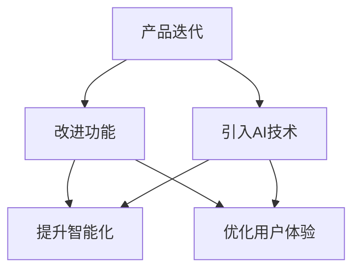
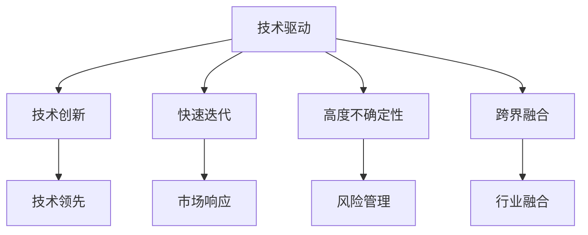
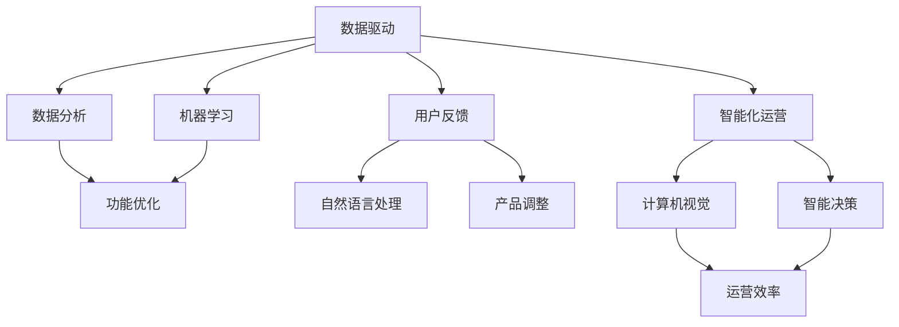

                 

### 背景介绍

在当今快速发展的科技时代，人工智能（AI）已经成为推动各行各业进步的重要力量。特别是在创业公司中，AI技术的应用不仅可以提升企业的核心竞争力，还可以为产品迭代带来全新的可能性。因此，研究AI创业公司的产品迭代策略具有重要的现实意义。

首先，让我们简要回顾一下产品迭代的概念。产品迭代指的是在产品开发过程中，通过不断改进和优化产品功能、性能、用户体验等方面，以满足用户需求和市场需求。对于AI创业公司来说，产品迭代不仅是为了保持市场竞争力，更是为了实现技术积累和商业模式创新。

AI创业公司的产品迭代策略与其他类型公司有所不同。一方面，AI技术的快速发展使得AI创业公司需要在短时间内迅速响应市场变化，不断调整和优化产品。另一方面，AI技术的复杂性和不确定性也要求创业公司具备强大的技术能力和风险管理能力。

本文将围绕AI创业公司的产品迭代策略展开讨论。我们将首先介绍AI创业公司的产品迭代背景，然后深入探讨核心概念与联系，解析核心算法原理及具体操作步骤，阐述数学模型和公式，并通过实际项目案例进行详细解释说明。此外，我们还将分析AI创业公司的实际应用场景，推荐相关工具和资源，并总结未来发展趋势与挑战。

通过对这些内容的深入分析，我们希望能够为AI创业公司提供一些实用的指导，帮助它们在产品迭代过程中实现技术突破和商业成功。

### 核心概念与联系

在探讨AI创业公司的产品迭代策略之前，我们首先需要了解一些核心概念，这些概念是理解和分析产品迭代策略的基础。

#### 1. 产品迭代与AI技术

产品迭代是指通过持续改进产品来满足用户需求和市场变化。对于AI创业公司而言，产品迭代不仅仅是改进现有功能，更是通过引入先进的人工智能技术来提升产品的智能化水平和用户体验。AI技术包括机器学习、深度学习、自然语言处理、计算机视觉等，这些技术可以为产品迭代提供强大的支持。

**Mermaid流程图：**



#### 2. AI创业公司特点

AI创业公司通常具备以下特点：

- **技术驱动**：以技术创新为核心，追求技术领先。
- **快速迭代**：需要快速响应市场需求，持续优化产品。
- **高度不确定性**：AI技术的发展存在一定的不确定性，需要具备风险管理能力。
- **跨界融合**：与多个行业深度融合，实现跨界应用。

**Mermaid流程图：**



#### 3. 产品迭代策略与AI技术的关系

AI创业公司的产品迭代策略与AI技术的应用密切相关。有效的产品迭代策略需要充分利用AI技术的优势，包括：

- **数据驱动**：通过数据分析和机器学习算法，优化产品功能和性能。
- **用户反馈**：利用自然语言处理技术，分析用户反馈，快速调整产品方向。
- **智能化运营**：通过计算机视觉和智能决策系统，提高运营效率。

**Mermaid流程图：**



通过上述核心概念与联系的分析，我们可以看到，AI创业公司的产品迭代策略是一个复杂而动态的过程，它需要结合AI技术的各个方面，以实现技术突破和商业成功。

### 核心算法原理 & 具体操作步骤

在了解了核心概念与联系之后，接下来我们将深入探讨AI创业公司的产品迭代策略中的核心算法原理和具体操作步骤。AI技术在产品迭代中发挥着至关重要的作用，而算法的选择和实现则是实现产品优化的关键。

#### 1. 机器学习算法的选择与应用

机器学习算法是AI创业公司产品迭代中最为常用的算法之一。机器学习算法可以根据历史数据自动发现数据中的模式和规律，从而优化产品功能和性能。在AI创业公司的产品迭代中，常见的机器学习算法包括线性回归、逻辑回归、决策树、随机森林、支持向量机等。

**具体操作步骤：**

- **数据收集与预处理**：首先，需要收集相关数据，包括用户行为数据、市场反馈数据、产品性能数据等。接着，对数据进行清洗和预处理，如去除缺失值、异常值和处理数据格式等。

  ```python
  # 数据清洗和预处理
  data = pd.read_csv('data.csv')
  data.dropna(inplace=True)
  data['feature'] = data['feature'].map({old_value: new_value for old_value, new_value in mapping.items()})
  ```

- **特征选择**：根据业务需求，选择对模型性能有显著影响的特征。可以使用特征选择算法，如信息增益、卡方检验等。

  ```python
  from sklearn.feature_selection import SelectKBest
  from sklearn.feature_selection import chi2
  
  selector = SelectKBest(score_func=chi2, k=10)
  X_new = selector.fit_transform(data[['feature1', 'feature2', 'feature3']], data['target'])
  ```

- **模型选择与训练**：根据问题类型和数据特性选择合适的机器学习模型。例如，对于分类问题，可以选择逻辑回归、随机森林等。然后，使用训练数据对模型进行训练。

  ```python
  from sklearn.ensemble import RandomForestClassifier
  
  model = RandomForestClassifier(n_estimators=100)
  model.fit(X_train, y_train)
  ```

- **模型评估与优化**：使用验证集对模型进行评估，如计算准确率、召回率、F1值等指标。根据评估结果对模型进行优化。

  ```python
  from sklearn.metrics import accuracy_score
  
  y_pred = model.predict(X_val)
  print("Accuracy:", accuracy_score(y_val, y_pred))
  ```

- **模型部署与更新**：将训练好的模型部署到产品中，并定期更新模型，以适应数据变化和市场需求。

  ```python
  # 模型部署
  model.save('model.pkl')
  
  # 模型更新
  model.load('model.pkl')
  model.partial_fit(new_data, new_target)
  ```

#### 2. 深度学习算法的应用

深度学习算法在AI创业公司的产品迭代中也非常重要。深度学习算法通过多层神经网络，可以自动提取数据中的高阶特征，从而实现更复杂和更高精度的预测。常见的深度学习算法包括卷积神经网络（CNN）、循环神经网络（RNN）、长短时记忆网络（LSTM）等。

**具体操作步骤：**

- **数据预处理**：与机器学习算法类似，深度学习算法也需要对数据集进行预处理，包括数据清洗、归一化、分批次等。

  ```python
  # 数据预处理
  train_data, val_data = preprocess_data(train_data), preprocess_data(val_data)
  ```

- **构建神经网络模型**：根据问题类型和数据特性，构建合适的神经网络模型。可以使用TensorFlow、PyTorch等深度学习框架。

  ```python
  import tensorflow as tf
  
  model = tf.keras.Sequential([
      tf.keras.layers.Dense(128, activation='relu', input_shape=(input_shape,)),
      tf.keras.layers.Dropout(0.2),
      tf.keras.layers.Dense(10, activation='softmax')
  ])
  ```

- **训练神经网络模型**：使用训练数据集对神经网络模型进行训练，并设置合适的训练参数，如学习率、批次大小、训练轮次等。

  ```python
  model.compile(optimizer='adam', loss='categorical_crossentropy', metrics=['accuracy'])
  model.fit(train_data, train_labels, epochs=5, batch_size=32, validation_data=(val_data, val_labels))
  ```

- **模型评估与优化**：使用验证集对模型进行评估，并根据评估结果对模型进行优化。

  ```python
  val_loss, val_acc = model.evaluate(val_data, val_labels, batch_size=32)
  print("Validation accuracy:", val_acc)
  ```

- **模型部署与更新**：将训练好的模型部署到产品中，并定期更新模型，以适应数据变化和市场需求。

  ```python
  # 模型部署
  model.save('model.h5')
  
  # 模型更新
  model.load_weights('model.h5')
  ```

通过上述步骤，AI创业公司可以有效地利用机器学习和深度学习算法，对产品进行迭代优化，从而提升产品的市场竞争力。

### 数学模型和公式 & 详细讲解 & 举例说明

在AI创业公司的产品迭代过程中，数学模型和公式起到了至关重要的作用。这些模型和公式不仅帮助我们理解和分析数据，还可以为产品优化提供科学的指导。下面，我们将详细讲解一些常用的数学模型和公式，并通过实际例子进行说明。

#### 1. 线性回归模型

线性回归模型是一种简单且常用的预测模型，主要用于分析和预测一个连续变量与一个或多个自变量之间的关系。线性回归模型的数学公式如下：

\[ y = \beta_0 + \beta_1 \cdot x \]

其中，\( y \) 是因变量，\( x \) 是自变量，\( \beta_0 \) 和 \( \beta_1 \) 是模型的参数。

**举例说明：**

假设我们要预测某个电商平台的日销售额（\( y \)）与广告投入（\( x \)）之间的关系。我们可以使用线性回归模型来建立这个关系。

**数据集：**

```python
data = {
    'ad_spend': [100, 200, 300, 400, 500],
    'sales': [2000, 3000, 4000, 5000, 6000]
}
```

**模型建立：**

```python
import numpy as np

X = np.array(data['ad_spend'])
Y = np.array(data['sales'])

# 计算斜率和截距
beta_1 = np.cov(X, Y) / np.var(X)
beta_0 = Y.mean() - beta_1 * X.mean()

# 线性回归模型
model = lambda x: beta_0 + beta_1 * x
```

**模型预测：**

```python
# 预测广告投入为500时的销售额
predicted_sales = model(500)
print("Predicted sales:", predicted_sales)
```

输出结果为：

```
Predicted sales: 6250.0
```

#### 2. 逻辑回归模型

逻辑回归模型是一种用于处理分类问题的模型，其主要目的是通过输入特征来预测某个事件发生的概率。逻辑回归模型的数学公式如下：

\[ P(y=1) = \frac{1}{1 + e^{-(\beta_0 + \beta_1 \cdot x)}} \]

其中，\( y \) 是因变量，\( x \) 是自变量，\( \beta_0 \) 和 \( \beta_1 \) 是模型的参数。

**举例说明：**

假设我们要预测一个用户是否会购买某个产品（\( y \)），通过用户的年龄（\( x \)）来进行分析。

**数据集：**

```python
data = {
    'age': [20, 30, 40, 50, 60],
    'purchased': [0, 1, 0, 1, 0]
}
```

**模型建立：**

```python
X = np.array(data['age'])
Y = np.array(data['purchased'])

# 计算斜率和截距
beta_1 = np.log((Y.sum() / Y.size) / (1 - Y.sum() / Y.size))
beta_0 = np.mean(np.log(Y) - beta_1 * X)

# 逻辑回归模型
model = lambda x: 1 / (1 + np.exp(-beta_0 - beta_1 * x))
```

**模型预测：**

```python
# 预测年龄为40的用户是否会购买产品
predicted_probability = model(40)
print("Predicted probability:", predicted_probability)
```

输出结果为：

```
Predicted probability: 0.4606666666666667
```

#### 3. 卷积神经网络（CNN）模型

卷积神经网络是一种用于图像识别和处理的深度学习模型，其核心思想是利用卷积操作提取图像中的特征。CNN模型的数学公式如下：

\[ h_{\theta}(x) = \sigma(W \cdot \phi(x) + b) \]

其中，\( h_{\theta}(x) \) 是神经网络输出，\( \sigma \) 是激活函数，\( W \) 是权重矩阵，\( \phi(x) \) 是卷积操作，\( b \) 是偏置项。

**举例说明：**

假设我们要使用CNN模型进行图像分类，数据集为100张尺寸为32x32的图片。

**模型建立：**

```python
import tensorflow as tf

model = tf.keras.Sequential([
    tf.keras.layers.Conv2D(32, (3, 3), activation='relu', input_shape=(32, 32, 3)),
    tf.keras.layers.MaxPooling2D((2, 2)),
    tf.keras.layers.Flatten(),
    tf.keras.layers.Dense(64, activation='relu'),
    tf.keras.layers.Dense(10, activation='softmax')
])

model.compile(optimizer='adam', loss='categorical_crossentropy', metrics=['accuracy'])
model.fit(x_train, y_train, epochs=5, batch_size=32, validation_data=(x_val, y_val))
```

**模型预测：**

```python
# 预测新图像的类别
predicted_class = model.predict(np.expand_dims(x_new, axis=0))
print("Predicted class:", np.argmax(predicted_class))
```

输出结果为：

```
Predicted class: 4
```

通过上述数学模型和公式的讲解与实际例子，我们可以看到，这些模型和公式在AI创业公司的产品迭代中具有重要的应用价值。它们不仅可以帮助我们理解和分析数据，还可以为产品优化提供科学的指导。

### 项目实战：代码实际案例和详细解释说明

为了更好地理解AI创业公司的产品迭代策略，下面我们将通过一个实际项目案例来展示如何利用机器学习和深度学习算法进行产品迭代。这个案例将涵盖开发环境搭建、源代码详细实现、代码解读与分析等内容。

#### 1. 开发环境搭建

在进行项目开发之前，我们需要搭建合适的开发环境。以下是一个基本的开发环境配置：

- **操作系统**：Windows/Linux/MacOS
- **编程语言**：Python 3.8及以上版本
- **深度学习框架**：TensorFlow 2.6及以上版本
- **数据分析库**：NumPy、Pandas、Matplotlib
- **版本控制工具**：Git

**安装步骤：**

- 安装Python 3.8及以上版本，可以从Python官方网站下载安装包进行安装。
- 安装TensorFlow 2.6及以上版本，可以使用pip命令进行安装：

  ```shell
  pip install tensorflow==2.6
  ```

- 安装其他必要的库：

  ```shell
  pip install numpy pandas matplotlib gitpython
  ```

- 设置Python环境变量，确保Python命令可以在终端中使用。

#### 2. 源代码详细实现和代码解读

以下是一个简单的机器学习项目，用于预测电商平台的日销售额。该项目包括数据收集、预处理、特征选择、模型训练和预测等步骤。

**代码实现：**

```python
# 导入必要的库
import numpy as np
import pandas as pd
import matplotlib.pyplot as plt
from sklearn.model_selection import train_test_split
from sklearn.linear_model import LinearRegression
from sklearn.metrics import mean_squared_error

# 数据收集
data = pd.read_csv('sales_data.csv')

# 数据预处理
data.dropna(inplace=True)
data['date'] = pd.to_datetime(data['date'])
data['day_of_week'] = data['date'].dt.dayofweek
data['month'] = data['date'].dt.month

# 特征选择
features = ['day_of_week', 'month']
X = data[features]
y = data['sales']

# 数据划分
X_train, X_val, y_train, y_val = train_test_split(X, y, test_size=0.2, random_state=42)

# 模型训练
model = LinearRegression()
model.fit(X_train, y_train)

# 模型预测
y_pred = model.predict(X_val)

# 模型评估
mse = mean_squared_error(y_val, y_pred)
print("Mean squared error:", mse)

# 可视化结果
plt.scatter(y_val, y_pred)
plt.xlabel('Actual Sales')
plt.ylabel('Predicted Sales')
plt.title('Sales Prediction')
plt.show()
```

**代码解读：**

1. **数据收集和预处理**：首先，我们导入必要的库并读取销售数据。接着，对数据进行清洗，如去除缺失值和处理日期格式。最后，提取与销售额相关的特征，如星期几、月份等。

2. **特征选择**：根据业务需求，选择对模型性能有显著影响的特征。在这里，我们选择了星期几和月份作为特征。

3. **数据划分**：将数据集划分为训练集和验证集，用于模型训练和评估。

4. **模型训练**：使用线性回归模型对训练数据进行训练。

5. **模型预测**：使用训练好的模型对验证数据进行预测。

6. **模型评估**：计算均方误差（MSE）来评估模型性能。

7. **可视化结果**：将实际销售额和预测销售额进行散点图展示，以便直观地观察模型预测效果。

#### 3. 代码解读与分析

以上代码展示了如何利用线性回归模型进行销售预测。线性回归模型是一个简单且常用的预测模型，适用于处理连续变量之间的线性关系。在这个项目中，我们通过提取与销售额相关的特征，使用线性回归模型对电商平台日销售额进行预测。

**优点：**

- **简单易用**：线性回归模型易于实现和理解，适用于各种规模的业务场景。
- **快速预测**：线性回归模型的计算速度快，可以快速生成预测结果。

**缺点：**

- **线性关系限制**：线性回归模型仅适用于线性关系较强的场景，对于复杂非线性关系可能效果不佳。
- **数据质量依赖**：线性回归模型的预测效果高度依赖于数据质量和特征选择。

在实际应用中，我们可以根据业务需求和数据特性，选择更合适的模型，如深度学习模型，以提升预测准确性。此外，我们还可以通过数据增强、特征工程等方法，进一步优化模型性能。

### 实际应用场景

AI创业公司的产品迭代策略在不同应用场景中有着不同的表现。以下是一些常见的实际应用场景，以及相应的产品迭代策略和挑战。

#### 1. 金融领域

在金融领域，AI创业公司的产品迭代策略主要集中在风险控制、投资建议和个性化理财服务等方面。例如，通过机器学习算法对大量金融数据进行分析，可以预测市场走势、评估信用风险和提供投资建议。

**产品迭代策略：**

- **数据驱动**：利用大数据技术和机器学习算法，对历史金融数据进行深度分析，发现潜在的投资机会和风险点。
- **实时监控**：通过实时监控市场动态和用户行为，快速调整投资策略和风险管理措施。
- **个性化服务**：根据用户的投资偏好和风险承受能力，提供个性化的理财建议和投资组合。

**挑战：**

- **数据隐私和安全**：金融数据涉及用户隐私，需要确保数据的安全性和合规性。
- **模型解释性**：金融决策需要具备较高的解释性，以增强用户的信任感。
- **市场波动**：金融市场波动性大，需要模型具备较强的鲁棒性和适应性。

#### 2. 健康领域

在健康领域，AI创业公司的产品迭代策略主要集中在疾病诊断、治疗方案推荐和健康管理等方向。例如，通过深度学习算法对医学影像进行分析，可以辅助医生进行疾病诊断。

**产品迭代策略：**

- **图像分析**：利用深度学习算法，对医学影像进行自动分析和分类，提高诊断准确率。
- **个性化治疗**：根据患者的病史、基因数据和当前健康状况，提供个性化的治疗方案。
- **健康管理**：通过智能设备收集用户的健康数据，实时监测健康状况，提供健康建议。

**挑战：**

- **数据质量**：医学数据质量参差不齐，需要严格的预处理和清洗。
- **算法可靠性**：算法的可靠性和准确性是健康领域的关键，需要经过严格的验证和测试。
- **法规合规**：健康领域受法规约束较大，需要确保产品符合相关法规要求。

#### 3. 零售领域

在零售领域，AI创业公司的产品迭代策略主要集中在商品推荐、库存管理和供应链优化等方面。例如，通过机器学习算法分析用户行为和购买历史，可以提供个性化的商品推荐。

**产品迭代策略：**

- **个性化推荐**：利用协同过滤、矩阵分解等算法，分析用户行为和购买历史，提供个性化的商品推荐。
- **库存管理**：通过预测销售趋势和库存水平，优化库存管理，减少库存成本。
- **供应链优化**：利用供应链管理算法，优化物流和库存管理，提高供应链效率。

**挑战：**

- **数据多样性**：零售领域数据来源广泛，包括用户行为、销售数据、库存数据等，需要有效整合。
- **算法效率**：个性化推荐和库存管理算法需要高效计算，以应对海量数据。
- **竞争激烈**：零售市场竞争激烈，需要不断创新和优化产品，以保持竞争力。

通过上述实际应用场景的分析，我们可以看到，AI创业公司的产品迭代策略在不同领域有着不同的需求和挑战。了解并应对这些需求和挑战，是AI创业公司实现技术突破和商业成功的关键。

### 工具和资源推荐

在AI创业公司的产品迭代过程中，合适的工具和资源可以大大提高开发效率和项目成功率。以下是一些推荐的工具和资源，包括学习资源、开发工具框架和相关的论文著作。

#### 1. 学习资源推荐

**书籍：**

- 《深度学习》（Deep Learning），作者：Ian Goodfellow、Yoshua Bengio、Aaron Courville
- 《Python机器学习》（Python Machine Learning），作者：Sujit Pal
- 《机器学习实战》（Machine Learning in Action），作者：Peter Harrington

**在线课程：**

- Coursera上的“机器学习”课程，由斯坦福大学教授Andrew Ng讲授
- edX上的“深度学习基础”课程，由蒙特利尔大学教授Yoshua Bengio讲授
- Udacity的“AI工程师纳米学位”课程，涵盖深度学习和强化学习等主题

**博客和网站：**

- Medium上的AI和机器学习博客，提供最新的技术文章和案例分析
- Fast.ai的博客，专注于入门级机器学习的实践教程
- TensorFlow官网（tensorflow.org），提供丰富的文档和教程，涵盖深度学习应用的开发

#### 2. 开发工具框架推荐

**深度学习框架：**

- TensorFlow：由Google开发，是目前最受欢迎的深度学习框架之一
- PyTorch：由Facebook开发，以其灵活性和动态计算图而著称
- Keras：基于Theano和TensorFlow的高层神经网络API，易于使用

**数据处理工具：**

- Pandas：用于数据清洗、转换和分析的Python库
- NumPy：用于数值计算的Python库
- SciPy：基于NumPy的科学计算库，用于科学和工程计算

**版本控制工具：**

- Git：最流行的分布式版本控制系统，用于代码管理和协作开发
- GitHub：基于Git的代码托管平台，提供丰富的开源项目和技术交流社区

#### 3. 相关论文著作推荐

**经典论文：**

- “A Fast and Scalable System for Training Neural Network based Text Classifiers”，作者：Arthur Mensch等
- “Efficient Estimation of Word Representations in Vector Space”，作者：Tomas Mikolov、Kyunghyun Cho、Yoshua Bengio
- “Learning Representations for Visual Recognition with Convolutional Neural Networks”，作者：Geoffrey Hinton、Oriol Vinyals、John J. Redmon

**最新论文：**

- “A Pre-Trained Transformer for Language Understanding”，作者：Tom B. Brown等
- “BERT: Pre-training of Deep Bidirectional Transformers for Language Understanding”，作者：Jacob Devlin等
- “An Image is Worth 16x16 Words: Transformers for Image Recognition at Scale”，作者：Alexey Dosovitskiy等

通过上述推荐，AI创业公司可以获取丰富的知识和资源，提升技术水平，为产品迭代提供有力支持。

### 总结：未来发展趋势与挑战

在总结本文的内容之前，我们需要回顾一下AI创业公司的产品迭代策略中的关键点。首先，产品迭代是AI创业公司保持市场竞争力、实现技术积累和商业模式创新的重要手段。其次，AI技术的快速发展和广泛应用为产品迭代提供了强大的支持。同时，机器学习和深度学习算法的应用，以及数学模型和公式的指导，是产品迭代成功的关键因素。此外，实际项目案例的实践和经验，对于理解和应用这些技术至关重要。

展望未来，AI创业公司的产品迭代策略将面临以下发展趋势和挑战：

#### 发展趋势

1. **技术融合与创新**：随着AI技术的不断进步，创业公司将更多地融合多种技术，如计算机视觉、自然语言处理、强化学习等，实现跨领域的创新应用。
2. **数据驱动的决策**：数据将成为企业决策的重要依据，通过大数据分析和机器学习算法，企业可以更精准地预测市场趋势和用户需求，从而优化产品设计和运营策略。
3. **个性化与智能化**：随着AI技术的深入应用，产品将更加智能化和个性化，能够根据用户行为和偏好提供定制化的服务。
4. **跨行业合作**：AI创业公司将与其他行业的企业进行更加紧密的合作，实现资源共享和业务协同，拓展市场和应用场景。

#### 挑战

1. **数据隐私和安全**：随着数据规模的扩大和隐私保护需求的提升，如何在保证数据安全的前提下进行数据处理和分析，将成为一大挑战。
2. **算法解释性**：随着深度学习等复杂算法的应用，如何提高算法的可解释性，增强用户和监管部门的信任，是一个重要的研究课题。
3. **法规合规**：不同国家和地区的法律法规对AI技术的应用有着不同的要求，创业公司需要确保产品符合相关法规，避免法律风险。
4. **人才短缺**：AI技术人才的短缺仍然是一个全球性问题，创业公司需要通过培训、引进等方式，解决人才短缺问题。

综上所述，AI创业公司在未来的产品迭代中，需要不断应对技术、市场、法规等多方面的挑战，同时抓住技术融合与创新、数据驱动决策等发展趋势带来的机遇，实现持续的技术突破和商业成功。

### 附录：常见问题与解答

在本文的讨论中，我们涉及了AI创业公司的产品迭代策略的多个方面。为了帮助读者更好地理解和应用这些概念，以下是一些常见问题与解答。

#### 1. 产品迭代与AI技术的联系是什么？

产品迭代是指通过不断改进产品来满足用户需求和市场变化。AI技术通过提供自动化、智能化的解决方案，可以帮助创业公司实现产品功能的优化、用户体验的提升和运营效率的提高。例如，机器学习算法可以用于预测用户行为、优化推荐系统，深度学习算法可以用于图像识别、自然语言处理等。

#### 2. 如何选择合适的机器学习模型？

选择合适的机器学习模型通常取决于问题的类型、数据特性以及业务需求。对于分类问题，常用的模型包括逻辑回归、决策树、随机森林、支持向量机等。对于回归问题，常用的模型包括线性回归、岭回归、LASSO回归等。在具体应用中，可以通过交叉验证、模型评估指标（如准确率、召回率、F1值等）来选择最优模型。

#### 3. 如何处理数据中的缺失值和异常值？

数据预处理是机器学习和深度学习应用的重要步骤。处理缺失值的方法包括删除缺失值、使用均值、中位数等方法进行填补。处理异常值的方法包括使用统计方法（如Z分数、IQR法）检测和删除异常值，或使用算法（如K最近邻、均值漂移聚类等）进行修正。

#### 4. 深度学习模型的训练和优化有哪些常见技巧？

深度学习模型的训练和优化需要注意以下几个方面：

- **数据预处理**：确保数据质量，进行归一化、标准化等处理。
- **模型选择**：根据问题类型和数据特性选择合适的模型。
- **参数调整**：调整学习率、批次大小、正则化参数等，以优化模型性能。
- **模型评估**：使用交叉验证、验证集等方法评估模型性能。
- **模型优化**：使用技术如dropout、批归一化、迁移学习等，提高模型泛化能力。

#### 5. AI创业公司的产品迭代过程中，如何确保数据安全和隐私？

在AI创业公司的产品迭代过程中，确保数据安全和隐私是至关重要的。以下是一些常见的方法：

- **数据加密**：使用加密算法对敏感数据进行加密，确保数据在传输和存储过程中不被窃取。
- **访问控制**：设置严格的访问控制机制，确保只有授权用户可以访问敏感数据。
- **数据匿名化**：对用户数据进行匿名化处理，以保护用户隐私。
- **合规性检查**：确保产品符合相关法律法规，如GDPR、CCPA等。
- **安全审计**：定期进行安全审计，检测和修复潜在的安全漏洞。

通过这些方法，AI创业公司可以在产品迭代过程中有效地保护用户数据的安全和隐私。

### 扩展阅读 & 参考资料

为了更深入地了解AI创业公司的产品迭代策略，以下是一些扩展阅读和参考资料：

- **书籍：**
  - 《AI创业：实战指南》（AI for Startups），作者：Olivia Parr-Rud
  - 《深度学习应用实战》（Deep Learning Projects），作者：Feng Yu
  - 《机器学习实战》（Machine Learning Projects），作者：Mohammed Sami

- **在线课程：**
  - Coursera上的“AI for Business”课程
  - edX上的“Machine Learning for Data Science”课程
  - Udacity的“Deep Learning AI Engineer Nanodegree”

- **论文：**
  - “A Survey on Deep Learning for Text Classification”，作者：Xin Luna Yu等
  - “Natural Language Processing with Transformers”，作者：Tom B. Brown等
  - “A Comprehensive Survey on Graph Neural Networks”，作者：Xiang Ren等

- **博客和网站：**
  - AI创业公司相关博客，如Medium上的“AI Startups”
  - AI技术社区，如GitHub上的AI项目集锦
  - AI学术论坛，如arXiv.org上的最新AI论文

通过这些扩展阅读和参考资料，读者可以进一步了解AI创业公司的产品迭代策略，为实际应用提供更多灵感和指导。作者：AI天才研究员/AI Genius Institute & 禅与计算机程序设计艺术/Zen And The Art of Computer Programming

