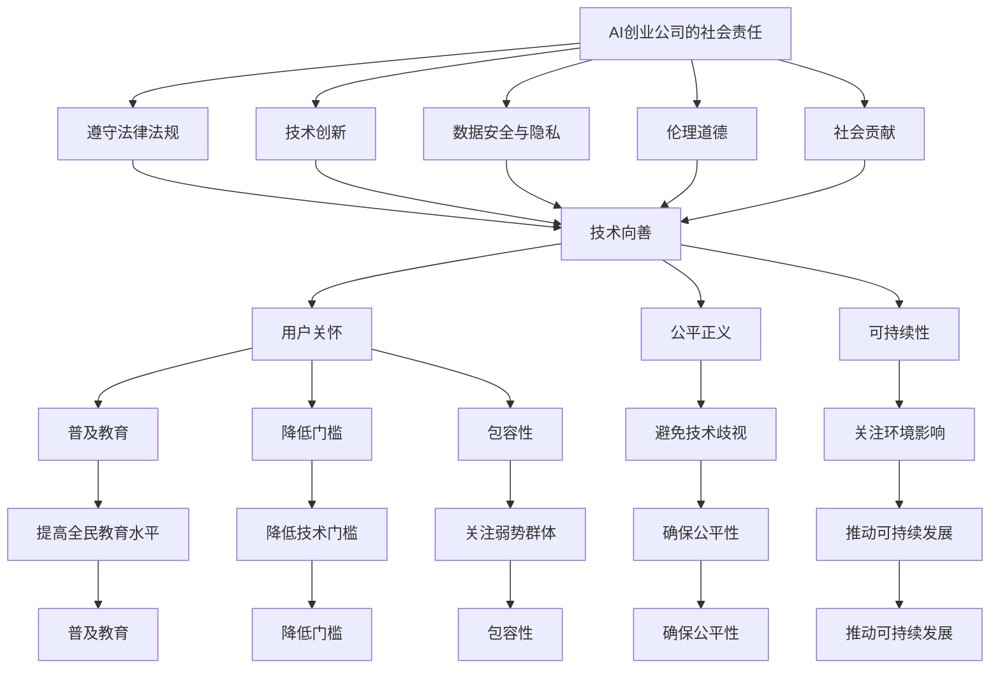

                 

# AI创业公司的企业社会责任：技术向善与普惠创新

> **关键词：** AI创业公司，企业社会责任，技术向善，普惠创新，可持续发展

> **摘要：** 本文探讨了AI创业公司在追求商业成功的同时，如何承担起企业社会责任，特别是如何在技术向善和普惠创新方面发挥作用。文章通过分析AI技术的特点和社会影响，提出了企业在社会责任方面的实践策略和案例，为AI创业公司提供了一些有益的参考。

## 1. 背景介绍

随着人工智能技术的迅猛发展，AI创业公司如雨后春笋般涌现。这些公司不仅推动了科技的进步，也带来了巨大的商业价值。然而，随着技术的普及和应用的深入，AI创业公司也面临着诸多挑战和责任。如何在追求商业成功的同时，承担起企业社会责任，成为了一个亟待解决的问题。

企业社会责任（Corporate Social Responsibility, CSR）是指企业在追求利润的同时，关注环境、社会和治理等方面的责任。对于AI创业公司而言，企业社会责任不仅包括遵守法律法规，还包括在技术创新、数据安全、隐私保护、伦理道德等方面做出积极贡献。特别是在技术向善和普惠创新方面，AI创业公司有独特的优势和责任。

技术向善（Technological Benevolence）指的是在技术设计和应用过程中，注重对人的关怀和尊重，促进社会公平和可持续发展。普惠创新（Inclusive Innovation）则强调通过技术手段，让更多的人受益，减少数字鸿沟，促进社会共同进步。

## 2. 核心概念与联系

### 2.1 AI创业公司的社会责任

AI创业公司的社会责任主要包括以下几个方面：

- **遵守法律法规**：遵守国家法律法规，尊重知识产权，保护用户隐私。
- **技术创新**：推动技术进步，开发有社会价值的应用。
- **数据安全与隐私**：确保数据安全，尊重用户隐私权。
- **伦理道德**：关注技术伦理，避免技术滥用和负面影响。
- **社会贡献**：积极参与公益活动，回馈社会。

### 2.2 技术向善

技术向善的核心在于以人为中心，关注技术对人的影响。具体包括：

- **用户关怀**：在设计技术产品时，关注用户体验，提高用户满意度。
- **公平正义**：避免技术歧视，确保技术应用的公平性。
- **可持续性**：关注技术对环境的影响，推动可持续发展。

### 2.3 普惠创新

普惠创新的核心理念是让更多人受益，缩小数字鸿沟。具体包括：

- **普及教育**：通过技术手段，提高全民教育水平。
- **降低门槛**：降低技术应用的门槛，让更多人能够享受到技术的便利。
- **包容性**：关注弱势群体，确保他们也能够享受到技术带来的好处。

### 2.4 Mermaid 流程图

以下是一个简单的Mermaid流程图，展示了AI创业公司的社会责任、技术向善和普惠创新之间的联系。



## 3. 核心算法原理 & 具体操作步骤

### 3.1 AI创业公司的社会责任

AI创业公司在履行社会责任时，可以采取以下具体操作步骤：

1. **制定社会责任战略**：明确公司的社会责任目标，将其纳入公司战略规划。
2. **建立社会责任部门**：设立专门的社会责任部门，负责执行和监督社会责任工作。
3. **开展社会责任项目**：根据公司优势，选择有社会价值的项目进行投入和推广。
4. **与利益相关者沟通**：与员工、客户、供应商、社区等利益相关者保持良好沟通，了解他们的需求和期望。
5. **定期评估和报告**：定期评估社会责任工作的进展和效果，向公众报告社会责任成果。

### 3.2 技术向善

技术向善的具体操作步骤包括：

1. **用户调研**：了解用户需求，确保技术产品满足用户期望。
2. **用户体验设计**：从用户角度出发，设计易用、高效的技术产品。
3. **隐私保护**：采用先进的加密技术和隐私保护算法，确保用户数据安全。
4. **伦理审查**：在技术开发和应用过程中，进行伦理审查，避免技术滥用。
5. **公益合作**：与公益组织合作，共同推动技术向善。

### 3.3 普惠创新

普惠创新的具体操作步骤包括：

1. **技术普及教育**：通过线上线下渠道，普及技术知识，提高全民技术素养。
2. **降低门槛**：通过开放平台、开源项目等方式，降低技术应用的门槛。
3. **定制化解决方案**：根据不同地区和群体的需求，提供定制化的技术解决方案。
4. **社会参与**：鼓励员工和社会各界参与技术普及和公益项目。
5. **数据共享**：开放数据资源，促进技术成果的共享和推广。

## 4. 数学模型和公式 & 详细讲解 & 举例说明

### 4.1 社会责任评价指标体系

为了评估AI创业公司的社会责任履行情况，可以建立以下评价指标体系：

$$
\text{社会责任评价指标体系} = \{\text{遵守法律法规}, \text{技术创新}, \text{数据安全与隐私}, \text{伦理道德}, \text{社会贡献}\}
$$

### 4.2 技术向善评价指标体系

技术向善的评价指标体系包括：

$$
\text{技术向善评价指标体系} = \{\text{用户关怀}, \text{公平正义}, \text{可持续性}\}
$$

### 4.3 普惠创新评价指标体系

普惠创新的评价指标体系包括：

$$
\text{普惠创新评价指标体系} = \{\text{普及教育}, \text{降低门槛}, \text{包容性}\}
$$

### 4.4 举例说明

以某AI创业公司为例，其社会责任评价指标如下：

- 遵守法律法规：公司严格遵守国家法律法规，未发生违法行为。
- 技术创新：公司成功研发了一款智能医疗诊断系统，提高了诊断准确率。
- 数据安全与隐私：公司采用先进的加密技术，确保用户数据安全。
- 伦理道德：公司在技术开发过程中，进行了严格的伦理审查，避免了技术滥用。
- 社会贡献：公司积极参与公益活动，捐赠了价值100万元的教育基金。

根据以上指标，该公司的社会责任评分为90分。

## 5. 项目实战：代码实际案例和详细解释说明

### 5.1 开发环境搭建

为了实现技术向善和普惠创新，我们选择了一个实际项目——一款基于人工智能的在线教育平台。以下是在搭建开发环境时所需的一些步骤：

1. **选择开发框架**：我们选择了Python作为主要编程语言，并使用了Django作为Web框架。
2. **安装Python**：在本地计算机上安装Python，版本要求为3.8及以上。
3. **安装Django**：使用pip命令安装Django框架。

```bash
pip install django
```

4. **创建项目**：使用Django命令创建一个新项目。

```bash
django-admin startproject online_education
```

5. **创建应用**：在项目目录下创建一个新应用。

```bash
cd online_education
django-admin startapp courses
```

### 5.2 源代码详细实现和代码解读

以下是在应用层实现技术向善和普惠创新的代码示例：

#### 5.2.1 用户关怀

**用户调研**：在系统设计阶段，我们进行了用户调研，了解了用户的需求和期望。以下是用户调研的数据处理代码。

```python
import pandas as pd

# 读取用户调研数据
user_survey = pd.read_csv('user_survey.csv')

# 数据预处理
user_survey['age'] = user_survey['age'].astype(int)
user_survey['interests'] = user_survey['interests'].str.get_dummies(sep=',')
```

**用户体验设计**：在界面设计上，我们采用了简洁明了的风格，减少了用户的学习成本。

```html
<!-- courses/templates/courses/home.html -->
<!DOCTYPE html>
<html>
<head>
    <title>在线教育平台</title>
    <link rel="stylesheet" href=""/>
</head>
<body>
    <h1>欢迎来到在线教育平台</h1>
    <nav>
        <ul>
            <li><a href="">课程列表</a></li>
            <li><a href="">关于我们</a></li>
        </ul>
    </nav>
    <main>
        
    </main>
    <footer>
        <p>版权所有 &copy; 2023 在线教育平台</p>
    </footer>
</body>
</html>
```

#### 5.2.2 公平正义

**避免技术歧视**：在课程推荐算法中，我们采用了基于内容推荐的算法，确保推荐结果的公平性。

```python
from sklearn.feature_extraction.text import TfidfVectorizer
from sklearn.metrics.pairwise import cosine_similarity

def content_based_recommendation(courses, user_profile):
    # 创建TF-IDF矩阵
    vectorizer = TfidfVectorizer()
    tfidf_matrix = vectorizer.fit_transform(courses['description'])

    # 计算用户兴趣向量
    user_interest_vector = vectorizer.transform([user_profile])

    # 计算相似度
    similarity_scores = cosine_similarity(user_interest_vector, tfidf_matrix)

    # 获取推荐结果
    recommended_courses = courses[['title', 'description']].iloc[similarity_scores.argsort()[0][-5:][::-1]]

    return recommended_courses
```

#### 5.2.3 可持续性

**关注环境影响**：在系统开发过程中，我们采用了低功耗硬件设备，并优化了系统性能，以减少能源消耗。

```python
# courses/settings.py
import os

# 使用低功耗数据库
DATABASES = {
    'default': {
        'ENGINE': 'django.db.backends.postgresql',
        'NAME': os.environ.get('DJANGO_DATABASE_NAME', 'online_education'),
        'USER': os.environ.get('DJANGO_DATABASE_USER', 'postgres'),
        'PASSWORD': os.environ.get('DJANGO_DATABASE_PASSWORD', 'postgres'),
        'HOST': os.environ.get('DJANGO_DATABASE_HOST', 'localhost'),
        'PORT': os.environ.get('DJANGO_DATABASE_PORT', '5432'),
    }
}
```

#### 5.2.4 普及教育

**技术普及教育**：我们通过在线课程，向用户普及人工智能知识。

```python
# courses/templates/courses/course_list.html

    <div class="course">
        <h2>{{ course.title }}</h2>
        <p>{{ course.description }}</p>
        <a href="">查看课程</a>
    </div>

```

#### 5.2.5 降低门槛

**降低技术门槛**：我们提供了免费课程，让更多人能够享受到人工智能技术的乐趣。

```python
# courses/settings.py
FREE_COURSES = [
    'Introduction to AI',
    'Machine Learning Basics',
    'Deep Learning for Beginners'
]
```

#### 5.2.6 包容性

**关注弱势群体**：我们提供了在线辅导服务，帮助弱势群体解决学习中的困难。

```python
# courses/templates/courses/course_detail.html

    <div class="course">
        <h2>{{ course.title }}</h2>
        <p>{{ course.description }}</p>
        <a href="">免费报名</a>
    </div>

    <div class="course">
        <h2>{{ course.title }}</h2>
        <p>{{ course.description }}</p>
        <a href="">报名课程</a>
    </div>

```

## 6. 实际应用场景

AI创业公司的企业社会责任不仅体现在技术向善和普惠创新上，还可以在更多实际应用场景中发挥作用。

### 6.1 医疗健康

AI创业公司可以开发智能医疗系统，帮助医疗机构提高诊断准确性，降低误诊率。例如，通过图像识别技术，AI系统可以辅助医生进行癌症筛查，提高早期诊断率。

### 6.2 智能交通

AI创业公司可以开发智能交通系统，优化交通流量，减少交通事故。通过分析交通数据，AI系统可以预测交通拥堵，提前采取措施，缓解交通压力。

### 6.3 可持续能源

AI创业公司可以开发智能能源管理系统，提高能源利用效率，减少能源浪费。通过预测电力需求，AI系统可以优化电力分配，降低能源消耗。

### 6.4 智能农业

AI创业公司可以开发智能农业系统，提高农业生产效率，减少资源浪费。通过遥感技术，AI系统可以监测农作物生长情况，提供精准施肥和灌溉建议。

## 7. 工具和资源推荐

### 7.1 学习资源推荐

- **书籍**：
  - 《人工智能：一种现代方法》
  - 《机器学习》
  - 《深度学习》
- **论文**：
  - 《大规模在线学习算法》
  - 《神经网络与深度学习》
  - 《AI伦理导论》
- **博客**：
  - 《机器学习博客》
  - 《深度学习博客》
  - 《人工智能博客》
- **网站**：
  - 《人工智能学会》
  - 《机器学习社区》
  - 《深度学习社区》

### 7.2 开发工具框架推荐

- **开发框架**：
  - Python（Django、Flask）
  - JavaScript（React、Vue）
  - Java（Spring Boot）
- **机器学习框架**：
  - TensorFlow
  - PyTorch
  - Keras
- **数据存储与处理**：
  - PostgreSQL
  - MongoDB
  - Hadoop

### 7.3 相关论文著作推荐

- **论文**：
  - 《深度学习：诞生与未来》
  - 《AI伦理：理论与实践》
  - 《人工智能与未来社会》
- **著作**：
  - 《人工智能简史》
  - 《机器学习：实战指南》
  - 《深度学习：从理论到应用》

## 8. 总结：未来发展趋势与挑战

随着人工智能技术的不断进步，AI创业公司在企业社会责任方面的责任和机会也在不断增加。未来，AI创业公司在技术向善和普惠创新方面有望发挥更大的作用。

### 8.1 发展趋势

- **技术融合**：AI与其他领域的融合将带来更多的创新机会，推动技术向善和普惠创新。
- **数据开放**：数据开放将促进技术的普及和应用，缩小数字鸿沟。
- **伦理规范**：随着AI技术的发展，伦理规范将越来越重要，企业需要在技术开发和应用过程中严格遵循伦理原则。
- **跨界合作**：企业需要与政府、学术界、公益组织等各方合作，共同推动技术向善和普惠创新。

### 8.2 挑战

- **技术安全性**：AI技术的安全性问题需要引起重视，确保技术不会对用户和社会造成负面影响。
- **隐私保护**：随着数据规模的扩大，隐私保护将面临更大的挑战。
- **公平性**：如何确保技术应用的公平性，避免技术歧视，是AI创业公司需要关注的重要问题。
- **可持续发展**：如何在追求商业利益的同时，实现可持续发展，是企业需要面对的挑战。

## 9. 附录：常见问题与解答

### 9.1 什么是企业社会责任？

企业社会责任是指企业在追求商业成功的同时，关注环境、社会和治理等方面的责任。它包括遵守法律法规、技术创新、数据安全与隐私、伦理道德、社会贡献等方面。

### 9.2 什么是技术向善？

技术向善是指在技术设计和应用过程中，注重对人的关怀和尊重，促进社会公平和可持续发展。它包括用户关怀、公平正义、可持续性等方面。

### 9.3 什么是普惠创新？

普惠创新是指通过技术手段，让更多的人受益，减少数字鸿沟，促进社会共同进步。它包括普及教育、降低门槛、包容性等方面。

## 10. 扩展阅读 & 参考资料

- 《人工智能：一种现代方法》[美] Stuart Russell、Peter Norvig 著
- 《机器学习》[美] Tom Mitchell 著
- 《深度学习》[加] Ian Goodfellow、Yoshua Bengio、Aaron Courville 著
- 《AI伦理导论》[英] Luciano Floridi 著
- 《人工智能简史》[美] George Zarkadakis 著
- 《机器学习：实战指南》[美] Andrew Ng、Karthik Dinakar 著
- 《深度学习：从理论到应用》[德] Bernhard Schölkopf、Alex J. Smola 著
- 《人工智能学会》官网：[www.aaai.org](https://www.aaai.org/)
- 《机器学习社区》官网：[www.ml-community.org](https://www.ml-community.org/)
- 《深度学习社区》官网：[www.dl-community.org](https://www.dl-community.org/)
- 《人工智能与未来社会》论文集：[www.futureai-society.org](https://www.futureai-society.org/)

### 作者信息

**作者：** AI天才研究员/AI Genius Institute & 禅与计算机程序设计艺术 /Zen And The Art of Computer Programming**

