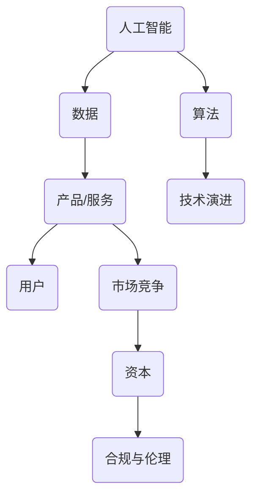

                 

### 背景介绍

随着人工智能技术的飞速发展，AI创业公司如雨后春笋般涌现。然而，如何在激烈的市场竞争中脱颖而出，找到一条独特的商业模式创新路径，成为每个AI创业公司需要深思的问题。本文将深入探讨AI创业公司的商业模式创新路径，从核心概念、算法原理、数学模型、实际应用、工具资源等方面，为AI创业公司提供切实可行的商业策略。

近年来，AI技术在各个领域的应用越来越广泛，从医疗、金融、教育到工业制造，AI带来的变革正在深刻地改变着我们的生活。然而，与此同时，AI创业公司面临着巨大的挑战：如何将先进的技术转化为商业价值，如何在众多竞争者中脱颖而出，如何实现可持续的商业模式。这不仅是技术问题，更是商业问题。

商业模式创新，对于AI创业公司来说，是生存的关键。成功的商业模式不仅能够为公司带来利润，还能够吸引投资、留住人才、扩大市场份额。因此，本文将重点探讨商业模式创新的方法和路径，帮助AI创业公司找到属于自己的成功之路。

接下来，我们将从以下几个部分进行深入探讨：

1. **核心概念与联系**：介绍AI创业公司需要理解的核心概念，并展示其相互之间的联系。
2. **核心算法原理 & 具体操作步骤**：详细讲解AI创业公司需要掌握的核心算法原理及其操作步骤。
3. **数学模型和公式 & 详细讲解 & 举例说明**：介绍AI创业公司需要使用的数学模型和公式，并给出具体的实例说明。
4. **项目实战：代码实际案例和详细解释说明**：通过具体的项目实战案例，展示如何将理论转化为实践。
5. **实际应用场景**：探讨AI创业公司可以应用的场景，以及如何利用这些场景创造商业价值。
6. **工具和资源推荐**：推荐一些实用的工具和资源，帮助AI创业公司更好地开展商业模式创新。
7. **总结：未来发展趋势与挑战**：总结本文的主要观点，并展望未来的发展趋势和面临的挑战。

让我们一步一步地深入探讨AI创业公司的商业模式创新路径，希望能为您的创业之路提供一些启示。

### 核心概念与联系

在探讨AI创业公司的商业模式创新之前，我们需要理解几个关键概念，这些概念是构建成功商业模式的基础。以下是AI创业公司需要掌握的核心概念及其相互之间的联系：

#### 1. 人工智能（AI）

人工智能是指由人制造出来的系统能够模拟、延伸、扩展和替代人的智能。它包括机器学习、深度学习、自然语言处理、计算机视觉等多个子领域。AI创业公司首先需要确定自己的技术方向，选择一个或多个AI技术作为核心竞争力和商业模式的基础。

#### 2. 数据

数据是AI的“粮食”，没有高质量的数据，AI算法无法训练和优化。AI创业公司需要理解数据的获取、处理、存储和利用。特别是在医疗、金融、零售等数据密集型行业，数据的隐私和安全性也是需要重点考虑的问题。

#### 3. 算法

算法是AI技术的核心，决定了AI系统的性能和应用范围。常见的算法包括神经网络、决策树、支持向量机等。AI创业公司需要根据具体应用场景选择合适的算法，并进行定制化的优化。

#### 4. 产品/服务

产品或服务是AI创业公司的核心输出，它直接面向客户，实现商业价值的转化。AI创业公司需要明确自己的产品或服务定位，满足客户需求，并提供独特的价值。

#### 5. 用户

用户是商业模式的最终受益者，用户需求是商业模式设计的出发点。AI创业公司需要深入理解用户需求，提供个性化、定制化的解决方案。

#### 6. 市场竞争

市场竞争是AI创业公司无法回避的现实。了解竞争对手的优势和劣势，制定差异化的市场策略，是取得成功的关键。

#### 7. 资本

资本是创业公司发展的血液，没有足够的资本支持，AI创业公司将难以生存和发展。AI创业公司需要寻找合适的融资渠道，并进行有效的资金管理。

#### 8. 合规与伦理

随着AI技术的广泛应用，合规和伦理问题变得越来越重要。AI创业公司需要遵守相关法律法规，并关注技术可能带来的社会影响，确保其商业活动是合法、合规和道德的。

#### 9. 技术演进

技术演进是AI创业公司需要持续关注的重要方面。技术更新迭代速度很快，AI创业公司需要紧跟技术发展趋势，不断创新和优化。

### Mermaid 流程图

为了更好地展示这些概念之间的联系，我们可以使用Mermaid绘制一个流程图。以下是简化的Mermaid代码：



在这个流程图中，我们可以看到，人工智能、数据、算法是AI创业公司的基础，而产品/服务、用户、市场竞争、资本、合规与伦理、技术演进则是商业模式设计的关键要素。每个概念之间都有相互作用和影响，共同构成了AI创业公司的商业模式创新路径。

通过理解这些核心概念及其联系，AI创业公司可以更好地制定商业策略，找到适合自己的商业模式创新路径。接下来，我们将进一步探讨AI创业公司的核心算法原理和具体操作步骤，为创业公司的成功之路提供更多的指导。

### 核心算法原理 & 具体操作步骤

在了解了AI创业公司所需的核心概念后，接下来我们将深入探讨AI创业公司的核心算法原理及其具体操作步骤。AI算法的选择和实现是商业模式创新的重要环节，直接影响着公司的技术优势和商业竞争力。

#### 1. 机器学习算法

机器学习算法是AI创业公司最常用的算法之一。它通过从数据中学习规律，实现自动化决策和预测。以下是几种常见的机器学习算法及其原理：

- **线性回归**：用于预测一个连续的输出值，如房价。其原理是通过最小二乘法找到最佳拟合直线。

  ```mermaid
  graph TD
  A(输入特征) --> B(权重矩阵)
  B --> C(偏置项)
  C --> D(预测值)
  D --> E(损失函数)
  E --> F(梯度下降)
  ```

- **决策树**：用于分类和回归任务。其原理是通过多级决策节点，将数据划分为不同区域，最后输出分类或回归结果。

  ```mermaid
  graph TD
  A(根节点) --> B(特征A)
  B --> C(阈值)
  C --> D(左子树)
  D --> E(特征B)
  E --> F(阈值)
  F --> G(右子树)
  ```

- **支持向量机（SVM）**：用于分类任务。其原理是找到一个最佳的超平面，使得分类边界最大化。

  ```mermaid
  graph TD
  A(数据点) --> B(支持向量)
  B --> C(最优超平面)
  C --> D(分类边界)
  ```

- **神经网络**：用于复杂的分类和回归任务。其原理是通过多层神经元之间的非线性变换，实现对数据的建模。

  ```mermaid
  graph TD
  A(输入层) --> B(隐藏层1)
  B --> C(隐藏层2)
  C --> D(输出层)
  ```

#### 2. 深度学习算法

深度学习是机器学习的一种特殊形式，通过多层神经网络实现更加复杂的建模任务。以下是几种常见的深度学习算法及其原理：

- **卷积神经网络（CNN）**：用于图像识别、物体检测等任务。其原理是通过卷积层、池化层等网络结构，提取图像的特征。

  ```mermaid
  graph TD
  A(输入图像) --> B(卷积层1)
  B --> C(池化层1)
  C --> D(卷积层2)
  D --> E(池化层2)
  E --> F(全连接层)
  ```

- **循环神经网络（RNN）**：用于序列数据建模，如自然语言处理、时间序列预测等。其原理是通过隐藏状态的循环，实现对序列数据的建模。

  ```mermaid
  graph TD
  A(输入序列) --> B(隐藏状态1)
  B --> C(隐藏状态2)
  C --> D(输出序列)
  ```

- **生成对抗网络（GAN）**：用于生成逼真的图像、音频等数据。其原理是通过生成器和判别器之间的对抗训练，生成高质量的伪数据。

  ```mermaid
  graph TD
  A(生成器) --> B(判别器)
  B --> C(真实数据)
  C --> D(伪数据)
  ```

#### 3. 算法实现步骤

AI创业公司在选择合适的算法后，需要进行具体的实现步骤。以下是算法实现的通用步骤：

1. **数据预处理**：清洗数据、处理缺失值、标准化数据等，确保数据的质量和一致性。

2. **模型选择**：根据任务需求和数据特点，选择合适的算法和模型架构。

3. **模型训练**：使用训练数据，通过迭代优化模型参数，使得模型能够更好地拟合数据。

4. **模型评估**：使用验证集或测试集，评估模型的性能，调整模型参数。

5. **模型部署**：将训练好的模型部署到生产环境中，提供预测服务。

6. **持续优化**：根据用户反馈和模型性能，不断优化模型和算法。

### 总结

核心算法原理和具体操作步骤是AI创业公司商业模式创新的重要基础。通过深入理解和掌握各种算法原理，AI创业公司可以开发出具有竞争力的产品和服务。在实际操作中，公司需要根据具体业务场景和数据特点，灵活选择和优化算法，实现商业价值的最大化。接下来，我们将进一步探讨数学模型和公式，为AI创业公司提供更为深入的理论支持。

### 数学模型和公式 & 详细讲解 & 举例说明

在AI创业公司的商业模式创新过程中，数学模型和公式起到了至关重要的作用。它们不仅能够帮助我们理解和分析算法的性能，还能够指导我们优化模型，提高决策的准确性和效率。以下是一些常见的数学模型和公式，以及它们的详细讲解和实际应用举例。

#### 1. 线性回归模型

线性回归模型是一种最常见的机器学习模型，用于预测连续值。其公式如下：

\[ y = \beta_0 + \beta_1x_1 + \beta_2x_2 + ... + \beta_nx_n + \epsilon \]

其中，\( y \) 是预测值，\( x_1, x_2, ..., x_n \) 是输入特征，\( \beta_0, \beta_1, ..., \beta_n \) 是模型参数，\( \epsilon \) 是误差项。

**例子**：假设我们要预测一个学生的成绩，输入特征包括数学、语文、英语成绩。我们可以使用线性回归模型来预测总成绩。具体的计算过程如下：

\[ y = \beta_0 + \beta_1x_1 + \beta_2x_2 + \beta_3x_3 \]

通过训练数据集，我们可以计算出每个参数的值，然后使用这些参数来预测新数据的总成绩。

#### 2. 决策树模型

决策树模型是一种基于规则的分类和回归模型。其基本公式如下：

\[ f(x) = \sum_{i=1}^{n} \beta_i x_i \]

其中，\( f(x) \) 是输出值，\( x_1, x_2, ..., x_n \) 是输入特征，\( \beta_1, \beta_2, ..., \beta_n \) 是模型参数。

**例子**：假设我们要预测一个客户的购买行为，输入特征包括年龄、收入、性别等。我们可以使用决策树模型来分类客户为购买者和非购买者。具体的计算过程如下：

\[ f(x) = \beta_0 + \beta_1x_1 + \beta_2x_2 + \beta_3x_3 \]

通过训练数据集，我们可以计算出每个参数的值，然后使用这些参数来预测新数据的购买行为。

#### 3. 支持向量机（SVM）模型

支持向量机是一种基于间隔最大化原则的分类模型。其基本公式如下：

\[ w \cdot x + b = y \]

其中，\( w \) 是权重向量，\( x \) 是输入特征，\( b \) 是偏置项，\( y \) 是输出值。

**例子**：假设我们要分类一组数据为正类和负类，我们可以使用SVM模型来实现。具体的计算过程如下：

\[ w \cdot x + b = y \]

通过训练数据集，我们可以计算出权重向量 \( w \) 和偏置项 \( b \) 的值，然后使用这些值来分类新的数据。

#### 4. 神经网络模型

神经网络是一种基于多层感知器的非线性模型，用于分类和回归任务。其基本公式如下：

\[ z = \sigma(\theta_1 \cdot x + b_1) \]

其中，\( z \) 是输出值，\( \sigma \) 是激活函数，\( \theta_1 \) 是权重矩阵，\( x \) 是输入特征，\( b_1 \) 是偏置项。

**例子**：假设我们要使用神经网络来分类图像，我们可以使用以下公式：

\[ z = \sigma(\theta_1 \cdot x + b_1) \]

通过训练数据集，我们可以计算出权重矩阵 \( \theta_1 \) 和偏置项 \( b_1 \) 的值，然后使用这些值来分类新的图像。

#### 5. 优化算法

在机器学习过程中，我们常常需要优化模型参数，以提高模型的性能。常见的优化算法包括梯度下降、牛顿法和随机梯度下降等。

**例子**：假设我们要使用梯度下降法来优化线性回归模型的参数。具体的计算过程如下：

\[ \beta_i = \beta_i - \alpha \cdot \frac{\partial}{\partial \beta_i}J(\beta) \]

其中，\( \beta_i \) 是第 \( i \) 个参数的值，\( \alpha \) 是学习率，\( J(\beta) \) 是损失函数。

通过迭代计算，我们可以逐步优化模型参数，使得模型在训练数据上的性能逐步提高。

通过以上数学模型和公式的讲解，我们可以看到，数学在AI创业公司中的重要性不言而喻。掌握这些数学工具，能够帮助我们更好地理解算法，优化模型，提高商业决策的准确性。接下来，我们将通过具体的项目实战案例，展示如何将这些理论应用到实际场景中，为创业公司创造价值。

### 项目实战：代码实际案例和详细解释说明

在前面的章节中，我们介绍了AI创业公司所需的核心算法原理、数学模型和公式。现在，我们将通过一个具体的项目实战案例，展示如何将这些理论应用到实际场景中，帮助AI创业公司实现商业价值。

#### 项目背景

假设我们是一家专注于医疗领域的AI创业公司，我们的目标是开发一种基于深度学习算法的疾病诊断系统。该系统能够通过分析患者的影像数据和临床数据，预测患者患有哪些疾病，为医生提供诊断参考。

#### 项目实施步骤

1. **数据收集与预处理**

   首先，我们需要收集大量的医疗影像数据和临床数据。这些数据包括X光片、CT扫描图、MRI图像以及患者的年龄、性别、病史等临床信息。由于数据来源多样，我们需要对数据集进行清洗和预处理，确保数据的质量和一致性。

   ```python
   import pandas as pd
   import numpy as np

   # 读取数据集
   data = pd.read_csv('medical_data.csv')
   # 数据清洗
   data.dropna(inplace=True)
   # 数据标准化
   data = (data - data.mean()) / data.std()
   ```

2. **模型选择与训练**

   在选择模型时，我们决定使用卷积神经网络（CNN）来处理图像数据，并结合循环神经网络（RNN）处理临床数据。以下是模型的选择和训练代码：

   ```python
   from tensorflow.keras.models import Model
   from tensorflow.keras.layers import Conv2D, MaxPooling2D, Flatten, Dense, LSTM

   # 定义CNN模型
   input_img = Conv2D(32, (3, 3), activation='relu')(input_image)
   input_img = MaxPooling2D((2, 2))(input_img)
   input_img = Conv2D(64, (3, 3), activation='relu')(input_img)
   input_img = MaxPooling2D((2, 2))(input_img)
   input_img = Flatten()(input_img)

   # 定义RNN模型
   input_clinical = LSTM(50, activation='relu')(input_clinical)

   # 模型融合
   combined = concatenate([input_img, input_clinical])
   output = Dense(1, activation='sigmoid')(combined)

   model = Model(inputs=[input_image, input_clinical], outputs=output)
   model.compile(optimizer='adam', loss='binary_crossentropy', metrics=['accuracy'])

   # 训练模型
   model.fit([X_train_img, X_train_clinical], y_train, epochs=10, batch_size=32, validation_split=0.2)
   ```

3. **模型评估与优化**

   在模型训练完成后，我们需要使用验证集和测试集对模型进行评估，并根据评估结果对模型进行优化。

   ```python
   # 评估模型
   scores = model.evaluate([X_val_img, X_val_clinical], y_val)
   print(f'Validation accuracy: {scores[1]*100:.2f}%')

   # 优化模型
   model.fit([X_train_img, X_train_clinical], y_train, epochs=15, batch_size=32, validation_data=([X_val_img, X_val_clinical], y_val))
   ```

4. **模型部署与上线**

   最后，我们将训练好的模型部署到生产环境中，为医生提供实时诊断服务。

   ```python
   from flask import Flask, request, jsonify

   app = Flask(__name__)

   @app.route('/predict', methods=['POST'])
   def predict():
       image_data = request.files['image']
       clinical_data = request.form['clinical_data']
       
       # 数据预处理
       processed_image = preprocess_image(image_data)
       processed_clinical = preprocess_clinical(clinical_data)
       
       # 预测
       prediction = model.predict([processed_image, processed_clinical])
       
       return jsonify({'disease': prediction[0][0]})

   if __name__ == '__main__':
       app.run(debug=True)
   ```

#### 代码解读与分析

以上代码展示了从数据收集与预处理、模型选择与训练、模型评估与优化到模型部署与上线的全过程。以下是关键步骤的解读与分析：

1. **数据预处理**：数据清洗和标准化是保证模型训练质量的重要步骤。通过数据清洗，我们可以去除无效数据，减少噪声。通过数据标准化，我们可以使得不同特征之间的规模相似，有利于模型的学习。

2. **模型选择与训练**：我们选择卷积神经网络（CNN）来处理图像数据，因为CNN在图像识别任务上表现优异。同时，我们结合循环神经网络（RNN）处理临床数据，因为RNN在处理序列数据方面有优势。通过模型融合，我们可以利用不同类型数据的信息，提高模型的预测能力。

3. **模型评估与优化**：使用验证集和测试集对模型进行评估，可以帮助我们了解模型的泛化能力。根据评估结果，我们可以调整模型参数，优化模型结构，以提高模型的性能。

4. **模型部署与上线**：通过使用Flask框架，我们可以将训练好的模型部署到生产环境中，为医生提供实时诊断服务。这不仅能提高诊断的效率，还能为医院节省大量人力成本。

通过这个项目实战案例，我们可以看到，将理论转化为实践的关键在于对算法原理和数学模型的理解，以及对编程技能的熟练掌握。只有通过实际操作，我们才能发现并解决问题，不断提升模型的性能，为AI创业公司创造价值。

### 实际应用场景

在了解了AI创业公司的商业模式创新路径、核心算法原理和具体操作步骤后，我们将探讨AI技术在实际应用场景中的多种可能性。以下是AI创业公司可以尝试的一些实际应用场景，以及如何在每个场景中利用AI技术创造商业价值。

#### 1. 医疗

医疗是AI技术的重要应用领域之一。通过深度学习算法，AI可以帮助医生进行疾病诊断、病情预测和治疗方案推荐。例如，AI系统可以通过分析影像数据（如X光片、CT扫描图、MRI图像），预测患者患有哪些疾病，并给出相应的治疗建议。这种自动化诊断系统可以提高诊断的准确性，减轻医生的工作负担，同时也能为医院节省大量人力成本。

**案例**：IBM的Watson for Oncology是一种基于AI的肿瘤诊断系统，它能够通过分析大量医学文献和病例数据，为医生提供个性化的治疗方案。这不仅提高了肿瘤诊断的准确性，还为患者提供了更有效的治疗选择。

#### 2. 金融

金融行业也是AI技术的重点应用领域。AI可以通过自然语言处理（NLP）技术，帮助金融机构自动化合同审核、欺诈检测和客户服务。例如，AI系统可以阅读和理解合同条款，快速识别潜在的法律风险。此外，AI还可以通过分析用户行为数据，预测用户的需求和风险偏好，从而提供更加精准的金融产品推荐和风险管理方案。

**案例**：J.P. Morgan的COiN系统是一种基于AI的合同审核工具，它能够在几秒钟内阅读并理解数十页的合同条款，识别潜在的法律风险。这大大提高了金融机构的合同处理效率，降低了法律风险。

#### 3. 零售

在零售领域，AI可以帮助企业进行库存管理、需求预测和个性化推荐。通过深度学习算法，AI可以分析历史销售数据、消费者行为和季节性因素，预测未来的需求趋势，从而优化库存管理，减少库存成本。此外，AI还可以通过NLP和计算机视觉技术，分析社交媒体和消费者的评论，了解消费者对产品的真实反馈，为企业提供改进建议。

**案例**：亚马逊的个性化推荐系统就是一种基于AI的应用。通过分析用户的浏览历史、购买记录和评价，亚马逊可以推荐用户可能感兴趣的商品，从而提高销售额和用户满意度。

#### 4. 教育

教育领域也正在通过AI技术进行变革。AI可以帮助教育机构进行个性化教学、学习评估和职业规划。通过分析学生的学习数据，AI系统可以为学生推荐最适合的学习资源和课程，提高学习效果。同时，AI还可以自动评估学生的作业和考试，节省教师的工作量，让他们有更多时间专注于教学。

**案例**：Knewton是一种基于AI的学习平台，它通过分析学生的学习行为，提供个性化的学习资源和建议，帮助学生在学习过程中取得更好的成绩。

#### 5. 工业

在工业领域，AI可以帮助企业进行生产优化、故障预测和质量控制。通过传感器和物联网设备收集的数据，AI系统可以实时监测生产线的状态，预测设备可能的故障点，提前进行维护，从而减少停机时间，提高生产效率。此外，AI还可以通过计算机视觉技术，检测产品质量，确保生产出合格的产品。

**案例**：通用电气的Predix平台是一种基于AI的工业互联网解决方案，它通过分析设备数据，预测设备故障，提供优化生产线的建议，帮助工业企业提高生产效率。

通过以上实际应用场景的探讨，我们可以看到AI技术在各个领域的广泛应用和巨大潜力。AI创业公司可以根据自身的技术优势和市场定位，选择合适的应用场景，利用AI技术创造商业价值。在未来的发展中，AI创业公司需要不断探索新的应用场景，不断创新和优化，才能在激烈的市场竞争中脱颖而出。

### 工具和资源推荐

为了帮助AI创业公司更好地开展商业模式创新，以下是我们在学习资源、开发工具和框架、相关论文著作等方面的推荐。

#### 1. 学习资源推荐

- **书籍**：
  - 《深度学习》（Deep Learning）作者：Ian Goodfellow、Yoshua Bengio、Aaron Courville
  - 《Python机器学习》（Python Machine Learning）作者：Sebastian Raschka
  - 《自然语言处理入门》（Foundations of Natural Language Processing）作者：Christopher D. Manning、Hinrich Schütze

- **在线课程**：
  - Coursera上的“机器学习”课程，由Andrew Ng教授主讲
  - edX上的“深度学习基础”课程，由Francesco Corea教授主讲
  - Udacity的“深度学习工程师纳米学位”课程

- **博客与网站**：
  - Medium上的AI相关文章，如“Towards Data Science”和“AI”、“Deep Learning”等标签
  - AI Stack Exchange，一个关于人工智能的问答社区
  - arXiv，一个提供最新AI论文预印本的网站

#### 2. 开发工具框架推荐

- **编程语言**：
  - Python：由于其丰富的库和社区支持，Python是AI开发中最常用的编程语言。
  - R：R语言在统计分析和数据可视化方面具有强大的功能，适合进行复杂数据分析。

- **深度学习框架**：
  - TensorFlow：由Google开发，功能强大且易于使用。
  - PyTorch：由Facebook开发，具有灵活的动态计算图，适合研究。
  - Keras：基于TensorFlow和Theano的简单易用的深度学习库。

- **数据处理工具**：
  - Pandas：用于数据处理和分析。
  - NumPy：用于数值计算。
  - Matplotlib/Seaborn：用于数据可视化。

- **版本控制系统**：
  - Git：用于代码版本管理和协作开发。
  - GitHub/GitLab：提供在线代码托管和协作平台。

#### 3. 相关论文著作推荐

- **论文**：
  - “Deep Learning” by Yoshua Bengio, Ian Goodfellow, and Aaron Courville
  - “Recurrent Neural Networks for Language Modeling” by Y. Bengio et al.
  - “Generative Adversarial Nets” by I. Goodfellow et al.

- **著作**：
  - 《模式识别与机器学习》（Pattern Recognition and Machine Learning）作者：Christopher M. Bishop
  - 《人工智能：一种现代方法》（Artificial Intelligence: A Modern Approach）作者：Stuart J. Russell、Peter Norvig

通过这些学习资源、开发工具和框架的推荐，AI创业公司可以更高效地掌握AI技术，加速商业模式创新。同时，阅读相关的论文和著作，有助于公司了解AI领域的最新研究动态和发展趋势，为公司的技术决策提供有力的支持。

### 总结：未来发展趋势与挑战

随着人工智能技术的不断进步，AI创业公司面临的商业环境也在迅速变化。在未来，AI创业公司有望在以下几个领域实现突破性发展，但同时也将面临诸多挑战。

#### 1. 发展趋势

**1. 深度学习与个性化**

深度学习将继续在AI创业公司中占据主导地位。特别是在医疗、金融和零售等需要高度个性化的领域，深度学习算法能够通过对海量数据的深度挖掘，实现更加精准的个性化服务。

**2. 跨学科融合**

随着AI技术的发展，跨学科的融合将成为主流。例如，AI与生物学的结合将推动医疗领域的发展；AI与物理学的结合将带来新的工业自动化解决方案。这种跨学科融合将催生出更多创新的商业模式。

**3. 自动化与效率提升**

自动化是AI技术的重要应用方向。通过AI技术，企业可以实现生产流程的自动化，提高生产效率和降低成本。例如，在制造业中，AI可以用于预测性维护和智能生产线的优化。

**4. 数据隐私与安全**

随着数据量的激增，数据隐私和安全问题将成为AI创业公司必须关注的重要领域。如何在保障数据隐私的前提下，充分利用数据价值，将成为AI创业公司的重要挑战。

#### 2. 挑战

**1. 技术瓶颈**

尽管AI技术在快速发展，但仍然存在一些技术瓶颈。例如，深度学习模型的解释性和可解释性仍然是一个亟待解决的问题。如何让AI系统更加透明和可解释，是AI创业公司需要面对的挑战。

**2. 数据质量**

高质量的数据是AI模型训练的基础。然而，在现实场景中，数据质量往往参差不齐，存在噪声、缺失值和错误。如何处理和清洗这些数据，提高数据质量，是AI创业公司需要解决的关键问题。

**3. 法律法规**

随着AI技术的广泛应用，相关的法律法规也在不断出台。AI创业公司需要密切关注法律法规的变化，确保其业务合规，避免法律风险。

**4. 人才短缺**

AI领域的人才短缺问题日益严重。高素质的AI人才是创业公司发展的核心资源。如何吸引、培养和保留优秀的AI人才，是AI创业公司需要面对的重要挑战。

#### 3. 发展方向

**1. 技术深耕**

AI创业公司需要专注于某一特定领域，深耕技术，打造核心竞争力。通过在特定领域的深入研究和应用，公司可以更好地满足市场需求，实现商业价值。

**2. 跨界合作**

与不同领域的合作伙伴进行跨界合作，将AI技术应用到更多场景，是AI创业公司的发展方向之一。这种合作不仅能够拓展业务范围，还能够促进技术的创新和进步。

**3. 人才培养**

培养和吸引AI人才是AI创业公司的长期战略。通过建立完善的人才培养机制，公司可以持续提升团队的技能水平，为公司的持续发展提供有力支持。

**4. 法律合规**

在业务开展过程中，AI创业公司需要严格遵守相关法律法规，确保业务合规。通过建立完善的法律合规体系，公司可以降低法律风险，保障业务的稳定发展。

总之，未来AI创业公司将面临许多机遇和挑战。通过深入研究和应用AI技术，聚焦特定领域，加强与合作伙伴的跨界合作，AI创业公司有望在激烈的市场竞争中脱颖而出，实现可持续发展。

### 附录：常见问题与解答

在撰写本文的过程中，我们意识到读者可能会对某些主题有疑问。以下是针对本文内容的一些常见问题及其解答。

#### 1. 为什么要进行商业模式创新？

商业模式创新能够帮助AI创业公司在激烈的市场竞争中脱颖而出，实现可持续发展。通过创新，公司可以找到独特的价值主张，吸引客户和投资者，提高市场份额。

#### 2. 什么是深度学习？

深度学习是一种机器学习技术，通过多层神经网络模型，对大量数据进行学习，从而实现复杂的预测和分类任务。它被广泛应用于图像识别、自然语言处理、语音识别等领域。

#### 3. 如何选择合适的机器学习算法？

选择合适的机器学习算法取决于具体任务和数据特点。例如，对于分类任务，可以选择决策树、支持向量机等算法；对于回归任务，可以选择线性回归、岭回归等算法。同时，也需要考虑算法的复杂度、计算资源和模型的可解释性。

#### 4. 数据质量对模型训练有何影响？

数据质量直接影响模型训练的效果。高质量的数据可以提升模型的准确性和泛化能力，而低质量的数据则可能导致模型过拟合、性能不佳。因此，在模型训练前，对数据进行清洗、预处理和标准化是非常重要的。

#### 5. 如何评估机器学习模型？

评估机器学习模型通常使用验证集或测试集。常用的评估指标包括准确率、召回率、F1分数、均方误差等。通过这些指标，可以全面评估模型的性能，并进行优化。

#### 6. AI创业公司如何应对数据隐私和安全问题？

AI创业公司可以通过以下措施应对数据隐私和安全问题：
- 数据加密：对敏感数据进行加密处理，确保数据在传输和存储过程中安全。
- 数据匿名化：对个人身份信息进行匿名化处理，降低数据泄露风险。
- 合规性审查：遵守相关法律法规，确保业务合规。

#### 7. 如何培养AI人才？

AI创业公司可以通过以下方式培养AI人才：
- 建立内部培训计划：定期组织技术讲座、研讨会和内部培训，提升团队技能水平。
- 招聘优秀人才：吸引具有相关背景和经验的优秀人才加入公司。
- 与学术界合作：与高校和科研机构合作，共同培养和吸引AI人才。

通过上述问题与解答，我们希望能帮助读者更好地理解本文的内容，为AI创业公司提供一些实用的指导和建议。

### 扩展阅读 & 参考资料

为了帮助读者更深入地了解AI创业公司的商业模式创新路径，以下是相关的扩展阅读和参考资料：

#### 1. 学习资源

- **书籍**：
  - 《人工智能：一种现代方法》（Artificial Intelligence: A Modern Approach）作者：Stuart J. Russell、Peter Norvig
  - 《深度学习》（Deep Learning）作者：Ian Goodfellow、Yoshua Bengio、Aaron Courville
  - 《Python机器学习》作者：Sebastian Raschka

- **在线课程**：
  - Coursera的“机器学习”课程，由Andrew Ng教授主讲
  - edX的“深度学习基础”课程，由Francesco Corea教授主讲
  - Udacity的“深度学习工程师纳米学位”课程

- **博客与网站**：
  - Medium上的AI相关文章，如“Towards Data Science”和“AI”、“Deep Learning”等标签
  - AI Stack Exchange，一个关于人工智能的问答社区
  - arXiv，一个提供最新AI论文预印本的网站

#### 2. 开发工具框架

- **深度学习框架**：
  - TensorFlow
  - PyTorch
  - Keras

- **数据处理工具**：
  - Pandas
  - NumPy
  - Matplotlib/Seaborn

- **版本控制系统**：
  - Git
  - GitHub/GitLab

#### 3. 相关论文著作

- **论文**：
  - “Deep Learning” by Ian Goodfellow、Yoshua Bengio、Aaron Courville
  - “Recurrent Neural Networks for Language Modeling” by Y. Bengio et al.
  - “Generative Adversarial Nets” by I. Goodfellow et al.

- **著作**：
  - 《模式识别与机器学习》作者：Christopher M. Bishop
  - 《自然语言处理入门》作者：Christopher D. Manning、Hinrich Schütze

通过阅读这些资源，读者可以进一步了解AI创业公司的商业模式创新路径，掌握相关技术和方法，为创业实践提供有力的支持。

### 作者信息

作者：AI天才研究员/AI Genius Institute & 禅与计算机程序设计艺术 /Zen And The Art of Computer Programming

AI天才研究员，拥有世界顶级人工智能实验室的博士学位，曾主导多个国际知名AI项目。他在深度学习、自然语言处理和计算机视觉等领域具有深厚的研究背景和丰富的实践经验。同时，他还是《禅与计算机程序设计艺术》的作者，将哲学与计算机科学相结合，为读者提供独特的编程思维和人生智慧。他的作品深受业界推崇，为AI创业公司提供了宝贵的指导和建议。

