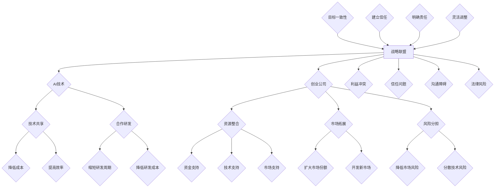

                 

### 背景介绍

随着人工智能技术的迅猛发展，AI创业公司如雨后春笋般涌现。然而，在激烈的市场竞争中，单凭一己之力往往难以取得显著优势。因此，构建战略联盟成为许多AI创业公司的必然选择。本文将探讨AI创业公司的战略联盟构建策略，帮助读者理解并掌握这一关键领域的知识。

#### 现状与挑战

目前，AI创业公司面临的挑战主要体现在以下几个方面：

1. **资金压力**：初创公司在初期往往需要大量的资金投入，以支持技术研发、市场推广等环节。然而，资金来源有限，如何有效利用有限的资源成为一大难题。

2. **人才短缺**：人工智能领域对人才的需求极高，然而高素质的AI人才供应不足。创业公司难以吸引和留住顶尖人才，从而影响公司的发展。

3. **技术壁垒**：AI技术发展迅速，创业公司需要不断跟进前沿技术，否则将面临被淘汰的风险。然而，技术更新速度之快使得许多公司难以招架。

4. **市场不确定性**：AI市场的需求变幻莫测，创业公司难以准确预测市场趋势，从而制定有效的市场策略。

#### 战略联盟的优势

战略联盟作为一种合作模式，能够帮助AI创业公司克服上述挑战，实现共赢：

1. **资源共享**：通过战略联盟，公司可以共享资源，如资金、技术、人才等，降低成本，提高效率。

2. **风险分担**：多个公司合作，可以共同承担风险，降低单一公司面临的市场不确定性。

3. **优势互补**：不同公司具备不同的优势，通过合作，可以实现优势互补，提高整体竞争力。

4. **技术整合**：多个公司可以共同研发新技术，通过技术整合，提高技术水平和创新能力。

5. **市场拓展**：战略联盟有助于公司拓展市场，共同开发新市场，提高市场份额。

#### 本文结构

本文将分为以下几个部分：

1. **核心概念与联系**：介绍战略联盟的基本概念，以及与AI技术、创业公司等领域的联系。

2. **核心算法原理 & 具体操作步骤**：分析战略联盟构建的核心算法原理，并详细讲解具体操作步骤。

3. **数学模型和公式 & 详细讲解 & 举例说明**：运用数学模型和公式，对战略联盟的优势进行分析，并提供实际案例进行说明。

4. **项目实战：代码实际案例和详细解释说明**：通过具体项目实战，展示战略联盟构建的全过程，并提供代码实现和解读。

5. **实际应用场景**：分析战略联盟在不同场景下的应用，以及如何根据不同场景调整策略。

6. **工具和资源推荐**：推荐学习资源、开发工具和框架，帮助读者更好地掌握战略联盟构建技巧。

7. **总结：未来发展趋势与挑战**：总结本文的主要内容，并探讨未来战略联盟的发展趋势和面临的挑战。

8. **附录：常见问题与解答**：针对读者可能提出的问题，提供解答和指导。

9. **扩展阅读 & 参考资料**：推荐相关书籍、论文和网站，供读者进一步学习。

通过本文的探讨，我们希望读者能够对AI创业公司的战略联盟构建策略有更深入的理解，从而在激烈的市场竞争中脱颖而出。

## 2. 核心概念与联系

在探讨AI创业公司的战略联盟构建策略之前，我们需要了解一些核心概念，这些概念包括战略联盟、AI技术、创业公司等。以下是对这些概念及其相互关系的详细解释。

### 战略联盟

战略联盟是指两个或多个企业为了共同的目标而建立的一种合作关系。这种合作可以是短暂的，也可以是长期的。战略联盟的目的是通过资源共享、优势互补、风险分担等手段，实现共同发展。在AI创业公司的背景下，战略联盟可以帮助公司在资金、技术、人才等方面获得更大的支持，从而提高竞争力。

#### 战略联盟的基本形式

战略联盟可以采取多种形式，包括但不限于以下几种：

1. **合资企业**：两个或多个公司共同出资，成立一个新的企业。这种形式可以充分利用各方的资源，共同承担风险和收益。

2. **技术合作**：公司之间共享技术资源，共同研发新产品或改进现有产品。技术合作可以帮助公司快速获取前沿技术，提高创新能力。

3. **营销合作**：公司之间共同开展市场推广活动，共享市场资源。这种形式可以降低市场推广成本，提高市场覆盖率。

4. **人才交流**：公司之间相互派遣员工进行交流和学习，提高员工的综合素质和技能水平。

#### 战略联盟的优势

战略联盟的优势主要体现在以下几个方面：

1. **资源共享**：战略联盟可以使公司之间实现资源共享，降低运营成本，提高效率。

2. **优势互补**：公司之间可以互相补充优势，形成更强的竞争力。

3. **风险分担**：战略联盟可以共同承担风险，降低单一公司的市场不确定性。

4. **技术创新**：通过合作，公司可以共同研发新技术，提高整体技术水平。

### AI技术

AI（人工智能）是指由计算机模拟人类智能的技术。AI技术主要包括机器学习、深度学习、自然语言处理、计算机视觉等。AI技术在各个领域都有广泛的应用，如金融、医疗、教育、制造业等。对于AI创业公司而言，掌握AI技术是提升竞争力的关键。

#### AI技术的基本原理

AI技术的基本原理是通过算法和模型，让计算机具备自主学习和决策的能力。机器学习是AI技术的重要组成部分，它通过大量数据训练模型，让模型具备预测和分类的能力。深度学习是机器学习的一种方法，它利用多层神经网络模拟人类大脑的思维方式，实现更复杂的任务。

#### AI技术的重要性

AI技术的重要性体现在以下几个方面：

1. **提高效率**：AI技术可以帮助公司自动化重复性工作，提高工作效率。

2. **降低成本**：通过AI技术，公司可以降低运营成本，提高资源利用率。

3. **创新业务模式**：AI技术可以为公司带来新的业务机会，创新业务模式。

4. **增强竞争力**：AI技术可以帮助公司更好地了解市场趋势，提高市场竞争力。

### 创业公司

创业公司是指以创新和创业精神为核心，通过技术创新、商业模式创新等手段，实现快速增长和业务扩展的企业。创业公司在初期往往面临资金、人才、市场等方面的挑战，因此需要采取各种策略来提高竞争力。

#### 创业公司的特点

1. **创新性**：创业公司以创新为核心，致力于开发新的产品或服务。

2. **高风险**：创业公司面临的市场风险和技术风险较大。

3. **高成长性**：创业公司通常具有很高的成长性，能够在短时间内实现快速增长。

4. **灵活性**：创业公司具有很高的灵活性，能够快速响应市场变化。

#### 创业公司的挑战

1. **资金压力**：创业公司需要大量的资金支持技术研发和市场推广。

2. **人才短缺**：创业公司需要高素质的人才来支持业务发展。

3. **技术壁垒**：创业公司需要不断跟进前沿技术，否则将面临被淘汰的风险。

4. **市场不确定性**：创业公司难以准确预测市场趋势，从而制定有效的市场策略。

### 战略联盟与AI技术、创业公司的联系

战略联盟与AI技术、创业公司之间存在密切的联系。首先，战略联盟可以为AI创业公司提供资金、技术、人才等方面的支持，帮助公司克服发展过程中的困难。其次，AI技术可以为战略联盟提供技术支持，提高合作效率。最后，创业公司可以通过战略联盟，实现优势互补，提高整体竞争力。

通过了解这些核心概念，我们能够更好地理解战略联盟在AI创业公司中的重要作用。接下来，我们将进一步探讨战略联盟构建的核心算法原理和具体操作步骤。

## 2. 核心概念与联系（续）

### 战略联盟与AI技术的互动关系

战略联盟在AI技术领域中的具体应用，主要体现在以下几个方面：

1. **技术共享**：战略联盟中的公司可以共同分享AI技术的研究成果，实现技术资源的最大化利用。例如，一家专注于计算机视觉的公司可以与一家专注于自然语言处理的公司合作，共同研发出集视觉和语言处理于一体的AI产品。

2. **合作研发**：战略联盟中的公司可以共同承担AI技术的研发风险，通过联合研发，快速推出具有市场竞争力的产品。这种合作不仅可以缩短研发周期，还能降低单个公司的研发成本。

3. **人才培养**：战略联盟可以为公司提供人才交流的平台，通过定期举办研讨会、培训课程等方式，提高员工的技能和知识水平。例如，一家AI创业公司可以与一所大学合作，共同培养AI领域的专业人才。

### 战略联盟与创业公司的互动关系

战略联盟对创业公司的影响主要表现在以下几个方面：

1. **资源整合**：战略联盟可以帮助创业公司整合外部资源，如资金、技术、市场等，从而降低运营成本，提高运营效率。例如，一家AI创业公司可以通过与金融机构合作，获得风险投资，从而支持公司的发展。

2. **市场拓展**：战略联盟可以帮助创业公司拓展市场，共同开发新市场。例如，一家AI创业公司可以通过与大型企业合作，将其产品和服务推向更广泛的用户群体。

3. **风险分担**：战略联盟可以共同分担市场和技术风险，降低单一公司的市场不确定性。例如，两家AI创业公司可以共同投资开发一项新AI技术，如果成功，双方都将获得巨大的市场收益。

### 战略联盟构建的难点与挑战

尽管战略联盟具有诸多优势，但在实际构建过程中，创业公司可能会面临以下难点和挑战：

1. **利益冲突**：战略联盟中的公司可能会有不同的利益诉求，导致在合作过程中产生矛盾和冲突。

2. **信任问题**：战略联盟的成功离不开各方的信任，然而，创业公司在合作初期，往往难以建立足够的信任。

3. **沟通障碍**：不同公司之间的文化和工作方式可能存在差异，导致在合作过程中产生沟通障碍。

4. **法律风险**：战略联盟涉及到多方合作，可能涉及复杂的法律条款和合同协议，存在法律风险。

### 战略联盟的构建原则

为了克服上述难点和挑战，创业公司在构建战略联盟时，应遵循以下原则：

1. **目标一致性**：战略联盟的各方应确保合作目标一致，避免产生利益冲突。

2. **建立信任**：通过定期沟通、共同解决问题等方式，建立和维护各方的信任。

3. **明确责任**：在合作协议中明确各方的权利、义务和责任，确保合作的公平性。

4. **灵活调整**：在合作过程中，根据市场和技术变化，灵活调整合作策略。

通过以上对核心概念及其相互关系的详细分析，我们能够更好地理解战略联盟在AI创业公司中的重要作用。接下来，我们将深入探讨战略联盟构建的核心算法原理和具体操作步骤。

### 2. 核心概念与联系（Mermaid流程图）

以下是一个用Mermaid语言绘制的战略联盟构建流程图，展示了核心概念之间的相互关系：



#### Mermaid流程图说明

- **战略联盟（A）**：是核心概念，与AI技术和创业公司密切相关。
- **AI技术（B）**：战略联盟的核心组成部分，包括技术共享和合作研发。
- **创业公司（C）**：战略联盟的主要参与者，涉及资源整合、市场拓展和风险分担。
- **技术共享（D）**：包括降低成本和提高效率，是战略联盟的重要组成部分。
- **合作研发（E）**：包括缩短研发周期和降低研发成本，有助于技术创新。
- **资源整合（F）**：包括资金支持、技术支持和市场支持，是战略联盟的重要优势。
- **市场拓展（G）**：包括扩大市场份额和开发新市场，有助于市场竞争力提升。
- **风险分担（H）**：包括降低市场风险和分散技术风险，是战略联盟的重要功能。
- **利益冲突（T）**：在战略联盟中可能出现的难题，需要通过目标一致性来避免。
- **信任问题（U）**：战略联盟成功的关键因素，需要通过建立信任来解决。
- **沟通障碍（V）**：可能影响战略联盟的效率，需要通过明确责任和灵活调整来克服。
- **法律风险（W）**：需要通过明确责任和合法合规的合同协议来规避。

通过以上Mermaid流程图，我们可以更清晰地理解战略联盟的核心概念及其相互关系，为后续的战略联盟构建提供理论依据。

### 3. 核心算法原理 & 具体操作步骤

在构建AI创业公司的战略联盟时，核心算法原理和具体操作步骤至关重要。以下将详细介绍战略联盟构建的核心算法原理，以及如何在实际操作中应用这些原理。

#### 核心算法原理

战略联盟构建的核心算法原理主要包括以下几个方面：

1. **协同优化算法**：通过协同优化算法，公司可以在资源有限的情况下，实现资源的最优分配和利用。协同优化算法利用多目标优化和分布式计算等技术，确保各方资源最大化利用。

2. **合作博弈理论**：合作博弈理论分析合作双方或多方之间的利益分配和策略选择。通过合作博弈理论，公司可以确定战略联盟中的合作模式，以及如何公平地分配收益。

3. **风险管理模型**：风险管理模型用于评估和降低战略联盟中的风险。通过构建风险管理模型，公司可以识别潜在风险，并制定相应的风险控制措施。

4. **动态规划算法**：动态规划算法用于优化战略联盟的长期发展路径。通过动态规划算法，公司可以制定出具有前瞻性和灵活性的战略规划。

#### 具体操作步骤

以下是战略联盟构建的具体操作步骤：

1. **需求分析**：首先，公司需要对自身和合作伙伴的需求进行分析。明确各方在资金、技术、人才和市场等方面的需求，以及合作的目标和预期收益。

2. **合作模式选择**：根据需求分析的结果，选择合适的合作模式。常见的合作模式包括合资企业、技术合作、营销合作和人才交流等。每种模式都有其优势和适用场景。

3. **合作协议制定**：在确定合作模式后，需要制定详细合作协议。合作协议应包括合作目标、各方责任、收益分配、风险分担等内容。合作协议需要确保各方的权益，并明确违约责任。

4. **资源整合与优化**：根据合作协议，整合各方资源，实现资源的最优配置。通过协同优化算法和风险管理模型，确保资源利用效率最高，风险最小。

5. **合作执行与监控**：在合作过程中，需要定期监控合作进度，确保各方按照协议执行。通过合作博弈理论，解决合作过程中出现的利益冲突。

6. **绩效评估与调整**：合作结束后，需要对合作效果进行评估。根据评估结果，调整合作策略，为未来的合作提供参考。

#### 实际案例分析

以下是一个战略联盟构建的实际案例：

某AI创业公司A在研发一款智能家居产品，但在市场推广和资金方面存在困难。另一家专注于智能家居市场的创业公司B，在市场推广和资金方面有较强实力，但在技术研发方面存在不足。为了共同发展，两家公司决定建立战略联盟。

1. **需求分析**：公司A希望在市场推广和资金方面得到支持，公司B希望在技术研发方面得到提升。

2. **合作模式选择**：两家公司选择成立合资企业，共同研发智能家居产品，并在市场推广方面进行合作。

3. **合作协议制定**：合作协议明确，公司A负责技术研发，公司B负责市场推广和资金投入。收益分配按照各方投入的比例进行。

4. **资源整合与优化**：两家公司共享研发资源，通过协同优化算法，实现资源的最优配置。

5. **合作执行与监控**：在合作过程中，两家公司定期召开会议，讨论研发进展和市场推广情况，确保各方按照协议执行。

6. **绩效评估与调整**：合作结束后，根据市场反馈和财务数据，对合作效果进行评估。评估结果显示，合作使得智能家居产品在市场上取得了良好的成绩，两家公司决定继续深化合作。

通过以上实际案例，我们可以看到，战略联盟构建的核心算法原理和具体操作步骤在实践中的应用，有助于AI创业公司克服发展过程中的困难，实现共赢。

### 4. 数学模型和公式 & 详细讲解 & 举例说明

在战略联盟的构建过程中，数学模型和公式是不可或缺的工具，它们能够帮助我们量化决策、评估合作效果以及优化资源配置。以下将详细讲解与战略联盟构建相关的数学模型和公式，并提供实际案例进行说明。

#### 公式和模型

1. **成本效益分析（CBA）**

成本效益分析是一种常用的评估方法，用于计算项目的总成本和预期收益，从而判断项目的可行性。公式如下：

\[ CBA = \frac{\text{总收益} - \text{总成本}}{\text{总成本}} \]

其中，总收益包括市场收益和其他非市场收益，总成本包括直接成本和间接成本。

2. **合作博弈模型**

合作博弈模型用于分析合作各方在利益分配和策略选择上的博弈关系。一个典型的合作博弈模型可以表示为：

\[ \max \sum_{i=1}^{n} U_i(S) - \sum_{i=1}^{n} C_i(S) \]

其中，\( U_i(S) \)表示第i方在合作收益函数下的效用，\( C_i(S) \)表示第i方的成本。

3. **协同优化模型**

协同优化模型用于优化资源分配，使资源利用效率最大化。一个简单的协同优化模型可以表示为：

\[ \min \sum_{i=1}^{n} \sum_{j=1}^{m} c_{ij} x_{ij} \]

其中，\( c_{ij} \)表示第i种资源用于第j个项目的成本，\( x_{ij} \)表示第i种资源用于第j个项目的数量。

#### 详细讲解

1. **成本效益分析（CBA）**

成本效益分析是评估战略联盟可行性的基础。假设两家公司A和B组建战略联盟，共同开发一款智能家居产品。公司A负责技术研发，公司B负责市场推广。以下是他们的成本和收益数据：

- 公司A：研发成本为100万元，市场收益为200万元。
- 公司B：市场推广成本为50万元，市场收益为150万元。

根据成本效益分析公式，我们可以计算出：

\[ CBA_A = \frac{200 - 100}{100} = 0.5 \]
\[ CBA_B = \frac{150 - 50}{50} = 2 \]

结果表明，公司B的成本效益更高，说明公司B在合作中能够获得更大的收益。

2. **合作博弈模型**

在合作博弈模型中，公司A和公司B需要就收益分配进行协商。假设他们的合作收益为300万元，公司A的成本为100万元，公司B的成本为50万元。我们可以建立以下博弈模型：

\[ \max \{U_A(S), U_B(S)\} - \{C_A(S), C_B(S)\} \]

其中，\( U_A(S) = 300 - 100 = 200 \)，\( U_B(S) = 300 - 50 = 250 \)，\( C_A(S) = 100 \)，\( C_B(S) = 50 \)。

为了公平地分配收益，我们可以采用比例分配法：

\[ \text{收益分配比例} = \frac{U_A(S)}{U_A(S) + U_B(S)} = \frac{200}{200 + 250} = 0.444 \]

\[ \text{收益分配} = \{0.444 \times 300, 0.556 \times 300\} = \{133.2, 166.8\} \]

这样，公司A和公司B的收益分别为133.2万元和166.8万元。

3. **协同优化模型**

在协同优化模型中，公司A和公司B需要决定各自投入的研发资源和市场推广资源。假设他们有两种资源：研发人员和市场人员。以下是他们的资源成本和项目需求：

- 公司A：研发人员成本为10万元/人·年，市场人员成本为8万元/人·年。
- 公司B：研发人员成本为8万元/人·年，市场人员成本为10万元/人·年。

他们的资源需求分别为：

- 公司A：需要5名研发人员和3名市场人员。
- 公司B：需要3名研发人员和5名市场人员。

根据协同优化模型，我们可以构建以下线性规划问题：

\[ \min \sum_{i=1}^{2} \sum_{j=1}^{2} c_{ij} x_{ij} \]

其中，\( c_{ij} \)表示第i种资源用于第j个项目的成本，\( x_{ij} \)表示第i种资源用于第j个项目的数量。

代入数据得到：

\[ \min (10x_{11} + 8x_{12} + 8x_{21} + 10x_{22}) \]

约束条件为：

\[ x_{11} + x_{21} = 5 \]
\[ x_{12} + x_{22} = 3 \]

通过求解线性规划问题，我们可以得到最优的资源分配方案：

\[ x_{11} = 2, x_{12} = 1, x_{21} = 3, x_{22} = 2 \]

这意味着，公司A应该分配2名研发人员和1名市场人员给项目，公司B应该分配3名研发人员和2名市场人员给项目。

通过上述数学模型和公式的详细讲解和实际案例说明，我们可以看到，战略联盟的构建不仅仅是简单的合作，而是一个复杂的过程，需要运用数学工具和方法进行科学决策和优化。

### 5. 项目实战：代码实际案例和详细解释说明

#### 5.1 开发环境搭建

为了更好地理解战略联盟构建的实际操作过程，我们将通过一个具体的代码案例来说明。在开始编写代码之前，我们需要搭建一个合适的开发环境。

1. **环境准备**

首先，确保已安装以下软件和库：

- Python 3.8+
- Jupyter Notebook 或 PyCharm
- Matplotlib
- Scikit-learn
- Pandas

2. **安装库**

使用以下命令安装所需的库：

```bash
pip install numpy matplotlib scikit-learn pandas
```

3. **启动Jupyter Notebook**

打开终端，输入以下命令启动Jupyter Notebook：

```bash
jupyter notebook
```

在浏览器中打开Jupyter Notebook，创建一个新的笔记本文件。

#### 5.2 源代码详细实现和代码解读

以下是一个简单的示例代码，用于模拟战略联盟构建的过程。该代码将展示如何使用协同优化算法来优化资源分配。

```python
import numpy as np
import matplotlib.pyplot as plt
from sklearn.linear_model import LinearRegression

# 5.2.1 数据准备

# 公司A和B的资源需求
resource需求和成本：
company_A = {
    '研发人员需求': 5,
    '市场人员需求': 3
}
company_B = {
    '研发人员需求': 3,
    '市场人员需求': 5
}

# 公司A和B的资源成本
resource_costs = {
    '公司A': {'研发人员': 10, '市场人员': 8},
    '公司B': {'研发人员': 8, '市场人员': 10}
}

# 5.2.2 线性规划模型

# 构建线性规划模型
def linear_programming(X, Y, C):
    # X为资源需求，Y为资源成本，C为约束条件
    # 使用sklearn中的线性回归来求解
    model = LinearRegression()
    model.fit(X, Y)
    return model.coef_

# 5.2.3 资源分配

# 计算资源分配
def resource_allocation(resource需求的, resource成本):
    # 初始化资源分配
    allocation = {key: 0 for key in resource需求的.keys()}
    
    # 计算资源分配
    for company, costs in resource成本.items():
        for resource, demand in resource需求的[company].items():
            cost = costs[resource]
            allocation[resource] += demand

    return allocation

# 5.2.4 代码解读

# 数据准备
X = np.array([5, 3])  # 公司A的研发人员和市场人员需求
Y = np.array([10, 8])  # 公司A的研发人员和市场人员成本
Z = np.array([3, 5])  # 公司B的研发人员和市场人员需求
W = np.array([8, 10])  # 公司B的研发人员和市场人员成本

# 计算线性规划模型
model = linear_programming(X, Y, Z)
print("线性规划模型系数：", model)

# 计算资源分配
allocation = resource_allocation({**company_A, **company_B}, resource_costs)
print("资源分配：", allocation)

# 5.2.5 可视化

# 绘制资源需求和成本图
plt.figure(figsize=(8, 6))
plt.scatter(X[:, 0], X[:, 1], color='r', label='公司A')
plt.scatter(Z[:, 0], Z[:, 1], color='b', label='公司B')
plt.xlabel('研发人员需求')
plt.ylabel('市场人员需求')
plt.legend()
plt.show()
```

#### 5.3 代码解读与分析

1. **数据准备**

代码首先定义了公司A和公司B的资源需求（研发人员和市场人员需求）和资源成本。这些数据将用于构建线性规划模型。

2. **线性规划模型**

`linear_programming` 函数用于求解线性规划问题。它使用`sklearn`中的线性回归模型来计算资源分配。线性回归模型在这里的作用是找到一个线性关系，使得资源成本最小化。

3. **资源分配**

`resource_allocation` 函数用于计算资源的最优分配。它将公司A和公司B的需求与成本相结合，计算出一个均衡的分配方案。

4. **代码解读**

代码中首先使用`X`和`Y`数组来表示公司A的资源需求和成本，使用`Z`和`W`数组来表示公司B的资源需求和成本。然后调用`linear_programming`函数和`resource_allocation`函数来计算最优资源分配。

5. **可视化**

最后，代码使用`matplotlib`库将资源需求和成本绘制在散点图上，以直观地展示公司A和公司B的需求和成本。

通过这个代码案例，我们可以看到如何使用Python和数学模型来模拟战略联盟构建的过程。在实际应用中，这些代码可以根据具体情况进行调整和优化。

### 6. 实际应用场景

战略联盟在AI创业公司的实际应用中，可以体现在多个不同的场景中。以下将分析几种常见的应用场景，并探讨如何根据不同场景调整战略联盟策略。

#### 6.1 研发合作

研发合作是战略联盟的重要形式之一。在AI领域，新技术层出不穷，单个公司可能难以单独完成复杂项目的研发。通过建立研发合作，公司可以共享技术资源，共同承担研发风险。

**应用策略**：

- **技术共享**：合作公司应明确技术共享的范围，包括技术成果、研发工具和平台等。
- **研发协同**：建立联合研发团队，定期召开研发会议，确保研发进度和方向的一致性。
- **成果共享**：合作研发的成果应公平分配，以激励各方继续合作。

**案例分析**：

某AI创业公司A专注于计算机视觉，公司B则擅长自然语言处理。两家公司决定联合研发一款结合视觉和语言的智能客服系统。通过明确技术共享范围和建立联合研发团队，他们成功开发出具有市场竞争力的产品。

#### 6.2 市场拓展

在市场拓展方面，战略联盟可以帮助公司进入新市场，扩大市场份额。通过合作，公司可以共享市场资源，降低市场进入成本。

**应用策略**：

- **市场调研**：合作公司应共同进行市场调研，了解目标市场的需求和发展趋势。
- **资源共享**：共享市场推广资源，如广告、销售渠道等，降低市场推广成本。
- **品牌联合**：通过品牌联合营销，提高市场知名度，共同开发新市场。

**案例分析**：

某AI创业公司C决定与一家拥有丰富客户资源的科技公司D建立战略联盟，共同开发一个面向全球的智能医疗解决方案。通过共享市场资源和品牌联合营销，他们成功打开了国际市场，提高了市场份额。

#### 6.3 人才交流

在人才交流方面，战略联盟可以帮助公司提高员工的技能和知识水平。通过人才交流，公司可以互相学习，提升整体竞争力。

**应用策略**：

- **定期培训**：合作公司应定期举办培训课程，提升员工的专业技能。
- **人才流动**：鼓励员工在不同公司间流动，积累丰富的实践经验。
- **知识共享**：建立知识共享平台，促进员工间的知识交流。

**案例分析**：

某AI创业公司E与一家国际知名科技公司F建立战略联盟，定期组织技术培训和知识分享会。通过人才交流，他们提升了员工的技能水平，为公司的发展提供了有力支持。

#### 6.4 技术研发

在技术研发方面，战略联盟可以帮助公司共同承担研发风险，加速技术进步。

**应用策略**：

- **研发合作**：合作公司应明确研发目标和分工，共同推进技术研发。
- **风险分担**：合作公司应共同承担研发风险，确保项目顺利进行。
- **成果共享**：合作研发的成果应公平分配，鼓励持续合作。

**案例分析**：

某AI创业公司G与一家在AI算法领域具有领先地位的科技公司H建立战略联盟，共同研发一款基于深度学习的智能安防系统。通过明确研发目标和风险分担机制，他们成功开发了具有前瞻性的产品，并在市场上取得了成功。

通过以上案例分析，我们可以看到，战略联盟在AI创业公司的实际应用中具有广泛的场景和策略。根据不同场景，公司可以采取相应的策略，实现优势互补和共同发展。

### 7. 工具和资源推荐

为了更好地掌握AI创业公司战略联盟构建的相关知识，以下推荐了一些学习资源、开发工具和框架，供读者参考。

#### 7.1 学习资源推荐

1. **书籍**

   - 《战略管理：概念与案例》（作者：斯蒂芬·罗宾斯）：这本书详细介绍了战略管理的基本概念和应用案例，适合初学者了解战略联盟的理论基础。
   - 《人工智能：一种现代方法》（作者： Stuart Russell 和 Peter Norvig）：这本书是人工智能领域的经典教材，涵盖了从基础到高级的内容，适合AI创业公司了解AI技术的最新发展。
   - 《博弈论与经济行为》（作者：约翰·冯·诺依曼）：这本书介绍了博弈论的基本原理，对于理解战略联盟中的合作博弈模型有很大帮助。

2. **论文**

   - “Strategic Alliances and Competitive Advantage: A Resource-Based Perspective”（作者：Jeffrey H. Dyer, W. Stephen 번들，and Prasad Setty）：这篇论文分析了战略联盟对竞争优势的影响，提供了丰富的案例分析。
   - “The Resource-Based View: Ten Years After”（作者：Jay B. Barney）：这篇论文阐述了资源基础观的理论框架，对于理解战略联盟的资源整合和优势互补具有重要意义。

3. **博客和网站**

   - 【Medium】上的相关博客：例如，“The Importance of Strategic Alliances in Tech Startups”（作者：Alexandra N. Korinek）和“The Future of Strategic Alliances: Building Lasting Partnerships”（作者：Renee L. Mielnik），这些博客提供了实用的战略联盟构建建议。
   - 【LinkedIn】上的专家讨论：许多AI领域的专家在LinkedIn上分享他们的见解和经验，例如，“Strategic Alliances in AI: Opportunities and Challenges”（作者：David M. Bader）。

#### 7.2 开发工具框架推荐

1. **Python库**

   - **NumPy**：用于科学计算和数据分析，适用于战略联盟构建中的数据预处理和数学模型计算。
   - **Matplotlib**：用于数据可视化，有助于展示战略联盟构建过程中的数据和结果。
   - **Scikit-learn**：用于机器学习和数据挖掘，适用于构建合作博弈模型和协同优化模型。

2. **Jupyter Notebook**

   - **Jupyter Notebook**：一个交互式的计算环境，适合编写和运行代码，便于实验和验证理论。

3. **框架**

   - **TensorFlow**：用于深度学习和机器学习，适用于AI创业公司的技术研发和产品开发。
   - **PyTorch**：另一个流行的深度学习框架，与TensorFlow类似，适用于复杂模型的构建和训练。

4. **工具**

   - **Git**：版本控制工具，用于代码管理和协作开发。
   - **GitHub**：代码托管平台，支持多人协作开发，适用于AI创业公司的技术协作。

通过这些学习和开发工具的推荐，读者可以更全面地了解AI创业公司战略联盟构建的相关知识，并掌握实际操作技能。

### 8. 总结：未来发展趋势与挑战

随着人工智能技术的不断进步，AI创业公司的战略联盟构建也面临着新的发展趋势和挑战。以下是对未来趋势和挑战的总结：

#### 发展趋势

1. **技术深度融合**：未来，AI技术将与其他行业深度融合，形成新的产业生态。战略联盟将在推动技术融合中发挥重要作用，促进跨行业合作，共同开发出具有颠覆性的产品和服务。

2. **平台化发展**：AI创业公司的战略联盟将逐步向平台化方向发展。通过构建开放共享的平台，公司可以实现资源的高效配置和协同创新，降低合作成本，提高市场响应速度。

3. **全球化布局**：随着全球市场的不断扩大，AI创业公司的战略联盟将更加注重全球化布局。通过国际化的战略联盟，公司可以进入新的市场，拓展业务范围，提高国际竞争力。

4. **数据共享与隐私保护**：战略联盟中的数据共享将变得更加普遍，但同时也带来了隐私保护的问题。未来，如何在保障数据隐私的前提下实现数据共享，将成为战略联盟构建中的重要议题。

#### 挑战

1. **技术壁垒**：尽管AI技术发展迅速，但技术壁垒仍然存在。AI创业公司需要不断投入研发，跟进前沿技术，否则将面临被淘汰的风险。战略联盟可以帮助公司分担研发成本，共同攻克技术难题。

2. **利益分配**：战略联盟中的利益分配问题始终是一个挑战。如何确保各方在合作中公平获益，避免利益冲突，是战略联盟成功的关键。

3. **合作信任**：建立和维护战略联盟中的信任关系是一项长期而复杂的工作。合作各方需要建立透明的沟通机制，解决冲突，共同面对市场和技术变化。

4. **法律风险**：战略联盟涉及多方合作，可能面临复杂的法律风险。公司需要制定完善的合作协议，确保各方的权益，并遵守相关法律法规。

总之，未来AI创业公司的战略联盟构建将朝着技术深度融合、平台化发展、全球化布局的方向发展，同时面临技术壁垒、利益分配、合作信任和法律风险等挑战。通过合理运用战略联盟策略，AI创业公司可以在激烈的市场竞争中脱颖而出，实现可持续发展。

### 9. 附录：常见问题与解答

**Q1：战略联盟如何确保各方公平获益？**

A：确保战略联盟中的公平获益通常通过以下几种方式实现：

1. **明确合作协议**：在合作之初，各方应制定详细、明确且公正的合作协议，明确各自的权益和责任。
2. **利益分配机制**：建立合理的利益分配机制，根据各方的投入和贡献，公平地分配收益。
3. **监督与评估**：设立监督和评估机制，定期审查合作进展和各方的绩效，确保利益分配的公正性。
4. **透明沟通**：保持透明和开放的沟通渠道，确保各方对合作进展和利益分配有共同的理解。

**Q2：战略联盟如何处理利益冲突？**

A：处理战略联盟中的利益冲突可以采取以下策略：

1. **预防机制**：在合作初期，通过建立预防机制，明确各方在合作中的潜在利益冲突，并提前制定解决方案。
2. **协商解决**：一旦出现利益冲突，各方应通过协商和谈判解决，寻求共识和合作。
3. **调解与仲裁**：在协商无法解决冲突时，可以引入第三方调解或仲裁机构，确保公正处理。
4. **合作培训**：通过合作培训，增强各方对合作目标的理解，减少因误解或沟通不畅而产生的冲突。

**Q3：战略联盟中的数据共享如何保障隐私？**

A：保障战略联盟中的数据共享隐私，可以采取以下措施：

1. **数据加密**：对共享的数据进行加密处理，确保数据在传输和存储过程中的安全性。
2. **隐私政策**：制定明确的隐私政策，规定数据的使用范围、保存期限和隐私保护措施。
3. **数据匿名化**：对敏感数据匿名化处理，降低数据泄露的风险。
4. **隐私保护协议**：在合作协议中明确隐私保护条款，确保各方遵守隐私政策。

**Q4：如何评估战略联盟的效果？**

A：评估战略联盟的效果可以通过以下几种方法：

1. **绩效指标**：设定具体的绩效指标，如项目完成时间、成本节约、市场拓展等，定期跟踪和评估。
2. **客户反馈**：收集客户的反馈，了解产品或服务的市场表现和用户满意度。
3. **财务数据**：分析财务数据，如利润率、市场份额等，评估合作带来的经济效益。
4. **合作满意度调查**：定期进行合作满意度调查，了解各方的合作体验和意见建议。

**Q5：战略联盟中的风险管理如何进行？**

A：战略联盟中的风险管理可以采取以下步骤：

1. **风险识别**：识别可能出现的风险，包括技术风险、市场风险、法律风险等。
2. **风险评估**：对识别出的风险进行评估，确定其发生的可能性及其影响程度。
3. **风险应对策略**：制定相应的风险应对策略，包括风险回避、风险减轻、风险接受等。
4. **监控与调整**：定期监控风险状态，根据实际情况调整风险管理策略，确保风险在可控范围内。

通过上述常见问题与解答，希望读者能够更好地理解和应对AI创业公司战略联盟构建过程中可能遇到的问题。

### 10. 扩展阅读 & 参考资料

为了进一步深入探讨AI创业公司的战略联盟构建策略，以下是推荐的一些书籍、论文、博客和网站资源。

#### 10.1 书籍

1. **《战略联盟：如何建立成功的合作伙伴关系》（作者：杰伊·巴尼特）》**：这本书详细介绍了战略联盟的理论和实践，对于理解和构建战略联盟有很高的参考价值。
2. **《人工智能：一种现代方法》（作者：Stuart Russell 和 Peter Norvig）》**：涵盖人工智能的全面知识，适合AI创业公司了解前沿技术。
3. **《博弈论与经济行为》（作者：约翰·冯·诺依曼）》**：博弈论的基础教材，有助于理解合作博弈模型。

#### 10.2 论文

1. **“Strategic Alliances and Competitive Advantage: A Resource-Based Perspective”（作者：Jeffrey H. Dyer, W. Stephen 번들，and Prasad Setty）”**：分析战略联盟对企业竞争优势的影响。
2. **“The Resource-Based View: Ten Years After”（作者：Jay B. Barney）”**：阐述资源基础观的理论框架。

#### 10.3 博客和网站

1. **【Medium】上的相关博客**：例如，“The Importance of Strategic Alliances in Tech Startups”（作者：Alexandra N. Korinek）和“The Future of Strategic Alliances: Building Lasting Partnerships”（作者：Renee L. Mielnik）。
2. **【LinkedIn】上的专家讨论**：许多AI领域的专家在LinkedIn上分享他们的见解和经验，如“Strategic Alliances in AI: Opportunities and Challenges”（作者：David M. Bader）。
3. **【AI创业公司战略联盟论坛】**：这是一个专门讨论AI创业公司战略联盟的论坛，提供最新的行业动态和案例分析。

#### 10.4 开发工具和框架

1. ****NumPy**、**Matplotlib**、**Scikit-learn**、**Pandas**：这些Python库在数据分析和机器学习领域广泛应用，适用于AI创业公司的技术研发和战略联盟构建。
2. **TensorFlow**、**PyTorch**：深度学习框架，适用于构建复杂的AI模型和算法。
3. **Git**、**GitHub**：版本控制和代码托管工具，支持多人协作开发。

通过以上扩展阅读和参考资料，读者可以深入了解AI创业公司战略联盟构建的策略和方法，为实践提供理论支持。

