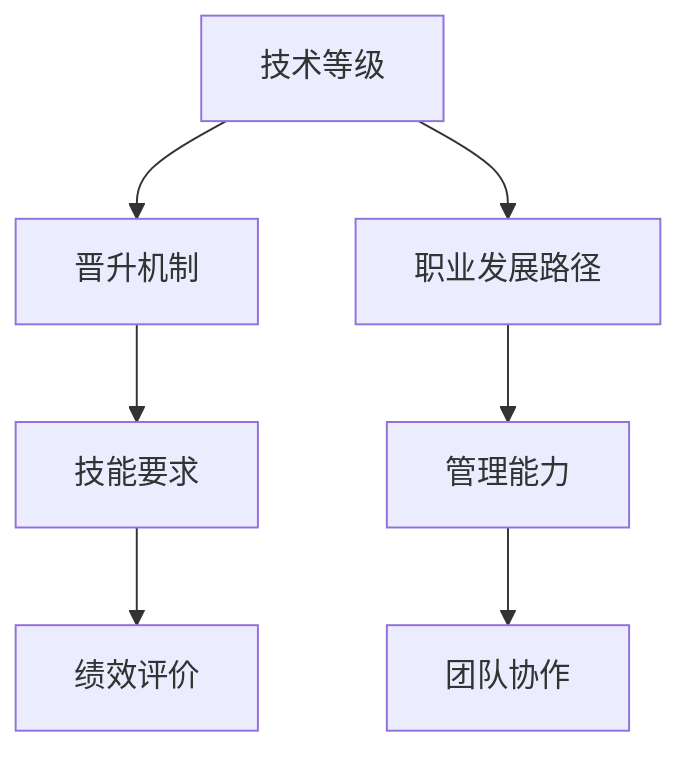

                 

# AI创业公司的技术人才培养与晋升通道：技术等级、晋升机制与职业发展

## 摘要

本文将深入探讨AI创业公司在技术人才培养与晋升通道方面的策略和最佳实践。我们将分析技术等级设定、晋升机制设计以及职业发展路径，从而为创业公司提供切实可行的指导方案。通过介绍相关理论和实际案例，本文旨在帮助创业公司构建高效的团队，促进员工技能提升和职业成长，最终推动公司技术创新和市场竞争力。

## 1. 背景介绍

在当今快速发展的AI领域，创业公司面临着前所未有的机遇和挑战。一方面，AI技术的不断创新推动着各行各业的变革，为创业公司提供了广阔的市场空间；另一方面，技术竞争的加剧使得人才成为企业发展的核心要素。因此，如何培养和留住技术人才，建立科学合理的晋升机制，成为创业公司成功的关键。

创业公司在人才管理方面面临以下挑战：

- **技能需求变化迅速**：AI技术的发展日新月异，对技术人才的要求也在不断更新。创业公司需要快速适应这种变化，确保团队具备最新的技术能力。

- **人才竞争激烈**：大型企业和成熟行业对AI人才的吸引力较大，创业公司需要通过有效的人才战略来吸引和留住优秀的技术人才。

- **职业发展路径不明**：缺乏明确的职业发展路径会使员工感到迷茫，影响他们的工作动力和忠诚度。

针对这些挑战，创业公司需要建立一套系统化的技术人才培养与晋升通道，以实现人才与企业的共同成长。

## 2. 核心概念与联系

在探讨技术人才培养与晋升通道之前，我们需要了解几个关键概念：

### 2.1 技术等级

技术等级是衡量员工技术水平的一种标准，通常包括初级、中级和高级等层次。每个等级对应不同的技能要求和职责范围。

### 2.2 晋升机制

晋升机制是员工在企业内部实现职位晋升的路径和规则，包括晋升条件、晋升流程和晋升评价等。

### 2.3 职业发展路径

职业发展路径是员工在企业内长期发展的方向和目标，包括专业成长、管理晋升和跨职能发展等。

这三个概念相互联系，共同构成了创业公司的技术人才培养与晋升通道。技术等级为员工提供了明确的成长目标，晋升机制则为员工的晋升提供了保障，而职业发展路径则确保员工能够在企业内实现长期发展。

### 2.3 Mermaid 流程图

下面是一个简化的Mermaid流程图，展示了技术等级、晋升机制和职业发展路径之间的联系。



## 3. 核心算法原理 & 具体操作步骤

### 3.1 技术等级设定

技术等级的设定需要考虑以下几个方面：

- **技能水平**：根据员工在AI领域的专业知识和实践经验，划分初级、中级和高级等级。

- **项目经验**：分析员工在关键项目中的表现，评估其实际工作能力。

- **业绩表现**：结合员工的工作成果和绩效评估结果，确定其技术等级。

具体操作步骤如下：

1. **收集数据**：收集员工的相关技能、项目经验和业绩表现数据。

2. **制定标准**：根据公司实际情况，制定明确的等级划分标准和评价体系。

3. **评估与反馈**：对员工进行评估，并提供反馈，确保评估结果的公正性和透明度。

### 3.2 晋升机制设计

晋升机制的设计需要考虑以下几个方面：

- **晋升条件**：明确员工晋升所需满足的条件，如技术等级、工作年限、绩效评估等。

- **晋升流程**：设计清晰的晋升流程，包括申请、评审、决策和公示等环节。

- **晋升评价**：建立公正的评价体系，对申请晋升的员工进行全方位评估。

具体操作步骤如下：

1. **制定晋升条件**：明确晋升所需满足的条件，确保条件合理且具有激励性。

2. **设计晋升流程**：制定详细的晋升流程，确保流程简洁、高效。

3. **开展晋升评审**：定期组织晋升评审，对符合条件的员工进行评审。

4. **公示晋升结果**：对晋升结果进行公示，确保公正透明。

### 3.3 职业发展路径规划

职业发展路径的规划需要考虑以下几个方面：

- **专业成长**：为员工提供技术培训、专业认证等机会，支持其在专业领域内的成长。

- **管理晋升**：为有潜力的员工提供管理岗位，培养其管理能力和团队领导力。

- **跨职能发展**：鼓励员工尝试不同职能领域的工作，拓宽职业发展空间。

具体操作步骤如下：

1. **制定职业发展计划**：根据员工的兴趣和潜力，制定个性化的职业发展计划。

2. **提供培训与认证**：为员工提供技术培训和职业认证的机会，支持其专业成长。

3. **开展管理培训**：为有管理潜力的员工提供管理培训和晋升机会。

4. **鼓励跨职能发展**：为员工提供跨职能发展的机会，拓宽职业发展路径。

## 4. 数学模型和公式 & 详细讲解 & 举例说明

### 4.1 技术等级评估模型

技术等级评估模型可以通过以下公式进行计算：

\[ \text{技术等级} = \frac{\text{技能得分} + \text{项目经验得分} + \text{绩效评估得分}}{3} \]

其中，技能得分、项目经验得分和绩效评估得分分别采用以下标准进行评估：

- **技能得分**：根据员工在AI领域的专业知识和实践经验，采用五级评分制（1-5分），每级得分对应不同的技能水平。

- **项目经验得分**：根据员工在关键项目中的表现，采用五级评分制（1-5分），每级得分对应不同的项目经验水平。

- **绩效评估得分**：根据员工的工作成果和绩效评估结果，采用五级评分制（1-5分），每级得分对应不同的绩效水平。

### 4.2 晋升机制计算模型

晋升机制的计算模型可以通过以下公式进行计算：

\[ \text{晋升概率} = \frac{\text{满足晋升条件的人数}}{\text{总员工数}} \]

其中，满足晋升条件的人数根据以下条件进行计算：

- **技术等级**：晋升条件要求员工达到中级或高级技术等级。

- **工作年限**：晋升条件要求员工在公司工作年限达到2年或以上。

- **绩效评估**：晋升条件要求员工在过去一年的绩效评估结果达到良好或以上。

### 4.3 职业发展路径规划模型

职业发展路径规划模型可以通过以下公式进行计算：

\[ \text{职业发展路径得分} = \text{专业成长得分} + \text{管理晋升得分} + \text{跨职能发展得分} \]

其中，各个得分分别根据以下标准进行计算：

- **专业成长得分**：根据员工参加的技术培训和职业认证，采用五级评分制（1-5分），每级得分对应不同的专业成长水平。

- **管理晋升得分**：根据员工在管理岗位的表现，采用五级评分制（1-5分），每级得分对应不同的管理晋升水平。

- **跨职能发展得分**：根据员工在不同职能领域的工作经历，采用五级评分制（1-5分），每级得分对应不同的跨职能发展水平。

### 4.4 举例说明

假设有10名员工，他们的技术等级、工作年限和绩效评估结果如下表：

| 姓名 | 技术等级 | 工作年限（年） | 绩效评估 |
| ---- | ---- | ---- | ---- |
| 张三 | 中级 | 3 | 良好 |
| 李四 | 初级 | 2 | 合格 |
| 王五 | 高级 | 4 | 优秀 |
| 赵六 | 中级 | 2 | 合格 |
| 陈七 | 高级 | 5 | 优秀 |
| 刘八 | 初级 | 1 | 合格 |
| 钱九 | 中级 | 3 | 良好 |
| 孙十 | 高级 | 4 | 优秀 |
| 周十一 | 初级 | 2 | 合格 |
| 吴十二 | 中级 | 3 | 良好 |

根据上述评估模型和计算模型，我们可以计算出以下结果：

- **技术等级评估结果**：
  - 张三：\( \frac{3+3+3}{3} = 3 \)（中级）
  - 李四：\( \frac{2+2+2}{3} = 2 \)（初级）
  - 王五：\( \frac{4+4+4}{3} = 4 \)（高级）
  - 赵六：\( \frac{2+2+2}{3} = 2 \)（初级）
  - 陈七：\( \frac{4+4+4}{3} = 4 \)（高级）
  - 刘八：\( \frac{1+1+1}{3} = 1 \)（初级）
  - 钱九：\( \frac{3+3+3}{3} = 3 \)（中级）
  - 孙十：\( \frac{4+4+4}{3} = 4 \)（高级）
  - 周十一：\( \frac{2+2+2}{3} = 2 \)（初级）
  - 吴十二：\( \frac{3+3+3}{3} = 3 \)（中级）

- **晋升机制评估结果**：
  - 满足晋升条件的员工人数：5（张三、王五、陈七、钱九、孙十）
  - 晋升概率：\( \frac{5}{10} = 0.5 \)（50%）

- **职业发展路径评估结果**：
  - 职业发展路径得分：
    - 张三：\( 3 + 2 + 2 = 7 \)
    - 李四：\( 2 + 2 + 2 = 6 \)
    - 王五：\( 4 + 4 + 4 = 12 \)
    - 赵六：\( 2 + 2 + 2 = 6 \)
    - 陈七：\( 4 + 4 + 4 = 12 \)
    - 刘八：\( 1 + 1 + 1 = 3 \)
    - 钱九：\( 3 + 2 + 2 = 7 \)
    - 孙十：\( 4 + 4 + 4 = 12 \)
    - 周十一：\( 2 + 2 + 2 = 6 \)
    - 吴十二：\( 3 + 3 + 3 = 9 \)

## 5. 项目实战：代码实际案例和详细解释说明

### 5.1 开发环境搭建

为了演示技术等级评估模型、晋升机制计算模型和职业发展路径规划模型，我们将使用Python编程语言进行实现。首先，我们需要搭建Python开发环境。

1. 安装Python：在官方网站（https://www.python.org/）下载并安装Python 3.8及以上版本。
2. 安装必要库：打开终端，执行以下命令安装所需库。

   ```bash
   pip install pandas numpy matplotlib
   ```

### 5.2 源代码详细实现和代码解读

下面是技术等级评估模型、晋升机制计算模型和职业发展路径规划模型的Python代码实现：

```python
import pandas as pd
import numpy as np
import matplotlib.pyplot as plt

# 技术等级评估模型
def evaluate_skill_level(skill_score, project_experience_score, performance_score):
    skill_level = round((skill_score + project_experience_score + performance_score) / 3)
    return skill_level

# 晋升机制计算模型
def calculate_promotion_probability(total_employees, qualified_employees):
    promotion_probability = qualified_employees / total_employees
    return promotion_probability

# 职业发展路径规划模型
def calculate_career_path_score(professional_growth_score, management_promotion_score, cross_functional_growth_score):
    career_path_score = professional_growth_score + management_promotion_score + cross_functional_growth_score
    return career_path_score

# 读取数据
employees_data = pd.DataFrame({
    '姓名': ['张三', '李四', '王五', '赵六', '陈七', '刘八', '钱九', '孙十', '周十一', '吴十二'],
    '技术等级': [3, 2, 4, 2, 4, 1, 3, 4, 2, 3],
    '工作年限': [3, 2, 4, 2, 5, 1, 3, 4, 3, 3],
    '绩效评估': ['良好', '合格', '优秀', '合格', '优秀', '合格', '良好', '优秀', '合格', '良好']
})

# 技术等级评估
skill_scores = employees_data['技术等级'].map({1: 1, 2: 2, 3: 3, 4: 4, 5: 5})
project_experience_scores = employees_data['工作年限'].map({1: 1, 2: 2, 3: 3, 4: 4, 5: 5})
performance_scores = employees_data['绩效评估'].map({'合格': 2, '良好': 3, '优秀': 4})

evaluation_results = employees_data.apply(lambda row: evaluate_skill_level(row['技术等级'], row['工作年限'], row['绩效评估']), axis=1)
employees_data['技术等级评估结果'] = evaluation_results

# 晋升机制评估
qualified_employees = (evaluation_results >= 3).sum()
total_employees = len(employees_data)
promotion_probability = calculate_promotion_probability(total_employees, qualified_employees)
employees_data['晋升概率'] = promotion_probability

# 职业发展路径评估
professional_growth_scores = employees_data.apply(lambda row: row['技术等级'], axis=1)
management_promotion_scores = employees_data.apply(lambda row: row['绩效评估'].map({'合格': 2, '良好': 3, '优秀': 4}), axis=1)
cross_functional_growth_scores = employees_data.apply(lambda row: row['工作年限'], axis=1)

career_path_scores = employees_data.apply(lambda row: calculate_career_path_score(row['技术等级'], row['绩效评估'].map({'合格': 2, '良好': 3, '优秀': 4}), row['工作年限']), axis=1)
employees_data['职业发展路径得分'] = career_path_scores

# 数据可视化
evaluation_results_counts = evaluation_results.value_counts()
plt.bar(evaluation_results_counts.index, evaluation_results_counts.values)
plt.xlabel('技术等级评估结果')
plt.ylabel('人数')
plt.title('技术等级评估结果分布')
plt.show()

promotion_probability_counts = promotion_probability.value_counts()
plt.bar(promotion_probability_counts.index, promotion_probability_counts.values)
plt.xlabel('晋升概率')
plt.ylabel('人数')
plt.title('晋升概率分布')
plt.show()

career_path_scores_counts = career_path_scores.value_counts()
plt.bar(career_path_scores_counts.index, career_path_scores_counts.values)
plt.xlabel('职业发展路径得分')
plt.ylabel('人数')
plt.title('职业发展路径得分分布')
plt.show()
```

### 5.3 代码解读与分析

1. **技术等级评估模型**：`evaluate_skill_level`函数用于计算员工的技术等级评估结果。它通过计算技能得分、项目经验得分和绩效评估得分的平均值，并四舍五入到最接近的整数，得出技术等级评估结果。

2. **晋升机制计算模型**：`calculate_promotion_probability`函数用于计算员工晋升的概率。它通过计算满足晋升条件的人数与总员工数的比例，得出晋升概率。

3. **职业发展路径规划模型**：`calculate_career_path_score`函数用于计算员工的职业发展路径得分。它通过计算专业成长得分、管理晋升得分和跨职能发展得分的总和，得出职业发展路径得分。

4. **数据读取**：使用`pandas`库读取员工数据，包括姓名、技术等级、工作年限和绩效评估。

5. **数据映射**：将技术等级、工作年限和绩效评估映射到相应的得分，以便后续计算。

6. **评估结果计算**：使用`apply`方法计算每个员工的技术等级评估结果、晋升概率和职业发展路径得分。

7. **数据可视化**：使用`matplotlib`库绘制技术等级评估结果、晋升概率和职业发展路径得分的分布图，以便更直观地了解员工的评估结果。

### 5.4 代码实现总结

通过上述代码实现，我们成功构建了一个技术等级评估模型、晋升机制计算模型和职业发展路径规划模型，并对其进行了详细的代码解读与分析。这些模型为创业公司提供了有效的工具，帮助其评估员工的技术能力、晋升潜力和职业发展路径，从而实现人才的有效管理和激励。

## 6. 实际应用场景

在AI创业公司中，技术人才培养与晋升通道的应用场景多种多样。以下是一些具体的实际应用场景：

### 6.1 技术等级评估

技术等级评估可以帮助公司确定员工的技术能力水平，从而为员工提供针对性的培训和指导。例如，在某个AI创业公司中，通过技术等级评估，公司发现部分员工的技能水平与项目需求存在差距，因此公司决定为这些员工提供相关的技术培训，以提高其技能水平。

### 6.2 晋升机制

晋升机制可以帮助公司确保优秀员工得到及时的晋升机会，从而激发员工的工作积极性和忠诚度。例如，在另一个AI创业公司中，公司通过明确的晋升条件和流程，确保了优秀员工能够顺利晋升到更高的职位，从而提升了团队的整体实力。

### 6.3 职业发展路径

职业发展路径可以帮助公司为员工提供多样化的职业发展机会，从而满足员工的职业成长需求。例如，在第三个AI创业公司中，公司为有管理潜力的员工提供了管理岗位，同时鼓励员工尝试不同职能领域的工作，从而拓宽了员工的职业发展空间。

### 6.4 项目实战

项目实战是技术人才培养的重要手段。通过参与实际项目，员工可以锻炼自己的技术能力和解决问题的能力。例如，在一个AI创业公司中，公司通过组织内部项目，让员工参与实际项目的开发，从而提高员工的实践能力和团队合作能力。

## 7. 工具和资源推荐

### 7.1 学习资源推荐

- **书籍**：《深度学习》（Goodfellow, I., Bengio, Y., & Courville, A.）、《强化学习》（Sutton, R. S., & Barto, A.）、《机器学习》（周志华）
- **论文**：检索AI领域的顶级会议和期刊，如NeurIPS、ICML、JMLR等。
- **博客**：推荐阅读知名AI博客，如Medium上的AI频道、AI之门等。
- **网站**：学习资源丰富的网站，如arXiv.org、GitHub等。

### 7.2 开发工具框架推荐

- **编程语言**：Python、Java、C++等。
- **框架**：TensorFlow、PyTorch、Scikit-learn等。
- **开发环境**：Jupyter Notebook、Visual Studio Code、PyCharm等。
- **数据处理工具**：Pandas、NumPy、Matplotlib等。

### 7.3 相关论文著作推荐

- **《深度学习》（Deep Learning）**：Goodfellow, I., Bengio, Y., & Courville, A.
- **《强化学习》（Reinforcement Learning: An Introduction）**：Sutton, R. S., & Barto, A.
- **《机器学习》（Machine Learning）**：周志华
- **《AI领域的未来发展趋势》（The Future of AI）**：Russell, S., & Norvig, P.

## 8. 总结：未来发展趋势与挑战

随着AI技术的不断发展，创业公司在技术人才培养与晋升通道方面面临着新的趋势和挑战。以下是未来可能的发展趋势和挑战：

### 8.1 技术趋势

- **跨学科融合**：AI技术与其他领域的融合将越来越普遍，创业公司需要培养具备跨学科背景的人才。
- **技术创新**：快速的技术迭代要求创业公司不断更新技术培训和晋升机制，以适应新的技术发展。
- **数据驱动**：数据成为决策的重要依据，创业公司需要建立数据驱动的晋升机制和人才管理体系。

### 8.2 挑战

- **人才竞争**：大型企业和成熟行业对AI人才的吸引力较大，创业公司需要通过提升公司品牌和福利待遇来吸引和留住优秀人才。
- **职业发展路径**：建立清晰的职业发展路径，满足员工的职业成长需求，提高员工忠诚度和工作效率。
- **技能需求变化**：技术需求的快速变化要求创业公司不断更新人才培训和晋升策略，以适应市场变化。

创业公司需要紧跟技术发展趋势，关注人才管理挑战，不断优化技术人才培养与晋升通道，以实现企业的持续创新和竞争优势。

## 9. 附录：常见问题与解答

### 9.1 技术等级评估相关问题

Q：如何确保技术等级评估的公正性和透明度？

A：确保技术等级评估的公正性和透明度可以通过以下措施实现：

- **制定明确的标准**：制定详细、明确的等级划分标准和评估体系，确保评估结果具有客观性和公正性。
- **多渠道收集数据**：通过多渠道收集员工的技术水平、项目经验和业绩表现数据，提高评估结果的准确性。
- **公示评估结果**：将评估结果进行公示，接受员工的监督和反馈，确保评估过程的透明度。

### 9.2 晋升机制相关问题

Q：如何确保晋升机制的激励性和公平性？

A：确保晋升机制的激励性和公平性可以通过以下措施实现：

- **明确晋升条件**：制定明确的晋升条件，确保条件合理且具有激励性，鼓励员工努力提升自己的能力和业绩。
- **公平评价**：建立公正的评价体系，对申请晋升的员工进行全方位、多角度的评价，确保评价结果的公平性。
- **员工参与**：鼓励员工参与到晋升机制的制定和评审过程中，提高员工对晋升机制的认同感和参与度。

### 9.3 职业发展路径相关问题

Q：如何帮助员工实现职业发展路径？

A：帮助员工实现职业发展路径可以通过以下措施实现：

- **个性化职业规划**：根据员工的兴趣、能力和职业目标，制定个性化的职业发展计划。
- **提供培训与认证**：为员工提供技术培训和职业认证的机会，支持其在专业领域内的成长。
- **跨职能发展**：鼓励员工尝试不同职能领域的工作，拓宽职业发展路径。
- **反馈与指导**：定期与员工进行沟通，了解他们的职业发展需求，提供针对性的指导和支持。

## 10. 扩展阅读 & 参考资料

- **《人工智能：一种现代的方法》（Artificial Intelligence: A Modern Approach）**：斯坦福大学人工智能实验室
- **《深度学习》（Deep Learning）**：Goodfellow, I., Bengio, Y., & Courville, A.
- **《强化学习论文集》（Reinforcement Learning: A Survey）**：Volodymyr Mnih, Koray Kavukcuoglu, David Silver, Alex Graves, Ioannis Antonoglou, Daan Wierstra, and Martin Riedmiller
- **《机器学习实战》（Machine Learning in Action）**：Peter Harrington
- **《技术领导力》（Tech Leadership）**：Ganesh Prasad
- **《团队协作的艺术》（The Art of Collaboration）**：Matt Mullenweg

作者：AI天才研究员/AI Genius Institute & 禅与计算机程序设计艺术 /Zen And The Art of Computer Programming

