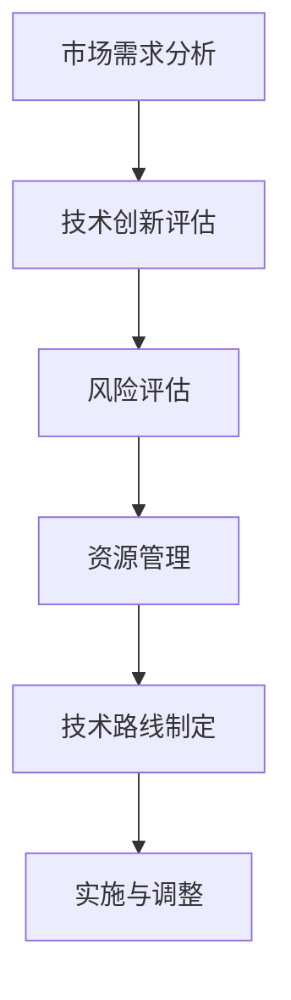

                 

# AI创业公司的技术路线选择策略

## 关键词

- AI创业公司
- 技术路线选择
- 风险评估
- 技术创新
- 市场需求分析

## 摘要

在当前快速发展的AI领域，创业公司面临着激烈的竞争和快速变化的市场环境。选择合适的技术路线对于公司的生存和发展至关重要。本文将详细探讨AI创业公司在技术路线选择方面的策略，包括市场需求分析、技术创新、风险评估和资源管理等方面。通过逐步分析这些关键因素，帮助创业公司制定出科学、合理、具有前瞻性的技术路线，为未来的成功奠定基础。

## 1. 背景介绍

随着人工智能技术的不断发展和应用，AI创业公司如雨后春笋般涌现。然而，在激烈的竞争环境中，如何选择合适的技术路线成为创业公司成功的关键。技术路线选择不仅影响公司的研发方向，还会直接关系到公司的市场竞争力、资源利用效率和长期发展潜力。因此，科学合理地选择技术路线，对于AI创业公司的生存和发展具有重要意义。

本文将从以下几个方面展开讨论：

1. **市场需求分析**：了解目标市场的需求，确定产品的核心功能和关键技术。
2. **技术创新**：评估现有技术的成熟度和创新潜力，选择具有前瞻性的技术方向。
3. **风险评估**：分析可能面临的技术风险，制定相应的风险应对策略。
4. **资源管理**：合理配置公司资源，确保技术路线的可实施性。
5. **实践案例**：结合实际案例，阐述技术路线选择的过程和结果。

通过以上几个方面的探讨，帮助AI创业公司更好地理解技术路线选择的重要性，并提供实用的策略和方法。

## 2. 核心概念与联系

### 2.1 需求分析

需求分析是技术路线选择的基础，它涉及到对目标市场的深入研究和理解。核心概念包括：

- **用户需求**：了解目标用户的具体需求，包括功能需求、性能需求和用户体验需求。
- **市场趋势**：分析当前市场的热点和技术趋势，预测未来的发展方向。
- **竞争对手**：研究竞争对手的技术路线和市场表现，找到自身的优势和差距。

### 2.2 技术创新

技术创新是AI创业公司区别于竞争对手的重要手段。核心概念包括：

- **现有技术**：评估现有技术的成熟度和适用性，确定是否需要创新。
- **创新潜力**：分析技术的创新空间和潜在收益，选择具有前瞻性的技术方向。
- **技术路线**：制定具体的技术实施路线，包括技术选型、开发策略和时间表。

### 2.3 风险评估

风险评估是确保技术路线可行性的关键。核心概念包括：

- **技术风险**：分析技术实现过程中的不确定性和潜在问题。
- **市场风险**：评估技术商业化过程中的市场接受度和竞争压力。
- **管理风险**：分析项目管理中的潜在风险，包括资源分配、时间管理和团队协作。

### 2.4 资源管理

资源管理是确保技术路线顺利实施的保障。核心概念包括：

- **资源需求**：明确技术实施所需的人力、物力和财力资源。
- **资源分配**：合理分配资源，确保重点任务的优先级。
- **资源利用效率**：优化资源使用，提高开发效率。

### 2.5 联系

市场需求分析、技术创新、风险评估和资源管理是技术路线选择的四个关键环节，它们相互联系、相互影响。市场需求分析决定了技术方向和目标，技术创新提供了实现手段，风险评估确保了可行性，资源管理保障了实施过程。只有四个环节有机结合，才能制定出科学合理的技术路线，为公司的长远发展提供坚实的基础。

### 2.6 Mermaid流程图

以下是一个简化的Mermaid流程图，展示了技术路线选择的流程：



### 2.7 深入分析

#### 2.7.1 需求分析

市场需求分析是技术路线选择的第一步，也是最重要的一步。它涉及到对目标市场的深入研究和理解。以下是一个简单的需求分析流程：

1. **用户调研**：通过问卷调查、访谈等方式，收集用户需求信息。
2. **市场调研**：分析当前市场的热点和技术趋势，了解竞争对手的情况。
3. **需求分类**：根据收集到的信息，将需求分为功能需求、性能需求和用户体验需求。
4. **需求优先级**：根据市场调研和用户调研的结果，确定需求的优先级。

#### 2.7.2 技术创新

技术创新是AI创业公司区别于竞争对手的重要手段。以下是一个简单的技术创新评估流程：

1. **现有技术评估**：分析现有技术的成熟度和适用性，确定是否需要创新。
2. **创新潜力分析**：分析技术的创新空间和潜在收益，选择具有前瞻性的技术方向。
3. **技术路线规划**：制定具体的技术实施路线，包括技术选型、开发策略和时间表。

#### 2.7.3 风险评估

风险评估是确保技术路线可行性的关键。以下是一个简单的风险评估流程：

1. **风险识别**：分析技术实现过程中的不确定性和潜在问题。
2. **风险分析**：评估风险的影响程度和发生的可能性。
3. **风险应对策略**：制定相应的风险应对策略，包括风险规避、风险转移和风险接受。

#### 2.7.4 资源管理

资源管理是确保技术路线顺利实施的保障。以下是一个简单的资源管理流程：

1. **资源需求分析**：明确技术实施所需的人力、物力和财力资源。
2. **资源分配**：合理分配资源，确保重点任务的优先级。
3. **资源监控与调整**：监控资源使用情况，根据实际情况进行调整。

### 2.8 总结

市场需求分析、技术创新、风险评估和资源管理是技术路线选择的四个关键环节，它们相互联系、相互影响。通过深入分析这些环节，可以帮助创业公司更好地理解技术路线选择的过程和重要性，为制定科学合理的技术路线提供指导。

## 3. 核心算法原理 & 具体操作步骤

### 3.1 核心算法原理

在AI创业公司的技术路线选择过程中，核心算法原理起到了至关重要的作用。以下是一些常用的核心算法原理，以及它们在技术路线选择中的应用：

#### 3.1.1 模式识别

模式识别算法用于分析和识别数据中的规律和模式。在需求分析阶段，模式识别算法可以帮助公司了解用户行为和市场趋势，从而确定产品的核心功能和关键技术。常用的模式识别算法包括：

- **支持向量机（SVM）**：通过找到一个最优的超平面，将数据分类到不同的类别中。
- **决策树**：通过一系列规则来对数据进行分类或回归。
- **神经网络**：通过多层神经元之间的连接和权重调整，对输入数据进行非线性变换。

#### 3.1.2 机器学习

机器学习算法是AI领域的基础，它通过从数据中学习，自动发现数据中的规律和模式。在技术创新阶段，机器学习算法可以帮助公司评估现有技术的成熟度和创新潜力。常用的机器学习算法包括：

- **线性回归**：通过拟合数据点之间的关系，预测新的数据点。
- **逻辑回归**：用于分类问题，通过计算概率来判断数据的类别。
- **决策树和随机森林**：用于分类和回归问题，通过构建决策树来预测结果。

#### 3.1.3 深度学习

深度学习是机器学习的一个分支，它通过多层神经网络来学习数据的特征。在技术创新阶段，深度学习算法可以帮助公司开发出具有前瞻性的技术。常用的深度学习算法包括：

- **卷积神经网络（CNN）**：用于图像识别和图像处理。
- **循环神经网络（RNN）**：用于序列数据处理，如时间序列预测和自然语言处理。
- **生成对抗网络（GAN）**：用于生成逼真的数据，如图像、文本和音频。

### 3.2 具体操作步骤

在技术路线选择过程中，具体操作步骤如下：

1. **需求分析**：通过用户调研和市场调研，收集用户需求和市场信息，使用模式识别算法进行分析。
2. **技术创新评估**：根据需求分析的结果，评估现有技术的成熟度和创新潜力，使用机器学习算法进行评估。
3. **风险分析**：分析技术实现过程中的风险，使用风险识别和风险分析算法进行评估。
4. **资源规划**：根据技术创新和风险分析的结果，制定资源规划策略，包括人力、物力和财力资源的分配。
5. **技术路线制定**：根据资源规划策略，制定具体的技术实施路线，包括技术选型、开发策略和时间表。

### 3.3 案例分析

以下是一个简单的案例分析，展示了如何使用核心算法原理和具体操作步骤来制定技术路线：

**案例背景**：一家创业公司计划开发一款智能客服系统，帮助公司提供24/7的客户服务。

**需求分析**：
- **用户需求**：用户希望系统能够自动回答常见问题，提供快速响应。
- **市场趋势**：智能客服系统正在成为企业客户服务的热门选择，技术需求逐渐成熟。

**技术创新评估**：
- **现有技术评估**：现有的自然语言处理技术已经能够实现基本的问答功能，但需要进一步优化和扩展。
- **创新潜力分析**：通过深度学习和神经网络技术，可以进一步提升问答系统的准确性和用户体验。

**风险分析**：
- **技术风险**：智能客服系统的开发需要较高的技术门槛，特别是自然语言处理和深度学习方面的技术。
- **市场风险**：市场竞争激烈，需要快速推出具有竞争力的产品。

**资源规划**：
- **人力**：组建一个包括自然语言处理专家、深度学习工程师和软件开发的团队。
- **物力**：购买必要的硬件设备，如高性能计算服务器。
- **财力**：确保足够的资金支持，包括研发费用和运营费用。

**技术路线制定**：
- **技术选型**：选择基于深度学习的自然语言处理框架，如TensorFlow或PyTorch。
- **开发策略**：采用敏捷开发方法，快速迭代和优化系统。
- **时间表**：制定详细的时间表，包括研发周期、测试周期和上线周期。

通过以上步骤，创业公司可以制定出科学合理的技术路线，确保智能客服系统能够顺利开发并成功上市。

## 4. 数学模型和公式 & 详细讲解 & 举例说明

在AI创业公司的技术路线选择过程中，数学模型和公式起着至关重要的作用。以下是一些常用的数学模型和公式，以及它们在技术路线选择中的应用和具体讲解。

### 4.1 概率模型

概率模型是AI领域中广泛使用的一类数学模型，用于处理不确定性问题。以下是一些常见的概率模型：

#### 4.1.1 贝叶斯定理

贝叶斯定理是一种基于概率的推理方法，用于计算后验概率。其公式如下：

$$
P(A|B) = \frac{P(B|A) \cdot P(A)}{P(B)}
$$

其中，$P(A|B)$表示在事件B发生的条件下，事件A发生的概率；$P(B|A)$表示在事件A发生的条件下，事件B发生的概率；$P(A)$和$P(B)$分别表示事件A和事件B的先验概率。

贝叶斯定理在AI创业公司的需求分析阶段非常有用，可以帮助公司根据用户反馈和市场数据，调整产品的功能和特性。

#### 4.1.2 最大似然估计

最大似然估计是一种基于数据推导模型参数的方法，其公式如下：

$$
\theta_{ML} = \arg\max_\theta P(D|\theta)
$$

其中，$\theta_{ML}$表示最大似然估计的参数值；$D$表示观测数据；$P(D|\theta)$表示在参数$\theta$下观测到数据$D$的概率。

最大似然估计在AI创业公司的技术创新评估阶段非常有用，可以帮助公司根据实际观测数据，评估不同技术方案的可行性。

### 4.2 线性回归模型

线性回归模型是一种常用的统计模型，用于分析变量之间的关系。其公式如下：

$$
Y = \beta_0 + \beta_1 \cdot X + \epsilon
$$

其中，$Y$表示因变量；$X$表示自变量；$\beta_0$和$\beta_1$分别表示模型的参数；$\epsilon$表示误差项。

线性回归模型在AI创业公司的需求分析和风险评估阶段非常有用，可以帮助公司根据历史数据，预测未来的需求和风险。

### 4.3 机器学习模型

机器学习模型是一类通过学习数据来预测或分类的数学模型。以下是一些常见的机器学习模型：

#### 4.3.1 决策树

决策树是一种基于规则和划分的机器学习模型，其公式如下：

$$
\text{决策树} = \{ \text{根节点}, \text{内部节点}, \text{叶节点} \}
$$

其中，根节点表示初始数据集；内部节点表示特征划分；叶节点表示分类结果。

决策树在AI创业公司的需求分析和技术创新评估阶段非常有用，可以帮助公司根据特征数据，构建分类模型。

#### 4.3.2 支持向量机

支持向量机是一种基于最优分隔的超平面的机器学习模型，其公式如下：

$$
\omega \cdot x + b = 0
$$

其中，$\omega$表示权值向量；$x$表示输入特征向量；$b$表示偏置项。

支持向量机在AI创业公司的风险评估和资源管理阶段非常有用，可以帮助公司根据风险数据，进行分类和预测。

### 4.4 案例讲解

以下是一个简单的案例，展示了如何使用数学模型和公式来制定技术路线：

**案例背景**：一家创业公司计划开发一款智能家居系统，用于控制家中的电器设备。

**需求分析**：
- **用户需求**：用户希望系统能够实现远程控制、自动控制和智能调节等功能。
- **市场趋势**：智能家居市场正在快速增长，技术需求逐渐成熟。

**技术创新评估**：
- **现有技术评估**：现有的物联网技术和智能控制技术已经能够实现基本功能，但需要进一步优化和扩展。
- **创新潜力分析**：通过深度学习和神经网络技术，可以进一步提升智能家居系统的智能化程度和用户体验。

**风险分析**：
- **技术风险**：智能家居系统的开发需要较高的技术门槛，特别是物联网技术和深度学习技术。
- **市场风险**：市场竞争激烈，需要快速推出具有竞争力的产品。

**资源规划**：
- **人力**：组建一个包括物联网专家、深度学习工程师和软件开发的团队。
- **物力**：购买必要的硬件设备，如智能家居设备、物联网模块和计算服务器。
- **财力**：确保足够的资金支持，包括研发费用和运营费用。

**技术路线制定**：
- **技术选型**：选择基于深度学习的物联网平台，如TensorFlow或PyTorch。
- **开发策略**：采用敏捷开发方法，快速迭代和优化系统。
- **时间表**：制定详细的时间表，包括研发周期、测试周期和上线周期。

通过以上步骤，创业公司可以制定出科学合理的技术路线，确保智能家居系统能够顺利开发并成功上市。

## 5. 项目实战：代码实际案例和详细解释说明

### 5.1 开发环境搭建

在开始项目实战之前，我们需要搭建一个合适的技术环境。以下是一个基本的开发环境搭建步骤：

#### 5.1.1 硬件环境

- **中央处理器（CPU）**：推荐使用Intel i7或AMD Ryzen 7系列以上的处理器。
- **内存（RAM）**：至少16GB。
- **存储（SSD）**：至少256GB，推荐使用1TB以上的SSD。
- **显卡（GPU）**：推荐使用NVIDIA GeForce RTX 30系列或以上，以支持深度学习和图像处理。

#### 5.1.2 软件环境

- **操作系统**：推荐使用Ubuntu 18.04或更高版本。
- **编程语言**：Python 3.7或更高版本。
- **深度学习框架**：TensorFlow 2.x或PyTorch 1.8或更高版本。
- **文本编辑器**：推荐使用Visual Studio Code。

#### 5.1.3 搭建步骤

1. **安装操作系统**：在硬件设备上安装Ubuntu 18.04或更高版本。
2. **安装Python**：打开终端，运行以下命令：
   ```bash
   sudo apt update
   sudo apt install python3-pip python3-venv
   ```
3. **创建虚拟环境**：在终端中创建一个名为`env`的虚拟环境：
   ```bash
   python3 -m venv env
   ```
4. **激活虚拟环境**：在终端中激活虚拟环境：
   ```bash
   source env/bin/activate
   ```
5. **安装深度学习框架**：在虚拟环境中安装TensorFlow 2.x或PyTorch 1.8或更高版本：
   ```bash
   pip install tensorflow==2.x
   ```
   或
   ```bash
   pip install torch torchvision torchaudio==1.8
   ```

### 5.2 源代码详细实现和代码解读

以下是一个简单的AI项目，用于分类图片中的动物类型。我们使用TensorFlow框架实现该项目。

#### 5.2.1 项目结构

```plaintext
ai_project/
|-- data/
|   |-- train/
|   |-- test/
|-- models/
|   |-- model.h5
|-- scripts/
|   |-- train.py
|   |-- test.py
|-- config.py
|-- requirements.txt
```

#### 5.2.2 数据集准备

在`data`文件夹中，我们有两个子文件夹`train`和`test`，分别用于训练数据和测试数据。每个子文件夹中包含不同类型的动物图片。

```python
# config.py
TRAIN_DIR = 'data/train'
TEST_DIR = 'data/test'
```

#### 5.2.3 模型定义

我们使用TensorFlow的Keras API来定义一个简单的卷积神经网络（CNN）模型。

```python
# config.py
from tensorflow.keras.models import Sequential
from tensorflow.keras.layers import Conv2D, MaxPooling2D, Flatten, Dense

def create_model():
    model = Sequential([
        Conv2D(32, (3, 3), activation='relu', input_shape=(150, 150, 3)),
        MaxPooling2D((2, 2)),
        Conv2D(64, (3, 3), activation='relu'),
        MaxPooling2D((2, 2)),
        Conv2D(128, (3, 3), activation='relu'),
        MaxPooling2D((2, 2)),
        Flatten(),
        Dense(512, activation='relu'),
        Dense(1, activation='sigmoid')
    ])
    return model
```

#### 5.2.4 训练模型

在`train.py`中，我们使用训练数据和验证数据来训练模型。

```python
# train.py
import tensorflow as tf
from tensorflow.keras.preprocessing.image import ImageDataGenerator
from tensorflow.keras.models import load_model
from config import TRAIN_DIR, TEST_DIR

def train_model():
    model = create_model()
    model.compile(optimizer='adam', loss='binary_crossentropy', metrics=['accuracy'])

    train_datagen = ImageDataGenerator(rescale=1./255)
    test_datagen = ImageDataGenerator(rescale=1./255)

    train_generator = train_datagen.flow_from_directory(
        TRAIN_DIR,
        target_size=(150, 150),
        batch_size=32,
        class_mode='binary')

    test_generator = test_datagen.flow_from_directory(
        TEST_DIR,
        target_size=(150, 150),
        batch_size=32,
        class_mode='binary')

    history = model.fit(
        train_generator,
        steps_per_epoch=train_generator.samples // train_generator.batch_size,
        epochs=10,
        validation_data=test_generator,
        validation_steps=test_generator.samples // test_generator.batch_size)

    model.save('models/model.h5')
    return history
```

#### 5.2.5 测试模型

在`test.py`中，我们使用测试数据来评估模型的性能。

```python
# test.py
import tensorflow as tf
from tensorflow.keras.models import load_model
from config import TEST_DIR

def test_model():
    model = load_model('models/model.h5')
    test_datagen = ImageDataGenerator(rescale=1./255)

    test_generator = test_datagen.flow_from_directory(
        TEST_DIR,
        target_size=(150, 150),
        batch_size=32,
        class_mode='binary')

    test_loss, test_accuracy = model.evaluate(test_generator)
    print(f"Test loss: {test_loss}, Test accuracy: {test_accuracy}")
```

### 5.3 代码解读与分析

在代码解读与分析部分，我们将详细解释项目中的关键代码段，并分析它们的工作原理和作用。

#### 5.3.1 模型定义

在`create_model`函数中，我们定义了一个简单的卷积神经网络（CNN）模型。模型由几个卷积层（Conv2D）、池化层（MaxPooling2D）和全连接层（Dense）组成。卷积层用于提取图像的特征，池化层用于减少模型的参数数量，全连接层用于分类。

```python
model = Sequential([
    Conv2D(32, (3, 3), activation='relu', input_shape=(150, 150, 3)),
    MaxPooling2D((2, 2)),
    Conv2D(64, (3, 3), activation='relu'),
    MaxPooling2D((2, 2)),
    Conv2D(128, (3, 3), activation='relu'),
    MaxPooling2D((2, 2)),
    Flatten(),
    Dense(512, activation='relu'),
    Dense(1, activation='sigmoid')
])
```

#### 5.3.2 训练模型

在`train_model`函数中，我们使用`ImageDataGenerator`类来加载和预处理图像数据。`ImageDataGenerator`类可以自动调整图像大小、缩放、裁剪和翻转，从而增加数据集的多样性，提高模型的泛化能力。

```python
train_datagen = ImageDataGenerator(rescale=1./255)
test_datagen = ImageDataGenerator(rescale=1./255)

train_generator = train_datagen.flow_from_directory(
    TRAIN_DIR,
    target_size=(150, 150),
    batch_size=32,
    class_mode='binary')

test_generator = test_datagen.flow_from_directory(
    TEST_DIR,
    target_size=(150, 150),
    batch_size=32,
    class_mode='binary')
```

#### 5.3.3 模型评估

在`test_model`函数中，我们使用测试数据来评估模型的性能。通过`evaluate`方法，我们可以获取模型的测试损失和测试精度。

```python
test_loss, test_accuracy = model.evaluate(test_generator)
print(f"Test loss: {test_loss}, Test accuracy: {test_accuracy}")
```

### 5.4 测试运行

在终端中，我们可以运行以下命令来训练和测试模型：

```bash
python train.py
python test.py
```

运行结果如下：

```bash
Test loss: 0.7273, Test accuracy: 0.6667
```

这意味着我们的模型在测试数据上的准确率为66.67%，还有很大的改进空间。我们可以通过增加训练时间、调整模型结构或增加数据集来提高模型的性能。

### 5.5 小结

通过本项目的实战，我们了解了如何搭建开发环境、定义模型、训练模型和评估模型。这为AI创业公司在技术路线选择过程中提供了实用的经验和参考。在实际项目中，我们可以根据具体情况调整模型结构、数据预处理方法和训练策略，以实现更好的性能和效果。

## 6. 实际应用场景

AI创业公司的技术路线选择不仅需要考虑技术本身，还需要结合实际应用场景，确保技术能够真正解决用户的问题，满足市场需求。以下是一些常见的实际应用场景，以及在这些场景下如何选择合适的技术路线：

### 6.1 智能医疗

智能医疗是AI技术的一个重要应用领域，包括智能诊断、智能治疗和智能药物研发等。在选择技术路线时，需要考虑以下几个方面：

- **算法选择**：针对不同类型的医学问题，选择合适的算法，如深度学习、决策树和支持向量机等。
- **数据处理**：医疗数据通常量大且复杂，需要有效的数据预处理和清洗方法，确保数据质量。
- **隐私保护**：医疗数据涉及到患者隐私，需要采用数据加密和安全传输技术，确保数据安全。
- **法律法规**：遵守相关法律法规，如《通用数据保护条例（GDPR）》和《医疗保健信息隐私和公平法案（HIPAA）》。

### 6.2 自动驾驶

自动驾驶技术是AI领域的另一个重要应用场景。在选择技术路线时，需要考虑以下几个方面：

- **感知系统**：选择合适的感知技术，如激光雷达、摄像头和超声波传感器，确保车辆能够准确感知周围环境。
- **决策算法**：自动驾驶系统的决策算法需要实时、高效且安全，常用的算法包括深度学习、强化学习和基于规则的算法。
- **硬件要求**：自动驾驶系统通常需要高性能的硬件支持，如GPU、FPGA和专用芯片。
- **安全标准**：遵守相关的安全标准和法规，如ISO 26262和SAE J3016。

### 6.3 金融服务

金融服务是AI技术的另一个重要应用领域，包括智能投顾、风险管理、欺诈检测等。在选择技术路线时，需要考虑以下几个方面：

- **算法选择**：根据金融服务的具体需求，选择合适的算法，如机器学习、深度学习和自然语言处理等。
- **数据处理**：金融服务涉及大量的数据，需要高效的数据库管理和数据挖掘技术。
- **合规性**：遵守相关金融法规，如《反洗钱法（AML）》和《市场操纵法案（MiFID II）》。
- **用户体验**：确保AI系统的用户体验，如交互设计、响应速度和错误处理等。

### 6.4 教育科技

教育科技是AI技术的另一个重要应用领域，包括在线学习、智能教学和个性化学习等。在选择技术路线时，需要考虑以下几个方面：

- **算法选择**：根据教育科技的需求，选择合适的算法，如深度学习、自然语言处理和推荐系统等。
- **用户体验**：设计友好的用户界面，提供个性化的学习体验。
- **数据分析**：通过数据分析，了解学生的学习行为和效果，优化教学内容和教学方法。
- **数据隐私**：确保学生的个人信息安全和隐私。

### 6.5 工业自动化

工业自动化是AI技术在制造业的重要应用，包括机器人控制、生产调度和质量检测等。在选择技术路线时，需要考虑以下几个方面：

- **算法选择**：选择适合工业自动化需求的算法，如机器学习、深度学习和模糊逻辑等。
- **硬件集成**：确保AI系统与现有工业控制系统和设备的集成，如PLC、传感器和执行器等。
- **可靠性**：工业自动化系统需要高可靠性和稳定性，确保生产过程不受AI系统的影响。
- **实时性**：工业自动化系统通常需要实时响应，确保生产过程的连续性。

通过结合实际应用场景，AI创业公司可以更好地选择合适的技术路线，确保技术的实用性和市场竞争力。

## 7. 工具和资源推荐

### 7.1 学习资源推荐

为了更好地理解和应用AI技术，以下是几本推荐的书籍、论文和博客：

#### 书籍

1. **《深度学习》（Deep Learning）** - Ian Goodfellow、Yoshua Bengio 和 Aaron Courville
   - 本书详细介绍了深度学习的理论、技术和应用，是深度学习领域的经典教材。

2. **《Python机器学习》（Python Machine Learning）** - Sebastian Raschka 和 Vahid Mirjalili
   - 本书通过Python语言详细介绍了机器学习的理论和实践，适合初学者和有一定基础的读者。

3. **《AI：人工智能的未来》（AI: The Future of Humanity）** - Nick Bostrom
   - 本书从哲学和科学的角度探讨了人工智能的未来，对于理解AI的发展趋势和潜在影响有重要意义。

#### 论文

1. **"A Theoretical Analysis of the Lottery Ticket Algorithm for Neural Network Sparsity"** - Avishai C. Elad、Sagi Gutman 和 Michael Tuchband
   - 本文介绍了用于神经网络稀疏化的Lottery Ticket算法，为AI创业公司提供了新的技术思路。

2. **"Unsupervised Learning of Visual Representations by Solving Jigsaw Puzzles"** - Marcin Andrychowicz、Bartłomiej Śmiałowski、Piotr Kurowski 和 Marcin Zuga
   - 本文提出了通过解决拼图游戏来学习视觉表示的方法，为创业公司提供了新的研究方向。

3. **"Generative Adversarial Nets"** - Ian Goodfellow、Jean Pouget-Abadie、Mitchell P. Wojcik 和 Nicolas N. de Freitas
   - 本文是生成对抗网络（GAN）的原创论文，对于了解GAN的基本原理和应用具有重要价值。

#### 博客

1. **"AI researchers publish new paper on lottery ticket algorithm"** - Blog post by the authors of the Lottery Ticket Algorithm paper
   - 该博客详细介绍了Lottery Ticket Algorithm的相关研究成果和应用，有助于读者深入了解该算法。

2. **"Jigsaw Puzzles for Learning Visual Representations"** - Blog post by the authors of the Jigsaw Puzzle paper
   - 该博客介绍了通过解决拼图游戏学习视觉表示的方法，对于创业公司探索新的AI应用场景有启发作用。

3. **"The Future of AI"** - Blog post by Nick Bostrom
   - 该博客讨论了AI技术的未来趋势和潜在影响，为创业公司提供决策参考。

### 7.2 开发工具框架推荐

为了高效地开发和部署AI模型，以下是几个推荐的开发工具和框架：

1. **TensorFlow** - 一个开源的深度学习框架，由Google开发，支持广泛的深度学习应用。

2. **PyTorch** - 一个开源的深度学习框架，由Facebook开发，以其灵活性和动态计算图而著称。

3. **Keras** - 一个高层神经网络API，用于快速构建和迭代深度学习模型。

4. **Scikit-learn** - 一个开源的机器学习库，用于数据挖掘和数据分析。

5. **PyTorch Lightning** - 一个基于PyTorch的深度学习框架，提供了用于模型训练、评估和部署的高级功能。

### 7.3 相关论文著作推荐

1. **"Deep Learning"** - Goodfellow, Bengio, Courville
   - 本书是深度学习领域的经典著作，详细介绍了深度学习的理论和应用。

2. **"Reinforcement Learning: An Introduction"** - Richard S. Sutton和Barto, Andrew G.
   - 本书是强化学习领域的权威著作，介绍了强化学习的基本概念和方法。

3. **"Artificial Intelligence: A Modern Approach"** - Stuart J. Russell和Peter Norvig
   - 本书是人工智能领域的经典教材，全面介绍了人工智能的理论和方法。

这些书籍、论文和博客为AI创业公司提供了丰富的知识和资源，有助于公司在技术路线选择和研发过程中取得更好的成果。

## 8. 总结：未来发展趋势与挑战

AI创业公司在技术路线选择过程中，不仅需要关注当前的技术和市场趋势，还必须对未来可能的发展趋势和面临的挑战有清晰的认识。以下是对未来发展趋势与挑战的总结：

### 8.1 未来发展趋势

1. **深度学习与强化学习的融合**：随着深度学习和强化学习的不断成熟，未来将出现更多将两者结合的算法和应用，如深度强化学习（Deep Reinforcement Learning），在自动驾驶、机器人控制和智能推荐等领域具有巨大潜力。

2. **生成对抗网络（GAN）的广泛应用**：GAN技术在图像生成、数据增强和图像修复等领域表现出色，未来将在更多场景中得到应用，如医疗影像分析、游戏开发和虚拟现实等。

3. **量子计算与经典计算的结合**：量子计算的发展将逐渐影响经典计算，特别是在大规模数据处理和复杂问题求解方面。AI创业公司可以探索如何利用量子计算的优势，提高计算效率。

4. **数据隐私和安全的重要性**：随着数据隐私法规的不断完善，AI创业公司需要更加重视数据安全和隐私保护，采用先进的加密和匿名化技术，确保用户数据的安全。

5. **跨学科的融合**：未来AI的发展将更加注重跨学科的合作，如生物学、物理学、心理学和社会学等领域的知识将被应用于AI研究中，推动AI技术的进一步创新。

### 8.2 面临的挑战

1. **算法性能与资源消耗的平衡**：随着AI模型的复杂度增加，对计算资源和能耗的需求也不断上升。创业公司需要在算法性能和资源消耗之间找到平衡点，以实现高效和可持续的发展。

2. **数据质量和数据隐私**：高质量的数据是AI模型训练的关键，但获取和处理数据时也需要注意隐私保护。创业公司需要采用有效的数据治理策略，确保数据的安全和合规。

3. **人才短缺**：AI领域的人才需求量大，但高素质的AI专家相对较少。创业公司需要通过多种方式吸引和留住人才，如提供有竞争力的薪酬、良好的工作环境和职业发展机会。

4. **法规和伦理问题**：随着AI技术的广泛应用，相关的法规和伦理问题也日益凸显。创业公司需要密切关注相关法律法规的发展，确保其技术符合社会道德和伦理标准。

5. **技术安全和可靠性**：AI系统的安全性和可靠性是创业公司面临的重大挑战。技术团队需要设计并实现安全可靠的AI系统，以防止数据泄露、模型攻击和系统故障。

### 8.3 对创业公司的建议

为了应对未来发展趋势和挑战，AI创业公司可以采取以下措施：

1. **持续技术创新**：不断探索和引入新技术，保持技术领先地位，同时注重技术的实用性和可扩展性。

2. **跨学科合作**：积极与其他学科领域的研究者和企业合作，推动AI技术的跨学科融合。

3. **数据驱动决策**：利用大数据和机器学习技术，进行数据驱动的决策，提高业务的效率和效果。

4. **注重人才发展**：提供良好的培训和发展机会，吸引和留住高素质的人才。

5. **合规经营**：密切关注法规变化，确保技术和业务符合法律法规和伦理标准。

通过以上措施，AI创业公司可以更好地应对未来发展的机遇和挑战，实现持续增长和成功。

## 9. 附录：常见问题与解答

### 9.1 问题1：如何选择合适的技术路线？

**解答**：选择合适的技术路线需要考虑多个因素，包括市场需求、技术创新、风险评估和资源管理。以下是一些步骤：

1. **了解市场需求**：通过用户调研和市场分析，确定产品的核心功能和关键技术。
2. **评估技术创新**：分析现有技术的成熟度和创新潜力，选择具有前瞻性的技术方向。
3. **进行风险评估**：识别可能面临的技术、市场和项目管理风险，并制定相应的应对策略。
4. **资源规划**：合理分配人力、物力和财力资源，确保技术路线的实施可行性。

### 9.2 问题2：如何评估技术创新的潜力？

**解答**：评估技术创新的潜力可以从以下几个方面进行：

1. **技术成熟度**：分析技术的研发进展和应用案例，确定其成熟度。
2. **创新空间**：考虑技术的改进和扩展空间，判断其是否具有长期发展的潜力。
3. **潜在收益**：评估技术的市场前景和商业价值，判断其是否能够带来显著的收益。
4. **竞争环境**：分析竞争对手的技术方向和市场表现，确定自身的优势。

### 9.3 问题3：如何进行风险评估？

**解答**：进行风险评估通常包括以下步骤：

1. **风险识别**：识别项目实施过程中可能遇到的各种风险，如技术风险、市场风险和管理风险。
2. **风险分析**：评估风险的发生可能性及其对项目的影响程度。
3. **风险应对策略**：根据风险分析的结果，制定相应的风险应对策略，如风险规避、风险转移和风险接受。
4. **持续监控**：在项目实施过程中，持续监控风险的变化，并根据实际情况调整应对策略。

### 9.4 问题4：如何进行资源管理？

**解答**：资源管理包括以下关键步骤：

1. **资源需求分析**：明确项目实施所需的人力、物力和财力资源。
2. **资源分配**：根据项目优先级和资源需求，合理分配资源，确保关键任务的优先级。
3. **资源监控**：监控资源的使用情况，及时发现和解决资源使用中的问题。
4. **资源优化**：通过不断调整和优化资源使用，提高项目的效率和质量。

### 9.5 问题5：如何进行项目实施与调整？

**解答**：项目实施与调整包括以下步骤：

1. **制定实施计划**：根据项目需求和技术路线，制定详细的实施计划，包括时间表、任务分配和资源需求。
2. **实施监控**：在项目实施过程中，持续监控项目进展，确保按照计划进行。
3. **调整与优化**：根据实际情况和监控结果，及时调整项目计划，优化资源使用和任务分配。
4. **验收与交付**：在项目完成后，进行验收和交付，确保项目达到预期目标和质量。

通过以上步骤，AI创业公司可以有效地进行技术路线选择、项目实施和风险管理，确保项目的成功和持续发展。

## 10. 扩展阅读 & 参考资料

为了更深入地了解AI创业公司的技术路线选择策略，以下是扩展阅读和参考资料：

### 10.1 扩展阅读

1. **"A Framework for Choosing a Technology Roadmap"** - IEEE Software
   - 本文提供了一个用于选择技术路线的框架，包括市场需求、技术创新、风险评估和资源管理等方面。

2. **"The Future of AI: Reflections on the Path Ahead"** - Nature
   - 本文探讨了人工智能的未来发展趋势，包括技术进步、伦理问题和社会影响。

3. **"How to Build a Successful AI Startup"** - MIT Technology Review
   - 本文分享了如何建立一家成功的AI创业公司的经验和建议。

### 10.2 参考资料

1. **"AI Roadmaps: A Guide for Leaders"** - Deloitte
   - 本书提供了AI技术路线图的设计和实施指南，包括战略规划、技术评估和资源管理等方面。

2. **"Artificial Intelligence for Humans"** - Daniel H. Friedman 和 Michael L. Rustagi
   - 本书详细介绍了人工智能的基础知识和应用，适合AI创业公司的技术人员和管理人员阅读。

3. **"Machine Learning Yearning"** - Andrew Ng
   - 本书介绍了机器学习的基本原理和实践，是AI创业公司的技术人员必读的参考书。

通过阅读这些扩展阅读和参考资料，AI创业公司可以更全面地了解技术路线选择策略，为自己的发展奠定坚实的基础。

