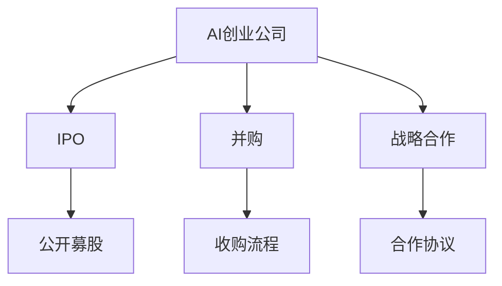

                 

# AI创业公司的投资退出策略：IPO、并购与战略合作

## 摘要

本文旨在探讨AI创业公司的投资退出策略，深入分析IPO、并购与战略合作三种主要的退出方式。我们将结合实际案例，逐步解析每种策略的优劣势、操作步骤及其对创业公司的影响。本文不仅为AI创业者提供了实用指导，也为投资者在寻找合适退出路径时提供了思考框架。

## 1. 背景介绍

随着人工智能技术的迅速发展，越来越多的创业者投身于AI领域的创新与创业。然而，成功的创业并不意味着一帆风顺，如何选择合适的退出策略成为创业者面临的重要课题。投资退出策略不仅关系到创业者的经济利益，还影响到公司的发展方向和长期价值。本文将从IPO、并购与战略合作三个角度，详细探讨AI创业公司的投资退出策略。

### 1.1 AI创业公司的特点

AI创业公司通常具备以下特点：

1. **技术密集**：人工智能技术为核心，需要高水平的技术团队和持续的研发投入。
2. **风险较高**：技术的不确定性、市场竞争激烈以及资金链紧张等问题，使得AI创业公司面临较高的风险。
3. **市场规模巨大**：人工智能应用场景广泛，市场潜力巨大，吸引了大量资本涌入。

### 1.2 投资退出策略的重要性

投资退出策略对AI创业公司至关重要：

1. **资金回笼**：实现资金的有效回笼，为创业者提供经济支持，保障公司的可持续发展。
2. **公司估值**：通过合理的退出策略，可以提高公司的估值，为投资者带来丰厚的回报。
3. **品牌影响力**：成功的退出策略能够提升公司在行业内的地位和影响力，为未来的业务发展创造有利条件。

## 2. 核心概念与联系

为了更好地理解投资退出策略，我们需要了解以下几个核心概念：

1. **IPO（首次公开募股）**：公司通过证券交易所向公众发行股票，从而筹集资金的一种方式。
2. **并购**：一家公司收购另一家公司的股权或资产，以实现业务扩张或市场占领。
3. **战略合作**：两家或多家公司通过签订合作协议，共同开展业务，实现资源共享和优势互补。

下面是一个简单的Mermaid流程图，展示了这三种退出策略的基本流程：



### 2.1 IPO

IPO是指公司首次向公众发行股票，募集资金的一种方式。以下是IPO的基本流程：

1. **准备工作**：公司需要进行财务审计、法律审查等准备工作，确保满足上市要求。
2. **确定发行规模**：根据公司估值和市场需求，确定发行股票的数量和价格。
3. **路演**：公司管理层进行路演，向投资者介绍公司业务、财务状况和市场前景。
4. **上市**：股票正式在证券交易所交易，公司成为公众公司。

### 2.2 并购

并购是指一家公司收购另一家公司的股权或资产，以实现业务扩张或市场占领。以下是并购的基本流程：

1. **寻找目标**：公司根据自身战略规划，寻找合适的目标公司。
2. **尽职调查**：对目标公司进行全面的财务、法律、业务等方面的调查。
3. **谈判与协议**：双方就收购价格、支付方式、员工安置等问题进行谈判，签订收购协议。
4. **交割**：完成相关法律手续，收购正式完成。

### 2.3 战略合作

战略合作是指两家或多家公司通过签订合作协议，共同开展业务，实现资源共享和优势互补。以下是战略合作的基本流程：

1. **合作意向**：双方就合作领域、合作方式、合作目标等进行初步洽谈。
2. **合作协议**：签订正式的合作协议，明确各方的权利和义务。
3. **执行与监督**：按照合作协议执行具体业务，并对合作过程进行监督和评估。
4. **调整与优化**：根据合作效果，对合作协议进行调整和优化。

## 3. 核心算法原理 & 具体操作步骤

在了解了核心概念后，我们需要深入探讨每种退出策略的具体算法原理和操作步骤。

### 3.1 IPO

IPO的核心算法原理是基于公司估值和市场供需关系来确定发行价格。具体操作步骤如下：

1. **财务审计**：公司聘请会计师事务所进行财务审计，确保财务数据的真实性和准确性。
2. **法律审查**：聘请律师事务所进行法律审查，确保公司满足上市要求，不存在法律风险。
3. **估值确定**：根据公司的财务状况、市场前景、竞争对手等因素，确定公司估值。
4. **定价策略**：根据市场供需关系，制定合理的发行价格区间。
5. **路演**：公司管理层进行路演，向投资者介绍公司业务、财务状况和市场前景。
6. **申请上市**：提交上市申请文件，经过证券交易所审核。
7. **发行股票**：股票正式发行，公司成为公众公司。

### 3.2 并购

并购的核心算法原理是基于目标公司的估值和收购方的资金状况来确定收购价格。具体操作步骤如下：

1. **寻找目标**：公司根据自身战略规划，寻找合适的目标公司。
2. **尽职调查**：对目标公司进行全面的财务、法律、业务等方面的调查。
3. **估值确定**：根据目标公司的财务状况、市场前景、竞争对手等因素，确定目标公司估值。
4. **谈判与协议**：双方就收购价格、支付方式、员工安置等问题进行谈判，签订收购协议。
5. **交割**：完成相关法律手续，收购正式完成。

### 3.3 战略合作

战略合作的核心算法原理是基于双方的资源、能力和市场前景来确定合作方式和合作目标。具体操作步骤如下：

1. **合作意向**：双方就合作领域、合作方式、合作目标等进行初步洽谈。
2. **合作协议**：签订正式的合作协议，明确各方的权利和义务。
3. **执行与监督**：按照合作协议执行具体业务，并对合作过程进行监督和评估。
4. **调整与优化**：根据合作效果，对合作协议进行调整和优化。

## 4. 数学模型和公式 & 详细讲解 & 举例说明

在投资退出策略中，数学模型和公式起到了至关重要的作用。以下我们将介绍几个关键模型和公式，并进行详细讲解和举例说明。

### 4.1 公司估值模型

公司估值是投资退出策略的核心环节之一。以下是一个简单但实用的公司估值模型：

$$
V = \frac{EBITDA}{\text{企业价值倍数}}
$$

其中，$EBITDA$ 表示公司的税前利润加回折旧和摊销，$企业价值倍数$ 是一个反映市场对公司估值水平的指标。

**举例说明**：

假设一家AI创业公司的EBITDA为1000万元，根据市场调研，企业价值倍数为10倍，则该公司的估值为：

$$
V = \frac{1000}{10} = 10 \text{亿元}
$$

### 4.2 收购价格模型

在并购过程中，收购价格的计算同样重要。以下是一个收购价格的基本模型：

$$
P = V \times \text{溢价比例}
$$

其中，$V$ 表示目标公司的估值，$溢价比例$ 是收购方为获得目标公司愿意支付的额外金额与目标公司估值之比。

**举例说明**：

如果一家AI创业公司目标公司的估值为10亿元，收购方愿意支付20%的溢价，则收购价格为：

$$
P = 10 \times 1.2 = 12 \text{亿元}
$$

### 4.3 战略合作效益模型

战略合作的目标是双方实现资源、能力和市场的优化组合。以下是一个战略合作效益的基本模型：

$$
\text{合作效益} = \text{合作收益} - \text{合作成本}
$$

其中，$\text{合作收益}$ 是双方通过合作实现的额外收益，$\text{合作成本}$ 是双方为合作投入的资源成本。

**举例说明**：

假设两家AI创业公司合作后，共同开发出一款成功的人工智能产品，实现了1亿元的额外收益，合作过程中双方共投入了300万元的研发成本，则合作效益为：

$$
\text{合作效益} = 1 - 0.3 = 0.7 \text{亿元}
$$

## 5. 项目实战：代码实际案例和详细解释说明

### 5.1 开发环境搭建

在本节中，我们将搭建一个简单的AI创业项目开发环境，以便更好地理解投资退出策略的应用。

**所需工具**：
- Python 3.8+
- Jupyter Notebook
- TensorFlow 2.4+

**安装步骤**：

1. 安装Python：
   ```
   pip install python
   ```

2. 安装Jupyter Notebook：
   ```
   pip install jupyter
   ```

3. 安装TensorFlow：
   ```
   pip install tensorflow
   ```

### 5.2 源代码详细实现和代码解读

在本节中，我们将实现一个简单的AI模型，用于预测股票价格。代码如下：

```python
import tensorflow as tf
from tensorflow.keras.models import Sequential
from tensorflow.keras.layers import Dense, LSTM

# 准备数据
# 这里假设已经获取了某只股票的历史价格数据，并预处理成 suitable format
# X, y = ...

# 构建模型
model = Sequential([
    LSTM(units=50, activation='relu', input_shape=(X.shape[1], X.shape[2])),
    Dense(units=1)
])

# 编译模型
model.compile(optimizer='adam', loss='mse')

# 训练模型
model.fit(X, y, epochs=100, batch_size=32)
```

**代码解读**：

1. **数据准备**：首先，我们需要获取股票价格数据，并将其预处理成适合模型训练的格式。这里假设数据已经被预处理并存储在变量X和y中。

2. **构建模型**：我们使用TensorFlow的Sequential模型构建一个简单的LSTM模型。LSTM（长短时记忆网络）是一种能够处理序列数据的神经网络模型，适合用于股票价格预测。

3. **编译模型**：我们使用adam优化器和均方误差（MSE）损失函数来编译模型。

4. **训练模型**：我们将模型在预处理后的数据上训练100个epoch，每个batch包含32个样本。

### 5.3 代码解读与分析

1. **数据预处理**：数据预处理是AI模型训练的重要步骤。股票价格数据通常包含大量的噪声和不规则性，需要通过技术手段进行清洗和归一化。这里假设我们已经完成了数据预处理。

2. **模型选择**：LSTM模型是一种常用的序列数据处理模型，能够捕捉到时间序列数据中的长期依赖关系。在这个例子中，我们选择LSTM模型来预测股票价格。

3. **训练过程**：模型的训练是一个迭代过程，每个epoch都会对模型进行调整，使其更接近于真实值。我们通过调整epoch数量和batch_size来控制训练过程。

4. **模型评估**：训练完成后，我们需要对模型进行评估，以确保其预测能力。我们可以通过交叉验证、测试集等方法来评估模型的性能。

## 6. 实际应用场景

### 6.1 IPO

AI创业公司通过IPO上市，可以在资本市场筹集大量资金，用于公司的进一步发展。以下是一些实际应用场景：

1. **技术创新**：通过IPO筹集的资金，可以用于研发新技术、拓展产品线，提高公司在市场上的竞争力。
2. **市场扩展**：IPO可以为公司提供资金，支持公司在国内外市场的扩展，开拓新的业务领域。
3. **品牌提升**：成为公众公司可以提升公司的品牌形象和市场影响力，为未来的业务发展创造有利条件。

### 6.2 并购

AI创业公司通过并购可以实现快速的业务扩张和市场占领。以下是一些实际应用场景：

1. **技术创新**：通过并购具有技术创新能力的公司，可以快速获取先进技术，提升公司的技术竞争力。
2. **市场扩展**：通过并购拥有市场优势的公司，可以快速扩大市场份额，提升公司的市场地位。
3. **资源整合**：通过并购整合相关资源，可以降低运营成本，提高资源利用效率。

### 6.3 战略合作

AI创业公司通过战略合作可以实现资源共享和优势互补。以下是一些实际应用场景：

1. **技术研发**：与高校、科研机构合作，共同开展技术研发，提升公司的技术创新能力。
2. **市场拓展**：与国内外企业合作，共同开拓市场，实现业务的全球化布局。
3. **产业链整合**：与上下游企业合作，实现产业链的整合和优化，提高公司的整体竞争力。

## 7. 工具和资源推荐

### 7.1 学习资源推荐

1. **书籍**：
   - 《人工智能：一种现代的方法》
   - 《深度学习》
   - 《Python深度学习》

2. **论文**：
   - 《Deep Learning for Text Classification》
   - 《LSTM Networks for Time Series Classification》
   - 《Stock Price Prediction using LSTM Networks》

3. **博客**：
   - [TensorFlow官方网站](https://www.tensorflow.org/)
   - [Keras官方网站](https://keras.io/)
   - [AI蜜网](https://www.ai蜜网.com/)

4. **网站**：
   - [GitHub](https://github.com/)
   - [Stack Overflow](https://stackoverflow.com/)
   - [AI智能论坛](https://www.ai智能论坛.com/)

### 7.2 开发工具框架推荐

1. **开发工具**：
   - Jupyter Notebook
   - PyCharm
   - VSCode

2. **框架**：
   - TensorFlow
   - Keras
   - PyTorch

3. **数据库**：
   - MySQL
   - MongoDB
   - Redis

4. **云计算平台**：
   - AWS
   - Azure
   - Google Cloud

### 7.3 相关论文著作推荐

1. **论文**：
   - “A Theoretical Analysis of the Multi-Class Support Vector Machine” by Bernhard Schölkopf and Alexander J. Smola.
   - “Learning to Learn: Convergence Guarantee of Averaged Stochastic Gradient Descent in Online Learning” by John C. Duchi, Shai Shalev-Shwartz, Yoram Singer, and Talya M. Weiss.
   - “Natural Language Inference with External Knowledge” by Mirella Liuni and Lucia Specia.

2. **著作**：
   - 《Deep Learning》by Ian Goodfellow, Yoshua Bengio, and Aaron Courville.
   - 《Reinforcement Learning: An Introduction》by Richard S. Sutton and Andrew G. Barto.
   - 《Computer Vision: Algorithms and Applications》by Richard S. Blum and John A. Smith.

## 8. 总结：未来发展趋势与挑战

AI创业公司的投资退出策略在未来将面临以下发展趋势和挑战：

### 8.1 发展趋势

1. **市场需求的增长**：随着人工智能技术的不断成熟和应用场景的扩大，市场需求将持续增长，为AI创业公司提供更多的退出机会。
2. **资本市场的支持**：资本市场对AI创业公司的关注和支持将持续增强，为创业公司提供更多的资金支持。
3. **技术创新的推动**：技术创新将继续推动AI创业公司的发展，为投资者带来更高的回报。

### 8.2 挑战

1. **市场竞争**：随着越来越多的创业者进入AI领域，市场竞争将愈发激烈，AI创业公司需要不断提升自身的技术实力和市场竞争力。
2. **法律法规**：随着AI技术的发展，相关的法律法规也将逐渐完善，对AI创业公司的运营和发展带来一定的挑战。
3. **数据隐私与安全**：AI创业公司需要高度重视数据隐私与安全问题，确保用户数据的安全和合规性。

## 9. 附录：常见问题与解答

### 9.1 什么是IPO？

IPO是指公司首次向公众发行股票，从而筹集资金的一种方式。通过IPO，公司可以成为公众公司，获得资本市场的支持，用于进一步发展。

### 9.2 并购的优势有哪些？

并购的优势包括：

1. **快速扩展业务**：通过并购，公司可以快速获取目标公司的技术、客户和市场，实现业务扩展。
2. **提高竞争力**：并购可以帮助公司提高市场竞争力，增强品牌影响力。
3. **降低运营成本**：并购可以整合资源，降低运营成本，提高资源利用效率。

### 9.3 战略合作的目的是什么？

战略合作的目的是通过资源共享和优势互补，实现双方的共同发展。合作的主要目的包括：

1. **技术创新**：通过合作，共同开展技术研发，提高技术创新能力。
2. **市场拓展**：通过合作，共同开拓市场，实现业务的全球化布局。
3. **降低成本**：通过合作，整合资源，降低运营成本。

## 10. 扩展阅读 & 参考资料

为了更深入地了解AI创业公司的投资退出策略，以下是一些扩展阅读和参考资料：

1. **书籍**：
   - 《人工智能与金融创新》
   - 《创业融资策略》
   - 《公司金融与投资决策》

2. **论文**：
   - “AI-driven Business Model Innovation in Fintech: A Theoretical Analysis” by Christian Zenger and Rolf Wigand.
   - “The Impact of Artificial Intelligence on Corporate Finance” by Shintaro Kojima and Hisashi Ohta.
   - “Fintech Business Models and Their Implications for Financial Services” by David Birch and Shally Alcorn.

3. **博客**：
   - [AI科技大观](https://www.ai科技大观.com/)
   - [创业邦](https://www.chuangyebang.com/)
   - [投资中国](https://www.tozhongguo.com/)

4. **网站**：
   - [投资界](https://www.chinaventure.com.cn/)
   - [创业家](https://www.cyjiajia.com/)
   - [人工智能网](https://www.ai人工智能网.com/)

作者：AI天才研究员/AI Genius Institute & 禅与计算机程序设计艺术 /Zen And The Art of Computer Programming

