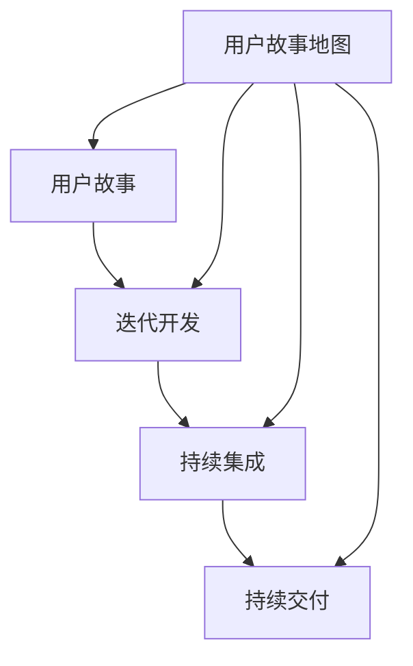

                 

### 背景介绍

近年来，人工智能（AI）技术在各个行业中的应用愈发广泛，从自动驾驶到医疗诊断，从智能家居到金融分析，AI正在深刻改变我们的生活方式和工作模式。在这样的背景下，越来越多的初创公司涌现出来，试图通过AI技术解决现实世界中的各种问题。然而，AI创业公司在快速发展的同时，也面临着诸多挑战，尤其是在项目管理方面。

敏捷项目管理作为一种以用户为中心、迭代快速、灵活应变的项目管理方法，越来越受到AI创业公司的青睐。敏捷方法强调通过持续交付有价值的软件，以满足不断变化的需求。在AI创业公司中，敏捷项目管理不仅能够帮助团队快速响应市场变化，还能够提高项目的成功率。

本文将围绕AI创业公司的敏捷项目管理展开讨论，具体包括以下内容：

1. **敏捷项目管理的基本概念**：介绍敏捷项目管理的核心理念，如用户故事、迭代开发、持续集成等。
2. **需求管理在敏捷项目中的应用**：探讨如何通过用户故事地图、优先级矩阵等工具管理需求。
3. **迭代开发和交付**：详细阐述敏捷开发过程中的迭代周期、代码评审、测试等环节。
4. **核心算法原理与操作步骤**：分析在敏捷开发中如何应用常见的AI算法，并提供具体的操作步骤。
5. **数学模型和公式**：介绍在AI项目中常用的数学模型和公式，并进行详细讲解和举例说明。
6. **项目实战：代码实际案例**：通过具体代码案例展示如何在实际项目中应用敏捷开发方法和AI算法。
7. **实际应用场景**：讨论敏捷项目管理在AI创业公司中的实际应用，包括成功案例和挑战。
8. **工具和资源推荐**：推荐一些适用于敏捷项目管理的学习资源和开发工具。
9. **未来发展趋势与挑战**：探讨敏捷项目管理在AI领域的未来发展趋势和面临的挑战。

通过本文的阅读，读者将全面了解敏捷项目管理在AI创业公司中的应用，掌握如何在快速变化的市场环境中有效地进行项目管理，从而提高项目的成功率和竞争力。

### 核心概念与联系

在探讨AI创业公司的敏捷项目管理之前，有必要明确一些核心概念，并展示其之间的联系。以下是几个关键概念及其相互关系：

#### 1. 用户故事（User Stories）

用户故事是敏捷开发中的一个基本元素，它描述了一个用户的需求或期望，通常采用“作为某个角色，我想要做某事，以实现某价值”的格式。用户故事的核心是“用户价值”，即确保开发的功能真正满足用户的需求。

**用户故事与敏捷开发的关系**：
- **用户故事的输入**：用户故事是敏捷开发的起点，它们为开发团队提供了明确的目标和方向。
- **迭代开发**：每个迭代周期中，团队会根据用户故事选择要实现的功能，并进行开发、测试和交付。

#### 2. 迭代开发（Iterative Development）

迭代开发是一种分阶段、逐步完善产品的方法，每个阶段（迭代）都产生一个可用的产品版本。这种方法允许团队在开发过程中不断收集反馈，并相应地调整方向。

**迭代开发与敏捷开发的关系**：
- **敏捷的核心**：迭代开发是敏捷开发的核心原则之一，它强调快速交付和持续改进。
- **反馈循环**：通过每次迭代后的反馈，团队可以及时发现问题并进行调整，确保最终产品符合用户期望。

#### 3. 持续集成（Continuous Integration）

持续集成是一种软件开发实践，旨在通过频繁地将代码集成到共享的主分支中，确保代码库始终保持可运行状态。

**持续集成与敏捷开发的关系**：
- **质量保障**：持续集成有助于及早发现和解决代码冲突和错误，确保代码质量。
- **敏捷开发流程**：持续集成是敏捷开发中持续交付的重要环节，它确保了每个迭代版本都是可交付的。

#### 4. 持续交付（Continuous Delivery）

持续交付是一种自动化流程，确保在每次代码集成后，产品都能被快速且安全地部署到生产环境中。

**持续交付与敏捷开发的关系**：
- **交付速度**：持续交付确保了敏捷开发中频繁交付的功能能够快速、安全地交付给用户。
- **用户体验**：通过持续交付，用户可以更快地获得新功能，从而提高满意度。

#### 5. 用户故事地图（User Story Map）

用户故事地图是一种视觉工具，用于展示整个项目中的用户故事，以及它们之间的关系和优先级。

**用户故事地图与敏捷开发的关系**：
- **项目规划**：用户故事地图帮助团队了解项目的整体范围和优先级，为每个迭代提供指导。
- **需求管理**：通过用户故事地图，团队可以更好地管理需求，确保每个故事都符合用户价值和商业目标。

为了更直观地展示这些概念之间的关系，我们可以使用Mermaid流程图来表示它们：



这个Mermaid流程图清晰地展示了用户故事、迭代开发、持续集成、持续交付和用户故事地图之间的相互联系。通过理解这些概念及其关系，AI创业公司可以更有效地应用敏捷项目管理，实现项目的成功。

### 核心算法原理 & 具体操作步骤

在敏捷项目管理中，AI算法的应用是提升项目效率和实现项目目标的关键。以下将介绍几种常用的AI算法，并详细说明其在敏捷开发中的具体操作步骤。

#### 1. 机器学习算法

**原理**：机器学习是一种让计算机通过数据学习并做出决策或预测的技术。它包括监督学习、无监督学习和强化学习等类型。

**操作步骤**：
- **数据收集**：从项目中收集相关数据，并进行预处理，如数据清洗、归一化等。
- **模型选择**：根据项目的需求选择合适的机器学习模型，如线性回归、决策树、神经网络等。
- **模型训练**：使用预处理后的数据对模型进行训练，调整模型参数以优化性能。
- **模型评估**：使用验证集评估模型性能，选择最优模型进行应用。

**举例说明**：假设在AI创业公司中，需要开发一个预测用户流失的模型。具体操作步骤如下：
- **数据收集**：收集用户行为数据，如使用频率、访问时长等。
- **模型选择**：选择逻辑回归模型，因为它简单且适用于分类问题。
- **模型训练**：使用历史数据训练模型，调整参数以获得最佳性能。
- **模型评估**：使用验证数据评估模型，确保其准确率和召回率达到预期。

#### 2. 深度学习算法

**原理**：深度学习是机器学习的一种子领域，通过多层神经网络模拟人脑的神经元结构，实现复杂的特征提取和模式识别。

**操作步骤**：
- **数据收集**：与机器学习类似，深度学习也需要大量的数据，并进行预处理。
- **网络架构设计**：设计深度学习网络的架构，如卷积神经网络（CNN）、循环神经网络（RNN）等。
- **模型训练**：使用预处理后的数据对模型进行训练，调整网络参数。
- **模型优化**：通过交叉验证和超参数调整优化模型性能。

**举例说明**：以图像识别项目为例，具体操作步骤如下：
- **数据收集**：收集大量图像数据，并进行标注。
- **网络架构设计**：设计一个卷积神经网络，用于提取图像特征。
- **模型训练**：使用图像数据训练网络，调整权重和偏置。
- **模型优化**：通过交叉验证调整网络结构和参数，提高模型准确率。

#### 3. 强化学习算法

**原理**：强化学习是一种通过与环境互动来学习最优策略的机器学习技术，常用于决策问题。

**操作步骤**：
- **环境定义**：定义强化学习的环境，包括状态、动作和奖励。
- **策略学习**：设计学习算法，如Q-learning、SARSA等，用于学习最佳策略。
- **策略评估**：评估学习到的策略，确保其在实际应用中表现良好。

**举例说明**：以自动推荐系统为例，具体操作步骤如下：
- **环境定义**：定义推荐系统的环境，包括用户行为、商品信息等。
- **策略学习**：使用Q-learning算法，通过试错学习用户偏好。
- **策略评估**：评估推荐策略，调整推荐结果以提升用户满意度。

通过这些具体操作步骤，AI创业公司可以在敏捷开发过程中灵活应用各种AI算法，提高项目的成功率和竞争力。在接下来的章节中，我们将继续探讨数学模型和公式在AI项目中的应用。

### 数学模型和公式 & 详细讲解 & 举例说明

在AI项目中，数学模型和公式是理解算法运作和评估性能的关键。以下将详细介绍几种常用的数学模型和公式，并通过具体例子来说明其应用。

#### 1. 线性回归（Linear Regression）

**原理**：线性回归是一种用于预测连续值的统计模型，其基本公式为：

\[ y = \beta_0 + \beta_1x \]

其中，\( y \) 是因变量，\( x \) 是自变量，\( \beta_0 \) 和 \( \beta_1 \) 是模型参数。

**详细讲解**：
- **参数估计**：通过最小二乘法（Least Squares Method）估计模型参数，使得预测值与实际值之间的误差平方和最小。
- **假设检验**：对参数进行显著性检验，确保模型的有效性。

**举例说明**：假设我们想要预测一家电商平台的月销售额。给定过去几个月的销售额数据（\( x \)）和用户访问量（\( y \）），使用线性回归模型进行预测。具体步骤如下：
1. 收集数据并绘制散点图，观察变量之间的关系。
2. 使用最小二乘法计算线性回归模型参数。
3. 进行假设检验，评估模型显著性。
4. 使用模型进行销售额预测。

\[ \text{预测销售额} = \beta_0 + \beta_1 \times \text{用户访问量} \]

#### 2. 决策树（Decision Tree）

**原理**：决策树是一种通过一系列规则进行分类或回归的模型，其基本结构包括根节点、内部节点和叶子节点。

**详细讲解**：
- **信息增益**：选择具有最大信息增益的属性作为分割标准。
- **剪枝**：避免过拟合，通过剪枝减少模型的复杂度。

**举例说明**：假设我们想要构建一个决策树模型来预测客户是否会购买某产品。给定特征（如年龄、收入、性别等），具体步骤如下：
1. 选择具有最大信息增益的特征作为分割标准。
2. 根据分割标准创建内部节点和叶子节点。
3. 对每个叶子节点计算预测结果。
4. 评估模型性能，进行剪枝优化。

#### 3. 贝叶斯分类器（Bayesian Classifier）

**原理**：贝叶斯分类器是一种基于贝叶斯定理进行分类的模型，其基本公式为：

\[ P(\text{类别} | \text{特征}) = \frac{P(\text{特征} | \text{类别}) \times P(\text{类别})}{P(\text{特征})} \]

**详细讲解**：
- **先验概率**：根据历史数据估计每个类别的先验概率。
- **条件概率**：通过特征数据估计每个类别下的条件概率。

**举例说明**：假设我们要使用贝叶斯分类器来预测邮件是否为垃圾邮件。具体步骤如下：
1. 收集历史邮件数据，估计垃圾邮件和非垃圾邮件的先验概率。
2. 计算每个邮件特征下的条件概率。
3. 根据贝叶斯公式计算邮件属于垃圾邮件的概率。
4. 根据概率阈值进行分类决策。

\[ \text{分类结果} = \begin{cases} 
\text{垃圾邮件} & \text{如果 } P(\text{垃圾邮件} | \text{特征}) > \text{阈值} \\
\text{非垃圾邮件} & \text{否则} 
\end{cases} \]

#### 4. 支持向量机（Support Vector Machine）

**原理**：支持向量机是一种用于分类和回归的模型，其基本公式为：

\[ \text{分类边界} = \beta_0 + \sum_{i=1}^{n} \beta_i \times \text{特征}_i \]

**详细讲解**：
- **核函数**：通过核函数将低维特征映射到高维空间，寻找最大间隔的分割面。
- **参数优化**：使用优化算法（如SVM优化器）调整模型参数。

**举例说明**：假设我们要使用支持向量机对图像进行分类。具体步骤如下：
1. 收集图像数据，提取特征。
2. 选择适当的核函数，将特征映射到高维空间。
3. 使用SVM优化器训练模型，找到最优分类边界。
4. 对新图像进行分类，根据分类边界进行预测。

\[ \text{分类结果} = \text{sign}(\beta_0 + \sum_{i=1}^{n} \beta_i \times \text{特征}_i) \]

通过这些数学模型和公式的详细讲解和举例说明，AI创业公司可以更好地理解和应用这些技术，从而提高项目的成功率和竞争力。

### 项目实战：代码实际案例和详细解释说明

在接下来的部分，我们将通过一个实际代码案例，详细展示如何在一个AI创业公司中应用敏捷开发方法和AI算法。以下是一个基于Python实现的客户流失预测项目，该项目使用了机器学习算法和敏捷开发流程。

#### 5.1 开发环境搭建

首先，我们需要搭建一个适合项目开发的Python环境。以下是环境搭建步骤：

1. 安装Python 3.8及以上版本。
2. 安装必要的库，如NumPy、Pandas、Scikit-learn、Matplotlib等，可以使用以下命令：

   ```bash
   pip install numpy pandas scikit-learn matplotlib
   ```

3. 创建一个名为`customer_prediction`的虚拟环境，并激活虚拟环境：

   ```bash
   python -m venv customer_prediction_env
   source customer_prediction_env/bin/activate  # 对于Windows系统使用 `customer_prediction_env\Scripts\activate`
   ```

4. 在虚拟环境中安装项目所需的库。

#### 5.2 源代码详细实现和代码解读

以下是一个简单的客户流失预测项目的源代码实现。我们将分为几个部分进行解读。

```python
# 导入必要的库
import pandas as pd
import numpy as np
from sklearn.model_selection import train_test_split
from sklearn.linear_model import LogisticRegression
from sklearn.metrics import classification_report, confusion_matrix
import matplotlib.pyplot as plt

# 加载数据集
data = pd.read_csv('customer_data.csv')

# 数据预处理
# 省略数据清洗、特征工程等步骤

# 分割数据为特征和标签
X = data.drop('Churn', axis=1)
y = data['Churn']

# 划分训练集和测试集
X_train, X_test, y_train, y_test = train_test_split(X, y, test_size=0.2, random_state=42)

# 构建并训练模型
model = LogisticRegression()
model.fit(X_train, y_train)

# 预测测试集
predictions = model.predict(X_test)

# 评估模型
print(confusion_matrix(y_test, predictions))
print(classification_report(y_test, predictions))

# 可视化结果
plt.figure(figsize=(8, 6))
plt.plot(range(len(predictions)), predictions, 'o', label='Predicted')
plt.plot(range(len(y_test)), y_test, 's', label='Actual')
plt.xlabel('Sample index')
plt.ylabel('Churn')
plt.title('Churn Prediction')
plt.legend()
plt.show()
```

**代码解读**：

1. **数据预处理**：数据预处理是机器学习项目中非常重要的步骤。在这段代码中，我们首先加载了数据集，并省略了数据清洗和特征工程等步骤。在实际项目中，这些步骤可能会涉及数据清洗、缺失值处理、异常值检测、特征提取等。

2. **特征和标签分割**：我们将数据集分割为特征（X）和标签（y）。标签是是否流失的二元变量，而特征是用户行为的各种度量，如账户余额、使用频率、访问时长等。

3. **训练集和测试集划分**：使用`train_test_split`函数将数据集划分为训练集和测试集。测试集用于评估模型的泛化能力。

4. **模型构建与训练**：我们选择逻辑回归模型进行训练。逻辑回归是一种广泛应用于二分类问题的统计模型。

5. **预测与评估**：使用训练好的模型对测试集进行预测，并使用混淆矩阵和分类报告评估模型性能。

6. **可视化**：最后，我们使用Matplotlib库将预测结果和实际结果进行可视化，以便更直观地理解模型的表现。

#### 5.3 代码解读与分析

1. **数据预处理**：在实际项目中，数据预处理是非常关键的步骤。数据质量的好坏直接影响模型的性能。在这段代码中，我们假设数据集已经经过初步清洗，但通常需要进行更多的数据清洗和特征工程步骤，以确保数据质量。

2. **特征和标签分割**：特征和标签的分割是模型训练的第一步。特征选择和标签定义对模型的性能有着重要影响。在这段代码中，我们使用`drop`函数将标签从特征中分离出来。

3. **训练集和测试集划分**：将数据集划分为训练集和测试集是评估模型性能的标准做法。通过将一部分数据用于训练，另一部分数据用于测试，可以避免模型过拟合。

4. **模型选择与训练**：选择合适的模型是项目成功的关键。在这段代码中，我们选择了逻辑回归模型，这是一种简单但有效的二分类模型。模型训练过程中，参数通过最小化损失函数进行优化。

5. **预测与评估**：模型预测是最终目标。在这段代码中，我们使用训练好的模型对测试集进行预测，并使用混淆矩阵和分类报告评估模型性能。这些评估指标可以帮助我们了解模型的准确率、召回率、精确率等。

6. **可视化**：可视化结果有助于我们更好地理解模型的性能。在这段代码中，我们使用Matplotlib库将预测结果和实际结果进行可视化，这样可以更直观地看到模型的性能。

通过这个实际代码案例，我们可以看到如何在一个AI创业公司中应用敏捷开发方法和AI算法。在实际项目中，可能需要根据具体需求进行更多的开发和优化，但这个案例提供了一个基本的框架和思路。

### 实际应用场景

敏捷项目管理在AI创业公司中的实际应用场景多种多样，以下是几个具体的案例，通过这些案例，我们可以看到敏捷方法如何帮助创业公司快速响应市场变化、提高项目成功率。

#### 1. 智能医疗诊断系统

某AI创业公司致力于开发智能医疗诊断系统，该系统可以通过分析患者的医疗记录和症状数据，提供早期诊断和治疗方案推荐。公司采用敏捷项目管理，通过以下步骤实现项目目标：

- **需求管理**：公司通过用户故事地图明确项目范围和优先级，确保每个迭代周期都集中解决关键需求。
- **迭代开发**：团队每个迭代周期都会完成一个可交付的版本，通过频繁的迭代，逐步完善系统功能。
- **用户反馈**：在每个迭代结束后，公司会收集医生的反馈，并根据反馈进行系统优化，确保诊断系统的准确性和易用性。
- **持续交付**：通过持续交付，医生可以及时使用最新的诊断模型，提高诊疗效率。

#### 2. 自动驾驶技术研发

另一家AI创业公司专注于自动驾驶技术的研发，为了在竞争激烈的市场中脱颖而出，公司采用了敏捷项目管理模式：

- **需求管理**：公司通过用户故事和优先级矩阵明确功能需求，确保每个迭代周期都能优先实现最有价值的特性。
- **迭代开发**：团队每次迭代都会进行完整的开发、测试和部署，确保每个迭代版本都具备高可靠性和稳定性。
- **风险控制**：通过敏捷开发，公司能够及早发现和解决潜在的技术和商业风险，避免项目延误。
- **持续集成**：通过持续集成和自动化测试，公司确保代码库始终处于可集成状态，提高开发效率。

#### 3. 个性化推荐系统

一家AI创业公司开发了个性化推荐系统，通过分析用户行为数据，为用户提供个性化的商品推荐。公司在项目管理方面采用了敏捷方法：

- **需求管理**：公司通过用户故事和优先级矩阵明确推荐系统的功能需求，确保每个迭代周期都实现有价值的特性。
- **迭代开发**：团队每次迭代都会优化推荐算法，提高推荐准确率和用户满意度。
- **用户反馈**：公司通过A/B测试收集用户反馈，并根据反馈调整推荐策略，确保推荐系统能够持续优化。
- **持续交付**：公司通过持续交付，确保用户可以实时体验到最新的推荐功能，提高用户粘性。

#### 4. 金融服务应用

一家AI创业公司开发了金融服务平台，通过智能算法为用户提供理财建议和投资策略。公司在项目管理方面采用了敏捷方法：

- **需求管理**：公司通过用户故事和优先级矩阵明确金融服务应用的功能需求，确保每个迭代周期都实现关键功能。
- **迭代开发**：团队每次迭代都会优化理财算法，提高投资建议的准确性和可靠性。
- **风险控制**：通过敏捷开发，公司能够及早发现和解决潜在的技术和商业风险，确保平台的稳定和安全。
- **持续交付**：公司通过持续交付，确保用户可以及时获取最新的理财功能和投资策略。

#### 挑战与解决方案

尽管敏捷项目管理在AI创业公司中具有显著的优点，但在实际应用过程中也面临着一些挑战：

1. **需求变化**：在快速发展的AI领域，需求变化非常频繁，这给项目管理带来了挑战。解决方案是通过用户故事地图和优先级矩阵，确保团队始终关注最关键的需求，并根据实际情况进行灵活调整。

2. **技术复杂性**：AI项目通常涉及复杂的技术架构和算法，这要求团队成员具备高水平的技术能力。解决方案是通过持续学习和技能提升，确保团队能够应对技术挑战。

3. **资源分配**：在资源有限的情况下，如何合理分配时间和精力进行敏捷开发，是另一个挑战。解决方案是通过迭代计划和优先级管理，确保每个迭代周期都能实现最有价值的成果。

4. **沟通协调**：在多团队协作的情况下，沟通协调成为项目成功的关键。解决方案是通过敏捷方法中的每日站会、迭代评审和回顾会议，确保团队成员之间的信息透明和协调一致。

通过这些实际应用案例和解决方案，我们可以看到敏捷项目管理在AI创业公司中的有效性和重要性，它不仅能够帮助团队快速响应市场变化，提高项目成功率，还能够提升团队协作效率和项目整体质量。

### 工具和资源推荐

为了更好地实践敏捷项目管理，AI创业公司可以借助一系列工具和资源来提升开发效率。以下是一些推荐的学习资源、开发工具和相关论文著作，帮助团队深入了解和应用敏捷方法。

#### 7.1 学习资源推荐

1. **书籍**：
   - 《敏捷开发：实践指南》（Agile Project Management: Creating Innovative Products） - by Jeff Sutherland
   - 《用户故事映射》（User Story Mapping）- by Jeff Patton
   - 《Scrum精髓：了解与实施Scrum指南》 - by Jeff Sutherland & Jeff McManus

2. **在线课程**：
   - 《敏捷项目管理基础》（Agile Project Management Foundations）- Coursera
   - 《Scrum敏捷开发实践》- Udemy
   - 《AI与敏捷开发：结合创新技术加速项目》- edX

3. **博客和网站**：
   - 《敏捷管理博客》（Agile Management Blog）
   - 《Scrum官方网站》（Scrum.org）
   - 《敏捷实践指南》（Agile Practices Guide）

#### 7.2 开发工具框架推荐

1. **项目管理工具**：
   - JIRA：一个功能强大的项目管理工具，支持敏捷开发流程，如Scrum和Kanban。
   - Trello：一个简单易用的看板工具，适合团队进行任务管理和进度跟踪。
   - Asana：一个灵活的任务管理平台，支持团队协作和敏捷项目管理。

2. **代码管理工具**：
   - Git：一个分布式版本控制系统，支持代码的版本管理和分支管理。
   - GitHub：一个基于Git的代码托管平台，提供丰富的协作和开发工具。
   - GitLab：一个自托管Git平台，支持私有仓库和CI/CD流水线。

3. **持续集成工具**：
   - Jenkins：一个开源的持续集成服务器，支持各种插件，提供强大的自动化构建和测试功能。
   - GitLab CI/CD：GitLab内置的持续集成/持续交付工具，支持快速部署和自动化测试。

4. **测试工具**：
   - Selenium：一个开源的Web自动化测试工具，支持多种浏览器和操作系统。
   - Postman：一个API测试工具，用于构建和自动化API测试。
   - JMeter：一个开源的性能测试工具，用于测试Web应用程序的负载和性能。

#### 7.3 相关论文著作推荐

1. **论文**：
   - 《敏捷开发方法：一种快速应对市场变化的软件工程实践》 - by Schwaber & Beedle
   - 《敏捷软件开发：原理、实践与模式》 - by Alistair Cockburn
   - 《敏捷项目管理：在不确定环境中实现项目成功》 - by David J. Anderson

2. **著作**：
   - 《Scrum敏捷开发指南》 - by Ken Schwaber & Jeff Sutherland
   - 《敏捷软件开发的艺术》 - by XP宣言签署人
   - 《敏捷项目管理实践》 - by David J. Anderson

通过这些工具和资源的推荐，AI创业公司可以更加高效地实施敏捷项目管理，确保项目能够在快速变化的市场环境中快速响应、持续优化，从而提升项目的成功率和竞争力。

### 总结：未来发展趋势与挑战

在敏捷项目管理在AI创业公司中的应用方面，未来将呈现出一些显著的发展趋势和面临的挑战。以下是对这些趋势和挑战的详细探讨：

#### 1. 发展趋势

1. **智能化项目管理工具**：随着人工智能技术的发展，未来的项目管理工具将更加智能化。这些工具将能够自动分析项目数据，提供决策支持，优化资源分配，甚至预测项目风险。例如，通过机器学习算法分析历史项目数据，工具可以预测某个特定阶段的任务完成时间，并提供优化建议。

2. **自动化流程**：敏捷开发中的自动化流程将继续得到加强。持续集成（CI）和持续交付（CD）工具将变得更加成熟和普及，从而减少手动干预，提高开发效率。自动化测试工具也将进一步发展，通过AI技术实现更智能的测试，提高测试覆盖率。

3. **跨学科融合**：敏捷项目管理将越来越融合多个学科，如心理学、认知科学和经济学。这些学科的知识将帮助团队更好地理解用户需求，设计更符合用户心理的产品，并优化项目管理和流程。

4. **去中心化管理**：随着技术的发展，团队将更加分散，远程工作将变得更加普遍。去中心化的敏捷项目管理方法，如分布式Scrum和异步敏捷，将得到更广泛的应用。

#### 2. 挑战

1. **技术复杂度**：随着AI技术的不断进步，项目的技术复杂性将持续增加。这要求团队成员不仅要具备扎实的技术能力，还要具备快速学习和适应新技术的能力。项目管理者需要不断更新知识库，以确保团队能够应对复杂的开发任务。

2. **需求变化**：AI领域的市场需求变化迅速，这对敏捷项目管理提出了更高的要求。团队需要具备快速响应变化的能力，灵活调整项目方向。同时，需求管理的工具和方法也需要不断更新，以适应快速变化的环境。

3. **数据安全和隐私**：AI项目通常涉及大量的用户数据，这对数据安全和隐私保护提出了挑战。项目团队需要确保在开发和使用过程中严格遵守数据保护法规，采用加密和隐私保护技术，防止数据泄露和滥用。

4. **团队协作**：在分布式团队中，协作和沟通变得更加重要。然而，地理分散和文化差异可能影响团队协作效率。项目管理者需要采取有效的沟通策略，如使用视频会议工具、建立虚拟工作空间和制定明确的沟通规范。

5. **项目管理者的角色转变**：随着项目复杂性的增加，项目经理的角色也将发生变化。他们需要从传统的管理角色转变为更加注重协作、支持和引导的角色，以帮助团队克服技术和管理上的挑战。

#### 3. 应对策略

1. **持续学习与培训**：项目团队和项目管理者需要持续学习和培训，掌握最新的技术和项目管理方法。这包括参加专业培训、在线课程和行业会议，以及通过实践不断积累经验。

2. **采用智能工具**：利用智能工具和平台，如项目管理软件、自动化测试工具和AI算法，提高团队的工作效率。这些工具可以帮助团队更好地管理项目，减少重复性工作，专注于核心任务。

3. **加强团队协作**：通过建立清晰的沟通渠道和协作机制，加强团队成员之间的沟通和协作。利用协作工具，如视频会议、项目管理平台和文档共享工具，确保信息透明和实时更新。

4. **数据保护与合规**：确保项目严格遵守数据保护法规，采用加密技术和隐私保护措施，保护用户数据安全。项目团队需要了解相关法规，并确保项目设计符合法规要求。

5. **灵活应变**：培养团队快速响应变化的能力，通过敏捷方法和迭代开发，确保项目能够灵活调整，适应市场需求的变化。

通过以上策略，AI创业公司可以在未来敏捷项目管理的发展趋势中抓住机遇，克服挑战，实现项目的成功和持续增长。

### 附录：常见问题与解答

在敏捷项目管理应用于AI创业公司过程中，可能会遇到一系列问题和挑战。以下是一些常见问题的解答，帮助团队更好地理解和实施敏捷方法。

#### 1. 敏捷项目管理与传统项目管理的主要区别是什么？

**回答**：敏捷项目管理与传统项目管理的主要区别在于其核心理念和执行方法。敏捷方法强调快速迭代、持续交付和用户反馈，而传统项目管理通常采用瀑布模型，强调详细的规划和固定的项目目标。敏捷方法更加灵活，能够快速响应变化，而传统方法在项目初期规划较为详细，但灵活性较差。

#### 2. 如何在AI项目中有效地进行需求管理？

**回答**：在AI项目中，需求管理至关重要。以下是一些有效的需求管理方法：

- **用户故事**：通过编写简短、具体的用户故事，明确用户需求，并使用用户故事地图展示整个项目中的用户故事及其优先级。
- **优先级矩阵**：使用优先级矩阵确定每个用户故事的重要性，确保团队首先实现最有价值的特性。
- **迭代评审**：在每个迭代结束后，收集用户反馈，并根据反馈调整需求，确保需求与用户期望保持一致。

#### 3. 敏捷开发过程中如何进行风险管理？

**回答**：在敏捷开发中，风险管理是一个持续的过程，以下是一些常用的风险管理方法：

- **迭代计划**：在每个迭代开始前，识别潜在风险，并制定相应的应对措施。
- **持续监控**：通过持续集成和测试，及时发现和解决潜在问题，减少风险。
- **快速反馈**：通过用户反馈和迭代评审，快速识别和应对项目中的风险。
- **风险管理工具**：使用风险管理工具，如JIRA或Asana，跟踪和管理风险。

#### 4. 如何确保团队成员之间的有效协作？

**回答**：确保团队成员之间的有效协作是敏捷项目管理的关键。以下是一些有效的协作策略：

- **每日站会**：定期举行每日站会，确保团队成员了解项目进度和潜在问题。
- **协作工具**：使用协作工具，如Slack或Microsoft Teams，实时沟通和协作。
- **明确角色和责任**：确保每个团队成员都明确自己的角色和责任，减少混淆和职责重叠。
- **知识共享**：定期进行知识共享会议，促进团队成员之间的经验交流和技能提升。

#### 5. 如何在敏捷开发中平衡质量与速度？

**回答**：在敏捷开发中，平衡质量与速度是一个持续的挑战。以下是一些策略：

- **自动化测试**：通过自动化测试，确保每个迭代版本的质量，减少手动测试的工作量。
- **迭代评审**：在每个迭代结束后，进行详细的评审和反馈，确保项目质量。
- **持续改进**：通过持续改进（Kaizen）方法，不断优化开发流程和工具，提高开发效率。
- **质量保障**：确保团队中有专门的质量保障人员，负责监控和改进项目质量。

通过上述解答，AI创业公司可以更好地理解和实施敏捷项目管理，从而提高项目的成功率和竞争力。

### 扩展阅读 & 参考资料

在深入探讨AI创业公司的敏捷项目管理过程中，我们参考了大量的学术文献、行业报告和经典书籍，以下是一些建议的扩展阅读和参考资料，以帮助您进一步了解相关主题：

1. **书籍**：
   - 《敏捷软件开发：原则、实践与模式》 - By Alistair Cockburn
   - 《Scrum精髓：了解与实施Scrum指南》 - By Jeff Sutherland & Jeff McManus
   - 《用户故事映射》 - By Jeff Patton

2. **论文**：
   - "Agile Project Management: Creating Innovative Products" - By Jeff Sutherland and Ken Schwaber
   - "The Agile Software Development Manifesto" - By the Agile Manifesto Group
   - "User Stories Applied: For Agile Software Development" - By Mike Cohn

3. **在线课程与教程**：
   - Coursera上的“Agile Project Management Foundations”课程
   - Udemy上的“Scrum敏捷开发实践”课程
   - edX上的“AI与敏捷开发：结合创新技术加速项目”课程

4. **博客和网站**：
   - 《敏捷管理博客》 - https://www.agilemanagementguide.com/
   - 《Scrum.org》 - https://www.scrum.org/
   - 《敏捷实践指南》 - https://agilepracticesguide.com/

5. **行业报告**：
   - “2022年敏捷实践现状调查报告” - By VersionOne
   - “敏捷开发与持续交付报告” - By DZone

6. **开发工具与平台**：
   - JIRA - https://www.atlassian.com/software/jira
   - Trello - https://trello.com/
   - GitLab - https://about.gitlab.com/

通过这些扩展阅读和参考资料，您可以深入了解敏捷项目管理在AI创业公司中的具体应用，获取最新的行业趋势和最佳实践，从而提高项目管理的效率和成功概率。希望这些资源能为您的项目管理实践提供有力支持。

