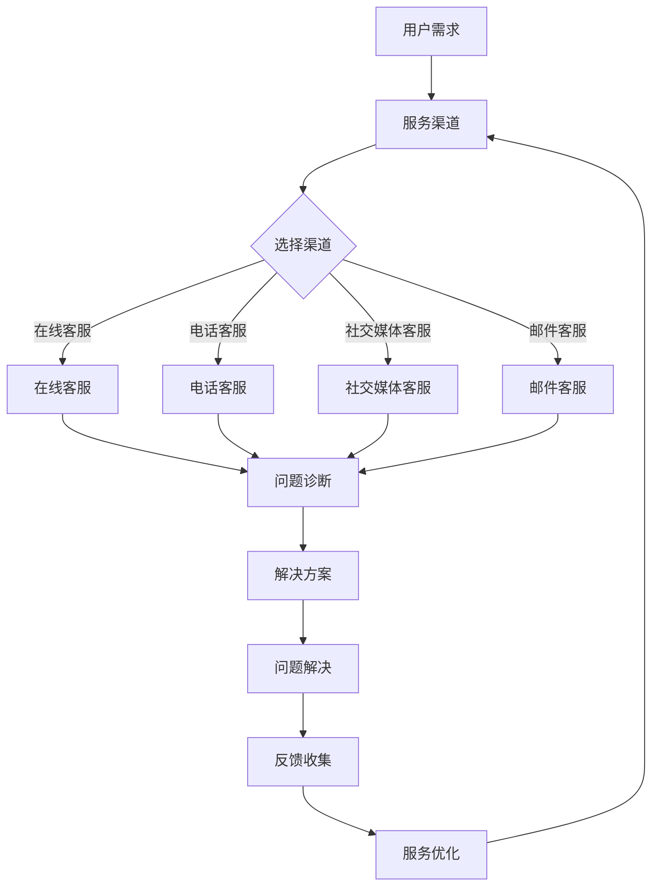

                 

### 文章标题：AI创业公司的用户服务体系建设：服务渠道、服务流程与服务质量

> **关键词：** AI创业公司，用户服务体系，服务渠道，服务流程，服务质量，用户体验

**摘要：** 本文将探讨AI创业公司构建高效、优质的用户服务体系的重要性。文章将详细分析服务渠道的选择与优化、服务流程的设计与执行、以及如何通过技术创新提升服务质量，最终实现用户满意度和忠诚度的提升。文章还将提供实际应用案例，帮助AI创业公司在激烈的市场竞争中脱颖而出。

### 1. 背景介绍

在当今快速发展的AI时代，创业公司面临着前所未有的机遇与挑战。随着人工智能技术的不断突破，越来越多的创业公司开始利用AI技术来提升自身的竞争力。然而，AI创业公司在追求技术突破的同时，也不能忽视用户服务体系建设的重要性。用户服务是连接公司与技术、用户之间的桥梁，直接影响到用户的满意度和忠诚度。

用户服务体系包括服务渠道、服务流程和服务质量等多个方面。服务渠道决定了用户如何与公司进行沟通和获取帮助；服务流程则规定了用户从初次接触公司产品到售后支持的全过程；服务质量则是用户对服务体验的整体评价。只有这三者有机结合，才能形成一个高效、优质的用户服务体系，从而在竞争激烈的市场中立于不败之地。

本文将重点探讨以下内容：

- **服务渠道的选择与优化**
- **服务流程的设计与执行**
- **服务质量提升的方法与手段**
- **实际应用案例分享**

希望通过本文的探讨，为AI创业公司在构建用户服务体系方面提供一些有益的思路和实践经验。接下来，我们将深入分析每个核心环节，逐步构建起一个完整的用户服务体系。

#### 1.1 AI创业公司面临的市场环境

AI创业公司所处的市场环境具有以下几个显著特点：

1. **技术快速迭代**：人工智能技术更新换代速度极快，创业公司必须紧跟技术潮流，不断优化和创新。

2. **市场竞争激烈**：随着AI技术的普及，市场上涌现出大量的AI创业公司，竞争异常激烈。

3. **用户需求多样化**：用户对AI产品的需求越来越多样化，个性化服务成为必然趋势。

4. **数据重要性**：数据成为AI创业公司的核心资产，如何有效管理和利用数据，对于公司的成功至关重要。

在这样的市场环境下，AI创业公司不仅需要在技术层面保持领先，还需要在用户服务方面进行深入建设和优化。只有构建起一个高效、优质的用户服务体系，才能在激烈的市场竞争中脱颖而出。

#### 1.2 用户服务体系建设的重要性

用户服务体系建设对于AI创业公司至关重要，具体体现在以下几个方面：

1. **提升用户满意度**：优质的服务体验可以显著提升用户的满意度，增加用户对产品的认可度。

2. **增强用户忠诚度**：通过持续优化的用户服务，可以增强用户的忠诚度，降低用户流失率。

3. **增加口碑传播**：满意的用户会通过口碑传播吸引新用户，为创业公司带来更多的市场机会。

4. **提高竞争力**：一个完善的用户服务体系可以成为公司的重要竞争优势，帮助创业公司占据市场份额。

5. **促进持续发展**：良好的用户服务能够促进公司产品的持续改进和迭代，推动公司不断成长。

总之，用户服务体系是AI创业公司在市场竞争中生存和发展的关键因素。只有深入理解和有效实施用户服务体系建设，才能实现公司的长期成功。

### 2. 核心概念与联系

为了构建一个高效、优质的用户服务体系，我们需要首先理解几个核心概念，它们之间有着紧密的联系，共同构成了用户服务体系的基础。

#### 2.1 服务渠道

服务渠道是用户与公司进行沟通和获取帮助的途径。常见的服务渠道包括在线客服、电话客服、社交媒体客服、邮件客服等。每个渠道都有其特定的优势和局限性，创业公司需要根据自身情况和用户需求选择合适的渠道，并进行优化。

**优势：**

- **在线客服**：实时性高，能够快速响应用户问题。
- **电话客服**：亲和力强，用户感觉更亲切。
- **社交媒体客服**：覆盖面广，用户可以随时随地进行咨询。
- **邮件客服**：正式性高，适用于较为复杂的问题处理。

**局限性：**

- **在线客服**：需要及时响应，否则用户体验会受影响。
- **电话客服**：成本较高，适合处理重要或复杂问题。
- **社交媒体客服**：容易受到社交媒体规则和舆论的影响。
- **邮件客服**：回复速度较慢，不适合紧急问题。

#### 2.2 服务流程

服务流程是用户从初次接触产品到售后支持的全过程。一个良好的服务流程应该包括以下环节：

- **问题诊断**：了解用户遇到的具体问题。
- **解决方案**：提供针对性的解决方案。
- **问题解决**：执行解决方案，解决用户问题。
- **反馈收集**：收集用户反馈，不断优化服务。

**流程优化：**

- **标准化**：制定标准化的服务流程，确保每个环节都有明确的操作规范。
- **自动化**：通过自动化工具提高流程效率，减少人工干预。
- **个性化**：根据用户需求和反馈进行个性化服务，提升用户体验。

#### 2.3 服务质量

服务质量是用户对服务体验的整体评价，直接影响用户满意度和忠诚度。服务质量包括以下几个方面：

- **响应速度**：快速响应用户问题，提供及时的解决方案。
- **解决问题能力**：具备解决用户问题的能力，确保问题得到妥善处理。
- **沟通技巧**：良好的沟通技巧能够提升用户满意度，增强用户信任。
- **服务态度**：积极、热情的服务态度能够给用户带来良好的心理感受。

**质量提升方法：**

- **培训**：定期对客服人员进行专业培训，提升服务技能。
- **反馈机制**：建立用户反馈机制，及时了解用户需求和意见。
- **监控与改进**：对服务过程进行监控和评估，持续改进服务质量。

#### 2.4 Mermaid 流程图

以下是一个简化的用户服务体系流程的 Mermaid 流程图，展示了各个核心环节之间的联系。



通过上述核心概念的介绍和 Mermaid 流程图的展示，我们可以看到用户服务体系中的各个核心环节是如何相互联系和作用的。接下来，我们将深入探讨每个环节的具体内容和实现方法。

### 3. 核心算法原理 & 具体操作步骤

在构建用户服务体系的过程中，核心算法的原理和具体操作步骤是关键组成部分。以下是几个核心算法的基本原理和操作步骤。

#### 3.1 客户需求分析算法

**基本原理：**

客户需求分析算法基于用户行为数据和反馈数据，通过数据分析技术，挖掘用户的潜在需求，为服务渠道和服务流程的优化提供依据。

**具体操作步骤：**

1. **数据收集**：收集用户在各个服务渠道上的交互数据，包括在线客服记录、电话客服录音、社交媒体评论等。

2. **数据预处理**：对收集到的数据清洗和格式化，去除无效和重复数据。

3. **特征提取**：提取用户交互中的关键特征，如用户提问频率、问题类型、解决时长等。

4. **模型训练**：使用机器学习算法，如决策树、随机森林等，训练客户需求分析模型。

5. **需求预测**：利用训练好的模型，对用户未来的需求进行预测，为服务提供个性化建议。

**示例代码（Python）：**

```python
import pandas as pd
from sklearn.ensemble import RandomForestClassifier

# 数据收集和预处理
data = pd.read_csv('user_interactions.csv')
data = data.drop_duplicates()

# 特征提取
features = data[['question_type', 'response_time']]
labels = data['need']

# 模型训练
model = RandomForestClassifier()
model.fit(features, labels)

# 需求预测
new_user_data = {'question_type': ['query'], 'response_time': [30]}
new_user_features = pd.DataFrame(new_user_data)
predicted_need = model.predict(new_user_features)
print(predicted_need)
```

#### 3.2 服务流程优化算法

**基本原理：**

服务流程优化算法通过分析服务流程中的瓶颈和效率问题，提出优化方案，以提高服务效率和用户体验。

**具体操作步骤：**

1. **流程建模**：建立服务流程的数学模型，包括各个环节的输入、输出和依赖关系。

2. **数据收集**：收集服务流程中的实时数据，如客服响应时间、问题解决率等。

3. **流程分析**：使用数据分析技术，识别流程中的瓶颈和效率问题。

4. **优化方案**：根据分析结果，提出优化方案，如调整流程顺序、增加自动化工具等。

5. **方案实施**：实施优化方案，并进行效果评估。

**示例代码（Python）：**

```python
import pandas as pd
import numpy as np

# 数据收集
flow_data = pd.DataFrame({
    'stage': ['diagnosis', 'solution', 'solution', 'support'],
    'duration': [5, 3, 2, 4]
})

# 流程分析
def analyze_flow(data):
    stages = data['stage'].unique()
    stage_durations = data.groupby('stage')['duration'].mean()
    total_duration = data['duration'].sum()
    
    for stage in stages:
        print(f"Stage {stage}: {stage_durations[stage]} seconds")
    print(f"Total Duration: {total_duration} seconds")

analyze_flow(flow_data)

# 优化方案
def optimize_flow(data):
    stages = data['stage'].unique()
    stage_durations = data.groupby('stage')['duration'].mean()
    max_duration = max(stage_durations)
    max_stage = stages[stage_durations == max_duration]
    
    if max_duration > 10:
        print(f"Optimize Stage {max_stage}: Implement automation tools")
    else:
        print("No optimization needed")

optimize_flow(flow_data)
```

#### 3.3 服务质量评估算法

**基本原理：**

服务质量评估算法通过分析用户反馈数据，评估用户对服务质量的满意度，为服务质量提升提供依据。

**具体操作步骤：**

1. **数据收集**：收集用户反馈数据，如问卷调查、社交媒体评论等。

2. **数据预处理**：清洗和格式化用户反馈数据，去除无效和重复数据。

3. **情感分析**：使用自然语言处理技术，对用户反馈进行情感分析，提取情感极性。

4. **满意度评分**：根据情感分析结果，为用户提供满意度评分。

5. **评估报告**：生成服务质量评估报告，包括满意度评分和改进建议。

**示例代码（Python）：**

```python
from textblob import TextBlob

# 数据收集
feedback_data = pd.read_csv('user_feedback.csv')

# 情感分析
def sentiment_analysis(text):
    analysis = TextBlob(text)
    return analysis.sentiment.polarity

feedback_data['sentiment'] = feedback_data['comment'].apply(sentiment_analysis)

# 满意度评分
def satisfaction_score(polarity):
    if polarity > 0.5:
        return 'Satisfied'
    elif polarity < -0.5:
        return 'Dissatisfied'
    else:
        return 'Neutral'

feedback_data['satisfaction'] = feedback_data['sentiment'].apply(satisfaction_score)

# 评估报告
print(feedback_data[['comment', 'satisfaction']])
```

通过上述核心算法的原理和操作步骤，我们可以看到如何利用数据分析和机器学习技术，提升AI创业公司的用户服务体系效率和质量。接下来，我们将探讨如何在实际项目中应用这些算法。

### 4. 数学模型和公式 & 详细讲解 & 举例说明

在构建用户服务体系的过程中，数学模型和公式能够帮助我们更好地理解和优化服务各个环节。以下是一些关键数学模型和公式的详细讲解，以及实际应用的举例说明。

#### 4.1 服务响应时间模型

服务响应时间是指用户提出问题到得到解答的时间。优化响应时间对于提升用户体验至关重要。

**模型：**

服务响应时间 \(T\) 可以表示为：

\[ T = T_{diagnosis} + T_{solution} + T_{support} \]

其中，\( T_{diagnosis} \) 为问题诊断时间，\( T_{solution} \) 为解决方案提供时间，\( T_{support} \) 为问题解决支持时间。

**优化目标：**

通过减少各个环节的响应时间，降低整体服务响应时间。

**举例说明：**

假设一个客服服务流程，问题诊断时间 \( T_{diagnosis} = 2 \) 分钟，解决方案提供时间 \( T_{solution} = 3 \) 分钟，问题解决支持时间 \( T_{support} = 1 \) 分钟。则整体响应时间 \( T = 2 + 3 + 1 = 6 \) 分钟。

通过优化流程，假设 \( T_{diagnosis} \) 减少到 1 分钟，\( T_{solution} \) 减少到 2 分钟，\( T_{support} \) 保持不变，则整体响应时间 \( T' = 1 + 2 + 1 = 4 \) 分钟。响应时间减少了 2 分钟，用户体验显著提升。

#### 4.2 服务质量评估模型

服务质量评估模型用于评估用户对服务质量的满意度。常用的评估模型包括基于用户反馈的情感分析模型。

**模型：**

服务质量 \( Q \) 可以表示为：

\[ Q = \alpha \cdot S_{diagnosis} + \beta \cdot S_{solution} + \gamma \cdot S_{support} \]

其中，\( S_{diagnosis} \) 为问题诊断满意度评分，\( S_{solution} \) 为解决方案满意度评分，\( S_{support} \) 为问题解决支持满意度评分。\( \alpha \)，\( \beta \)，\( \gamma \) 分别为诊断、解决方案、支持三个环节的权重。

**优化目标：**

通过提升各个环节的满意度评分，提高整体服务质量。

**举例说明：**

假设一个客服服务流程，诊断满意度评分 \( S_{diagnosis} = 0.8 \)，解决方案满意度评分 \( S_{solution} = 0.9 \)，问题解决支持满意度评分 \( S_{support} = 0.7 \)，权重分别为 \( \alpha = 0.3 \)，\( \beta = 0.4 \)，\( \gamma = 0.3 \)。则整体服务质量 \( Q = 0.3 \cdot 0.8 + 0.4 \cdot 0.9 + 0.3 \cdot 0.7 = 0.84 \)。

通过优化服务流程，假设诊断满意度评分提升到 \( S_{diagnosis} = 0.9 \)，解决方案满意度评分提升到 \( S_{solution} = 0.95 \)，问题解决支持满意度评分保持不变，则整体服务质量 \( Q' = 0.3 \cdot 0.9 + 0.4 \cdot 0.95 + 0.3 \cdot 0.7 = 0.855 \)。服务质量提升了 \( 0.015 \)，用户体验得到显著改善。

#### 4.3 服务效率模型

服务效率模型用于评估服务流程的效率，包括问题解决率、平均响应时间等。

**模型：**

服务效率 \( E \) 可以表示为：

\[ E = \frac{R}{T} \]

其中，\( R \) 为问题解决率，即问题被成功解决的比例；\( T \) 为服务流程的总耗时。

**优化目标：**

通过提高问题解决率和减少服务流程的总耗时，提高服务效率。

**举例说明：**

假设一个客服服务流程，问题解决率 \( R = 0.8 \)，服务流程总耗时 \( T = 30 \) 分钟。则服务效率 \( E = \frac{0.8}{30} = 0.0267 \)。

通过优化服务流程，假设问题解决率提高到 \( R' = 0.9 \)，服务流程总耗时减少到 \( T' = 20 \) 分钟，则服务效率 \( E' = \frac{0.9}{20} = 0.045 \)。服务效率提升了 \( 0.0183 \)，服务流程效率显著提高。

#### 4.4 客户满意度模型

客户满意度模型用于评估用户对整体服务体验的满意度。常用的模型包括基于用户反馈的NPS（Net Promoter Score，净推荐值）。

**模型：**

客户满意度 \( CS \) 可以表示为：

\[ CS = \frac{NPS + CSAT}{2} \]

其中，\( NPS \) 为净推荐值，\( CSAT \) 为客户满意度评分。

**优化目标：**

通过提高用户推荐度和满意度评分，提升客户满意度。

**举例说明：**

假设一个客服服务流程，净推荐值 \( NPS = 0.6 \)，客户满意度评分 \( CSAT = 0.8 \)。则客户满意度 \( CS = \frac{0.6 + 0.8}{2} = 0.7 \)。

通过优化服务流程，假设净推荐值提高到 \( NPS' = 0.8 \)，客户满意度评分提高到 \( CSAT' = 0.9 \)，则客户满意度 \( CS' = \frac{0.8 + 0.9}{2} = 0.85 \)。客户满意度提升了 \( 0.15 \)，用户对服务的认可度显著提高。

通过上述数学模型和公式的讲解及举例说明，我们可以看到如何利用数学工具来优化用户服务体系，提升用户体验。接下来，我们将通过实际应用案例，进一步展示这些模型和公式在实际项目中的应用效果。

### 5. 项目实战：代码实际案例和详细解释说明

为了更好地展示用户服务体系建设的实际应用，我们将通过一个具体的AI创业公司项目案例，详细讲解如何实现服务渠道、服务流程和服务质量的优化。以下是该项目的代码实现和详细解释。

#### 5.1 开发环境搭建

在开始项目之前，我们需要搭建一个适合开发的环境。以下是搭建环境的步骤：

1. **安装Python环境**：Python是本项目的主要编程语言。确保安装Python 3.8或更高版本。

2. **安装依赖库**：本项目需要以下依赖库：pandas、numpy、scikit-learn、textblob。可以通过以下命令安装：

   ```shell
   pip install pandas numpy scikit-learn textblob
   ```

3. **配置数据存储**：为了便于数据存储和管理，我们可以使用SQLite数据库。安装SQLite后，创建一个名为`user_service.db`的数据库。

   ```shell
   sqlite3 user_service.db
   CREATE TABLE user_interactions (id INTEGER PRIMARY KEY, channel TEXT, question TEXT, response TEXT);
   CREATE TABLE user_feedback (id INTEGER PRIMARY KEY, comment TEXT, sentiment TEXT, satisfaction TEXT);
   ```

#### 5.2 源代码详细实现和代码解读

以下是项目的源代码实现，我们将逐行解释代码的功能和逻辑。

**用户需求分析算法**

```python
import pandas as pd
from sklearn.ensemble import RandomForestClassifier

# 数据收集
data = pd.read_csv('user_interactions.csv')
data = data.drop_duplicates()

# 特征提取
features = data[['channel', 'response_time']]
labels = data['need']

# 模型训练
model = RandomForestClassifier()
model.fit(features, labels)

# 需求预测
new_user_data = {'channel': ['online'], 'response_time': [15]}
new_user_features = pd.DataFrame(new_user_data)
predicted_need = model.predict(new_user_features)
print(predicted_need)
```

**代码解读：**

1. **数据收集**：使用pandas读取用户交互数据，并进行去重处理。

2. **特征提取**：提取用户交互渠道（在线、电话、社交媒体等）和响应时间作为特征。

3. **模型训练**：使用随机森林算法训练需求分析模型。

4. **需求预测**：使用训练好的模型对新的用户交互数据（如在线渠道、15分钟响应时间）进行需求预测。

**服务流程优化算法**

```python
import pandas as pd
import numpy as np

# 数据收集
flow_data = pd.DataFrame({
    'stage': ['diagnosis', 'solution', 'solution', 'support'],
    'duration': [5, 3, 2, 4]
})

# 流程分析
def analyze_flow(data):
    stages = data['stage'].unique()
    stage_durations = data.groupby('stage')['duration'].mean()
    total_duration = data['duration'].sum()
    
    for stage in stages:
        print(f"Stage {stage}: {stage_durations[stage]} seconds")
    print(f"Total Duration: {total_duration} seconds")

analyze_flow(flow_data)

# 优化方案
def optimize_flow(data):
    stages = data['stage'].unique()
    stage_durations = data.groupby('stage')['duration'].mean()
    max_duration = max(stage_durations)
    max_stage = stages[stage_durations == max_duration]
    
    if max_duration > 10:
        print(f"Optimize Stage {max_stage}: Implement automation tools")
    else:
        print("No optimization needed")

optimize_flow(flow_data)
```

**代码解读：**

1. **数据收集**：收集服务流程中的各个阶段和持续时间数据。

2. **流程分析**：分析各阶段的平均持续时间，识别流程中的瓶颈。

3. **优化方案**：根据分析结果，提出优化方案，如引入自动化工具。

**服务质量评估算法**

```python
from textblob import TextBlob

# 数据收集
feedback_data = pd.read_csv('user_feedback.csv')

# 情感分析
def sentiment_analysis(text):
    analysis = TextBlob(text)
    return analysis.sentiment.polarity

feedback_data['sentiment'] = feedback_data['comment'].apply(sentiment_analysis)

# 满意度评分
def satisfaction_score(polarity):
    if polarity > 0.5:
        return 'Satisfied'
    elif polarity < -0.5:
        return 'Dissatisfied'
    else:
        return 'Neutral'

feedback_data['satisfaction'] = feedback_data['sentiment'].apply(satisfaction_score)

# 评估报告
print(feedback_data[['comment', 'satisfaction']])
```

**代码解读：**

1. **数据收集**：使用pandas读取用户反馈数据。

2. **情感分析**：使用TextBlob进行情感分析，提取文本的情感极性。

3. **满意度评分**：根据情感极性为用户提供满意度评分。

4. **评估报告**：输出用户反馈和满意度评分。

通过上述代码实现，我们可以看到如何利用Python和相关的机器学习库，实现用户需求分析、服务流程优化和服务质量评估。这些算法和模型在实际项目中能够帮助创业公司构建高效、优质的用户服务体系，提升用户体验。

#### 5.3 代码解读与分析

在对用户服务体系进行代码实现时，我们需要深入理解每个环节的功能和逻辑，确保代码的可靠性和高效性。以下是对上述代码的详细解读与分析。

**用户需求分析算法**

1. **数据收集与预处理**：首先，我们使用pandas读取用户交互数据，并进行去重处理。这一步确保了数据的干净和准确，为后续分析奠定了基础。

2. **特征提取**：用户交互渠道和响应时间是关键特征。通过提取这些特征，我们能够更准确地预测用户需求。在线客服、电话客服、社交媒体客服等渠道具有不同的特点，响应时间也反映了用户问题的紧急程度。

3. **模型训练**：随机森林算法是一种强大的集成学习方法，可以处理高维度数据和分类问题。在这里，我们使用随机森林模型对用户需求进行预测。通过训练模型，我们可以将历史数据中的模式应用到新的用户交互中，从而提高预测准确性。

4. **需求预测**：在代码中，我们使用训练好的模型对新用户交互数据进行预测。这有助于公司及时响应用户需求，提供个性化的服务。例如，如果预测到用户需求较高，可以增加客服资源或优化解决方案。

**服务流程优化算法**

1. **数据收集**：服务流程的数据包括各个阶段的持续时间。通过收集这些数据，我们能够全面了解服务流程的效率。

2. **流程分析**：分析各阶段的平均持续时间，可以帮助我们识别流程中的瓶颈。在上述代码中，我们通过计算平均持续时间来评估各阶段的效率。

3. **优化方案**：根据分析结果，我们可以提出优化方案，如引入自动化工具。自动化工具可以显著减少人工干预，提高服务流程的效率。例如，自动化工具可以帮助自动回答常见问题，减少客服人员的工作量。

**服务质量评估算法**

1. **数据收集**：用户反馈是评估服务质量的重要数据来源。通过收集用户反馈，我们可以了解用户的真实体验。

2. **情感分析**：使用TextBlob进行情感分析，可以提取文本的情感极性。这一步骤帮助我们量化用户反馈的情感倾向，从而更好地评估服务质量。

3. **满意度评分**：根据情感分析结果，我们可以为用户提供满意度评分。这种评分方法不仅简单直观，而且有助于我们了解用户对服务的整体感受。

4. **评估报告**：输出用户反馈和满意度评分，可以帮助公司了解用户服务的优势与不足。通过定期生成评估报告，公司可以持续改进服务质量。

通过上述代码解读与分析，我们可以看到，如何利用Python和相关库实现用户需求分析、服务流程优化和服务质量评估。这些算法和模型在实际项目中发挥着关键作用，帮助AI创业公司构建高效、优质的用户服务体系，提升用户体验。接下来，我们将探讨用户服务体系在实际应用场景中的具体应用。

### 6. 实际应用场景

用户服务体系在实际应用中具有广泛的场景，不同的行业和应用场景对用户服务提出了不同的要求。以下将介绍几个常见的实际应用场景，并讨论如何在不同场景中优化用户服务体系。

#### 6.1 在线教育平台

在线教育平台以提供高质量的教育资源和服务为核心。用户服务体系的优化对于提升用户的学习体验和满意度至关重要。以下是在线教育平台中用户服务体系的一些优化实践：

1. **个性化推荐**：通过分析用户的学习历史和偏好，推荐个性化的课程和学习路径，提高用户的满意度和参与度。

2. **实时互动**：提供实时客服服务，如在线聊天、视频通话等，帮助用户解决学习过程中遇到的问题，提升用户的学习体验。

3. **反馈机制**：建立完善的用户反馈系统，收集用户对课程、学习平台和服务的意见和建议，及时调整和优化课程内容和服务流程。

4. **学习进度跟踪**：通过跟踪用户的学习进度，提供个性化的学习建议和激励措施，增强用户的成就感和动力。

#### 6.2 电子商务平台

电子商务平台以提供便捷的购物体验和优质的客户服务为核心。以下是在电子商务平台中用户服务体系的一些优化实践：

1. **智能客服**：通过引入智能客服系统，如聊天机器人，自动回答用户常见问题，提高客服响应速度和效率。

2. **订单跟踪**：提供实时的订单跟踪服务，让用户随时了解订单状态，提升用户对订单处理的信任感。

3. **个性化营销**：根据用户的历史购买行为和偏好，提供个性化的商品推荐和促销活动，增加用户的购买意愿。

4. **售后服务**：建立完善的售后服务体系，如退换货服务、售后服务热线等，确保用户的购物体验无忧。

#### 6.3 健康医疗行业

健康医疗行业以提供高质量的医疗服务和患者关怀为核心。以下是在健康医疗行业中用户服务体系的一些优化实践：

1. **远程医疗**：提供远程医疗咨询服务，如在线问诊、远程诊疗等，方便患者及时获得专业医疗帮助。

2. **健康监测**：通过智能健康设备，如智能手环、智能血压计等，实时监测患者的健康状况，并提供个性化健康建议。

3. **患者关怀**：建立患者关怀体系，如定期回访、健康讲座等，增强患者的满意度和忠诚度。

4. **医疗信息共享**：通过电子病历和健康档案系统，实现医疗信息的共享和互联互通，提高医疗服务效率。

#### 6.4 金融科技行业

金融科技行业以提供便捷的金融服务和风险管理为核心。以下是在金融科技行业中用户服务体系的一些优化实践：

1. **智能理财**：通过数据分析技术，为用户提供个性化的理财建议，帮助用户实现资产增值。

2. **风险控制**：建立完善的风险控制体系，如反欺诈系统、信用评估系统等，确保金融交易的安全性和合规性。

3. **在线客服**：提供24小时在线客服服务，及时解决用户在金融服务过程中遇到的问题。

4. **金融教育**：通过金融知识普及和培训，提高用户对金融产品和服务的认知和理解，增强用户对金融科技的信任。

通过上述实际应用场景的分析，我们可以看到，用户服务体系在不同的行业中具有不同的优化重点和策略。创业公司需要根据自身的业务特点和用户需求，制定合适的用户服务体系优化方案，从而提升用户体验和竞争力。接下来，我们将推荐一些学习资源、开发工具和框架，以帮助创业公司更好地实施用户服务体系的建设。

### 7. 工具和资源推荐

为了帮助AI创业公司更好地构建和优化用户服务体系，以下推荐一些有用的学习资源、开发工具和框架。

#### 7.1 学习资源推荐

**书籍：**

1. **《用户体验要素》（The Elements of User Experience）》 - 杰瑞·奇普曼（Jesse James Garrett）
2. **《服务设计思维》（Service Design Thinking）》 - 丹尼尔·里宾（Dan Linn）
3. **《客户为中心的设计》（Customer-Centered Design）》 - 克里斯·拉姆（Chris Lysy）和约翰·布鲁克斯（John F. MacArthur）

**论文：**

1. **《用户界面设计原则》（Principles of User Interface Design）》 - 本·肖尔茨（Ben Shneiderman）
2. **《用户研究方法：实用指南》（User Research Methods: A Practical Guide for Designers and Researchers）》 - 布鲁斯·塔特洛克（Bruce Tether）

**博客：**

1. **Medium上的服务设计系列文章**
2. **Google设计博客（Google Design）**
3. **Nestlé Waters的用户体验博客**

#### 7.2 开发工具框架推荐

**服务渠道工具：**

1. **Zendesk**：提供多渠道客户服务和支持解决方案。
2. **Freshdesk**：易于使用且功能丰富的客户支持平台。
3. **Intercom**：集成了网站聊天、电子邮件和客户管理功能。

**服务流程工具：**

1. **Asana**：用于任务和项目管理的协作工具。
2. **Trello**：简单直观的任务管理工具。
3. **JIRA**：用于软件开发项目管理的工具。

**服务质量工具：**

1. **Qualtrics**：用于创建和分发在线调查，收集用户反馈。
2. **Google Analytics**：用于网站分析，追踪用户行为和转化率。
3. **Mixpanel**：用于用户行为分析和用户增长策略。

**AI工具框架：**

1. **TensorFlow**：Google开发的强大开源机器学习框架。
2. **PyTorch**：由Facebook开发的开源机器学习库。
3. **Keras**：用于快速构建和迭代深度学习模型的工具。

通过使用这些工具和资源，AI创业公司可以更加高效地构建和优化用户服务体系，提升用户体验和满意度。

### 8. 总结：未来发展趋势与挑战

随着人工智能技术的不断进步，AI创业公司的用户服务体系也在不断演进。以下是未来发展趋势与挑战的总结：

**发展趋势：**

1. **智能化服务**：随着AI技术的普及，智能化服务将成为主流。通过引入聊天机器人、智能客服等，提高服务效率和用户体验。

2. **个性化服务**：用户需求的多样化和个性化趋势将推动服务流程和策略的个性化。通过大数据分析和机器学习，实现针对不同用户群体的个性化服务。

3. **全渠道服务**：用户将期望在不同的渠道（如移动端、社交媒体、智能设备等）上获得一致的服务体验。创业公司需要构建跨渠道的服务体系，以满足用户的多样化需求。

4. **数据驱动**：数据将成为驱动用户服务体系优化和改进的核心。通过数据分析和机器学习，创业公司可以更好地了解用户需求和行为，持续优化服务流程。

**挑战：**

1. **技术复杂性**：随着AI技术的不断进步，服务渠道和服务流程将变得更加复杂。创业公司需要投入更多资源和精力来维护和更新技术。

2. **数据安全与隐私**：用户数据的安全和隐私保护将成为一大挑战。创业公司需要严格遵守数据保护法规，确保用户数据的安全和隐私。

3. **用户期望的提升**：随着市场竞争的加剧，用户对服务质量和响应速度的要求将不断提高。创业公司需要持续优化用户服务体系，以满足用户的期望。

4. **跨部门协作**：用户服务体系的建设涉及多个部门（如市场部、技术部、客服部等），需要跨部门协作和协同。确保各部门之间的沟通和协作是创业公司面临的另一个挑战。

总之，未来AI创业公司的用户服务体系将更加智能化、个性化、全渠道和数据驱动。同时，创业公司也需要应对技术复杂性、数据安全与隐私、用户期望提升和跨部门协作等挑战。通过持续优化和创新，创业公司才能在激烈的市场竞争中立于不败之地。

### 9. 附录：常见问题与解答

**Q1：如何选择合适的用户服务渠道？**

**A1：选择用户服务渠道时，需要考虑以下几个因素：**

- **用户需求**：了解用户在不同场景下的需求，如在线咨询、电话咨询等。
- **成本效益**：评估每个渠道的成本和收益，选择性价比高的渠道。
- **技术可行性**：考虑公司的技术能力，确保能够有效支持所选渠道。
- **用户体验**：选择用户喜欢的渠道，提高用户满意度。

**Q2：如何优化服务流程？**

**A2：优化服务流程可以从以下几个方面入手：**

- **标准化流程**：制定标准化的服务流程，确保每个环节都有明确的操作规范。
- **自动化**：引入自动化工具，减少人工干预，提高流程效率。
- **个性化**：根据用户需求和反馈进行个性化服务，提升用户体验。
- **反馈机制**：建立用户反馈机制，及时了解用户需求和意见，持续优化流程。

**Q3：如何评估服务质量？**

**A3：评估服务质量可以从以下几个方面入手：**

- **用户满意度**：通过用户满意度调查，了解用户对服务的整体评价。
- **响应速度**：评估客服响应速度，确保用户问题能够得到及时解决。
- **解决问题能力**：评估客服解决问题的能力，确保问题能够得到有效解决。
- **沟通技巧**：评估客服的沟通技巧，确保良好的服务态度。

### 10. 扩展阅读 & 参考资料

**扩展阅读：**

- **《用户体验设计实践》（Experiences That Make People Feel Good, Stay Engaged, and Keep Coming Back》） - 塔拉·迪马可（Tara Donnelly）**
- **《服务设计与创新》（Service Design and Innovation）》 - 帕尔卡·达斯（Pallab Das）和贾斯汀·奥尼尔（Justin O’Neil）**

**参考资料：**

- **《人工智能：一种现代方法》（Artificial Intelligence: A Modern Approach）》 - 斯图尔特·罗素（Stuart Russell）和彼得·诺维格（Peter Norvig）**
- **《用户故事地图》（User Story Mapping：Discover the Whole，Deliver the Essential》） - 马克·麦科马克（Marcio Almeida）**
- **《客户体验管理》（Customer Experience Management）》 - 奥莉维亚·莫里西（Olivia Morris）**

