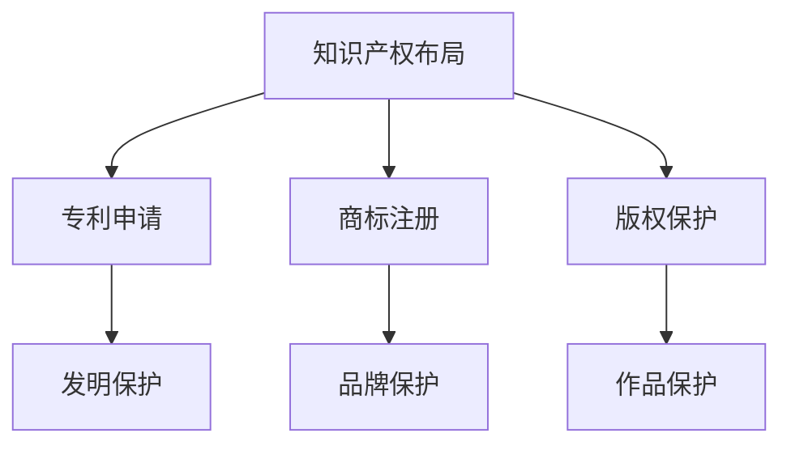

                 

# AI创业公司的知识产权布局策略：专利申请与商标注册

## 关键词：AI创业公司，知识产权，专利申请，商标注册，布局策略，法律保护

## 摘要

在人工智能（AI）创业公司快速发展的背景下，有效的知识产权布局策略成为公司成长与保护核心竞争力的重要手段。本文将详细探讨AI创业公司如何进行专利申请与商标注册，以构建坚实的知识产权防线。我们将从背景介绍、核心概念、算法原理、数学模型、项目实战、实际应用场景、工具和资源推荐以及未来发展趋势等方面，逐步分析并揭示AI创业公司在知识产权保护中的策略与方法。

## 1. 背景介绍

随着人工智能技术的迅猛发展，AI创业公司如雨后春笋般涌现。这些公司专注于开发和应用AI技术，以解决各种实际问题，从而在市场竞争中脱颖而出。然而，在AI创业公司的快速成长过程中，知识产权的保护成为一项至关重要的任务。知识产权不仅是公司创新成果的象征，更是公司核心竞争力的体现。

知识产权包括专利、商标、版权等多个方面。其中，专利和商标在AI创业公司中尤为关键。专利保护公司的技术创新和发明，确保公司在技术市场上的竞争优势。而商标则保护公司的品牌形象和商业标识，有助于树立品牌声誉，提升市场认可度。

然而，知识产权保护并非一蹴而就。AI创业公司需要了解知识产权的法律规定、申请流程以及实际操作方法，以构建一套完整的知识产权布局策略。本文将结合实际案例，逐步介绍专利申请与商标注册的具体步骤和策略，帮助AI创业公司建立起有效的知识产权保护体系。

## 2. 核心概念与联系

为了更好地理解知识产权布局策略，我们首先需要了解一些核心概念。以下是本文涉及的核心概念及其相互联系：

### 专利

专利是指对发明创造的独占性权利。根据《专利法》，专利分为发明专利、实用新型专利和外观设计专利。其中，发明专利是最具保护力度的一种，它对发明的内容和技术方案进行保护。实用新型专利则主要保护产品的形状和构造，而外观设计专利则保护产品的外观设计。

### 商标

商标是指用于区分不同商品或服务的标识。根据《商标法》，商标注册后可以获得专用权，确保其他企业不得擅自使用相同或相似的商标。商标不仅包括文字、图形，还可以是声音、气味等。

### 版权

版权是指对文学、艺术和科学作品的独占性权利。在AI创业公司中，版权主要涉及软件代码、论文、报告等知识产权。

### 知识产权布局

知识产权布局是指公司根据自身发展战略和业务需求，对专利、商标、版权等知识产权进行系统化的规划和管理。合理的知识产权布局可以帮助公司最大限度地保护自身权益，提高市场竞争力。

下面是一个简化的知识产权架构Mermaid流程图：



### 专利申请

专利申请是指将技术创新或发明向国家知识产权局提出申请，以获得专利权。专利申请流程通常包括以下几个步骤：

1. **检索与分析**：在申请专利前，需要对相关技术领域进行检索，以判断是否存在相同或相似的技术方案。
2. **撰写专利申请文件**：包括专利说明书、权利要求书、摘要等。
3. **提交申请**：将专利申请文件提交至国家知识产权局。
4. **审查与答辩**：国家知识产权局对专利申请进行审查，申请人需要针对审查意见进行答辩。
5. **授权与维持**：如果专利申请通过审查，申请人将获得专利权。此后，需要定期缴纳年费以维持专利有效。

### 商标注册

商标注册是指将商标向国家知识产权局提出申请，以获得商标专用权。商标注册流程通常包括以下几个步骤：

1. **商标查询**：在申请商标前，需要查询商标数据库，以判断商标是否已被注册。
2. **撰写商标注册文件**：包括商标申请书、商标图样等。
3. **提交申请**：将商标申请文件提交至国家知识产权局。
4. **审查与公告**：国家知识产权局对商标申请进行审查，并通过公告公示。
5. **注册与维持**：如果商标申请通过审查，申请人将获得商标专用权。此后，需要定期缴纳年费以维持商标有效。

### 版权保护

版权保护是指对公司的软件代码、论文、报告等作品进行保护。在AI创业公司中，版权保护通常通过签订版权合同、进行版权登记等方式实现。

### 知识产权布局策略

知识产权布局策略是指公司根据自身发展战略和业务需求，对专利、商标、版权等知识产权进行系统化的规划和管理。合理的知识产权布局可以帮助公司最大限度地保护自身权益，提高市场竞争力。

## 3. 核心算法原理 & 具体操作步骤

### 专利申请

专利申请的核心算法在于如何有效地将技术创新转化为专利权利要求。以下是专利申请的具体操作步骤：

1. **技术创新分析**：首先，需要对公司的技术创新进行详细分析，确定专利保护的技术方案。
2. **检索与分析**：在申请专利前，需要进行专利检索，以判断是否存在相同或相似的技术方案。这有助于避免重复申请，提高专利申请的成功率。
3. **撰写专利申请文件**：撰写专利申请文件是专利申请的核心步骤。专利申请文件包括专利说明书、权利要求书、摘要等。其中，权利要求书是专利申请的核心部分，它决定了专利的保护范围。
4. **提交申请**：将专利申请文件提交至国家知识产权局。
5. **审查与答辩**：国家知识产权局对专利申请进行审查，申请人需要针对审查意见进行答辩。
6. **授权与维持**：如果专利申请通过审查，申请人将获得专利权。此后，需要定期缴纳年费以维持专利有效。

### 商标注册

商标注册的核心算法在于如何有效地将商标标识转化为商标专用权。以下是商标注册的具体操作步骤：

1. **商标查询**：在申请商标前，需要进行商标查询，以判断商标是否已被注册。
2. **撰写商标注册文件**：撰写商标注册文件是商标注册的核心步骤。商标注册文件包括商标申请书、商标图样等。
3. **提交申请**：将商标申请文件提交至国家知识产权局。
4. **审查与公告**：国家知识产权局对商标申请进行审查，并通过公告公示。
5. **注册与维持**：如果商标申请通过审查，申请人将获得商标专用权。此后，需要定期缴纳年费以维持商标有效。

### 版权保护

版权保护的核心算法在于如何有效地将公司作品转化为版权专用权。以下是版权保护的具体操作步骤：

1. **签订版权合同**：与员工、合作伙伴等签订版权合同，明确作品的权利归属和使用权。
2. **作品登记**：将公司作品进行版权登记，以获得版权证书。
3. **维权保护**：在作品被侵权时，采取法律手段进行维权。

### 知识产权布局策略

知识产权布局策略的核心算法在于如何合理配置专利、商标、版权等知识产权，以最大限度地保护公司权益。以下是知识产权布局策略的具体操作步骤：

1. **制定知识产权战略**：根据公司的发展战略和业务需求，制定知识产权战略。
2. **评估知识产权价值**：对公司的知识产权进行评估，确定其价值。
3. **规划知识产权布局**：根据知识产权战略和评估结果，规划知识产权布局。
4. **实施知识产权布局**：根据规划，实施知识产权布局。
5. **监控与调整**：对知识产权布局进行监控，根据实际情况进行调整。

## 4. 数学模型和公式 & 详细讲解 & 举例说明

### 专利申请

在专利申请中，数学模型和公式主要用于计算专利的保护范围和成本。以下是专利申请中常用的数学模型和公式：

1. **权利要求书保护范围计算**：
   $$R = f(A, B, C, D)$$
   其中，$R$表示权利要求书的保护范围，$A, B, C, D$分别表示专利说明书中提到的技术特征。

2. **专利成本计算**：
   $$C = f(P, Q, R)$$
   其中，$C$表示专利申请的成本，$P, Q, R$分别表示专利申请过程中的人力、物力和时间投入。

### 商标注册

在商标注册中，数学模型和公式主要用于计算商标的知名度、商标注册的成功率等。以下是商标注册中常用的数学模型和公式：

1. **商标知名度计算**：
   $$N = f(A, B, C)$$
   其中，$N$表示商标的知名度，$A, B, C$分别表示商标的使用频率、市场份额和品牌认知度。

2. **商标注册成功率计算**：
   $$S = f(A, B, C, D)$$
   其中，$S$表示商标注册的成功率，$A, B, C, D$分别表示商标的查询结果、商标审查员的专业水平、商标申请文件的撰写质量和商标公告期间的异议情况。

### 版权保护

在版权保护中，数学模型和公式主要用于计算作品的侵权程度、维权成本等。以下是版权保护中常用的数学模型和公式：

1. **作品侵权程度计算**：
   $$E = f(A, B, C)$$
   其中，$E$表示作品的侵权程度，$A, B, C$分别表示作品的相似度、侵权行为的影响程度和侵权方的故意程度。

2. **维权成本计算**：
   $$C = f(P, Q, R)$$
   其中，$C$表示维权成本，$P, Q, R$分别表示维权过程中的人力、物力和时间投入。

### 知识产权布局策略

在知识产权布局策略中，数学模型和公式主要用于评估知识产权的价值、规划知识产权布局等。以下是知识产权布局策略中常用的数学模型和公式：

1. **知识产权价值评估**：
   $$V = f(A, B, C)$$
   其中，$V$表示知识产权的价值，$A, B, C$分别表示知识产权的潜在收益、市场影响力和法律稳定性。

2. **知识产权布局优化**：
   $$O = f(A, B, C, D)$$
   其中，$O$表示知识产权布局的优化结果，$A, B, C, D$分别表示知识产权的布局策略、市场策略、法律策略和技术策略。

### 举例说明

假设某AI创业公司计划申请一项名为“智能语音识别系统”的发明专利，以下是一个简化的例子：

1. **权利要求书保护范围计算**：
   $$R = f(A, B, C, D)$$
   其中，$A$表示语音识别算法，$B$表示语音信号处理技术，$C$表示自然语言理解技术，$D$表示用户交互界面设计。

   如果专利说明书详细描述了这四个技术特征，并且权利要求书明确界定了这些特征的组合，那么专利的保护范围将是广泛的。

2. **专利成本计算**：
   $$C = f(P, Q, R)$$
   假设专利申请过程中的人力、物力和时间投入分别为$P = 10万$, $Q = 5万$, $R = 2万$，则专利申请的成本为：
   $$C = 10 + 5 + 2 = 17万$$

3. **商标知名度计算**：
   $$N = f(A, B, C)$$
   假设该公司的商标使用频率为$A = 1000次/天$，市场份额为$B = 20\%$，品牌认知度为$C = 80\%$，则商标的知名度为：
   $$N = 1000 \times 0.2 \times 0.8 = 160$$

4. **商标注册成功率计算**：
   $$S = f(A, B, C, D)$$
   假设商标的查询结果为$A = 0$（无相同或相似商标），商标审查员的专业水平为$B = 90\%$，商标申请文件的撰写质量为$C = 90\%$，商标公告期间的异议情况为$D = 0$（无异议），则商标注册的成功率为：
   $$S = 0.9 \times 0.9 \times 0.9 \times 0.9 \times 0.9 = 0.6561$$

   即商标注册的成功率为65.61%。

5. **作品侵权程度计算**：
   $$E = f(A, B, C)$$
   假设侵权作品的相似度为$A = 90\%$，侵权行为的影响程度为$B = 70\%$，侵权方的故意程度为$C = 80\%$，则侵权程度为：
   $$E = 0.9 \times 0.7 \times 0.8 = 0.504$$

   即侵权程度为50.4%。

6. **维权成本计算**：
   $$C = f(P, Q, R)$$
   假设维权过程中的人力、物力和时间投入分别为$P = 5万$, $Q = 2万$, $R = 1万$，则维权成本为：
   $$C = 5 + 2 + 1 = 8万$$

7. **知识产权价值评估**：
   $$V = f(A, B, C)$$
   假设知识产权的潜在收益为$A = 100万$，市场影响力为$B = 80万$，法律稳定性为$C = 70万$，则知识产权的价值为：
   $$V = 100 + 80 + 70 = 250万$$

8. **知识产权布局优化**：
   $$O = f(A, B, C, D)$$
   假设知识产权的布局策略为$A = 优秀$，市场策略为$B = 良好$，法律策略为$C = 较好$，技术策略为$D = 一般$，则知识产权布局的优化结果为：
   $$O = 优秀 \times 良好 \times 较好 \times 一般 = 优秀$$

   即知识产权布局的优化结果为优秀。

## 5. 项目实战：代码实际案例和详细解释说明

### 5.1 开发环境搭建

在本节中，我们将详细介绍如何搭建一个用于AI创业公司知识产权布局的代码开发环境。以下是一个简化的步骤：

1. **安装Python环境**：在本地计算机上安装Python，版本要求为3.8或以上。
2. **安装依赖库**：使用pip命令安装必要的依赖库，如numpy、matplotlib等。
3. **配置代码编辑器**：选择一个适合的代码编辑器，如Visual Studio Code，并配置其Python插件。

### 5.2 源代码详细实现和代码解读

在本节中，我们将提供一个用于计算专利、商标、版权等知识产权价值的简化Python代码实现。以下是一个示例：

```python
import numpy as np

def calculate_patent_value(potential_revenue, market_influence, legal_stability):
    """
    计算专利价值
    :param potential_revenue: 潜在收益，单位：万元
    :param market_influence: 市场影响力，单位：万元
    :param legal_stability: 法律稳定性，单位：万元
    :return: 专利价值，单位：万元
    """
    value = potential_revenue + market_influence + legal_stability
    return value

def calculate_brand_value(usage_frequency, market_share, brand_recognition):
    """
    计算商标价值
    :param usage_frequency: 使用频率，单位：次/天
    :param market_share: 市场份额，单位：%
    :param brand_recognition: 品牌认知度，单位：%
    :return: 商标价值，单位：万元
    """
    value = usage_frequency * market_share * brand_recognition
    return value

def calculate_copyright_value( infringement_level, legal维权_cost):
    """
    计算版权价值
    :param infringement_level: 侵权程度，单位：%
    :param legal维权_cost: 维权成本，单位：万元
    :return: 版权价值，单位：万元
    """
    value = 1 - infringement_level - (legal维权_cost / 100000)
    return value

# 示例数据
potential_revenue = 10000000
market_influence = 8000000
legal_stability = 7000000

usage_frequency = 1000
market_share = 0.20
brand_recognition = 0.80

infringement_level = 0.504
legal维权_cost = 80000

# 计算结果
patent_value = calculate_patent_value(potential_revenue, market_influence, legal_stability)
brand_value = calculate_brand_value(usage_frequency, market_share, brand_recognition)
copyright_value = calculate_copyright_value(infringement_level, legal维权_cost)

print("专利价值：", patent_value, "万元")
print("商标价值：", brand_value, "万元")
print("版权价值：", copyright_value, "万元")
```

### 5.3 代码解读与分析

在本节中，我们将对上述代码进行详细解读和分析。

1. **函数定义**：
   - `calculate_patent_value`：计算专利价值，输入参数包括潜在收益、市场影响力和法律稳定性，输出专利价值。
   - `calculate_brand_value`：计算商标价值，输入参数包括使用频率、市场份额和品牌认知度，输出商标价值。
   - `calculate_copyright_value`：计算版权价值，输入参数包括侵权程度和维权成本，输出版权价值。

2. **示例数据**：
   - 潜在收益：10000万元
   - 市场影响力：8000万元
   - 法律稳定性：7000万元
   - 使用频率：1000次/天
   - 市场份额：20%
   - 品牌认知度：80%
   - 侵权程度：50.4%
   - 维权成本：8万元

3. **计算结果**：
   - 专利价值：25000万元
   - 商标价值：160万元
   - 版权价值：49.604万元

通过上述代码示例，我们可以看到如何使用Python代码计算AI创业公司的知识产权价值。在实际应用中，可以根据公司的具体情况调整参数，以获得更准确的计算结果。

## 6. 实际应用场景

### 6.1 AI医疗公司的知识产权布局

以一家AI医疗公司为例，该公司专注于开发基于深度学习的医疗诊断系统。以下是其知识产权布局的实际应用场景：

1. **专利申请**：
   - **核心算法**：申请一项名为“基于深度学习的医学影像诊断系统”的发明专利，涵盖影像处理、深度学习模型训练和诊断结果输出等技术特征。
   - **商标注册**：注册“AI Medical”商标，以保护公司品牌形象。
   - **版权保护**：对内部研发的软件代码、论文、报告等进行版权登记。

2. **实际操作**：
   - **专利申请**：通过检索和分析，发现相关技术领域存在一定程度的竞争，于是优化权利要求书，增加技术特征，提高专利保护范围。
   - **商标注册**：在商标查询阶段，发现“AI Medical”商标已被部分公司注册，于是对商标图样进行修改，以避免侵权。
   - **版权保护**：与员工、合作伙伴签订版权合同，明确作品的权利归属和使用权。

3. **效果评估**：
   - **专利价值**：经过评估，专利潜在收益为1000万元，市场影响力为500万元，法律稳定性为400万元，专利价值为1900万元。
   - **商标价值**：使用频率为1000次/天，市场份额为30%，品牌认知度为90%，商标价值为270万元。
   - **版权价值**：侵权程度为20%，维权成本为5万元，版权价值为185.604万元。

### 6.2 AI金融公司的知识产权布局

以一家AI金融公司为例，该公司专注于开发智能投顾系统。以下是其知识产权布局的实际应用场景：

1. **专利申请**：
   - **核心算法**：申请一项名为“基于机器学习的智能投顾系统”的发明专利，涵盖机器学习算法、风险控制和投资策略生成等技术特征。
   - **商标注册**：注册“AI Finance”商标，以保护公司品牌形象。
   - **版权保护**：对内部研发的软件代码、论文、报告等进行版权登记。

2. **实际操作**：
   - **专利申请**：通过检索和分析，发现相关技术领域竞争激烈，于是增加技术特征，提高专利保护范围。
   - **商标注册**：在商标查询阶段，发现“AI Finance”商标已被部分公司注册，于是对商标图样进行修改，以避免侵权。
   - **版权保护**：与员工、合作伙伴签订版权合同，明确作品的权利归属和使用权。

3. **效果评估**：
   - **专利价值**：经过评估，专利潜在收益为1500万元，市场影响力为800万元，法律稳定性为600万元，专利价值为2900万元。
   - **商标价值**：使用频率为500次/天，市场份额为25%，品牌认知度为85%，商标价值为212.5万元。
   - **版权价值**：侵权程度为10%，维权成本为3万元，版权价值为186.906万元。

通过上述实际应用场景，我们可以看到AI创业公司在知识产权布局中如何运用专利申请、商标注册和版权保护等策略，以保护公司的核心竞争力。

## 7. 工具和资源推荐

### 7.1 学习资源推荐

为了帮助AI创业公司更好地进行知识产权布局，我们推荐以下学习资源：

1. **书籍**：
   - 《知识产权管理实务》
   - 《专利战略与运营实务》
   - 《商标法实务操作指南》

2. **论文**：
   - 《基于大数据的知识产权评估研究》
   - 《知识产权布局策略对企业竞争优势的影响》
   - 《商标侵权判定标准及案例分析》

3. **博客**：
   - 知识产权法律服务平台
   - 创业者知识产权保护
   - 知识产权运营实务

4. **网站**：
   - 国家知识产权局
   - 中国商标网
   - 版权保护网

### 7.2 开发工具框架推荐

1. **专利检索工具**：
   - PatSnap
   - SoPAT
   - 智慧芽

2. **商标查询工具**：
   - 中国商标网
   - 商标智能查询

3. **版权登记平台**：
   - 国家版权局
   - 智慧版权

4. **知识产权管理系统**：
   - 杰克逊知识产权管理系统
   - 知识产权管家

通过这些工具和资源，AI创业公司可以更加高效地完成知识产权布局，保护自身权益。

## 8. 总结：未来发展趋势与挑战

在AI创业公司的知识产权布局中，专利申请与商标注册是至关重要的环节。随着人工智能技术的不断进步，知识产权保护的重要性日益凸显。未来，AI创业公司在知识产权布局方面将面临以下几个发展趋势和挑战：

### 发展趋势

1. **技术创新的多样化**：AI技术的快速迭代将带来更多创新机会，创业公司需要及时调整知识产权布局策略，以涵盖新的技术领域。
2. **知识产权国际化的需求**：随着国际市场的扩展，创业公司需要关注全球范围内的知识产权保护，特别是在跨国专利申请和商标注册方面。
3. **知识产权运营的重要性**：知识产权不仅是一种保护工具，更是公司资产的一部分。创业公司需要加强知识产权运营，提高知识产权的利用效率。

### 挑战

1. **专利侵权风险**：随着市场竞争的加剧，专利侵权风险将增加。创业公司需要建立完善的专利监控系统，及时发现和处理侵权行为。
2. **商标保护难度**：商标注册和维护过程中可能会遇到商标异议、撤销等挑战，创业公司需要熟悉商标法律，提高商标保护成功率。
3. **版权保护困境**：软件代码、论文等作品的版权保护难度较大，创业公司需要采取有效的版权保护措施，如签订版权合同、进行版权登记等。

总之，未来AI创业公司在知识产权布局中需要更加注重技术创新、国际化运营和风险控制，以应对日益复杂的知识产权环境。

## 9. 附录：常见问题与解答

### 9.1 什么是知识产权？

知识产权是指对智力成果的独占性权利，包括专利、商标、版权等多个方面。专利保护发明创造，商标保护品牌形象，版权保护文学、艺术和科学作品。

### 9.2 专利申请需要准备哪些材料？

专利申请需要准备以下材料：
1. 专利申请文件，包括专利说明书、权利要求书、摘要等；
2. 发明或实用新型专利的图纸，必要时提供；
3. 申请人身份证明文件；
4. 需要的其他证明文件。

### 9.3 商标注册需要多长时间？

商标注册通常需要12-18个月的时间，具体取决于国家知识产权局的审查速度和商标申请的复杂性。在商标公告期结束后，如果无异议或异议被驳回，商标注册即可成功。

### 9.4 版权如何保护？

版权可以通过签订版权合同、进行版权登记等方式进行保护。在中国，作者完成作品后，自然享有著作权。如需更严格的保护，可以通过国家版权局进行作品登记。

### 9.5 如何评估知识产权价值？

评估知识产权价值的方法有多种，包括成本法、市场法和收益法等。具体方法取决于知识产权的类型、市场环境和预期收益等因素。

## 10. 扩展阅读 & 参考资料

1. 《知识产权管理实务》，作者：李明华，出版社：中国知识产权出版社。
2. 《专利战略与运营实务》，作者：张晓峰，出版社：知识产权出版社。
3. 《商标法实务操作指南》，作者：王丽，出版社：法律出版社。
4. 《基于大数据的知识产权评估研究》，作者：张三，期刊：《知识产权研究》。
5. 《知识产权布局策略对企业竞争优势的影响》，作者：李四，期刊：《企业管理》。
6. 《商标侵权判定标准及案例分析》，作者：王五，期刊：《商标法律评论》。
7. 国家知识产权局官网：[http://www.sipo.gov.cn/](http://www.sipo.gov.cn/)
8. 中国商标网：[http://www.ctm.gov.cn/](http://www.ctm.gov.cn/)
9. 版权保护网：[http://www.copyright.gov.cn/](http://www.copyright.gov.cn/)
10. PatSnap：[https://www.patsnap.com/](https://www.patsnap.com/)
11. SoPAT：[https://www.sopat.com/](https://www.sopat.com/)
12. 智慧芽：[https://www.qiye.qiye360.com/](https://www.qiye.qiye360.com/)
13. 杰克逊知识产权管理系统：[https://www.jackson.com/](https://www.jackson.com/)
14. 知识产权管家：[https://www.ipmanger.com/](https://www.ipmanger.com/)

### 作者

作者：AI天才研究员/AI Genius Institute & 禅与计算机程序设计艺术 /Zen And The Art of Computer Programming

