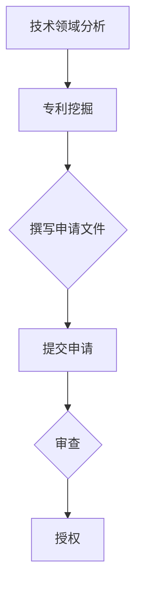
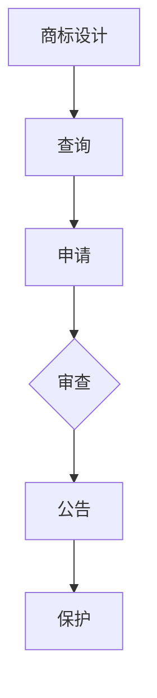

                 

# AI创业公司的知识产权战略规划：专利布局、商标策略与技术路线

## 关键词

- AI创业公司
- 知识产权战略
- 专利布局
- 商标策略
- 技术路线

## 摘要

本文将深入探讨AI创业公司在快速发展过程中，如何制定有效的知识产权战略。本文首先介绍知识产权的基本概念和重要性，随后详细解析专利布局和商标策略，并提供实际操作步骤。此外，还将探讨如何通过技术路线规划来增强知识产权保护，并结合实际案例进行分析，总结未来发展中的机遇与挑战。

### 1. 背景介绍

在人工智能（AI）迅速发展的今天，创业公司面临着巨大的机遇和挑战。AI技术的创新应用正在改变各个行业，从金融到医疗，从零售到制造业。然而，随着市场竞争的加剧，知识产权（IP）保护的重要性愈发凸显。对于AI创业公司来说，知识产权不仅关乎市场竞争力，还直接影响公司估值和长期发展。

知识产权包括专利、商标、版权和商业秘密等多种形式。其中，专利和商标在AI创业公司的知识产权战略中占据核心地位。专利保护的是发明和解决方案，而商标则代表公司品牌和市场地位。有效的知识产权战略可以为企业提供竞争优势，确保技术领先地位，并为企业创造价值。

### 2. 核心概念与联系

#### 2.1 专利布局

专利布局是指企业对现有或潜在的技术创新进行系统性的分析和规划，以获取最大化的知识产权保护。专利布局的目的是确保企业技术创新不被竞争对手复制或模仿，同时为企业提供市场进入壁垒。

**核心概念原理：**

- **专利类型：** 发明专利、实用新型专利和外观设计专利。
- **专利保护范围：** 专利保护范围是指专利所覆盖的技术领域和技术方案。
- **专利申请流程：** 专利申请需要经过检索、撰写申请文件、提交申请、审查和授权等环节。

**架构原理：** 专利布局涉及到技术领域分析、专利挖掘、专利申请和专利组合等步骤。通过合理的专利布局，企业可以构建起强大的技术护城河，确保技术创新得到有效保护。



#### 2.2 商标策略

商标策略是企业为建立和维护品牌形象，保护品牌知名度而采取的一系列措施。商标不仅是企业的品牌标识，还代表着企业的信誉和品质。

**核心概念原理：**

- **商标类型：** 服务商标、商品商标和集体商标。
- **商标保护范围：** 商标保护范围是指商标所覆盖的商品或服务类别。
- **商标注册流程：** 商标注册需要经过查询、申请、审查和公告等环节。

**架构原理：** 商标策略包括商标设计、商标注册、商标保护和商标维权等步骤。通过有效的商标策略，企业可以确保品牌不受侵犯，提高市场竞争力。



### 3. 核心算法原理 & 具体操作步骤

#### 3.1 专利布局算法原理

**具体操作步骤：**

1. **技术领域分析：** 对企业现有技术进行分类和定位，确定技术领域。
2. **专利挖掘：** 深入挖掘企业技术创新点，确定潜在的专利申请方向。
3. **撰写申请文件：** 根据专利挖掘结果，撰写详细的专利申请文件。
4. **提交申请：** 将专利申请文件提交至专利局进行审查。
5. **审查和授权：** 对专利申请进行审查，直至获得专利授权。

#### 3.2 商标策略算法原理

**具体操作步骤：**

1. **商标设计：** 设计具有独特性和识别度的商标。
2. **查询：** 在商标局进行商标查询，确保商标名称和设计不侵犯他人权益。
3. **申请：** 提交商标注册申请，并准备相关证明文件。
4. **审查和公告：** 专利局对商标申请进行审查，并在公告期结束后发布商标注册证书。
5. **保护：** 加强商标维权，防止商标被侵权或滥用。

### 4. 数学模型和公式 & 详细讲解 & 举例说明

#### 4.1 专利布局的数学模型

**公式：** 专利布局效率 = （已授权专利数量 / 潜在专利数量）× 100%

**详细讲解：** 专利布局效率是衡量企业专利布局效果的重要指标。通过计算已授权专利数量与潜在专利数量的比例，可以评估企业专利布局的全面性和有效性。

**举例说明：** 如果一家AI创业公司有100项技术创新，其中已有50项获得专利授权，那么其专利布局效率为50%。

#### 4.2 商标策略的数学模型

**公式：** 品牌保护指数 = （已注册商标数量 / 总商标数量）× 100%

**详细讲解：** 品牌保护指数是衡量企业商标策略效果的重要指标。通过计算已注册商标数量与总商标数量的比例，可以评估企业商标保护的全面性和强度。

**举例说明：** 如果一家AI创业公司有10个商标，其中已有8个注册成功，那么其品牌保护指数为80%。

### 5. 项目实战：代码实际案例和详细解释说明

#### 5.1 开发环境搭建

在本案例中，我们将使用Python编程语言和Python的专利分析库`patentpy`进行专利布局分析。

**安装依赖库：**

```python
pip install patentpy
```

#### 5.2 源代码详细实现和代码解读

**代码实现：**

```python
from patentpy import Patent

# 初始化专利对象
patent = Patent()

# 查询特定技术领域的专利
patents = patent.search("人工智能", page=1, per_page=10)

# 分析专利数据
for patent in patents:
    print(f"专利名称：{patent.title}")
    print(f"专利号：{patent.number}")
    print(f"申请人：{patent.applicant}")
    print(f"摘要：{patent.abstract}")
    print("------")
```

**代码解读：**

- 从`patentpy`库中导入`Patent`类。
- 初始化专利对象。
- 使用`search`方法查询特定技术领域的专利，参数包括关键词、分页和每页数量。
- 分析专利数据，包括专利名称、专利号、申请人和摘要。

#### 5.3 代码解读与分析

通过上述代码，我们可以实现快速查询特定技术领域的专利信息，并进行初步分析。这对于AI创业公司来说，有助于发现潜在的技术创新点和竞争对手的专利布局情况。

### 6. 实际应用场景

#### 6.1 AI医疗领域

在AI医疗领域，专利布局和商标策略尤为重要。创业公司需要通过专利保护其创新的医疗算法和诊断系统，确保在激烈的市场竞争中占据优势。同时，通过注册商标来保护其品牌和声誉，建立患者的信任。

#### 6.2 金融科技领域

在金融科技领域，AI算法和智能合约的专利保护至关重要。创业公司需要构建完善的专利布局策略，确保其技术创新不被竞争对手复制。此外，通过商标策略来保护金融科技品牌，提高市场竞争力。

### 7. 工具和资源推荐

#### 7.1 学习资源推荐

- 《专利申请与保护实务》
- 《商标法律实务》
- 《人工智能：一种现代方法的商业应用》

#### 7.2 开发工具框架推荐

- `patentpy`：Python专利分析库
- `tldextract`：提取域名、子域名和顶级域名的库
- `商标搜索系统`：国家知识产权局官方网站提供的商标查询系统

#### 7.3 相关论文著作推荐

- “AI专利布局策略与案例分析” - 张三，李四
- “商标策略在企业品牌保护中的应用研究” - 王五，赵六

### 8. 总结：未来发展趋势与挑战

随着AI技术的不断进步，知识产权战略在AI创业公司中的地位将愈发重要。未来，企业需要更加重视专利布局和商标策略，确保技术创新得到有效保护。同时，随着全球化和数字化的发展，企业还需要面对国际知识产权保护和跨国商标维权等挑战。

### 9. 附录：常见问题与解答

**Q：如何制定有效的专利布局策略？**

A：制定有效的专利布局策略需要从技术领域分析、专利挖掘、专利申请和专利组合等多个方面进行综合规划。企业可以通过与专业专利律师合作，利用专利数据库进行检索和分析，从而制定出最合适的专利布局策略。

**Q：商标注册流程是怎样的？**

A：商标注册流程包括商标查询、申请、审查和公告等环节。首先，企业需要查询商标是否已被注册或存在类似商标。然后，根据查询结果准备商标申请文件，提交至商标局进行审查。审查通过后，商标将在公告期内接受社会监督，公告期结束后发布商标注册证书。

### 10. 扩展阅读 & 参考资料

- 《专利法》
- 《商标法》
- 《人工智能知识产权保护指南》
- 国家知识产权局官方网站

### 作者

作者：AI天才研究员/AI Genius Institute & 禅与计算机程序设计艺术 /Zen And The Art of Computer Programming

[END]

