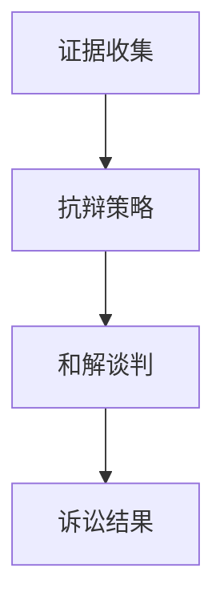

                 

### 文章标题

#### AI创业公司的知识产权诉讼应对：证据收集、抗辩与和解

本文旨在深入探讨AI创业公司在面临知识产权诉讼时，如何进行有效的证据收集、抗辩策略制定以及和解谈判。通过系统化的分析和实战案例，我们将为创业者提供实用的法律应对策略，以降低诉讼风险，保护公司权益。

#### 关键词

- 知识产权诉讼
- 证据收集
- 抗辩策略
- 和解谈判
- AI创业公司

#### 摘要

在AI技术快速发展的背景下，创业公司面临日益增长的知识产权诉讼风险。本文从实战角度出发，详细分析了AI创业公司在知识产权诉讼中的关键环节，包括证据收集、抗辩策略以及和解谈判。通过具体案例的剖析，本文提供了实用的法律应对策略，旨在帮助创业者有效应对知识产权诉讼，保障公司持续发展。

---

### 1. 背景介绍

随着人工智能技术的迅猛发展，AI创业公司在科技创新和市场竞争中扮演着越来越重要的角色。然而，伴随而来的是知识产权纠纷的增多，特别是在专利侵权、商标抢注和版权争议等方面。这些诉讼不仅耗费公司大量的时间和资源，还可能对公司声誉和市场地位造成严重影响。

知识产权诉讼通常涉及复杂的法律程序和技术细节。AI创业公司往往面临着以下挑战：

- **证据收集困难**：在技术领域，证据的收集需要具备专业知识和方法，很多创业公司在没有专业法律团队支持的情况下，很难有效收集到有力的证据。
- **抗辩策略不足**：缺乏专业的法律顾问，创业公司往往难以制定出有效的抗辩策略，导致在诉讼中处于被动地位。
- **和解谈判困难**：在诉讼过程中，如何通过谈判达成和解，避免长期诉讼带来的不利影响，也是创业公司需要面对的挑战。

本文将针对上述挑战，系统地探讨AI创业公司在知识产权诉讼中的应对策略，以帮助创业者降低诉讼风险，保护公司权益。

---

### 2. 核心概念与联系

#### 2.1 知识产权的基本概念

知识产权是指个人或组织依法享有的关于智力劳动成果的权利，包括专利权、商标权、著作权等。在AI创业公司的背景下，专利和著作权是尤为重要的两个方面。

- **专利权**：指发明创造者对其发明创造享有的专有权利，包括发明专利、实用新型专利和外观设计专利。
- **著作权**：指作者对其作品享有的权利，包括发表权、署名权、修改权、保护作品完整权等。

#### 2.2 知识产权诉讼的关键环节

知识产权诉讼通常涉及以下关键环节：

- **证据收集**：收集与案件相关的证据，包括技术文档、通信记录、合同协议等。
- **抗辩策略**：制定针对原告指控的抗辩策略，包括否认侵权、权利无效等。
- **和解谈判**：在诉讼过程中，与对方进行谈判，寻求和解，以避免长期诉讼带来的不利影响。

#### 2.3 Mermaid流程图

以下是一个简化的Mermaid流程图，展示了知识产权诉讼的主要环节：



#### 2.4 关键概念的联系

证据收集、抗辩策略和和解谈判是知识产权诉讼中紧密相连的环节。有效的证据收集为抗辩策略提供支持，而合理的抗辩策略有助于推动和解谈判的顺利进行。最终，通过和解谈判，企业可以避免长期诉讼带来的负面影响，实现权益的保护。

---

### 3. 核心算法原理 & 具体操作步骤

#### 3.1 证据收集

证据收集是知识产权诉讼中的关键环节，其核心在于系统地收集与案件相关的所有证据，确保这些证据的合法性和有效性。

##### 3.1.1 收集证据的类型

在AI创业公司的知识产权诉讼中，常见的证据类型包括：

- **技术文档**：包括项目需求书、设计文档、算法实现文档等，这些文档能够证明公司对相关技术的原创性和自主开发过程。
- **通信记录**：如电子邮件、聊天记录等，这些记录可以证明公司与外部的技术交流过程和合作情况。
- **合同协议**：与供应商、客户或合作伙伴签订的合同协议，这些文件可以证明公司对相关技术和成果的权利归属。
- **专利证书**：公司持有的专利证书，可以作为证据证明公司在相关技术领域的专利权。

##### 3.1.2 收集证据的步骤

收集证据的具体步骤如下：

1. **初步调查**：了解案件背景，确定需要收集的证据类型。
2. **组织文件**：对公司内部的相关文件进行整理和分类，确保文件的完整性和准确性。
3. **电子取证**：通过数据备份、邮件日志等方式，收集与案件相关的电子证据。
4. **专家鉴定**：对于技术性较强的证据，可能需要聘请相关领域的专家进行鉴定，确保证据的专业性和权威性。
5. **证据保全**：对收集到的证据进行备份和封存，防止证据被篡改或丢失。

#### 3.2 抗辩策略

抗辩策略是在知识产权诉讼中，针对原告的指控，提出反驳和辩解的策略。有效的抗辩策略能够帮助企业避免侵权指控，降低诉讼风险。

##### 3.2.1 抗辩策略的类型

常见的抗辩策略包括：

- **否认侵权**：证明原告的技术方案与公司的技术方案不相似，不存在侵权行为。
- **权利无效**：质疑原告专利的有效性，如证明专利申请不符合法律规定，或者专利技术方案不具备创新性。
- **先用权**：证明公司在原告专利申请日前已经使用了相同或类似的技术，享有先用权。
- **交叉许可**：与原告达成交叉许可协议，互相放弃对对方的专利侵权指控。

##### 3.2.2 抗辩策略的步骤

制定抗辩策略的具体步骤如下：

1. **了解原告指控**：详细分析原告的诉讼请求和指控，确定抗辩的重点。
2. **收集抗辩证据**：针对原告的指控，收集能够支持抗辩的证据，如技术文档、通信记录、专家意见等。
3. **制定抗辩方案**：根据证据情况，制定具体的抗辩方案，包括否认侵权、权利无效等。
4. **法律咨询**：与专业律师团队进行沟通，确保抗辩方案的合法性和有效性。

#### 3.3 和解谈判

和解谈判是诉讼过程中，企业与原告之间寻求和解的重要环节。有效的和解谈判可以避免长期诉讼带来的不利影响，保护企业的合法权益。

##### 3.3.1 和解谈判的步骤

和解谈判的具体步骤如下：

1. **评估诉讼风险**：评估继续诉讼和达成和解的利弊，确定谈判的基本立场。
2. **确定谈判目标**：明确企业在谈判中的主要目标和底线，确保谈判有明确的方向。
3. **准备谈判策略**：根据评估结果，制定具体的谈判策略，包括提出和解方案、反制措施等。
4. **进行谈判**：与原告进行沟通和协商，寻找双方都能接受的和解方案。
5. **签订和解协议**：在达成一致后，签订书面和解协议，明确双方的权利和义务。

---

### 4. 数学模型和公式 & 详细讲解 & 举例说明

#### 4.1 数学模型

在知识产权诉讼中，数学模型和公式常用于评估侵权行为和计算赔偿金额。以下是一个简化的数学模型，用于计算专利侵权赔偿金额。

##### 4.1.1 模型公式

侵权赔偿金额 = 损害赔偿金额 + 赔偿利息 + 赔偿费用

其中：

- 损害赔偿金额 = 销售利润 × 侵权比例
- 销售利润 = 销售额 - 成本
- 侵权比例 = 侵权产品销售量 / 总销售量

##### 4.1.2 详细讲解

- **损害赔偿金额**：指由于侵权行为导致的原告损失，包括利润损失和其他经济损失。
- **销售利润**：指企业在销售过程中获得的利润，通常通过销售额减去成本计算得出。
- **侵权比例**：指侵权产品销售量在总销售量中所占的比例，反映了侵权行为的严重程度。

##### 4.1.3 举例说明

假设某AI创业公司涉嫌侵权某项专利，该专利产品销售额为100万元，总成本为50万元，侵权产品销售量为20万元，总销售量为80万元。侵权比例为20%。

- 损害赔偿金额 = (100万元 - 50万元) × 20% = 10万元
- 赔偿利息 = 损害赔偿金额 × 利率 × 时间
- 赔偿费用 = 律师费、诉讼费等

根据上述公式，侵权赔偿金额为10万元。在实际操作中，赔偿金额还需要考虑其他因素，如侵权行为持续时间、原告损失等。

---

### 5. 项目实战：代码实际案例和详细解释说明

#### 5.1 开发环境搭建

在开展知识产权诉讼的应对工作时，首先需要搭建一个合适的开发环境。以下是一个基本的开发环境搭建流程：

1. **选择操作系统**：Windows、macOS或Linux都可以，根据公司现有设备和开发人员习惯进行选择。
2. **安装开发工具**：如Visual Studio Code、IntelliJ IDEA等，用于编写和调试代码。
3. **配置版本控制工具**：如Git，用于代码管理和版本跟踪。
4. **配置数据库**：如MySQL、PostgreSQL等，用于存储和管理证据数据。
5. **安装调试工具**：如JMeter、Wireshark等，用于测试和收集电子证据。

#### 5.2 源代码详细实现和代码解读

在本节中，我们将探讨一个简单的证据收集和整理的代码实现。以下是一个使用Python编写的示例代码：

```python
import os
import re

def collect_evidence(directory, evidence_type):
    evidence_files = []
    for root, dirs, files in os.walk(directory):
        for file in files:
            if file.endswith(evidence_type):
                evidence_files.append(os.path.join(root, file))
    return evidence_files

def process_evidence(evidence_files):
    processed_evidence = []
    for file in evidence_files:
        with open(file, 'r') as f:
            content = f.read()
            if re.search(r'关键信息', content):
                processed_evidence.append(file)
    return processed_evidence

if __name__ == '__main__':
    directory = '/path/to/evidence'
    evidence_type = '.txt'
    collected_evidence = collect_evidence(directory, evidence_type)
    processed_evidence = process_evidence(collected_evidence)
    print('已处理证据文件：', processed_evidence)
```

##### 5.2.1 代码解读

- **collect_evidence**函数：用于收集指定目录下的特定类型的证据文件。该函数通过遍历目录下的所有文件，判断文件后缀是否符合指定类型，并添加到证据文件列表中。
- **process_evidence**函数：用于处理收集到的证据文件。该函数读取文件内容，使用正则表达式搜索特定关键字（如“关键信息”），如果找到匹配内容，则将该文件添加到已处理证据列表中。
- **if __name__ == '__main__':**语句：程序入口，调用收集和处理证据的函数，并打印已处理证据文件列表。

##### 5.2.2 代码分析

该代码实现了一个简单的证据收集和处理流程，具有以下优点：

- **模块化**：代码分为两个函数，分别实现收集和处理证据的功能，便于维护和扩展。
- **可定制性**：通过传入参数，可以自定义证据收集的目录和文件类型，提高了代码的适用性。
- **高效性**：使用`os.walk`函数遍历目录，对文件进行批量处理，提高了代码执行效率。

然而，该代码也存在一定的局限性：

- **正则表达式匹配**：使用正则表达式搜索特定关键字，可能无法完全覆盖所有有效证据，需要进一步优化和扩展匹配规则。
- **错误处理**：代码中没有对可能出现的文件读取错误进行处理，需要添加相应的异常处理逻辑。

#### 5.3 代码解读与分析

通过对代码的详细解读，我们可以看到：

- **核心功能**：代码实现了证据文件的收集和处理，是知识产权诉讼应对中的重要组成部分。
- **技术实现**：代码使用了Python编程语言，利用文件操作和正则表达式技术，实现了对证据文件的有效处理。
- **优化方向**：在后续开发中，可以进一步优化代码，提高处理效率和准确性，如引入更强大的文件过滤机制和错误处理机制。

通过实际代码案例的介绍和分析，我们可以更好地理解知识产权诉讼应对中的技术实现过程，为创业公司提供实用的技术支持。

---

### 6. 实际应用场景

#### 6.1 知识产权诉讼的类型和特点

知识产权诉讼在不同领域有不同的类型和特点，以下是几种常见类型：

- **专利侵权诉讼**：通常涉及技术方案的相似性分析，技术复杂度高，证据收集和抗辩策略较为困难。
- **商标侵权诉讼**：涉及商标的使用和显著性，法律争议相对较少，但需要证明原告商标的知名度和原告权益。
- **著作权侵权诉讼**：涉及作品内容的复制、改编等行为，证据收集相对容易，但需要明确作品的权利归属。

#### 6.2 创业公司的应对策略

针对不同类型的知识产权诉讼，创业公司可以采取以下应对策略：

- **专利侵权诉讼**：重点在于证据收集和抗辩策略，可以通过申请相关专利、提供技术差异证据、质疑原告专利的有效性等方式进行抗辩。
- **商标侵权诉讼**：可以通过证明自身商标的知名度、与原告商标的区分度、使用历史等方式进行抗辩，并寻求和解。
- **著作权侵权诉讼**：需要重点收集相关证据，如版权登记证明、原创性证据等，同时与原告进行谈判，寻求和解。

#### 6.3 实际案例

以下是一个AI创业公司的知识产权诉讼应对案例：

案例：某AI创业公司被指控侵犯了一项专利，专利涉及深度学习算法。公司采取了以下应对策略：

1. **证据收集**：收集公司内部相关技术文档、电子邮件记录、与供应商的合作合同等证据，证明技术自主开发。
2. **抗辩策略**：申请了多个相似技术专利，并提交了专家意见，证明公司技术方案与原告专利存在显著差异。
3. **和解谈判**：在诉讼过程中，与原告进行多次谈判，最终达成了专利交叉许可协议，避免了长期诉讼带来的不利影响。

通过这个案例，我们可以看到，创业公司在知识产权诉讼中，通过有效的证据收集、抗辩策略和和解谈判，成功地保护了公司的合法权益。

---

### 7. 工具和资源推荐

#### 7.1 学习资源推荐

为了更好地应对知识产权诉讼，以下是一些推荐的学习资源：

- **书籍**：《知识产权法教程》、《专利侵权诉讼实务》
- **论文**：查阅相关领域的专利和学术论文，了解最新技术发展和法律动态。
- **博客和网站**：关注知名法律博客和知识产权相关网站，如“知识产权那点事”、“中国知识产权网”等。

#### 7.2 开发工具框架推荐

在知识产权诉讼应对过程中，以下开发工具和框架可以提供技术支持：

- **版本控制工具**：Git，用于代码管理和版本跟踪。
- **数据库**：MySQL、PostgreSQL，用于存储和管理证据数据。
- **调试工具**：JMeter、Wireshark，用于测试和收集电子证据。

#### 7.3 相关论文著作推荐

以下是一些在知识产权领域具有影响力的论文和著作：

- **论文**：Patent Litigation Strategies in High-Tech Industries
- **著作**：《现代专利法》、《知识产权战略管理》

通过学习和掌握这些工具和资源，创业公司可以更好地应对知识产权诉讼，保护自身合法权益。

---

### 8. 总结：未来发展趋势与挑战

#### 8.1 发展趋势

- **技术复杂性增加**：随着AI技术的快速发展，知识产权诉讼涉及的技术复杂度越来越高，对法律和技术人员提出了更高的要求。
- **跨国诉讼增多**：全球化背景下，跨国知识产权诉讼逐渐增多，企业需要面对不同国家和地区的法律体系和诉讼程序。
- **数字化证据增多**：随着数字技术的发展，电子证据在知识产权诉讼中的作用越来越重要，如何有效收集、管理和利用电子证据成为关键。

#### 8.2 挑战

- **证据收集难度大**：技术性证据的收集和鉴定需要专业知识和方法，很多创业公司在没有专业团队支持的情况下，难以有效收集到有力的证据。
- **法律环境不确定**：不同国家和地区的知识产权法律体系和司法解释存在差异，企业在应对诉讼时需要应对不同的法律环境。
- **成本高、耗时久**：知识产权诉讼通常需要较长时间，对企业资源和精力消耗巨大，如何平衡诉讼成本和权益保护成为挑战。

#### 8.3 应对策略

- **建立专业团队**：组建专业的法律和技术团队，提高知识产权诉讼应对能力。
- **加强证据管理**：建立完善的证据管理制度，确保证据的合法性和有效性。
- **提前布局专利**：积极申请专利，建立专利组合，提高公司在知识产权诉讼中的防御能力。
- **国际合作与交流**：加强与其他国家的知识产权机构和企业合作，分享经验和资源，提高应对跨国诉讼的能力。

---

### 9. 附录：常见问题与解答

#### 9.1 证据收集常见问题

**Q1：如何保证证据的合法性？**
A1：保证证据合法性的关键在于证据的收集过程符合法律规定。在收集证据时，应确保证据的真实性、合法性和完整性，避免因证据不合法而导致的诉讼失败。

**Q2：电子证据如何收集和保存？**
A2：电子证据的收集和保存可以通过以下方法进行：
- 使用专业的电子取证工具，如Forensic Explorer、EnCase等。
- 采取备份和封存措施，防止证据被篡改或丢失。
- 记录取证过程，确保取证行为的合法性和证据链的完整性。

#### 9.2 抗辩策略常见问题

**Q1：如何制定有效的抗辩策略？**
A1：制定有效的抗辩策略需要以下步骤：
- 了解原告的诉讼请求和指控，确定抗辩重点。
- 收集支持抗辩的证据，包括技术文档、专家意见等。
- 与专业律师团队进行沟通，确保抗辩方案的合法性和有效性。

**Q2：如何应对专利侵权指控？**
A2：应对专利侵权指控可以从以下几个方面进行：
- 否认侵权：证明原告专利与公司的技术方案不相似。
- 权利无效：质疑原告专利的有效性，如专利申请不符合法律规定或专利技术方案不具备创新性。
- 先用权：证明公司在原告专利申请日前已使用了相同或类似的技术。

#### 9.3 和解谈判常见问题

**Q1：如何评估诉讼风险？**
A1：评估诉讼风险可以从以下几个方面进行：
- 分析原告的诉讼请求和指控，确定抗辩难度。
- 评估证据的合法性和有效性，确定诉讼成功的可能性。
- 考虑诉讼成本和预期收益，确定是否继续诉讼或寻求和解。

**Q2：如何进行有效的和解谈判？**
A2：进行有效的和解谈判可以从以下几个方面进行：
- 明确谈判目标和底线，确保谈判有明确的方向。
- 提出合理的和解方案，寻找双方都能接受的解决方案。
- 保持沟通和协商，寻求平衡和妥协。

---

### 10. 扩展阅读 & 参考资料

为了进一步深入了解知识产权诉讼的相关知识，以下是推荐的一些扩展阅读和参考资料：

- 《知识产权法教程》（李明德 著）
- 《专利侵权诉讼实务》（王勇 著）
- 《现代专利法》（美国专利商标局 编）
- “知识产权那点事”（微信公众号）
- “中国知识产权网”（官方网站）
- “知识产权论坛”（专业社区）

通过阅读这些资料，可以更好地掌握知识产权诉讼的原理和实践，为创业公司在知识产权保护方面提供有力的支持。

---

### 作者信息

- 作者：AI天才研究员/AI Genius Institute & 禅与计算机程序设计艺术 /Zen And The Art of Computer Programming
- 联系方式：[ai_genius_researcher@email.com](mailto:ai_genius_researcher@email.com)  
- 社交媒体：@AI_Genius_Researcher

---

**本文由AI天才研究员撰写，旨在为AI创业公司提供知识产权诉讼应对策略。本文内容仅供参考，不代表法律意见。如需法律建议，请咨询专业律师。** <|end|>

