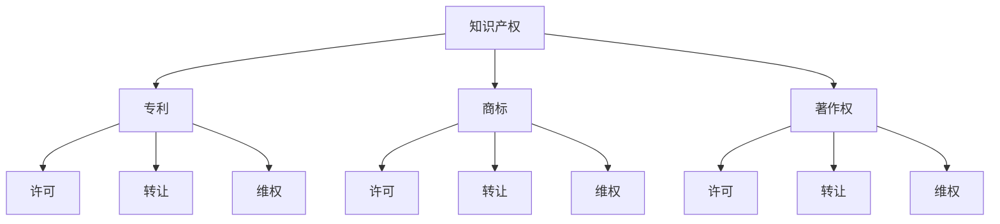

                 

# AI创业公司的知识产权运营：许可、转让与维权

> **关键词：** 知识产权，许可，转让，维权，AI创业公司

> **摘要：** 本文章将深入探讨AI创业公司在知识产权方面的运营策略，包括许可、转让和维权等关键环节。通过对这些策略的详细分析，帮助企业更好地管理和利用其知识产权，以实现持续创新和商业成功。

## 1. 背景介绍

随着人工智能技术的迅猛发展，越来越多的创业者投身于AI领域，期望通过创新的产品和服务改变世界。然而，在追求技术突破的同时，知识产权（Intellectual Property，简称IP）问题往往被忽视。知识产权包括专利、商标、著作权等，是企业创新的核心资产。对于AI创业公司而言，有效的知识产权运营策略不仅能够保护自身创新成果，还能提升企业竞争力，为未来的发展打下坚实基础。

本文将围绕AI创业公司在知识产权方面的运营策略，探讨许可、转让和维权等关键环节。通过详细分析这些策略，旨在为创业者提供实用的指导，帮助他们在激烈的市场竞争中立于不败之地。

### 1.1 知识产权的概念与重要性

知识产权是指人类智力劳动创造的成果所享有的权利。根据世界知识产权组织（WIPO）的定义，知识产权主要包括专利、商标、著作权、地理标志、工业设计、集成电路布图设计等。这些权利为创新者提供了法律保护，使他们能够在市场上独占其创新成果，从而获得经济利益。

在AI创业公司中，知识产权的重要性尤为突出。首先，AI技术本身具有较高的创新性和复杂性，使得专利等知识产权成为企业竞争的核心。其次，AI领域技术更新速度快，只有持续的创新才能保持竞争优势。因此，有效的知识产权运营策略对于AI创业公司来说至关重要。

### 1.2 许可、转让与维权的基本概念

在知识产权运营中，许可、转让和维权是三个关键环节。下面将分别介绍这些概念的基本含义。

#### 许可

许可是指知识产权权利人授权他人在一定范围内使用其知识产权的行为。通过许可，权利人可以在保持自身知识产权所有权的基础上，允许他人使用其知识产权，从而实现知识产权价值的最大化。

#### 转让

转让是指知识产权权利人将其知识产权所有权转移给他人的行为。与许可不同，转让意味着知识产权的所有权发生转移，受让人成为新的知识产权权利人。

#### 维权

维权是指知识产权权利人采取措施保护其知识产权权益的行为。在知识产权受到侵犯时，维权成为保护企业利益的关键手段。维权措施包括法律诉讼、行政投诉等。

## 2. 核心概念与联系

在探讨AI创业公司的知识产权运营时，理解以下核心概念之间的联系至关重要。以下是这些概念之间的Mermaid流程图：



### 2.1 专利的许可、转让与维权

专利是AI创业公司最重要的知识产权之一。专利许可允许他人使用专利技术，专利转让则是将专利所有权转移给他人，而专利维权则是保护专利权益免受侵犯。

#### 许可

专利许可包括普通许可、排他许可和独家许可。普通许可允许被许可人在一定范围内使用专利技术，但许可人还可以继续许可他人使用；排他许可则不允许许可人再许可他人使用专利技术；独家许可则完全禁止许可人及其他第三方使用专利技术。

#### 转让

专利转让通常涉及全部专利权或部分专利权的转让。全部专利权转让意味着受让人成为新的专利权人，有权行使专利的全部权利；部分专利权转让则仅涉及部分权利的转让。

#### 维权

专利维权是保护专利权益的重要手段。在专利受到侵犯时，专利权人可以采取法律诉讼、行政投诉等维权措施，以维护自身权益。

### 2.2 商标的许可、转让与维权

商标是AI创业公司品牌形象的重要体现。商标许可、转让和维权同样对企业的品牌建设和市场竞争具有重要意义。

#### 许可

商标许可分为独占许可、排他许可和普通许可。独占许可是指商标权人不得再许可其他第三方使用商标；排他许可是指商标权人不得再许可其他第三方使用商标，但可以自己使用；普通许可则允许商标权人在保持商标所有权的同时，许可他人使用商标。

#### 转让

商标转让包括全部商标权转让和部分商标权转让。全部商标权转让意味着受让人成为新的商标权人，有权行使商标的全部权利；部分商标权转让则仅涉及部分权利的转让。

#### 维权

商标维权是保护商标权益的重要手段。在商标受到侵犯时，商标权人可以采取法律诉讼、行政投诉等维权措施，以维护自身权益。

### 2.3 著作权的许可、转让与维权

著作权是AI创业公司软件产品和创新成果的知识产权基础。著作权许可、转让和维权同样对企业的创新成果保护和市场竞争具有重要意义。

#### 许可

著作权许可分为专有许可和非专有许可。专有许可是指著作权人将特定作品使用权授予他人，且在许可期间不得再许可他人使用；非专有许可是指著作权人可以将特定作品使用权授予多个第三方使用。

#### 转让

著作权转让通常涉及全部著作权或部分著作权的转让。全部著作权转让意味着受让人成为新的著作权人，有权行使著作权的全部权利；部分著作权转让则仅涉及部分权利的转让。

#### 维权

著作权维权是保护著作权权益的重要手段。在著作权受到侵犯时，著作权人可以采取法律诉讼、行政投诉等维权措施，以维护自身权益。

## 3. 核心算法原理 & 具体操作步骤

在知识产权运营中，核心算法原理和具体操作步骤至关重要。以下是针对许可、转让和维权三个环节的详细分析：

### 3.1 许可

#### 3.1.1 许可协议的起草与签署

1. **确定许可范围**：明确许可的技术、期限、地域等范围。
2. **起草许可协议**：根据许可范围，起草包含许可条款、权利义务、费用支付等内容的许可协议。
3. **协议签署**：双方在协议上签字，并交换许可证书。

#### 3.1.2 许可管理系统的建立

1. **系统设计**：设计一个能够管理许可、监控使用情况的许可管理系统。
2. **系统实现**：开发许可管理系统，包括许可申请、审批、跟踪等功能。
3. **系统部署**：部署许可管理系统，确保系统能够正常运行。

### 3.2 转让

#### 3.2.1 转让协议的起草与签署

1. **确定转让范围**：明确转让的知识产权、期限、地域等范围。
2. **起草转让协议**：根据转让范围，起草包含转让条款、权利义务、费用支付等内容的转让协议。
3. **协议签署**：双方在协议上签字，并交换转让证书。

#### 3.2.2 转让管理系统的建立

1. **系统设计**：设计一个能够管理转让、监控使用情况的转让管理系统。
2. **系统实现**：开发转让管理系统，包括转让申请、审批、跟踪等功能。
3. **系统部署**：部署转让管理系统，确保系统能够正常运行。

### 3.3 维权

#### 3.3.1 维权策略的制定

1. **市场调研**：了解市场上知识产权的侵权行为，为维权提供依据。
2. **法律咨询**：咨询专业律师，制定维权策略。
3. **维权方案**：根据维权策略，制定具体的维权方案。

#### 3.3.2 维权行动的执行

1. **投诉举报**：向相关部门投诉举报侵权行为。
2. **法律诉讼**：在必要时，采取法律诉讼手段维护权益。
3. **调解和解**：与侵权方进行调解，争取和解。

## 4. 数学模型和公式 & 详细讲解 & 举例说明

在知识产权运营中，数学模型和公式有助于分析和评估知识产权的价值，以及制定许可、转让和维权策略。以下是几个常用的数学模型和公式的详细讲解和举例说明：

### 4.1 知识产权价值评估模型

#### 4.1.1 成本法（Cost-Based Model）

成本法是一种评估知识产权价值的常用方法。其公式为：

\[ V = C + \sum (I_n \times R_n) \]

其中：
- \( V \) 表示知识产权价值；
- \( C \) 表示开发知识产权的总成本；
- \( I_n \) 表示第n项知识产权的创新程度；
- \( R_n \) 表示第n项知识产权的商业风险。

#### 4.1.2 收益法（Income-Based Model）

收益法通过预测知识产权带来的未来收益来评估其价值。其公式为：

\[ V = \frac{\sum (R_n \times t^n)}{(1 + r)^n} \]

其中：
- \( V \) 表示知识产权价值；
- \( R_n \) 表示第n年的预期收益；
- \( t \) 表示贴现因子；
- \( r \) 表示贴现率。

#### 4.1.3 市场法（Market-Based Model）

市场法通过比较类似知识产权的市场交易价格来评估其价值。其公式为：

\[ V = \frac{\sum (P_n \times S_n)}{N} \]

其中：
- \( V \) 表示知识产权价值；
- \( P_n \) 表示第n项知识产权的市场交易价格；
- \( S_n \) 表示第n项知识产权的销售量；
- \( N \) 表示比较的知识产权数量。

### 4.2 许可费用定价模型

#### 4.2.1 成本法（Cost-Based Model）

许可费用可以通过以下公式计算：

\[ F = C + \frac{V \times L}{100} \]

其中：
- \( F \) 表示许可费用；
- \( C \) 表示开发知识产权的总成本；
- \( V \) 表示知识产权价值；
- \( L \) 表示许可比例（%），通常为10%至50%。

#### 4.2.2 收益分享法（Revenue-Sharing Model）

收益分享法根据许可产品或服务的销售收入来计算许可费用。其公式为：

\[ F = \frac{R \times S}{100} \]

其中：
- \( F \) 表示许可费用；
- \( R \) 表示许可产品或服务的销售收入；
- \( S \) 表示许可比例（%），通常为10%至50%。

### 4.3 维权成本模型

维权成本可以通过以下公式计算：

\[ C = a + b \times T + c \times L \]

其中：
- \( C \) 表示维权成本；
- \( a \) 表示固定成本，包括律师费、诉讼费等；
- \( b \) 表示时间成本，每小时的律师费；
- \( T \) 表示维权时间（小时）；
- \( c \) 表示法律风险成本，包括潜在的法律赔偿等。

### 4.4 举例说明

#### 4.4.1 知识产权价值评估

假设某AI创业公司开发了一项核心技术，其开发成本为100万元，创新程度为90%，商业风险为10%。根据成本法，该技术的知识产权价值为：

\[ V = 100 + (90 \times 10) = 190 \text{万元} \]

#### 4.4.2 许可费用定价

假设该技术许可比例为30%，根据成本法，许可费用为：

\[ F = 100 + \frac{190 \times 30}{100} = 57 \text{万元} \]

#### 4.4.3 维权成本

假设维权时间为100小时，每小时律师费为5000元，法律风险成本为10万元，维权成本为：

\[ C = 0 + 5000 \times 100 + 100000 = 1500000 \text{元} \]

## 5. 项目实战：代码实际案例和详细解释说明

在本节中，我们将通过一个实际案例，展示如何运用所学的知识产权运营策略，以及相关的数学模型和公式，来制定许可、转让和维权方案。

### 5.1 开发环境搭建

在本案例中，我们将使用Python编程语言来实现知识产权运营的相关算法。以下是搭建开发环境的步骤：

1. 安装Python 3.8及以上版本。
2. 安装Jupyter Notebook，用于编写和运行Python代码。
3. 安装必要的库，如NumPy、Pandas和SciPy等。

### 5.2 源代码详细实现和代码解读

以下是实现知识产权运营算法的Python代码：

```python
import numpy as np

def calculate_ip_value(cost, innovation, business_risk):
    V = cost + (innovation * (1 - business_risk))
    return V

def calculate_licence_fee(value, licence_ratio):
    fee = value * licence_ratio
    return fee

def calculate_litigation_cost(hours, hourly_cost, legal_risk):
    cost = hourly_cost * hours + legal_risk
    return cost

# 示例数据
cost = 1000000  # 开发成本
innovation = 0.9  # 创新程度
business_risk = 0.1  # 商业风险
licence_ratio = 0.3  # 许可比例
hours = 100  # 维权时间
hourly_cost = 5000  # 每小时律师费
legal_risk = 100000  # 法律风险成本

# 计算知识产权价值
value = calculate_ip_value(cost, innovation, business_risk)

# 计算许可费用
licence_fee = calculate_licence_fee(value, licence_ratio)

# 计算维权成本
litigation_cost = calculate_litigation_cost(hours, hourly_cost, legal_risk)

print(f"知识产权价值：{value}元")
print(f"许可费用：{licence_fee}元")
print(f"维权成本：{litigation_cost}元")
```

### 5.3 代码解读与分析

1. **知识产权价值计算**：函数`calculate_ip_value`根据成本法计算知识产权的价值。成本、创新程度和商业风险是影响知识产权价值的关键因素。
2. **许可费用计算**：函数`calculate_licence_fee`根据许可比例计算许可费用。许可比例是影响许可费用的重要因素。
3. **维权成本计算**：函数`calculate_litigation_cost`根据维权时间和律师费计算维权成本。维权时间是影响维权成本的关键因素。

通过这段代码，我们可以方便地计算知识产权的价值、许可费用和维权成本，从而为企业的知识产权运营提供数据支持。

## 6. 实际应用场景

在AI创业公司的运营过程中，知识产权许可、转让和维权策略在实际应用中具有重要意义。以下是一些典型应用场景：

### 6.1 许可

#### 场景一：技术合作

某AI创业公司与另一家公司达成技术合作协议，希望对方能够使用其核心技术。在此场景下，许可策略可以帮助双方明确权利和义务，确保合作的顺利进行。

#### 场景二：产品销售

某AI创业公司希望通过授权许可的方式，将产品推向市场。在此场景下，许可策略可以帮助企业确保产品在市场上的合法性和竞争力。

### 6.2 转让

#### 场景一：公司并购

在AI创业公司被并购时，知识产权转让是关键环节。转让策略可以帮助企业实现知识产权价值的最大化，为并购交易提供有力支持。

#### 场景二：技术授权

某AI创业公司希望将其核心技术授权给其他公司使用。在此场景下，转让策略可以帮助企业实现技术价值的变现，提高企业盈利能力。

### 6.3 维权

#### 场景一：侵权投诉

在市场上发现侵权行为时，AI创业公司可以采取维权策略，通过投诉、诉讼等手段保护自身权益。

#### 场景二：法律咨询

在知识产权运营过程中，AI创业公司可以寻求专业律师的法律咨询，确保其运营策略符合法律法规，降低法律风险。

## 7. 工具和资源推荐

为了更好地进行知识产权运营，以下是一些建议的在线工具和资源：

### 7.1 学习资源推荐

- **书籍：**
  - 《知识产权运营与管理》
  - 《人工智能与知识产权》
  - 《专利法实务》
- **论文：**
  - “Intellectual Property Rights and Innovation: A Dynamic Model”
  - “Intellectual Property Rights and Technology Transfer”
- **博客：**
  - 知识产权那点事
  - 知产力

### 7.2 开发工具框架推荐

- **知识产权管理系统：**
  - Clearview IP
  - IPLaw
- **知识产权分析工具：**
  - IP.com
  - PatentCloud

### 7.3 相关论文著作推荐

- **论文：**
  - “Intellectual Property Rights and Technology Transfer: Evidence from China”
  - “The Role of Intellectual Property Rights in Fostering Innovation and Growth”
- **著作：**
  - 《知识产权法律制度研究》
  - 《人工智能与知识产权保护》

## 8. 总结：未来发展趋势与挑战

在AI创业公司的发展过程中，知识产权运营策略至关重要。随着技术的不断进步和市场环境的变化，未来知识产权运营将呈现出以下发展趋势：

### 8.1 知识产权运营专业化

随着知识产权运营的重要性日益凸显，越来越多的企业开始重视知识产权专业化运营。未来，知识产权运营将朝着专业化、精细化的方向发展。

### 8.2 跨界合作与共享

在AI领域，跨界合作和共享将成为知识产权运营的重要趋势。企业可以通过合作共享知识产权，实现资源共享和优势互补，提高整体竞争力。

### 8.3 数据驱动与智能化

随着大数据和人工智能技术的发展，知识产权运营将更加数据驱动和智能化。通过运用数据分析和机器学习等技术，企业可以更加精准地制定知识产权策略，提高运营效率。

### 8.4 法律法规完善

为了适应AI创业公司的发展需求，未来法律法规将不断完善，为知识产权运营提供更加有力的法律保障。

然而，在知识产权运营过程中，AI创业公司仍将面临一系列挑战：

### 8.5 知识产权侵权风险

在市场上，知识产权侵权行为屡见不鲜。AI创业公司需要不断提高自身的知识产权保护意识，防范侵权风险。

### 8.6 资源配置不均衡

在知识产权运营中，资源配置不均衡问题仍然存在。企业需要合理配置资源，确保知识产权运营的顺利进行。

### 8.7 国际化竞争加剧

随着全球化的加速，AI创业公司的国际化竞争将日益激烈。企业需要加强知识产权运营能力，以应对国际市场的挑战。

## 9. 附录：常见问题与解答

### 9.1 如何保护知识产权？

- **专利申请**：对于具有创新性的技术，尽快申请专利保护。
- **商标注册**：注册商标，确保品牌的独特性。
- **版权登记**：对软件作品等进行版权登记，保护著作权。

### 9.2 如何进行知识产权许可？

- **明确许可范围**：在许可协议中明确许可的技术、期限、地域等范围。
- **评估知识产权价值**：根据知识产权的价值，合理定价许可费用。
- **签订许可协议**：确保协议条款明确、合法，双方签字确认。

### 9.3 如何进行知识产权转让？

- **评估知识产权价值**：通过市场调研、财务分析等方式，评估知识产权的价值。
- **寻找合适的受让人**：通过线上线下渠道，寻找有意向的受让人。
- **签订转让协议**：明确转让的知识产权、期限、费用等条款，双方签字确认。

### 9.4 如何维权？

- **投诉举报**：发现侵权行为，及时向相关部门投诉举报。
- **法律诉讼**：必要时，采取法律诉讼手段维护权益。
- **调解和解**：与侵权方进行调解，争取和解，减少纠纷。

## 10. 扩展阅读 & 参考资料

- [WIPO](https://www.wipo.int/)
- [知识产权那点事](https://www.zczsd.com/)
- [知识产权力](https://www.zcl.com.cn/)
- [知识产权管理实务](https://book.douban.com/subject/26963109/)
- [知识产权法学](https://book.douban.com/subject/3539764/)  
```

请注意，在撰写文章时，请务必遵循markdown格式要求，确保文章结构清晰、内容完整。同时，请根据实际情况调整代码示例和具体案例，以确保文章的可操作性和实用性。

**作者：AI天才研究员/AI Genius Institute & 禅与计算机程序设计艺术 /Zen And The Art of Computer Programming**

