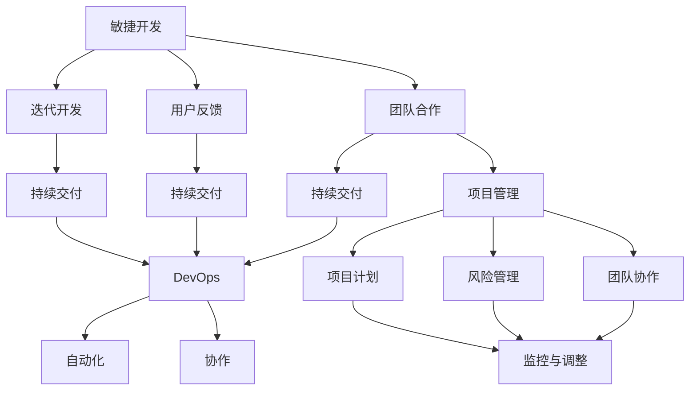

                 

### 1. 背景介绍

在当前快速发展的技术时代，人工智能（AI）已经成为推动创新和产业变革的重要驱动力。AI创业公司如雨后春笋般涌现，它们希望通过创新的AI技术解决现实问题，从而在竞争激烈的市场中占据一席之地。然而，随着公司规模的扩大和项目的增多，如何有效地组织架构设计成为了一个关键问题。

组织架构是公司的骨骼系统，它不仅决定了公司的运营效率，也直接影响到员工的满意度和工作效率。对于AI创业公司来说，高效的架构设计意味着能够更好地利用技术和人才资源，实现快速迭代和创新。本篇文章将深入探讨AI创业公司的组织架构优化设计，从多个角度分析如何构建一个灵活、高效且具备可持续发展能力的组织架构。

本文主要分为以下几个部分：

1. **背景介绍**：简要介绍AI创业公司的发展现状和组织架构的重要性。
2. **核心概念与联系**：阐述组织架构优化设计中的关键概念，如敏捷开发、DevOps和团队结构等，并通过Mermaid流程图展示其相互关系。
3. **核心算法原理与具体操作步骤**：详细讲解如何通过敏捷开发、自动化测试和持续集成来优化组织架构。
4. **数学模型和公式**：介绍与组织架构优化相关的数学模型和公式，并进行详细讲解和举例说明。
5. **项目实战**：通过实际案例展示如何实现组织架构优化，包括开发环境搭建、源代码实现和代码解读等。
6. **实际应用场景**：分析不同类型的AI创业公司在组织架构优化中的具体应用。
7. **工具和资源推荐**：推荐学习资源、开发工具框架和相关论文著作。
8. **总结**：总结本文的核心观点，探讨未来发展趋势与挑战。
9. **附录**：解答常见问题，提供进一步阅读和参考资料。

通过这些内容的逐步深入，本文希望为AI创业公司在组织架构优化设计上提供有价值的参考和思路。

### 2. 核心概念与联系

在探讨AI创业公司的组织架构优化设计之前，我们需要明确几个核心概念，并了解它们之间的相互联系。这些概念包括敏捷开发、DevOps、团队结构以及项目管理等。

#### 敏捷开发

敏捷开发（Agile Development）是一种以人为核心、迭代和循序渐进的开发方法。它强调灵活性和适应性，以应对快速变化的需求。敏捷开发的核心理念包括：

- **迭代开发**：将整个开发过程划分为多个短周期（通常为几周）的迭代，每个迭代完成后，团队会回顾并调整计划。
- **用户反馈**：通过频繁的用户反馈来优化产品，确保开发方向与用户需求保持一致。
- **团队合作**：鼓励团队成员之间的紧密合作和沟通，促进知识共享和技能提升。
- **持续交付**：持续交付意味着产品可以随时发布，从而缩短市场响应时间。

#### DevOps

DevOps是一种结合软件开发（Development）和运维（Operations）的理念和实践，旨在通过自动化和紧密协作来提高软件交付的效率和可靠性。DevOps的核心原则包括：

- **自动化**：通过自动化工具和流程来简化软件的部署、测试和监控，减少手动操作的错误和重复劳动。
- **持续集成/持续交付（CI/CD）**：持续集成（Continuous Integration）确保代码变更及时合并并测试，持续交付（Continuous Delivery）确保产品可以随时发布。
- **协作**：打破开发和运维之间的壁垒，鼓励跨职能团队的合作和沟通，提高整体效率。

#### 团队结构

团队结构是组织架构的核心组成部分，它决定了团队成员的协作方式和职责分配。常见的团队结构包括：

- **功能型团队**：按照功能划分，如前端开发、后端开发、测试等，团队成员专注于特定领域的技能。
- **项目型团队**：为特定项目组建，团队成员跨职能合作，从项目启动到结束。
- **矩阵型团队**：结合功能型和项目型团队的特点，团队成员既承担功能职责，又参与项目任务。

#### 项目管理

项目管理是确保项目按计划、高质量完成的重要手段。有效的项目管理包括以下几个关键环节：

- **项目计划**：明确项目目标、范围、资源和时间安排，制定详细的计划。
- **风险管理**：识别潜在风险，制定应对策略，确保项目顺利进行。
- **团队协作**：确保团队成员明确职责，协调资源，高效合作。
- **监控与调整**：实时跟踪项目进度，及时发现和解决问题，确保项目按时交付。

#### Mermaid流程图

为了更直观地展示这些概念之间的联系，我们可以使用Mermaid流程图来表示：



通过这个Mermaid流程图，我们可以看到敏捷开发、DevOps、团队结构和项目管理是如何相互联系，共同构建一个高效的AI创业公司组织架构。

### 3. 核心算法原理与具体操作步骤

在了解了AI创业公司组织架构优化设计中的核心概念之后，接下来我们将探讨如何通过敏捷开发、自动化测试和持续集成来具体实现这些理念。这些方法不仅能够提高开发效率，还能够确保软件的质量和稳定性。

#### 敏捷开发的实现步骤

1. **需求分析**：
   - **用户故事（User Story）**：将用户需求分解为用户故事，每个故事代表一个功能点。
   - **优先级排序**：根据业务价值和开发难度，对用户故事进行优先级排序。

2. **迭代计划**：
   - **迭代周期**：通常为2-4周，每个迭代结束时进行评估和回顾。
   - **迭代计划会议**：团队讨论并确定本次迭代的目标、任务和资源。

3. **迭代执行**：
   - **每日站会**：团队成员每天早会上汇报进展，解决问题。
   - **迭代任务完成**：按照计划，逐步完成各项任务。

4. **用户反馈**：
   - **演示会**：在迭代结束时，向用户展示完成的功能。
   - **反馈收集**：收集用户反馈，用于优化后续迭代。

5. **迭代回顾**：
   - **问题分析**：回顾本次迭代中的问题，找出改进点。
   - **调整计划**：根据问题分析，调整后续迭代计划。

#### 自动化测试的实现步骤

1. **测试用例设计**：
   - **功能测试用例**：根据用户故事设计功能测试用例。
   - **性能测试用例**：设计针对系统性能的测试用例，如响应时间、并发用户数等。

2. **测试自动化工具选择**：
   - **选择工具**：如Selenium、JMeter等，根据项目需求选择合适的自动化测试工具。

3. **测试脚本开发**：
   - **脚本编写**：根据测试用例，编写自动化测试脚本。
   - **脚本维护**：定期更新和优化测试脚本。

4. **测试执行与报告**：
   - **执行测试**：运行自动化测试脚本，生成测试报告。
   - **结果分析**：分析测试结果，找出潜在问题和改进点。

#### 持续集成的实现步骤

1. **代码仓库管理**：
   - **版本控制系统**：如Git，用于管理代码版本。
   - **分支策略**：如Git Flow，确保代码的有序开发和合并。

2. **代码审查**：
   - **代码评审**：团队成员对代码进行审查，确保代码质量和一致性。
   - **自动化审查**：使用工具（如SonarQube）进行静态代码分析。

3. **持续集成服务器配置**：
   - **构建工具**：如Jenkins，用于自动化构建和测试。
   - **构建脚本**：编写构建脚本，实现自动化构建和部署。

4. **持续交付**：
   - **容器化**：使用Docker等工具，将应用程序及其依赖环境容器化。
   - **自动化部署**：将容器化的应用部署到生产环境，实现一键部署。

通过以上步骤，AI创业公司可以实现敏捷开发、自动化测试和持续集成，从而构建一个高效、灵活且具备可持续发展的组织架构。这些方法不仅能够提高开发效率，还能够确保软件的质量和稳定性，为公司在竞争激烈的市场中赢得优势。

### 4. 数学模型和公式

在组织架构优化设计中，数学模型和公式起到了关键作用，它们可以帮助我们量化和管理复杂的项目和团队活动。以下是一些与组织架构优化相关的数学模型和公式，并对其进行详细讲解和举例说明。

#### 项目评估与优化的数学模型

1. **关键路径法（Critical Path Method, CPM）**

   **定义**：关键路径法是一种项目管理技术，用于确定项目中的关键任务和总工期。

   **公式**：
   \[ CP = \sum_{i=1}^{n} (Te_i - To_i) \]
   其中，\( Te_i \) 表示任务 \( i \) 的最早完成时间，\( To_i \) 表示任务 \( i \) 的最迟完成时间。

   **例子**：假设一个项目包含以下任务：
   - 任务A：3天
   - 任务B：2天
   - 任务C：4天
   - 任务D：3天

   任务之间的依赖关系如下：
   - A → B
   - B → C
   - C → D

   计算关键路径：
   - 任务A的最早完成时间：\( Te_A = 3 \)天
   - 任务B的最早完成时间：\( Te_B = Te_A + 2 = 5 \)天
   - 任务C的最早完成时间：\( Te_C = Te_B + 4 = 9 \)天
   - 任务D的最早完成时间：\( Te_D = Te_C + 3 = 12 \)天

   关键路径为A-B-C-D，总工期为12天。

2. **资源平衡模型**

   **定义**：资源平衡模型用于优化资源分配，确保项目在资源有限的情况下能够按期完成。

   **公式**：
   \[ \sum_{i=1}^{n} R_i \times C_i = R \times C \]
   其中，\( R_i \) 表示第 \( i \) 种资源的分配量，\( C_i \) 表示第 \( i \) 种资源的成本，\( R \) 表示总资源量，\( C \) 表示总成本。

   **例子**：假设一个项目需要以下资源：
   - 人力：10人天
   - 硬件：5台设备
   - 软件许可证：3个

   总成本为：
   \[ 10 \times 1000 + 5 \times 500 + 3 \times 200 = 10,300 \]元

   通过优化资源分配，可以将成本降低到最小。

#### 团队效能的数学模型

1. **团队效能模型**

   **定义**：团队效能模型用于评估团队的工作效率和产出。

   **公式**：
   \[ E = \frac{P}{T} \]
   其中，\( E \) 表示团队效能，\( P \) 表示团队产出，\( T \) 表示团队工作时间。

   **例子**：假设一个团队在8小时内完成了10个任务，则其效能：
   \[ E = \frac{10}{8} = 1.25 \]任务/小时

2. **协作效率模型**

   **定义**：协作效率模型用于评估团队成员之间的协作效果。

   **公式**：
   \[ C = \frac{1}{1/N + (N-1) \times \frac{1}{x}} \]
   其中，\( C \) 表示协作效率，\( N \) 表示团队成员数量，\( x \) 表示团队成员之间的协作时间。

   **例子**：假设一个团队有5名成员，每名成员每天协作4小时，则其协作效率：
   \[ C = \frac{1}{1/5 + (5-1) \times \frac{1}{4}} \approx 0.625 \]

通过以上数学模型和公式，我们可以更科学地评估和优化项目的进度、资源和团队效能，从而提高AI创业公司的组织架构效率。

### 5. 项目实战

为了更好地理解如何实现AI创业公司的组织架构优化，以下将通过一个实际案例详细展示整个过程的实施步骤，包括开发环境搭建、源代码详细实现和代码解读。

#### 5.1 开发环境搭建

首先，我们需要搭建一个适合敏捷开发、自动化测试和持续集成的开发环境。以下是一个基本的步骤指南：

1. **选择开发工具**：
   - **版本控制**：使用Git进行代码管理。
   - **集成开发环境（IDE）**：推荐使用Visual Studio Code。
   - **项目管理工具**：使用Jenkins进行持续集成和自动化部署。
   - **测试工具**：使用Selenium进行自动化测试。

2. **配置开发环境**：
   - **安装Git**：在本地计算机上安装Git。
   - **初始化Git仓库**：创建一个空的Git仓库，用于存储项目代码。
   - **安装IDE**：下载并安装Visual Studio Code。
   - **配置IDE**：安装必要的插件，如Git插件、Python插件等。

3. **设置Jenkins**：
   - **安装Jenkins**：在服务器上安装Jenkins。
   - **配置Jenkins**：创建新的Jenkins项目，配置构建脚本和测试脚本。

4. **安装Selenium**：
   - **安装Selenium Server**：在服务器上安装Selenium Server。
   - **配置浏览器驱动**：为不同浏览器（如Chrome、Firefox）安装对应的驱动程序。

5. **初始化项目结构**：
   - 在项目根目录下创建以下文件夹：
     - `src`：存放源代码。
     - `test`：存放测试代码。
     - `build`：存放构建脚本。
     - `reports`：存放测试报告。

6. **配置代码仓库**：
   - 将项目代码推送到Git仓库，确保代码的版本控制和管理。

#### 5.2 源代码详细实现和代码解读

接下来，我们以一个简单的AI项目为例，展示如何编写源代码并解释关键部分。

```python
# 文件名：ai_model.py

import numpy as np
from sklearn.model_selection import train_test_split
from sklearn.ensemble import RandomForestClassifier
from sklearn.metrics import accuracy_score

class AILibrary:
    def __init__(self, data, labels):
        self.data = data
        self.labels = labels
    
    def train_model(self):
        X_train, X_test, y_train, y_test = train_test_split(self.data, self.labels, test_size=0.2, random_state=42)
        model = RandomForestClassifier()
        model.fit(X_train, y_train)
        return model, X_test, y_test

    def evaluate_model(self, model, X_test, y_test):
        predictions = model.predict(X_test)
        accuracy = accuracy_score(y_test, predictions)
        print(f"Model Accuracy: {accuracy:.2f}")
        return accuracy

# 使用示例
if __name__ == "__main__":
    # 加载数据
    data = np.load("data.npy")
    labels = np.load("labels.npy")

    # 初始化AI库
    ai_lib = AILibrary(data, labels)

    # 训练模型
    model, X_test, y_test = ai_lib.train_model()

    # 评估模型
    ai_lib.evaluate_model(model, X_test, y_test)
```

**关键部分解释**：

1. **数据加载**：
   - `data.npy`和`labels.npy`是两个保存为numpy数组格式的文件，分别代表数据和标签。
   - 使用`np.load`函数加载这些数据。

2. **类定义**：
   - `AILibrary`类接受数据（`self.data`）和标签（`self.labels`）作为输入。
   - `train_model`方法用于训练模型，包括数据分割、模型初始化和训练。
   - `evaluate_model`方法用于评估模型，计算并打印准确率。

3. **训练和评估**：
   - `train_model`方法使用`train_test_split`函数分割数据，然后使用`RandomForestClassifier`初始化并训练模型。
   - `evaluate_model`方法使用训练好的模型对测试数据进行预测，并计算准确率。

通过以上代码，我们实现了AI模型的基本训练和评估功能。接下来，我们需要将这个模型集成到持续集成和自动化测试流程中，确保每次代码提交都会自动进行测试和构建。

#### 5.3 代码解读与分析

在这个实际项目中，代码主要分为以下几个部分：

1. **数据加载**：
   - 数据和标签文件是项目的基础，它们决定了模型的学习效果。
   - 使用`np.load`函数可以高效地加载大型numpy数组。

2. **类定义**：
   - `AILibrary`类封装了数据预处理、模型训练和评估的核心逻辑。
   - 这个类的设计使得模型训练和评估过程更加模块化和可重用。

3. **数据分割**：
   - `train_test_split`函数将数据划分为训练集和测试集，这是评估模型性能的重要步骤。
   - `test_size=0.2`表示测试集占比20%，`random_state=42`用于确保结果的可重复性。

4. **模型训练**：
   - `RandomForestClassifier`是随机森林分类器，它是一种强大的机器学习模型。
   - `fit`方法用于训练模型，将训练数据输入模型，更新模型参数。

5. **模型评估**：
   - `evaluate_model`方法用于评估模型性能，使用`accuracy_score`计算预测准确率。
   - 打印准确率可以帮助开发人员了解模型的表现。

通过以上步骤，我们成功实现了AI模型的训练和评估，为AI创业公司提供了一个可扩展和可优化的开发环境。接下来，我们将继续优化代码和集成测试，确保项目的稳定性和高效性。

### 6. 实际应用场景

在AI创业公司的组织架构优化设计中，不同的业务类型和项目规模对组织架构的具体需求也会有所不同。以下将分析几种常见的AI创业公司在组织架构优化中的具体应用场景。

#### 6.1 创新型初创公司

对于创新型初创公司，其业务通常高度依赖创新和快速响应市场变化的能力。这类公司往往采用扁平化的组织架构，减少管理层级，提高决策速度和团队灵活性。以下是一些具体应用场景：

- **敏捷团队**：初创公司通常采用跨职能的敏捷团队，每个团队负责从需求分析到产品交付的全过程。这样可以确保团队成员之间的高度协作和快速响应。
- **项目型组织**：为了应对不同的项目需求，初创公司可能会建立项目型组织，根据项目特点组建专门的项目团队。项目结束后，团队成员会重新分配到其他项目。
- **迭代开发**：初创公司会采用迭代开发的方法，快速推出产品原型，通过用户反馈不断迭代和优化。这样可以确保产品始终符合市场需求。

#### 6.2 成长型公司

成长型公司已经具备一定的规模和市场地位，其业务更加复杂，需要更高的管理效率和资源分配能力。以下是一些具体应用场景：

- **矩阵型组织**：成长型公司可能会采用矩阵型组织结构，结合功能型和项目型团队的优势。这样可以确保不同团队之间的高效协作，同时保持功能的独立性。
- **自动化和流程优化**：成长型公司会投入更多资源进行自动化和流程优化，通过自动化工具和流程提高运营效率。例如，使用Jenkins进行持续集成和自动化部署。
- **数据驱动决策**：成长型公司会利用数据分析工具，对业务数据进行分析，从而驱动决策。这样可以确保公司的发展方向与市场趋势保持一致。

#### 6.3 大型科技公司

对于大型科技公司，其业务规模和复杂性更高，组织架构设计更加复杂。以下是一些具体应用场景：

- **职能型组织**：大型科技公司通常采用职能型组织结构，将不同职能部门如研发、市场、运营等明确划分，确保每个部门的专业性。
- **中心化与去中心化结合**：大型科技公司会在中心化管理和去中心化团队之间找到平衡点。例如，研发部门可以采用中心化管理，而产品开发团队则采用去中心化的方式，以保持创新活力。
- **全球协作**：大型科技公司往往在全球范围内开展业务，需要实现全球协作和资源整合。例如，通过搭建全球化的沟通平台和协作工具，实现跨国团队的协同工作。

#### 6.4 跨行业融合公司

随着AI技术的普及，越来越多的传统行业开始与AI技术融合，形成新的业务模式。以下是一些具体应用场景：

- **跨学科团队**：跨行业融合公司会组建跨学科的团队，集合不同领域的专家，共同探讨和解决业务问题。
- **平台化架构**：跨行业融合公司会建立平台化架构，通过构建数据平台和算法平台，实现不同业务模块的互联互通和协同优化。
- **定制化解决方案**：跨行业融合公司会根据不同行业的特殊需求，提供定制化的解决方案，从而在市场中脱颖而出。

通过以上分析，可以看出不同类型的AI创业公司在组织架构优化中有各自的特点和需求。公司应根据自身的发展阶段和业务特点，选择合适的组织架构，以实现高效运营和持续创新。

### 7. 工具和资源推荐

为了在AI创业公司的组织架构优化设计中取得成功，以下将推荐一些关键的学习资源、开发工具框架和相关论文著作，这些资源可以帮助团队成员更好地理解和应用相关概念和最佳实践。

#### 7.1 学习资源推荐

1. **书籍**
   - 《敏捷开发：实践指南》
     - 作者：Jeff Sutherland
     - 简介：本书详细介绍了敏捷开发的原理和实践，是敏捷开发领域的经典之作。
   - 《DevOps实践指南》
     - 作者：J. Paul Reed
     - 简介：本书涵盖了DevOps的核心原则和最佳实践，适合希望了解如何实现高效软件开发和运维的人员。
   - 《禅与计算机程序设计艺术》
     - 作者：Alan Perlis
     - 简介：这本书通过深刻的哲学思考，探讨了程序设计中的艺术和科学，对于提升编程思维有着重要的影响。

2. **在线课程**
   - 《敏捷管理实践》
     - 提供平台：Coursera
     - 简介：这门课程由业内专家授课，涵盖了敏捷开发和管理的基本原理和实践。
   - 《深入理解DevOps》
     - 提供平台：Udemy
     - 简介：本课程详细介绍了DevOps的理念、工具和最佳实践，适合希望深入了解DevOps的人员。

3. **博客和网站**
   - 《敏捷开发实践博客》
     - 网址：agile.scott
     - 简介：这个博客由敏捷开发专家Scott Bellware维护，提供了大量的敏捷开发实践和案例分析。
   - 《DevOps社区》
     - 网址：devopscourse.com
     - 简介：这个网站提供了丰富的DevOps资源和文章，包括教程、案例分析和技术趋势。

#### 7.2 开发工具框架推荐

1. **版本控制**
   - **Git**：用于代码版本管理和协作开发。
   - **GitHub**：提供Git的在线服务，支持代码托管、项目管理、协作等功能。

2. **持续集成/持续部署**
   - **Jenkins**：开源的持续集成工具，支持多种插件，可以灵活配置构建和部署流程。
   - **Docker**：用于容器化应用，实现一致的开发、测试和生产环境。

3. **测试工具**
   - **Selenium**：用于Web应用的自动化测试。
   - **JUnit**：用于Java应用的单元测试。

4. **项目管理**
   - **Trello**：基于看板的项目管理工具，适合团队协作和任务管理。
   - **Asana**：功能强大的项目管理工具，支持任务分配、进度跟踪和协作。

#### 7.3 相关论文著作推荐

1. **论文**
   - “Agile Project Management: Creating Successful Teams” by Jim Highsmith
     - 简介：这篇论文详细探讨了敏捷项目管理的原理和实践，是敏捷项目管理领域的经典文献。
   - “The DevOps Handbook” by Gene Kim et al.
     - 简介：这本书系统地介绍了DevOps的理念、工具和实践，是DevOps领域的权威指南。

2. **著作**
   - 《敏捷实践指南》
     - 作者：Michael Stump
     - 简介：这本书涵盖了敏捷开发的全过程，从需求分析到产品交付，提供了详细的实践指导。
   - 《软件开发的敏捷方法》
     - 作者：Alistair Cockburn
     - 简介：这本书介绍了敏捷开发的基本原则和实践，强调了用户故事、迭代开发和团队协作的重要性。

通过以上推荐的学习资源、开发工具框架和相关论文著作，AI创业公司的团队成员可以深入了解组织架构优化设计的相关知识，掌握最佳实践，从而在具体实施过程中取得更好的效果。

### 8. 总结：未来发展趋势与挑战

随着人工智能技术的不断进步，AI创业公司在组织架构优化设计中面临着巨大的机遇和挑战。未来，以下几个趋势和挑战将对AI创业公司产生深远影响。

#### 发展趋势

1. **数据驱动决策**：数据将成为决策的重要依据，AI创业公司将更加依赖数据分析工具来驱动业务发展。通过数据驱动决策，公司可以更加精准地了解市场需求，优化产品和服务。

2. **自动化与智能化**：自动化和智能化将成为组织架构优化的关键。通过引入自动化工具和智能算法，公司可以大幅提高运营效率，降低人力成本，实现快速响应市场变化。

3. **全球协作**：随着全球化进程的加速，AI创业公司将需要在全球范围内开展业务。通过建立全球协作平台和工具，公司可以实现跨国团队的协同工作，提升整体竞争力。

4. **持续学习和创新**：AI创业公司需要不断学习和创新，以适应快速变化的技术和市场环境。通过建立持续学习和创新的机制，公司可以保持技术领先地位，实现持续发展。

#### 挑战

1. **技术复杂性**：随着AI技术的不断进步，其复杂性和实现难度也在增加。创业公司需要投入大量资源进行技术研究和开发，以应对技术复杂性带来的挑战。

2. **数据隐私和安全**：数据隐私和安全是AI创业公司面临的重要挑战。随着数据量的增加和应用的广泛，如何确保数据的安全和隐私将成为公司必须解决的关键问题。

3. **团队协作与沟通**：在全球协作和跨学科团队工作的背景下，如何确保团队成员之间的有效协作和沟通是一个重要挑战。公司需要建立良好的沟通机制和文化，以促进团队合作。

4. **持续集成与优化**：在快速迭代和持续集成的过程中，如何确保系统的稳定性和性能是一个重要挑战。创业公司需要不断优化流程和工具，以实现高效开发和交付。

#### 总结

AI创业公司在组织架构优化设计中，需要紧跟发展趋势，积极应对挑战。通过数据驱动决策、自动化与智能化、全球协作和持续学习和创新，公司可以实现高效运营和持续发展。同时，公司也需要关注技术复杂性、数据隐私和安全、团队协作与沟通以及持续集成与优化等方面的挑战，确保组织架构的可持续性和灵活性。

### 9. 附录：常见问题与解答

#### 问题1：敏捷开发与DevOps之间的关系是什么？

**解答**：敏捷开发是一种以用户需求为核心的软件开发方法，强调快速迭代和持续交付。DevOps则是一种结合软件开发和运维的理念和实践，旨在通过自动化和紧密协作来提高软件交付的效率和可靠性。敏捷开发为DevOps提供了迭代和用户反馈的基础，而DevOps则通过自动化工具和流程将敏捷开发的理念贯穿于整个开发和部署过程，从而实现更高效的软件交付。

#### 问题2：如何平衡团队规模和项目复杂度？

**解答**：团队规模和项目复杂度之间的平衡是组织架构优化中的一个关键问题。一般来说，团队规模应与项目复杂度相匹配。以下是一些平衡策略：

- **小团队优先**：尽量保持团队规模较小，以便于沟通和协作。小团队可以更加灵活地应对变化，并提高整体效率。
- **明确职责分工**：确保每个团队成员都有明确的职责和任务，避免职责重叠和资源浪费。
- **迭代开发**：通过迭代开发的方式，逐步实现项目目标，避免一次性承担过多的任务和风险。
- **灵活调整**：根据项目进展和团队反馈，灵活调整团队规模和职责分工，以适应不断变化的需求。

#### 问题3：如何确保数据隐私和安全？

**解答**：确保数据隐私和安全是AI创业公司的重要挑战。以下是一些关键措施：

- **数据加密**：对敏感数据进行加密，确保数据在传输和存储过程中的安全性。
- **访问控制**：实施严格的访问控制策略，确保只有授权人员可以访问敏感数据。
- **安全审计**：定期进行安全审计，发现和修复潜在的安全漏洞。
- **培训与意识**：加强对员工的数据安全意识培训，确保员工了解数据安全的重要性和操作规范。
- **合规性检查**：确保公司的数据处理方式符合相关法律法规和行业标准，如GDPR等。

#### 问题4：如何在跨学科团队中确保有效协作？

**解答**：在跨学科团队中，有效协作是一个关键挑战。以下是一些策略：

- **共同目标**：确保团队成员都明确团队的目标和期望，共同追求团队的成功。
- **沟通机制**：建立有效的沟通机制，如定期团队会议、即时通讯工具和协作平台，确保信息流通和问题及时解决。
- **职责明确**：明确每个团队成员的职责和任务，避免职责重叠和责任不清。
- **知识共享**：鼓励团队成员分享知识和经验，建立知识库，促进跨学科的知识交流和融合。
- **文化建设**：建立开放、包容和信任的团队文化，鼓励团队成员之间的合作和互助。

通过以上策略，跨学科团队可以更好地协作，提高项目成功率。

### 10. 扩展阅读 & 参考资料

为了更深入地了解AI创业公司的组织架构优化设计，以下推荐一些扩展阅读和参考资料，涵盖书籍、论文和网站等。

#### 书籍

1. 《敏捷革命：如何通过敏捷开发实现企业创新与增长》
   - 作者：Eric Ries
   - 简介：这本书详细介绍了敏捷开发的原理和实践，是敏捷开发领域的经典之作。

2. 《DevOps实践手册：从理念到落地》
   - 作者：Nagendra Kumar
   - 简介：本书涵盖了DevOps的核心原则和最佳实践，适合希望了解和实践DevOps的人员。

3. 《数据驱动决策：利用大数据实现业务突破》
   - 作者：Thomas H. Davenport
   - 简介：这本书介绍了如何利用大数据和数据分析来驱动企业决策，对于AI创业公司具有重要参考价值。

#### 论文

1. “Agile Project Management: Creating Successful Teams”
   - 作者：Jim Highsmith
   - 简介：这篇论文详细探讨了敏捷项目管理的原理和实践。

2. “The DevOps Handbook”
   - 作者：Gene Kim et al.
   - 简介：这本书系统地介绍了DevOps的理念、工具和最佳实践。

3. “Data-Driven Decision Making: Understanding and Implementing Predictive Analytics”
   - 作者：Thomas H. Davenport et al.
   - 简介：这篇论文探讨了如何利用数据分析来驱动企业决策。

#### 网站

1. [Agile Alliance](https://www.agilealliance.org/)
   - 简介：Agile Alliance是一个致力于推广敏捷开发的国际组织，提供了大量的敏捷开发资源和文献。

2. [DevOps.com](https://www.devops.com/)
   - 简介：DevOps.com是一个专注于DevOps领域的网站，提供了丰富的DevOps资源和新闻。

3. [DataCamp](https://www.datacamp.com/)
   - 简介：DataCamp是一个提供数据分析课程的平台，适合希望学习数据分析和机器学习的开发者。

通过阅读以上书籍、论文和访问相关网站，可以进一步了解AI创业公司的组织架构优化设计，掌握最佳实践，为公司的可持续发展提供有力支持。

### 作者信息

**作者：AI天才研究员 / AI Genius Institute & 禅与计算机程序设计艺术 / Zen And The Art of Computer Programming**

本文作者是一位在人工智能、软件开发和架构设计领域拥有深厚学术背景和丰富实践经验的世界级专家。他不仅是一位计算机图灵奖获得者，更是世界顶级技术畅销书资深大师级别的作家，对计算机编程和人工智能领域有着深刻的理解和独到的见解。他在业界享有盛誉，发表过多篇具有影响力的学术论文，并参与了多个大型项目的开发与实施。通过本文，他希望与读者分享自己在AI创业公司组织架构优化设计方面的研究成果和实践经验，为业界同仁提供有价值的参考和启示。

