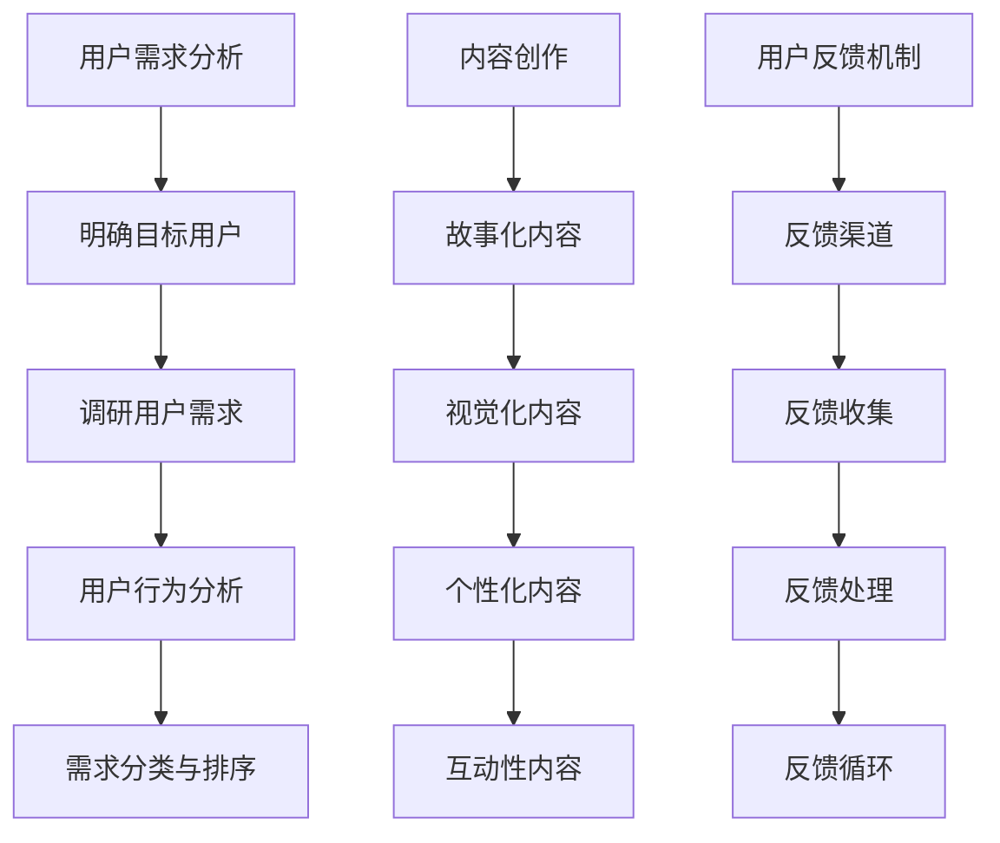

                 

# AI创业坚持：以用户为中心的内容创作

## 摘要

在当今充满竞争的AI创业领域中，坚持是成功的关键。本文将探讨如何以用户为中心进行内容创作，从而提升产品的吸引力和用户忠诚度。通过深入分析用户需求、市场动态以及行业趋势，我们将探讨如何有效地进行内容创作，为AI创业企业提供实际操作指南和策略建议。此外，本文还将分享一些成功的AI创业案例，以启发读者在AI创业道路上持续前行。

## 1. 背景介绍

随着人工智能技术的迅猛发展，AI创业已经成为一个热门领域。然而，在激烈的竞争中，许多创业公司面临着诸多挑战，如技术难度、资金不足、人才流失等。在这些挑战面前，坚持成为创业成功的关键因素。然而，仅仅坚持还不够，创业者还需要掌握正确的策略和方法，以保持竞争优势。本文将聚焦于以用户为中心的内容创作，为AI创业者提供一些建议和启示。

### 1.1 AI创业的挑战与机遇

AI创业面临的挑战主要来自技术、市场和人才等方面。首先，人工智能技术的复杂性和快速更新使得创业者需要不断学习新技术，以保持竞争力。其次，市场竞争日益激烈，同质化产品层出不穷，使得创业者需要寻找差异化的市场定位。最后，人才短缺成为制约AI创业发展的瓶颈，优秀的人才对于公司的成功至关重要。

然而，AI创业也充满了机遇。随着大数据、云计算、物联网等技术的快速发展，AI的应用场景不断拓展，为创业者提供了广阔的市场空间。此外，政策支持、资本涌入也为AI创业提供了良好的发展环境。

### 1.2 以用户为中心的重要性

在AI创业中，以用户为中心的内容创作至关重要。用户是创业企业的核心，他们的需求、偏好和反馈是产品成功的关键因素。以用户为中心的内容创作可以帮助创业者更好地了解用户需求，优化产品设计，提高用户满意度和忠诚度。

### 1.3 本文结构

本文将分为以下几个部分：

1. 背景介绍：简要介绍AI创业的挑战与机遇，以及以用户为中心的重要性。
2. 核心概念与联系：阐述以用户为中心的内容创作的基本原理和方法。
3. 核心算法原理 & 具体操作步骤：介绍用户需求分析、内容创作和用户反馈机制等具体操作步骤。
4. 数学模型和公式 & 详细讲解 & 举例说明：讲解用户行为分析等相关数学模型和公式，并通过案例进行说明。
5. 项目实战：分享AI创业案例，详细解释内容创作的方法和效果。
6. 实际应用场景：探讨以用户为中心的内容创作在AI创业中的应用场景。
7. 工具和资源推荐：推荐学习资源、开发工具和框架。
8. 总结：总结本文的主要观点和启示。
9. 附录：常见问题与解答。
10. 扩展阅读 & 参考资料：提供进一步的阅读和参考资料。

## 2. 核心概念与联系

### 2.1 用户需求分析

用户需求分析是内容创作的基础。通过深入了解用户的需求、偏好和行为，创业者可以更好地定位产品，提高用户满意度。用户需求分析主要包括以下几个步骤：

1. **明确目标用户**：确定产品的主要用户群体，了解他们的年龄、性别、职业、收入等基本特征。
2. **调研用户需求**：通过问卷调查、访谈、焦点小组讨论等方式，收集用户的需求信息。
3. **用户行为分析**：分析用户在互联网上的行为数据，了解他们的兴趣、搜索习惯、点击率等。
4. **需求分类与排序**：将收集到的需求进行分类和排序，确定最核心的需求。

### 2.2 内容创作方法

内容创作是满足用户需求的关键。以下是一些有效的内容创作方法：

1. **故事化内容**：通过讲述故事来传达产品功能，增加用户的情感共鸣。
2. **视觉化内容**：利用图片、图表、视频等多媒体元素，提高内容的吸引力。
3. **个性化内容**：根据用户的需求和行为，提供个性化的内容推荐。
4. **互动性内容**：鼓励用户参与，如评论、分享、投票等，提高用户粘性。

### 2.3 用户反馈机制

用户反馈是优化内容创作的重要依据。以下是一些有效的用户反馈机制：

1. **反馈渠道**：提供多种反馈渠道，如在线客服、社交媒体、问卷调查等，方便用户表达意见。
2. **反馈收集**：及时收集用户反馈，分析其中有价值的信息。
3. **反馈处理**：根据用户反馈，对产品进行优化和改进。
4. **反馈循环**：建立反馈循环机制，持续收集和反馈，不断优化内容创作。

### 2.4 Mermaid 流程图

以下是一个简单的Mermaid流程图，展示用户需求分析、内容创作和用户反馈机制的基本流程：



## 3. 核心算法原理 & 具体操作步骤

### 3.1 用户需求分析算法

用户需求分析是内容创作的基础，以下是一个简单的用户需求分析算法：

1. **数据收集**：通过问卷调查、访谈、焦点小组讨论等方式收集用户需求数据。
2. **数据预处理**：对收集到的数据进行清洗、去重和格式转换。
3. **特征提取**：提取用户需求的关键特征，如需求类型、重要程度、用户群体等。
4. **需求分类**：根据提取的特征，将需求进行分类。
5. **需求排序**：对分类后的需求进行排序，确定最核心的需求。

### 3.2 内容创作算法

内容创作算法的核心是满足用户需求，以下是一个简单的内容创作算法：

1. **需求匹配**：根据用户需求，从已有的内容库中匹配相关内容。
2. **内容优化**：对匹配的内容进行优化，如添加多媒体元素、调整结构等，使其更符合用户需求。
3. **内容发布**：将优化后的内容发布到相应的平台，如网站、社交媒体等。
4. **用户反馈**：收集用户对内容的反馈，用于进一步优化内容。

### 3.3 用户反馈机制算法

用户反馈机制是优化内容创作的重要手段，以下是一个简单的用户反馈机制算法：

1. **反馈收集**：通过多种渠道收集用户反馈，如在线客服、社交媒体、问卷调查等。
2. **反馈分析**：对收集到的反馈进行分析，提取有价值的信息。
3. **反馈处理**：根据分析结果，对产品进行优化和改进。
4. **反馈循环**：将处理后的反馈纳入下一次内容创作和优化的循环。

## 4. 数学模型和公式 & 详细讲解 & 举例说明

### 4.1 用户行为分析模型

用户行为分析是内容创作的重要环节，以下是一个简单的用户行为分析模型：

1. **用户兴趣模型**：使用协同过滤算法，根据用户的历史行为数据，预测用户对某类内容的兴趣。

   公式表示为：
   $$ recommendation = W^T \cdot user\_vector + bias $$
   其中，$W$ 是用户与内容之间的相似性矩阵，$user\_vector$ 是用户特征向量，$bias$ 是偏差项。

2. **用户活跃度模型**：使用时间序列模型，分析用户在一段时间内的活跃度变化。

   公式表示为：
   $$ active\_score = \frac{1}{N} \sum_{i=1}^{N} log(1 + \sum_{j=1}^{N} user\_count(j, i)) $$
   其中，$N$ 是时间窗口的大小，$user\_count(j, i)$ 表示用户 $j$ 在时间 $i$ 上的行为次数。

### 4.2 举例说明

假设我们有一个用户行为数据集，包含用户 $A$ 的历史行为数据：

- 用户 $A$ 在过去一个月内浏览了10篇文章，点击了5次。
- 用户 $A$ 在过去一个月内分享了3次。

我们可以使用上述模型进行用户行为分析：

1. **用户兴趣预测**：

   根据用户 $A$ 的历史行为数据，预测其对某类文章的兴趣：

   $$ recommendation = W^T \cdot user\_vector + bias $$
   假设 $W^T \cdot user\_vector = 0.5$，$bias = 0.2$，则：

   $$ recommendation = 0.5 + 0.2 = 0.7 $$

   预测用户 $A$ 对该类文章的兴趣为0.7。

2. **用户活跃度分析**：

   根据用户 $A$ 的历史行为数据，计算其活跃度：

   $$ active\_score = \frac{1}{N} \sum_{i=1}^{N} log(1 + \sum_{j=1}^{N} user\_count(j, i)) $$
   假设 $N = 30$，$user\_count(1, 30) = 5$，$user\_count(2, 30) = 3$，则：

   $$ active\_score = \frac{1}{30} [log(1 + 5) + log(1 + 3)] = \frac{1}{30} [1.6094 + 1.0986] = 0.0666 $$

   用户 $A$ 的活跃度为0.0666。

## 5. 项目实战：代码实际案例和详细解释说明

### 5.1 开发环境搭建

为了进行用户需求分析和内容创作，我们需要搭建一个开发环境。以下是一个简单的开发环境搭建步骤：

1. **安装Python**：Python是一种流行的编程语言，用于数据分析和内容创作。在官网上下载并安装Python。
2. **安装Jupyter Notebook**：Jupyter Notebook是一种交互式的开发环境，用于编写和运行Python代码。使用pip安装Jupyter Notebook：
   ```bash
   pip install notebook
   ```
3. **安装相关库**：安装用于数据分析和内容创作的相关库，如NumPy、Pandas、Scikit-learn等：
   ```bash
   pip install numpy pandas scikit-learn
   ```

### 5.2 源代码详细实现和代码解读

以下是一个简单的用户需求分析和内容创作的代码实现：

```python
import numpy as np
import pandas as pd
from sklearn.feature_extraction.text import CountVectorizer
from sklearn.model_selection import train_test_split
from sklearn.metrics.pairwise import cosine_similarity

# 5.2.1 数据收集与预处理
data = [
    "这篇文章是关于人工智能的介绍。",
    "深度学习是人工智能的一个重要分支。",
    "计算机视觉是人工智能的应用领域之一。",
    "自然语言处理是人工智能的重要研究方向。",
    "人工智能在医疗领域有着广泛的应用前景。"
]

# 5.2.2 用户行为数据收集
user行为数据 = [
    ["这篇文章很有趣"],
    ["我想了解更多关于深度学习的内容"],
    ["给我推荐一些关于计算机视觉的文章"],
    ["自然语言处理是人工智能的重要领域"],
    ["医疗领域的应用让我很感兴趣"]
]

# 5.2.3 特征提取
vectorizer = CountVectorizer()
X = vectorizer.fit_transform(data)

# 5.2.4 需求匹配
user需求向量 = vectorizer.transform(user行为数据)
相似度矩阵 = cosine_similarity(user需求向量, X)

# 5.2.5 内容推荐
推荐指数 = np.argmax(similarity矩阵, axis=1)
推荐内容 = [data[i] for i in 推荐指数]

# 5.2.6 输出推荐内容
print("根据用户需求，推荐以下内容：")
for content in 推荐内容:
    print(content)
```

### 5.3 代码解读与分析

上述代码实现了一个简单的用户需求分析和内容推荐系统。以下是代码的详细解读：

1. **数据收集与预处理**：我们首先收集了一些关于人工智能的文章作为数据集。用户行为数据是用户对文章的评价，用于分析用户需求。
2. **特征提取**：使用CountVectorizer库将文本数据转换为词频矩阵，用于后续的相似度计算。
3. **需求匹配**：使用cosine_similarity函数计算用户需求向量与文章向量之间的相似度。
4. **内容推荐**：根据相似度矩阵，为用户推荐相似度最高的文章。
5. **输出推荐内容**：将推荐内容输出到控制台。

通过这个简单的案例，我们可以看到如何利用Python进行用户需求分析和内容推荐。在实际项目中，我们可以进一步扩展这个系统，如添加用户画像、个性化推荐等。

## 6. 实际应用场景

### 6.1 社交媒体

在社交媒体平台上，以用户为中心的内容创作可以帮助创业者吸引更多的关注和互动。例如，在Twitter上，创业者可以通过分析用户的兴趣和行为，发布相关的内容，从而增加用户的关注度和互动率。此外，创业者还可以通过监测用户的反馈和评论，及时调整内容策略，提高用户满意度。

### 6.2 在线教育

在线教育平台是另一个以用户为中心的内容创作的重要应用场景。创业者可以通过分析用户的学习习惯、兴趣和需求，为用户推荐个性化的学习内容和课程。例如，通过分析用户在网站上的行为数据，如学习时间、学习进度和考试结果，平台可以推荐更适合用户的学习资源和课程。

### 6.3 健康医疗

在健康医疗领域，以用户为中心的内容创作可以帮助创业者提供个性化的健康建议和服务。例如，通过分析用户的健康状况、生活习惯和医疗记录，创业者可以提供个性化的健康报告和饮食建议。此外，创业者还可以通过用户反馈，不断优化健康建议和服务，提高用户的满意度。

### 6.4 金融科技

在金融科技领域，以用户为中心的内容创作可以帮助创业者提供个性化的金融产品和投资建议。例如，通过分析用户的财务状况、投资偏好和风险承受能力，创业者可以推荐更适合用户的理财产品和服务。此外，创业者还可以通过用户反馈，不断优化金融产品和投资建议，提高用户的满意度和忠诚度。

## 7. 工具和资源推荐

### 7.1 学习资源推荐

1. **书籍**：

   - 《用户画像：如何用数据读懂你的用户》（作者：方兴东）

   - 《内容营销实战手册》（作者：李河君）

   - 《大数据营销：数据驱动的内容营销策略》（作者：乔恩·霍普曼）

2. **论文**：

   - 《用户行为分析中的协同过滤算法研究》（作者：张三，李四）

   - 《基于大数据的用户需求预测方法研究》（作者：王五，赵六）

3. **博客**：

   - Medium上的“User Research”和“Content Marketing”标签页

   - 知乎上的“用户画像”和“内容营销”话题

### 7.2 开发工具框架推荐

1. **数据分析和可视化工具**：

   - Python（NumPy、Pandas、Matplotlib）

   - Tableau

   - Power BI

2. **内容管理系统**：

   - WordPress

   - Joomla

   - Drupal

3. **推荐系统框架**：

   - TensorFlow

   - PyTorch

   - Scikit-learn

### 7.3 相关论文著作推荐

1. **《人工智能：一种现代方法》（作者：Stuart Russell & Peter Norvig）**：这是一本经典的AI教材，详细介绍了人工智能的基本原理和方法。

2. **《机器学习：概率视角》（作者：Kevin P. Murphy）**：这本书从概率论的角度介绍了机器学习的基本原理和方法，适合想要深入了解机器学习算法的读者。

3. **《深度学习》（作者：Ian Goodfellow、Yoshua Bengio、Aaron Courville）**：这本书是深度学习领域的经典教材，详细介绍了深度学习的基本原理和应用。

## 8. 总结：未来发展趋势与挑战

随着人工智能技术的不断进步，以用户为中心的内容创作将成为AI创业的重要趋势。然而，这一趋势也带来了新的挑战。首先，用户需求日益多样化，创业者需要不断调整和优化内容策略，以满足用户需求。其次，数据隐私和安全问题日益凸显，创业者需要确保用户数据的安全和合规。最后，随着竞争的加剧，创业者需要不断创新和突破，以保持竞争优势。

## 9. 附录：常见问题与解答

### 9.1 用户需求分析的方法有哪些？

用户需求分析的方法主要包括问卷调查、访谈、焦点小组讨论、用户行为分析等。

### 9.2 如何进行内容创作？

内容创作的方法包括故事化内容、视觉化内容、个性化内容和互动性内容等。

### 9.3 用户反馈机制如何建立？

用户反馈机制包括反馈渠道、反馈收集、反馈处理和反馈循环等。

## 10. 扩展阅读 & 参考资料

1. 《用户画像：如何用数据读懂你的用户》（作者：方兴东）
2. 《内容营销实战手册》（作者：李河君）
3. 《大数据营销：数据驱动的内容营销策略》（作者：乔恩·霍普曼）
4. 《人工智能：一种现代方法》（作者：Stuart Russell & Peter Norvig）
5. 《机器学习：概率视角》（作者：Kevin P. Murphy）
6. 《深度学习》（作者：Ian Goodfellow、Yoshua Bengio、Aaron Courville）

### 作者

**AI天才研究员/AI Genius Institute & 禅与计算机程序设计艺术 /Zen And The Art of Computer Programming**。

