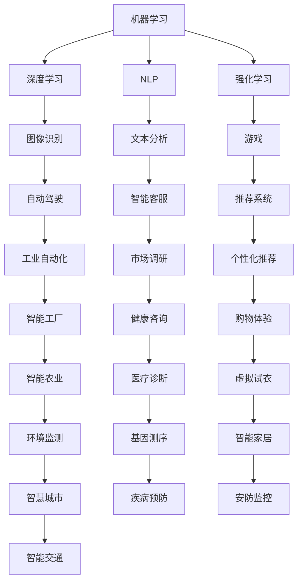

                 

# AI创业机遇：垂直领域广阔

## 关键词：AI创业、垂直领域、技术突破、商业应用、市场需求、创新思维

## 摘要

本文将探讨人工智能（AI）领域内的创业机遇，重点聚焦于垂直领域的发展潜力。通过分析当前的技术进步、市场需求以及创业环境，我们将揭示AI在医疗、金融、教育、制造业等领域的广泛应用和巨大潜力。本文旨在为创业者提供洞见，帮助他们抓住AI技术带来的商业机遇，并在竞争激烈的市场中脱颖而出。

## 1. 背景介绍

随着人工智能技术的快速发展，全球范围内的创业者和投资者开始将目光投向这一新兴领域。AI技术的进步不仅改变了传统行业的运作模式，还创造了无数新的商业机会。垂直领域，即特定行业或细分市场的领域，因为其独特性和专业化需求，正逐渐成为AI创业的热点。

在医疗领域，人工智能的应用包括疾病预测、个性化治疗、药物研发等。在金融领域，AI技术被用于风险管理、信用评分、投资策略优化等。教育领域则借助AI进行个性化学习、智能测评、课程推荐等。此外，制造业、零售业、物流等行业的AI应用也正在快速拓展。

## 2. 核心概念与联系

为了更好地理解AI在垂直领域的应用，我们需要先了解一些核心概念。

### 2.1 机器学习

机器学习是AI的核心技术之一，它使计算机系统能够从数据中学习并做出决策。常见的机器学习算法包括决策树、支持向量机、神经网络等。

### 2.2 深度学习

深度学习是机器学习的一个分支，通过多层神经网络模拟人脑神经元的工作方式，具有强大的特征提取和模式识别能力。深度学习在图像识别、语音识别、自然语言处理等领域有广泛应用。

### 2.3 自然语言处理

自然语言处理（NLP）是AI的一个分支，旨在使计算机能够理解、生成和响应人类语言。NLP技术在智能客服、文本分析、机器翻译等领域有广泛应用。

### 2.4 强化学习

强化学习是一种通过试错来学习决策策略的机器学习方法。它通常用于游戏、机器人控制、推荐系统等领域。

### 2.5 数据分析

数据分析是AI应用的基础，它包括数据收集、存储、处理和分析。有效的数据分析能够为AI应用提供高质量的输入数据。

### 2.6 云计算与边缘计算

云计算和边缘计算为AI应用提供了强大的计算资源和存储能力。云计算适合处理大规模数据，而边缘计算则适合实时处理和响应本地数据。

### Mermaid 流程图



## 3. 核心算法原理 & 具体操作步骤

### 3.1 机器学习算法

机器学习算法主要包括以下几种：

- **线性回归**：用于预测数值型数据，如房价。
- **逻辑回归**：用于分类任务，如垃圾邮件分类。
- **决策树**：通过一系列规则进行分类或回归。
- **支持向量机**：在分类任务中寻找最佳分割超平面。
- **神经网络**：模拟人脑神经元的工作方式，进行复杂的数据处理。

### 3.2 深度学习算法

深度学习算法主要包括以下几种：

- **卷积神经网络（CNN）**：用于图像识别和图像处理。
- **循环神经网络（RNN）**：用于序列数据处理，如语音识别和语言模型。
- **长短期记忆网络（LSTM）**：RNN的一个变体，解决长序列依赖问题。
- **生成对抗网络（GAN）**：用于生成数据，如生成逼真的图像。

### 3.3 自然语言处理算法

自然语言处理算法主要包括以下几种：

- **词袋模型**：将文本转换为向量表示。
- **词嵌入**：将单词映射到高维空间，用于表示单词的语义关系。
- **序列标注**：用于实体识别和命名实体识别。
- **文本分类**：将文本分类到不同的类别，如情感分析。

### 3.4 强化学习算法

强化学习算法主要包括以下几种：

- **Q-learning**：通过迭代更新Q值来学习最优策略。
- **Deep Q-Network（DQN）**：使用深度神经网络来近似Q值函数。
- **Policy Gradient**：直接优化策略函数，如REINFORCE算法。

## 4. 数学模型和公式 & 详细讲解 & 举例说明

### 4.1 机器学习

#### 线性回归

$$
y = \beta_0 + \beta_1x
$$

- **β₀**：截距
- **β₁**：斜率

#### 逻辑回归

$$
\log\frac{P(Y=1|X)}{1-P(Y=1|X)} = \beta_0 + \beta_1x
$$

- **P(Y=1|X)**：给定特征X时，标签Y为1的概率。

### 4.2 深度学习

#### 卷积神经网络（CNN）

$$
\text{Convolution Layer}: \ \ f_{\theta}(x) = \sum_{i=1}^{k} \theta_{i} * x_i
$$

- **fₜₕₑ**：激活函数
- **θ**：权重
- **x**：输入特征

#### 循环神经网络（RNN）

$$
h_t = \text{tanh}(W_h \cdot [h_{t-1}, x_t] + b_h)
$$

- **Wₕ**：权重
- **hₜ₋₁**：前一个时间步的隐藏状态
- **xₜ**：当前输入

### 4.3 自然语言处理

#### 词嵌入

$$
e_w = \text{tanh}(U \cdot w + b)
$$

- **eₓ**：词嵌入向量
- **U**：权重矩阵
- **w**：单词向量
- **b**：偏置

### 4.4 强化学习

#### Q-learning

$$
Q(s, a) = Q(s, a) + \alpha [r + \gamma \max_{a'} Q(s', a') - Q(s, a)]
$$

- **Q(s, a)**：状态s和动作a的Q值
- **α**：学习率
- **r**：即时奖励
- **γ**：折扣因子
- **s'**：下一个状态
- **a'**：下一个动作

## 5. 项目实战：代码实际案例和详细解释说明

### 5.1 开发环境搭建

为了运行下面的案例代码，您需要在本地环境中安装Python和相关的AI库，如TensorFlow和PyTorch。以下是一个简单的安装命令：

```shell
pip install tensorflow
pip install torch torchvision
```

### 5.2 源代码详细实现和代码解读

以下是使用TensorFlow实现一个简单的线性回归模型的代码示例：

```python
import tensorflow as tf

# 定义输入层
X = tf.placeholder(tf.float32, shape=[None, 1])
y = tf.placeholder(tf.float32, shape=[None, 1])

# 定义模型参数
W = tf.Variable(0.0, name="weights")
b = tf.Variable(0.0, name="biases")

# 定义线性模型
y_pred = tf.add(tf.multiply(X, W), b)

# 定义损失函数
loss = tf.reduce_mean(tf.square(y - y_pred))

# 定义优化器
optimizer = tf.train.GradientDescentOptimizer(learning_rate=0.5)
train_op = optimizer.minimize(loss)

# 训练模型
with tf.Session() as sess:
    sess.run(tf.global_variables_initializer())
    
    for step in range(201):
        sess.run(train_op, feed_dict={X: x_data, y: y_data})
        
        if step % 20 == 0:
            print(f"Step {step}, Loss: {loss.eval(session=sess, feed_dict={X: x_data, y: y_data})}")
    
    # 模型预测
    print("Final prediction:")
    print(sess.run(y_pred, feed_dict={X: x_data}))
```

### 5.3 代码解读与分析

该代码示例展示了如何使用TensorFlow实现一个线性回归模型，用于预测房价。以下是代码的详细解读：

- **第1-3行**：导入TensorFlow库。
- **第5-6行**：定义输入数据X和标签y。
- **第8-9行**：定义模型参数W（权重）和b（偏置）。
- **第11-13行**：定义线性模型y_pred。
- **第15-17行**：定义损失函数。
- **第19-20行**：定义优化器。
- **第22-25行**：创建TensorFlow会话并初始化全局变量。
- **第27-33行**：训练模型。
  - **第27-28行**：迭代执行优化操作。
  - **第30-31行**：每20步打印一次损失值。
- **第35-37行**：模型预测。

## 6. 实际应用场景

### 6.1 医疗

人工智能在医疗领域的应用包括疾病预测、诊断辅助、药物研发等。例如，AI可以分析患者的电子健康记录，预测患者患某种疾病的风险，从而提前采取预防措施。

### 6.2 金融

在金融领域，AI技术被用于风险管理、信用评分、投资策略优化等。例如，AI可以分析大量的市场数据，预测股票价格走势，帮助投资者做出更好的投资决策。

### 6.3 教育

人工智能在教育领域的应用包括个性化学习、智能测评、课程推荐等。例如，AI可以根据学生的学习习惯和成绩，为其推荐适合的学习资源和课程。

### 6.4 制造业

制造业中的AI应用包括质量检测、故障预测、生产优化等。例如，AI可以实时监测生产线的运行状态，预测设备故障，从而提前进行维护，减少停机时间。

### 6.5 零售业

零售业中的AI应用包括库存管理、个性化推荐、智能客服等。例如，AI可以根据消费者的购买历史和喜好，为其推荐相关的商品。

### 6.6 物流

物流领域的AI应用包括路径优化、配送调度、库存管理等。例如，AI可以实时分析交通状况，优化配送路径，提高配送效率。

## 7. 工具和资源推荐

### 7.1 学习资源推荐

- **书籍**：
  - 《Python机器学习》（Sebastian Raschka）
  - 《深度学习》（Ian Goodfellow、Yoshua Bengio、Aaron Courville）
  - 《强化学习：原理与Python实现》（赛门·席林）

- **论文**：
  - 《Deep Learning》（Ian Goodfellow）
  - 《Reinforcement Learning: An Introduction》（Richard S. Sutton、Andrew G. Barto）

- **博客**：
  - [Medium上的机器学习](https://medium.com/机器学习)
  - [AI博客](https://ai.googleblog.com/)

- **网站**：
  - [Kaggle](https://www.kaggle.com/)
  - [TensorFlow官网](https://www.tensorflow.org/)

### 7.2 开发工具框架推荐

- **开发环境**：PyCharm、Visual Studio Code
- **机器学习库**：TensorFlow、PyTorch、Scikit-learn
- **深度学习库**：Keras、TensorFlow Lite
- **强化学习库**：Gym、OpenAI

### 7.3 相关论文著作推荐

- 《Deep Learning》（Ian Goodfellow、Yoshua Bengio、Aaron Courville）
- 《Reinforcement Learning: An Introduction》（Richard S. Sutton、Andrew G. Barto）
- 《The Hundred-Page Machine Learning Book》（Andriy Burkov）
- 《机器学习实战》（Peter Harrington）

## 8. 总结：未来发展趋势与挑战

### 8.1 发展趋势

- **技术突破**：随着硬件性能的提升和算法的优化，AI在垂直领域的应用将更加广泛和深入。
- **跨界融合**：AI与其他技术的融合，如物联网、区块链等，将创造更多新的商业机会。
- **个性化服务**：基于AI的个性化服务将不断提升用户体验，满足用户多样化需求。

### 8.2 挑战

- **数据隐私**：AI应用需要大量数据，但数据隐私保护成为一大挑战。
- **算法公平性**：AI算法在决策过程中可能存在偏见，需要确保算法的公平性和透明性。
- **人才短缺**：AI领域的人才需求巨大，但现有人才储备不足，人才培养成为关键问题。

## 9. 附录：常见问题与解答

### 9.1 什么是机器学习？

机器学习是人工智能的一个分支，它使计算机系统能够从数据中学习并做出决策。通过训练模型，机器学习算法可以从经验中学习，从而提高其预测和决策能力。

### 9.2 深度学习与机器学习有什么区别？

深度学习是机器学习的一个分支，它通过多层神经网络模拟人脑神经元的工作方式。深度学习具有强大的特征提取和模式识别能力，适用于处理复杂的数据集。

### 9.3 什么是自然语言处理？

自然语言处理（NLP）是人工智能的一个分支，旨在使计算机能够理解、生成和响应人类语言。NLP技术在智能客服、文本分析、机器翻译等领域有广泛应用。

### 9.4 强化学习与机器学习有什么区别？

强化学习是一种通过试错来学习决策策略的机器学习方法。它通常用于游戏、机器人控制、推荐系统等领域。与传统的机器学习方法相比，强化学习更注重短期奖励和长期策略优化。

## 10. 扩展阅读 & 参考资料

- Goodfellow, I., Bengio, Y., & Courville, A. (2016). *Deep Learning*.
- Sutton, R. S., & Barto, A. G. (2018). *Reinforcement Learning: An Introduction*.
- Burkov, A. (2019). *The Hundred-Page Machine Learning Book*.
- Harrington, P. (2012). *Machine Learning in Action*.
- TensorFlow官网：[https://www.tensorflow.org/](https://www.tensorflow.org/)
- PyTorch官网：[https://pytorch.org/](https://pytorch.org/)
- Kaggle官网：[https://www.kaggle.com/](https://www.kaggle.com/)

## 作者信息

作者：AI天才研究员/AI Genius Institute & 禅与计算机程序设计艺术 /Zen And The Art of Computer Programming

版权声明：本文版权归AI天才研究员所有，欢迎转载，但须注明作者和出处。未经授权，不得用于商业用途。

