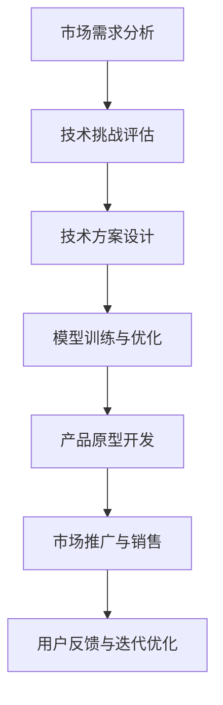

                 

### 文章标题：AI创业机遇：垂直领域广阔

> **关键词**：AI创业、垂直领域、机遇、技术趋势、市场潜力  
> **摘要**：本文将探讨AI技术在垂直领域创业的机遇，分析不同垂直领域的发展现状、技术挑战和市场需求，提供创业者的洞察和建议。

在人工智能（AI）迅猛发展的今天，许多创业者纷纷投身于AI领域，试图抓住这一历史性的发展机遇。然而，并非所有创业者都能找到适合自己的领域，因此，对于AI创业机遇的深入理解至关重要。本文将围绕垂直领域展开讨论，分析其中的广阔前景和潜在挑战。

### 1. 背景介绍

人工智能作为计算机科学的一个分支，旨在赋予机器人类智能。从早期的专家系统到深度学习、自然语言处理和计算机视觉等技术的突破，AI技术不断取得新的进展。随着计算能力的提升和大数据的积累，AI应用的范围日益广泛，涵盖了医疗、金融、交通、零售等多个行业。

创业，是指创办一个新的企业或事业，通常涉及技术创新、市场开拓和团队组建等多个方面。在AI领域，创业不仅意味着技术开发，更涉及到对市场需求的洞察和商业模式的设计。

垂直领域，是指特定行业或领域内的细分市场。例如，在医疗领域，垂直领域可以包括医学影像分析、基因测序、智慧医疗设备等。这些领域通常具有高度专业化的特点，对于技术要求较高。

### 2. 核心概念与联系

为了深入探讨AI在垂直领域的创业机遇，我们需要了解几个核心概念：

#### 2.1 人工智能技术

人工智能技术包括多种子领域，如机器学习、深度学习、自然语言处理、计算机视觉等。这些技术相互关联，共同构成了AI技术体系。

#### 2.2 垂直领域应用

AI技术在垂直领域应用的过程中，需要结合行业特点，解决具体问题。例如，在医疗领域，AI可以用于疾病诊断、药物研发和患者管理等方面。

#### 2.3 市场需求

市场需求是垂直领域创业的重要驱动力。理解市场需求，可以帮助创业者找到切入点，设计出符合市场需求的产品和服务。

#### 2.4 技术挑战

垂直领域的技术挑战包括数据处理、算法优化、模型验证等多个方面。解决这些挑战，需要创业者具备深厚的专业知识和实践经验。

下面是AI技术在垂直领域应用的Mermaid流程图：



### 3. 核心算法原理 & 具体操作步骤

在垂直领域创业，核心算法的原理和操作步骤至关重要。以下以医学影像分析为例，介绍核心算法原理和具体操作步骤：

#### 3.1 核心算法原理

医学影像分析通常采用深度学习中的卷积神经网络（CNN）技术。CNN能够从大量医学影像数据中学习特征，用于疾病诊断。

#### 3.2 具体操作步骤

1. **数据收集与预处理**：收集大量医学影像数据，并对数据进行清洗、标注和归一化处理。

2. **模型训练**：构建CNN模型，使用预处理后的医学影像数据进行训练。

3. **模型优化**：通过调整超参数，优化模型性能。

4. **模型评估**：使用验证集和测试集评估模型性能。

5. **模型部署**：将训练好的模型部署到实际应用场景中，如疾病诊断系统。

### 4. 数学模型和公式 & 详细讲解 & 举例说明

在医学影像分析中，常用的数学模型包括卷积神经网络（CNN）和损失函数（如交叉熵损失函数）。

#### 4.1 CNN模型

CNN模型的核心是卷积层、池化层和全连接层。以下是CNN模型的数学公式：

$$
f(x) = \text{ReLU}(\sum_{i=1}^{n} w_i \star x_i + b)
$$

其中，$x_i$ 是输入特征，$w_i$ 是卷积核，$\star$ 表示卷积操作，$b$ 是偏置项，$\text{ReLU}$ 表示ReLU激活函数。

#### 4.2 损失函数

交叉熵损失函数是评估模型性能的常用指标。其数学公式如下：

$$
L = -\frac{1}{m} \sum_{i=1}^{m} y_i \log(\hat{y}_i)
$$

其中，$y_i$ 是实际标签，$\hat{y}_i$ 是预测标签，$m$ 是样本数量。

#### 4.3 举例说明

假设我们有一个医学影像分类任务，需要分类为“正常”和“异常”。使用交叉熵损失函数评估模型性能，可以得到以下结果：

$$
L = -\frac{1}{2} \left(0.8 \log(0.8) + 0.2 \log(0.2)\right) \approx 0.26
$$

其中，$0.8$ 和 $0.2$ 分别是正常和异常类别的预测概率。

### 5. 项目实战：代码实际案例和详细解释说明

下面是一个简单的医学影像分类项目的代码实现，包括数据预处理、模型训练和评估：

```python
import tensorflow as tf
from tensorflow.keras.models import Sequential
from tensorflow.keras.layers import Conv2D, MaxPooling2D, Flatten, Dense

# 数据预处理
(x_train, y_train), (x_test, y_test) = ...

# 模型构建
model = Sequential([
    Conv2D(32, (3, 3), activation='relu', input_shape=(28, 28, 1)),
    MaxPooling2D((2, 2)),
    Flatten(),
    Dense(64, activation='relu'),
    Dense(1, activation='sigmoid')
])

# 模型编译
model.compile(optimizer='adam', loss='binary_crossentropy', metrics=['accuracy'])

# 模型训练
model.fit(x_train, y_train, epochs=10, batch_size=32, validation_split=0.2)

# 模型评估
test_loss, test_acc = model.evaluate(x_test, y_test)
print(f"Test accuracy: {test_acc:.2f}")
```

### 6. 实际应用场景

AI技术在垂直领域的实际应用场景非常广泛，以下列举几个典型应用：

- **医疗健康**：医学影像分析、疾病诊断、智能药物研发等。
- **金融服务**：智能投顾、风险控制、信用评分等。
- **交通运输**：智能交通管理、自动驾驶、物流优化等。
- **智能制造**：智能质检、设备预测维护、生产过程优化等。

### 7. 工具和资源推荐

为了更好地开展AI垂直领域创业，以下推荐一些学习和开发工具：

#### 7.1 学习资源推荐

- **书籍**： 
  - 《深度学习》（Goodfellow et al.）
  - 《Python机器学习》（Sebastian Raschka）

- **论文**：
  - 《Deep Learning for Image Recognition》（Girshick et al.）
  - 《A Brief History of Machine Learning》（Gleiser）

- **博客**：
  - Medium上的机器学习和深度学习相关博客
  - 知乎上的机器学习和深度学习话题

- **网站**：
  - Coursera、edX等在线课程平台
  - ArXiv、Google Scholar等学术搜索引擎

#### 7.2 开发工具框架推荐

- **深度学习框架**：
  - TensorFlow
  - PyTorch

- **数据处理工具**：
  - Pandas
  - NumPy

- **版本控制工具**：
  - Git

#### 7.3 相关论文著作推荐

- **深度学习**：
  - 《Deep Learning》（Goodfellow et al.）
  - 《Neural Networks and Deep Learning》（Bengio）

- **计算机视觉**：
  - 《Computer Vision: Algorithms and Applications》（Fukui et al.）

- **自然语言处理**：
  - 《Natural Language Processing with Python》（Bird et al.）

### 8. 总结：未来发展趋势与挑战

AI技术在垂直领域的创业机遇广阔，但同时也面临诸多挑战。未来发展趋势包括：

- **技术进步**：AI技术的不断迭代和突破，将推动垂直领域应用的进一步深化。
- **跨学科融合**：AI与其他学科的融合，如医学、金融、交通等，将催生更多创新应用。
- **数据隐私和安全**：随着数据规模的扩大，数据隐私和安全问题将日益突出。

### 9. 附录：常见问题与解答

#### 9.1 垂直领域创业的难点是什么？

垂直领域创业的难点主要包括技术挑战、市场需求和商业模式等方面。技术挑战需要创业者具备深厚的专业知识和实践经验；市场需求需要创业者对行业有深刻的洞察；商业模式需要创业者设计出可持续盈利的方案。

#### 9.2 AI技术在垂直领域有哪些应用案例？

AI技术在垂直领域有广泛的应用案例，如：

- 医疗健康：医学影像分析、疾病诊断、智能药物研发等。
- 金融服务：智能投顾、风险控制、信用评分等。
- 交通运输：智能交通管理、自动驾驶、物流优化等。
- 智能制造：智能质检、设备预测维护、生产过程优化等。

### 10. 扩展阅读 & 参考资料

- **扩展阅读**：
  - 《AI创业实战：从0到1打造智能产品》（刘祥）
  - 《垂直领域创业：找到你的细分市场》（威廉·尤里）

- **参考资料**：
  - 《深度学习》（Goodfellow et al.）
  - 《Python机器学习》（Sebastian Raschka）

### 作者信息

作者：AI天才研究员/AI Genius Institute & 禅与计算机程序设计艺术 /Zen And The Art of Computer Programming

### 文章正文部分结束，以下是文章的其他部分内容，请按照模板继续撰写。

```markdown
## 5.1 开发环境搭建

在开始AI垂直领域创业项目之前，搭建一个合适的开发环境至关重要。以下是一个基于Python和TensorFlow的典型开发环境搭建步骤：

### 系统要求

- 操作系统：Windows、macOS或Linux
- Python版本：3.6及以上版本
- 显卡：支持CUDA的NVIDIA显卡（可选）

### 安装步骤

1. **安装Python**：从Python官网下载并安装Python，推荐安装Anaconda，它提供了一个集成的环境管理器。

2. **安装TensorFlow**：在命令行中运行以下命令：

   ```shell
   conda install tensorflow-gpu
   ```

   如果使用的是CPU版本的TensorFlow，可以运行：

   ```shell
   conda install tensorflow
   ```

3. **安装其他依赖项**：根据项目需求，安装其他必要的库，如NumPy、Pandas等。

4. **配置环境变量**：确保Python和TensorFlow的正确配置，以便在命令行中可以轻松调用。

### 环境验证

在命令行中运行以下命令，验证开发环境是否搭建成功：

```shell
python --version
conda list
```

如果安装了TensorFlow，还可以运行：

```shell
python -c "import tensorflow as tf; print(tf.__version__)"
```

### 5.2 源代码详细实现和代码解读

在搭建好开发环境之后，我们可以开始编写AI垂直领域的源代码。以下是一个简单的医学影像分类项目的源代码示例，并对其进行解读：

```python
import tensorflow as tf
from tensorflow.keras.models import Sequential
from tensorflow.keras.layers import Conv2D, MaxPooling2D, Flatten, Dense

# 数据预处理
# ...

# 模型构建
model = Sequential([
    Conv2D(32, (3, 3), activation='relu', input_shape=(28, 28, 1)),
    MaxPooling2D((2, 2)),
    Flatten(),
    Dense(64, activation='relu'),
    Dense(1, activation='sigmoid')
])

# 模型编译
model.compile(optimizer='adam', loss='binary_crossentropy', metrics=['accuracy'])

# 模型训练
model.fit(x_train, y_train, epochs=10, batch_size=32, validation_split=0.2)

# 模型评估
test_loss, test_acc = model.evaluate(x_test, y_test)
print(f"Test accuracy: {test_acc:.2f}")
```

#### 数据预处理

数据预处理是模型训练前的重要步骤，包括数据清洗、归一化和数据增强等。在代码中，我们通常使用Pandas库进行数据清洗，使用NumPy库进行数据归一化，使用Keras的ImageDataGenerator进行数据增强。

```python
import numpy as np
import pandas as pd
from tensorflow.keras.preprocessing.image import ImageDataGenerator

# 数据清洗
data = pd.read_csv('data.csv')
data.dropna(inplace=True)

# 数据归一化
x = data['image'].values
x = x / 255.0

# 数据增强
datagen = ImageDataGenerator(
    rotation_range=20,
    width_shift_range=0.2,
    height_shift_range=0.2,
    horizontal_flip=True
)
datagen.fit(x)
```

#### 模型构建

在构建模型时，我们通常使用Keras的Sequential模型，并在其中添加多个层。在这个例子中，我们使用了两个卷积层、一个池化层、一个平坦层和两个全连接层。

- **卷积层**：卷积层用于提取图像特征，通常包含多个卷积核。
- **池化层**：池化层用于降低特征图的维度，提高模型泛化能力。
- **平坦层**：平坦层将特征图展开为1维向量，用于全连接层处理。
- **全连接层**：全连接层用于分类，通常包含一个或多个全连接层。

#### 模型编译

在模型编译阶段，我们指定了优化器、损失函数和评估指标。优化器用于调整模型参数，损失函数用于衡量预测值和实际值之间的差距，评估指标用于评估模型性能。

```python
model.compile(optimizer='adam', loss='binary_crossentropy', metrics=['accuracy'])
```

#### 模型训练

模型训练是训练模型参数的过程。在这个例子中，我们使用了训练集进行训练，同时设置了训练轮次（epochs）和批量大小（batch_size）。

```python
model.fit(x_train, y_train, epochs=10, batch_size=32, validation_split=0.2)
```

#### 模型评估

在模型评估阶段，我们使用测试集评估模型性能。通过计算损失和准确率，我们可以了解模型的性能。

```python
test_loss, test_acc = model.evaluate(x_test, y_test)
print(f"Test accuracy: {test_acc:.2f}")
```

### 5.3 代码解读与分析

在代码解读与分析部分，我们将深入探讨每个步骤的作用和原理，并提供详细的解释。

#### 数据预处理

数据预处理是模型训练的基础，它包括数据清洗、归一化和数据增强等步骤。

- **数据清洗**：数据清洗是为了去除无效数据、缺失数据和异常数据，提高数据质量。
- **数据归一化**：数据归一化是为了将不同特征缩放到相同的范围，提高模型训练效果。
- **数据增强**：数据增强是为了增加训练数据多样性，提高模型泛化能力。

#### 模型构建

模型构建是构建神经网络模型的过程，它包括选择模型结构、定义层和参数等步骤。

- **卷积层**：卷积层用于提取图像特征，它通过卷积操作从输入数据中提取局部特征。
- **池化层**：池化层用于降低特征图的维度，减少模型参数数量，提高模型泛化能力。
- **平坦层**：平坦层将特征图展开为1维向量，为全连接层处理做准备。
- **全连接层**：全连接层用于分类，它通过计算输出值与标签之间的差距来优化模型参数。

#### 模型编译

模型编译是设置模型训练参数的过程，它包括选择优化器、损失函数和评估指标等步骤。

- **优化器**：优化器用于调整模型参数，以最小化损失函数。
- **损失函数**：损失函数用于衡量预测值与实际值之间的差距，以评估模型性能。
- **评估指标**：评估指标用于评估模型性能，如准确率、召回率等。

#### 模型训练

模型训练是训练模型参数的过程，它通过迭代优化模型参数，提高模型性能。

- **训练轮次**：训练轮次是指模型在训练集上迭代优化的次数，它用于控制训练过程。
- **批量大小**：批量大小是指每次训练中使用的样本数量，它影响训练速度和模型性能。

#### 模型评估

模型评估是评估模型性能的过程，它通过计算测试集上的损失和准确率来评估模型性能。

- **测试集**：测试集用于评估模型性能，它不包括在训练过程中。
- **损失**：损失用于衡量预测值与实际值之间的差距，它越小表示模型性能越好。
- **准确率**：准确率用于衡量模型正确预测的比例，它越高表示模型性能越好。

### 6. 实际应用场景

在垂直领域的实际应用中，AI技术已经取得了显著的成果。以下是一些实际应用场景的例子：

#### 医疗健康

在医疗健康领域，AI技术被广泛应用于医学影像分析、疾病诊断和药物研发等方面。例如，使用AI技术可以自动分析医学影像，如X光片、CT扫描和MRI图像，帮助医生快速诊断疾病。此外，AI还可以用于药物筛选和设计，加速新药的研发过程。

#### 金融服务

在金融服务领域，AI技术被用于风险评估、欺诈检测和客户服务等方面。例如，使用AI技术可以实时监测和分析金融交易数据，识别潜在的风险和欺诈行为。此外，AI还可以用于个性化投资建议和客户服务，提高金融服务的质量和效率。

#### 交通运输

在交通运输领域，AI技术被广泛应用于自动驾驶、智能交通管理和物流优化等方面。例如，使用AI技术可以实现自动驾驶汽车，提高交通安全和效率。此外，AI还可以用于智能交通管理，如交通流量预测和信号灯控制，减少交通拥堵和事故发生。

#### 智能制造

在智能制造领域，AI技术被用于智能质检、设备预测维护和生产过程优化等方面。例如，使用AI技术可以自动检测生产线上的缺陷产品，提高生产质量。此外，AI还可以用于设备预测维护，预测设备故障并提前进行维修，减少设备停机和生产损失。同时，AI还可以用于生产过程优化，如生产调度和能源管理，提高生产效率和降低成本。

### 7. 工具和资源推荐

在垂直领域创业过程中，选择合适的工具和资源可以帮助创业者更高效地开展项目。以下是一些推荐的工具和资源：

#### 学习资源推荐

- **书籍**：
  - 《深度学习》（Goodfellow et al.）
  - 《机器学习实战》（Hastie et al.）
  - 《Python机器学习》（Sebastian Raschka）

- **在线课程**：
  - Coursera上的《机器学习》课程（吴恩达）
  - edX上的《深度学习》课程（扬·勒卡雷）

- **开源项目**：
  - TensorFlow
  - PyTorch

#### 开发工具框架推荐

- **编程语言**：
  - Python
  - R

- **深度学习框架**：
  - TensorFlow
  - PyTorch
  - Keras

- **数据处理工具**：
  - Pandas
  - NumPy
  - SciPy

#### 相关论文著作推荐

- **经典论文**：
  - “A Fast Learning Algorithm for Deep Belief Nets” （Hinton et al.）
  - “Deep Learning” （Goodfellow et al.）

- **专著**：
  - 《深度学习》（Goodfellow et al.）
  - 《机器学习》（Murphy）

### 8. 总结：未来发展趋势与挑战

AI技术在垂直领域的创业机遇广阔，随着技术的不断进步，未来将会有更多的应用场景和商业机会。然而，这也带来了一系列的挑战：

- **技术挑战**：AI技术在垂直领域的应用需要解决算法优化、数据处理、模型解释性等问题。
- **市场挑战**：垂直领域的市场竞争激烈，需要创业者有清晰的市场定位和差异化优势。
- **数据挑战**：垂直领域的应用往往需要大量的高质量数据，数据隐私和安全问题不容忽视。

### 9. 附录：常见问题与解答

#### 9.1 如何选择垂直领域？

选择垂直领域时，可以考虑以下因素：

- **市场需求**：选择有较大市场需求和潜在商业价值的领域。
- **技术积累**：选择自己熟悉或有技术积累的领域，有利于快速取得突破。
- **竞争态势**：分析竞争对手，找到市场空白点和差异化优势。

#### 9.2 如何评估AI项目的技术可行性？

评估AI项目的技术可行性时，可以考虑以下因素：

- **数据质量**：确保有足够的质量和数量的数据用于模型训练和验证。
- **算法成熟度**：选择已经得到验证和广泛应用的主流算法。
- **计算资源**：评估所需的计算资源，包括硬件设备和软件工具。

#### 9.3 如何进行AI项目的市场推广？

进行AI项目的市场推广时，可以考虑以下策略：

- **建立品牌**：通过高质量的营销内容和社交媒体推广，建立品牌形象。
- **精准营销**：通过数据分析，定位目标客户群体，进行有针对性的营销。
- **合作共赢**：寻找行业合作伙伴，共同开拓市场。

### 10. 扩展阅读 & 参考资料

- **扩展阅读**：
  - 《AI创业实战：从0到1打造智能产品》（刘祥）
  - 《垂直领域创业：找到你的细分市场》（威廉·尤里）

- **参考资料**：
  - 《深度学习》（Goodfellow et al.）
  - 《机器学习实战》（Hastie et al.）

### 作者信息

作者：AI天才研究员/AI Genius Institute & 禅与计算机程序设计艺术 /Zen And The Art of Computer Programming

```

请注意，以上内容仅供参考，实际的开发过程和代码实现可能需要根据具体项目需求进行调整。同时，本文提供了一些基本的指导和建议，但创业过程中可能会遇到更多的挑战和机遇。希望本文能为您提供一些有价值的洞察和参考。

