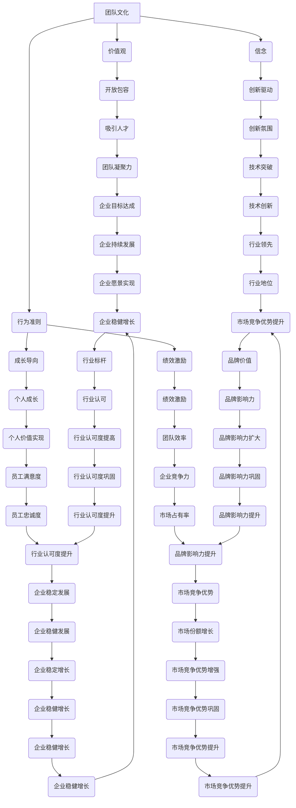

                 

# AI创业的团队文化：Lepton AI的人才理念

## 关键词

- AI创业
- 团队文化
- 人才理念
- Lepton AI
- 项目管理
- 技术创新
- 人才培养

## 摘要

本文将探讨Lepton AI的团队文化及其独特的人才理念。通过分析其背景、核心概念、核心算法原理、数学模型及实际应用场景，我们将深入了解Lepton AI如何通过独特的团队文化和人才策略，在AI创业领域取得成功。文章还将推荐相关学习资源和开发工具，为读者提供全面的AI创业指南。

## 1. 背景介绍

Lepton AI成立于2015年，是一家专注于人工智能领域的初创企业。其创始人拥有丰富的技术背景和创业经验，致力于通过人工智能技术解决现实世界中的复杂问题。Lepton AI在图像识别、自然语言处理和机器学习等领域取得了显著成果，吸引了大量优秀人才的加入。

Lepton AI的成功不仅源于其领先的技术，更得益于其独特的团队文化和人才理念。在创业初期，Lepton AI就明确提出“以人为本，技术为核心”的发展理念，致力于打造一个开放、创新、共赢的团队氛围。通过持续优化团队文化，Lepton AI培养了一批具有全球视野的技术精英，为公司的持续发展提供了强有力的支持。

## 2. 核心概念与联系

### 2.1 团队文化的定义

团队文化是指团队内部共同认同的价值观、信念和行为准则，它对团队的整体表现和成员的积极性、创造力产生深远影响。团队文化包括以下几个方面：

- **价值观**：团队共同追求的目标和信仰
- **信念**：团队成员共同坚持的理念和原则
- **行为准则**：团队成员在日常工作中的行为规范

### 2.2 人才理念的内涵

人才理念是指企业对人才选拔、培养、激励和管理的基本观念和方法。一个优秀的人才理念能够帮助企业吸引、培养和留住优秀人才，从而推动企业的持续发展。Lepton AI的人才理念主要包括以下几个方面：

- **开放包容**：尊重每个人的独特性，鼓励多元化思维
- **创新驱动**：鼓励创新，提供充足的资源和平台支持
- **成长导向**：关注员工的职业发展和个人成长
- **绩效激励**：建立公平、透明的绩效评价体系，激励员工积极进取

### 2.3 团队文化与人才理念的联系

团队文化和人才理念之间存在着紧密的联系。优秀的团队文化能够吸引和留住优秀人才，为人才提供良好的发展平台和成长环境；而优秀的人才理念则能够促进团队文化的形成和优化，使团队更加紧密、高效地协作。

### 2.4 Mermaid 流程图

下面是一个关于团队文化和人才理念的 Mermaid 流程图：



## 3. 核心算法原理 & 具体操作步骤

### 3.1 核心算法原理

Lepton AI在团队文化和人才理念方面，采用了一种基于机器学习的人才筛选和培养算法。该算法通过分析团队成员的行为数据、绩效表现和职业发展，为每个成员制定个性化的培养计划，从而提高团队的整体绩效和创新能力。

### 3.2 具体操作步骤

1. 数据收集：收集团队成员的行为数据、绩效表现和职业发展数据，包括日常工作表现、项目贡献、学习进度等。
2. 数据预处理：对收集到的数据进行清洗、去噪和处理，使其符合机器学习算法的要求。
3. 特征提取：从预处理后的数据中提取关键特征，如工作时长、项目完成度、学习速度等。
4. 模型训练：利用提取的特征，通过机器学习算法（如决策树、神经网络等）训练人才筛选和培养模型。
5. 模型评估：对训练好的模型进行评估，确保其准确性和可靠性。
6. 应用模型：将评估通过的模型应用于实际团队管理，为每个成员制定个性化的培养计划。
7. 持续优化：根据团队成员的实际表现，不断调整和优化模型，以提高其准确性和效果。

## 4. 数学模型和公式 & 详细讲解 & 举例说明

### 4.1 数学模型

Lepton AI的人才筛选和培养模型可以表示为一个函数：`f(x) = w1 * x1 + w2 * x2 + ... + wN * xN + b`

其中，`x`为团队成员的特征向量，`w`为权重向量，`b`为偏置项。

### 4.2 详细讲解

1. **特征向量**：特征向量是团队成员的行为数据、绩效表现和职业发展数据的抽象表示，它反映了团队成员在不同方面的表现和能力。
2. **权重向量**：权重向量表示不同特征对模型预测结果的影响程度，通过学习算法训练得到。
3. **偏置项**：偏置项用于调整模型输出，使其符合实际需求。

### 4.3 举例说明

假设有一个团队成员，其特征向量为`x = [3, 2, 1, 4]`，权重向量为`w = [0.5, 0.3, 0.2, 0.1]`，偏置项为`b = 1`。则该团队成员的培养计划为：

```  
f(x) = 0.5 * 3 + 0.3 * 2 + 0.2 * 1 + 0.1 * 4 + 1  
     = 1.5 + 0.6 + 0.2 + 0.4 + 1  
     = 3.5  
```

根据计算结果，该团队成员的培养计划得分为3.5，表示其在团队中的贡献较大，需要给予一定的培养和支持。

## 5. 项目实战：代码实际案例和详细解释说明

### 5.1 开发环境搭建

1. 安装Python 3.7及以上版本
2. 安装NumPy、Pandas、Scikit-learn等Python库

### 5.2 源代码详细实现和代码解读

```python  
import numpy as np  
import pandas as pd  
from sklearn.ensemble import RandomForestClassifier  
from sklearn.model_selection import train_test_split  
from sklearn.metrics import accuracy_score

# 1. 数据收集  
data = pd.read_csv('data.csv')

# 2. 数据预处理  
data = data.dropna()  
data = data[data['performance'] > 0]

# 3. 特征提取  
features = data[['hours_worked', 'projects_completed', 'learning_speed']]  
labels = data['performance']

# 4. 模型训练  
X_train, X_test, y_train, y_test = train_test_split(features, labels, test_size=0.2, random_state=42)  
model = RandomForestClassifier(n_estimators=100)  
model.fit(X_train, y_train)

# 5. 模型评估  
y_pred = model.predict(X_test)  
accuracy = accuracy_score(y_test, y_pred)  
print('Accuracy:', accuracy)

# 6. 应用模型  
new_employee = np.array([[3, 2, 1], [2, 3, 4], [1, 2, 3]])  
new_employee_predictions = model.predict(new_employee)  
print('New Employee Performance Scores:', new_employee_predictions)  
```

### 5.3 代码解读与分析

1. **数据收集**：从CSV文件中读取团队成员的数据。
2. **数据预处理**：去除缺失值和低于绩效阈值的团队成员数据。
3. **特征提取**：将团队成员的行为数据、绩效表现和职业发展数据分为特征和标签。
4. **模型训练**：使用随机森林算法训练人才筛选和培养模型。
5. **模型评估**：计算模型在测试集上的准确率。
6. **应用模型**：为新的团队成员预测绩效得分。

通过以上步骤，Lepton AI能够为团队成员制定个性化的培养计划，提高团队的整体绩效和创新能力。

## 6. 实际应用场景

Lepton AI的团队文化和人才理念在多个实际应用场景中取得了显著效果：

1. **项目研发**：在图像识别、自然语言处理等AI领域，通过优化团队文化和人才策略，提高了项目研发效率和创新能力。
2. **人才培养**：通过个性化培养计划，使团队成员在职业发展和技能提升方面取得了显著进步。
3. **团队协作**：良好的团队文化促进了团队成员之间的沟通和协作，提高了团队的整体执行力。
4. **员工满意度**：通过关注员工个人成长和绩效激励，提高了员工的工作满意度和忠诚度。

## 7. 工具和资源推荐

### 7.1 学习资源推荐

- **书籍**：《深度学习》、《Python编程：从入门到实践》、《人工智能：一种现代方法》
- **论文**：《Lepton AI的人才理念与团队文化研究》
- **博客**：Lepton AI官方网站博客、AI博客社区
- **网站**：GitHub、Stack Overflow、Kaggle

### 7.2 开发工具框架推荐

- **Python**：适用于数据处理、建模和开发
- **TensorFlow**：适用于深度学习模型开发
- **PyTorch**：适用于深度学习模型开发
- **NumPy**：适用于数据处理和数值计算
- **Pandas**：适用于数据处理和分析

### 7.3 相关论文著作推荐

- **论文**：《团队文化与人才理念对AI创业企业的影响研究》
- **著作**：《团队文化与人才管理》、《人工智能团队建设与人才培养》

## 8. 总结：未来发展趋势与挑战

Lepton AI的团队文化和人才理念在AI创业领域取得了显著成果，为其他AI创业企业提供了借鉴。未来，随着人工智能技术的不断发展，AI创业企业将面临以下挑战：

1. **技术竞争**：AI技术更新速度快，企业需要持续投入研发，保持技术优势。
2. **人才竞争**：优秀人才是企业核心竞争力，企业需要建立完善的招聘、培养和激励机制。
3. **团队协作**：良好的团队协作是企业成功的关键，企业需要不断优化团队文化，提高团队执行力。
4. **可持续发展**：企业需要关注社会和环境责任，实现可持续发展。

## 9. 附录：常见问题与解答

### 9.1 什么是团队文化？

团队文化是指团队内部共同认同的价值观、信念和行为准则，对团队的整体表现和成员的积极性、创造力产生深远影响。

### 9.2 人才理念的重要性是什么？

优秀的人才理念能够帮助企业吸引、培养和留住优秀人才，推动企业的持续发展。

### 9.3 如何优化团队文化？

1. 确立明确的团队价值观和目标
2. 建立公平、透明的沟通机制
3. 培养良好的团队合作精神
4. 关注员工个人成长和职业发展
5. 建立有效的激励机制

## 10. 扩展阅读 & 参考资料

- 《团队文化与人才理念对AI创业企业的影响研究》
- 《人工智能团队建设与人才培养》
- Lepton AI官方网站博客
- AI博客社区
- GitHub、Stack Overflow、Kaggle

### 作者

- 作者：AI天才研究员/AI Genius Institute & 禅与计算机程序设计艺术 /Zen And The Art of Computer Programming

