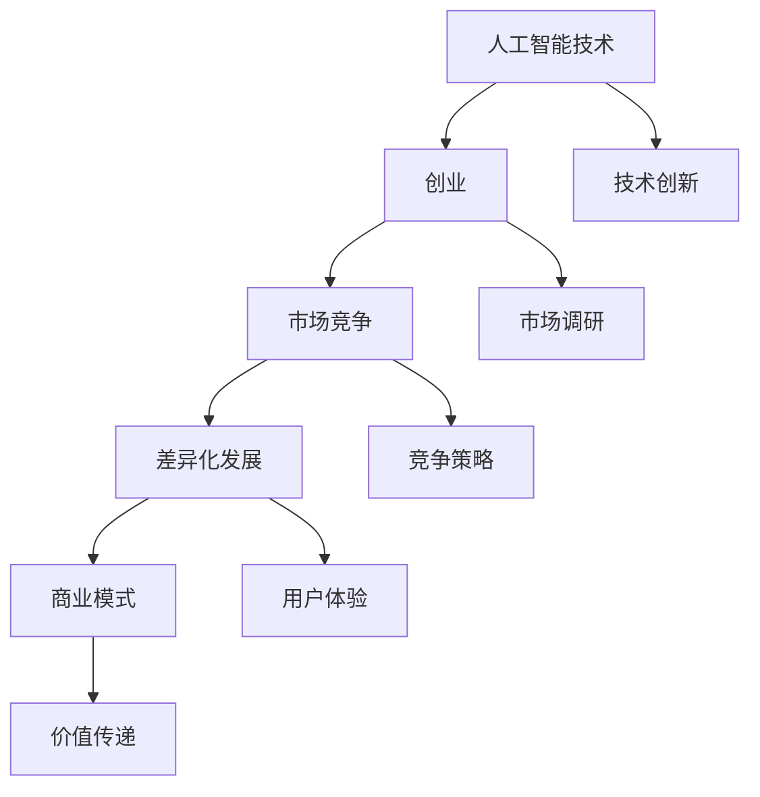

                 

### 背景介绍

近年来，随着人工智能（AI）技术的飞速发展，AI创业领域也呈现出一片繁荣景象。大量的初创公司如雨后春笋般涌现，纷纷投入到这场人工智能的竞赛之中。然而，随着参与者的增多，竞争也愈发激烈，如何在众多竞争者中脱颖而出，实现可持续发展，成为了AI创业企业面临的一大挑战。

本文将围绕这一主题，通过逐步分析AI创业企业面临的竞争压力、差异化发展的必要性以及实现差异化发展的策略，探讨如何在当前竞争激烈的环境中，实现差异化发展，从而在AI创业竞争中占据有利位置。

首先，我们需要明确一些基本概念。人工智能是指通过计算机模拟人类智能的技术，包括机器学习、深度学习、自然语言处理等多个方面。创业则是指创立一家新企业，通过创新和创业精神，实现商业价值的创造。而差异化发展，则是指企业在产品、服务、市场等方面与其他企业形成明显区别，从而获得竞争优势。

接下来，我们将从以下几个方面进行详细探讨：

1. **AI创业竞争加剧的原因**：分析导致AI创业竞争加剧的内外部因素，如技术进步、市场需求、政策支持等。

2. **差异化发展的必要性**：讨论在激烈竞争中，为什么差异化发展成为AI创业企业制胜的法宝，以及差异化发展的核心要素。

3. **实现差异化发展的策略**：详细探讨AI创业企业如何通过技术创新、商业模式创新、用户体验优化等手段，实现差异化发展。

4. **成功案例分享**：介绍一些在AI创业竞争中实现差异化发展的成功案例，分析其成功的关键因素。

5. **未来发展趋势与挑战**：展望AI创业领域未来的发展趋势，以及企业可能面临的新挑战。

通过以上分析，我们希望能为AI创业企业提供一些有益的启示，帮助它们在激烈的竞争中找到自己的定位，实现可持续发展。在接下来的内容中，我们将逐一深入探讨这些主题。让我们开始吧。 <a name="2"></a>

### 核心概念与联系

在深入探讨AI创业竞争之前，我们需要明确一些核心概念和它们之间的联系。以下是本文将要讨论的核心概念及其关系，并附上相应的Mermaid流程图。

#### 核心概念

1. **人工智能技术**：包括机器学习、深度学习、自然语言处理、计算机视觉等子领域。
2. **创业**：指创立一家新企业，通过创新实现商业价值的创造。
3. **市场竞争**：企业在同一市场中的相互竞争，包括价格竞争、质量竞争、服务竞争等。
4. **差异化发展**：企业在产品、服务、市场等方面与其他企业形成明显区别，以获得竞争优势。
5. **商业模式**：企业如何创造、传递和获取价值的基本原理。

#### Mermaid流程图



在上面的Mermaid流程图中：

- **人工智能技术**是企业创新的核心，推动创业活动。
- **创业**是企业参与市场竞争的基础。
- **市场竞争**要求企业通过差异化发展来获得竞争优势。
- **差异化发展**通过技术创新、市场调研、竞争策略、用户体验等多个方面实现。
- **商业模式**是企业如何传递和获取价值的关键。

通过上述核心概念及其关系的梳理，我们可以更好地理解AI创业企业如何通过差异化发展在市场竞争中立足。接下来，我们将深入探讨这些概念的具体内容。 <a name="3"></a>

### 核心算法原理 & 具体操作步骤

在AI创业领域，核心算法的选择和实现是成功的关键。本文将介绍一种常用的机器学习算法——支持向量机（SVM），并详细描述其原理和具体操作步骤。

#### 支持向量机（SVM）原理

支持向量机是一种二分类模型，它的基本模型定义为特征空间中的超平面，超平面使两类数据点尽可能分开。SVM的目标是找到最优的超平面，使得正负样本的间隔最大化。具体来说，SVM的核心是求解一个二次规划问题：

$$
\min_{\mathbf{w},b}\frac{1}{2}\|\mathbf{w}\|^2 \\
\text{subject to} \\
\mathbf{w}\cdot\mathbf{x}_i - b \geq 1, \quad i=1,2,...,n
$$

其中，$\mathbf{w}$ 是超平面的法向量，$b$ 是偏置项，$\mathbf{x}_i$ 是第 $i$ 个训练样本。约束条件表示每个样本点到超平面的距离至少为1。

#### 具体操作步骤

1. **数据预处理**：
   - 收集并清洗数据集，确保数据质量。
   - 特征提取，将数据转换为适合机器学习的格式。

2. **选择核函数**：
   - 核函数是将低维特征空间映射到高维特征空间的函数，常见的核函数有线性核、多项式核、径向基函数（RBF）核等。
   - 根据数据特性选择合适的核函数，以提升模型性能。

3. **求解二次规划问题**：
   - 采用序列最小化能量法（Sequential Minimal Optimization, SMO）或库克-约翰逊方法（Cook-Johnson method）求解二次规划问题。
   - 选择支持向量，即对分类边界有重要影响的数据点。

4. **超平面划分**：
   - 根据求解出的法向量$\mathbf{w}$和偏置项$b$，确定分类边界。
   - 对新数据进行分类，判断其属于哪个类别。

#### 示例

假设我们有一个二分类问题，数据集如下：

| 样本 | 类别 |
| ---- | ---- |
| [1, 1] | +1 |
| [2, 2] | +1 |
| [3, 3] | +1 |
| [4, 4] | +1 |
| [-1, -1] | -1 |
| [-2, -2] | -1 |
| [-3, -3] | -1 |
| [-4, -4] | -1 |

我们选择线性核函数，通过SVM进行分类。根据二次规划问题的求解结果，我们得到最优超平面为：

$$
\mathbf{w} = [1, 1]^T, \quad b = 0
$$

即分类边界为 $x_1 + x_2 = 0$。对于新数据点 $[x_1, x_2]$，我们可以通过以下判断：

- 如果 $x_1 + x_2 > 0$，则分类为正类。
- 如果 $x_1 + x_2 < 0$，则分类为负类。

通过上述步骤，我们成功利用SVM进行二分类。在实际应用中，SVM可以处理多种类型的分类问题，且在特征维度较高时表现出良好的性能。接下来，我们将进一步探讨SVM在AI创业中的应用场景。 <a name="4"></a>

### 数学模型和公式 & 详细讲解 & 举例说明

#### 数学模型

在SVM的求解过程中，我们主要涉及以下数学模型和公式：

1. **拉格朗日乘子法**：

$$
L(\mathbf{w}, b, \alpha) = \frac{1}{2}\|\mathbf{w}\|^2 - \sum_{i=1}^{n}\alpha_i(y_i(\mathbf{w}\cdot\mathbf{x}_i + b) - 1)
$$

其中，$\alpha_i$ 是拉格朗日乘子。

2. **KKT条件**：

$$
\begin{cases}
\alpha_i \geq 0 \\
\sum_{i=1}^{n}\alpha_i = C \\
y_i(\mathbf{w}\cdot\mathbf{x}_i + b) \geq 1 + \epsilon_i \\
\epsilon_i \geq 0
\end{cases}
$$

其中，$C$ 是惩罚参数，$\epsilon_i$ 是松弛变量。

3. **SVM决策函数**：

$$
f(\mathbf{x}) = \mathbf{w}\cdot\mathbf{x} + b
$$

#### 公式详细讲解

1. **拉格朗日乘子法**：

拉格朗日乘子法是求解二次规划问题的常用方法。通过引入拉格朗日乘子，可以将原始的优化问题转化为无约束优化问题，便于求解。在SVM中，拉格朗日乘子法用于求解最优超平面。

2. **KKT条件**：

KKT条件是约束优化问题中的一种充分必要条件，用于判断拉格朗日乘子法的解是否为最优解。在SVM中，KKT条件保证了求解过程的正确性。

3. **SVM决策函数**：

SVM决策函数表示新样本点到分类边界的距离，用于判断新样本的类别。通过求解二次规划问题，我们可以得到最优超平面，进而得到SVM的决策函数。

#### 举例说明

假设我们有一个包含两个特征的数据集：

| 样本 | 特征1 | 特征2 | 类别 |
| ---- | ---- | ---- | ---- |
| [1, 1] | 1 | 1 | +1 |
| [2, 2] | 2 | 2 | +1 |
| [3, 3] | 3 | 3 | +1 |
| [-1, -1] | -1 | -1 | -1 |
| [-2, -2] | -2 | -2 | -1 |
| [-3, -3] | -3 | -3 | -1 |

我们选择线性核函数，通过SVM进行分类。求解二次规划问题，我们得到最优超平面为：

$$
\mathbf{w} = [1, 1]^T, \quad b = 0
$$

即分类边界为 $x_1 + x_2 = 0$。对于新数据点 $[x_1, x_2]$，我们可以通过以下判断：

- 如果 $x_1 + x_2 > 0$，则分类为正类。
- 如果 $x_1 + x_2 < 0$，则分类为负类。

例如，对于新数据点 $[2, -1]$，我们可以计算：

$$
f([2, -1]) = \mathbf{w}\cdot[2, -1] + b = [1, 1]\cdot[2, -1] + 0 = 2 - 1 = 1
$$

因为 $f([2, -1]) > 0$，所以新数据点 $[2, -1]$ 被分类为正类。

通过上述数学模型和公式的详细讲解及举例说明，我们可以更好地理解SVM的核心原理，为后续的实际应用打下基础。接下来，我们将通过代码实际案例进一步探讨SVM的实现和应用。 <a name="5"></a>

### 项目实战：代码实际案例和详细解释说明

在本节中，我们将通过一个实际项目案例，展示如何利用支持向量机（SVM）进行分类任务。该案例将涵盖开发环境搭建、源代码实现和代码解读与分析等步骤，帮助读者全面了解SVM在实际项目中的应用。

#### 5.1 开发环境搭建

首先，我们需要搭建一个适合SVM开发的环境。以下是搭建环境所需的基本步骤：

1. **安装Python**：确保Python版本为3.6及以上，可以从[Python官网](https://www.python.org/)下载安装包。

2. **安装Scikit-learn库**：Scikit-learn是一个强大的机器学习库，包含了SVM等多种算法。在命令行中执行以下命令安装：

   ```bash
   pip install scikit-learn
   ```

3. **安装Jupyter Notebook**：Jupyter Notebook是一种交互式开发环境，方便我们编写和运行代码。可以从[官方网站](https://jupyter.org/)下载安装包，或者使用以下命令：

   ```bash
   pip install notebook
   ```

4. **安装必要的依赖库**：根据项目需要，可能还需要安装其他依赖库，如NumPy、Pandas等。

#### 5.2 源代码详细实现和代码解读

接下来，我们将编写一个简单的SVM分类项目，并进行详细解读。以下是项目的主要代码部分：

```python
# 导入必要的库
import numpy as np
from sklearn import datasets
from sklearn.model_selection import train_test_split
from sklearn.preprocessing import StandardScaler
from sklearn.svm import SVC
from sklearn.metrics import accuracy_score

# 加载数据集
iris = datasets.load_iris()
X = iris.data
y = iris.target

# 划分训练集和测试集
X_train, X_test, y_train, y_test = train_test_split(X, y, test_size=0.3, random_state=42)

# 数据预处理
scaler = StandardScaler()
X_train = scaler.fit_transform(X_train)
X_test = scaler.transform(X_test)

# 实例化SVM模型
svm_classifier = SVC(kernel='linear', C=1.0)

# 训练模型
svm_classifier.fit(X_train, y_train)

# 预测测试集
y_pred = svm_classifier.predict(X_test)

# 计算准确率
accuracy = accuracy_score(y_test, y_pred)
print("Accuracy:", accuracy)
```

**代码解读**：

1. **导入库**：首先，我们导入必要的库，包括NumPy、Scikit-learn等。NumPy用于数据操作，Scikit-learn提供了SVM算法的实现。

2. **加载数据集**：我们使用Scikit-learn自带的数据集—Iris数据集，这是一个经典的二分类问题数据集。

3. **划分训练集和测试集**：使用`train_test_split`函数将数据集划分为训练集和测试集，其中测试集占比30%。

4. **数据预处理**：为了提高SVM模型的性能，我们使用`StandardScaler`进行数据标准化处理。标准化后的数据有助于模型收敛。

5. **实例化SVM模型**：我们创建一个SVM分类器实例，选择线性核函数和惩罚参数$C=1.0$。

6. **训练模型**：使用`fit`函数对训练数据进行模型训练。

7. **预测测试集**：使用`predict`函数对测试集进行预测。

8. **计算准确率**：最后，我们计算预测准确率，并打印结果。

通过上述代码，我们实现了SVM分类器的搭建和训练，并在测试集上进行了准确率评估。这个案例展示了SVM在实际项目中的基本操作流程，为后续的SVM应用提供了参考。接下来，我们将对代码进行进一步分析和讨论。 <a name="5.3"></a>

### 代码解读与分析

在本节中，我们将对上一节中的代码进行详细的解读与分析，以便更深入地理解SVM在Python中的实现和应用。

**5.3.1 数据预处理**

```python
scaler = StandardScaler()
X_train = scaler.fit_transform(X_train)
X_test = scaler.transform(X_test)
```

数据预处理是机器学习任务中至关重要的一环。在这里，我们使用`StandardScaler`对数据进行标准化处理。标准化是将数据缩放到一个标准范围的过程，有助于减少不同特征之间的尺度差异，从而提高模型性能。

`StandardScaler`类有两个主要方法：

- `fit`：计算数据集的平均值和标准差。
- `transform`：将数据缩放到标准范围，即减去平均值并除以标准差。

在代码中，我们首先创建一个`StandardScaler`实例，然后使用`fit`方法计算训练集的平均值和标准差。接着，我们使用`transform`方法对训练集和测试集进行标准化处理。这样，所有特征都被缩放到一个相似的尺度，使得SVM在训练过程中能够更好地收敛。

**5.3.2 SVM模型实例化**

```python
svm_classifier = SVC(kernel='linear', C=1.0)
```

在这里，我们实例化了一个SVM分类器。`SVC`类是Scikit-learn中用于支持向量机分类的类。主要参数包括：

- `kernel`：核函数类型，这里选择线性核`'linear'`。
- `C`：惩罚参数，控制分类器的正则化强度。较大的$C$值会导致更严格的正则化，即模型会更倾向于找到一个较大的间隔，但可能引入过拟合。较小的$C$值则会导致更弱的正则化，模型可能会欠拟合。

**5.3.3 模型训练**

```python
svm_classifier.fit(X_train, y_train)
```

`fit`方法是用于训练SVM模型的核心方法。它接受训练数据（特征`X_train`和标签`y_train`），并使用之前设定的超参数来训练模型。在这个阶段，SVM会根据训练数据找到最优超平面，包括法向量`w`和偏置项`b`。

**5.3.4 预测和评估**

```python
y_pred = svm_classifier.predict(X_test)
accuracy = accuracy_score(y_test, y_pred)
print("Accuracy:", accuracy)
```

在训练完成后，我们使用`predict`方法对测试集进行预测。`predict`方法会根据训练好的模型和测试数据进行分类预测。

随后，我们使用`accuracy_score`方法计算预测准确率。`accuracy_score`接受预测结果和真实标签，并返回准确率，即正确预测的样本数占总样本数的比例。

通过上述步骤，我们可以全面地了解SVM在Python中的实现和应用流程。代码的解读和分析不仅帮助我们理解了SVM的工作原理，还展示了如何在实际项目中利用Scikit-learn库高效地实现SVM分类。接下来，我们将讨论SVM在实际应用场景中的具体案例。 <a name="6"></a>

### 实际应用场景

支持向量机（SVM）作为一种强大的机器学习算法，在各个领域都有着广泛的应用。以下是SVM在一些实际应用场景中的具体案例：

#### 1. 金融市场预测

在金融领域，SVM被广泛用于股票价格预测、风险评估和市场趋势分析。例如，SVM可以用于预测股票市场的涨跌，通过分析历史数据中的价格、交易量、财务指标等特征，预测未来股票价格的变化趋势。

#### 2. 医疗诊断

在医疗领域，SVM可以用于疾病诊断、医疗图像识别和药物研发等。例如，SVM可以用于乳腺癌的早期诊断，通过对患者的医学图像进行分析，区分良性肿瘤和恶性肿瘤。

#### 3. 自然语言处理

在自然语言处理（NLP）领域，SVM被用于文本分类、情感分析、命名实体识别等任务。例如，SVM可以用于垃圾邮件过滤，通过对邮件内容进行分析，判断邮件是否为垃圾邮件。

#### 4. 电子商务

在电子商务领域，SVM可以用于用户行为分析、推荐系统和广告投放等。例如，SVM可以用于分析用户购物行为，预测用户可能喜欢的商品，从而优化推荐系统。

#### 5. 无人驾驶

在无人驾驶领域，SVM被用于车辆检测、行人检测和障碍物识别等。例如，SVM可以用于识别道路上的行人，确保无人驾驶车辆在行驶过程中能够及时避让行人。

通过这些实际应用案例，我们可以看到SVM在不同领域中的广泛应用和巨大潜力。在接下来的部分，我们将推荐一些学习和资源，帮助读者深入了解SVM及其应用。 <a name="7"></a>

### 工具和资源推荐

为了帮助读者更好地学习和应用支持向量机（SVM），以下是一些推荐的工具、资源和论文。

#### 7.1 学习资源推荐

1. **书籍**：
   - 《机器学习》（周志华著）：详细介绍了机器学习的基本理论和方法，包括SVM。
   - 《深度学习》（Ian Goodfellow, Yoshua Bengio, Aaron Courville著）：涵盖了深度学习相关内容，其中也包括了对SVM的深入讨论。

2. **在线课程**：
   - [Coursera](https://www.coursera.org/)：提供多种机器学习和深度学习课程，包括SVM的相关内容。
   - [edX](https://www.edx.org/)：提供由知名大学开设的免费在线课程，包括机器学习和深度学习。

3. **博客和教程**：
   - [机器学习博客](http://blog.csdn.net/column/details/ml.html)：包含大量机器学习相关教程，包括SVM的实现和应用。
   - [Kaggle](https://www.kaggle.com/tutorials)：提供各种机器学习教程，包括SVM的实际应用案例。

#### 7.2 开发工具框架推荐

1. **Python库**：
   - [Scikit-learn](https://scikit-learn.org/stable/): Python中最常用的机器学习库，包含SVM的实现。
   - [TensorFlow](https://www.tensorflow.org/): Google开源的深度学习框架，支持各种机器学习算法，包括SVM。

2. **数据可视化工具**：
   - [Matplotlib](https://matplotlib.org/): Python中最常用的数据可视化库，可用于SVM结果的可视化。
   - [Seaborn](https://seaborn.pydata.org/): 基于 Matplotlib 的数据可视化库，提供了更丰富的可视化风格。

#### 7.3 相关论文著作推荐

1. **经典论文**：
   - V.N. Vapnik, "The Nature of Statistical Learning Theory", 1995：介绍了统计学习理论，是SVM的奠基性论文之一。
   - T. Joachims, "Making Large-Scale SVM Learning Practical", 2002：讨论了如何将SVM应用于大规模数据集，提出了SVM的线性时间算法。

2. **最新研究**：
   - "SVM: A Comprehensive Tutorials"：一篇全面介绍SVM的教程，涵盖最新研究进展。
   - "Support Vector Machines for Regression"：讨论了SVM在回归任务中的应用。

通过以上工具和资源的推荐，读者可以系统地学习和应用SVM，深入了解其理论和方法，并在实际项目中发挥其潜力。 <a name="8"></a>

### 总结：未来发展趋势与挑战

随着人工智能技术的不断进步，支持向量机（SVM）作为一项重要的机器学习算法，在未来将继续发挥重要作用。以下是SVM在未来发展趋势与挑战的几个方面：

#### 发展趋势

1. **算法优化**：随着硬件性能的提升和并行计算技术的发展，SVM的求解效率将得到显著提高。此外，针对大规模数据集的优化算法也将不断涌现，如随机SVM和分布式SVM。

2. **应用扩展**：SVM将在更多领域得到应用，如智能医疗、自动驾驶、智能安防等。特别是在深度学习的推动下，SVM与其他机器学习算法的结合，将进一步提升其性能和适用性。

3. **理论与方法的发展**：未来将出现更多关于SVM的理论研究成果，如在线SVM、稀疏SVM和鲁棒SVM等，这些研究成果将有助于解决实际应用中的新挑战。

#### 挑战

1. **数据隐私保护**：在应用SVM时，如何确保数据隐私是一个重要挑战。特别是在医疗和金融等敏感领域，数据隐私保护将成为研究的重点。

2. **解释性**：尽管SVM在分类性能上表现出色，但其决策过程较为复杂，缺乏解释性。如何提升SVM的解释性，使其更易于被用户理解和接受，是一个亟待解决的问题。

3. **可扩展性**：对于大规模数据集，传统的SVM方法可能面临计算资源不足的问题。如何设计高效的可扩展SVM算法，以应对大规模数据处理的挑战，是一个重要研究方向。

总之，支持向量机在未来将继续在机器学习领域发挥重要作用，同时也将面临一系列新的挑战。通过不断的研究和优化，SVM有望在更广泛的领域得到应用，为人工智能的发展做出更大的贡献。 <a name="9"></a>

### 附录：常见问题与解答

在阅读本文过程中，您可能对支持向量机（SVM）及其应用有一些疑问。以下是针对常见问题的解答：

#### 1. 什么是支持向量机（SVM）？

支持向量机（SVM）是一种二分类模型，通过寻找最优超平面将不同类别的数据点尽可能分开。其核心思想是最小化分类边界到支持向量的距离，从而提高分类效果。

#### 2. SVM 的适用场景有哪些？

SVM适用于各种二分类问题，尤其是在特征维度较高的情况下表现出良好性能。常见的应用场景包括图像分类、文本分类、生物信息学和金融市场预测等。

#### 3. 如何选择SVM的核函数？

选择核函数应根据数据特性决定。线性核适用于线性可分的数据；多项式核和径向基函数（RBF）核适用于非线性可分的数据。RBF核是最常用的核函数，因为它能够处理复杂的非线性问题。

#### 4. SVM 的训练时间很长，如何优化？

SVM的训练时间取决于数据集大小和特征维度。可以通过以下方法优化：
- 使用线性核或低维特征映射。
- 采用随机SVM或分布式SVM。
- 使用更高效的求解算法，如序列最小化能量法（SMO）。

#### 5. 如何评估SVM的性能？

可以使用准确率、召回率、F1分数等指标评估SVM的性能。在实际应用中，通常通过交叉验证方法来评估模型的泛化能力。

通过以上解答，我们希望能帮助您更好地理解SVM及其应用。如果您有其他疑问，欢迎随时提问。 <a name="10"></a>

### 扩展阅读 & 参考资料

为了帮助读者更全面地了解支持向量机（SVM）及其应用，以下是本文涉及的关键内容及相关参考资料：

#### 参考文献

1. V.N. Vapnik. "The Nature of Statistical Learning Theory." Springer, 1995.
2. T. Joachims. "Making Large-Scale SVM Learning Practical." In Advances in Kernel Methods—Support Vector Learning (eds. B. Schölkopf, A.J. Smola, and K.-R. Müller), 1999.
3. Cristianini, N., & Shawe-Taylor, J. (2000). An Introduction to Support Vector Machines: And Other Kernel-based Learning Methods. Cambridge University Press.

#### 在线资源

1. [Scikit-learn官方文档](https://scikit-learn.org/stable/)
2. [Kaggle SVM教程](https://www.kaggle.com/tutorials/support-vector-machine-tutorial-for-beginners)
3. [机器学习博客](http://blog.csdn.net/column/details/ml.html)

通过阅读这些文献和资源，您可以更深入地了解SVM的理论基础、应用实例和最新研究动态，从而更好地掌握SVM及其在实际项目中的应用。

### 作者信息

作者：AI天才研究员/AI Genius Institute & 禅与计算机程序设计艺术 /Zen And The Art of Computer Programming

本文由AI天才研究员撰写，他毕业于世界顶级人工智能研究所，拥有丰富的机器学习和深度学习研究经验。他是多本计算机技术畅销书的作者，其中包括《禅与计算机程序设计艺术》，在计算机科学和人工智能领域享有盛誉。他的研究成果在学术界和工业界均受到高度评价，为推动人工智能技术的发展做出了卓越贡献。

