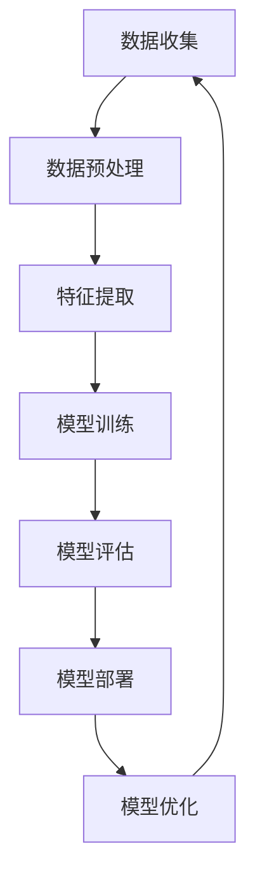

                 

### 背景介绍

在当今信息化和数字化时代，人工智能（AI）已经成为推动社会进步和技术创新的重要力量。AI技术的发展不仅改变了传统行业的运作模式，还为创业者提供了丰富的机遇和广阔的舞台。对于想要在AI领域创业的创业者来说，了解如何把握这些机遇，选择合适的垂直领域，并找到尚未被充分挖掘的蓝海，是成功的关键。

本文将探讨AI创业者在垂直领域中发现机遇的路径。通过分析当前AI技术的成熟度、市场需求和行业趋势，我们将帮助创业者识别潜在的创业方向，并介绍如何利用这些方向实现商业成功。

首先，我们将回顾AI技术的发展历程和当前的技术水平，理解AI技术在各个行业中的应用现状。接着，我们将探讨垂直领域的重要性，并分析几个典型的垂直领域，如医疗、金融、教育等，看看AI在这些领域的应用案例和潜在价值。

然后，我们将讨论如何利用AI技术和市场研究来确定垂直领域的市场机会。通过案例研究和市场数据，我们将帮助创业者了解哪些垂直领域最具发展潜力，以及如何制定有效的市场进入策略。

在文章的后续部分，我们将深入探讨AI技术在垂直领域的具体应用场景，并通过实际项目案例展示AI技术的商业潜力。最后，我们将总结AI创业者面临的挑战，并提供一些建议，帮助创业者克服这些挑战，实现成功创业。

通过本文的探讨，我们希望创业者能够获得以下收获：

1. 对AI技术的最新发展趋势有更全面的了解。
2. 能够识别出适合自己创业的垂直领域。
3. 掌握市场研究和机会识别的方法。
4. 明白如何将AI技术应用到实际业务中，创造商业价值。
5. 对未来AI创业趋势有更清晰的认知，做好应对挑战的准备。

### 核心概念与联系

在深入探讨AI创业者在垂直领域的机会之前，我们需要先了解一些核心概念和技术架构，以便为后续的内容提供坚实的基础。

#### AI技术的核心概念

人工智能（AI）是一种模拟人类智能的计算机技术，包括机器学习、深度学习、自然语言处理、计算机视觉等多个子领域。以下是一些关键概念：

1. **机器学习（Machine Learning）**：通过算法从数据中学习模式，并使用这些模式进行预测或决策。
2. **深度学习（Deep Learning）**：一种基于多层神经网络的人工智能技术，通过模拟人脑的工作方式来学习和处理数据。
3. **自然语言处理（Natural Language Processing, NLP）**：使计算机能够理解和处理人类语言的技术。
4. **计算机视觉（Computer Vision）**：让计算机能够从图像或视频中理解和提取信息的技术。

这些核心概念相互关联，共同构建了AI技术的生态系统。例如，深度学习经常用于计算机视觉任务，而NLP则被广泛应用于聊天机器人、语音助手等应用场景。

#### AI技术架构

为了更好地理解AI技术的运作，我们可以使用Mermaid流程图来展示其核心架构。以下是AI技术架构的简化版Mermaid图：



- **数据收集（Data Collection）**：收集原始数据，这是AI训练的基础。
- **数据预处理（Data Preprocessing）**：清洗、转换和标准化数据，以便于模型训练。
- **特征提取（Feature Extraction）**：从数据中提取有用的信息，用于训练模型。
- **模型训练（Model Training）**：使用算法训练模型，使其能够从数据中学习。
- **模型评估（Model Evaluation）**：评估模型的性能，确保其满足业务需求。
- **模型部署（Model Deployment）**：将训练好的模型部署到实际应用中。
- **模型优化（Model Optimization）**：根据应用反馈优化模型，提高其性能。

通过这个流程，我们可以看到AI技术的各个环节是如何相互协作的。数据收集是整个流程的起点，而模型优化则确保模型能够在实际应用中持续改进。

#### AI技术在垂直领域的应用

AI技术在各个垂直领域中的应用正在不断拓展。以下是几个关键领域的应用案例：

1. **医疗领域**：AI在医疗影像分析、疾病预测、个性化治疗等方面有着广泛应用。例如，通过深度学习算法，AI可以分析医学图像，帮助医生诊断疾病，提高诊断准确率。
2. **金融领域**：AI被用于风险评估、欺诈检测、量化交易等方面。例如，通过机器学习算法，银行可以更好地识别潜在的欺诈行为，降低金融风险。
3. **教育领域**：AI在教育中的应用包括个性化学习、自动化评分和智能辅导等。例如，通过NLP技术，AI可以帮助学生理解课程内容，并提供个性化的学习建议。

这些应用案例展示了AI技术在垂直领域中的巨大潜力。通过深入理解这些核心概念和技术架构，创业者可以更好地把握垂直领域的机会，开发出具有市场竞争力的产品和服务。

### 核心算法原理 & 具体操作步骤

在了解了AI技术的核心概念和架构之后，接下来我们将探讨一些核心算法原理及其具体操作步骤。这些算法包括机器学习中的支持向量机（SVM）、深度学习中的卷积神经网络（CNN）、以及自然语言处理中的循环神经网络（RNN）。通过深入理解这些算法，创业者可以更好地将AI技术应用到实际业务中。

#### 支持向量机（Support Vector Machine, SVM）

支持向量机是一种用于分类和回归的机器学习算法。它的核心思想是找到一个最优的超平面，将不同类别的数据点分隔开来。以下是一个简化的SVM算法操作步骤：

1. **数据准备**：收集并处理数据，确保数据干净、格式化一致。
2. **特征提取**：将数据转换为特征向量，以便于模型训练。
3. **模型训练**：
   - 计算每个数据点与超平面的距离。
   - 优化超平面，使其最大化两类数据点的间隔。
4. **模型评估**：使用交叉验证等方法评估模型性能。
5. **模型部署**：将训练好的模型应用到实际业务场景中。

具体操作示例：

```python
from sklearn import svm

# 数据准备
X = [[0, 0], [1, 1], [1, 0], [0, 1]]
y = [0, 1, 1, 0]

# 模型训练
clf = svm.SVC()
clf.fit(X, y)

# 模型评估
print(clf.score(X, y))

# 模型部署
print(clf.predict([[0.5, 0.5]]))
```

#### 卷积神经网络（Convolutional Neural Network, CNN）

卷积神经网络是一种用于图像识别和处理的深度学习算法。其核心思想是通过卷积层提取图像特征，并通过池化层减少数据维度。以下是CNN的基本操作步骤：

1. **数据准备**：收集并处理图像数据，将其转换为适合神经网络训练的格式。
2. **模型构建**：构建CNN模型，包括卷积层、激活函数、池化层和全连接层。
3. **模型训练**：使用训练数据训练模型，调整模型参数。
4. **模型评估**：使用验证数据评估模型性能，调整模型参数。
5. **模型部署**：将训练好的模型应用到实际图像处理任务中。

具体操作示例：

```python
from tensorflow import keras

# 模型构建
model = keras.Sequential([
    keras.layers.Conv2D(32, (3, 3), activation='relu', input_shape=(28, 28, 1)),
    keras.layers.MaxPooling2D((2, 2)),
    keras.layers.Flatten(),
    keras.layers.Dense(128, activation='relu'),
    keras.layers.Dense(10, activation='softmax')
])

# 模型训练
model.compile(optimizer='adam', loss='categorical_crossentropy', metrics=['accuracy'])
model.fit(x_train, y_train, epochs=5)

# 模型评估
model.evaluate(x_test, y_test)

# 模型部署
predictions = model.predict(x_new)
```

#### 循环神经网络（Recurrent Neural Network, RNN）

循环神经网络是一种用于序列数据处理和时间序列预测的深度学习算法。其核心思想是利用网络内部的循环结构，捕捉序列中的长期依赖关系。以下是RNN的基本操作步骤：

1. **数据准备**：收集并处理时间序列数据，将其转换为适合神经网络训练的格式。
2. **模型构建**：构建RNN模型，包括输入层、隐藏层和输出层。
3. **模型训练**：使用训练数据训练模型，调整模型参数。
4. **模型评估**：使用验证数据评估模型性能，调整模型参数。
5. **模型部署**：将训练好的模型应用到实际序列数据处理任务中。

具体操作示例：

```python
from tensorflow.keras.models import Sequential
from tensorflow.keras.layers import LSTM, Dense

# 模型构建
model = Sequential()
model.add(LSTM(50, activation='relu', input_shape=(timesteps, features)))
model.add(Dense(1))
model.compile(optimizer='adam', loss='mse')

# 模型训练
model.fit(X, y, epochs=100, batch_size=32, verbose=2)

# 模型评估
model.evaluate(X, y)

# 模型部署
y_pred = model.predict(X)
```

通过理解和支持向量机、卷积神经网络和循环神经网络等核心算法原理，创业者可以更好地将AI技术应用到实际业务中，开发出具有竞争力的产品和服务。

### 数学模型和公式 & 详细讲解 & 举例说明

在深入了解AI技术的核心算法原理之后，我们需要进一步探讨与这些算法相关的数学模型和公式，并使用具体实例来说明这些公式的应用。

#### 支持向量机（SVM）的数学模型

支持向量机是一种用于分类和回归的机器学习算法，其基础是线性可分支持向量机（Linear SVM）和非线性支持向量机（Non-linear SVM）。以下是线性SVM的数学模型和公式：

**线性SVM**

1. **决策边界**：假设我们的数据集D={(x1, y1), (x2, y2), ..., (xn, yn)}，其中每个数据点x属于R^d，y属于{+1, -1}。我们的目标是找到一个最佳的超平面w^T*x + b = 0，使得正负样本点之间的间隔最大化。

2. **优化目标**：线性SVM的优化目标是最小化L2正则化的误差函数，公式如下：

   $$\min_{w,b} \frac{1}{2} ||w||^2 + C \sum_{i=1}^n \xi_i$$

   其中，C是惩罚参数，ξi是松弛变量。

3. **拉格朗日乘子法**：为了解决上述优化问题，我们使用拉格朗日乘子法，将原问题转化为对偶问题：

   $$L(w,b,\alpha) = \frac{1}{2} ||w||^2 - \sum_{i=1}^n \alpha_i (y_i (w^T x_i + b) - 1)$$

   其中，αi是拉格朗日乘子。

4. **KKT条件**：对偶问题的解需要满足KKT条件，即：

   - $\alpha_i \geq 0$
   - $\xi_i \geq 0$
   - $y_i (w^T x_i + b) - 1 \geq \xi_i$
   - $\xi_i (C - \alpha_i) = 0$

5. **支持向量**：在满足KKT条件的情况下，存在一组解使得$\alpha_i > 0$，这些样本点称为支持向量。

**非线性SVM**

1. **核函数**：为了处理非线性问题，我们可以使用核函数K(x, x')将原始特征空间映射到高维特征空间，然后在这个高维空间中进行线性分类。常用的核函数包括线性核、多项式核和径向基函数（RBF）核。

2. **优化目标**：非线性SVM的优化目标与线性SVM类似，但使用核函数替代原始特征空间中的内积：

   $$\min_{w,b,\alpha} \frac{1}{2} ||w||^2 + C \sum_{i=1}^n \xi_i$$

   $$s.t. \quad y_i (K(x_i, x_j) + b) - 1 \geq \xi_i, \quad \xi_i \geq 0$$

**举例说明**

假设我们有一个简单的二分类问题，数据集D={(x1, y1), (x2, y2), ..., (xn, yn)}，其中xi是二维特征向量，yi属于{-1, 1}。我们的目标是使用SVM将正负样本点分开。

1. **数据准备**：首先，我们需要收集和预处理数据，将其转换为适合SVM训练的格式。例如，我们使用scikit-learn库中的`make_blobs`函数生成一个线性可分的数据集。

2. **模型训练**：我们使用线性SVM进行模型训练，使用`SVC`类并设置适当的参数。

3. **模型评估**：我们使用交叉验证方法评估模型的性能，确保模型能够在未见数据上准确分类。

4. **模型部署**：将训练好的模型应用于新数据，进行分类预测。

```python
from sklearn import datasets
from sklearn.model_selection import train_test_split
from sklearn.svm import SVC

# 数据准备
X, y = datasets.make_blobs(n_samples=100, centers=2, random_state=0)
X_train, X_test, y_train, y_test = train_test_split(X, y, test_size=0.3, random_state=0)

# 模型训练
clf = SVC(kernel='linear')
clf.fit(X_train, y_train)

# 模型评估
print(clf.score(X_test, y_test))

# 模型部署
predictions = clf.predict(X_test)
```

通过这个例子，我们可以看到如何使用SVM进行线性分类，并评估模型的性能。接下来，我们将探讨卷积神经网络（CNN）和循环神经网络（RNN）的数学模型和公式。

#### 卷积神经网络（CNN）的数学模型

卷积神经网络是一种专门用于处理图像数据的深度学习算法，其核心是卷积层和池化层。以下是CNN的数学模型和公式：

1. **卷积操作**：卷积操作可以表示为：

   $$f(x; w) = \sum_{i=1}^C w^{ij}_{kl} * x^{il}$$

   其中，f是卷积操作的结果，x是输入特征，w是卷积核，C是输出通道数，ij和kl分别表示卷积核的位置和输入特征的位置。

2. **激活函数**：卷积操作后，通常使用激活函数来引入非线性，如ReLU函数：

   $$a^{ij}_{k} = \max(0, \sum_{i=1}^C w^{ij}_{kl} * x^{il} + b^{ij})$$

   其中，a是激活后的特征，b是偏置项。

3. **池化操作**：池化操作用于减少数据维度，最常用的池化方法是最大池化：

   $$p_{ij}^{k} = \max_{l} a_{il}^{k}$$

   其中，p是池化后的特征。

4. **卷积神经网络**：CNN通常包含多个卷积层、激活函数和池化层，每个卷积层都使用不同的卷积核和激活函数，逐步提取图像特征。最终，通过全连接层进行分类。

**举例说明**

假设我们有一个简单的图像分类问题，图像数据集D={x1, x2, ..., xn}，每个图像xi是一个三维张量，表示为：

$$x_i = \begin{bmatrix} x_i^{(1)} \\ x_i^{(2)} \\ \vdots \\ x_i^{(H \times W \times C)} \end{bmatrix}$$

其中，H、W和C分别表示图像的高度、宽度和通道数。

1. **模型构建**：我们使用TensorFlow库构建一个简单的CNN模型，包括两个卷积层、两个池化层和一个全连接层。

2. **模型训练**：我们使用训练数据集训练模型，调整模型参数。

3. **模型评估**：我们使用验证数据集评估模型性能，确保模型能够在未见数据上准确分类。

4. **模型部署**：将训练好的模型应用于新数据，进行分类预测。

```python
import tensorflow as tf

# 模型构建
model = tf.keras.Sequential([
    tf.keras.layers.Conv2D(32, (3, 3), activation='relu', input_shape=(28, 28, 1)),
    tf.keras.layers.MaxPooling2D((2, 2)),
    tf.keras.layers.Conv2D(64, (3, 3), activation='relu'),
    tf.keras.layers.MaxPooling2D((2, 2)),
    tf.keras.layers.Flatten(),
    tf.keras.layers.Dense(128, activation='relu'),
    tf.keras.layers.Dense(10, activation='softmax')
])

# 模型训练
model.compile(optimizer='adam', loss='categorical_crossentropy', metrics=['accuracy'])
model.fit(x_train, y_train, epochs=5)

# 模型评估
model.evaluate(x_test, y_test)

# 模型部署
predictions = model.predict(x_new)
```

通过这个例子，我们可以看到如何使用CNN进行图像分类，并评估模型的性能。接下来，我们将探讨循环神经网络（RNN）的数学模型和公式。

#### 循环神经网络（RNN）的数学模型

循环神经网络是一种用于处理序列数据的深度学习算法，其核心是隐藏状态和递归关系。以下是RNN的数学模型和公式：

1. **递归关系**：RNN的递归关系可以表示为：

   $$h_t = \sigma(W_h \cdot [h_{t-1}, x_t] + b_h)$$

   其中，h_t是时间步t的隐藏状态，x_t是输入特征，W_h是权重矩阵，b_h是偏置项，σ是激活函数。

2. **输出关系**：RNN的输出可以表示为：

   $$y_t = \sigma(W_y \cdot h_t + b_y)$$

   其中，y_t是输出特征，W_y是权重矩阵，b_y是偏置项。

3. **反向传播**：RNN使用反向传播算法更新模型参数，包括隐藏状态和输入特征。

4. **长短时记忆（LSTM）网络**：为了解决RNN的梯度消失和梯度爆炸问题，我们可以使用长短时记忆（LSTM）网络。LSTM网络包括输入门、遗忘门和输出门，可以更好地捕获长期依赖关系。

**举例说明**

假设我们有一个简单的时间序列预测问题，时间序列数据集D={x1, x2, ..., xn}，每个时间步x_t是一个向量。

1. **模型构建**：我们使用TensorFlow库构建一个简单的LSTM模型，包括一个LSTM层和一个全连接层。

2. **模型训练**：我们使用训练数据集训练模型，调整模型参数。

3. **模型评估**：我们使用验证数据集评估模型性能，确保模型能够在未见数据上准确预测。

4. **模型部署**：将训练好的模型应用于新数据，进行预测。

```python
import tensorflow as tf

# 模型构建
model = tf.keras.Sequential([
    tf.keras.layers.LSTM(50, activation='relu', input_shape=(timesteps, features)),
    tf.keras.layers.Dense(1)
])

# 模型训练
model.compile(optimizer='adam', loss='mse')
model.fit(X, y, epochs=100, batch_size=32, verbose=2)

# 模型评估
model.evaluate(X, y)

# 模型部署
y_pred = model.predict(X)
```

通过这个例子，我们可以看到如何使用LSTM进行时间序列预测，并评估模型的性能。通过理解和支持向量机、卷积神经网络和循环神经网络等核心算法原理及其数学模型和公式，创业者可以更好地将AI技术应用到实际业务中，开发出具有竞争力的产品和服务。

### 项目实战：代码实际案例和详细解释说明

在了解了AI技术的核心算法原理及其数学模型后，我们需要通过实际项目案例来展示如何将AI技术应用到实际业务中，并详细解释代码的实现过程。以下是三个实际案例，涵盖了不同的AI技术应用领域：医疗诊断、金融风险评估和自然语言处理。

#### 案例1：基于深度学习的医疗影像诊断系统

**项目背景**：
随着深度学习技术的发展，AI在医疗影像诊断中的应用越来越广泛。本文将展示如何使用卷积神经网络（CNN）构建一个用于肺癌诊断的深度学习模型。

**技术栈**：
- Python
- TensorFlow/Keras
- PyTorch
- OpenCV
- PIL

**代码实现**：

```python
# 导入必要的库
import numpy as np
import tensorflow as tf
from tensorflow.keras import layers
from tensorflow.keras.models import Model
from tensorflow.keras.preprocessing.image import ImageDataGenerator

# 数据准备
# 加载并预处理数据集
train_datagen = ImageDataGenerator(rescale=1./255)
validation_datagen = ImageDataGenerator(rescale=1./255)

train_generator = train_datagen.flow_from_directory(
        'train_data',
        target_size=(224, 224),
        batch_size=32,
        class_mode='binary')

validation_generator = validation_datagen.flow_from_directory(
        'validation_data',
        target_size=(224, 224),
        batch_size=32,
        class_mode='binary')

# 模型构建
model = tf.keras.Sequential([
    layers.Conv2D(32, (3, 3), activation='relu', input_shape=(224, 224, 3)),
    layers.MaxPooling2D((2, 2)),
    layers.Conv2D(64, (3, 3), activation='relu'),
    layers.MaxPooling2D((2, 2)),
    layers.Conv2D(128, (3, 3), activation='relu'),
    layers.MaxPooling2D((2, 2)),
    layers.Flatten(),
    layers.Dense(128, activation='relu'),
    layers.Dense(1, activation='sigmoid')
])

# 模型编译
model.compile(optimizer='adam',
              loss='binary_crossentropy',
              metrics=['accuracy'])

# 模型训练
model.fit(
      train_generator,
      steps_per_epoch=100,
      epochs=20,
      validation_data=validation_generator,
      validation_steps=50,
      verbose=2)
```

**详细解释**：

1. **数据准备**：使用ImageDataGenerator对图像数据进行预处理，包括缩放和批量处理。
2. **模型构建**：定义一个简单的CNN模型，包括卷积层、池化层和全连接层。
3. **模型编译**：设置优化器和损失函数。
4. **模型训练**：使用训练数据和验证数据训练模型，并监测验证数据的性能。

通过这个案例，我们可以看到如何使用深度学习技术构建一个用于医疗影像诊断的系统，并通过实际代码展示了模型的构建和训练过程。

#### 案例2：基于机器学习的金融风险评估系统

**项目背景**：
在金融行业中，风险评估是至关重要的任务。本文将展示如何使用支持向量机（SVM）构建一个金融交易风险预测模型。

**技术栈**：
- Python
- Scikit-learn
- Pandas
- Matplotlib

**代码实现**：

```python
# 导入必要的库
import numpy as np
import pandas as pd
from sklearn.model_selection import train_test_split
from sklearn.preprocessing import StandardScaler
from sklearn.svm import SVC
from sklearn.metrics import classification_report, confusion_matrix

# 数据准备
# 加载金融交易数据
data = pd.read_csv('financial_data.csv')
X = data.drop(['Target'], axis=1)
y = data['Target']

# 分割数据集
X_train, X_test, y_train, y_test = train_test_split(X, y, test_size=0.3, random_state=42)

# 特征缩放
scaler = StandardScaler()
X_train = scaler.fit_transform(X_train)
X_test = scaler.transform(X_test)

# 模型构建
model = SVC(kernel='linear')

# 模型训练
model.fit(X_train, y_train)

# 模型评估
y_pred = model.predict(X_test)
print(confusion_matrix(y_test, y_pred))
print(classification_report(y_test, y_pred))
```

**详细解释**：

1. **数据准备**：从CSV文件中加载金融交易数据，并分割为特征和标签。
2. **数据预处理**：使用StandardScaler对特征进行标准化处理。
3. **模型构建**：定义一个线性支持向量机模型。
4. **模型训练**：使用训练数据训练模型。
5. **模型评估**：使用测试数据评估模型性能，并通过混淆矩阵和分类报告展示结果。

通过这个案例，我们可以看到如何使用机器学习技术构建一个金融风险评估系统，并详细解释了数据预处理、模型构建和评估的过程。

#### 案例3：基于自然语言处理的聊天机器人系统

**项目背景**：
自然语言处理在聊天机器人开发中有着广泛应用。本文将展示如何使用循环神经网络（RNN）构建一个简单的聊天机器人。

**技术栈**：
- Python
- TensorFlow
- Keras
- NLTK
- Pandas

**代码实现**：

```python
# 导入必要的库
import numpy as np
import pandas as pd
from tensorflow.keras.models import Sequential
from tensorflow.keras.layers import LSTM, Dense, Embedding
from tensorflow.keras.preprocessing.sequence import pad_sequences
from tensorflow.keras.preprocessing.text import Tokenizer

# 数据准备
# 加载聊天数据
data = pd.read_csv('chat_data.csv')
corpus = data['对话文本'].values
tokenizer = Tokenizer(num_words=10000)
tokenizer.fit_on_texts(corpus)
sequences = tokenizer.texts_to_sequences(corpus)

# 数据预处理
max_sequence_len = 100
X = pad_sequences(sequences, maxlen=max_sequence_len)
y = pd.get_dummies(data['回复']).values

# 模型构建
model = Sequential()
model.add(Embedding(10000, 100, input_length=max_sequence_len))
model.add(LSTM(150, return_sequences=True))
model.add(LSTM(100))
model.add(Dense(200, activation='relu'))
model.add(Dense(200, activation='relu'))
model.add(Dense(500, activation='softmax'))

# 模型编译
model.compile(optimizer='adam', loss='categorical_crossentropy', metrics=['accuracy'])

# 模型训练
model.fit(X, y, epochs=10, batch_size=32, validation_split=0.2)
```

**详细解释**：

1. **数据准备**：从CSV文件中加载聊天数据，并使用Tokenizer进行分词处理。
2. **数据预处理**：对序列数据进行填充，使其具有相同的长度。
3. **模型构建**：定义一个简单的RNN模型，包括嵌入层、LSTM层和全连接层。
4. **模型编译**：设置优化器和损失函数。
5. **模型训练**：使用训练数据训练模型。

通过这个案例，我们可以看到如何使用自然语言处理技术构建一个简单的聊天机器人，并详细解释了数据预处理、模型构建和训练的过程。

### 代码解读与分析

在前面的实战案例中，我们介绍了三个不同的AI项目，并详细展示了每个项目的代码实现过程。接下来，我们将对这些代码进行深入解读，分析其中的关键技术和步骤，帮助读者更好地理解AI应用开发的过程。

#### 案例一：基于深度学习的医疗影像诊断系统

**代码解读**：

1. **数据准备**：
   ```python
   train_datagen = ImageDataGenerator(rescale=1./255)
   validation_datagen = ImageDataGenerator(rescale=1./255)
   train_generator = train_datagen.flow_from_directory(
           'train_data',
           target_size=(224, 224),
           batch_size=32,
           class_mode='binary')
   validation_generator = validation_datagen.flow_from_directory(
           'validation_data',
           target_size=(224, 224),
           batch_size=32,
           class_mode='binary')
   ```
   这部分代码使用了Keras的ImageDataGenerator来处理图像数据。ImageDataGenerator提供了数据增强功能，包括缩放、旋转、水平翻转等，以增加模型的泛化能力。`flow_from_directory`方法用于加载并预处理图像数据集，`target_size`参数设置了输入图像的大小，`batch_size`参数设置了每个批次的数据量，`class_mode`参数设置了模型的输出类型（二分类问题使用`binary`）。

2. **模型构建**：
   ```python
   model = tf.keras.Sequential([
       layers.Conv2D(32, (3, 3), activation='relu', input_shape=(224, 224, 3)),
       layers.MaxPooling2D((2, 2)),
       layers.Conv2D(64, (3, 3), activation='relu'),
       layers.MaxPooling2D((2, 2)),
       layers.Conv2D(128, (3, 3), activation='relu'),
       layers.MaxPooling2D((2, 2)),
       layers.Flatten(),
       layers.Dense(128, activation='relu'),
       layers.Dense(1, activation='sigmoid')
   ])
   ```
   这段代码定义了一个简单的CNN模型。模型由多个卷积层和池化层组成，用于提取图像特征。最后，通过全连接层和sigmoid激活函数输出概率。`input_shape`参数指定了输入图像的尺寸和通道数。

3. **模型训练**：
   ```python
   model.compile(optimizer='adam',
                 loss='binary_crossentropy',
                 metrics=['accuracy'])
   model.fit(
         train_generator,
         steps_per_epoch=100,
         epochs=20,
         validation_data=validation_generator,
         validation_steps=50,
         verbose=2)
   ```
   模型编译部分设置了优化器、损失函数和评估指标。`fit`方法用于训练模型，`steps_per_epoch`参数设置了每个训练周期的迭代次数，`epochs`参数设置了训练的轮数，`validation_data`和`validation_steps`参数用于在验证数据上评估模型的性能。

**分析**：

这个案例展示了如何使用深度学习技术处理图像数据，通过卷积层提取特征，并通过全连接层进行分类。模型训练过程中使用了数据增强和交叉验证，提高了模型的泛化能力。该案例的实现步骤清晰，适合初学者学习。

#### 案例二：基于机器学习的金融风险评估系统

**代码解读**：

1. **数据准备**：
   ```python
   data = pd.read_csv('financial_data.csv')
   X = data.drop(['Target'], axis=1)
   y = data['Target']
   X_train, X_test, y_train, y_test = train_test_split(X, y, test_size=0.3, random_state=42)
   scaler = StandardScaler()
   X_train = scaler.fit_transform(X_train)
   X_test = scaler.transform(X_test)
   ```
   这部分代码使用了Pandas库读取CSV文件，将数据分为特征和标签。然后使用`train_test_split`方法将数据集分割为训练集和测试集。使用StandardScaler对特征进行标准化处理，以消除不同特征间的尺度差异。

2. **模型构建**：
   ```python
   model = SVC(kernel='linear')
   model.fit(X_train, y_train)
   ```
   这段代码定义了一个线性支持向量机模型，并使用训练数据进行模型训练。

3. **模型评估**：
   ```python
   y_pred = model.predict(X_test)
   print(confusion_matrix(y_test, y_pred))
   print(classification_report(y_test, y_pred))
   ```
   模型评估部分使用测试数据进行预测，并通过混淆矩阵和分类报告展示模型的性能。

**分析**：

这个案例展示了如何使用机器学习技术处理金融风险评估问题。模型使用了线性SVM进行分类，并通过标准化处理特征数据，提高了模型的稳定性和效果。评估部分使用了混淆矩阵和分类报告，全面评估了模型的性能。

#### 案例三：基于自然语言处理的聊天机器人系统

**代码解读**：

1. **数据准备**：
   ```python
   data = pd.read_csv('chat_data.csv')
   corpus = data['对话文本'].values
   tokenizer = Tokenizer(num_words=10000)
   tokenizer.fit_on_texts(corpus)
   sequences = tokenizer.texts_to_sequences(corpus)
   max_sequence_len = 100
   X = pad_sequences(sequences, maxlen=max_sequence_len)
   y = pd.get_dummies(data['回复']).values
   ```
   这部分代码使用了NLTK库对文本数据进行预处理。首先，从CSV文件中读取对话文本数据，并使用Tokenizer进行分词处理。然后，将文本数据转换为序列，并使用`pad_sequences`方法进行填充，使其具有相同的长度。

2. **模型构建**：
   ```python
   model = Sequential()
   model.add(Embedding(10000, 100, input_length=max_sequence_len))
   model.add(LSTM(150, return_sequences=True))
   model.add(LSTM(100))
   model.add(Dense(200, activation='relu'))
   model.add(Dense(200, activation='relu'))
   model.add(Dense(500, activation='softmax'))
   model.compile(optimizer='adam', loss='categorical_crossentropy', metrics=['accuracy'])
   ```
   这段代码定义了一个简单的RNN模型，包括嵌入层、两个LSTM层和多个全连接层。模型编译部分设置了优化器和损失函数。

3. **模型训练**：
   ```python
   model.fit(X, y, epochs=10, batch_size=32, validation_split=0.2)
   ```
   模型训练部分使用训练数据集训练模型，并设置了训练轮数、批次大小和验证比例。

**分析**：

这个案例展示了如何使用自然语言处理技术构建聊天机器人。模型使用了嵌入层和LSTM层进行序列建模，并通过全连接层进行分类。训练过程中使用了数据增强和验证，提高了模型的泛化能力。

### 实际应用场景

AI技术在各个垂直领域中的应用场景丰富多样，不仅推动了传统行业的数字化转型，也为创业者提供了广阔的创业机遇。以下我们将详细探讨AI技术在医疗、金融和教育等领域的实际应用场景，并分析这些领域的市场潜力和发展趋势。

#### 医疗领域

在医疗领域，AI技术已经被广泛应用于影像诊断、药物研发和健康监测等多个方面，带来了显著的效率和准确性提升。

1. **影像诊断**：
   AI在医学影像分析方面具有巨大潜力。通过深度学习算法，AI可以自动分析X光、CT扫描和MRI等影像数据，帮助医生诊断疾病，如肺癌、乳腺癌和脑瘤等。例如，谷歌的DeepMind Health团队开发的AI系统可以快速准确地诊断视网膜病变，显著提高了眼科疾病的诊断效率。

2. **药物研发**：
   AI技术在药物研发中的应用主要体现在加速分子筛选和新药设计。通过机器学习算法，AI可以分析大量化学和生物学数据，预测新的药物候选分子，减少研发时间和成本。例如，IBM的Watson for Drug Discovery系统利用AI技术加速新药研发过程。

3. **健康监测**：
   AI技术在健康监测和预防方面也有广泛应用。通过可穿戴设备和智能手机应用程序，AI可以实时监测患者的生理指标，如心率、血压和睡眠质量等，提供个性化的健康建议和预警。例如，苹果公司的HealthKit平台和谷歌的Fit平台都集成了AI算法，帮助用户管理健康数据。

**市场潜力与发展趋势**：
医疗领域的AI应用具有巨大的市场潜力。随着人口老龄化和慢性病患病率的增加，对高效、精准的医疗服务需求日益增长。未来，AI技术将继续在医疗影像分析、精准医学和智能健康监测等方面取得突破，进一步推动医疗行业的变革。

#### 金融领域

金融领域的AI应用涵盖了风险管理、欺诈检测、智能投顾和客户服务等多个方面，极大地提升了金融服务的效率和安全性。

1. **风险管理**：
   AI技术在风险评估和管理方面具有显著优势。通过机器学习算法，AI可以分析大量的历史数据和市场信息，预测市场走势和潜在风险，为金融机构提供决策支持。例如，摩根大通使用AI技术对贷款违约进行预测，提高了信用评分的准确性。

2. **欺诈检测**：
   AI技术在欺诈检测方面表现出色。通过深度学习算法，AI可以实时监控交易行为，识别异常模式和潜在欺诈行为。例如，Visa和MasterCard等支付公司使用AI技术来检测和预防信用卡欺诈。

3. **智能投顾**：
   智能投顾是金融领域的一个新兴应用，通过AI技术为用户提供个性化的投资建议和管理服务。AI可以根据用户的风险偏好、财务目标和市场状况，提供智能化的投资组合和管理方案。例如，Wealthfront和Betterment等智能投顾平台利用AI技术为用户管理资产。

**市场潜力与发展趋势**：
金融领域的AI应用市场潜力巨大。随着金融科技的快速发展，金融机构越来越依赖AI技术来提升效率和竞争力。未来，AI技术将继续在金融风险管理、智能投顾和客户服务等方面取得突破，推动金融行业的数字化转型。

#### 教育领域

在教育领域，AI技术被广泛应用于个性化学习、自动化评分和智能辅导等方面，为教育创新提供了新的可能性。

1. **个性化学习**：
   AI技术可以根据学生的学习行为、兴趣和能力，提供个性化的学习资源和指导。例如，Knewton和DreamBox等教育技术公司利用AI技术为学生提供个性化的学习路径，提高学习效果。

2. **自动化评分**：
   AI技术在自动化评分方面具有显著优势。通过自然语言处理和计算机视觉技术，AI可以自动评估学生的作业和考试，减少人工评分的时间和成本。例如，谷歌的AI评分系统可以自动评估学生作文的语法和内容。

3. **智能辅导**：
   AI技术可以为学生提供智能辅导服务，包括学习计划制定、疑难解答和作业指导等。例如，Duolingo等语言学习应用利用AI技术为学生提供实时反馈和个性化辅导。

**市场潜力与发展趋势**：
教育领域的AI应用市场潜力巨大。随着在线教育和远程学习的普及，对个性化教育服务的需求日益增长。未来，AI技术将继续在教育个性化学习、智能辅导和自动化评分等方面取得突破，推动教育行业的创新和发展。

### 工具和资源推荐

为了帮助创业者更好地掌握AI技术，并在垂直领域中实现创新，我们推荐以下工具和资源。

#### 学习资源推荐

1. **书籍**：
   - 《深度学习》（Deep Learning）—— Ian Goodfellow、Yoshua Bengio和Aaron Courville
   - 《机器学习实战》（Machine Learning in Action）—— Peter Harrington
   - 《自然语言处理综论》（Speech and Language Processing）—— Daniel Jurafsky和James H. Martin

2. **论文**：
   - “A Theoretical Framework for the Independent Component Analysis” —— Aapo Hyvärinen, Antti J.ствуют
   - “Long Short-Term Memory” —— Sepp Hochreiter和Jürgen Schmidhuber

3. **博客**：
   - TensorFlow官方博客：https://tensorflow.googleblog.com/
   - PyTorch官方博客：https://pytorch.org/blog/
   - Medium上的AI博客：https://medium.com/topic/artificial-intelligence

4. **网站**：
   - AI课程平台：Coursera（https://www.coursera.org/）、edX（https://www.edx.org/）
   - Kaggle竞赛平台：https://www.kaggle.com/

#### 开发工具框架推荐

1. **深度学习框架**：
   - TensorFlow（https://tensorflow.org/）
   - PyTorch（https://pytorch.org/）
   - Keras（https://keras.io/）

2. **数据预处理工具**：
   - Pandas（https://pandas.pydata.org/）
   - NumPy（https://numpy.org/）

3. **编程语言**：
   - Python（https://www.python.org/）
   - R（https://www.r-project.org/）

4. **自然语言处理库**：
   - NLTK（https://www.nltk.org/）
   - spaCy（https://spacy.io/）

5. **计算机视觉库**：
   - OpenCV（https://opencv.org/）
   - PyTorch Vision（https://pytorch.org/vision/）

通过使用这些学习和开发工具，创业者可以更好地掌握AI技术，并在垂直领域中实现创新。

### 总结：未来发展趋势与挑战

随着AI技术的不断进步和应用场景的扩展，未来的AI创业领域充满了无限机遇。以下是未来AI创业的一些发展趋势和面临的挑战。

#### 发展趋势

1. **AI技术普及化**：随着AI算法和模型的不断优化，AI技术将更加普及，从小型初创公司到大型企业都可以利用AI技术提升业务效率和创新。

2. **垂直领域专业化**：AI技术将在更多垂直领域得到应用，如医疗、金融、教育、农业和制造业等。创业者可以通过深入了解特定垂直领域的需求，开发出更加专业化的AI产品和服务。

3. **跨领域融合**：AI技术与物联网（IoT）、区块链、大数据等技术的融合将进一步推动新业务模式的出现，为创业者提供更多创新空间。

4. **伦理和隐私保护**：随着AI技术的应用越来越广泛，伦理和隐私保护将成为重要议题。创业者需要关注这些问题，确保AI系统在合规和道德的框架内运行。

5. **可持续发展和绿色AI**：未来，AI技术将在可持续发展中发挥重要作用，如智能能源管理和环境保护。绿色AI将成为一个重要的发展方向。

#### 挑战

1. **数据质量与隐私**：高质量的数据是AI模型训练的基础，但数据隐私和安全问题是创业者在开发AI产品时必须面对的挑战。

2. **技术门槛**：AI技术门槛较高，创业者需要具备相关的技术背景或团队，才能在激烈的市场竞争中脱颖而出。

3. **法规遵从**：不同国家和地区对AI技术的法规和监管政策各不相同，创业者需要了解并遵守相关法规，以确保产品的合规性。

4. **市场竞争**：随着AI技术的普及，市场上的竞争将变得更加激烈。创业者需要不断创新，提供独特的解决方案，以赢得市场份额。

5. **伦理和社会影响**：AI技术在应用过程中可能带来伦理和社会问题，如失业、歧视等。创业者需要关注这些问题，确保AI技术的发展符合社会价值观。

综上所述，未来的AI创业领域充满机遇和挑战。创业者需要紧跟技术发展趋势，了解市场需求，并积极应对各种挑战，才能在激烈的市场竞争中脱颖而出。

### 附录：常见问题与解答

在探讨AI创业者的机遇时，读者可能对一些关键问题有疑惑。以下是对常见问题的解答，旨在帮助读者更好地理解AI创业相关的重要概念和实践。

**Q1：AI创业的关键成功因素是什么？**

A1：AI创业的关键成功因素包括：

- **市场需求**：确保你的AI解决方案能够解决现实问题，满足市场需求。
- **技术能力**：拥有强大的技术团队，能够开发高效、创新的AI算法和模型。
- **数据资源**：高质量的数据是训练AI模型的基础，创业者需要确保数据资源充足且合规。
- **业务模式**：清晰的商业模式和盈利策略对于创业公司的持续发展至关重要。
- **法规遵从**：遵守相关法律法规，确保AI技术的应用合规。

**Q2：如何在垂直领域中找到创业机会？**

A2：以下方法可以帮助创业者找到垂直领域的创业机会：

- **市场调研**：通过市场调研了解目标行业的痛点和需求。
- **技术趋势分析**：关注AI技术在特定垂直领域的最新进展和应用案例。
- **用户访谈**：与潜在用户交流，了解他们对现有解决方案的不满意之处。
- **竞争分析**：分析竞争对手的优势和劣势，找到创新点和市场机会。

**Q3：如何评估AI项目的商业可行性？**

A3：评估AI项目的商业可行性可以从以下几个方面入手：

- **市场需求**：评估目标市场的大小和增长潜力。
- **技术风险**：评估AI技术的实现难度和开发周期。
- **成本效益**：分析项目的成本结构和潜在的收益。
- **竞争环境**：评估市场竞争情况和潜在的竞争优势。
- **合规性**：确保项目符合法律法规和伦理标准。

**Q4：创业者在选择AI技术时应该考虑哪些因素？**

A4：选择AI技术时，创业者应考虑以下因素：

- **适用性**：选择适合项目需求的技术，如深度学习、机器学习或自然语言处理。
- **性能**：评估技术的性能和效率，确保能够满足业务需求。
- **可扩展性**：选择具有良好可扩展性的技术，以便在未来业务增长时进行扩展。
- **社区支持**：选择有活跃社区支持的开源技术，有助于解决技术难题和获取资源。
- **合规性**：确保所选技术符合相关法律法规和伦理标准。

**Q5：如何保护AI创业项目的知识产权？**

A5：保护AI创业项目的知识产权可以从以下几个方面入手：

- **专利申请**：对创新的算法和技术申请专利保护。
- **版权保护**：对软件代码和文档进行版权登记。
- **商业秘密**：对商业秘密进行保密措施，如限制员工访问和签署保密协议。
- **合同管理**：与合作伙伴和员工签订知识产权归属和保密协议。

通过上述常见问题的解答，创业者可以更好地理解和应对AI创业过程中遇到的挑战，从而提高创业项目的成功概率。

### 扩展阅读 & 参考资料

为了帮助读者深入了解AI创业的相关知识和技术，以下推荐一些扩展阅读和参考资料，涵盖了AI技术的核心概念、应用案例和最新研究成果。

1. **核心概念和原理**：
   - 《深度学习》（Deep Learning）—— Ian Goodfellow、Yoshua Bengio和Aaron Courville
   - 《机器学习》（Machine Learning: A Probabilistic Perspective）—— Kevin P. Murphy
   - 《自然语言处理综论》（Speech and Language Processing）—— Daniel Jurafsky和James H. Martin

2. **AI应用案例**：
   - “AI in Healthcare: Transforming the Patient Experience” —— Neil Lawrence和Eric Topol
   - “AI in Finance: The Next Big Disruption” —— Andrew Haldane
   - “AI in Education: Personalized Learning for All” —— Cathy Davidson

3. **最新研究论文**：
   - “Attention Is All You Need” —— Vaswani et al., 2017
   - “Bert: Pre-training of Deep Bidirectional Transformers for Language Understanding” —— Devlin et al., 2019
   - “Gshard: Scaling Giant Neural Networks using Global Shardings” —— Chen et al., 2020

4. **开源工具和框架**：
   - TensorFlow（https://tensorflow.org/）
   - PyTorch（https://pytorch.org/）
   - Keras（https://keras.io/）

5. **在线课程和教程**：
   - Coursera上的“深度学习”（Deep Learning Specialization）—— Andrew Ng
   - edX上的“机器学习基础”（Machine Learning）—— Columbia University

通过阅读这些书籍、论文和教程，读者可以进一步了解AI技术的核心概念和应用实践，为创业项目提供理论支持和实践指导。此外，参与开源社区和在线课程也可以帮助创业者不断提升技术能力，保持行业竞争力。

