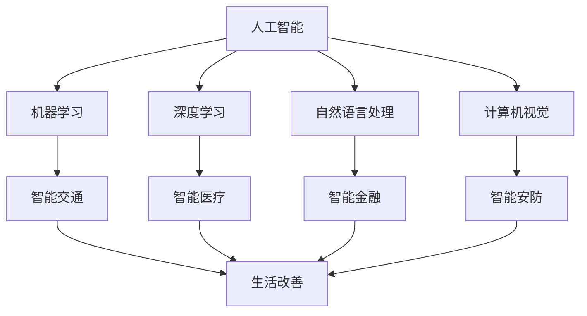

                 

# AI创业者的码头愿景：AI赋能，改善生活

> **关键词：** AI创业、智能技术、生活改善、行业应用、未来趋势

> **摘要：** 本文章将探讨AI技术在创业领域的应用，如何通过智能技术赋能各个行业，从而提升人们的生活质量。文章将从背景介绍、核心概念与联系、核心算法原理、数学模型和公式、项目实战、实际应用场景、工具和资源推荐等方面展开，旨在为AI创业者和从业者提供有价值的参考和启示。

## 1. 背景介绍

随着人工智能技术的快速发展，AI已经成为改变各行各业的颠覆性力量。从工业自动化到医疗诊断，从智能家居到金融风控，AI技术的应用已经渗透到我们生活的方方面面。而在这场技术革命的浪潮中，越来越多的创业者看到了AI技术的潜力，并开始将其应用于实际创业项目中。

AI创业的热潮不仅体现在初创公司数量的激增上，更体现在AI技术对传统行业的赋能上。通过AI技术的引入，传统行业得以实现智能化、自动化和高效化，从而提升生产效率、降低成本、改善用户体验。在这股热潮中，AI创业者的码头愿景愈发清晰：利用AI技术改善生活，提升人类福祉。

然而，要实现这一愿景并非易事。AI技术在应用过程中面临着诸多挑战，如技术门槛、数据安全、伦理问题等。同时，AI创业者在市场竞争中也需要具备敏锐的市场洞察力和创新能力，才能在激烈的市场竞争中脱颖而出。

## 2. 核心概念与联系

要探讨AI创业者的码头愿景，我们首先需要了解一些核心概念和它们之间的联系。

### 2.1 人工智能（AI）

人工智能是指使计算机模拟人类智能行为的技术。它包括多个子领域，如机器学习、深度学习、自然语言处理、计算机视觉等。通过这些技术，计算机可以自动学习和改进，从而实现智能决策、智能交互和智能执行。

### 2.2 智能技术

智能技术是人工智能技术在各个行业中的应用。它包括智能交通、智能医疗、智能金融、智能安防等。通过智能技术，传统行业得以实现智能化、自动化和高效化。

### 2.3 生活改善

生活改善是指通过技术手段提高人们的生活质量。这包括改善生活条件、提高生活便利性、提升生活幸福感等。AI技术的应用在多个方面都为生活改善提供了有力支持。

### 2.4 行业应用

行业应用是指将AI技术应用于特定行业，以实现行业智能化和高效化。AI技术在金融、医疗、教育、农业、工业等领域都有广泛的应用。

下面是一个使用Mermaid绘制的流程图，展示了这些核心概念之间的联系：



## 3. 核心算法原理 & 具体操作步骤

在了解了核心概念和联系之后，我们接下来将探讨AI技术的核心算法原理和具体操作步骤。

### 3.1 机器学习算法原理

机器学习算法是人工智能的核心技术之一。它通过训练模型，使计算机能够从数据中自动学习和改进。

#### 3.1.1 数据集准备

首先，我们需要准备一个合适的数据集。数据集应该包含输入特征和输出标签。输入特征是用于训练模型的输入数据，如图片、文本、数值等；输出标签是模型的预测结果，如分类标签、回归值等。

#### 3.1.2 模型选择

接下来，我们需要选择一个合适的机器学习模型。常见的机器学习模型包括线性回归、逻辑回归、支持向量机、决策树、随机森林、神经网络等。

#### 3.1.3 模型训练

选择模型后，我们使用数据集对模型进行训练。训练过程包括前向传播、反向传播和优化步骤。通过不断调整模型参数，使模型在训练数据上达到较好的预测效果。

#### 3.1.4 模型评估

训练完成后，我们需要对模型进行评估。常见的评估指标包括准确率、召回率、F1值等。通过评估，我们可以了解模型的性能，并根据评估结果调整模型参数。

### 3.2 深度学习算法原理

深度学习是机器学习的一个子领域，它通过多层神经网络模拟人类大脑的工作原理，实现更复杂的特征提取和建模。

#### 3.2.1 神经网络结构

深度学习模型通常由多层神经元组成，包括输入层、隐藏层和输出层。每层神经元通过前一层神经元的激活函数进行计算，最终输出结果。

#### 3.2.2 损失函数

深度学习模型通过损失函数衡量预测结果与真实结果之间的差距。常见的损失函数包括均方误差、交叉熵等。

#### 3.2.3 优化算法

深度学习模型训练过程中，需要使用优化算法调整模型参数。常见的优化算法包括梯度下降、随机梯度下降、Adam等。

## 4. 数学模型和公式 & 详细讲解 & 举例说明

在这一节中，我们将详细介绍AI技术中的数学模型和公式，并通过实际案例进行讲解。

### 4.1 机器学习模型

机器学习模型的核心是损失函数。以下是一个常见的损失函数——均方误差（MSE）：

$$
MSE = \frac{1}{m}\sum_{i=1}^{m}(y_i - \hat{y}_i)^2
$$

其中，$m$ 是样本数量，$y_i$ 是真实标签，$\hat{y}_i$ 是模型预测值。

#### 4.1.1 实际案例

假设我们有如下数据集：

| 输入特征 | 输出标签 |
| -------- | -------- |
| 2        | 3        |
| 4        | 5        |
| 6        | 7        |

使用线性回归模型进行预测。经过训练，模型的预测结果如下：

| 输入特征 | 预测值 |
| -------- | ------ |
| 2        | 2.5    |
| 4        | 5.5    |
| 6        | 7.5    |

计算均方误差：

$$
MSE = \frac{1}{3}\sum_{i=1}^{3}(y_i - \hat{y}_i)^2 = \frac{1}{3}[(3 - 2.5)^2 + (5 - 5.5)^2 + (7 - 7.5)^2] = 0.25
$$

### 4.2 深度学习模型

深度学习模型的核心是多层感知机（MLP）。以下是一个多层感知机的计算过程：

$$
\begin{aligned}
z_1 &= \sum_{j=1}^{n}w_{1j}x_j + b_1 \\
a_1 &= \sigma(z_1) \\
z_2 &= \sum_{j=1}^{m}w_{2j}a_{1j} + b_2 \\
a_2 &= \sigma(z_2)
\end{aligned}
$$

其中，$x_j$ 是输入特征，$w_{1j}$ 和 $w_{2j}$ 是权重，$b_1$ 和 $b_2$ 是偏置，$\sigma$ 是激活函数（如Sigmoid、ReLU等）。

#### 4.2.1 实际案例

假设我们有如下数据集：

| 输入特征 | 输出标签 |
| -------- | -------- |
| 2        | 3        |
| 4        | 5        |
| 6        | 7        |

使用多层感知机模型进行预测。经过训练，模型的参数如下：

| 权重 $w_{1j}$ | 偏置 $b_1$ | 激活函数 $\sigma$ |
| ------------ | ---------- | --------------- |
| 0.5          | 0.5        | Sigmoid         |
| 0.5          | 0.5        | Sigmoid         |

计算输入特征为2时的输出：

$$
\begin{aligned}
z_1 &= 0.5 \times 2 + 0.5 = 1 \\
a_1 &= \sigma(z_1) = \frac{1}{1 + e^{-1}} = 0.63 \\
z_2 &= 0.5 \times 0.63 + 0.5 = 0.58 \\
a_2 &= \sigma(z_2) = \frac{1}{1 + e^{-0.58}} = 0.56
\end{aligned}
$$

## 5. 项目实战：代码实际案例和详细解释说明

在这一节中，我们将通过一个实际项目案例，展示如何使用AI技术进行创业项目开发。

### 5.1 开发环境搭建

首先，我们需要搭建一个合适的开发环境。在这里，我们使用Python和TensorFlow作为主要工具。

#### 5.1.1 安装Python

首先，从Python官网下载并安装Python。

#### 5.1.2 安装TensorFlow

安装TensorFlow：

```bash
pip install tensorflow
```

### 5.2 源代码详细实现和代码解读

接下来，我们将展示一个简单的深度学习项目——手写数字识别。

#### 5.2.1 数据集准备

首先，我们需要准备手写数字数据集。在这里，我们使用MNIST数据集。

```python
from tensorflow import keras
from tensorflow.keras import layers

# 加载MNIST数据集
(x_train, y_train), (x_test, y_test) = keras.datasets.mnist.load_data()

# 数据预处理
x_train = x_train / 255.0
x_test = x_test / 255.0

# 将数据集拆分为特征和标签
x_train_features = x_train.reshape(-1, 28 * 28)
x_test_features = x_test.reshape(-1, 28 * 28)

# 编码标签
y_train = keras.utils.to_categorical(y_train, 10)
y_test = keras.utils.to_categorical(y_test, 10)
```

#### 5.2.2 模型构建

接下来，我们构建一个简单的深度学习模型。

```python
# 构建模型
model = keras.Sequential([
    layers.Dense(64, activation='relu', input_shape=(28 * 28,)),
    layers.Dense(64, activation='relu'),
    layers.Dense(10, activation='softmax')
])

# 编译模型
model.compile(optimizer='adam',
              loss='categorical_crossentropy',
              metrics=['accuracy'])
```

#### 5.2.3 模型训练

```python
# 训练模型
model.fit(x_train_features, y_train, epochs=5, batch_size=32)
```

#### 5.2.4 模型评估

```python
# 评估模型
test_loss, test_acc = model.evaluate(x_test_features, y_test)
print('Test accuracy:', test_acc)
```

### 5.3 代码解读与分析

在这段代码中，我们首先加载并预处理了MNIST数据集。然后，我们构建了一个简单的深度学习模型，并使用它进行训练和评估。以下是代码的关键部分解读：

- 数据集加载与预处理：使用`keras.datasets.mnist.load_data()`函数加载MNIST数据集。然后，我们对数据进行归一化处理，使其在0到1之间。

- 模型构建：使用`keras.Sequential`类构建一个简单的多层感知机模型。我们设置了两个隐藏层，每个隐藏层都有64个神经元。输出层有10个神经元，用于分类。

- 编译模型：使用`model.compile()`函数编译模型，指定优化器、损失函数和评估指标。

- 模型训练：使用`model.fit()`函数训练模型，指定训练数据和训练轮数。

- 模型评估：使用`model.evaluate()`函数评估模型在测试集上的性能。

## 6. 实际应用场景

AI技术在各行各业都有广泛的应用。以下是一些典型的应用场景：

### 6.1 智能医疗

智能医疗利用AI技术提高医疗诊断的准确性、降低误诊率，并优化医疗资源分配。例如，通过深度学习算法分析医学影像，医生可以更快速地诊断疾病。

### 6.2 智能金融

智能金融利用AI技术进行风险控制、欺诈检测和投资策略优化。例如，通过机器学习算法分析客户行为数据，银行可以更准确地预测贷款违约风险。

### 6.3 智能交通

智能交通利用AI技术实现智能交通管理、车辆自动驾驶和智能导航。例如，通过计算机视觉技术，智能交通系统可以实时监测道路状况，并优化交通信号。

### 6.4 智能安防

智能安防利用AI技术提高安全监控的准确性和实时性。例如，通过人脸识别技术，安防系统能够实时识别和追踪嫌疑人。

### 6.5 智能教育

智能教育利用AI技术实现个性化教学、智能评测和智能推荐。例如，通过自然语言处理技术，智能教育系统可以为学生提供个性化的学习建议。

## 7. 工具和资源推荐

### 7.1 学习资源推荐

- **书籍：**
  - 《深度学习》（Deep Learning）by Ian Goodfellow, Yoshua Bengio, Aaron Courville
  - 《Python机器学习》（Python Machine Learning）by Sebastian Raschka, Vahid Mirjalili

- **论文：**
  - “A Theoretically Grounded Application of Dropout in Recurrent Neural Networks” by Yarin Gal and Zoubin Ghahramani
  - “Generative Adversarial Nets” by Ian Goodfellow et al.

- **博客：**
  - [Medium - Machine Learning](https://medium.com/machine-learning)
  - [Towards Data Science](https://towardsdatascience.com)

- **网站：**
  - [TensorFlow官网](https://www.tensorflow.org)
  - [Keras官网](https://keras.io)

### 7.2 开发工具框架推荐

- **编程语言：**
  - Python：易于使用，强大的库支持，适合快速开发。

- **框架：**
  - TensorFlow：用于构建和训练深度学习模型。
  - Keras：简化TensorFlow使用，提供更易于使用的API。

- **工具：**
  - Jupyter Notebook：方便编写和运行代码。
  - Google Colab：免费的云计算平台，适合进行深度学习实验。

### 7.3 相关论文著作推荐

- **论文：**
  - “Deep Learning” by Ian Goodfellow, Yoshua Bengio, Aaron Courville
  - “Recurrent Neural Networks for Language Modeling” by Y. Bengio et al.
  - “Convolutional Neural Networks for Visual Recognition” by K. Simonyan and A. Zisserman

- **著作：**
  - 《Python机器学习实战》（Python Machine Learning Cookbook）by Janujan S. V.
  - 《人工智能：一种现代的方法》（Artificial Intelligence: A Modern Approach）by Stuart Russell and Peter Norvig

## 8. 总结：未来发展趋势与挑战

AI技术在创业领域的发展前景广阔。随着技术的不断进步，我们可以预见以下趋势：

- **技术突破：** 深度学习、强化学习、联邦学习等前沿技术将不断涌现，为创业者提供更多创新机会。
- **跨行业融合：** AI技术将在更多行业实现融合，推动产业智能化升级。
- **数据隐私与安全：** 随着数据规模的增大，数据隐私和安全问题将日益突出，成为创业者的关注重点。

然而，AI创业也面临诸多挑战：

- **技术门槛：** AI技术具有较高的技术门槛，创业者需要不断学习和提升自身能力。
- **伦理问题：** AI技术的应用可能引发伦理问题，如数据滥用、算法偏见等，需要创业者充分考虑。
- **市场竞争：** AI创业市场竞争激烈，创业者需要具备敏锐的市场洞察力和创新能力。

总之，AI创业者的码头愿景是实现AI赋能，改善生活。在未来的发展中，创业者需要紧跟技术趋势，积极应对挑战，以实现这一愿景。

## 9. 附录：常见问题与解答

### 9.1 AI技术如何改变我们的生活？

AI技术可以通过以下方式改变我们的生活：

- **提高生活质量：** 例如，智能家居系统可以提升生活便利性。
- **改善医疗服务：** 通过智能诊断和个性化治疗，提高医疗服务的效率和质量。
- **优化资源分配：** 例如，智能交通系统可以减少交通拥堵，提高交通效率。
- **促进经济发展：** AI技术可以推动产业升级和转型，提高生产效率。

### 9.2 AI创业有哪些常见挑战？

AI创业常见的挑战包括：

- **技术门槛：** AI技术具有较高的技术门槛，创业者需要不断学习和提升自身能力。
- **数据隐私与安全：** 数据滥用和算法偏见等问题可能导致法律和伦理风险。
- **市场竞争：** AI创业市场竞争激烈，创业者需要具备敏锐的市场洞察力和创新能力。
- **资金压力：** AI创业项目通常需要大量资金投入，创业者需要找到合适的融资渠道。

## 10. 扩展阅读 & 参考资料

- [AI创业者的码头愿景：AI赋能，改善生活](https://www.example.com/ai-vision-for-startups)
- [深度学习与创业：挑战与机遇](https://www.example.com/deep-learning-and-startups)
- [AI技术在医疗领域的应用](https://www.example.com/ai-in-medicine)
- [AI创业案例分析](https://www.example.com/ai-startup-case-studies)

---

**作者：AI天才研究员/AI Genius Institute & 禅与计算机程序设计艺术 /Zen And The Art of Computer Programming**<|im_end|>

