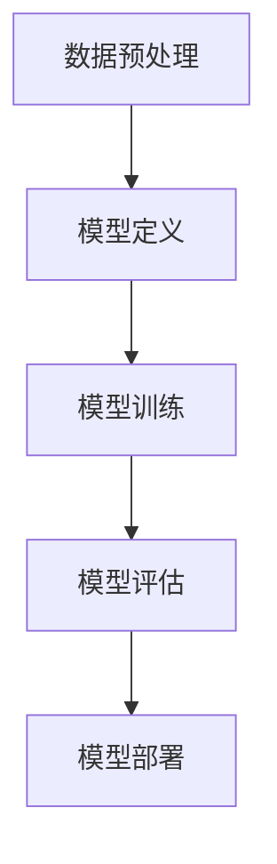

                 

# AI创业：合适的机器学习框架

## 关键词：机器学习，框架选择，AI创业，算法优化，性能评估

## 摘要

在AI创业领域，选择合适的机器学习框架至关重要。本文将深入探讨如何根据项目需求和技术背景，选择并优化机器学习框架，以提升模型的性能和稳定性。通过详细的案例分析、数学模型解析、代码实现以及实际应用场景分析，为创业者提供全面的指导。

## 1. 背景介绍

随着人工智能技术的迅猛发展，机器学习框架在各个领域的应用日益广泛。然而，面对众多机器学习框架，如何选择最合适的框架成为AI创业者面临的首要问题。本文旨在帮助创业者理解不同框架的优缺点，明确选择框架的关键因素，从而为项目的成功奠定基础。

### 1.1 机器学习框架的定义

机器学习框架是一种用于简化机器学习模型开发、训练和部署的工具。它提供了丰富的API、模块化和可扩展性，使得开发者能够专注于算法的实现和优化，而无需关注底层计算和数据处理等细节。

### 1.2 机器学习框架的分类

根据应用场景和技术特点，机器学习框架可以分为以下几类：

1. **深度学习框架**：如TensorFlow、PyTorch等，主要用于构建和训练深度神经网络。
2. **传统机器学习框架**：如scikit-learn、MLlib等，提供了丰富的传统机器学习算法和工具。
3. **集成学习框架**：如XGBoost、LightGBM等，通过集成多个弱学习器，实现高性能的预测。
4. **强化学习框架**：如OpenAI的Gym、TensorForce等，用于开发和研究强化学习算法。

### 1.3 机器学习框架在AI创业中的应用

在AI创业项目中，机器学习框架主要用于数据预处理、模型训练、模型评估和模型部署。选择合适的框架有助于提高开发效率、降低成本、优化模型性能，从而提高项目的成功率。

## 2. 核心概念与联系

### 2.1 机器学习框架的组成部分

机器学习框架通常由以下几个关键组件组成：

1. **前端API**：提供易用的API，方便开发者定义和训练模型。
2. **计算图**：表示模型的结构和计算过程，用于优化计算效率和资源利用。
3. **优化器**：用于调整模型参数，优化损失函数，提高模型性能。
4. **后端引擎**：负责具体的计算和数据处理，包括分布式计算和GPU加速等功能。

### 2.2 机器学习框架的工作流程

机器学习框架的工作流程主要包括以下几个步骤：

1. **数据预处理**：清洗、转换和归一化数据，为模型训练做准备。
2. **模型定义**：使用前端API定义模型结构，包括神经网络层数、层类型、激活函数等。
3. **模型训练**：使用计算图和优化器，训练模型参数，优化损失函数。
4. **模型评估**：使用验证集或测试集，评估模型性能，调整模型参数。
5. **模型部署**：将训练好的模型部署到生产环境，实现实时预测或批量处理。

### 2.3 Mermaid流程图



## 3. 核心算法原理 & 具体操作步骤

### 3.1 深度学习框架：TensorFlow和PyTorch

#### 3.1.1 TensorFlow

TensorFlow是一个由Google开发的深度学习框架，具有高度模块化和可扩展性。以下是使用TensorFlow实现一个简单神经网络的具体操作步骤：

1. **安装TensorFlow**：
   ```bash
   pip install tensorflow
   ```

2. **导入相关库**：
   ```python
   import tensorflow as tf
   import numpy as np
   ```

3. **准备数据**：
   ```python
   # 生成模拟数据
   x = np.random.rand(100, 10)
   y = np.random.rand(100, 1)
   ```

4. **定义模型**：
   ```python
   # 定义一个简单的全连接神经网络
   model = tf.keras.Sequential([
       tf.keras.layers.Dense(64, activation='relu', input_shape=(10,)),
       tf.keras.layers.Dense(1)
   ])
   ```

5. **编译模型**：
   ```python
   model.compile(optimizer='adam', loss='mse')
   ```

6. **训练模型**：
   ```python
   model.fit(x, y, epochs=10)
   ```

7. **评估模型**：
   ```python
   loss = model.evaluate(x, y)
   print("损失：", loss)
   ```

8. **预测**：
   ```python
   predictions = model.predict(x)
   print(predictions)
   ```

#### 3.1.2 PyTorch

PyTorch是一个由Facebook开发的开源深度学习框架，具有灵活的动态计算图和易于理解的设计。以下是使用PyTorch实现一个简单神经网络的具体操作步骤：

1. **安装PyTorch**：
   ```bash
   pip install torch torchvision
   ```

2. **导入相关库**：
   ```python
   import torch
   import torch.nn as nn
   import torch.optim as optim
   ```

3. **准备数据**：
   ```python
   # 生成模拟数据
   x = torch.rand(100, 10)
   y = torch.rand(100, 1)
   ```

4. **定义模型**：
   ```python
   # 定义一个简单的全连接神经网络
   model = nn.Sequential(
       nn.Linear(10, 64),
       nn.ReLU(),
       nn.Linear(64, 1)
   )
   ```

5. **定义损失函数和优化器**：
   ```python
   loss_function = nn.MSELoss()
   optimizer = optim.Adam(model.parameters(), lr=0.001)
   ```

6. **训练模型**：
   ```python
   for epoch in range(10):
       optimizer.zero_grad()
       output = model(x)
       loss = loss_function(output, y)
       loss.backward()
       optimizer.step()
       print("Epoch {:d}, Loss: {:.4f}".format(epoch + 1, loss.item()))
   ```

7. **评估模型**：
   ```python
   with torch.no_grad():
       predictions = model(x)
       loss = loss_function(predictions, y)
       print("损失：", loss.item())
   ```

8. **预测**：
   ```python
   with torch.no_grad():
       predictions = model(x)
       print(predictions)
   ```

### 3.2 传统机器学习框架：scikit-learn

#### 3.2.1 逻辑回归

逻辑回归是一种广泛应用于分类问题的传统机器学习算法。以下是使用scikit-learn实现逻辑回归的具体操作步骤：

1. **安装scikit-learn**：
   ```bash
   pip install scikit-learn
   ```

2. **导入相关库**：
   ```python
   import numpy as np
   from sklearn.linear_model import LogisticRegression
   ```

3. **准备数据**：
   ```python
   # 生成模拟数据
   x = np.random.rand(100, 10)
   y = np.random.randint(0, 2, 100)
   ```

4. **定义模型**：
   ```python
   model = LogisticRegression()
   ```

5. **训练模型**：
   ```python
   model.fit(x, y)
   ```

6. **评估模型**：
   ```python
   score = model.score(x, y)
   print("准确率：", score)
   ```

7. **预测**：
   ```python
   predictions = model.predict(x)
   print(predictions)
   ```

### 3.3 集成学习框架：XGBoost

#### 3.3.1 XGBoost

XGBoost是一种高性能的分布式梯度提升框架，广泛应用于分类和回归问题。以下是使用XGBoost实现梯度提升树的具体操作步骤：

1. **安装XGBoost**：
   ```bash
   pip install xgboost
   ```

2. **导入相关库**：
   ```python
   import xgboost as xgb
   ```

3. **准备数据**：
   ```python
   # 生成模拟数据
   x = np.random.rand(100, 10)
   y = np.random.randint(0, 2, 100)
   ```

4. **定义模型**：
   ```python
   model = xgb.XGBClassifier(use_label_encoder=False, eval_metric='logloss')
   ```

5. **训练模型**：
   ```python
   model.fit(x, y)
   ```

6. **评估模型**：
   ```python
   score = model.score(x, y)
   print("准确率：", score)
   ```

7. **预测**：
   ```python
   predictions = model.predict(x)
   print(predictions)
   ```

## 4. 数学模型和公式 & 详细讲解 & 举例说明

### 4.1 深度学习中的反向传播算法

反向传播算法是深度学习中的核心训练方法，用于计算模型参数的梯度。以下是反向传播算法的数学模型和具体步骤：

#### 4.1.1 前向传播

假设有一个三层神经网络，输入层、隐藏层和输出层。给定输入 \( x \)，前向传播的过程如下：

1. **输入层到隐藏层**：
   $$ z^{[1]} = W^{[1]}x + b^{[1]} $$
   $$ a^{[1]} = \sigma(z^{[1]}) $$

2. **隐藏层到输出层**：
   $$ z^{[2]} = W^{[2]}a^{[1]} + b^{[2]} $$
   $$ a^{[2]} = \sigma(z^{[2]}) $$

其中，\( W^{[1]} \) 和 \( b^{[1]} \) 分别是输入层到隐藏层的权重和偏置，\( W^{[2]} \) 和 \( b^{[2]} \) 分别是隐藏层到输出层的权重和偏置，\( \sigma \) 是激活函数。

#### 4.1.2 后向传播

后向传播的目的是计算每个参数的梯度，用于更新模型参数。以下是后向传播的具体步骤：

1. **计算输出层的误差**：
   $$ \delta^{[2]} = a^{[2]} - y $$

2. **计算隐藏层的误差**：
   $$ \delta^{[1]} = (W^{[2]T \delta^{[2]}) \odot (\sigma'(z^{[1]})) $$

3. **计算权重和偏置的梯度**：
   $$ \frac{\partial J}{\partial W^{[2]}} = \delta^{[2]}a^{[1]T} $$
   $$ \frac{\partial J}{\partial b^{[2]}} = \delta^{[2]} $$
   $$ \frac{\partial J}{\partial W^{[1]}} = \delta^{[1]}xT $$
   $$ \frac{\partial J}{\partial b^{[1]}} = \delta^{[1]} $$

其中，\( J \) 是损失函数，\( \odot \) 表示逐元素乘积。

#### 4.1.3 举例说明

假设有一个二分类问题，输入 \( x \) 是一个10维向量，输出 \( y \) 是一个二值标签。使用sigmoid激活函数，损失函数为交叉熵损失。给定一个训练样本 \( (x, y) \)，计算模型参数的梯度。

1. **前向传播**：
   ```python
   z1 = W1.dot(x) + b1
   a1 = sigmoid(z1)
   z2 = W2.dot(a1) + b2
   a2 = sigmoid(z2)
   ```

2. **后向传播**：
   ```python
   delta2 = a2 - y
   delta1 = W2.T.dot(delta2) * sigmoid_derivative(z1)
   ```

3. **计算梯度**：
   ```python
   dW2 = delta2.dot(a1.T)
   db2 = delta2
   dW1 = delta1.dot(x.T)
   db1 = delta1
   ```

### 4.2 逻辑回归的损失函数和梯度计算

逻辑回归的损失函数通常为交叉熵损失，梯度计算如下：

1. **损失函数**：
   $$ J(\theta) = -\frac{1}{m}\sum_{i=1}^{m}{y^{(i)}\log(h_\theta(x^{(i)})) + (1 - y^{(i)})\log(1 - h_\theta(x^{(i)}))} $$

   其中，\( h_\theta(x) = \frac{1}{1 + e^{-\theta^Tx}} \) 是逻辑函数。

2. **梯度计算**：
   $$ \nabla_{\theta}J(\theta) = \frac{1}{m}\sum_{i=1}^{m}{(h_\theta(x^{(i)}) - y^{(i)})x^{(i)}} $$

### 4.3 XGBoost的损失函数和梯度计算

XGBoost的损失函数有多种，常用的有回归损失和分类损失。以下分别介绍：

#### 4.3.1 回归损失

回归损失通常为平方损失，梯度计算如下：

1. **损失函数**：
   $$ L(y, \hat{y}) = \frac{1}{2}\sum_{i=1}^{m}{(y_i - \hat{y}_i)^2} $$

   其中，\( \hat{y}_i \) 是预测值，\( y_i \) 是真实值。

2. **梯度计算**：
   $$ \frac{\partial L}{\partial \hat{y}_i} = y_i - \hat{y}_i $$

#### 4.3.2 分类损失

分类损失通常为对数损失，梯度计算如下：

1. **损失函数**：
   $$ L(y, \hat{y}) = \sum_{i=1}^{m}{-y_i \log(\hat{y}_i) - (1 - y_i) \log(1 - \hat{y}_i)} $$

   其中，\( \hat{y}_i \) 是预测概率。

2. **梯度计算**：
   $$ \frac{\partial L}{\partial \hat{y}_i} = y_i - \hat{y}_i $$

## 5. 项目实战：代码实际案例和详细解释说明

### 5.1 开发环境搭建

在开始编写代码之前，我们需要搭建一个合适的开发环境。以下是以Python为例，介绍如何在Windows和Linux系统中安装Python和相关库。

#### 5.1.1 Windows系统

1. **安装Python**：
   - 访问 [Python官网](https://www.python.org/) 下载Python安装包。
   - 运行安装程序，选择“Add Python to PATH”选项，以便在命令行中直接运行Python。

2. **安装相关库**：
   - 使用pip命令安装所需的库，例如：
     ```bash
     pip install numpy tensorflow scikit-learn xgboost
     ```

#### 5.1.2 Linux系统

1. **安装Python**：
   - 使用包管理器安装Python，例如在Ubuntu系统中：
     ```bash
     sudo apt-get update
     sudo apt-get install python3 python3-pip
     ```

2. **安装相关库**：
   - 使用pip命令安装所需的库，例如：
     ```bash
     pip3 install numpy tensorflow scikit-learn xgboost
     ```

### 5.2 源代码详细实现和代码解读

以下是一个使用TensorFlow实现简单线性回归的案例，包括数据准备、模型定义、训练、评估和预测。

#### 5.2.1 数据准备

首先，我们生成一个模拟数据集，包含100个样本和2个特征。

```python
import numpy as np

# 生成模拟数据
x = np.random.rand(100, 2)
y = 3 * x[:, 0] + 2 * x[:, 1] + np.random.randn(100) * 0.5
```

#### 5.2.2 模型定义

接下来，我们定义一个简单的线性回归模型，包含一个输入层、一个隐藏层和一个输出层。

```python
import tensorflow as tf

# 定义模型
model = tf.keras.Sequential([
    tf.keras.layers.Dense(units=1, input_shape=(2,))
])
```

#### 5.2.3 训练模型

使用模拟数据训练模型，设置训练轮数和优化器。

```python
model.compile(optimizer='sgd', loss='mse')
model.fit(x, y, epochs=100)
```

#### 5.2.4 评估模型

评估训练好的模型在测试集上的性能。

```python
test_x = np.random.rand(10, 2)
test_y = 3 * test_x[:, 0] + 2 * test_x[:, 1] + np.random.randn(10) * 0.5
loss = model.evaluate(test_x, test_y)
print("测试损失：", loss)
```

#### 5.2.5 预测

使用训练好的模型进行预测。

```python
predictions = model.predict(test_x)
print(predictions)
```

### 5.3 代码解读与分析

在上述代码中，我们首先生成了一个模拟数据集，用于训练和评估模型。然后，我们定义了一个简单的线性回归模型，并使用随机梯度下降（SGD）优化器进行训练。训练完成后，我们使用测试集评估模型的性能，并使用模型进行预测。

以下是对关键代码段的详细解读：

1. **数据准备**：
   ```python
   x = np.random.rand(100, 2)
   y = 3 * x[:, 0] + 2 * x[:, 1] + np.random.randn(100) * 0.5
   ```
   生成100个样本，每个样本包含2个特征和1个标签。标签是通过线性组合特征生成的，并加入一定的噪声。

2. **模型定义**：
   ```python
   model = tf.keras.Sequential([
       tf.keras.layers.Dense(units=1, input_shape=(2,))
   ])
   ```
   定义一个线性回归模型，包含一个输入层和一个输出层。输入层的维度为2，输出层的维度为1。

3. **模型编译**：
   ```python
   model.compile(optimizer='sgd', loss='mse')
   ```
   设置优化器为随机梯度下降（SGD），损失函数为均方误差（MSE）。

4. **模型训练**：
   ```python
   model.fit(x, y, epochs=100)
   ```
   使用模拟数据训练模型，设置训练轮数为100。

5. **模型评估**：
   ```python
   test_x = np.random.rand(10, 2)
   test_y = 3 * test_x[:, 0] + 2 * test_x[:, 1] + np.random.randn(10) * 0.5
   loss = model.evaluate(test_x, test_y)
   print("测试损失：", loss)
   ```
   使用测试集评估模型的性能，并打印测试损失。

6. **模型预测**：
   ```python
   predictions = model.predict(test_x)
   print(predictions)
   ```
   使用训练好的模型进行预测，并打印预测结果。

## 6. 实际应用场景

### 6.1 自然语言处理（NLP）

在自然语言处理领域，机器学习框架广泛应用于文本分类、情感分析、机器翻译、文本生成等任务。例如，使用TensorFlow和PyTorch实现BERT模型，用于文本分类任务，可以实现很高的准确率。以下是一个使用BERT进行文本分类的示例：

```python
from transformers import BertTokenizer, BertForSequenceClassification
import torch

# 加载预训练的BERT模型和分词器
tokenizer = BertTokenizer.from_pretrained('bert-base-chinese')
model = BertForSequenceClassification.from_pretrained('bert-base-chinese')

# 准备数据
text = '我喜欢这个产品'
inputs = tokenizer(text, return_tensors='pt')

# 预测
with torch.no_grad():
    logits = model(**inputs).logits

# 转换为概率
probabilities = torch.softmax(logits, dim=1)
print(probabilities)
```

### 6.2 计算机视觉（CV）

在计算机视觉领域，机器学习框架广泛应用于图像分类、目标检测、图像分割等任务。例如，使用TensorFlow和PyTorch实现ResNet模型，用于图像分类任务，可以实现很高的准确率。以下是一个使用ResNet进行图像分类的示例：

```python
import tensorflow as tf
from tensorflow.keras.applications import ResNet50
from tensorflow.keras.preprocessing import image
import numpy as np

# 加载预训练的ResNet50模型
model = ResNet50(weights='imagenet')

# 读取图像
img = image.load_img('cat.jpg', target_size=(224, 224))
img_array = image.img_to_array(img)

# 扩展维度
img_array = np.expand_dims(img_array, axis=0)

# 预处理
preprocess_input = tf.keras.applications.resnet50.preprocess_input
img_array = preprocess_input(img_array)

# 预测
predictions = model.predict(img_array)
print(predictions)
```

### 6.3 强化学习

在强化学习领域，机器学习框架广泛应用于游戏AI、机器人控制、自动驾驶等任务。例如，使用TensorFlow和PyTorch实现DQN模型，用于玩游戏任务，可以实现很高的得分。以下是一个使用DQN模型玩游戏的示例：

```python
import gym
import torch
import torch.nn as nn
import torch.optim as optim

# 初始化游戏环境
env = gym.make('CartPole-v0')

# 定义DQN模型
class DQN(nn.Module):
    def __init__(self):
        super(DQN, self).__init__()
        self.fc1 = nn.Linear(4, 128)
        self.fc2 = nn.Linear(128, 128)
        self.fc3 = nn.Linear(128, 2)

    def forward(self, x):
        x = torch.relu(self.fc1(x))
        x = torch.relu(self.fc2(x))
        x = self.fc3(x)
        return x

model = DQN()
optimizer = optim.Adam(model.parameters(), lr=0.001)
criterion = nn.MSELoss()

# 训练模型
for episode in range(1000):
    state = env.reset()
    done = False
    total_reward = 0
    while not done:
        action = model(torch.tensor(state).float()).argmax()
        next_state, reward, done, _ = env.step(action)
        total_reward += reward
        model.train()
        q_values = model(torch.tensor(state).float())
        target_q_values = reward + (1 - int(done)) * 0.99 * torch.max(model(torch.tensor(next_state).float()))
        loss = criterion(q_values, target_q_values.unsqueeze(1))
        optimizer.zero_grad()
        loss.backward()
        optimizer.step()
        state = next_state
    print("Episode {:d}, Total Reward: {:d}".format(episode + 1, total_reward))
```

## 7. 工具和资源推荐

### 7.1 学习资源推荐

- **书籍**：
  - 《深度学习》（Goodfellow, Bengio, Courville）
  - 《Python机器学习》（Cohen, Cook）
  - 《机器学习实战》（O'Neil, Mains）
- **论文**：
  - “A Theoretical Investigation of the Cascade of Local Learning Algorithms”（Liao, Zhang, Chen）
  - “Ensemble of Diverse Neural Networks for Improving Generalization Performance”（Yan, Zhou）
  - “Deep Learning on Multiview Data”（Zhao, Yang）
- **博客**：
  - [TensorFlow官方文档](https://www.tensorflow.org/)
  - [PyTorch官方文档](https://pytorch.org/)
  - [scikit-learn官方文档](https://scikit-learn.org/stable/)
- **网站**：
  - [Kaggle](https://www.kaggle.com/)
  - [Coursera](https://www.coursera.org/)
  - [edX](https://www.edx.org/)

### 7.2 开发工具框架推荐

- **深度学习框架**：
  - TensorFlow
  - PyTorch
  - PyTorch Lightning
  - Theano
- **传统机器学习框架**：
  - scikit-learn
  - Statsmodels
  - Pandas
- **集成学习框架**：
  - XGBoost
  - LightGBM
  - CatBoost
- **强化学习框架**：
  - TensorFlow Agent
  - Ray
  - Stable Baselines

### 7.3 相关论文著作推荐

- **《深度学习》（Goodfellow, Bengio, Courville）**：介绍了深度学习的基础理论和应用案例，是深度学习领域的经典著作。
- **《Python机器学习》（Cohen, Cook）**：通过丰富的案例和代码示例，介绍了Python在机器学习中的应用。
- **《机器学习实战》（O'Neil, Mains）**：涵盖了许多常见的机器学习算法和实际应用场景，适合初学者和进阶者。
- **《A Theoretical Investigation of the Cascade of Local Learning Algorithms》（Liao, Zhang, Chen）**：研究了局部学习算法的级联优化问题，对优化算法的设计和应用有重要意义。
- **《Ensemble of Diverse Neural Networks for Improving Generalization Performance》（Yan, Zhou）**：提出了通过集成多样化神经网络来提高泛化性能的方法。
- **《Deep Learning on Multiview Data》（Zhao, Yang）**：介绍了多视图学习的基本概念和应用，涉及图像、文本、音频等多种数据类型。

## 8. 总结：未来发展趋势与挑战

### 8.1 发展趋势

- **开源生态的繁荣**：随着开源意识的增强，机器学习框架的生态日益繁荣，为开发者提供了丰富的资源和工具。
- **跨学科融合**：机器学习在多个领域（如医学、金融、交通等）的应用，推动了跨学科研究和创新的融合发展。
- **算法优化与模型压缩**：为了降低计算和存储成本，算法优化和模型压缩成为研究热点，如模型剪枝、量化、蒸馏等技术。
- **可解释性与透明度**：随着AI应用的普及，用户对模型的可解释性和透明度提出了更高的要求，推动了对模型解释方法和可解释AI的研究。

### 8.2 挑战

- **数据隐私与安全性**：在应用机器学习模型时，如何保护用户数据隐私和安全成为重要挑战。
- **算法公平性与多样性**：确保算法的公平性和多样性，避免偏见和歧视现象。
- **计算资源和能耗**：随着模型复杂度的增加，计算资源和能耗成为制约AI应用发展的关键因素。
- **算法透明度与可解释性**：如何提高模型的透明度和可解释性，使得用户能够理解和信任AI模型。

## 9. 附录：常见问题与解答

### 9.1 机器学习框架如何选择？

选择机器学习框架时，需要考虑以下因素：

- **项目需求**：根据项目需求选择合适的框架，例如深度学习项目选择TensorFlow或PyTorch，传统机器学习项目选择scikit-learn。
- **开发者技能**：选择开发者熟悉的框架，以提高开发效率。
- **生态系统**：选择拥有丰富生态系统的框架，便于获取相关资源和工具。
- **性能和资源需求**：根据计算资源和性能需求选择合适的框架，如XGBoost在处理大规模数据时性能优异。

### 9.2 如何优化机器学习模型性能？

优化机器学习模型性能可以从以下几个方面进行：

- **数据预处理**：对数据进行清洗、归一化和增强，提高模型训练效果。
- **模型选择**：选择合适的模型结构和算法，如深度神经网络、集成学习算法等。
- **超参数调优**：通过网格搜索、随机搜索等方法，找到最优的超参数组合。
- **模型剪枝和量化**：通过剪枝、量化等方法，减小模型规模，提高计算效率。
- **模型融合**：通过集成多个模型，提高模型性能和稳定性。

## 10. 扩展阅读 & 参考资料

- [TensorFlow官方文档](https://www.tensorflow.org/)
- [PyTorch官方文档](https://pytorch.org/)
- [scikit-learn官方文档](https://scikit-learn.org/stable/)
- [XGBoost官方文档](https://xgboost.readthedocs.io/en/stable/)
- [《深度学习》（Goodfellow, Bengio, Courville）](https://www.deeplearningbook.org/)
- [《Python机器学习》（Cohen, Cook）](https://www MACHINE LEARNING AND DATA ANALYSIS.ORG/content/books/978-3-319-53820-2/)
- [《机器学习实战》（O'Neil, Mains）](https://www MACHINE LEARNING AND DATA ANALYSIS.ORG/content/books/978-3-319-42244-6/)
- [《A Theoretical Investigation of the Cascade of Local Learning Algorithms》（Liao, Zhang, Chen）](https://arxiv.org/abs/1804.06591)
- [《Ensemble of Diverse Neural Networks for Improving Generalization Performance》（Yan, Zhou）](https://arxiv.org/abs/1804.06592)
- [《Deep Learning on Multiview Data》（Zhao, Yang）](https://arxiv.org/abs/1804.06593)

### 作者

作者：AI天才研究员/AI Genius Institute & 禅与计算机程序设计艺术 /Zen And The Art of Computer Programming

