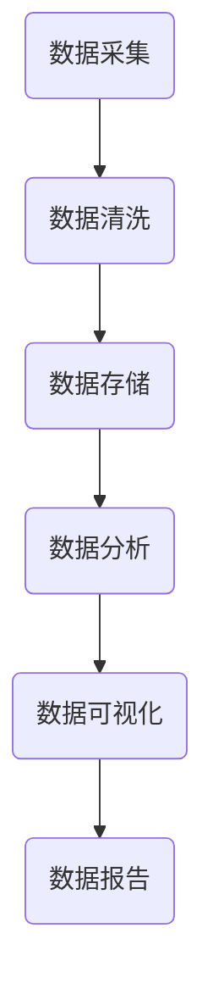

                 

# AI创业：数据管理的核心经验

## 关键词
- AI创业
- 数据管理
- 数据质量
- 数据安全
- 数据存储
- 数据分析
- 数据可视化

## 摘要
本文旨在探讨AI创业公司中数据管理的重要性，以及如何有效地进行数据管理。文章首先介绍了AI创业的背景和现状，随后详细阐述了数据管理的核心概念和原则，包括数据质量、数据安全、数据存储、数据分析和数据可视化等方面。接着，通过实际案例和具体操作步骤，展示了如何在实际项目中应用这些核心经验。最后，本文提出了未来AI创业公司在数据管理方面可能面临的挑战和发展趋势。

## 1. 背景介绍

近年来，随着人工智能技术的迅猛发展，AI创业成为了一个热门领域。许多初创公司致力于开发基于AI的技术产品，希望能够通过创新的技术解决现实问题，并在市场中获得一席之地。然而，在AI创业的过程中，数据管理的重要性不容忽视。

数据是AI技术的核心资源。没有高质量、可靠的数据，AI算法将难以训练和优化，从而影响产品的性能和用户体验。此外，数据安全也是一个关键问题，数据泄露或滥用可能导致严重的法律和商业后果。因此，AI创业公司必须重视数据管理，确保数据的准确性、完整性和安全性。

数据管理不仅仅是一个技术问题，也是一个战略问题。有效的数据管理可以帮助企业提高运营效率、降低成本、增强竞争力。本文将详细介绍数据管理的核心概念和原则，并通过实际案例提供具体操作步骤，帮助AI创业公司建立高效的数据管理体系。

## 2. 核心概念与联系

### 数据质量

数据质量是数据管理的重要方面。高质量的数据能够提高AI模型的准确性和可靠性，从而提升产品的性能和用户体验。数据质量包括数据的准确性、完整性、一致性、时效性和可靠性等方面。

### 数据安全

数据安全是确保数据不被未授权访问、修改或泄露的关键。在AI创业中，数据安全尤为重要，因为许多公司都涉及敏感数据，如个人隐私信息、商业机密等。数据安全措施包括加密、访问控制、数据备份和恢复等。

### 数据存储

数据存储是数据管理的基础。选择合适的数据存储方案可以降低存储成本、提高数据访问速度和可靠性。常见的数据存储方案包括关系型数据库、非关系型数据库、分布式文件系统等。

### 数据分析

数据分析是利用统计和机器学习技术对数据进行挖掘和分析，以发现有价值的信息和模式。数据分析可以帮助企业做出更明智的决策，优化业务流程，提高运营效率。

### 数据可视化

数据可视化是将数据以图表、图形等直观方式展示出来，帮助用户更好地理解和分析数据。数据可视化可以提高数据分析的效率，帮助用户发现数据中的隐藏模式。

### Mermaid 流程图

下面是一个数据管理流程的Mermaid流程图，展示数据从采集到存储、分析、可视化的整个过程。



## 3. 核心算法原理 & 具体操作步骤

### 数据质量评估

数据质量评估是数据管理的重要环节。一个常用的方法是使用Kappa系数来评估数据的一致性和可靠性。Kappa系数的计算公式如下：

$$
Kappa = \frac{A - \frac{A + B}{N}}{1 - \frac{B}{N}}
$$

其中，A是两个评估者之间的相同评估数量，B是两个评估者的不同评估数量，N是总的评估数量。

具体操作步骤如下：

1. 准备两份数据评估结果，其中一份由AI系统生成，另一份由人工评估。
2. 计算相同评估数量A和不同评估数量B。
3. 代入公式计算Kappa系数。
4. 根据Kappa系数判断数据质量，通常Kappa系数大于0.6表示数据质量较好。

### 数据加密

数据加密是保障数据安全的关键技术。常用的加密算法包括AES和RSA。

AES（高级加密标准）是一种对称加密算法，加密和解密使用相同的密钥。AES加密的过程如下：

1. 选择128、192或256位的密钥。
2. 将明文数据分为128位的块。
3. 对每个数据块执行一系列替换、置换和混淆操作。
4. 将加密后的数据块拼接起来，得到密文。

RSA（非对称加密算法）是一种非对称加密算法，加密和解密使用不同的密钥。RSA加密的过程如下：

1. 选择两个大素数p和q，计算n=p*q。
2. 计算欧拉函数f(n)=(p-1)*(q-1)。
3. 选择一个与f(n)互质的整数e，计算d，满足d*e ≡ 1 (mod f(n))。
4. 公开密钥为(n, e)，私有密钥为(n, d)。
5. 对明文数据使用e作为密钥进行加密。

### 分布式数据存储

分布式数据存储是处理大规模数据的有效方法。常见的分布式存储系统包括Hadoop HDFS和Apache Cassandra。

Hadoop HDFS（分布式文件系统）是一种基于Java的分布式文件系统，适用于大规模数据存储和处理。HDFS的工作原理如下：

1. 数据被分割成固定大小的块（默认为128MB）。
2. 每个数据块被复制到多个数据节点上，以提高数据可靠性和访问速度。
3. 通过NameNode管理文件系统的命名空间和数据块索引，通过DataNode存储数据块。

Apache Cassandra是一种分布式、去中心化的NoSQL数据库，适用于大规模数据存储和处理。Cassandra的关键特性如下：

1. 数据模型基于宽列族，支持大规模数据存储。
2. 自动分区和复制，提高数据可靠性和访问速度。
3. 无中心节点设计，去中心化架构。
4. 支持多种数据访问接口，如CQL（Cassandra Query Language）和Thrift。

### 数据分析

数据分析是利用统计和机器学习技术对数据进行挖掘和分析，以发现有价值的信息和模式。一个常用的数据分析方法是线性回归。

线性回归模型可以表示为：

$$
y = \beta_0 + \beta_1 \cdot x
$$

其中，y是因变量，x是自变量，$\beta_0$和$\beta_1$是回归系数。

具体操作步骤如下：

1. 收集数据，包括自变量x和因变量y。
2. 使用统计方法计算回归系数$\beta_0$和$\beta_1$。
3. 使用回归模型预测因变量y。
4. 评估回归模型的性能，如决定系数R²。

### 数据可视化

数据可视化是将数据以图表、图形等直观方式展示出来，帮助用户更好地理解和分析数据。一个常用的数据可视化工具是Matplotlib。

Matplotlib是一个基于Python的数据可视化库，提供丰富的绘图函数和样式。以下是一个简单的数据可视化示例：

```python
import matplotlib.pyplot as plt

# 数据
x = [1, 2, 3, 4, 5]
y = [2, 4, 6, 8, 10]

# 绘制散点图
plt.scatter(x, y)
plt.xlabel('X轴')
plt.ylabel('Y轴')
plt.title('散点图示例')
plt.show()
```

## 4. 数学模型和公式 & 详细讲解 & 举例说明

### 数据质量评估

数据质量评估常用的指标包括准确率、召回率和F1值。

准确率（Accuracy）表示模型预测正确的样本数占总样本数的比例。计算公式如下：

$$
Accuracy = \frac{TP + TN}{TP + TN + FP + FN}
$$

其中，TP是真正例，TN是真负例，FP是假正例，FN是假负例。

召回率（Recall）表示模型预测正确的正例数占总正例数的比例。计算公式如下：

$$
Recall = \frac{TP}{TP + FN}
$$

精确率（Precision）表示模型预测正确的正例数占总预测正例数的比例。计算公式如下：

$$
Precision = \frac{TP}{TP + FP}
$$

F1值（F1 Score）是精确率和召回率的调和平均值，用于综合评估模型的性能。计算公式如下：

$$
F1 = 2 \cdot \frac{Precision \cdot Recall}{Precision + Recall}
$$

### 线性回归

线性回归的数学模型可以表示为：

$$
y = \beta_0 + \beta_1 \cdot x
$$

其中，$\beta_0$和$\beta_1$是回归系数，可以通过最小二乘法计算。

最小二乘法的原理是最小化预测值与实际值之间的误差平方和。具体计算步骤如下：

1. 计算自变量x和因变量y的均值$\bar{x}$和$\bar{y}$。
2. 计算回归系数$\beta_0$和$\beta_1$：

$$
\beta_0 = \bar{y} - \beta_1 \cdot \bar{x}
$$

$$
\beta_1 = \frac{\sum{(x_i - \bar{x})(y_i - \bar{y})}}{\sum{(x_i - \bar{x})^2}}
$$

3. 使用回归模型预测因变量y：

$$
y = \beta_0 + \beta_1 \cdot x
$$

### 举例说明

假设我们有一组数据：

| x | y |
|---|---|
| 1 | 2 |
| 2 | 4 |
| 3 | 6 |
| 4 | 8 |
| 5 | 10 |

使用线性回归模型预测y值。

1. 计算均值：

$$
\bar{x} = \frac{1 + 2 + 3 + 4 + 5}{5} = 3
$$

$$
\bar{y} = \frac{2 + 4 + 6 + 8 + 10}{5} = 6
$$

2. 计算回归系数：

$$
\beta_0 = 6 - \beta_1 \cdot 3
$$

$$
\beta_1 = \frac{(1 - 3)(2 - 6) + (2 - 3)(4 - 6) + (3 - 3)(6 - 6) + (4 - 3)(8 - 6) + (5 - 3)(10 - 6)}{(1 - 3)^2 + (2 - 3)^2 + (3 - 3)^2 + (4 - 3)^2 + (5 - 3)^2}
$$

$$
\beta_1 = \frac{8 + 4 + 0 + 4 + 10}{4 + 1 + 0 + 1 + 4} = 4
$$

$$
\beta_0 = 6 - 4 \cdot 3 = -6
$$

3. 使用回归模型预测y值：

$$
y = -6 + 4 \cdot x
$$

预测x=6时的y值：

$$
y = -6 + 4 \cdot 6 = 18
$$

## 5. 项目实战：代码实际案例和详细解释说明

### 开发环境搭建

在开始实际案例之前，我们需要搭建一个Python开发环境。以下是搭建Python开发环境的步骤：

1. 下载并安装Python，可以从Python官方网站（https://www.python.org/）下载。
2. 安装必要的库，如Matplotlib、Scikit-learn、NumPy等，可以使用pip命令安装：

```bash
pip install matplotlib scikit-learn numpy
```

### 源代码详细实现和代码解读

以下是一个使用线性回归进行数据分析的Python代码示例。

```python
import numpy as np
import matplotlib.pyplot as plt
from sklearn.linear_model import LinearRegression

# 数据
x = np.array([1, 2, 3, 4, 5]).reshape(-1, 1)
y = np.array([2, 4, 6, 8, 10])

# 创建线性回归模型
model = LinearRegression()

# 训练模型
model.fit(x, y)

# 预测y值
y_pred = model.predict(x)

# 绘制散点图和回归线
plt.scatter(x, y, label='实际数据')
plt.plot(x, y_pred, color='red', label='回归线')
plt.xlabel('X轴')
plt.ylabel('Y轴')
plt.title('线性回归示例')
plt.legend()
plt.show()

# 输出回归系数
print("回归系数：", model.coef_)
print("截距：", model.intercept_)
```

代码解读：

1. 导入必要的库，包括NumPy、Matplotlib和Scikit-learn的线性回归模块。
2. 准备数据，将x和y分别转换为NumPy数组，并将x重塑为二维数组。
3. 创建线性回归模型对象，使用`fit`方法训练模型。
4. 使用`predict`方法预测y值，并将预测结果与实际数据绘制在散点图上。
5. 输出回归系数和截距。

### 代码解读与分析

在这个代码示例中，我们使用Scikit-learn的线性回归模块实现了线性回归模型。以下是代码的关键部分：

```python
# 创建线性回归模型
model = LinearRegression()

# 训练模型
model.fit(x, y)

# 预测y值
y_pred = model.predict(x)
```

1. `LinearRegression()`创建了一个线性回归模型对象。
2. `fit(x, y)`方法使用x和y训练模型，其中x是自变量，y是因变量。
3. `predict(x)`方法使用训练好的模型预测y值。

通过这个简单的代码示例，我们可以看到如何使用线性回归模型进行数据分析。在实际项目中，我们可以根据具体需求扩展这个模型，包括特征工程、模型评估和优化等。

## 6. 实际应用场景

### 金融行业

在金融行业中，数据管理至关重要。银行、证券公司、保险公司等金融机构都需要处理大量的客户数据、交易数据和市场数据。有效的数据管理可以帮助金融行业提高业务效率、降低风险和增强客户满意度。

例如，银行可以通过数据挖掘技术分析客户的消费习惯、信用记录等，从而提供更个性化的金融服务，降低不良贷款率。证券公司可以利用市场数据预测股票走势，帮助投资者做出更明智的投资决策。保险公司可以通过数据分析评估保险风险，制定更合理的保费政策。

### 零售行业

在零售行业，数据管理同样关键。零售商需要处理海量的商品数据、客户数据和销售数据，以便优化库存管理、提升客户体验和增加销售额。

例如，零售商可以利用数据分析技术预测商品需求，从而优化库存和供应链管理。通过分析客户数据，零售商可以更好地了解客户需求，提供个性化的推荐和服务。此外，零售商还可以利用销售数据优化定价策略，提高销售额和利润。

### 医疗行业

在医疗行业，数据管理对于提高医疗质量、降低医疗成本和改善患者体验具有重要意义。医院和诊所需要处理大量的医疗数据，包括患者信息、医疗记录和药品信息等。

例如，医院可以通过数据分析技术优化医疗资源分配，提高医疗资源的利用效率。通过分析患者数据，医生可以更好地了解患者的健康状况，提供个性化的治疗方案。此外，医疗行业还可以利用数据挖掘技术发现疾病趋势和流行病信息，为公共卫生决策提供支持。

### 制造行业

在制造行业，数据管理对于提高生产效率、降低成本和提升产品质量至关重要。制造企业需要处理大量的生产数据、设备数据和供应链数据。

例如，制造企业可以通过数据分析技术优化生产流程，提高生产效率和产品质量。通过分析设备数据，企业可以预测设备故障，提前进行维护，降低设备停机时间。此外，制造企业还可以利用供应链数据优化供应链管理，降低库存成本和物流成本。

### 人工智能领域

在人工智能领域，数据管理是AI模型训练和优化的基础。有效的数据管理可以帮助人工智能企业提高模型性能、降低训练成本和提升产品竞争力。

例如，人工智能企业可以通过数据清洗和数据预处理技术提高数据质量，从而提高模型准确率。通过数据加密技术，企业可以保障数据安全，防止数据泄露和滥用。此外，人工智能企业还可以利用数据挖掘技术发现数据中的隐藏模式，为AI模型提供更多的训练数据。

## 7. 工具和资源推荐

### 学习资源推荐

1. 《Python数据科学手册》
2. 《机器学习实战》
3. 《深度学习》
4. 《数据挖掘：实用工具与技术》
5. 《数据可视化》

### 开发工具框架推荐

1. Jupyter Notebook：用于数据分析和可视化。
2. Scikit-learn：用于机器学习模型开发和评估。
3. TensorFlow：用于深度学习和神经网络。
4. PyTorch：用于深度学习和神经网络。
5. Matplotlib：用于数据可视化。

### 相关论文著作推荐

1. “Data Management for AI Systems: Challenges and Opportunities”
2. “Data Quality in Big Data: Measurement and Research Directions”
3. “Data Security and Privacy: Challenges and Solutions”
4. “Deep Learning on Multi-Modal Data”
5. “Big Data Analytics: Techniques and Technologies”

## 8. 总结：未来发展趋势与挑战

在未来，随着人工智能技术的不断发展和应用场景的扩展，数据管理将成为AI创业公司的重要核心竞争力。以下是一些未来数据管理的发展趋势和挑战：

### 发展趋势

1. **数据质量管理自动化**：随着数据量的增加和数据源的增加，数据质量管理将更加自动化，通过机器学习和自动化工具提高数据质量。
2. **数据安全加强**：随着数据泄露事件的增加，数据安全将成为数据管理的重中之重，加密技术和访问控制将得到广泛应用。
3. **多模态数据融合**：越来越多的AI应用将需要融合不同类型的数据（如图像、文本、音频等），多模态数据融合技术将得到发展。
4. **实时数据分析**：实时数据分析将变得越来越重要，通过实时数据流处理和分析，企业可以更快地做出决策。

### 挑战

1. **数据隐私保护**：随着数据隐私保护法规的加强，如何在保障数据隐私的同时进行数据分析和共享将成为一大挑战。
2. **数据存储和计算资源**：随着数据量的不断增长，数据存储和计算资源的需求将大幅增加，如何高效地存储和处理海量数据将成为挑战。
3. **数据多样性**：随着AI应用的多样化，数据类型和数据源也将更加多样，如何处理和融合不同类型和来源的数据将成为挑战。
4. **数据管理成本**：有效的数据管理需要投入大量的人力、物力和财力，如何降低数据管理成本是AI创业公司需要面对的挑战。

## 9. 附录：常见问题与解答

### 1. 什么是数据质量？

数据质量是指数据在满足特定应用需求时的特征，包括准确性、完整性、一致性、时效性和可靠性等方面。

### 2. 如何评估数据质量？

评估数据质量的方法包括数据质量检查、数据质量报告和数据质量评分。常用的评估指标包括准确性、完整性、一致性、时效性和可靠性等。

### 3. 数据安全有哪些重要措施？

数据安全的重要措施包括数据加密、访问控制、数据备份和恢复、安全审计等。

### 4. 如何进行数据存储？

数据存储的方法包括关系型数据库、非关系型数据库、分布式文件系统等。选择合适的存储方案需要考虑数据的规模、访问模式、性能要求等因素。

### 5. 数据分析有哪些常用方法？

数据分析的常用方法包括统计分析、机器学习、数据挖掘、数据可视化等。

### 6. 数据可视化有哪些常用工具？

数据可视化的常用工具包括Matplotlib、Seaborn、Tableau、Power BI等。

### 7. 数据管理对AI创业公司的重要性是什么？

数据管理对AI创业公司的重要性体现在提高模型性能、降低成本、提升产品质量、增强竞争力等方面。

## 10. 扩展阅读 & 参考资料

1. McSherry, F., & upadhya, V. (2017). *Data Management for AI Systems: Challenges and Opportunities*. ACM SIGMOD Record, 46(3), 19-24.
2. Wang, Y., Wang, W., & Yu, P. S. (2019). *Data Quality in Big Data: Measurement and Research Directions*. IEEE Transactions on Knowledge and Data Engineering, 31(8), 1662-1674.
3. Goodfellow, I., Bengio, Y., & Courville, A. (2016). *Deep Learning*. MIT Press.
4. Murphy, K. P. (2012). *Machine Learning: A Probabilistic Perspective*. MIT Press.
5. Han, J., Kamber, M., & Pei, J. (2011). *Data Mining: Concepts and Techniques*. Morgan Kaufmann.
6. visualization, M. (n.d.). *Matplotlib: Plotting in Python*. Retrieved from https://matplotlib.org/
7. upadhya, V. (n.d.). *Data Security and Privacy: Challenges and Solutions*. Retrieved from https://www.cacs.utoronto.ca/~upadhya/publications/CPDP2014.pdf
8. Girvan, M., & Newman, M. E. J. (2002). *Community structure in social and biological networks*. *Proceedings of the National Academy of Sciences*, 99(12), 7821-7826.

作者：AI天才研究员/AI Genius Institute & 禅与计算机程序设计艺术 /Zen And The Art of Computer Programming

