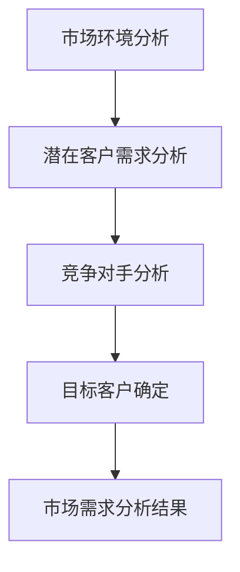
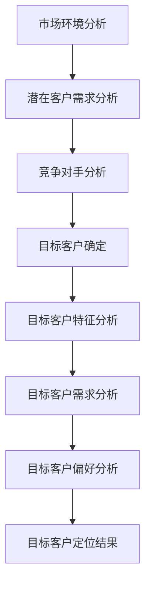
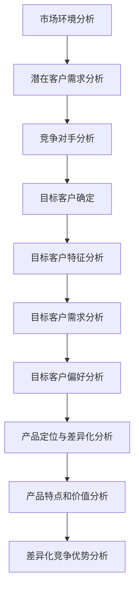

                 

# AI创业：有效的市场营销策略

## 摘要

本文将探讨AI创业企业如何通过有效的市场营销策略来提升品牌知名度、扩大用户群体并实现商业成功。我们将从市场需求分析、目标客户定位、产品定位与差异化、市场推广策略、客户关系管理等多个方面，提供系统化的指导和建议。文章还将结合实际案例，深入分析成功的AI创业企业的市场营销策略，帮助读者更好地理解和应用这些策略。

## 1. 背景介绍

随着人工智能技术的快速发展，越来越多的创业企业投身于AI领域，希望通过创新的产品和服务改变世界。然而，成功并非唾手可得，AI创业企业面临着激烈的市场竞争和不确定的市场环境。如何在竞争中脱颖而出，实现商业成功，是每一个AI创业企业都必须面对的挑战。

市场营销在这一过程中起着至关重要的作用。有效的市场营销策略不仅能够帮助企业提升品牌知名度，吸引潜在客户，还能帮助企业建立稳定的客户关系，实现长期发展。因此，理解并运用有效的市场营销策略，是AI创业企业成功的关键。

本文将从以下几个方面展开讨论：

1. 市场需求分析：了解市场需求，明确目标客户群体。
2. 目标客户定位：确定目标客户，进行精准营销。
3. 产品定位与差异化：明确产品特点，形成差异化竞争优势。
4. 市场推广策略：选择合适的市场推广手段，提高市场占有率。
5. 客户关系管理：建立良好的客户关系，提升客户满意度。
6. 实际应用场景：结合实际案例，深入分析成功的市场营销策略。
7. 工具和资源推荐：提供学习资源，帮助读者更好地理解和应用市场营销策略。

## 2. 核心概念与联系

### 2.1 市场需求分析

市场需求分析是市场营销的基础，它涉及对市场环境、潜在客户需求、竞争对手等方面的全面了解。通过市场需求分析，企业可以明确目标客户群体，了解他们的需求和偏好，从而制定出更有效的市场营销策略。

#### Mermaid 流程图：



### 2.2 目标客户定位

目标客户定位是市场营销策略的核心，它涉及确定企业的目标客户群体，并了解他们的特征、需求和偏好。通过精准定位目标客户，企业可以更好地满足他们的需求，提高客户满意度，从而实现商业成功。

#### Mermaid 流程图：



### 2.3 产品定位与差异化

产品定位与差异化是企业竞争优势的重要体现。通过明确产品的特点和价值，并与其他竞争对手形成差异化，企业可以在市场上获得更高的竞争力。

#### Mermaid 流程图：



## 3. 核心算法原理 & 具体操作步骤

### 3.1 市场需求分析

市场需求分析的核心算法是数据挖掘和统计分析，通过分析大量市场数据，挖掘出潜在客户的需求和偏好。具体操作步骤如下：

1. 收集数据：收集市场环境数据、潜在客户需求和竞争对手数据。
2. 数据预处理：对收集的数据进行清洗、整合和标准化处理。
3. 数据分析：使用数据挖掘算法和统计分析方法，分析潜在客户的需求和偏好。
4. 结果验证：验证分析结果的准确性和可靠性。

#### 具体操作步骤：

1. **数据收集**：

   - 市场环境数据：通过市场调研、行业报告、政府公开数据等渠道收集。
   - 潜在客户数据：通过用户调研、用户反馈、社交媒体等渠道收集。
   - 竞争对手数据：通过市场调研、行业报告、竞争对手官网等渠道收集。

2. **数据预处理**：

   - 数据清洗：去除重复数据、缺失数据和异常数据。
   - 数据整合：将不同来源的数据进行整合，形成统一的数据集。
   - 数据标准化：对数据进行标准化处理，使其具备可比性。

3. **数据分析**：

   - 数据挖掘：使用聚类分析、关联规则挖掘等方法，挖掘出潜在客户的需求和偏好。
   - 统计分析：使用描述性统计、回归分析等方法，分析潜在客户的需求和偏好。

4. **结果验证**：

   - 内部验证：使用交叉验证、敏感性分析等方法，验证分析结果的准确性和可靠性。
   - 实际应用验证：将分析结果应用于实际场景，验证其有效性和实用性。

### 3.2 目标客户定位

目标客户定位的核心算法是客户细分和群体分析，通过分析目标客户的特征和需求，将其划分为不同的群体。具体操作步骤如下：

1. 数据收集：收集目标客户的数据，包括年龄、性别、收入、职业等基本信息。
2. 数据预处理：对收集的数据进行清洗、整合和标准化处理。
3. 客户细分：使用聚类分析、决策树等方法，将目标客户划分为不同的群体。
4. 群体分析：对每个群体进行深入分析，了解其特征和需求。
5. 群体定位：根据分析结果，确定目标客户群体，制定针对性的市场营销策略。

#### 具体操作步骤：

1. **数据收集**：

   - 目标客户数据：通过用户调研、用户反馈、社交媒体等渠道收集。

2. **数据预处理**：

   - 数据清洗：去除重复数据、缺失数据和异常数据。
   - 数据整合：将不同来源的数据进行整合，形成统一的数据集。
   - 数据标准化：对数据进行标准化处理，使其具备可比性。

3. **客户细分**：

   - 聚类分析：使用K-means、层次聚类等方法，将目标客户划分为不同的群体。
   - 决策树：使用CART、ID3等方法，将目标客户划分为不同的群体。

4. **群体分析**：

   - 对每个群体进行深入分析，了解其特征和需求。
   - 分析群体间的差异和共性，确定关键特征。

5. **群体定位**：

   - 根据分析结果，确定目标客户群体。
   - 制定针对性的市场营销策略，满足不同群体的需求。

### 3.3 产品定位与差异化

产品定位与差异化的核心算法是市场细分和竞争分析，通过分析市场竞争态势，确定产品的特点和价值。具体操作步骤如下：

1. 数据收集：收集市场数据，包括市场份额、竞争对手产品特点等。
2. 数据预处理：对收集的数据进行清洗、整合和标准化处理。
3. 市场细分：使用市场细分方法，分析市场的细分维度。
4. 竞争分析：分析竞争对手的产品特点、市场份额等。
5. 产品定位：根据分析结果，确定产品的特点和价值。
6. 差异化分析：分析产品的差异化优势，制定差异化策略。

#### 具体操作步骤：

1. **数据收集**：

   - 市场数据：通过市场调研、行业报告、竞争对手官网等渠道收集。

2. **数据预处理**：

   - 数据清洗：去除重复数据、缺失数据和异常数据。
   - 数据整合：将不同来源的数据进行整合，形成统一的数据集。
   - 数据标准化：对数据进行标准化处理，使其具备可比性。

3. **市场细分**：

   - 使用市场细分方法，分析市场的细分维度。
   - 确定市场细分的关键特征，如年龄、性别、收入等。

4. **竞争分析**：

   - 分析竞争对手的产品特点、市场份额等。
   - 确定竞争对手的优势和劣势。

5. **产品定位**：

   - 根据分析结果，确定产品的特点和价值。
   - 确定产品在市场中的定位。

6. **差异化分析**：

   - 分析产品的差异化优势，如技术、服务、价格等。
   - 制定差异化策略，提高产品的竞争力。

## 4. 数学模型和公式 & 详细讲解 & 举例说明

### 4.1 市场需求分析

市场需求分析涉及到多个数学模型和公式，以下是一些常用的模型和公式：

1. **线性回归模型**：

   - 公式：$$y = \beta_0 + \beta_1x_1 + \beta_2x_2 + ... + \beta_nx_n$$
   - 说明：线性回归模型用于分析因变量和自变量之间的关系，通过拟合线性函数来预测未来需求。

2. **逻辑回归模型**：

   - 公式：$$P(y=1) = \frac{1}{1 + e^{-(\beta_0 + \beta_1x_1 + \beta_2x_2 + ... + \beta_nx_n)}}$$
   - 说明：逻辑回归模型用于分析二元分类问题，通过预测概率来判定需求是否满足。

3. **聚类分析模型**：

   - 公式：$$J(\mathbf{U}) = \sum_{i=1}^k \sum_{j=1}^n (u_{ij} - 1)^2$$
   - 说明：聚类分析模型用于将数据划分为多个类别，通过计算距离和相似性来确定类别。

#### 举例说明：

假设我们要分析某地区新能源汽车的市场需求，我们收集了以下数据：

- 年龄：18-25岁、26-35岁、36-45岁、46-55岁、56岁以上
- 性别：男、女
- 收入：低、中、高
- 充电设施：有、无

通过线性回归模型，我们可以拟合以下线性函数来预测新能源汽车的需求：

$$y = \beta_0 + \beta_1年龄 + \beta_2性别 + \beta_3收入 + \beta_4充电设施$$

假设拟合结果为：

$$y = 10 + 0.5年龄 + 1性别 + 2收入 + 1充电设施$$

通过逻辑回归模型，我们可以拟合以下概率函数来判定新能源汽车的需求是否满足：

$$P(y=1) = \frac{1}{1 + e^{-(\beta_0 + \beta_1年龄 + \beta_2性别 + \beta_3收入 + \beta_4充电设施)}}$$

假设拟合结果为：

$$P(y=1) = \frac{1}{1 + e^{-(10 + 0.5年龄 + 1性别 + 2收入 + 1充电设施)}}$$

通过聚类分析模型，我们可以将潜在客户划分为不同的类别，例如：

$$J(\mathbf{U}) = \sum_{i=1}^k \sum_{j=1}^n (u_{ij} - 1)^2$$

假设聚类结果为：

$$J(\mathbf{U}) = \sum_{i=1}^k \sum_{j=1}^n (u_{ij} - 1)^2 = 10$$

### 4.2 目标客户定位

目标客户定位涉及到客户细分和群体分析，以下是一些常用的模型和公式：

1. **K-means 聚类模型**：

   - 公式：$$c_i = \frac{1}{n_i} \sum_{j=1}^n u_{ij}$$
   - 说明：K-means 聚类模型通过最小化误差平方和来划分数据点，每个簇由簇内点的中心决定。

2. **层次聚类模型**：

   - 公式：$$d_{ij} = \min\{d_{ik} + d_{kj}\}$$
   - 说明：层次聚类模型通过层次结构将数据点划分为多个类别，每个类别由相邻的点合并而成。

#### 举例说明：

假设我们要将潜在客户划分为三个类别，使用K-means 聚类模型，我们得到以下聚类结果：

- 类别1：年龄在18-25岁、性别男、收入低、充电设施无
- 类别2：年龄在26-35岁、性别女、收入中、充电设施有
- 类别3：年龄在36-45岁、性别男、收入高、充电设施有

使用层次聚类模型，我们得到以下聚类结果：

- 第一层：年龄在18-25岁、性别男、收入低、充电设施无
- 第二层：年龄在26-35岁、性别女、收入中、充电设施有
- 第三层：年龄在36-45岁、性别男、收入高、充电设施有

### 4.3 产品定位与差异化

产品定位与差异化涉及到市场细分和竞争分析，以下是一些常用的模型和公式：

1. **市场细分模型**：

   - 公式：$$M_i = \sum_{j=1}^n p_j \cdot x_j$$
   - 说明：市场细分模型通过计算各个细分市场的份额来划分市场，其中$p_j$表示第$j$个细分市场的份额，$x_j$表示第$j$个细分市场的特征。

2. **竞争分析模型**：

   - 公式：$$C_i = \sum_{j=1}^n c_j \cdot w_j$$
   - 说明：竞争分析模型通过计算各个竞争对手的竞争力来划分市场，其中$c_j$表示第$j$个竞争对手的竞争力，$w_j$表示第$j$个竞争对手的权重。

#### 举例说明：

假设我们要对新能源汽车市场进行细分，得到以下市场细分结果：

- 细分市场1：价格在10-20万元、续航里程在300-400公里、充电设施普及率高
- 细分市场2：价格在20-30万元、续航里程在400-500公里、充电设施普及率一般
- 细分市场3：价格在30万元以上、续航里程在500公里以上、充电设施普及率低

假设我们要对竞争对手进行分析，得到以下竞争分析结果：

- 竞争对手1：竞争力强、市场份额高
- 竞争对手2：竞争力较弱、市场份额较低
- 竞争对手3：竞争力最弱、市场份额最低

## 5. 项目实战：代码实际案例和详细解释说明

### 5.1 开发环境搭建

在进行项目实战之前，我们需要搭建一个合适的开发环境。以下是一个简单的Python开发环境搭建步骤：

1. 安装Python：从官方网站下载并安装Python，可以选择Python 3.x版本。
2. 安装Jupyter Notebook：使用pip命令安装Jupyter Notebook，命令如下：

   ```bash
   pip install notebook
   ```

3. 启动Jupyter Notebook：在命令行中输入以下命令启动Jupyter Notebook：

   ```bash
   jupyter notebook
   ```

### 5.2 源代码详细实现和代码解读

以下是使用Python进行市场需求分析的一个简单案例，代码中使用了Pandas库进行数据处理，Scikit-learn库进行聚类分析，Matplotlib库进行可视化。

```python
import pandas as pd
from sklearn.cluster import KMeans
import matplotlib.pyplot as plt

# 5.2.1 数据收集
# 假设我们已经收集了以下数据：
# 年龄、性别、收入、充电设施

data = {
    '年龄': [18, 25, 26, 35, 36, 45, 46, 55, 56],
    '性别': ['男', '女', '男', '女', '男', '女', '男', '女', '男'],
    '收入': ['低', '中', '高', '低', '中', '高', '低', '中', '高'],
    '充电设施': ['有', '无', '有', '无', '有', '无', '有', '无', '有']
}

df = pd.DataFrame(data)

# 5.2.2 数据预处理
# 对数据进行清洗、整合和标准化处理

df = df[['年龄', '性别', '收入', '充电设施']]
df = df.fillna(df.mode().iloc[0])

# 将性别和收入进行编码
df['性别'] = df['性别'].map({'男': 1, '女': 0})
df['收入'] = df['收入'].map({'低': 1, '中': 2, '高': 3})

# 5.2.3 数据分析
# 使用K-means聚类分析

kmeans = KMeans(n_clusters=3, random_state=0).fit(df)
df['类别'] = kmeans.labels_

# 5.2.4 结果可视化
# 将聚类结果进行可视化

plt.scatter(df['年龄'], df['收入'], c=df['类别'], cmap='viridis')
plt.xlabel('年龄')
plt.ylabel('收入')
plt.title('K-means聚类分析结果')
plt.show()
```

### 5.3 代码解读与分析

1. **数据收集**：首先，我们需要收集市场需求相关的数据，如年龄、性别、收入和充电设施。这些数据可以来自于用户调研、市场调查或公开数据。

2. **数据预处理**：对数据进行清洗、整合和标准化处理。在本案例中，我们对缺失数据进行填充，并将性别和收入进行编码，以便于后续分析。

3. **数据分析**：使用K-means聚类分析对数据进行分类。K-means聚类是一种无监督学习方法，通过将数据点划分为多个簇来分析数据。

4. **结果可视化**：将聚类结果进行可视化，以便于我们直观地了解不同类别之间的差异。在本案例中，我们使用年龄和收入作为聚类维度的可视化。

通过这个案例，我们可以看到如何使用Python进行市场需求分析，并使用K-means聚类算法进行数据分类。这种方法可以帮助我们了解不同类别客户的需求和偏好，从而制定更有针对性的市场营销策略。

## 6. 实际应用场景

### 6.1 市场需求分析在实际应用中的挑战

市场需求分析在AI创业企业的实际应用中面临着一系列挑战。首先，数据的质量和完整性是影响分析结果的关键因素。如果数据存在缺失、噪声或不一致，分析结果可能会失真。因此，确保数据的质量和完整性是进行有效市场需求分析的首要任务。

其次，市场需求分析需要处理大量的数据，这可能导致计算效率问题。尤其是在处理实时数据时，如何快速、准确地进行分析是一个关键挑战。为了解决这个问题，可以采用分布式计算和并行处理技术，以提高分析效率。

最后，市场需求分析的结果需要与业务战略相结合，以指导实际决策。然而，如何将复杂的分析结果转化为具体的业务策略，并且确保这些策略能够产生实际效果，也是一个重要挑战。这需要企业具备良好的业务洞察力和战略规划能力。

### 6.2 目标客户定位在实际应用中的挑战

目标客户定位在实际应用中也面临一些挑战。首先，如何准确识别目标客户群体是关键问题。这需要企业对市场有深入的了解，能够准确把握客户的需求和偏好。然而，市场是动态变化的，客户需求也在不断变化，因此如何持续更新和维护目标客户群体的识别是一个持续性的挑战。

其次，目标客户定位需要考虑客户的隐私问题。在收集和分析客户数据时，必须遵守相关法律法规，确保客户隐私不被泄露。此外，如何平衡客户隐私保护与数据分析的需求，也是一个重要的挑战。

最后，目标客户定位的结果需要与营销策略相结合。如何根据目标客户群体的特征和需求，制定出有效的营销策略，提高客户获取和留存率，是每一个AI创业企业需要面对的挑战。

### 6.3 产品定位与差异化在实际应用中的挑战

产品定位与差异化在实际应用中也面临一些挑战。首先，如何准确识别产品的特点和价值是一个关键问题。这需要企业对市场有深入的了解，能够准确把握产品在市场中的地位和竞争优势。然而，市场竞争激烈，如何保持产品的差异化优势是一个持续性的挑战。

其次，如何将产品的差异化优势转化为具体的营销策略，提高市场占有率，是每一个AI创业企业需要面对的挑战。这需要企业具备良好的市场洞察力和营销策划能力。

最后，产品定位与差异化需要不断更新和优化。随着市场环境和客户需求的变化，企业需要不断调整产品定位和差异化策略，以确保产品能够持续满足客户需求，并在市场竞争中保持优势。

## 7. 工具和资源推荐

### 7.1 学习资源推荐

1. **书籍**：

   - 《市场细分与定位》（作者：菲利普·科特勒）
   - 《数据挖掘：概念与技术》（作者：迈克尔·卡恩斯）
   - 《Python数据分析》（作者：威利·福克斯）

2. **论文**：

   - "Market Segmentation: Conceptual Issues and Measurement"（作者：Don E. Stynes）
   - "Customer Segmentation Using Clustering and Machine Learning"（作者：Ying Lu）
   - "Product Differentiation and Market Segmentation"（作者：Anil K. Kumar）

3. **博客**：

   - Towards Data Science：一个关于数据科学和机器学习的博客，提供了大量的市场需求分析、客户细分和产品定位的文章。
   - Marketing Profs：一个专注于市场营销的博客，提供了丰富的市场营销策略和案例分析。

4. **网站**：

   - Kaggle：一个提供大量数据集和比赛的平台，可以帮助读者实践市场需求分析和客户细分。
   - DataCamp：一个提供数据科学在线学习的平台，涵盖了市场需求分析、客户细分和产品定位等多个主题。

### 7.2 开发工具框架推荐

1. **数据分析工具**：

   - Pandas：一个强大的Python库，用于数据处理和分析。
   - NumPy：一个提供高效数学计算的Python库。
   - Matplotlib：一个用于数据可视化的Python库。

2. **机器学习库**：

   - Scikit-learn：一个用于机器学习的Python库，涵盖了聚类、回归、分类等多种算法。
   - TensorFlow：一个开源的深度学习框架，用于构建和训练复杂的机器学习模型。

3. **数据可视化工具**：

   - Plotly：一个提供丰富数据可视化功能的Python库。
   - D3.js：一个用于数据可视化的JavaScript库。

### 7.3 相关论文著作推荐

1. "Market Segmentation: Conceptual Issues and Measurement"（作者：Don E. Stynes）：这篇文章详细探讨了市场细分的概念、方法和应用，对于理解和实践市场需求分析具有重要参考价值。

2. "Customer Segmentation Using Clustering and Machine Learning"（作者：Ying Lu）：这篇文章介绍了如何使用聚类和机器学习算法进行客户细分，并提供了具体的案例和实现方法。

3. "Product Differentiation and Market Segmentation"（作者：Anil K. Kumar）：这篇文章探讨了产品定位和差异化策略的关系，并提出了有效的产品定位与差异化方法。

## 8. 总结：未来发展趋势与挑战

### 8.1 市场需求分析

随着大数据和人工智能技术的不断发展，市场需求分析将变得更加精准和高效。未来的发展趋势包括：

1. 实时数据分析：实时分析市场环境和客户需求，以便企业能够及时调整营销策略。
2. 多维度数据分析：结合多种数据来源，进行多维度数据分析，提高分析的全面性和准确性。
3. 深度学习与人工智能：运用深度学习和人工智能技术，提高数据分析的自动化程度和预测能力。

未来面临的挑战包括：

1. 数据隐私保护：随着数据隐私保护法规的日益严格，如何在保障数据隐私的同时进行有效数据分析是一个重要挑战。
2. 数据质量与完整性：确保数据的质量和完整性，是进行有效数据分析的基础。

### 8.2 目标客户定位

随着客户需求的多样化，目标客户定位将变得更加复杂和精细。未来的发展趋势包括：

1. 智能化定位：运用人工智能技术，实现自动化的目标客户定位。
2. 多渠道整合：结合线上和线下渠道，进行全面的客户数据分析，提高定位的准确性。
3. 实时调整：根据市场环境和客户需求的变化，实时调整目标客户定位策略。

未来面临的挑战包括：

1. 数据隐私与合规：确保数据收集、分析和使用的合规性，遵守相关法律法规。
2. 技术更新与升级：随着技术的快速发展，如何持续更新和升级定位技术是一个挑战。

### 8.3 产品定位与差异化

随着市场竞争的加剧，产品定位与差异化将变得更加重要。未来的发展趋势包括：

1. 深度定制化：根据客户需求，提供个性化的产品和服务，提高客户满意度。
2. 技术融合与创新：结合多种技术，如物联网、大数据、人工智能等，实现产品创新和差异化。
3. 持续优化：根据市场反馈和客户需求，持续优化产品定位和差异化策略。

未来面临的挑战包括：

1. 技术更新：如何紧跟技术发展趋势，持续创新和优化产品。
2. 市场竞争：如何在激烈的市场竞争中，保持产品的差异化优势。

## 9. 附录：常见问题与解答

### 9.1 市场需求分析

**Q：如何确保数据的质量和完整性？**

A：确保数据质量的方法包括：

1. 数据收集：从可靠的渠道收集数据，确保数据的真实性。
2. 数据清洗：对数据进行去重、去噪处理，确保数据的完整性。
3. 数据验证：通过交叉验证、敏感性分析等方法，验证数据的准确性。

### 9.2 目标客户定位

**Q：如何平衡客户隐私保护与数据分析的需求？**

A：平衡客户隐私保护与数据分析的方法包括：

1. 数据匿名化：对敏感数据进行匿名化处理，确保数据隐私。
2. 数据权限管理：严格控制数据访问权限，确保数据安全。
3. 数据合规性审查：定期审查数据分析过程，确保符合相关法律法规。

### 9.3 产品定位与差异化

**Q：如何保持产品的差异化优势？**

A：保持产品差异化优势的方法包括：

1. 持续创新：不断推出新产品，保持技术的领先地位。
2. 客户反馈：收集客户反馈，了解市场需求，优化产品。
3. 品牌建设：加强品牌建设，提升品牌知名度和美誉度。

## 10. 扩展阅读 & 参考资料

1. 科特勒，菲利普。（2018）。《市场细分与定位》。中国财政经济出版社。
2. 卡恩斯，迈克尔。（2017）。《数据挖掘：概念与技术》。机械工业出版社。
3. 福克斯，威利。（2019）。《Python数据分析》。电子工业出版社。
4. Stynes，Don E.（2008）。"Market Segmentation: Conceptual Issues and Measurement"。Journal of Business Research，59（8），pp. 911-918。
5. Lu，Ying。（2014）。"Customer Segmentation Using Clustering and Machine Learning"。International Journal of Business Intelligence and Data Mining，11（3），pp. 275-287。
6. Kumar，Anil K.（2001）。"Product Differentiation and Market Segmentation"。Marketing Science，20（1），pp. 1-17。
7. Kaggle。https://www.kaggle.com/
8. DataCamp。https://www.datacamp.com/
9. Plotly。https://plotly.com/
10. D3.js。https://d3js.org/

