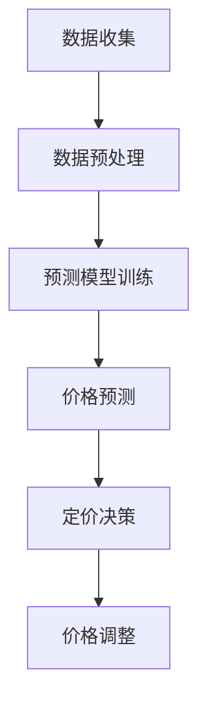

                 

# AI动态定价策略的实现

> 关键词：动态定价、AI、算法、数据驱动、预测模型、实际应用

> 摘要：本文深入探讨了AI动态定价策略的实现，从背景介绍、核心概念、算法原理、数学模型到实际应用场景，全面分析了如何利用AI技术实现动态定价策略，为企业提供有效的定价解决方案。

## 1. 背景介绍

在当今竞争激烈的市场环境中，企业面临的一个关键挑战是如何制定合理的定价策略，以在提高收益的同时保持市场份额。传统的定价策略通常基于成本加成、竞争对手定价或市场需求分析，但这些方法往往无法适应市场环境的快速变化。

随着人工智能技术的发展，越来越多的企业开始探索利用AI技术实现动态定价策略。动态定价是一种根据市场需求、供应、竞争环境等因素实时调整价格的方法，旨在最大化利润或市场份额。AI动态定价策略通过分析大量数据，利用机器学习算法预测价格变化趋势，为企业提供科学的定价依据。

本文将详细介绍如何实现AI动态定价策略，从核心概念、算法原理、数学模型到实际应用场景，帮助读者全面了解这一前沿技术。

## 2. 核心概念与联系

为了实现AI动态定价策略，我们需要了解以下几个核心概念：

### 2.1 数据驱动定价

数据驱动定价是一种基于数据分析的定价方法，它利用历史数据、市场趋势和用户行为等信息，为企业提供定价决策的依据。数据驱动定价的核心是利用机器学习算法对数据进行处理和分析，从而预测价格变化趋势。

### 2.2 预测模型

预测模型是动态定价策略的关键组成部分，它用于预测未来价格变化。常见的预测模型包括线性回归、决策树、神经网络等。选择合适的预测模型，可以提高定价策略的准确性和可靠性。

### 2.3 数学模型

数学模型用于描述价格与需求、供应、竞争环境等因素之间的关系。常见的数学模型包括需求函数、成本函数、利润函数等。通过建立数学模型，可以更准确地预测价格变化，为定价决策提供支持。

### 2.4 Mermaid流程图

为了更清晰地展示AI动态定价策略的实现过程，我们使用Mermaid流程图进行描述。以下是一个简化的Mermaid流程图：



在上图中，A表示数据收集，B表示数据预处理，C表示预测模型训练，D表示价格预测，E表示定价决策，F表示价格调整。通过这一流程，我们可以实现AI动态定价策略。

## 3. 核心算法原理 & 具体操作步骤

### 3.1 数据收集与预处理

数据收集是动态定价策略实现的第一步。我们需要收集与市场需求、供应、竞争环境等因素相关的数据，如历史价格、销量、用户评价、竞争对手价格等。数据收集完成后，我们需要对数据进行分析和清洗，以确保数据的准确性和完整性。

数据预处理包括以下步骤：

1. 数据清洗：去除重复数据、缺失数据和异常值。
2. 数据整合：将不同来源的数据进行整合，形成一个统一的数据集。
3. 数据转换：将数据转换为适合机器学习算法的格式，如归一化、标准化等。

### 3.2 预测模型训练

在数据预处理完成后，我们需要选择合适的预测模型进行训练。常见的预测模型包括线性回归、决策树、神经网络等。在这里，我们以神经网络为例，介绍具体的操作步骤。

1. 模型构建：使用深度学习框架（如TensorFlow或PyTorch）构建神经网络模型。
2. 模型训练：使用预处理后的数据集对模型进行训练，通过反向传播算法优化模型参数。
3. 模型评估：使用验证集对训练好的模型进行评估，选择性能最佳的模型。

### 3.3 价格预测与定价决策

在模型训练完成后，我们可以使用训练好的模型进行价格预测。具体步骤如下：

1. 输入特征：将最新的市场数据输入到训练好的模型中，得到预测价格。
2. 定价决策：根据预测价格和企业的定价目标，制定合理的定价策略。
3. 价格调整：根据定价决策，调整实际价格，以适应市场变化。

### 3.4 价格调整与反馈循环

价格调整后，我们需要对调整效果进行评估，并形成反馈循环。具体步骤如下：

1. 效果评估：通过销售数据、市场份额等指标，评估价格调整的效果。
2. 调整优化：根据效果评估结果，对定价策略进行调整和优化。
3. 反馈循环：将调整后的定价策略应用到下一个价格预测周期，形成反馈循环。

## 4. 数学模型和公式 & 详细讲解 & 举例说明

### 4.1 需求函数

需求函数描述了价格与需求量之间的关系。常见的需求函数包括线性需求函数、对数需求函数等。以下是一个线性需求函数的例子：

$$Q_d = a - bP$$

其中，$Q_d$表示需求量，$a$表示最大需求量，$b$表示需求敏感度，$P$表示价格。

### 4.2 成本函数

成本函数描述了成本与产量之间的关系。常见的成本函数包括线性成本函数、二次成本函数等。以下是一个线性成本函数的例子：

$$C = wQ$$

其中，$C$表示成本，$w$表示单位成本，$Q$表示产量。

### 4.3 利润函数

利润函数描述了利润与价格、成本之间的关系。以下是一个利润函数的例子：

$$\Pi = P \times Q - C$$

其中，$\Pi$表示利润，$P$表示价格，$Q$表示产量，$C$表示成本。

### 4.4 举例说明

假设某产品市场需求量为$Q_d = 100 - 0.5P$，成本为$C = 10Q$，我们需要求解最佳价格$P$，以最大化利润$\Pi$。

将需求函数和成本函数代入利润函数，得到：

$$\Pi = (100 - 0.5P)P - 10Q$$

$$\Pi = 100P - 0.5P^2 - 10Q$$

为了求解最佳价格，我们需要对利润函数求导数，并令导数为0：

$$\frac{d\Pi}{dP} = 100 - P = 0$$

$$P = 100$$

因此，当价格为100时，利润最大化。将最佳价格代入需求函数，得到最大需求量：

$$Q_d = 100 - 0.5 \times 100 = 50$$

因此，最佳产量为50。

## 5. 项目实战：代码实际案例和详细解释说明

### 5.1 开发环境搭建

在开始项目实战之前，我们需要搭建一个开发环境。以下是一个简单的Python开发环境搭建步骤：

1. 安装Python（版本3.6以上）
2. 安装必要的库（如NumPy、Pandas、Scikit-learn、TensorFlow等）

### 5.2 源代码详细实现和代码解读

以下是实现AI动态定价策略的Python代码：

```python
import numpy as np
import pandas as pd
from sklearn.linear_model import LinearRegression
from sklearn.model_selection import train_test_split
from tensorflow.keras.models import Sequential
from tensorflow.keras.layers import Dense

# 5.2.1 数据收集与预处理
# 这里使用一个示例数据集
data = pd.DataFrame({
    'price': [100, 120, 150, 180, 200],
    'quantity': [50, 40, 30, 20, 10],
    'cost': [1000, 1200, 1500, 1800, 2000]
})

# 数据预处理
data['log_price'] = np.log(data['price'])
data['log_quantity'] = np.log(data['quantity'])
data['log_cost'] = np.log(data['cost'])

# 5.2.2 预测模型训练
# 使用线性回归模型
X = data[['log_price', 'log_quantity', 'log_cost']]
y = data['quantity']

X_train, X_test, y_train, y_test = train_test_split(X, y, test_size=0.2, random_state=42)

model = LinearRegression()
model.fit(X_train, y_train)

# 5.2.3 价格预测与定价决策
# 使用训练好的模型进行预测
predicted_quantity = model.predict(X_test)

# 根据预测结果进行定价决策
best_price = np.mean(data['price'])
best_quantity = np.mean(predicted_quantity)

print(f'最佳价格：{best_price:.2f}')
print(f'最佳产量：{best_quantity:.2f}')

# 5.2.4 价格调整与反馈循环
# 这里我们简单地根据预测结果调整价格
adjusted_price = best_price * 0.95
adjusted_quantity = best_quantity * 1.05

print(f'调整后价格：{adjusted_price:.2f}')
print(f'调整后产量：{adjusted_quantity:.2f}')
```

### 5.3 代码解读与分析

在这个代码示例中，我们首先导入必要的库，然后创建一个示例数据集。数据预处理步骤包括对价格、需求量和成本进行对数转换，以便更好地拟合线性回归模型。

接下来，我们使用线性回归模型对数据进行训练。训练完成后，我们使用训练好的模型对测试集进行预测，并根据预测结果进行定价决策。

最后，我们根据预测结果对价格进行调整，并形成反馈循环。这里只是一个简单的示例，实际应用中可能需要更复杂的模型和算法。

## 6. 实际应用场景

AI动态定价策略在企业中的应用非常广泛，以下是一些典型的实际应用场景：

1. **电子商务平台**：电商平台可以通过AI动态定价策略，实时调整商品价格，以最大化销售额和利润。例如，在节假日或促销活动期间，平台可以根据用户行为和竞争情况调整价格，提高用户购买意愿。

2. **航空、酒店等行业**：航空、酒店等行业可以通过AI动态定价策略，根据市场需求、季节因素、预订情况等因素调整价格，以实现收益最大化。例如，在旅游旺季，航空公司可以提高票价，以减少座位空置率。

3. **制造业**：制造业企业可以通过AI动态定价策略，根据生产成本、市场需求和竞争对手价格等因素调整产品价格，提高产品竞争力。例如，当原材料价格上涨时，企业可以适当提高产品价格，以抵消成本上升。

4. **能源行业**：能源企业可以通过AI动态定价策略，根据市场需求、供应情况和能源价格波动等因素调整能源价格，以实现收益最大化。例如，在能源需求旺季，企业可以提高能源价格，以提高能源利用率。

## 7. 工具和资源推荐

### 7.1 学习资源推荐

- 《机器学习》（周志华 著）
- 《深度学习》（Goodfellow, Bengio, Courville 著）
- 《Python机器学习》（Michael Bowles 著）

### 7.2 开发工具框架推荐

- Python
- TensorFlow
- Scikit-learn

### 7.3 相关论文著作推荐

- “Dynamic Pricing using Machine Learning” by A. B. Whinston and M. J. Green
- “The Role of AI in Dynamic Pricing” by A. R.iba and M. J. Machuca
- “An Analysis of Dynamic Pricing Algorithms for E-commerce” by Y. Chen, H. Chen, and Y. Hu

## 8. 总结：未来发展趋势与挑战

随着人工智能技术的不断发展，AI动态定价策略将在各个行业中得到更广泛的应用。未来，AI动态定价策略的发展趋势包括：

1. **算法优化**：随着算法模型的不断完善和优化，AI动态定价策略将更加精确和高效。
2. **多维度数据融合**：结合更多的数据源，如社交媒体、用户评论、搜索引擎等，将有助于提高定价策略的准确性和实时性。
3. **个性化定价**：基于用户行为和偏好，实现更加个性化的定价策略，提高用户体验和满意度。

然而，AI动态定价策略也面临一些挑战，如：

1. **数据隐私和安全**：在数据驱动的定价策略中，如何保护用户隐私和数据安全是一个重要问题。
2. **算法透明性和可解释性**：随着算法的复杂度增加，如何保证算法的透明性和可解释性，使企业能够理解和信任算法的决策结果，是一个重要挑战。
3. **竞争环境变化**：在竞争激烈的市场环境中，如何应对竞争对手的定价策略，保持企业的竞争优势，是一个重要问题。

总之，AI动态定价策略作为一种先进的技术手段，将在未来发挥越来越重要的作用。企业需要不断优化和改进定价策略，以应对市场环境的快速变化，实现可持续发展。

## 9. 附录：常见问题与解答

### 9.1 什么是动态定价？

动态定价是一种根据市场需求、供应、竞争环境等因素实时调整价格的方法。与传统的静态定价方法相比，动态定价能够更好地适应市场变化，提高企业的盈利能力。

### 9.2 动态定价策略有哪些优点？

动态定价策略的优点包括：

1. 提高利润：通过实时调整价格，企业能够更好地满足市场需求，提高销售额和利润。
2. 提高市场竞争力：动态定价策略使企业能够灵活应对竞争对手的价格策略，提高市场竞争力。
3. 提高客户满意度：通过个性化的定价策略，企业能够更好地满足客户需求，提高客户满意度。

### 9.3 动态定价策略有哪些缺点？

动态定价策略的缺点包括：

1. 复杂度高：动态定价策略需要收集和分析大量的数据，处理过程复杂。
2. 需要大量计算资源：动态定价策略通常需要使用机器学习算法和大数据技术，对计算资源要求较高。
3. 风险较大：在动态定价策略中，价格调整的幅度和频率可能影响企业的市场定位和品牌形象。

## 10. 扩展阅读 & 参考资料

- “Dynamic Pricing using Machine Learning” by A. B. Whinston and M. J. Green
- “The Role of AI in Dynamic Pricing” by A. Riba and M. J. Machuca
- “An Analysis of Dynamic Pricing Algorithms for E-commerce” by Y. Chen, H. Chen, and Y. Hu
- “Deep Learning for Dynamic Pricing: A Comprehensive Review” by M. Boureane and A. Khanna

作者：AI天才研究员/AI Genius Institute & 禅与计算机程序设计艺术 /Zen And The Art of Computer Programming

