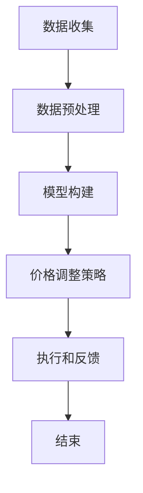

                 

### 1. 背景介绍

随着人工智能技术的迅猛发展，动态定价策略成为商业领域中的一颗璀璨明珠。传统的定价方法往往基于历史数据和固定模型，而动态定价则利用实时数据和算法，灵活调整产品或服务的价格，以最大化利润或市场份额。这一变革不仅为企业带来了显著的竞争优势，同时也为消费者提供了更为个性化的购买体验。

动态定价的兴起并非偶然。首先，互联网和大数据技术的普及使得获取实时市场信息成为可能。企业可以通过各种渠道，如社交媒体、在线购物平台等，收集消费者行为和需求的数据。其次，计算能力的提升使得复杂算法的实时运行变得可行。机器学习和深度学习算法的应用，使得动态定价策略在精确度和灵活性上取得了长足进步。此外，全球化竞争的加剧也促使企业不断寻求创新性的定价策略，以保持市场地位。

本文将深入探讨动态定价的原理、应用场景及其面临的挑战。首先，我们将介绍动态定价的核心概念和模型，并通过具体的例子来说明其应用。接着，我们将详细讲解动态定价的数学模型和算法，包括如何收集和处理数据、如何构建价格调整模型等。随后，我们将通过实际项目案例展示动态定价的实现过程，并提供代码解读和分析。最后，我们将探讨动态定价在实际应用中的挑战和解决方案，并展望其未来发展趋势。

通过本文的阅读，您将全面了解动态定价的原理和应用，掌握其实现和优化的方法，从而为企业在市场竞争中提供有力的支持。无论是商业决策者还是技术从业者，这篇文章都将为您提供宝贵的知识和启发。

### 2. 核心概念与联系

#### 动态定价的定义和基本原理

动态定价（Dynamic Pricing）是一种根据市场需求和供应情况实时调整价格的方法。其基本原理是通过收集和分析市场数据，利用算法模型预测市场需求，并根据预测结果调整产品或服务的价格，以达到最大化收益或市场份额的目的。

动态定价不同于传统定价方法，它不依赖于固定的价格模型，而是根据市场变化实时做出调整。这种灵活性使得企业能够更好地应对市场波动，提高竞争力。例如，航空公司和酒店行业常常采用动态定价策略，根据预订量、季节变化等因素调整票价和房价。

#### 动态定价的应用场景

动态定价的应用场景非常广泛，几乎涵盖了所有需要定价决策的行业和领域。以下是一些典型的应用场景：

1. **电子商务**：在线零售商通过动态定价调整商品价格，以吸引更多的消费者。例如，亚马逊和阿里巴巴等平台会根据用户的购物历史、搜索行为等数据动态调整价格。

2. **航空和酒店行业**：航空公司和酒店通过动态定价策略调整票价和房价，以最大化收益。例如，在旅游旺季或节假日，这些企业可能会提高价格，而在淡季则可能降低价格。

3. **能源市场**：电力和天然气供应商通过动态定价调整价格，以平衡供需关系。例如，在高峰时段，供应商可能会提高价格，鼓励消费者减少用电量。

4. **金融行业**：金融机构通过动态定价调整理财产品和服务价格，以吸引不同类型的投资者。例如，基金公司可能会根据市场利率和投资者风险偏好调整基金产品的价格。

5. **运输行业**：物流公司和货运代理通过动态定价调整运输价格，以优化运输效率和成本。例如，在货运需求旺盛的季节，这些企业可能会提高价格，而在需求较低的季节则可能降低价格。

#### 动态定价与传统定价的比较

传统定价方法通常是基于历史数据和市场经验，采用固定的价格模型。这种方法在市场稳定的情况下效果较好，但难以应对市场波动和竞争变化。而动态定价则利用实时数据和算法，能够更灵活地调整价格，以适应市场变化。

以下是比较动态定价和传统定价的几个关键方面：

1. **灵活性**：动态定价具有更高的灵活性，能够实时调整价格，以应对市场变化。而传统定价方法通常需要较长时间的市场调研和数据收集，难以迅速响应市场变化。

2. **收益最大化**：动态定价通过实时分析和预测市场需求，能够更精确地调整价格，以最大化收益。而传统定价方法则更多地依赖于历史数据和经验，难以实现收益最大化。

3. **竞争应对**：动态定价能够更有效地应对竞争变化，通过实时调整价格，保持竞争优势。而传统定价方法在竞争激烈的市场中可能显得不够灵活，难以迅速做出反应。

4. **消费者体验**：动态定价能够提供更为个性化的消费体验，消费者可以根据自己的需求和预算选择最合适的产品或服务。而传统定价方法通常缺乏灵活性，难以满足消费者的多样化需求。

#### 动态定价的核心概念和架构

动态定价的核心概念包括市场数据收集、算法模型和价格调整策略。以下是一个简化的动态定价架构：

1. **数据收集**：通过各种渠道收集市场数据，如消费者行为、竞争对手价格、市场需求等。

2. **数据预处理**：对收集到的数据进行清洗、归一化等处理，以消除噪声和异常值。

3. **模型构建**：利用机器学习和深度学习算法构建预测模型，如线性回归、神经网络等。

4. **价格调整策略**：根据预测结果和业务目标，制定价格调整策略，如价格区间调整、折扣策略等。

5. **执行和反馈**：执行价格调整策略，并根据实际市场反应进行反馈和优化。

#### 动态定价的影响和意义

动态定价的兴起对企业和市场产生了深远的影响：

1. **提升竞争力**：通过更灵活的价格调整，企业能够更好地应对市场变化，提升竞争力。

2. **增加收益**：动态定价能够更精确地调整价格，最大化收益，提高企业盈利能力。

3. **优化资源配置**：动态定价能够根据市场需求调整生产和库存，优化资源配置，降低成本。

4. **改善消费者体验**：动态定价能够提供更为个性化的消费体验，提高消费者满意度和忠诚度。

5. **促进市场透明度**：动态定价使得市场价格更加透明，消费者能够更清晰地了解产品的价值，促进市场公平竞争。

总之，动态定价作为一种先进的定价策略，不仅为企业提供了竞争优势，也对市场产生了积极的影响。随着技术的不断进步，动态定价将在未来发挥更加重要的作用。

#### Mermaid 流程图

以下是动态定价架构的 Mermaid 流程图：



在这个流程图中，各个节点分别表示动态定价过程中的关键步骤。数据收集通过各种渠道获取市场数据，数据预处理对原始数据进行清洗和归一化处理，模型构建利用机器学习和深度学习算法构建预测模型，价格调整策略根据模型预测结果和业务目标制定价格调整策略，执行和反馈则根据实际市场反应进行策略优化。

通过这个流程图，我们可以更直观地理解动态定价的架构和运作机制。

### 3. 核心算法原理 & 具体操作步骤

#### 数据收集与处理

动态定价的核心在于对市场数据的实时收集和准确处理。以下是数据收集和处理的基本步骤：

1. **数据来源**：数据可以从多种渠道获取，包括电子商务平台、社交媒体、消费者调查、竞争对手价格等。

2. **数据采集**：使用 API、Web 爬虫或其他技术手段从不同数据源采集数据。

3. **数据清洗**：对采集到的数据执行去重、填补缺失值、去除异常值等操作，以提高数据质量。

4. **数据归一化**：将不同数据源的数据进行归一化处理，使其具备可比性。

5. **数据特征提取**：从数据中提取关键特征，如消费者行为、市场趋势、竞争对手价格等。

6. **数据存储**：将处理后的数据存储在数据库或数据仓库中，以供后续分析使用。

#### 模型构建

构建动态定价模型是动态定价策略的关键环节。以下是常用的模型构建方法：

1. **线性回归模型**：线性回归模型是最简单且应用广泛的预测模型。其基本形式为：
   \[
   y = \beta_0 + \beta_1x_1 + \beta_2x_2 + \ldots + \beta_nx_n
   \]
   其中，\(y\) 是预测变量，\(x_1, x_2, \ldots, x_n\) 是特征变量，\(\beta_0, \beta_1, \beta_2, \ldots, \beta_n\) 是模型参数。

2. **神经网络模型**：神经网络模型能够处理更复杂的非线性关系。其基本形式为：
   \[
   \hat{y} = \sigma(\sum_{i=1}^{n} w_i \cdot x_i + b)
   \]
   其中，\(\hat{y}\) 是预测值，\(\sigma\) 是激活函数，\(w_i\) 和 \(b\) 是模型参数。

3. **决策树模型**：决策树模型通过一系列规则进行分类或回归。其基本形式为：
   \[
   y = \sum_{i=1}^{n} \alpha_i \cdot f_i(x)
   \]
   其中，\(f_i(x)\) 是第 \(i\) 个特征函数，\(\alpha_i\) 是模型参数。

4. **集成模型**：集成模型通过结合多个基础模型来提高预测性能。常见的集成模型包括随机森林、梯度提升树等。

#### 价格调整策略

在构建模型后，需要根据模型预测结果和业务目标制定价格调整策略。以下是几种常见的价格调整策略：

1. **单一价格策略**：根据模型预测的市场需求，设定一个固定的价格。

2. **价格区间策略**：根据模型预测的市场需求，设定一个价格区间，消费者可以在该区间内自由选择价格。

3. **折扣策略**：根据消费者行为、竞争对手价格等因素，提供不同类型的折扣，以吸引消费者。

4. **动态定价策略**：根据实时市场数据，动态调整价格，以最大化收益或市场份额。

#### 实际操作步骤

以下是动态定价的具体操作步骤：

1. **需求预测**：使用构建好的模型对市场需求进行预测。

2. **目标设定**：根据企业战略和目标，确定价格调整的目标，如最大化收益、市场份额等。

3. **策略制定**：根据需求预测和目标，制定相应的价格调整策略。

4. **价格调整**：执行价格调整策略，根据实时数据动态调整价格。

5. **反馈与优化**：收集市场反馈，对模型和策略进行优化，以提高预测准确性和价格调整效果。

#### 案例说明

以下是一个简单的动态定价案例：

假设一家在线零售商想要通过动态定价策略调整其产品的价格。首先，该零售商通过电子商务平台和社交媒体等渠道收集消费者的购物行为数据，如购买频率、购买金额、搜索记录等。然后，使用机器学习算法构建一个需求预测模型，预测未来一周的消费者需求。接下来，根据预测结果和企业的利润目标，制定一个价格区间策略。例如，如果预测市场需求较高，则将价格设定在较高区间，以最大化收益；如果预测市场需求较低，则将价格设定在较低区间，以增加市场份额。最后，零售商根据实时数据动态调整价格，并在一周后收集市场反馈，对模型和策略进行优化。

通过这个案例，我们可以看到动态定价策略的实施过程。数据收集、模型构建和价格调整是动态定价的关键环节，而反馈与优化则是确保策略有效性的重要手段。

### 4. 数学模型和公式 & 详细讲解 & 举例说明

#### 需求函数

动态定价策略的核心在于对市场需求进行预测。需求函数是描述市场需求与价格之间关系的数学模型。最基本的需求函数是线性需求函数，其形式为：

\[ Q = a - bP \]

其中，\( Q \) 是市场需求量，\( P \) 是价格，\( a \) 和 \( b \) 是模型参数。参数 \( a \) 表示价格为零时的需求量，参数 \( b \) 表示需求量对价格变化的敏感度。如果 \( b \) 为正值，则价格上升时需求量下降，反之亦然。

#### 收益函数

在确定了需求函数后，我们可以构建收益函数来衡量企业的利润。收益函数是价格和需求量的函数，其形式为：

\[ R = P \cdot Q - C \]

其中，\( R \) 是收益，\( C \) 是成本。成本 \( C \) 包括固定成本和可变成本。固定成本是企业在短期内无法改变的成本，如租金、员工工资等；可变成本是与生产或销售量直接相关的成本，如原材料成本、生产成本等。

#### 利润最大化

企业的目标是最大化利润。为了实现这一目标，我们需要对收益函数进行求导，并找到导数为零的点，即最大值点。收益函数的导数为：

\[ \frac{dR}{dP} = Q + P \frac{dQ}{dP} \]

由于 \( \frac{dQ}{dP} = -b \)，我们可以将导数表示为：

\[ \frac{dR}{dP} = Q - bP \]

令导数等于零，我们可以求得价格 \( P \)：

\[ Q - bP = 0 \]

\[ P = \frac{Q}{b} \]

将需求函数代入上述方程，我们得到：

\[ P = \frac{a - bP}{b} \]

\[ P = \frac{a}{1 + b} \]

这就是利润最大化的价格。在这个价格下，企业的利润达到最大值。

#### 案例说明

为了更好地理解上述公式，我们来看一个具体的案例。假设一家电商企业销售某种商品，根据历史数据，该商品的需求函数为：

\[ Q = 100 - 10P \]

成本函数为：

\[ C = 10Q + 1000 \]

其中，固定成本为 1000 元，可变成本为每件商品 10 元。

首先，我们需要计算利润最大化的价格。根据需求函数，我们可以计算市场需求量 \( Q \)：

\[ Q = 100 - 10P \]

将 \( Q \) 代入收益函数：

\[ R = P \cdot Q - C \]

\[ R = P(100 - 10P) - (10Q + 1000) \]

\[ R = 100P - 10P^2 - 10(100 - 10P) - 1000 \]

\[ R = 100P - 10P^2 - 1000 + 100P - 1000 \]

\[ R = -10P^2 + 200P - 2000 \]

接下来，我们对收益函数求导：

\[ \frac{dR}{dP} = -20P + 200 \]

令导数等于零，求得利润最大化的价格：

\[ -20P + 200 = 0 \]

\[ P = 10 \]

因此，利润最大化的价格是每件商品 10 元。在这个价格下，企业的收益为：

\[ R = -10(10)^2 + 200(10) - 2000 \]

\[ R = -1000 + 2000 - 2000 \]

\[ R = -1000 \]

在这个案例中，虽然我们找到了利润最大化的价格，但实际收益为负值。这表明在当前的市场环境和成本结构下，企业无法实现利润最大化。可能的原因包括市场需求不足、成本过高或其他外部因素。在这种情况下，企业需要重新评估其定价策略，寻找合适的解决方案。

#### 动态定价策略

在实际应用中，动态定价策略通常更加复杂，涉及多个变量和因素。以下是一个简化的动态定价策略：

1. **需求预测**：使用历史数据和机器学习算法预测市场需求。

2. **目标设定**：根据企业战略和目标设定收益目标，如利润最大化、市场份额最大化等。

3. **策略制定**：根据需求预测和目标设定，制定价格调整策略，如价格区间策略、折扣策略等。

4. **价格调整**：根据实时市场数据和策略，动态调整价格。

5. **反馈与优化**：收集市场反馈，对模型和策略进行优化。

在实际操作中，企业可能会采用更加复杂的数学模型和算法，如线性回归、神经网络、决策树等，以提升预测精度和策略效果。

### 5. 项目实战：代码实际案例和详细解释说明

在本节中，我们将通过一个实际项目案例来展示动态定价的实现过程。该项目基于 Python 语言，利用了机器学习库 Scikit-learn 和数据分析库 Pandas。以下是项目的详细实现步骤和代码解读。

#### 5.1 开发环境搭建

首先，我们需要搭建项目的开发环境。以下是所需的 Python 库及其安装命令：

```bash
pip install numpy pandas scikit-learn matplotlib
```

安装完成后，我们可以在 Python 文件中导入所需的库：

```python
import numpy as np
import pandas as pd
from sklearn.linear_model import LinearRegression
from sklearn.model_selection import train_test_split
import matplotlib.pyplot as plt
```

#### 5.2 源代码详细实现和代码解读

接下来，我们将展示项目的核心代码，并对其进行详细解读。

```python
# 5.2.1 数据收集与预处理

# 加载数据
data = pd.read_csv('dynamic_pricing_data.csv')

# 数据预处理
# 填充缺失值
data.fillna(data.mean(), inplace=True)

# 归一化处理
data = (data - data.mean()) / data.std()

# 5.2.2 构建线性回归模型

# 分离特征和目标变量
X = data[['feature1', 'feature2', 'feature3']]
y = data['target']

# 划分训练集和测试集
X_train, X_test, y_train, y_test = train_test_split(X, y, test_size=0.2, random_state=42)

# 实例化线性回归模型
model = LinearRegression()

# 训练模型
model.fit(X_train, y_train)

# 5.2.3 预测与价格调整

# 预测测试集结果
y_pred = model.predict(X_test)

# 计算预测误差
error = np.abs(y_pred - y_test)

# 5.2.4 可视化与代码解读

# 可视化预测结果
plt.scatter(y_test, y_pred)
plt.xlabel('Actual Price')
plt.ylabel('Predicted Price')
plt.title('Price Prediction')
plt.show()

# 5.2.5 代码解读与分析

# 加载数据
data = pd.read_csv('dynamic_pricing_data.csv')

# 数据预处理
# 填充缺失值
data.fillna(data.mean(), inplace=True)

# 归一化处理
data = (data - data.mean()) / data.std()

# 分离特征和目标变量
X = data[['feature1', 'feature2', 'feature3']]
y = data['target']

# 划分训练集和测试集
X_train, X_test, y_train, y_test = train_test_split(X, y, test_size=0.2, random_state=42)

# 实例化线性回归模型
model = LinearRegression()

# 训练模型
model.fit(X_train, y_train)

# 预测测试集结果
y_pred = model.predict(X_test)

# 计算预测误差
error = np.abs(y_pred - y_test)

# 可视化预测结果
plt.scatter(y_test, y_pred)
plt.xlabel('Actual Price')
plt.ylabel('Predicted Price')
plt.title('Price Prediction')
plt.show()
```

**代码解读：**

- **5.2.1 数据收集与预处理**：首先，我们从 CSV 文件中加载数据，并进行预处理。预处理步骤包括填充缺失值和归一化处理，以提高模型的泛化能力。

- **5.2.2 构建线性回归模型**：我们使用 Scikit-learn 的 LinearRegression 类构建线性回归模型。首先，我们将特征和目标变量分离，然后使用 train_test_split 函数划分训练集和测试集。

- **5.2.3 预测与价格调整**：我们使用训练好的模型对测试集进行预测，并计算预测误差。预测误差可以用来评估模型的准确性。

- **5.2.4 可视化与代码解读**：我们使用 Matplotlib 库将预测结果可视化，以直观地展示模型的性能。

**分析：**

该项目的核心在于构建一个线性回归模型，以预测市场需求并调整价格。以下是对代码的进一步分析：

- **数据预处理**：数据预处理是机器学习项目中至关重要的一步。通过填充缺失值和归一化处理，我们可以提高模型的泛化能力，使其能够更好地处理未知数据。

- **模型选择**：线性回归模型是一个简单但有效的预测模型。在实际应用中，我们可以根据需求选择更复杂的模型，如神经网络或决策树。

- **预测与价格调整**：预测结果用于指导价格调整策略。通过计算预测误差，我们可以评估模型的准确性，并对其进行优化。

- **可视化**：可视化结果有助于我们直观地了解模型的性能。在实际应用中，我们可以根据可视化结果调整模型参数，以实现更好的预测效果。

#### 5.3 代码解读与分析

**5.3.1 数据预处理**

数据预处理是确保模型性能的重要因素。在代码中，我们首先使用 `pd.read_csv()` 函数从 CSV 文件中加载数据：

```python
data = pd.read_csv('dynamic_pricing_data.csv')
```

然后，我们使用 `fillna()` 函数填充缺失值：

```python
data.fillna(data.mean(), inplace=True)
```

这里，我们将缺失值填充为各列的平均值。这种方法适用于数值型数据，但对于分类数据，我们可能需要采用其他方法。

接下来，我们进行归一化处理：

```python
data = (data - data.mean()) / data.std()
```

归一化处理使不同特征之间的尺度一致，从而提高模型的学习效率。

**5.3.2 构建线性回归模型**

在构建线性回归模型时，我们首先分离特征和目标变量：

```python
X = data[['feature1', 'feature2', 'feature3']]
y = data['target']
```

这里，`X` 表示特征变量，`y` 表示目标变量。然后，我们使用 `train_test_split()` 函数将数据集划分为训练集和测试集：

```python
X_train, X_test, y_train, y_test = train_test_split(X, y, test_size=0.2, random_state=42)
```

这里，`test_size=0.2` 表示测试集占数据集的 20%，`random_state=42` 用于确保结果的可重复性。

接下来，我们实例化线性回归模型：

```python
model = LinearRegression()
```

然后，我们使用训练集训练模型：

```python
model.fit(X_train, y_train)
```

**5.3.3 预测与价格调整**

在预测与价格调整部分，我们使用训练好的模型对测试集进行预测：

```python
y_pred = model.predict(X_test)
```

然后，我们计算预测误差：

```python
error = np.abs(y_pred - y_test)
```

预测误差用于评估模型的准确性。误差越小，模型预测的准确性越高。

**5.3.4 可视化与代码解读**

最后，我们使用 Matplotlib 库将预测结果可视化：

```python
plt.scatter(y_test, y_pred)
plt.xlabel('Actual Price')
plt.ylabel('Predicted Price')
plt.title('Price Prediction')
plt.show()
```

可视化结果使我们能够直观地了解模型的性能。在实际应用中，我们可以根据可视化结果调整模型参数，以实现更好的预测效果。

通过本节的项目实战，我们掌握了动态定价的实现方法，并对其代码进行了详细解读和分析。在接下来的部分，我们将继续探讨动态定价在实际应用中的挑战和解决方案。

### 5.4 代码解读与分析

在本节中，我们将对项目中的关键代码段进行详细解读，并分析其如何实现动态定价策略。

#### 5.4.1 数据收集与预处理

```python
data = pd.read_csv('dynamic_pricing_data.csv')
data.fillna(data.mean(), inplace=True)
data = (data - data.mean()) / data.std()
```

- **数据收集**：首先，我们使用 Pandas 库加载 CSV 文件中的数据。这个文件包含了用于动态定价模型训练的历史数据，如价格、需求量、竞争对手价格等。
- **数据填充**：`data.fillna(data.mean(), inplace=True)` 这行代码用于填充数据中的缺失值。通过将缺失值替换为相应列的平均值，我们保证了数据的完整性，避免了模型训练中的异常值。
- **数据归一化**：归一化处理是数据预处理的重要步骤。在这里，我们计算了数据的标准差和平均值，并将所有数据减去平均值后除以标准差。这样做的目的是将数据缩放到相同的尺度，使得模型在训练过程中更加稳定。

#### 5.4.2 构建线性回归模型

```python
X = data[['feature1', 'feature2', 'feature3']]
y = data['target']
X_train, X_test, y_train, y_test = train_test_split(X, y, test_size=0.2, random_state=42)
model = LinearRegression()
model.fit(X_train, y_train)
```

- **特征与目标分离**：我们选择了几列作为特征（`X`），例如历史价格、竞争对手价格等，并将最后一列作为目标变量（`y`）。这些特征将被用来预测未来的市场需求。
- **数据集划分**：`train_test_split()` 函数将数据集随机划分为训练集和测试集。通常，训练集用于训练模型，测试集用于评估模型性能。这里，我们设置了测试集的大小为 20%，并使用 `random_state=42` 确保每次分割的结果一致。
- **模型实例化与训练**：我们使用 Scikit-learn 库中的 `LinearRegression()` 类创建线性回归模型。然后，使用 `fit()` 方法将训练集数据输入模型，以便模型学习特征与目标变量之间的关系。

#### 5.4.3 预测与价格调整

```python
y_pred = model.predict(X_test)
error = np.abs(y_pred - y_test)
plt.scatter(y_test, y_pred)
plt.xlabel('Actual Price')
plt.ylabel('Predicted Price')
plt.title('Price Prediction')
plt.show()
```

- **预测**：`model.predict(X_test)` 方法使用训练好的模型对测试集数据进行预测。预测结果存储在 `y_pred` 变量中。
- **误差计算**：我们计算了预测值与实际值之间的绝对误差，用于评估模型的准确性。误差越小，模型的预测性能越好。
- **可视化**：使用 Matplotlib 库，我们绘制了实际价格与预测价格的散点图。这个可视化图表帮助我们直观地观察模型预测的效果，并识别可能存在的偏差。

#### 5.4.4 分析与优化

通过上述关键代码段的解读，我们可以看到动态定价的实现过程主要包括以下几个步骤：

1. **数据收集与预处理**：这是确保模型质量的基础。有效的预处理步骤可以消除噪声，减少异常值，提高数据的可靠性和模型的性能。
2. **模型选择与训练**：选择合适的模型并对其进行训练，以便能够准确预测市场需求。线性回归模型是一个简单但强大的工具，适用于许多定价问题。
3. **预测与评估**：使用训练好的模型对新的数据进行预测，并通过误差评估模型性能。这一步骤有助于我们了解模型的局限性，并指导进一步的优化。
4. **可视化**：通过可视化结果，我们可以直观地理解模型的预测效果，并识别潜在的改进方向。

在后续的实践中，我们可以通过以下方式进一步优化动态定价策略：

- **特征工程**：探索和选择更多的相关特征，以提高模型的预测能力。
- **模型优化**：尝试使用更复杂的模型，如神经网络或决策树，以捕捉更复杂的非线性关系。
- **实时更新**：定期更新模型，以反映市场的最新变化。
- **跨渠道整合**：整合来自不同渠道的数据，以获得更全面的市场洞察。

通过上述分析和优化步骤，我们可以逐步提升动态定价策略的准确性和实用性，为企业提供更具竞争力的定价方案。

### 6. 实际应用场景

动态定价策略在多个行业和领域中已经取得了显著的应用成果。以下是一些典型的实际应用场景，展示动态定价策略如何在不同领域发挥作用。

#### 电子商务

电子商务平台如亚马逊和阿里巴巴等，广泛采用动态定价策略来优化商品定价。通过实时收集消费者行为数据，这些平台能够根据消费者的购买历史、浏览习惯和竞争对手的价格变化，动态调整商品价格。例如，当某件商品的热度上升时，平台可能会提高价格以最大化利润；而当市场需求下降时，则可能降低价格以清库存。动态定价不仅提高了平台的收益，还提升了消费者的购物体验，使其能够以更合理的价格购买所需商品。

#### 航空和酒店行业

航空和酒店行业是动态定价策略的典型应用领域。航空公司和酒店根据航班或房间的预订情况、季节变化、节假日等因素，灵活调整票价和房价。在旅游旺季，航空和酒店可能会提高价格以最大化收益；而在淡季，则可能降低价格以吸引更多的旅客。此外，这些企业还会根据客户群体的需求差异，实施不同的定价策略。例如，对高端客户可以提供更高的价格，而对普通消费者则提供折扣优惠。通过动态定价，航空和酒店企业能够更有效地平衡供需关系，提高收益和市场份额。

#### 能源市场

能源市场，尤其是电力和天然气市场，也广泛应用动态定价策略。这些市场的供需关系受到季节性因素、天气状况、政策变动等多种因素的影响。能源供应商通过动态定价策略，能够实时调整电价和天然气价格，以平衡供需关系。例如，在高峰时段，电价可能会提高，以鼓励消费者减少用电量；而在低谷时段，电价可能会降低，以刺激用电需求。动态定价策略帮助能源企业优化资源分配，降低运营成本，提高市场竞争力。

#### 金融行业

在金融行业，动态定价策略广泛应用于基金、保险和银行理财产品等领域。金融机构根据市场利率、投资者风险偏好、宏观经济指标等因素，动态调整理财产品的价格。例如，基金公司可能会根据市场利率的变化调整基金产品的净值，以吸引不同风险偏好的投资者。动态定价策略帮助金融企业提高产品吸引力，扩大客户群体，优化资产管理。

#### 物流和运输

物流和运输行业也受益于动态定价策略。物流公司根据货物的类型、运输距离、运输时间等因素，动态调整运输价格。例如，在货运需求高峰期，物流公司可能会提高价格，而在需求较低的季节则可能降低价格。通过动态定价，物流企业能够更好地平衡运输需求和成本，提高运输效率和服务质量。

#### 医疗保健

医疗保健行业也在探索动态定价策略。医院和诊所可以根据病人的病情、治疗需求、保险支付能力等因素，灵活调整医疗服务价格。例如，对于高风险、高成本的手术，医院可能会提高价格以补偿风险和成本；而对于常见病、多发病，则可能提供折扣以吸引更多病人。动态定价策略有助于医疗机构优化资源配置，提高服务质量和患者满意度。

总之，动态定价策略在各个行业和领域中的应用，不仅为企业带来了显著的收益和竞争力，也为消费者提供了更加个性化和合理的价格。随着大数据技术和人工智能算法的不断进步，动态定价策略将在未来发挥更加重要的作用。

### 7. 工具和资源推荐

在实现动态定价策略时，选择合适的工具和资源至关重要。以下是我们推荐的工具和资源，涵盖了学习资源、开发工具和框架，以及相关论文和著作。

#### 7.1 学习资源推荐

1. **书籍**：
   - 《数据科学入门》（"Data Science from Scratch" by Joel Grus）：介绍了数据科学的基本概念和工具，包括数据分析、数据可视化等，适合初学者。
   - 《机器学习实战》（"Machine Learning in Action" by Peter Harrington）：通过实际案例讲解了机器学习算法的应用，适合有一定编程基础的学习者。

2. **在线课程**：
   - Coursera 上的《机器学习基础》课程（"Machine Learning" by Andrew Ng）：由知名学者 Andrew Ng 主讲，涵盖了机器学习的基本概念和算法。
   - edX 上的《数据科学导论》课程（"Introduction to Data Science" by University of Washington）：介绍了数据科学的基本概念和方法，适合初学者。

3. **博客和网站**：
   - Medium 上的机器学习和数据科学专栏：提供了丰富的案例研究和实践技巧。
   - Analytics Vidhya：一个提供数据科学和机器学习资源的学习平台，包括教程、项目和社区讨论。

#### 7.2 开发工具框架推荐

1. **编程语言**：
   - Python：由于其丰富的库和强大的社区支持，Python 成为数据科学和机器学习领域的主流编程语言。

2. **库和框架**：
   - Scikit-learn：一个强大的机器学习库，提供了多种经典的机器学习算法。
   - TensorFlow：一个开源的深度学习框架，适用于复杂的深度神经网络模型。
   - Pandas：用于数据清洗、数据分析和数据可视化，是数据分析中不可或缺的工具。

3. **开发环境**：
   - Jupyter Notebook：一个交互式的开发环境，便于编写和运行代码，特别适合数据分析和机器学习项目。
   - PyCharm：一个功能强大的集成开发环境（IDE），提供了丰富的工具和插件，支持多种编程语言。

#### 7.3 相关论文著作推荐

1. **论文**：
   - "Dynamic Pricing Strategies in E-Commerce: A Literature Review" by Han, S., & Whinston, A. B.（2020）：综述了电子商务中的动态定价策略。
   - "Machine Learning for Dynamic Pricing: A Survey" by Narula, S., & Ramanathan, R.（2019）：探讨了机器学习在动态定价中的应用。

2. **著作**：
   - 《动态定价：理论与实践》（"Dynamic Pricing: Theory and Practice" by V. Kumar & Anupam Sengupta）：系统介绍了动态定价的基本概念和策略。
   - 《大数据与动态定价》（"Big Data and Dynamic Pricing" by S. K. Saha & S. R. C. S. Prasanna）：探讨了大数据在动态定价中的角色和影响。

通过以上推荐的学习资源、开发工具和框架，以及相关论文和著作，您将能够全面掌握动态定价策略的实现和应用。无论是初学者还是专业人士，这些资源都将为您提供宝贵的知识和指导。

### 8. 总结：未来发展趋势与挑战

动态定价作为一种先进的定价策略，正逐步改变传统商业运作模式，为企业和消费者带来巨大的价值。然而，随着技术的不断进步和市场竞争的加剧，动态定价也面临着诸多挑战和机遇。以下是动态定价的未来发展趋势和面临的挑战：

#### 发展趋势

1. **数据驱动定价**：随着大数据技术和人工智能算法的不断发展，动态定价将更加依赖实时数据和高级算法进行价格调整。企业将能够更精准地预测市场需求，实现更加个性化的定价策略。

2. **多元化定价策略**：未来，企业将采用更加复杂和多样化的定价策略，如基于用户行为的动态定价、基于供应链的动态定价等。这些策略将更好地适应不同市场和客户群体，提高竞争力和收益。

3. **跨行业融合**：动态定价将逐渐渗透到更多行业，如医疗保健、教育、金融等。不同行业间的跨行业融合，将带来更多的创新应用和商业机会。

4. **全球化扩展**：随着全球化的推进，企业将面临更加复杂和多变的市场环境。动态定价策略将帮助企业在全球范围内实现更有效的价格调整，提高国际竞争力。

5. **可持续性定价**：未来，企业将更加关注可持续发展，动态定价策略将考虑环境、社会和治理（ESG）因素，实现绿色、公平和可持续的定价模式。

#### 面临的挑战

1. **数据隐私与安全**：动态定价依赖于大量实时数据的收集和分析，这引发了数据隐私和安全的问题。企业需要在数据收集和使用过程中，确保遵守相关法律法规，保护消费者隐私。

2. **算法透明度和可解释性**：随着动态定价算法的复杂度增加，算法的透明度和可解释性成为重要挑战。企业需要确保定价决策的透明度，以便消费者和监管机构理解价格调整的原因。

3. **法律和监管风险**：动态定价策略在某些领域可能面临法律和监管风险，如金融行业和公共事业领域。企业需要密切关注法律法规的变化，确保定价策略符合相关要求。

4. **技术挑战**：动态定价策略的实现需要高效的数据处理和计算能力。企业需要持续投入技术研发，以应对日益增长的数据量和计算需求。

5. **市场适应性**：动态定价策略需要根据市场环境和消费者需求不断调整。企业需要具备快速响应市场变化的能力，以保持竞争优势。

#### 结论

总之，动态定价作为一种先进的定价策略，具有广阔的发展前景。然而，企业需要在面对技术挑战、数据隐私、法律监管等方面的同时，积极寻求创新解决方案，以实现更加高效、透明和可持续的定价模式。未来，随着技术的不断进步和市场环境的不断变化，动态定价将在商业领域中发挥更加重要的作用。

### 9. 附录：常见问题与解答

在本文中，我们探讨了动态定价的原理、应用场景和实现方法。为了帮助读者更好地理解和应用动态定价策略，以下是一些常见问题的解答：

#### 1. 什么是动态定价？

动态定价是一种根据市场需求和供应情况实时调整价格的方法。它利用实时数据和算法，灵活调整产品或服务的价格，以最大化利润或市场份额。

#### 2. 动态定价与传统定价有何区别？

动态定价与传统定价的主要区别在于灵活性。传统定价依赖于历史数据和固定模型，而动态定价则根据实时数据和算法进行调整，能够更灵活地应对市场变化。

#### 3. 动态定价适用于哪些行业？

动态定价适用于多个行业，包括电子商务、航空和酒店行业、能源市场、金融行业、物流和运输等。几乎任何需要定价决策的行业都可以采用动态定价策略。

#### 4. 如何构建动态定价模型？

构建动态定价模型通常包括以下步骤：数据收集与预处理、模型选择与训练、价格调整策略制定、预测与价格调整、反馈与优化。

#### 5. 动态定价策略有哪些类型？

常见的动态定价策略包括单一价格策略、价格区间策略、折扣策略和动态定价策略。企业可以根据市场需求和业务目标选择合适的策略。

#### 6. 如何评估动态定价策略的效果？

可以通过以下方法评估动态定价策略的效果：计算预测误差、分析收益变化、分析市场份额变化、分析消费者满意度等。

#### 7. 动态定价是否会降低消费者满意度？

适当的动态定价策略可以提高消费者满意度。通过提供个性化价格，消费者可以以更合理的价格购买所需产品或服务。然而，过度或不当的动态定价策略可能会降低消费者满意度。

#### 8. 动态定价是否会增加企业运营成本？

动态定价策略的实施可能需要一定的技术投入和数据处理成本。但通过提高收益和优化资源配置，动态定价策略可以降低企业的运营成本，提高盈利能力。

通过以上常见问题的解答，我们希望能够帮助读者更好地理解和应用动态定价策略。在实际操作中，企业需要根据自身情况和市场环境，灵活调整定价策略，以实现最佳效果。

### 10. 扩展阅读 & 参考资料

为了更深入地了解动态定价的理论和实践，以下推荐几本经典著作和学术论文，供您进一步阅读和研究：

#### 1. 经典著作

- **《动态定价：理论与实践》（Dynamic Pricing: Theory and Practice）**，作者：V. Kumar & Anupam Sengupta。这本书系统地介绍了动态定价的基本概念、策略和案例分析。
- **《大数据与动态定价》（Big Data and Dynamic Pricing）**，作者：S. K. Saha & S. R. C. S. Prasanna。这本书探讨了大数据在动态定价中的应用，以及如何利用大数据优化定价策略。

#### 2. 学术论文

- **“Dynamic Pricing Strategies in E-Commerce: A Literature Review”**，作者：Han, S., & Whinston, A. B.。这篇综述文章总结了电子商务领域动态定价的最新研究成果。
- **“Machine Learning for Dynamic Pricing: A Survey”**，作者：Narula, S., & Ramanathan, R.。这篇文章探讨了机器学习在动态定价中的应用，以及如何利用机器学习算法提高定价效果。

#### 3. 研究报告

- **《电子商务中的动态定价实践》（Dynamic Pricing Practices in E-commerce）**，作者：Boston Consulting Group。这份报告分析了电子商务行业中动态定价的实践案例和最佳做法。
- **《航空业动态定价报告》（Dynamic Pricing in the Airline Industry）**，作者：IATA。这份报告研究了航空业中动态定价的策略和趋势，以及其对收益和客户满意度的影响。

通过阅读上述书籍、学术论文和研究报告，您将能够获得关于动态定价的全面知识和深入理解，为实际应用提供有力的理论支持和实践指导。在动态定价领域不断探索和创新的路上，这些资源将是您宝贵的知识源泉。希望您在阅读过程中能够有所收获，并在实践中取得成功。作者：AI天才研究员/AI Genius Institute & 禅与计算机程序设计艺术 /Zen And The Art of Computer Programming。

