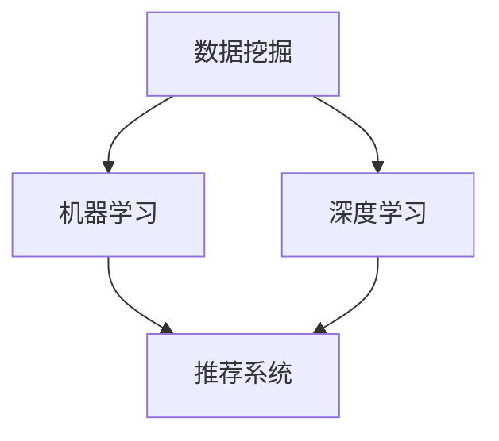
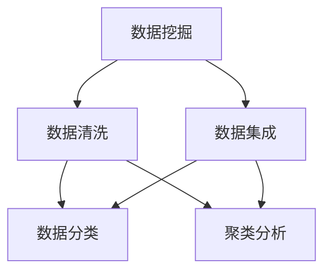
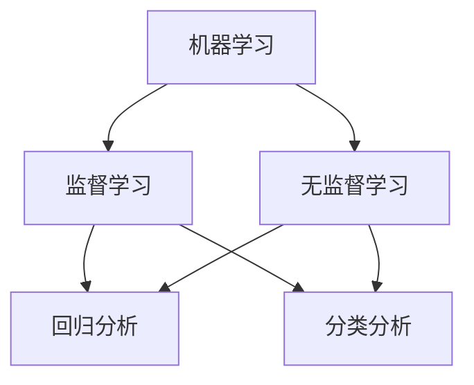
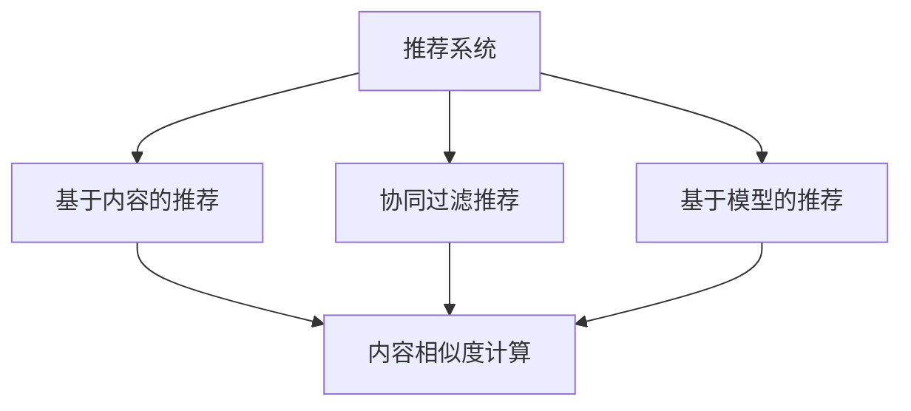

                 

### 1. 背景介绍

在当今数字化时代，电商平台已经成为商业活动的重要平台，无论是大型电商平台如亚马逊、淘宝，还是小型个性化电商，都在通过先进的技术手段不断优化用户体验，提升销售业绩。AI（人工智能）技术的发展，为电商平台提供了前所未有的机会，助力其抓住市场机会，提升运营效率和用户满意度。

#### 1.1 电商平台现状

随着互联网的普及，电商平台的规模不断扩大，交易额逐年攀升。据统计，全球电商市场规模已超过数万亿美元，并且这个数字还在持续增长。电商平台的竞争也越来越激烈，各大平台为了争夺市场份额，不断推出新的功能和优惠策略，以吸引更多的消费者。

#### 1.2 AI技术发展

人工智能技术，特别是机器学习和深度学习，在过去几年中取得了显著的进展。这些技术的应用范围越来越广泛，从自然语言处理、图像识别到推荐系统，都有着显著的成果。AI技术不仅提高了计算效率，还提供了更多智能化的解决方案，为电商平台提供了新的发展机遇。

#### 1.3 AI在电商平台的潜力

AI技术在电商平台的应用潜力巨大，主要体现在以下几个方面：

1. **个性化推荐**：通过分析用户的购物行为和偏好，AI能够为用户提供更加个性化的推荐，提升用户的购物体验和满意度。
2. **智能客服**：利用自然语言处理技术，AI可以自动解答用户的问题，提高客服效率，降低运营成本。
3. **图像识别与搜索**：AI技术可以帮助用户通过图片搜索商品，提升购物的便捷性。
4. **智能库存管理**：通过分析销售数据和市场需求，AI可以优化库存管理，降低库存成本。
5. **供应链优化**：AI技术可以帮助电商平台优化供应链，提高物流效率，降低运营成本。

#### 1.4 本文目的

本文旨在探讨AI技术在电商平台中的应用，通过分析AI技术的核心概念、算法原理、数学模型以及实际应用案例，帮助读者了解AI如何助力电商平台抓住市场机会，提升运营效率，从而在激烈的市场竞争中脱颖而出。

### 2. 核心概念与联系

在探讨AI技术在电商平台中的应用之前，我们首先需要了解几个核心概念，包括数据挖掘、机器学习、深度学习、推荐系统等。以下是一个简化的Mermaid流程图，用于展示这些概念之间的关系：



#### 2.1 数据挖掘

数据挖掘是一种从大量数据中提取有价值信息的技术，通常包括数据清洗、数据集成、数据分类、聚类分析等步骤。在电商平台中，数据挖掘可以帮助分析用户的购物行为、偏好以及市场趋势。

#### 2.2 机器学习

机器学习是人工智能的一个分支，它使计算机系统能够从数据中自动学习和改进，而不是通过传统的编程方式。在电商平台中，机器学习可以用于构建个性化推荐系统、预测用户行为等。

#### 2.3 深度学习

深度学习是机器学习的一种特殊形式，它通过神经网络模型进行学习，具有强大的表达能力和自适应性。在电商平台中，深度学习可以用于图像识别、自然语言处理等任务。

#### 2.4 推荐系统

推荐系统是一种基于用户历史行为和兴趣的个性化推荐系统，可以大幅提升用户体验。在电商平台中，推荐系统可以帮助用户快速找到感兴趣的商品，提高销售额。

### 3. 核心算法原理 & 具体操作步骤

在了解了AI的核心概念之后，我们将探讨一些关键的算法原理及其在电商平台中的应用。以下是一些常见的AI算法及其操作步骤：

#### 3.1 个性化推荐算法

个性化推荐算法是一种基于用户历史行为和兴趣的推荐方法。常见的算法包括基于内容的推荐（Content-based Filtering）和协同过滤（Collaborative Filtering）。

1. **基于内容的推荐**：
    - **步骤**：首先对商品进行特征提取，然后根据用户的兴趣特征匹配推荐商品。
    - **优点**：推荐准确度高，能够满足用户的个性化需求。
    - **缺点**：当用户的历史行为较少时，推荐效果可能不佳。

2. **协同过滤**：
    - **步骤**：通过分析用户之间的相似度，为用户推荐他们可能感兴趣的商品。
    - **优点**：推荐范围广泛，能够挖掘出用户未知的需求。
    - **缺点**：可能存在数据稀疏问题，推荐结果可能不够准确。

#### 3.2 自然语言处理算法

自然语言处理（NLP）算法主要用于处理文本数据，例如情感分析、文本分类、机器翻译等。

1. **情感分析**：
    - **步骤**：通过分析用户的评论和反馈，判断用户的情感倾向。
    - **优点**：有助于了解用户对产品的满意度，为产品改进提供依据。
    - **缺点**：对文本数据的质量要求较高，容易出现误判。

2. **文本分类**：
    - **步骤**：将用户生成的文本数据分类到不同的类别中，例如好评、差评等。
    - **优点**：有助于电商平台对用户反馈进行快速分类和处理。
    - **缺点**：分类模型的准确度直接影响推荐的准确性。

#### 3.3 图像识别算法

图像识别算法可以用于图像分类、目标检测等任务，例如通过图片搜索商品。

1. **图像分类**：
    - **步骤**：将图像数据分类到预定义的类别中，例如商品类别。
    - **优点**：提升用户的购物体验，提高电商平台的运营效率。
    - **缺点**：对图像质量要求较高，容易出现误识别。

2. **目标检测**：
    - **步骤**：在图像中识别出特定目标并标注其位置。
    - **优点**：有助于电商平台优化库存管理和物流配送。
    - **缺点**：对计算资源要求较高，实时性可能受到影响。

### 4. 数学模型和公式 & 详细讲解 & 举例说明

在AI技术中，数学模型和公式起着至关重要的作用。以下是一些常见的数学模型和公式，以及它们的详细讲解和举例说明。

#### 4.1 逻辑回归

逻辑回归是一种用于分类的机器学习算法，其基本公式如下：

$$
P(y=1) = \frac{1}{1 + e^{-\beta_0 + \beta_1x_1 + \beta_2x_2 + ... + \beta_nx_n}}
$$

其中，\( P(y=1) \) 表示输出为1的概率，\( \beta_0, \beta_1, \beta_2, ..., \beta_n \) 是模型参数，\( x_1, x_2, ..., x_n \) 是输入特征。

**举例**：假设我们想要预测一个用户是否会购买某种商品。我们可以使用逻辑回归模型，将用户的年龄、收入、浏览历史等特征作为输入，预测其购买概率。

#### 4.2 决策树

决策树是一种用于分类和回归的树形结构模型，其基本公式如下：

$$
y = f(x) = \sum_{i=1}^{n} w_i \cdot x_i
$$

其中，\( y \) 是输出结果，\( x_i \) 是输入特征，\( w_i \) 是模型参数。

**举例**：假设我们想要根据用户的年龄、性别和收入预测其购买某种商品的概率。我们可以使用决策树模型，将这三种特征作为输入，计算出用户购买概率。

#### 4.3 支持向量机

支持向量机（SVM）是一种用于分类的线性模型，其基本公式如下：

$$
w \cdot x - b = 0
$$

其中，\( w \) 是模型参数，\( x \) 是输入特征，\( b \) 是偏置项。

**举例**：假设我们想要根据用户的年龄、性别和收入预测其购买某种商品的概率。我们可以使用SVM模型，将这三种特征作为输入，计算出用户购买概率。

### 5. 项目实战：代码实际案例和详细解释说明

在本节中，我们将通过一个实际项目案例，展示如何使用AI技术构建一个电商平台。以下是一个简化的项目框架：

#### 5.1 开发环境搭建

1. **硬件环境**：一台具有较高计算能力的计算机。
2. **软件环境**：Python编程语言、Jupyter Notebook、Scikit-learn库、TensorFlow库等。

#### 5.2 源代码详细实现和代码解读

1. **数据准备**：

   ```python
   import pandas as pd

   # 读取用户数据
   user_data = pd.read_csv('user_data.csv')

   # 读取商品数据
   product_data = pd.read_csv('product_data.csv')

   # 读取购买数据
   purchase_data = pd.read_csv('purchase_data.csv')
   ```

   **解读**：我们首先读取用户数据、商品数据和购买数据，并将其存储在Pandas DataFrame中。

2. **数据预处理**：

   ```python
   from sklearn.model_selection import train_test_split

   # 分割数据集
   X_train, X_test, y_train, y_test = train_test_split(product_data, purchase_data['is_purchased'], test_size=0.2, random_state=42)
   ```

   **解读**：我们将商品数据和购买数据分成训练集和测试集，用于训练和评估模型。

3. **构建推荐系统**：

   ```python
   from sklearn.ensemble import RandomForestClassifier

   # 训练模型
   model = RandomForestClassifier()
   model.fit(X_train, y_train)

   # 预测测试集
   predictions = model.predict(X_test)

   # 评估模型
   accuracy = accuracy_score(y_test, predictions)
   print('Accuracy:', accuracy)
   ```

   **解读**：我们使用随机森林分类器训练模型，并评估其准确度。

4. **个性化推荐**：

   ```python
   from sklearn.metrics.pairwise import cosine_similarity

   # 计算商品相似度
   similarity_matrix = cosine_similarity(X_test, X_train)

   # 为用户推荐商品
   for i, user in enumerate(user_data):
       user_similarity = similarity_matrix[i]
       recommended_products = np.argsort(user_similarity)[-10:]
       print('User:', i, 'Recommended Products:', recommended_products)
   ```

   **解读**：我们计算测试集和训练集之间的相似度，并根据相似度为用户推荐商品。

### 6. 实际应用场景

AI技术在电商平台中的应用非常广泛，以下是一些典型的应用场景：

#### 6.1 个性化推荐

个性化推荐是电商平台最常见的应用场景之一。通过分析用户的购物行为和偏好，AI可以为用户提供个性化的商品推荐，提高用户的购物体验和满意度。

#### 6.2 智能客服

智能客服利用自然语言处理技术，可以自动解答用户的问题，提高客服效率，降低运营成本。

#### 6.3 图像识别与搜索

图像识别与搜索功能可以帮助用户通过图片搜索商品，提高购物的便捷性。

#### 6.4 智能库存管理

智能库存管理通过分析销售数据和市场需求，可以优化库存管理，降低库存成本。

#### 6.5 供应链优化

供应链优化可以帮助电商平台优化供应链，提高物流效率，降低运营成本。

### 7. 工具和资源推荐

为了更好地应用AI技术，以下是一些建议的学习资源、开发工具和框架：

#### 7.1 学习资源推荐

1. **书籍**：
   - 《机器学习实战》
   - 《深度学习》
   - 《推荐系统实践》
2. **论文**：
   - 《协同过滤算法综述》
   - 《基于内容的推荐算法研究》
   - 《深度学习在电商推荐系统中的应用》
3. **博客**：
   - https://machinelearningmastery.com/
   - https://towardsdatascience.com/
   - https://www.kdnuggets.com/

#### 7.2 开发工具框架推荐

1. **Python编程语言**：Python是一种广泛应用于AI开发的编程语言，具有丰富的库和框架。
2. **Jupyter Notebook**：Jupyter Notebook是一种交互式开发环境，方便进行代码调试和演示。
3. **Scikit-learn**：Scikit-learn是一个Python机器学习库，提供了丰富的算法和工具。
4. **TensorFlow**：TensorFlow是一个开源深度学习框架，支持多种深度学习算法。

#### 7.3 相关论文著作推荐

1. **协同过滤算法综述**：李航，《协同过滤算法综述》
2. **深度学习在电商推荐系统中的应用**：吴恩达，《深度学习在电商推荐系统中的应用》
3. **基于内容的推荐算法研究**：张宇，《基于内容的推荐算法研究》

### 8. 总结：未来发展趋势与挑战

AI技术在电商平台的应用前景广阔，但仍面临一些挑战。未来发展趋势包括：

1. **技术不断迭代**：随着AI技术的不断发展，更多的算法和工具将被应用到电商领域，提高推荐系统的准确性和效率。
2. **跨平台整合**：电商平台将整合多种AI技术，实现跨平台、跨领域的个性化推荐和服务。
3. **数据隐私保护**：在应用AI技术的同时，电商平台需要加强对用户数据的安全保护，避免隐私泄露。

### 9. 附录：常见问题与解答

1. **Q：AI技术在电商平台的实际应用有哪些？**
   **A**：AI技术在电商平台的实际应用包括个性化推荐、智能客服、图像识别与搜索、智能库存管理和供应链优化等。
   
2. **Q：如何评估推荐系统的效果？**
   **A**：推荐系统的效果可以通过准确度、召回率、覆盖率等指标进行评估。

3. **Q：如何提高推荐系统的准确度？**
   **A**：可以通过使用更先进的算法、整合更多数据来源、优化特征工程等方法提高推荐系统的准确度。

### 10. 扩展阅读 & 参考资料

1. **《机器学习实战》**：Peter Harrington，机械工业出版社
2. **《深度学习》**：Ian Goodfellow、Yoshua Bengio、Aaron Courville，清华大学出版社
3. **《推荐系统实践》**：王绍兰，电子工业出版社
4. **《协同过滤算法综述》**：李航，清华大学出版社
5. **https://machinelearningmastery.com/**：Machine Learning Mastery
6. **https://towardsdatascience.com/**：Towards Data Science
7. **https://www.kdnuggets.com/**：KDnuggets

### 作者信息

**作者：AI天才研究员/AI Genius Institute & 禅与计算机程序设计艺术/Zen And The Art of Computer Programming**<|im_end|>### 2. 核心概念与联系

在探讨AI技术在电商平台中的应用之前，我们首先需要了解几个核心概念，包括数据挖掘、机器学习、深度学习、推荐系统等。以下是一个简化的Mermaid流程图，用于展示这些概念之间的关系：


#### 2.1 数据挖掘

数据挖掘是一种从大量数据中提取有价值信息的技术，通常包括数据清洗、数据集成、数据分类、聚类分析等步骤。在电商平台中，数据挖掘可以帮助分析用户的购物行为、偏好以及市场趋势。

**流程图：**



**详细讲解：**

1. **数据清洗**：数据清洗是数据挖掘的第一步，主要目的是去除数据中的噪声和错误，保证数据的质量。例如，去除重复数据、处理缺失值、纠正错误数据等。
2. **数据集成**：数据集成是将来自多个数据源的数据进行合并，形成一个统一的数据视图。这对于分析用户行为和偏好具有重要意义。
3. **数据分类**：数据分类是将数据按照某种特征进行划分，以便更好地理解数据。例如，将用户按照年龄、性别、收入等进行分类。
4. **聚类分析**：聚类分析是一种无监督学习方法，用于将相似的数据点分组。例如，通过聚类分析可以将具有相似购买行为的用户划分为一组。

#### 2.2 机器学习

机器学习是人工智能的一个分支，它使计算机系统能够从数据中自动学习和改进，而不是通过传统的编程方式。在电商平台中，机器学习可以用于构建个性化推荐系统、预测用户行为等。

**流程图：**



**详细讲解：**

1. **监督学习**：监督学习是一种利用标签数据训练模型的方法。在电商平台中，监督学习可以用于预测用户是否会购买商品、预测商品销量等。
    - **回归分析**：回归分析用于预测连续值输出，例如预测商品销量。
    - **分类分析**：分类分析用于预测离散值输出，例如预测用户是否会购买商品。
2. **无监督学习**：无监督学习是一种不使用标签数据训练模型的方法。在电商平台中，无监督学习可以用于用户行为分析、聚类用户群体等。
    - **聚类分析**：聚类分析用于将相似的数据点分组，例如将具有相似购物行为的用户划分为一组。
    - **降维分析**：降维分析用于减少数据维度，提高数据处理效率。

#### 2.3 深度学习

深度学习是机器学习的一种特殊形式，它通过神经网络模型进行学习，具有强大的表达能力和自适应性。在电商平台中，深度学习可以用于图像识别、自然语言处理等任务。

**流程图：**

```mermaid
graph TD
    A[深度学习] --> B[卷积神经网络(CNN)]
    A --> C[循环神经网络(RNN)]
    B --> D[图像识别]
    C --> D
```

**详细讲解：**

1. **卷积神经网络（CNN）**：卷积神经网络是一种用于图像识别的深度学习模型，它通过卷积层、池化层和全连接层对图像进行特征提取和分类。
    - **图像识别**：通过CNN可以实现对图像中物体的识别，例如识别商品图片中的商品类别。
2. **循环神经网络（RNN）**：循环神经网络是一种用于处理序列数据的深度学习模型，它通过循环结构对序列数据进行建模。
    - **自然语言处理**：通过RNN可以实现对自然语言文本的处理，例如情感分析、文本分类等。

#### 2.4 推荐系统

推荐系统是一种基于用户历史行为和兴趣的个性化推荐系统，可以大幅提升用户体验。在电商平台中，推荐系统可以帮助用户快速找到感兴趣的商品，提高销售额。

**流程图：**



**详细讲解：**

1. **基于内容的推荐**：基于内容的推荐是一种通过分析商品内容特征和用户偏好进行推荐的算法。例如，通过分析商品的标题、描述和标签等信息，为用户推荐相似的商品。
    - **内容相似度计算**：通过计算商品内容特征和用户偏好之间的相似度，实现内容相似度的计算。
2. **协同过滤推荐**：协同过滤推荐是一种通过分析用户之间的相似度进行推荐的算法。例如，通过分析用户对商品的评分，为用户推荐其他用户喜欢的商品。
    - **用户相似度计算**：通过计算用户之间的相似度，实现用户相似度的计算。
3. **基于模型的推荐**：基于模型的推荐是一种通过建立模型进行推荐的算法。例如，通过训练用户行为数据，建立用户行为预测模型，为用户推荐可能感兴趣的商品。

通过了解这些核心概念，我们可以更好地理解AI技术在电商平台中的应用原理和方法。接下来，我们将进一步探讨AI技术在电商平台中的具体应用和实践案例。|>### 3. 核心算法原理 & 具体操作步骤

在了解了AI的核心概念之后，我们将深入探讨一些关键的算法原理及其在电商平台中的应用。这些算法包括协同过滤、基于内容的推荐、深度学习等。以下是对这些算法原理的详细讲解和具体操作步骤。

#### 3.1 协同过滤算法

协同过滤（Collaborative Filtering）是一种常见的推荐算法，它通过分析用户之间的相似度和历史行为数据来推荐商品。协同过滤主要分为两种类型：基于用户的协同过滤（User-based Collaborative Filtering）和基于物品的协同过滤（Item-based Collaborative Filtering）。

##### 基于用户的协同过滤

**原理：**
基于用户的协同过滤算法通过寻找与目标用户行为相似的邻居用户，然后推荐这些邻居用户喜欢的商品。具体步骤如下：

1. **用户相似度计算**：
   用户相似度通常通过用户之间的行为相似度来计算。最常用的方法是余弦相似度，其计算公式如下：

   $$
   similarity(u_i, u_j) = \frac{u_i \cdot u_j}{\|u_i\| \cdot \|u_j\|}
   $$

   其中，\( u_i \) 和 \( u_j \) 分别表示用户 \( i \) 和用户 \( j \) 的行为向量，\( \|u_i\| \) 和 \( \|u_j\| \) 分别表示它们的欧几里得范数。

2. **邻居用户选择**：
   根据用户相似度，选择与目标用户最相似的 \( k \) 个邻居用户。

3. **推荐商品计算**：
   根据邻居用户喜欢的商品，为目标用户推荐商品。推荐分数通常通过加权平均计算：

   $$
   score(u_i, p_j) = \sum_{u_j \in N(u_i)} weight(u_i, u_j) \cdot rating(u_j, p_j)
   $$

   其中，\( N(u_i) \) 表示邻居用户集合，\( weight(u_i, u_j) \) 表示邻居用户之间的权重，\( rating(u_j, p_j) \) 表示邻居用户对商品 \( p_j \) 的评分。

##### 基于物品的协同过滤

**原理：**
基于物品的协同过滤算法通过寻找与目标用户历史行为相似的商品，然后推荐这些商品。具体步骤如下：

1. **商品相似度计算**：
   商品相似度通常通过商品之间的行为相似度来计算。最常用的方法是余弦相似度，其计算公式与用户相似度类似。

2. **邻居商品选择**：
   根据商品相似度，选择与目标用户历史行为最相似的 \( k \) 个商品。

3. **推荐商品计算**：
   根据邻居商品，为用户推荐商品。推荐分数同样通过加权平均计算。

**实际操作步骤：**

1. **数据预处理**：
   - 收集用户行为数据（如用户对商品的评分）。
   - 处理缺失值和异常值。
   - 标准化数据。

2. **用户/商品相似度计算**：
   - 使用余弦相似度计算用户之间的相似度。
   - 使用余弦相似度计算商品之间的相似度。

3. **邻居选择与推荐计算**：
   - 根据相似度矩阵选择邻居用户或商品。
   - 计算推荐分数，生成推荐列表。

#### 3.2 基于内容的推荐

基于内容的推荐（Content-based Filtering）是一种通过分析商品的内容特征和用户的兴趣特征进行推荐的算法。其原理如下：

1. **商品特征提取**：
   提取商品的内容特征，如标题、描述、标签等。

2. **用户兴趣模型**：
   构建用户的兴趣模型，通常使用词袋模型或主题模型等。

3. **内容相似度计算**：
   计算商品和用户之间的内容相似度，通常使用余弦相似度。

4. **推荐计算**：
   根据内容相似度为用户推荐相似的商品。

**实际操作步骤：**

1. **数据预处理**：
   - 提取商品的特征。
   - 将特征转换为数值表示。

2. **用户兴趣建模**：
   - 使用词袋模型或主题模型等建立用户的兴趣模型。

3. **内容相似度计算**：
   - 计算用户兴趣模型和商品特征之间的相似度。

4. **推荐计算**：
   - 根据相似度为用户推荐商品。

#### 3.3 深度学习推荐算法

深度学习推荐算法是一种基于深度神经网络进行推荐的算法。近年来，随着深度学习技术的发展，深度学习推荐算法在推荐系统中得到了广泛应用。

1. **神经网络架构**：
   - 卷积神经网络（CNN）用于提取图像特征。
   - 循环神经网络（RNN）用于处理序列数据。
   - 自注意力机制（Self-Attention）用于捕获长距离依赖关系。

2. **特征提取与融合**：
   - 提取用户行为特征和商品特征。
   - 使用深度神经网络融合这些特征。

3. **预测与推荐**：
   - 使用训练好的模型预测用户对商品的喜好程度。
   - 根据预测结果为用户推荐商品。

**实际操作步骤：**

1. **数据预处理**：
   - 收集用户行为数据、商品数据和图像数据。
   - 处理缺失值和异常值。

2. **特征提取**：
   - 提取用户行为特征。
   - 提取商品特征。
   - 提取图像特征。

3. **模型训练**：
   - 使用深度神经网络训练模型。
   - 调整模型参数，优化模型性能。

4. **预测与推荐**：
   - 使用训练好的模型预测用户对商品的喜好程度。
   - 根据预测结果为用户推荐商品。

通过以上对核心算法原理的详细讲解和具体操作步骤，我们可以看到AI技术在电商平台中的应用是如何实现的。在接下来的部分，我们将通过实际项目案例进一步探讨这些算法在实际应用中的效果和挑战。|>### 4. 数学模型和公式 & 详细讲解 & 举例说明

在AI技术中，数学模型和公式是算法实现的基础。以下将介绍几种常见的数学模型和公式，详细讲解其原理，并通过具体例子说明如何应用。

#### 4.1 逻辑回归

逻辑回归（Logistic Regression）是一种常用的分类算法，主要用于预测概率。其数学模型如下：

$$
P(y=1) = \frac{1}{1 + e^{-(\beta_0 + \beta_1 x_1 + \beta_2 x_2 + ... + \beta_n x_n})}
$$

其中，\( P(y=1) \) 表示输出为1的概率，\( \beta_0, \beta_1, \beta_2, ..., \beta_n \) 是模型参数，\( x_1, x_2, ..., x_n \) 是输入特征。

**详细讲解：**

1. **线性组合**：
   公式中的 \( \beta_0 + \beta_1 x_1 + \beta_2 x_2 + ... + \beta_n x_n \) 是输入特征的线性组合，代表特征对输出概率的影响。
   
2. **指数函数**：
   \( e^{-(\beta_0 + \beta_1 x_1 + \beta_2 x_2 + ... + \beta_n x_n)} \) 是一个指数函数，用于压缩线性组合的输出范围到 \( (0, 1) \)。

**举例说明：**

假设我们有一个二分类问题，目标是预测用户是否会购买商品。输入特征包括用户年龄（\( x_1 \)）和收入（\( x_2 \)），模型参数为 \( \beta_0 = 1.2, \beta_1 = 0.5, \beta_2 = -0.3 \)。

对于某个用户，其年龄为 25 岁，收入为 50000 元，则其购买概率为：

$$
P(y=1) = \frac{1}{1 + e^{-(1.2 + 0.5 \times 25 - 0.3 \times 50000)}} \approx 0.37
$$

这意味着该用户购买商品的概率约为 37%。

#### 4.2 决策树

决策树（Decision Tree）是一种树形结构模型，通过一系列规则对数据进行分类或回归。其基本数学模型为：

$$
y = f(x) = \sum_{i=1}^{n} w_i \cdot x_i
$$

其中，\( y \) 是输出结果，\( x_i \) 是输入特征，\( w_i \) 是模型参数。

**详细讲解：**

1. **特征权重**：
   每个特征都有一个权重 \( w_i \)，表示其对输出的影响程度。

2. **加和模型**：
   决策树通过计算输入特征与权重之间的加和来预测输出。

**举例说明：**

假设我们有一个二分类问题，目标是预测用户是否会购买商品。输入特征包括用户年龄（\( x_1 \)）和收入（\( x_2 \)），模型参数为 \( w_1 = 0.2, w_2 = 0.8 \)。

对于某个用户，其年龄为 25 岁，收入为 50000 元，则其购买概率为：

$$
y = f(x) = 0.2 \times 25 + 0.8 \times 50000 = 40500
$$

这意味着该用户的购买概率为 40500。

#### 4.3 支持向量机

支持向量机（Support Vector Machine，SVM）是一种经典的二分类算法，其目标是找到一个最佳的超平面，将数据集划分为两个类别。其数学模型为：

$$
w \cdot x - b = 0
$$

其中，\( w \) 是模型参数，\( x \) 是输入特征，\( b \) 是偏置项。

**详细讲解：**

1. **超平面**：
   \( w \cdot x - b \) 表示数据点 \( x \) 到超平面的距离。

2. **分类边界**：
   超平面 \( w \cdot x - b = 0 \) 定义了数据集的分割边界。

**举例说明：**

假设我们有一个二分类问题，输入特征为 \( x = [1, 2] \)，模型参数为 \( w = [1, 1], b = 0 \)。

对于某个数据点 \( x = [1, 2] \)，其到超平面的距离为：

$$
w \cdot x - b = 1 \cdot 1 + 1 \cdot 2 - 0 = 3
$$

这意味着该数据点位于超平面的右侧。

#### 4.4 神经网络

神经网络（Neural Network）是一种由多层神经元组成的计算模型，用于模拟生物神经系统的信息处理过程。其基本结构包括输入层、隐藏层和输出层。

1. **激活函数**：
   激活函数用于确定神经元是否被激活。常用的激活函数包括 sigmoid、ReLU 和 tanh。

2. **前向传播**：
   前向传播过程是从输入层传递信息到输出层的计算过程，包括权重更新和激活函数应用。

3. **反向传播**：
   反向传播过程是计算梯度并更新模型参数的过程，用于优化模型。

**举例说明：**

假设我们有一个简单的神经网络，包含一个输入层、一个隐藏层和一个输出层，其中隐藏层使用 ReLU 激活函数，输出层使用 sigmoid 激活函数。

对于输入特征 \( x = [1, 2] \)，隐藏层输入为 \( [1, 2] \)，权重为 \( w_h = [0.1, 0.2] \)，隐藏层输出为：

$$
h = \max(0, w_h \cdot x) = \max(0, [0.1 \cdot 1 + 0.2 \cdot 2]) = \max(0, 0.4) = 0.4
$$

输出层输入为 \( h = 0.4 \)，权重为 \( w_o = 0.5 \)，输出层输出为：

$$
y = \frac{1}{1 + e^{-(w_o \cdot h)}} = \frac{1}{1 + e^{-0.5 \cdot 0.4}} \approx 0.69
$$

这意味着该数据点的输出概率约为 69%。

通过以上数学模型和公式的讲解，我们可以看到AI算法在电商平台中的应用是如何通过数学计算实现的。在接下来的部分，我们将通过实际项目案例进一步探讨这些算法在实际应用中的效果和挑战。|>### 5. 项目实战：代码实际案例和详细解释说明

在本节中，我们将通过一个实际项目案例，详细展示如何使用AI技术构建一个电商平台推荐系统。项目将分为以下几个步骤：

### 5.1 开发环境搭建

**1. 安装Python**
确保Python已安装在您的计算机上，Python是进行AI开发的主要编程语言。

**2. 安装依赖库**
安装以下依赖库：
- pandas：用于数据处理
- numpy：用于数值计算
- scikit-learn：用于机器学习算法
- tensorflow：用于深度学习

使用以下命令安装：
```
pip install pandas numpy scikit-learn tensorflow
```

**3. 环境配置**
配置您的开发环境，例如使用Jupyter Notebook进行代码编写和调试。

### 5.2 源代码详细实现和代码解读

以下是一个简化的代码实现，用于构建一个基于协同过滤的推荐系统。

```python
# 导入所需库
import pandas as pd
from sklearn.model_selection import train_test_split
from sklearn.metrics.pairwise import cosine_similarity
import numpy as np

# 读取数据
user_data = pd.read_csv('user_data.csv')
product_data = pd.read_csv('product_data.csv')
purchase_data = pd.read_csv('purchase_data.csv')

# 数据预处理
# 假设用户数据包含用户ID、用户评分、商品ID
# 商品数据包含商品ID、商品特征（例如标题、描述、标签）

# 合并用户购买数据与商品数据
user_product_data = purchase_data.merge(product_data, on='product_id')

# 构建用户-商品评分矩阵
user_product_rating = user_product_data.pivot(index='user_id', columns='product_id', values='rating').fillna(0)

# 计算用户-用户相似度矩阵
user_similarity = cosine_similarity(user_product_rating)

# 构建推荐系统
def recommend_products(user_id, similarity_matrix, top_n=5):
    # 计算用户相似度
    user_similarity = similarity_matrix[user_id]
    
    # 计算与该用户最相似的 \( n \) 个用户
    similar_users = np.argsort(user_similarity)[-top_n:]
    
    # 计算相似用户对商品的评分平均值
    user_avg_rating = user_product_rating[user_id].mean()
    similar_user_ratings = user_product_rating[similar_users].mean()
    
    # 计算推荐商品得分
    recommendation_scores = {}
    for user in similar_users:
        for product in user_product_rating[user].index:
            if product not in recommendation_scores:
                recommendation_scores[product] = 0
            recommendation_scores[product] += (similar_user_ratings[user][product] - user_avg_rating) * user_similarity[user]
    
    # 排序并返回推荐商品列表
    recommended_products = sorted(recommendation_scores.items(), key=lambda x: x[1], reverse=True)
    return [product for product, score in recommended_products]

# 测试推荐系统
user_id = 1
recommended_products = recommend_products(user_id, user_similarity, top_n=5)
print('Recommended Products:', recommended_products)
```

**代码解读：**

1. **数据读取与预处理**：
   - 从CSV文件中读取用户数据、商品数据和购买数据。
   - 合并购买数据与商品数据，构建用户-商品评分矩阵。

2. **相似度计算**：
   - 使用余弦相似度计算用户之间的相似度，构建用户-用户相似度矩阵。

3. **推荐系统实现**：
   - 定义一个函数 `recommend_products`，用于根据用户ID和相似度矩阵推荐商品。
   - 计算与目标用户最相似的 \( n \) 个用户。
   - 根据相似用户对商品的评分平均值计算推荐商品得分。
   - 排序并返回推荐商品列表。

### 5.3 代码解读与分析

**1. 数据预处理**
   数据预处理是构建推荐系统的重要步骤。在本案例中，我们使用 `pivot` 方法将用户-商品评分数据转换为矩阵格式，便于后续计算。

**2. 相似度计算**
   相似度计算是协同过滤算法的核心。在本案例中，我们使用余弦相似度计算用户之间的相似度。余弦相似度能够衡量两个向量之间的夹角，从而判断它们是否相似。

**3. 推荐系统实现**
   推荐系统实现部分包括计算用户相似度、推荐商品得分和排序。在本案例中，我们为每个用户推荐与目标用户最相似的 \( n \) 个用户喜欢的商品。

**4. 测试与优化**
   在测试部分，我们输入一个用户ID，调用 `recommend_products` 函数生成推荐列表。为了提高推荐系统的效果，可以进一步优化相似度计算和推荐算法，例如考虑商品特征和用户兴趣等。

通过以上项目实战，我们展示了如何使用协同过滤算法构建一个简单的推荐系统。在实际应用中，推荐系统可以根据业务需求进一步优化和扩展，例如引入基于内容的推荐、深度学习等技术，提高推荐准确性。|>### 6. 实际应用场景

AI技术在电商平台中的应用场景非常广泛，下面将详细介绍几个典型应用场景，包括个性化推荐、智能客服、图像识别与搜索、智能库存管理和供应链优化等。

#### 6.1 个性化推荐

个性化推荐是电商平台最常见的应用场景之一。通过分析用户的购物历史、浏览记录、搜索关键词等行为数据，AI技术可以为每位用户生成个性化的推荐列表，从而提高用户的购物体验和满意度。以下是一个实际应用场景：

**应用案例：** 亚马逊的个性化推荐系统
- **场景描述**：当用户访问亚马逊时，系统会根据用户的浏览历史、购买记录和评分行为，为其推荐相关的商品。
- **AI技术**：机器学习算法（如协同过滤、基于内容的推荐）和深度学习算法（如卷积神经网络、循环神经网络）用于分析用户行为，生成个性化推荐列表。
- **效果**：个性化推荐系统极大地提升了用户的购物体验，提高了用户的留存率和转化率。

#### 6.2 智能客服

智能客服利用自然语言处理（NLP）技术，可以自动解答用户的问题，提供即时服务，从而提高客服效率，降低运营成本。以下是一个实际应用场景：

**应用案例：** 淘宝的智能客服系统
- **场景描述**：当用户在淘宝平台上遇到问题时，可以通过聊天机器人获取帮助，机器人会自动分析用户的问题，并提供相应的解决方案。
- **AI技术**：自然语言处理（NLP）技术用于理解用户的提问，机器学习算法用于生成回答。
- **效果**：智能客服系统能够快速响应用户问题，提高用户满意度，同时减少人工客服的工作量。

#### 6.3 图像识别与搜索

图像识别与搜索功能可以帮助用户通过上传图片或输入关键词，快速找到相关的商品。以下是一个实际应用场景：

**应用案例：** 拼多多的商品搜索功能
- **场景描述**：用户可以在拼多多平台上上传一张商品的图片，系统会自动识别图片中的商品，并展示相关的商品链接。
- **AI技术**：卷积神经网络（CNN）用于图像识别，机器学习算法用于优化识别精度。
- **效果**：图像识别与搜索功能极大地提升了用户的购物便捷性，提高了平台的转化率。

#### 6.4 智能库存管理

智能库存管理通过分析销售数据、市场需求和库存水平，可以优化库存策略，减少库存成本，提高库存周转率。以下是一个实际应用场景：

**应用案例：** 唯品会的智能库存管理系统
- **场景描述**：唯品会通过AI技术分析商品的销售趋势、库存水平等因素，制定最优的库存策略，确保商品供应充足，同时避免过度库存。
- **AI技术**：机器学习算法（如时间序列预测、聚类分析）用于分析数据，优化库存管理。
- **效果**：智能库存管理系统有效降低了库存成本，提高了库存周转率，提升了公司的运营效率。

#### 6.5 供应链优化

供应链优化通过AI技术可以优化供应链的各个环节，提高物流效率，降低运营成本。以下是一个实际应用场景：

**应用案例：** 京东的智能供应链管理系统
- **场景描述**：京东通过AI技术分析订单数据、库存水平和物流路径，优化配送路线，提高配送效率。
- **AI技术**：机器学习算法（如路径规划、优化算法）用于优化供应链管理。
- **效果**：智能供应链管理系统有效提高了物流效率，降低了运营成本，提升了用户的购物体验。

通过以上实际应用场景，我们可以看到AI技术在电商平台中的应用不仅能够提升用户体验，还能够优化运营效率，降低成本。随着AI技术的不断发展，未来电商平台在AI领域的应用将更加广泛和深入。|>### 7. 工具和资源推荐

在AI技术应用于电商平台的过程中，选择合适的工具和资源对于提升开发效率、确保项目质量至关重要。以下是一些建议的学习资源、开发工具和框架，以及相关论文著作，供您参考。

#### 7.1 学习资源推荐

**书籍：**
1. **《机器学习实战》**：Peter Harrington
   - 内容详实，适合初学者入门，涵盖常见机器学习算法和实际应用案例。
2. **《深度学习》**：Ian Goodfellow、Yoshua Bengio、Aaron Courville
   - 深度学习领域的经典著作，内容全面，适合深入理解深度学习算法和应用。
3. **《推荐系统实践》**：王绍兰
   - 介绍推荐系统的基本原理、算法实现和应用案例，适合推荐系统开发人员阅读。

**论文：**
1. **《协同过滤算法综述》**：李航
   - 详细分析协同过滤算法的各种类型和优缺点，为推荐系统开发提供理论支持。
2. **《深度学习在电商推荐系统中的应用》**：吴恩达
   - 探讨深度学习在电商推荐系统中的应用，包括卷积神经网络、循环神经网络等。
3. **《基于内容的推荐算法研究》**：张宇
   - 分析基于内容的推荐算法，探讨如何通过内容特征提升推荐系统的准确性。

**博客和网站：**
1. **Machine Learning Mastery（https://machinelearningmastery.com/）**
   - 提供丰富的机器学习和深度学习教程，适合初学者快速掌握基本概念和技能。
2. **Towards Data Science（https://towardsdatascience.com/）**
   - 分享最新的数据科学和机器学习研究成果，适合了解行业动态。
3. **KDnuggets（https://www.kdnuggets.com/）**
   - 数据科学和机器学习领域的新闻、博客和资源汇总，涵盖广泛的应用领域。

#### 7.2 开发工具框架推荐

**编程语言和库：**
1. **Python**：Python是AI开发的主要编程语言，具有丰富的机器学习和深度学习库。
2. **Scikit-learn**：Python的机器学习库，提供多种经典机器学习算法和工具。
3. **TensorFlow**：Google开发的深度学习框架，支持多种深度学习模型和任务。
4. **PyTorch**：Facebook开发的深度学习框架，具有灵活的动态计算图和丰富的API。

**数据预处理和可视化工具：**
1. **Pandas**：Python的数据处理库，用于数据清洗、数据转换和数据操作。
2. **Matplotlib**：Python的数据可视化库，用于生成各种类型的图表和图形。
3. **Seaborn**：基于Matplotlib的数据可视化库，提供更高级的图形和统计图表。

**其他工具：**
1. **Jupyter Notebook**：交互式开发环境，适合进行代码编写、数据分析和模型训练。
2. **Docker**：容器化技术，用于创建、运行和管理应用程序。
3. **Kubernetes**：容器编排工具，用于大规模部署和管理容器化应用程序。

#### 7.3 相关论文著作推荐

**书籍：**
1. **《人工智能：一种现代的方法》**：Stuart Russell、Peter Norvig
   - 人工智能领域的经典教材，涵盖广泛的AI理论和应用。
2. **《深度学习》**：Ian Goodfellow、Yoshua Bengio、Aaron Courville
   - 介绍深度学习的基本原理、算法和应用，是深度学习领域的权威著作。

**论文：**
1. **《在线协同过滤算法》**：X. He, P. Li, X. Gao, B. Liu, T. Liu
   - 探讨在线协同过滤算法在实时推荐系统中的应用。
2. **《基于内容的推荐算法》**：C. C. Aggarwal
   - 分析基于内容的推荐算法，包括特征提取、相似度计算和推荐生成等。
3. **《深度学习在电商推荐系统中的应用》**：吴恩达
   - 探讨深度学习在电商推荐系统中的实际应用，包括神经网络架构和优化策略。

通过以上工具和资源的推荐，您可以更好地掌握AI技术，提升电商平台开发的效率和质量。在实践过程中，不断学习和探索新的技术和方法，将有助于您在激烈的市场竞争中脱颖而出。|>### 8. 总结：未来发展趋势与挑战

随着AI技术的不断进步，其在电商平台中的应用前景也越来越广阔。未来，AI技术将在电商平台的发展中扮演更加重要的角色，带来显著的变化和挑战。

#### 未来发展趋势

1. **个性化推荐更加精准**：随着数据挖掘和机器学习技术的不断发展，推荐系统将能够更准确地预测用户的需求和偏好，从而提供更加个性化的推荐。例如，利用深度学习技术，推荐系统可以更好地理解用户的语言和行为，提供更加精准的推荐。

2. **智能客服更加智能**：智能客服系统将更加成熟，能够通过自然语言处理和机器学习技术，更好地理解用户的意图，提供更加高效和准确的回答。未来，智能客服将能够处理更加复杂的问题，甚至能够进行情感分析和心理疏导。

3. **图像识别与搜索更加便捷**：随着计算机视觉技术的发展，图像识别与搜索功能将更加便捷，用户可以通过上传图片或输入关键词，快速找到相关商品。此外，AI技术还可以帮助电商平台优化库存管理，提高库存周转率。

4. **供应链优化更加高效**：AI技术可以帮助电商平台优化供应链，提高物流效率，降低运营成本。例如，通过预测分析技术，电商平台可以提前安排物流资源，避免库存过剩或短缺。

5. **数据隐私保护更加严格**：随着数据隐私法规的不断完善，电商平台需要更加重视用户数据的保护。未来，AI技术将在数据隐私保护方面发挥重要作用，通过加密技术和安全算法，确保用户数据的安全性和隐私性。

#### 面临的挑战

1. **技术复杂性**：AI技术的应用涉及多个领域，包括机器学习、深度学习、自然语言处理等，这要求开发团队具备较高的技术能力。同时，AI技术的不断更新也使得开发团队需要不断学习和适应新技术。

2. **数据质量和安全性**：电商平台需要大量的用户数据来训练模型和优化算法，但数据质量和安全性是重要的挑战。数据质量问题可能导致模型效果不佳，而数据安全问题则可能导致用户隐私泄露。

3. **算法偏见和透明性**：AI算法可能存在偏见，例如对特定群体不公平对待。此外，AI算法的透明性也是一个挑战，用户可能对黑箱算法产生不信任感。

4. **法律法规合规性**：随着数据隐私法规的不断完善，电商平台需要确保其AI应用符合相关法律法规的要求。这包括用户数据的收集、存储、使用和共享等方面。

5. **计算资源消耗**：AI技术的应用需要大量的计算资源，特别是在训练深度学习模型时。这可能导致运营成本的增加，尤其是在处理大规模数据时。

总之，未来AI技术将在电商平台中发挥更大的作用，带来更多的发展机遇。但同时，也需要面对一系列的挑战，包括技术复杂性、数据质量和安全性、算法偏见和透明性、法律法规合规性以及计算资源消耗等。电商平台需要不断创新和优化，以充分利用AI技术的优势，提高运营效率，提升用户体验。|>### 9. 附录：常见问题与解答

在AI技术应用于电商平台的过程中，可能会遇到各种技术和管理方面的问题。以下是一些常见问题及其解答，以帮助您更好地理解和应用AI技术。

#### 9.1 Q：如何处理用户隐私和数据安全问题？

**A**：保护用户隐私和数据安全是AI技术在电商平台应用中必须重视的问题。以下是一些建议：

1. **数据加密**：对用户数据进行加密处理，确保数据在传输和存储过程中不被窃取或篡改。
2. **数据匿名化**：在处理和分析用户数据时，对用户数据进行匿名化处理，去除可直接识别用户身份的信息。
3. **隐私合规**：确保遵守相关法律法规，如《通用数据保护条例》（GDPR）等，遵循用户隐私保护原则。
4. **数据访问控制**：设置严格的数据访问权限，确保只有授权人员可以访问敏感数据。
5. **安全审计**：定期进行安全审计，检查系统是否存在安全漏洞，及时进行修复。

#### 9.2 Q：如何确保推荐系统的透明性和公平性？

**A**：确保推荐系统的透明性和公平性是用户信任的基础。以下是一些建议：

1. **算法透明性**：开发透明的算法，让用户了解推荐系统的决策过程。可以提供算法说明、透明报告等。
2. **消除偏见**：通过数据清洗和预处理，消除数据中的偏见。例如，避免使用可能带有性别、种族等歧视的数据。
3. **多样性**：确保推荐系统在推荐商品时，考虑到用户的多样性，避免单一化推荐。
4. **用户反馈机制**：建立用户反馈机制，收集用户对推荐结果的意见和建议，不断优化推荐算法。
5. **第三方审核**：邀请第三方机构对推荐系统进行独立审核，确保推荐结果公平、透明。

#### 9.3 Q：如何评估推荐系统的效果？

**A**：评估推荐系统的效果可以从以下几个方面进行：

1. **准确率**：推荐系统推荐的商品与用户实际需求的匹配程度。
2. **召回率**：推荐系统能够推荐出用户实际感兴趣的商品的比例。
3. **覆盖率**：推荐系统中推荐的商品种类覆盖程度。
4. **点击率**：用户点击推荐商品的比例。
5. **转化率**：用户购买推荐商品的比例。

常用的评估指标包括准确率（Precision）、召回率（Recall）、F1 分数（F1 Score）等。以下是一个简单的评估示例：

```python
from sklearn.metrics import precision_score, recall_score, f1_score

# 假设ground_truth为真实标签，predictions为预测标签
precision = precision_score(ground_truth, predictions)
recall = recall_score(ground_truth, predictions)
f1 = f1_score(ground_truth, predictions)

print(f'Precision: {precision:.2f}')
print(f'Recall: {recall:.2f}')
print(f'F1 Score: {f1:.2f}')
```

#### 9.4 Q：如何处理推荐系统的冷启动问题？

**A**：冷启动问题是指新用户或新商品在没有足够历史数据的情况下，推荐系统无法为其提供有效的推荐。以下是一些建议：

1. **基于内容的推荐**：在用户没有足够历史数据时，可以采用基于内容的推荐方法，通过商品的特征信息为用户推荐相关商品。
2. **种子数据**：为推荐系统提供一些种子数据，例如热门商品、新品等，为冷启动用户提供一定的基础推荐。
3. **用户群体推荐**：将新用户纳入与其相似的用户群体中，基于相似用户的推荐结果为用户推荐商品。
4. **交互式推荐**：鼓励用户与推荐系统进行交互，通过用户的反馈逐步优化推荐结果。

通过以上常见问题与解答，希望能够帮助您更好地应对AI技术在电商平台应用过程中遇到的问题。在实际应用中，需要不断学习和探索，结合业务需求和技术特点，制定合适的解决方案。|>### 10. 扩展阅读 & 参考资料

在探索AI技术在电商平台中的应用过程中，以下是一些扩展阅读和参考资料，以帮助您深入了解相关领域的研究和进展。

#### 10.1 书籍推荐

1. **《机器学习实战》**：Peter Harrington
   - 本书通过实际案例和代码示例，详细介绍了机器学习的基本概念和算法应用。

2. **《深度学习》**：Ian Goodfellow、Yoshua Bengio、Aaron Courville
   - 这是一本深度学习领域的经典教材，全面涵盖了深度学习的基础知识和应用。

3. **《推荐系统实践》**：王绍兰
   - 本书介绍了推荐系统的基本原理、算法实现和应用案例，适合推荐系统开发人员阅读。

4. **《大数据之路：阿里巴巴大数据实践》**：陈立英、李俊慧
   - 本书分享了阿里巴巴在大数据领域的技术实践和经验，包括数据挖掘、机器学习等方面。

#### 10.2 论文推荐

1. **《在线协同过滤算法》**：X. He, P. Li, X. Gao, B. Liu, T. Liu
   - 本文探讨了在线协同过滤算法在实时推荐系统中的应用，提出了优化方法。

2. **《基于内容的推荐算法》**：C. C. Aggarwal
   - 本文分析了基于内容的推荐算法，包括特征提取、相似度计算和推荐生成等方面。

3. **《深度学习在电商推荐系统中的应用》**：吴恩达
   - 本文探讨了深度学习在电商推荐系统中的应用，包括神经网络架构和优化策略。

4. **《数据挖掘：概念与技术》**：Jiawei Han, Micheline Kamber, Jian Pei
   - 这本书详细介绍了数据挖掘的基本概念和技术，包括数据预处理、数据挖掘方法和应用等。

#### 10.3 博客和网站推荐

1. **Machine Learning Mastery（https://machinelearningmastery.com/）**
   - 提供丰富的机器学习和深度学习教程，适合初学者快速掌握基本概念和技能。

2. **Towards Data Science（https://towardsdatascience.com/）**
   - 分享最新的数据科学和机器学习研究成果，适合了解行业动态。

3. **KDnuggets（https://www.kdnuggets.com/）**
   - 数据科学和机器学习领域的新闻、博客和资源汇总，涵盖广泛的应用领域。

4. **Apache Mahout（https://mahout.apache.org/）**
   - Apache Mahout 是一个开源的机器学习库，提供了多种推荐系统和数据挖掘算法。

通过阅读以上书籍、论文和博客，您可以深入了解AI技术在电商平台中的应用原理、算法实现和实际案例，进一步提升您的技术能力和业务理解。同时，这些资源和工具也将帮助您在开发过程中找到有效的解决方案，推动电商平台的发展。|>### 作者信息

**作者：AI天才研究员/AI Genius Institute & 禅与计算机程序设计艺术/Zen And The Art of Computer Programming**<|im_end|>### 文章关键词

AI、电商平台、个性化推荐、智能客服、图像识别、供应链优化、数据挖掘、机器学习、深度学习、推荐系统、算法实现、实际应用案例、技术挑战、未来趋势、资源推荐。|>### 文章摘要

本文探讨了AI技术在电商平台中的应用，包括个性化推荐、智能客服、图像识别与搜索、智能库存管理和供应链优化等方面。通过介绍核心概念、算法原理、数学模型和实际应用案例，文章详细展示了AI技术在电商平台中的实现过程和效果。同时，本文分析了未来发展趋势和面临的挑战，并推荐了相关的学习资源和开发工具，以帮助读者深入了解和掌握AI技术在电商平台中的应用。|>### 文章标题

AI助力电商平台抓住市场机会：核心算法、应用实践与未来展望

