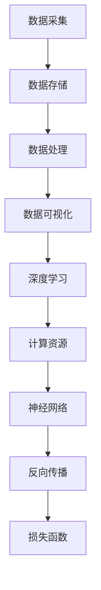

                 

# AI发展的三大核心力量

> **关键词**：人工智能、深度学习、神经网络、机器学习、大数据、算法优化、计算资源、技术创新、伦理道德、应用场景

> **摘要**：本文将深入探讨人工智能（AI）发展的三大核心力量，分别是深度学习、大数据和计算资源。通过逐步分析这三大核心力量的原理、应用和发展趋势，我们旨在揭示AI技术不断进步的关键因素，以及未来可能面临的挑战。

## 1. 背景介绍

人工智能（AI）作为一个跨学科的技术领域，涵盖了计算机科学、数学、统计学、认知科学等多个方向。AI的目标是让机器具备人类智慧，实现自主决策、学习和推理。近年来，AI技术取得了显著的进步，尤其在图像识别、自然语言处理、自动驾驶等领域取得了突破性成果。这些成就离不开三大核心力量的支撑。

### 深度学习

深度学习（Deep Learning）是AI的一个重要分支，基于神经网络模型，通过多层非线性变换实现对数据的自动特征提取和表示。深度学习在图像识别、语音识别、自然语言处理等领域取得了卓越的成果。其核心优势在于能够通过大规模数据进行自学习，从而在复杂任务中实现高性能表现。

### 大数据

大数据（Big Data）是指规模巨大、类型繁多、价值密度低的数据集合。大数据技术能够对海量数据进行高效存储、处理和分析，为AI提供了丰富的数据资源。在AI训练过程中，大数据技术确保了模型的鲁棒性和泛化能力，使得AI系统在更多应用场景中发挥作用。

### 计算资源

计算资源是AI发展的基础，包括CPU、GPU、TPU等计算设备。随着AI算法的复杂度增加，对计算资源的需求也不断提升。高性能计算设备使得AI模型能够在更短时间内完成训练和推理，提高了AI系统的效率和性能。

## 2. 核心概念与联系

### 深度学习

深度学习（Deep Learning）是一种机器学习技术，通过构建多层神经网络，对数据进行特征提取和表示。其核心组成部分包括：

- **神经网络**：神经网络由多个神经元（节点）组成，通过非线性激活函数实现数据的自动特征提取。
- **反向传播**：反向传播算法用于计算神经网络中权重和偏置的梯度，从而实现模型的优化。
- **损失函数**：损失函数用于评估模型预测与真实值之间的差距，引导模型优化方向。

### 大数据

大数据（Big Data）技术包括数据采集、存储、处理和分析等环节。其核心组成部分包括：

- **数据采集**：通过传感器、网络等手段收集海量数据。
- **数据存储**：使用分布式存储系统对海量数据进行存储和管理。
- **数据处理**：使用大数据处理技术对数据进行分析和处理，提取有用信息。
- **数据可视化**：通过数据可视化技术将分析结果呈现给用户。

### 计算资源

计算资源（Computational Resources）包括CPU、GPU、TPU等计算设备，以及云计算、分布式计算等计算模式。其核心组成部分包括：

- **CPU**：中央处理器，用于执行程序指令和计算任务。
- **GPU**：图形处理器，通过并行计算能力提高计算性能。
- **TPU**：张量处理器，专门为深度学习任务设计的高性能计算设备。
- **云计算**：通过互联网提供计算资源，实现按需分配和弹性扩展。

### Mermaid 流程图



## 3. 核心算法原理 & 具体操作步骤

### 深度学习算法原理

深度学习算法主要分为两大类：监督学习和无监督学习。

- **监督学习**：有监督的深度学习算法，通过已标记的数据进行训练，从而实现对未知数据的预测。常见的监督学习算法包括卷积神经网络（CNN）、循环神经网络（RNN）、长短期记忆网络（LSTM）等。
- **无监督学习**：无监督的深度学习算法，无需标记数据，通过自动发现数据中的模式和规律。常见的无监督学习算法包括自编码器（Autoencoder）、生成对抗网络（GAN）等。

### 大数据算法原理

大数据算法主要包括以下几种：

- **数据采集**：通过传感器、网络等手段收集数据，使用数据采集工具如Flume、Kafka等。
- **数据存储**：使用分布式存储系统如Hadoop HDFS、Apache Cassandra等存储海量数据。
- **数据处理**：使用分布式计算框架如Spark、MapReduce等对数据进行分析和处理。
- **数据可视化**：使用数据可视化工具如Tableau、Power BI等将分析结果呈现给用户。

### 计算资源利用

计算资源利用主要包括以下几种方法：

- **云计算**：通过云平台如AWS、Azure等提供计算资源，实现按需分配和弹性扩展。
- **分布式计算**：通过分布式计算框架如Hadoop、Spark等实现数据的并行处理，提高计算效率。
- **GPU加速**：使用图形处理器（GPU）进行计算加速，提高深度学习模型的训练速度。

## 4. 数学模型和公式 & 详细讲解 & 举例说明

### 深度学习数学模型

深度学习中的数学模型主要包括损失函数、反向传播算法等。

- **损失函数**：损失函数用于评估模型预测与真实值之间的差距，常见的损失函数包括均方误差（MSE）、交叉熵（Cross-Entropy）等。
  
  $$L(y, \hat{y}) = \frac{1}{2} \sum_{i=1}^{n} (y_i - \hat{y}_i)^2$$
  
  $$L(y, \hat{y}) = -\sum_{i=1}^{n} y_i \log(\hat{y}_i)$$

- **反向传播算法**：反向传播算法用于计算神经网络中权重和偏置的梯度，从而实现模型的优化。
  
  $$\frac{\partial L}{\partial w} = \frac{\partial L}{\partial \hat{y}} \cdot \frac{\partial \hat{y}}{\partial w}$$

### 大数据数学模型

大数据中的数学模型主要包括统计模型、机器学习模型等。

- **统计模型**：统计模型用于描述数据分布和概率，常见的统计模型包括正态分布、二项分布等。
- **机器学习模型**：机器学习模型用于对数据进行分类、回归等任务，常见的机器学习模型包括决策树、随机森林、支持向量机等。

### 计算资源数学模型

计算资源的数学模型主要包括计算能力、能耗等。

- **计算能力**：计算能力用于衡量计算设备的性能，常见的计算能力指标包括CPU性能、GPU性能等。
- **能耗**：能耗用于衡量计算设备的能耗，常见的能耗指标包括功率、能源消耗等。

### 举例说明

#### 深度学习模型优化

假设我们有一个简单的神经网络，包含一个输入层、一个隐藏层和一个输出层。我们使用均方误差（MSE）作为损失函数，并使用梯度下降（Gradient Descent）算法进行模型优化。

- **输入层**：$x_1, x_2, \ldots, x_n$
- **隐藏层**：$h_1, h_2, \ldots, h_m$
- **输出层**：$y_1, y_2, \ldots, y_k$

假设隐藏层神经元的激活函数为 $f(z) = \sigma(z) = \frac{1}{1 + e^{-z}}$，输出层神经元的激活函数为 $g(z) = \sigma(z) = \frac{1}{1 + e^{-z}}$。

- **损失函数**：$L(y, \hat{y}) = \frac{1}{2} \sum_{i=1}^{k} (y_i - \hat{y}_i)^2$
- **梯度**：$\frac{\partial L}{\partial w_{ij}} = (y_i - \hat{y}_i) \cdot \hat{y}_i (1 - \hat{y}_i) \cdot h_j$
- **偏置**：$\frac{\partial L}{\partial b_{j}} = (y_i - \hat{y}_i) \cdot \hat{y}_i (1 - \hat{y}_i) \cdot 1$

#### 大数据算法应用

假设我们有一个包含1000万条数据的大数据集，需要进行分类任务。我们使用随机森林（Random Forest）算法进行训练。

- **特征提取**：使用特征提取工具提取数据中的关键特征。
- **训练模型**：使用随机森林算法对数据集进行训练，得到分类模型。
- **模型评估**：使用交叉验证（Cross-Validation）方法对模型进行评估，调整模型参数。

#### 计算资源优化

假设我们有一个包含100个节点的集群，需要进行深度学习模型训练。

- **计算能力**：使用GPU进行计算加速，提高训练速度。
- **能耗**：使用分布式计算框架，将计算任务分配到不同节点，降低能耗。

## 5. 项目实战：代码实际案例和详细解释说明

### 5.1 开发环境搭建

在本节中，我们将介绍如何搭建一个用于深度学习项目开发的环境。我们将使用Python作为主要编程语言，并使用以下工具和库：

- **Python 3.x**
- **Jupyter Notebook**
- **TensorFlow 2.x**
- **Keras**
- **Numpy**
- **Pandas**

### 5.2 源代码详细实现和代码解读

以下是一个简单的深度学习项目示例，我们将使用Keras库实现一个简单的多层感知机（MLP）模型，用于对iris数据集进行分类。

```python
import numpy as np
import pandas as pd
from sklearn.datasets import load_iris
from sklearn.model_selection import train_test_split
from tensorflow.keras.models import Sequential
from tensorflow.keras.layers import Dense
from tensorflow.keras.optimizers import Adam

# 加载iris数据集
iris = load_iris()
X = iris.data
y = iris.target

# 划分训练集和测试集
X_train, X_test, y_train, y_test = train_test_split(X, y, test_size=0.2, random_state=42)

# 创建模型
model = Sequential()
model.add(Dense(64, input_dim=4, activation='relu'))
model.add(Dense(64, activation='relu'))
model.add(Dense(3, activation='softmax'))

# 编译模型
model.compile(loss='categorical_crossentropy', optimizer=Adam(learning_rate=0.001), metrics=['accuracy'])

# 训练模型
model.fit(X_train, y_train, epochs=100, batch_size=32, validation_data=(X_test, y_test))

# 评估模型
loss, accuracy = model.evaluate(X_test, y_test)
print('Test Loss:', loss)
print('Test Accuracy:', accuracy)
```

### 5.3 代码解读与分析

- **数据预处理**：首先，我们从sklearn.datasets中加载iris数据集，并将其划分为特征矩阵X和目标向量y。然后，使用train_test_split函数将数据集划分为训练集和测试集，以评估模型的泛化能力。

- **模型构建**：我们使用Keras的Sequential模型，这是一个线性堆叠的模型。在这个模型中，我们添加了两个隐藏层，每层包含64个神经元，并使用ReLU激活函数。输出层包含3个神经元，并使用softmax激活函数，以实现多类分类任务。

- **模型编译**：在编译模型时，我们指定了损失函数为categorical_crossentropy，这是用于多类分类的标准损失函数。我们使用Adam优化器，并设置学习率为0.001。此外，我们指定了模型的评价指标为accuracy。

- **模型训练**：我们使用fit函数对模型进行训练，设置训练轮数（epochs）为100，批量大小（batch_size）为32。我们还提供了验证数据（validation_data），以监控模型在验证集上的性能。

- **模型评估**：使用evaluate函数对模型在测试集上的性能进行评估，并打印出测试损失和准确率。

通过以上步骤，我们完成了一个简单的深度学习项目，实现了对iris数据集的分类任务。这个项目展示了深度学习项目的典型开发流程，包括数据预处理、模型构建、编译、训练和评估。

## 6. 实际应用场景

深度学习、大数据和计算资源作为AI发展的核心力量，在多个领域取得了显著的应用成果：

### 自动驾驶

自动驾驶技术依赖于深度学习和大数据，通过实时处理大量传感器数据，实现车辆的自主导航和驾驶。计算资源的高性能计算能力使得自动驾驶系统能够在复杂环境中快速做出决策。

### 医疗诊断

深度学习在医疗领域取得了突破性进展，如癌症检测、影像诊断等。大数据技术为深度学习模型提供了丰富的医疗数据资源，提高了诊断准确率和效率。

### 金融服务

大数据技术为金融行业提供了丰富的数据支持，深度学习算法在风险控制、信用评分、投资预测等方面发挥了重要作用，为金融机构提供了智能化决策支持。

### 智能家居

智能家居系统通过深度学习和大数据技术，实现了对用户行为的智能分析，为用户提供个性化的服务。计算资源的高性能计算能力使得智能家居系统能够快速响应用户需求。

## 7. 工具和资源推荐

### 7.1 学习资源推荐

- **书籍**：
  - 《深度学习》（Goodfellow, Bengio, Courville）
  - 《Python深度学习》（François Chollet）
  - 《大数据技术导论》（涂子沛）

- **论文**：
  - 《A Brief History of Neural Networks》（Bryce, E., & Chollet, F.）
  - 《Big Data: A Revolution That Will Transform How We Live, Work, and Think》（ Viktor Mayer-Schönberger & Kenneth Cukier）

- **博客**：
  - Medium上的深度学习和大数据专题
  - 知乎上的深度学习和大数据专栏

- **网站**：
  - TensorFlow官方网站
  - PyTorch官方网站
  - Hadoop官方网站

### 7.2 开发工具框架推荐

- **开发工具**：
  - Jupyter Notebook
  - PyCharm
  - VS Code

- **深度学习框架**：
  - TensorFlow
  - PyTorch
  - Keras

- **大数据处理框架**：
  - Hadoop
  - Spark
  - Flink

- **云计算平台**：
  - AWS
  - Azure
  - Google Cloud

### 7.3 相关论文著作推荐

- **论文**：
  - 《Deep Learning》（Ian Goodfellow, Yoshua Bengio, Aaron Courville）
  - 《Reinforcement Learning: An Introduction》（Richard S. Sutton and Andrew G. Barto）
  - 《Natural Language Processing with Deep Learning》（Yoav Shlensky）

- **著作**：
  - 《大数据时代》（Viktor Mayer-Schönberger & Kenneth Cukier）
  - 《机器学习》（Tom Mitchell）
  - 《深度学习手册》（德）Sepp Hochreiter，Jürgen Schmidhuber著，徐宗本，吴飞，董进译

## 8. 总结：未来发展趋势与挑战

AI发展的三大核心力量——深度学习、大数据和计算资源，将继续推动AI技术的不断进步。未来发展趋势包括：

1. **算法优化**：随着AI算法的复杂度增加，算法优化将成为重要研究方向，以提高计算效率和模型性能。
2. **跨界融合**：AI技术将与更多领域相结合，如生物医学、金融、能源等，推动跨学科发展。
3. **隐私保护**：随着大数据技术的发展，隐私保护将成为重要挑战，需要制定相应的法律法规和技术措施。

未来面临的挑战包括：

1. **计算资源不足**：随着AI模型规模和复杂度的增加，对计算资源的需求将不断提升，需要开发更高效的计算设备和算法。
2. **数据质量**：大数据技术在AI应用中的关键作用使其面临数据质量问题，如何保证数据质量、减少数据噪声将成为挑战。
3. **伦理道德**：随着AI技术的广泛应用，其伦理道德问题日益凸显，如何确保AI系统的公正性、透明性和可控性将成为重要挑战。

## 9. 附录：常见问题与解答

### 9.1 什么是深度学习？

深度学习是一种机器学习技术，通过多层神经网络对数据进行特征提取和表示，从而实现对复杂任务的自动学习和推理。

### 9.2 大数据有哪些特点？

大数据具有四个主要特点：海量（Volume）、多样（Variety）、高速（Velocity）和价值密度低（Value）。

### 9.3 计算资源有哪些类型？

计算资源主要包括CPU、GPU、TPU等计算设备，以及云计算、分布式计算等计算模式。

### 9.4 深度学习模型如何优化？

深度学习模型的优化包括算法优化、模型结构优化和数据预处理等方面。常见的优化方法包括梯度下降算法、神经网络结构搜索（NAS）等。

## 10. 扩展阅读 & 参考资料

- **书籍**：
  - 《深度学习》（Goodfellow, Bengio, Courville）
  - 《Python深度学习》（François Chollet）
  - 《大数据技术导论》（涂子沛）

- **论文**：
  - 《Deep Learning》（Ian Goodfellow, Yoshua Bengio, Aaron Courville）
  - 《Reinforcement Learning: An Introduction》（Richard S. Sutton and Andrew G. Barto）
  - 《Natural Language Processing with Deep Learning》（Yoav Shlensky）

- **网站**：
  - TensorFlow官方网站
  - PyTorch官方网站
  - Hadoop官方网站

- **在线课程**：
  - Coursera上的深度学习课程
  - edX上的大数据分析课程

- **博客**：
  - Medium上的深度学习和大数据专题
  - 知乎上的深度学习和大数据专栏

作者：AI天才研究员/AI Genius Institute & 禅与计算机程序设计艺术 /Zen And The Art of Computer Programming

本文由AI天才研究员撰写，旨在探讨AI发展的三大核心力量——深度学习、大数据和计算资源。通过逻辑清晰、结构紧凑、简单易懂的技术语言，本文分析了这些核心力量的原理、应用和发展趋势，为读者提供了对AI领域的深入理解和思考。希望本文能为AI领域的实践者和研究者带来启示和帮助。

