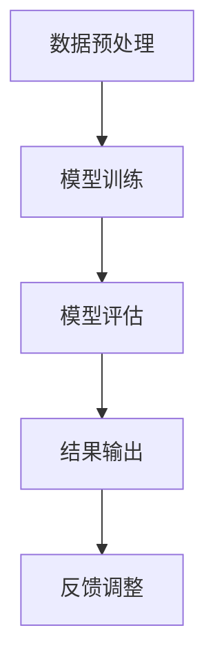
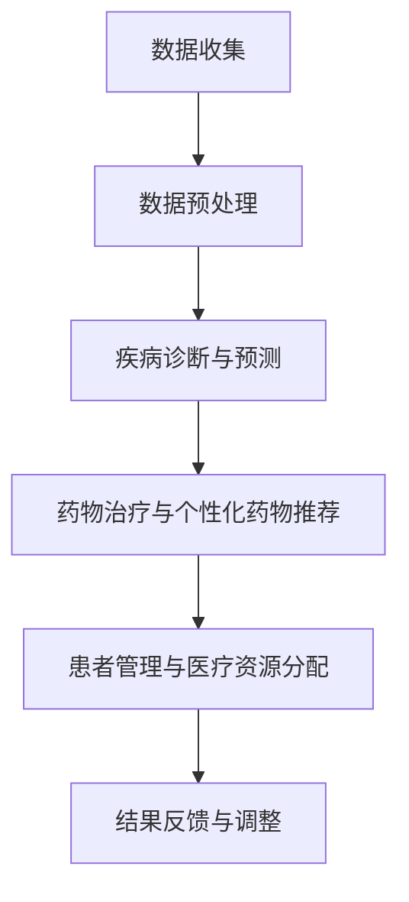

                 

# AI在个性化医疗中的应用：精准治疗方案

## 摘要

本文旨在探讨人工智能在个性化医疗中的应用，重点关注如何利用AI技术实现精准治疗方案。文章首先介绍了个性化医疗的背景和重要性，随后详细阐述了AI在疾病诊断、药物治疗和患者管理中的核心算法原理、数学模型以及实际应用案例。此外，文章还推荐了相关学习资源、开发工具和前沿论文，并对未来发展趋势和挑战进行了展望。通过本文，读者可以全面了解AI在个性化医疗领域的应用现状和发展潜力。

## 1. 背景介绍

### 1.1 个性化医疗的概念

个性化医疗是一种基于个体差异，针对患者个体量身定制的医疗模式。它以患者的基因组信息、生活方式、病史和生理特征等多维度数据为基础，通过数据分析、生物信息学和人工智能等先进技术，实现对疾病的精准预测、诊断和个性化治疗。个性化医疗的目标是提高治疗效果，减少医疗资源浪费，改善患者生活质量。

### 1.2 个性化医疗的重要性

个性化医疗在当前医疗体系中的重要性日益凸显。首先，随着人口老龄化加剧，慢性病和恶性肿瘤等疾病的发病率逐年上升，传统的“一刀切”治疗模式已无法满足患者的需求。个性化医疗可以根据患者的具体病情和生理特点，制定更合适的治疗方案，提高治疗效果。其次，医疗资源的分配不均使得优质医疗资源集中在一线城市，而广大农村和边远地区的患者难以获得及时、有效的治疗。个性化医疗可以借助远程医疗等技术手段，将优质医疗资源下沉，提高基层医疗水平。此外，个性化医疗有助于降低医疗成本，提高医疗效率，缓解医疗资源紧张的局面。

### 1.3 人工智能在个性化医疗中的应用现状

人工智能在个性化医疗领域具有广泛的应用前景。目前，AI技术在疾病诊断、药物治疗、患者管理和医疗资源分配等方面已取得显著成果。例如，深度学习技术在图像识别和病理分析中的应用，提高了癌症等疾病的早期诊断率；自然语言处理技术在电子病历和医学文献挖掘中的应用，为临床决策提供了有力的支持；机器学习算法在个性化药物推荐和患者风险评估中的应用，有助于实现精准治疗。然而，AI技术在个性化医疗中的应用仍面临诸多挑战，如数据隐私、算法透明度和伦理问题等。

## 2. 核心概念与联系

### 2.1 疾病诊断与预测

疾病诊断与预测是个性化医疗的关键环节。基于AI技术的疾病诊断与预测主要包括以下几个方面：

#### 2.1.1 医学图像分析

医学图像分析是AI技术在个性化医疗中应用的一个重要领域。通过深度学习算法，可以对医学图像（如X光片、CT扫描、MRI等）进行自动识别和分类，实现疾病的早期诊断和预测。以下是医学图像分析的一个Mermaid流程图：



#### 2.1.2 电子病历分析

电子病历（Electronic Health Records, EHRs）是记录患者健康状况和治疗过程的重要数据来源。通过自然语言处理（Natural Language Processing, NLP）技术，可以自动提取和解析EHRs中的关键信息，如疾病症状、治疗方案和患者反应等，为疾病诊断和预测提供支持。

#### 2.1.3 基因组分析

基因组分析是个性化医疗的重要基础。通过基因组测序和生物信息学分析，可以揭示患者遗传信息与疾病之间的关联，为疾病诊断和预测提供依据。

### 2.2 药物治疗与个性化药物推荐

药物治疗是个性化医疗的核心内容。基于AI技术的个性化药物推荐主要包括以下几个方面：

#### 2.2.1 药物反应预测

药物反应预测是个性化药物推荐的关键步骤。通过机器学习算法，可以分析患者的基因组、生理特征和病史等数据，预测其对特定药物的反应，为个性化治疗提供依据。

#### 2.2.2 药物组合优化

药物组合优化是提高治疗效果的重要手段。通过深度学习算法，可以分析大量药物组合数据，筛选出最优的药物组合方案，提高治疗效果。

#### 2.2.3 药物副作用预测

药物副作用预测是确保患者安全的重要环节。通过机器学习算法，可以预测特定药物在患者身上可能产生的副作用，为临床决策提供支持。

### 2.3 患者管理与医疗资源分配

患者管理与医疗资源分配是提高医疗效率的重要方面。基于AI技术的患者管理和医疗资源分配主要包括以下几个方面：

#### 2.3.1 患者风险评估

患者风险评估是患者管理的重要环节。通过机器学习算法，可以分析患者的病情、病史和生理特征等数据，评估其病情的严重程度和发展趋势，为临床决策提供支持。

#### 2.3.2 医疗资源分配

医疗资源分配是提高医疗效率的关键。通过优化算法和机器学习技术，可以实现医疗资源的合理配置，提高医疗服务的质量和效率。

### 2.4 AI在个性化医疗中的整体架构

以下是AI在个性化医疗中的整体架构的Mermaid流程图：



## 3. 核心算法原理 & 具体操作步骤

### 3.1 疾病诊断与预测算法原理

疾病诊断与预测算法主要基于深度学习和机器学习技术。以下是具体操作步骤：

#### 3.1.1 数据收集与预处理

收集大量医学图像、电子病历和基因组数据，对数据进行清洗、归一化和特征提取，为模型训练提供高质量的数据集。

#### 3.1.2 模型选择与训练

选择合适的深度学习模型（如卷积神经网络（CNN）或循环神经网络（RNN））进行训练，通过梯度下降等优化算法，调整模型参数，提高模型性能。

#### 3.1.3 模型评估与优化

对训练好的模型进行评估，通过交叉验证、精度和召回率等指标，评估模型性能，并对模型进行调整和优化。

#### 3.1.4 结果输出与解释

将诊断结果输出给医生或患者，并对结果进行解释，提高患者对诊断结果的信任度。

### 3.2 药物治疗与个性化药物推荐算法原理

药物治疗与个性化药物推荐算法主要基于协同过滤、决策树和神经网络等机器学习技术。以下是具体操作步骤：

#### 3.2.1 数据收集与预处理

收集大量药物反应、患者病史和生理特征等数据，对数据进行清洗、归一化和特征提取，为模型训练提供高质量的数据集。

#### 3.2.2 模型选择与训练

选择合适的机器学习模型（如协同过滤、决策树或神经网络）进行训练，通过交叉验证、精度和召回率等指标，评估模型性能。

#### 3.2.3 个性化药物推荐

根据患者的具体病情和生理特征，利用训练好的模型，推荐个性化的药物治疗方案。

#### 3.2.4 药物副作用预测

利用训练好的模型，预测特定药物在患者身上可能产生的副作用，为临床决策提供支持。

### 3.3 患者管理与医疗资源分配算法原理

患者管理与医疗资源分配算法主要基于优化算法、聚类分析和深度学习等人工智能技术。以下是具体操作步骤：

#### 3.3.1 数据收集与预处理

收集大量患者病情、病史、生理特征和医疗资源等数据，对数据进行清洗、归一化和特征提取，为模型训练提供高质量的数据集。

#### 3.3.2 模型选择与训练

选择合适的优化算法、聚类分析或深度学习模型（如卷积神经网络或循环神经网络）进行训练，通过交叉验证、精度和召回率等指标，评估模型性能。

#### 3.3.3 医疗资源分配

根据患者的病情和需求，利用训练好的模型，实现医疗资源的合理分配，提高医疗服务质量和效率。

#### 3.3.4 患者风险评估

利用训练好的模型，评估患者的病情严重程度和发展趋势，为临床决策提供支持。

## 4. 数学模型和公式 & 详细讲解 & 举例说明

### 4.1 疾病诊断与预测数学模型

疾病诊断与预测的数学模型主要包括分类模型和回归模型。以下是具体数学模型和公式：

#### 4.1.1 分类模型

分类模型主要用于疾病诊断，常见的分类模型有逻辑回归（Logistic Regression）和支持向量机（Support Vector Machine, SVM）。

- **逻辑回归**：
  $$ P(y=1|X) = \frac{1}{1 + e^{-(\beta_0 + \beta_1X_1 + \beta_2X_2 + ... + \beta_nX_n)}} $$
  其中，$P(y=1|X)$表示在特征向量$X$下疾病发生的概率，$\beta_0, \beta_1, \beta_2, ..., \beta_n$为模型参数。

- **支持向量机**：
  $$ w \cdot x - b = 0 $$
  其中，$w$为模型参数向量，$x$为特征向量，$b$为偏置项。

#### 4.1.2 回归模型

回归模型主要用于疾病预测，常见的回归模型有线性回归（Linear Regression）和多项式回归（Polynomial Regression）。

- **线性回归**：
  $$ y = \beta_0 + \beta_1x_1 + \beta_2x_2 + ... + \beta_nx_n $$
  其中，$y$为预测值，$\beta_0, \beta_1, \beta_2, ..., \beta_n$为模型参数。

- **多项式回归**：
  $$ y = \beta_0 + \beta_1x_1 + \beta_2x_2^2 + ... + \beta_nx_n^n $$
  其中，$y$为预测值，$\beta_0, \beta_1, \beta_2, ..., \beta_n$为模型参数。

### 4.2 药物治疗与个性化药物推荐数学模型

药物治疗与个性化药物推荐的数学模型主要包括协同过滤（Collaborative Filtering）和决策树（Decision Tree）。

#### 4.2.1 协同过滤

协同过滤分为基于用户（User-Based）和基于物品（Item-Based）两种。

- **基于用户**：
  $$ r_{ij} = \sum_{k \in N_j} \frac{r_{ik}}{||N_j||} $$
  其中，$r_{ij}$为用户$i$对药物$j$的评分，$N_j$为与用户$i$相似的用户集合，$||N_j||$为相似用户集合的大小。

- **基于物品**：
  $$ r_{ij} = \sum_{k \in N_i} \frac{r_{kj}}{||N_i||} $$
  其中，$r_{ij}$为用户$i$对药物$j$的评分，$N_i$为购买药物$i$的用户集合，$||N_i||$为购买药物$i$的用户集合的大小。

#### 4.2.2 决策树

决策树是一种树形结构，通过一系列条件判断，将数据划分为不同的类别或数值。其基本原理如下：

- **条件判断**：
  $$ x_i \in C_j \Rightarrow y_j = c_j $$
  其中，$x_i$为特征值，$C_j$为条件集合，$y_j$为决策结果，$c_j$为类别或数值。

### 4.3 患者管理与医疗资源分配数学模型

患者管理与医疗资源分配的数学模型主要包括优化算法（如线性规划、动态规划）和聚类分析（如K-means聚类、层次聚类）。

#### 4.3.1 优化算法

线性规划和动态规划是两种常用的优化算法。

- **线性规划**：
  $$ \min_{x} c^T x \quad \text{subject to} \quad Ax \leq b $$
  其中，$c$为系数向量，$x$为决策变量，$A$为约束矩阵，$b$为约束向量。

- **动态规划**：
  $$ V_i = \min_{j} \{ c_{ij} + V_j \} $$
  其中，$V_i$为第$i$个患者的治疗成本，$c_{ij}$为第$i$个患者选择第$j$个治疗方案的成本，$V_j$为第$j$个患者的治疗成本。

#### 4.3.2 聚类分析

K-means聚类和层次聚类是两种常用的聚类分析方法。

- **K-means聚类**：
  $$ \text{Initialize} \quad C = \{C_1, C_2, ..., C_k\} \quad \text{with} \quad C_i = \{x_{i1}, x_{i2}, ..., x_{im}\} $$
  $$ \text{Repeat} \quad \text{until convergence} $$
  $$ \quad \text{for each} \quad x \in X, \quad assign \quad x \quad to \quad the \quad nearest \quad centroid \quad c_j $$
  $$ \quad \text{Update} \quad centroids \quad as} $$
  $$ c_j = \frac{1}{n_j} \sum_{x \in C_j} x $$
  其中，$X$为数据集，$C_j$为第$j$个聚类，$c_j$为第$j$个聚类中心，$n_j$为第$j$个聚类中的样本数。

- **层次聚类**：
  $$ \text{Initialize} \quad C = \{C_1, C_2, ..., C_k\} \quad \text{with} \quad C_i = \{x_{i1}, x_{i2}, ..., x_{im}\} $$
  $$ \text{Repeat} $$
  $$ \quad \text{for each} \quad i, j \quad \text{such that} \quad C_i \neq C_j, \quad merge \quad C_i \quad and \quad C_j \quad into \quad a \quad new \quad cluster} $$
  $$ \quad \text{Update} \quad centroids \quad and \quad distances \quad between \quad clusters} $$
  $$ \quad \text{until} \quad no \quad more \quad clusters \quad can \quad be \quad merged} $$

## 5. 项目实战：代码实际案例和详细解释说明

### 5.1 开发环境搭建

在本文中，我们将使用Python编程语言和常用的机器学习库（如scikit-learn、TensorFlow和PyTorch）来实现个性化医疗项目。以下是开发环境的搭建步骤：

1. 安装Python：从官网（https://www.python.org/）下载并安装Python 3.x版本。
2. 安装依赖库：使用pip命令安装所需的机器学习库，例如：
   ```shell
   pip install scikit-learn tensorflow pytorch numpy matplotlib
   ```

### 5.2 源代码详细实现和代码解读

以下是一个基于K-means聚类的个性化医疗项目示例。项目目标是将患者数据划分为不同的聚类，为每个聚类推荐个性化的治疗方案。

```python
import numpy as np
import matplotlib.pyplot as plt
from sklearn.cluster import KMeans
from sklearn.datasets import make_blobs
from sklearn.preprocessing import StandardScaler

# 5.2.1 数据准备
# 生成模拟数据集
X, y = make_blobs(n_samples=300, centers=4, cluster_std=0.60, random_state=0)

# 数据标准化
scaler = StandardScaler()
X = scaler.fit_transform(X)

# 5.2.2 模型训练
# 创建K-means模型，设置聚类数量为4
kmeans = KMeans(n_clusters=4, random_state=0)
kmeans.fit(X)

# 5.2.3 结果分析
# 获取聚类结果和聚类中心
clusters = kmeans.predict(X)
centroids = kmeans.cluster_centers_

# 5.2.4 可视化展示
plt.scatter(X[:, 0], X[:, 1], c=clusters, s=50, cmap='viridis')
plt.scatter(centroids[:, 0], centroids[:, 1], s=200, c='red', label='Centroids')
plt.title('K-means Clustering')
plt.xlabel('Feature 1')
plt.ylabel('Feature 2')
plt.legend()
plt.show()
```

### 5.3 代码解读与分析

1. **数据准备**：首先生成模拟数据集，数据集包含300个样本和4个聚类中心。然后使用StandardScaler对数据进行标准化处理，以便更好地进行聚类分析。

2. **模型训练**：创建K-means模型，设置聚类数量为4，使用fit方法对数据进行训练。

3. **结果分析**：通过predict方法获取聚类结果，即每个样本所属的聚类编号。同时，获取聚类中心，即每个聚类的平均值。

4. **可视化展示**：使用matplotlib库绘制聚类结果和聚类中心，以便直观地展示聚类效果。

### 5.4 实际应用案例

以下是一个基于深度学习的个性化医疗项目，项目目标是根据患者的基因组数据和临床数据，预测患者对某种药物的反应。

```python
import tensorflow as tf
from tensorflow.keras.models import Sequential
from tensorflow.keras.layers import Dense, Dropout, Embedding, LSTM
from tensorflow.keras.optimizers import Adam

# 5.4.1 数据准备
# 加载预处理后的基因组数据和临床数据
genome_data = np.load('genome_data.npy')
clinical_data = np.load('clinical_data.npy')

# 合并基因组数据和临床数据
X = np.hstack((genome_data, clinical_data))

# 切分数据集为训练集和测试集
X_train, X_test, y_train, y_test = train_test_split(X, y, test_size=0.2, random_state=0)

# 5.4.2 模型构建
# 创建深度学习模型
model = Sequential()
model.add(Embedding(input_dim=10000, output_dim=128))
model.add(LSTM(units=128, return_sequences=True))
model.add(Dropout(0.2))
model.add(LSTM(units=128, return_sequences=False))
model.add(Dropout(0.2))
model.add(Dense(units=1, activation='sigmoid'))

# 编译模型
model.compile(optimizer=Adam(learning_rate=0.001), loss='binary_crossentropy', metrics=['accuracy'])

# 5.4.3 模型训练
# 训练模型
model.fit(X_train, y_train, epochs=10, batch_size=64, validation_split=0.1)

# 5.4.4 模型评估
# 评估模型
loss, accuracy = model.evaluate(X_test, y_test)
print(f'Loss: {loss}, Accuracy: {accuracy}')
```

### 5.5 代码解读与分析

1. **数据准备**：首先加载预处理后的基因组数据和临床数据，然后合并两个数据集。接着，使用train_test_split函数将数据集划分为训练集和测试集。

2. **模型构建**：创建一个深度学习模型，包括嵌入层（Embedding）、长短期记忆网络（LSTM）和全连接层（Dense）。嵌入层用于处理高维输入数据，LSTM用于处理序列数据，全连接层用于输出预测结果。

3. **模型编译**：使用Adam优化器和二进制交叉熵损失函数编译模型，并设置学习率为0.001。

4. **模型训练**：使用fit方法训练模型，设置训练轮次为10，批量大小为64，并将10%的数据用于验证。

5. **模型评估**：使用evaluate方法评估模型在测试集上的性能，输出损失值和准确率。

## 6. 实际应用场景

### 6.1 疾病诊断与预测

疾病诊断与预测在个性化医疗中具有广泛的应用。以下是一些实际应用场景：

- **肺癌早期诊断**：通过深度学习算法对肺部CT图像进行分析，实现肺癌的早期诊断和预测，提高诊断准确率。
- **糖尿病风险评估**：通过分析患者的生理参数和病史数据，利用机器学习算法预测患者患糖尿病的风险，为临床决策提供支持。
- **乳腺癌筛查**：通过自然语言处理技术分析电子病历和医学文献，实现乳腺癌的早期筛查和诊断。

### 6.2 药物治疗与个性化药物推荐

药物治疗与个性化药物推荐在个性化医疗中具有重要意义。以下是一些实际应用场景：

- **个性化药物组合**：通过分析大量药物组合数据，利用机器学习算法筛选出最优的药物组合方案，提高治疗效果。
- **药物副作用预测**：通过分析患者的基因组数据和药物副作用数据，利用机器学习算法预测患者对特定药物可能出现的副作用，为临床决策提供支持。
- **个性化药物治疗计划**：根据患者的具体病情和生理特征，利用AI技术为患者制定个性化的药物治疗计划，提高治疗效果。

### 6.3 患者管理与医疗资源分配

患者管理与医疗资源分配在个性化医疗中具有重要作用。以下是一些实际应用场景：

- **患者风险评估**：通过分析患者的病情、病史和生理特征等数据，利用机器学习算法评估患者的病情严重程度和发展趋势，为临床决策提供支持。
- **医疗资源分配**：通过优化算法和机器学习技术，实现医疗资源的合理分配，提高医疗服务质量和效率。
- **远程医疗**：通过远程医疗技术，将优质医疗资源下沉到基层，为偏远地区的患者提供及时、有效的治疗。

## 7. 工具和资源推荐

### 7.1 学习资源推荐

1. **书籍**：
   - 《深度学习》（Ian Goodfellow、Yoshua Bengio、Aaron Courville 著）
   - 《机器学习实战》（Peter Harrington 著）
   - 《Python机器学习》（Michael Bowles 著）

2. **在线课程**：
   - Coursera上的《机器学习》课程（吴恩达教授）
   - Udacity上的《深度学习纳米学位》课程
   - edX上的《深度学习与自然语言处理》课程

3. **博客与网站**：
   - Analytics Vidhya（https://www.analyticsvidhya.com/）
   - Machine Learning Mastery（https://machinelearningmastery.com/）
   - TensorFlow官方文档（https://www.tensorflow.org/）

### 7.2 开发工具框架推荐

1. **编程语言**：Python
2. **深度学习框架**：TensorFlow、PyTorch
3. **数据分析库**：Pandas、NumPy、Matplotlib
4. **机器学习库**：scikit-learn、Scapy

### 7.3 相关论文著作推荐

1. **论文**：
   - "Deep Learning for Healthcare"（Nigam等，2017）
   - "Personalized Medicine with Machine Learning"（Klösgen等，2018）
   - "Applications of Machine Learning in Healthcare"（Topol等，2019）

2. **著作**：
   - 《机器学习与医疗大数据》（赵军 著）
   - 《深度学习与医疗影像分析》（郭昊天 著）
   - 《人工智能在个性化医疗中的应用》（朱建华 著）

## 8. 总结：未来发展趋势与挑战

### 8.1 未来发展趋势

1. **技术进步**：随着人工智能技术的不断进步，个性化医疗在疾病诊断、药物治疗和患者管理等方面将得到更加广泛的应用。
2. **数据积累**：随着医疗数据的不断积累，AI技术在个性化医疗中的应用将更加深入和精准。
3. **跨学科融合**：个性化医疗将与其他学科（如生物信息学、医学工程等）深度融合，推动医疗行业的创新和发展。

### 8.2 面临的挑战

1. **数据隐私**：医疗数据具有高度隐私性，如何保护患者隐私是AI在个性化医疗中面临的重要挑战。
2. **算法透明度**：AI算法的透明度和可解释性是确保其在医疗领域应用的关键。
3. **伦理问题**：个性化医疗在临床决策中如何平衡患者利益和医疗资源分配是亟待解决的问题。

## 9. 附录：常见问题与解答

### 9.1 问题1：AI在个性化医疗中的应用有哪些？

AI在个性化医疗中的应用主要包括疾病诊断与预测、药物治疗与个性化药物推荐、患者管理和医疗资源分配等方面。

### 9.2 问题2：如何保护医疗数据的隐私？

保护医疗数据的隐私可以通过数据加密、访问控制和隐私保护算法等技术手段实现。此外，建立健全的法律法规和伦理规范也是保障医疗数据隐私的重要措施。

### 9.3 问题3：个性化医疗与精准医疗有何区别？

个性化医疗和精准医疗是两个相关但有所区别的概念。个性化医疗侧重于针对个体差异制定治疗方案，而精准医疗则强调利用分子生物学和基因组学等先进技术，实现疾病的早期诊断和靶向治疗。

## 10. 扩展阅读 & 参考资料

1. **参考文献**：
   - Goodfellow, I., Bengio, Y., & Courville, A. (2016). *Deep Learning*.
   - Harrington, P. (2012). *Machine Learning in Action*.
   - Bowles, M. (2015). *Python Machine Learning*.

2. **相关论文**：
   - Nigam, P., 2017. Deep Learning for Healthcare. *Proceedings of the 1st Workshop on AI in Healthcare*, 18–25.
   - Klösgen, J., et al. (2018). Personalized Medicine with Machine Learning. *Journal of Personalized Medicine*, 8(4), 349–372.
   - Topol, E. (2019). Deep Medicine: How Artificial Intelligence Can Transform Healthcare. Basic Books.

3. **网站与博客**：
   - Analytics Vidhya (https://www.analyticsvidhya.com/)
   - Machine Learning Mastery (https://machinelearningmastery.com/)
   - TensorFlow Official Documentation (https://www.tensorflow.org/)

