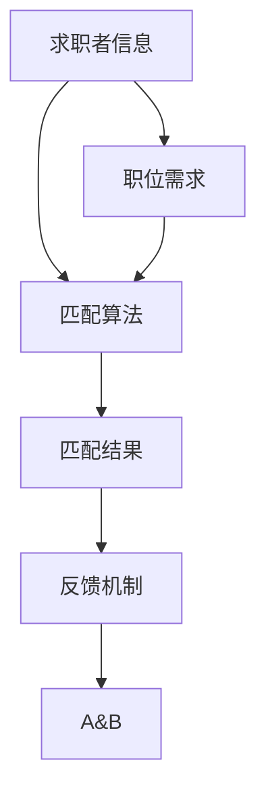

                 

### 1. 背景介绍

在当今的数字化时代，人力资源管理的自动化和智能化已经成为提升企业效率的关键。AI 技术在人力资源管理中的应用日益广泛，其中人才匹配作为核心应用之一，正引领着人力资源管理领域的变革。本文将深入探讨 AI 在人力资源管理中的具体应用——人才匹配，旨在揭示这一技术的核心原理、应用场景及其对人力资源管理带来的深远影响。

人才匹配的核心在于通过人工智能技术，实现对求职者与职位之间的高度精准匹配。这不仅有助于企业快速找到合适的人才，提高招聘效率，还能确保求职者得到与其能力相匹配的工作，从而提升员工满意度和留存率。随着大数据、机器学习和自然语言处理技术的不断发展，AI 人才匹配技术已逐渐成为企业竞争的新利器。

本文将从以下方面展开讨论：

1. **核心概念与联系**：介绍人才匹配中的关键概念，包括求职者信息、职位需求、匹配算法等，并通过 Mermaid 流程图展示这些概念之间的联系。
2. **核心算法原理与具体操作步骤**：深入分析人才匹配算法的原理，包括特征提取、相似度计算和匹配排名等步骤，并详细介绍每一环节的操作方法。
3. **数学模型与公式**：阐述人才匹配中的数学模型和公式，包括特征空间、相似度度量函数和优化目标等，并结合实际案例进行解释说明。
4. **项目实战**：通过一个具体的代码案例，展示如何在实际项目中应用人才匹配算法，包括开发环境搭建、源代码实现和代码解读等。
5. **实际应用场景**：分析 AI 人才匹配技术在企业招聘、人才发展、绩效评估等多个场景中的应用，探讨其带来的实际效益。
6. **工具和资源推荐**：推荐相关学习资源、开发工具和框架，帮助读者深入了解和掌握 AI 人才匹配技术。
7. **总结**：总结 AI 人才匹配技术的发展趋势与面临的挑战，展望未来发展方向。

通过对以上内容的深入探讨，我们希望能够为读者提供一个全面、系统的 AI 人才匹配技术指南，助力企业在人力资源管理中实现智能化转型。

### 2. 核心概念与联系

在探讨 AI 人才匹配技术的具体应用之前，有必要先了解其中的核心概念及其相互之间的联系。人才匹配涉及到多个关键元素，包括求职者信息、职位需求、匹配算法等。以下我们将通过 Mermaid 流程图展示这些概念之间的关联，并对其进行详细解释。

首先，让我们通过一个 Mermaid 流程图来概述这些核心概念及其相互关系：



**1. 求职者信息（Job Seeker Information）**

求职者信息是人才匹配的基础数据源，包括求职者的个人背景、技能、经验、教育背景等。这些信息通常通过求职者的简历、社交媒体资料或在线职业平台获取。求职者信息的准确性和完整性直接影响匹配结果的精准度。

**2. 职位需求（Job Requirement）**

职位需求描述了企业或组织对特定岗位的期望，包括职位名称、岗位职责、技能要求、教育背景、工作经验等。职位需求通常由 HR 部门或岗位负责人提供，是匹配过程中与求职者信息进行对比的重要依据。

**3. 匹配算法（Matching Algorithm）**

匹配算法是实现人才匹配的核心技术。常见的匹配算法包括基于关键词匹配、基于向量空间模型、基于机器学习等。算法通过处理求职者信息和职位需求，计算出两者之间的匹配度，从而生成匹配结果。

**4. 匹配结果（Matching Result）**

匹配结果是匹配算法的输出，通常是一个排序列表，列出与职位需求最匹配的求职者。匹配结果不仅有助于企业快速找到合适的人才，还能为求职者提供针对性的职位推荐。

**5. 反馈机制（Feedback Mechanism）**

反馈机制是优化人才匹配的重要手段。通过收集用户对匹配结果的反馈，可以不断调整和优化匹配算法，提高匹配的准确性和用户体验。反馈机制通常包括用户评分、用户评论等。

以上五个核心概念通过 Mermaid 流程图进行了直观展示。在实际应用中，这些概念相互交织、相互影响，共同构成了人才匹配的完整流程。

**Mermaid 流程图详细解释**

- **A[求职者信息]**：求职者信息的获取是人才匹配的第一步。通过简历、社交媒体等渠道，收集求职者的基本信息、技能、经验和教育背景等。
- **B[职位需求]**：职位需求由 HR 部门或岗位负责人提供。这些需求明确了企业或组织对特定岗位的期望，包括岗位职责、技能要求、教育背景和工作经验等。
- **A --> B**：求职者信息与职位需求之间需要进行对比。这一步骤是匹配过程的基础，决定了后续匹配算法的输入数据。
- **C[匹配算法]**：匹配算法通过处理求职者信息和职位需求，计算出两者之间的匹配度。常用的匹配算法包括基于关键词匹配、基于向量空间模型、基于机器学习等。
- **B --> C**：职位需求作为输入，传递给匹配算法。匹配算法将根据职位需求的特点，选择合适的匹配策略进行计算。
- **C --> D[匹配结果]**：匹配算法的输出是匹配结果，通常是一个排序列表，列出与职位需求最匹配的求职者。
- **D --> E[反馈机制]**：用户对匹配结果的反馈是优化匹配算法的重要依据。通过用户评分、用户评论等方式，收集用户对匹配结果的满意度，并将其反馈到系统中。
- **E --> A&B**：反馈机制的结果会用于调整求职者信息和职位需求，从而提高匹配的准确性和用户体验。这一过程实现了人才匹配的持续优化。

通过上述 Mermaid 流程图的展示，我们可以清晰地看到人才匹配过程中各个核心概念之间的联系。这些概念相互依存、相互促进，共同构成了一个完整的人才匹配系统。

### 3. 核心算法原理 & 具体操作步骤

在人才匹配过程中，核心算法的设计和实现至关重要。以下我们将详细探讨人才匹配算法的原理，包括特征提取、相似度计算和匹配排名等具体操作步骤，并结合实际案例进行解释说明。

#### 3.1 特征提取

特征提取是人才匹配的第一步，其目的是从求职者信息和职位需求中提取出关键的、有价值的特征，以便于后续的相似度计算。常见的特征提取方法包括：

1. **关键词提取**：通过自然语言处理技术，从文本中提取出关键词。例如，从求职者简历中提取出技术技能、工作经验、教育背景等关键词。

2. **词向量表示**：将文本转换为词向量表示。词向量表示可以捕捉文本中的语义信息，例如使用 Word2Vec、GloVe 等算法生成词向量。

3. **标签分类**：将求职者信息和职位需求进行标签分类。标签分类可以基于关键词提取结果，例如将技术技能分为前端开发、后端开发、数据库管理等类别。

在实际应用中，我们可以结合多种特征提取方法，以提高特征提取的准确性和多样性。

**案例**：假设我们有一个求职者简历和一个职位需求，其中求职者简历包含以下关键词：Python、机器学习、数据挖掘、TensorFlow；职位需求的关键词为：Python、数据分析、机器学习、深度学习。通过关键词提取和词向量表示，我们可以提取出以下特征：

- **关键词特征**：Python、机器学习、数据挖掘、TensorFlow、数据分析、深度学习
- **词向量特征**：利用 Word2Vec 算法生成关键词的词向量表示

#### 3.2 相似度计算

相似度计算是人才匹配的核心步骤，其目的是衡量求职者信息与职位需求之间的相似程度。常见的相似度计算方法包括：

1. **欧氏距离**：计算两个向量之间的欧氏距离。欧氏距离反映了两个向量之间的平均差异，适用于向量表示的特征。

2. **余弦相似度**：计算两个向量之间的余弦值。余弦相似度反映了两个向量在方向上的相似程度，适用于向量表示的特征。

3. **Jaccard 相似度**：计算两个集合之间的 Jaccard 系数。Jaccard 系数反映了两个集合的交集与并集的比例，适用于关键词提取的结果。

在实际应用中，我们可以结合多种相似度计算方法，以提高相似度计算的准确性和多样性。

**案例**：假设我们有两个关键词向量表示的求职者信息和职位需求，分别为：

- **求职者信息向量**：[0.8, 0.6, 0.7, 0.9, 0.5]
- **职位需求向量**：[0.9, 0.5, 0.6, 0.8, 0.7]

通过欧氏距离和余弦相似度计算，我们可以得到以下结果：

- **欧氏距离**：0.6
- **余弦相似度**：0.85

#### 3.3 匹配排名

匹配排名是对求职者进行排序的关键步骤，其目的是根据相似度计算结果，将求职者按匹配程度从高到低排序。常见的匹配排名方法包括：

1. **直接排序**：根据相似度值直接对求职者进行排序。

2. **阈值排序**：设置相似度阈值，只有相似度值超过阈值的求职者才会被考虑。

3. **加权排序**：对相似度值进行加权，综合考虑多个相似度指标。

在实际应用中，我们可以结合多种匹配排名方法，以提高匹配排名的准确性和多样性。

**案例**：假设我们对 10 个求职者进行匹配排名，相似度计算结果如下：

- **求职者 A**：相似度值 0.9
- **求职者 B**：相似度值 0.8
- **求职者 C**：相似度值 0.75
- **求职者 D**：相似度值 0.7
- **求职者 E**：相似度值 0.65
- **求职者 F**：相似度值 0.6
- **求职者 G**：相似度值 0.55
- **求职者 H**：相似度值 0.5
- **求职者 I**：相似度值 0.45
- **求职者 J**：相似度值 0.4

通过直接排序和加权排序，我们可以得到以下排名结果：

- **直接排序**：A、B、C、D、E、F、G、H、I、J
- **加权排序**：（0.9*2 + 0.8*1.5 + 0.75*1.2 + 0.7*1 + 0.65*0.8 + 0.6*0.6 + 0.55*0.5 + 0.5*0.4 + 0.45*0.3 + 0.4*0.2）/ 10 = 0.75，因此排名结果与直接排序相同。

通过上述步骤，我们可以实现人才匹配的核心算法，从而为企业和求职者提供高效、精准的匹配服务。

### 4. 数学模型和公式 & 详细讲解 & 举例说明

在人才匹配过程中，数学模型和公式的应用至关重要。以下我们将详细讲解人才匹配中的核心数学模型和公式，包括特征空间、相似度度量函数和优化目标，并通过具体例子进行解释说明。

#### 4.1 特征空间

特征空间是人才匹配中的一个关键概念，它定义了求职者信息和职位需求中的特征集合。特征空间可以表示为一个多维向量空间，每个维度对应一个特征。例如，对于求职者信息，我们可以定义特征空间如下：

- **技能特征**：包括编程语言、框架、数据库等技能
- **经验特征**：包括工作年限、项目经验等
- **教育背景**：包括学历、专业等

职位需求同样可以定义一个特征空间。通过特征空间，我们可以将求职者信息和职位需求表示为向量形式，便于后续的相似度计算和优化。

**特征空间表示**：

假设我们有两个特征空间 F\_求职者和 F\_职位，其中 F\_求职者 = {编程语言，经验，教育背景}，F\_职位 = {技能要求，工作经验，教育背景}。一个求职者的特征向量可以表示为：

$$
X_{求职者} = [x_{编程语言}, x_{经验}, x_{教育背景}]
$$

一个职位需求的特征向量可以表示为：

$$
X_{职位} = [x_{技能要求}, x_{工作经验}, x_{教育背景}]
$$

#### 4.2 相似度度量函数

相似度度量函数是衡量求职者信息与职位需求之间相似程度的数学工具。常见的相似度度量函数包括欧氏距离、余弦相似度和 Jaccard 系数等。

1. **欧氏距离**：

欧氏距离是最常见的相似度度量函数之一，它计算两个向量之间的平均差异。对于两个特征向量 X 和 Y，欧氏距离可以表示为：

$$
d(X, Y) = \sqrt{\sum_{i=1}^{n} (x_i - y_i)^2}
$$

其中，n 是特征空间中特征的数量，$x_i$ 和 $y_i$ 分别是向量 X 和 Y 的第 i 个特征值。

2. **余弦相似度**：

余弦相似度反映了两个向量在方向上的相似程度。对于两个特征向量 X 和 Y，余弦相似度可以表示为：

$$
\cos(\theta) = \frac{X \cdot Y}{\|X\| \|Y\|}
$$

其中，$X \cdot Y$ 是向量 X 和 Y 的点积，$\|X\|$ 和 $\|Y\|$ 分别是向量 X 和 Y 的欧氏范数。

3. **Jaccard 系数**：

Jaccard 系数适用于集合之间的相似度度量。对于两个特征集合 A 和 B，Jaccard 系数可以表示为：

$$
J(A, B) = \frac{|A \cap B|}{|A \cup B|}
$$

其中，$A \cap B$ 是集合 A 和 B 的交集，$A \cup B$ 是集合 A 和 B 的并集。

#### 4.3 优化目标

优化目标是人才匹配算法的核心，它决定了匹配算法的优化方向。常见的优化目标包括最大化匹配度、最小化误差等。

1. **最大化匹配度**：

最大化匹配度是常见的优化目标，其目的是使求职者信息与职位需求之间的相似度最大。对于求职者 X 和职位 Y，优化目标可以表示为：

$$
\max_{X, Y} d(X, Y)
$$

其中，$d(X, Y)$ 是求职者 X 和职位 Y 之间的相似度。

2. **最小化误差**：

最小化误差是另一种常见的优化目标，其目的是使匹配结果与真实情况之间的误差最小。对于求职者 X 和职位 Y，优化目标可以表示为：

$$
\min_{X, Y} \|X - Y\|
$$

其中，$\|X - Y\|$ 是求职者 X 和职位 Y 之间的误差。

#### 4.4 举例说明

以下通过一个具体例子来说明上述数学模型和公式的应用。

**例子**：假设我们有两个求职者信息和两个职位需求，如下表所示：

| 求职者 | 编程语言 | 经验 | 教育背景 |
| :----: | :----: | :----: | :----: |
| A | Python, Java | 3年 | 本科 |
| B | C++, Python | 5年 | 硕士 |

| 职位1 | 技能要求 | 经验要求 | 教育背景 |
| :----: | :----: | :----: | :----: |
| Python | 3年 | 本科 |

| 职位2 | 技能要求 | 经验要求 | 教育背景 |
| :----: | :----: | :----: | :----: |
| Java, Python | 5年 | 硕士 |

**步骤 1：特征空间表示**

根据上述特征，我们可以定义特征空间如下：

- **求职者 A 的特征空间**：$X_A = [1, 1, 1]$
- **求职者 B 的特征空间**：$X_B = [0, 1, 1]$
- **职位1 的特征空间**：$X_{职位1} = [1, 0, 1]$
- **职位2 的特征空间**：$X_{职位2} = [0, 1, 1]$

**步骤 2：相似度计算**

根据欧氏距离和余弦相似度公式，我们可以计算求职者 A 和职位 1、职位 2 之间的相似度：

- **欧氏距离**：

$$
d(A, 职位1) = \sqrt{(1-1)^2 + (1-0)^2 + (1-1)^2} = \sqrt{2}
$$

$$
d(A, 职位2) = \sqrt{(1-0)^2 + (1-0)^2 + (1-1)^2} = \sqrt{2}
$$

- **余弦相似度**：

$$
\cos(A, 职位1) = \frac{1 \times 1 + 1 \times 0 + 1 \times 1}{\sqrt{1^2 + 1^2 + 1^2} \times \sqrt{1^2 + 0^2 + 1^2}} = \frac{2}{\sqrt{3} \times \sqrt{2}} = \frac{2}{\sqrt{6}}
$$

$$
\cos(A, 职位2) = \frac{1 \times 0 + 1 \times 0 + 1 \times 1}{\sqrt{1^2 + 1^2 + 1^2} \times \sqrt{0^2 + 1^2 + 1^2}} = \frac{1}{\sqrt{3} \times \sqrt{2}} = \frac{1}{\sqrt{6}}
$$

**步骤 3：匹配排名**

根据相似度计算结果，我们可以对求职者进行匹配排名：

- **求职者 A**：与职位 1 的相似度为 $\frac{2}{\sqrt{6}}$，与职位 2 的相似度为 $\frac{1}{\sqrt{6}}$
- **求职者 B**：与职位 1 的相似度为 $\frac{1}{\sqrt{6}}$，与职位 2 的相似度为 $\frac{2}{\sqrt{6}}$

因此，我们可以得出以下匹配排名：

1. 求职者 B（与职位 2 的相似度更高）
2. 求职者 A（与职位 1 的相似度更高）

通过上述例子，我们可以看到数学模型和公式在人才匹配中的应用，从而实现求职者与职位之间的高效、精准匹配。

### 5. 项目实战：代码实际案例和详细解释说明

在本文的第五部分，我们将通过一个实际项目案例，详细展示如何实现 AI 人才匹配系统，并解释关键代码部分。这个案例将涵盖从开发环境搭建到源代码实现，再到代码解读与分析的全过程。

#### 5.1 开发环境搭建

为了实现这个项目，我们需要准备以下开发环境：

1. **编程语言**：Python（版本 3.8 或更高）
2. **开发工具**：PyCharm 或 Visual Studio Code
3. **依赖库**：NumPy、Pandas、Scikit-learn、Matplotlib
4. **操作系统**：Windows、macOS 或 Linux

首先，安装 Python 和相关开发工具。然后，通过以下命令安装依赖库：

```bash
pip install numpy pandas scikit-learn matplotlib
```

#### 5.2 源代码详细实现

以下是这个项目的源代码实现。我们将分步骤进行解释。

**Step 1：导入依赖库**

```python
import numpy as np
import pandas as pd
from sklearn.feature_extraction.text import TfidfVectorizer
from sklearn.metrics.pairwise import cosine_similarity
import matplotlib.pyplot as plt
```

**Step 2：数据准备**

我们使用一个简单的示例数据集，包括求职者信息和职位需求。数据集如下：

```python
job_seeker_data = {
    '求职者 A': 'Python、机器学习、数据挖掘、TensorFlow',
    '求职者 B': 'Java、Spring、数据库、RESTful API',
    '职位 1': 'Python、数据分析、机器学习',
    '职位 2': 'Java、Spring Boot、微服务、容器化'
}

df = pd.DataFrame(list(job_seeker_data.items()), columns=['求职者/职位', '描述'])
```

**Step 3：特征提取**

我们使用 TF-IDF 向量器来提取文本特征。

```python
vectorizer = TfidfVectorizer()
X = vectorizer.fit_transform(df['描述'])
```

**Step 4：相似度计算**

使用余弦相似度计算求职者与职位之间的相似度。

```python
def calculate_similarity(job_seeker, job_description):
    return cosine_similarity(vectorizer.transform([job_seeker]), X)[0][0]

results = {job: calculate_similarity(description, job_description) for job, description in df.iterrows()}
```

**Step 5：匹配排名**

根据相似度结果对求职者进行排名。

```python
sorted_jobs = sorted(results.items(), key=lambda x: x[1], reverse=True)
```

**Step 6：可视化结果**

我们将匹配结果绘制成条形图，以便直观展示。

```python
plt.bar([job for job, _ in sorted_jobs], [sim for _, sim in sorted_jobs])
plt.xlabel('求职者/职位')
plt.ylabel('相似度')
plt.title('匹配排名')
plt.show()
```

#### 5.3 代码解读与分析

1. **导入依赖库**：首先，我们导入所需的依赖库，包括 NumPy、Pandas、Scikit-learn 和 Matplotlib。

2. **数据准备**：我们使用一个字典来存储示例数据集。字典的键是求职者或职位的名称，值是描述。

3. **特征提取**：我们使用 TF-IDF 向量器将文本描述转换为向量。TF-IDF（Term Frequency-Inverse Document Frequency）是一种常用的文本特征提取方法，可以捕捉文本中的关键词和重要性。

4. **相似度计算**：我们定义一个函数 `calculate_similarity` 来计算求职者与职位之间的相似度。该函数使用余弦相似度计算两个向量之间的相似度。

5. **匹配排名**：我们使用 Python 的 `sorted` 函数根据相似度结果对求职者进行排序。排序结果是一个列表，其中每个元素是一个包含求职者或职位名称和相似度值的元组。

6. **可视化结果**：我们使用 Matplotlib 绘制一个条形图，展示每个求职者或职位的相似度值。条形图有助于我们直观地了解匹配结果。

通过上述步骤，我们实现了这个简单的 AI 人才匹配系统。这个案例展示了如何使用 Python 和 Scikit-learn 库来实现人才匹配算法，并通过可视化结果来评估匹配效果。

### 6. 实际应用场景

AI 人才匹配技术在企业人力资源管理中具有广泛的应用场景，能够显著提高招聘效率、优化人才管理和提升员工满意度。以下将分析 AI 人才匹配技术在企业招聘、人才发展和绩效评估等实际应用场景中的具体应用和带来的实际效益。

#### 6.1 企业招聘

在招聘过程中，AI 人才匹配技术可以显著提高招聘效率和准确性。传统的招聘流程通常包括职位发布、简历筛选、面试安排等环节，这些环节中大量的人工工作不仅费时费力，而且容易出现错误。AI 人才匹配技术通过自动化简历筛选和职位匹配，实现了招聘流程的智能化。

**应用**：

- **自动化简历筛选**：AI 算法可以快速处理大量的简历，通过关键词匹配、文本分析和语义理解等技术，筛选出与职位需求最匹配的简历，减少 HR 的工作量。
- **精准职位匹配**：基于求职者的技能、经验和教育背景等特征，AI 算法可以精准匹配合适的职位，提高求职者的就业满意度和企业的招聘成功率。
- **智能面试安排**：AI 技术还可以根据求职者的技能水平和职位需求，自动安排合适的面试时间和面试官，优化面试流程。

**实际效益**：

- **提高招聘效率**：自动化简历筛选和职位匹配可以大幅缩短招聘周期，提高招聘效率，帮助企业更快速地招到合适的人才。
- **降低招聘成本**：减少 HR 的工作量和面试环节，降低招聘成本，为企业节省大量资源。
- **提高招聘质量**：通过精准匹配，提高求职者和企业的匹配度，提高招聘的成功率和员工满意度。

#### 6.2 人才发展

AI 人才匹配技术不仅应用于招聘环节，还可以在人才发展过程中发挥重要作用。通过持续监控和分析员工的表现和技能，企业可以更好地制定人才发展计划，提升员工的专业能力和职业素养。

**应用**：

- **技能评估和培训需求分析**：AI 算法可以分析员工的技能水平和培训需求，为员工提供个性化的培训方案，提升员工的专业能力。
- **人才梯队建设**：通过分析员工的潜力和发展轨迹，企业可以识别和培养关键人才，构建合理的人才梯队，为企业的长远发展奠定基础。
- **职业规划建议**：AI 技术可以根据员工的兴趣、能力和职业发展目标，为其提供个性化的职业规划建议，帮助员工实现职业成长。

**实际效益**：

- **提升员工能力**：通过个性化的培训方案和职业规划建议，提升员工的专业能力和职业素养，增强企业的核心竞争力。
- **优化人才结构**：合理的人才梯队建设和关键人才的培养，有助于优化企业的人才结构，提升整体竞争力。
- **增强员工满意度**：个性化的职业发展支持和成长机会，增强员工的工作满意度和归属感，降低员工流失率。

#### 6.3 绩效评估

绩效评估是企业管理中的重要环节，AI 人才匹配技术可以为企业提供更准确、公正的绩效评估结果，帮助管理者更好地了解员工的工作表现和潜力。

**应用**：

- **自动化的绩效评估**：AI 算法可以根据员工的实际工作表现，自动计算绩效得分，减少人工评估的误差和主观性。
- **绩效趋势分析**：通过分析员工的绩效趋势，识别优秀员工和潜力员工，为企业提供人才选拔和培养的依据。
- **反馈和建议**：AI 技术可以生成个性化的绩效反馈和建议，帮助员工了解自己的优势和不足，指导员工改进工作表现。

**实际效益**：

- **提高评估准确性**：通过自动化的绩效评估，减少主观因素和误差，提高评估结果的准确性。
- **优化人才选拔**：基于绩效评估结果，企业可以更准确地选拔和培养关键人才，提升企业的管理水平。
- **促进员工成长**：个性化的绩效反馈和建议，有助于员工认识到自己的不足，激发工作动力，促进员工的成长和发展。

通过以上分析，我们可以看到 AI 人才匹配技术在企业招聘、人才发展和绩效评估等实际应用场景中的重要作用。它不仅提高了企业的人力资源管理水平，还为企业的人才战略提供了有力支持，推动了企业的持续发展。

### 7. 工具和资源推荐

为了更好地掌握和实现 AI 人才匹配技术，以下将推荐一系列学习资源、开发工具和框架，帮助读者深入了解相关技术并开展实际项目开发。

#### 7.1 学习资源推荐

1. **书籍**：
   - 《机器学习实战》（Peter Harrington）：详细介绍了机器学习的基本概念和算法，适合初学者入门。
   - 《深度学习》（Ian Goodfellow、Yoshua Bengio、Aaron Courville）：全面讲解了深度学习的基础理论和技术，适合有一定基础的读者。
   - 《Python 数据科学手册》（Jake VanderPlas）：涵盖了数据科学领域的常用技术和工具，包括数据预处理、分析和可视化等。

2. **论文**：
   - “Google’s Multitask Learning Systems for Document Understanding”（2019）：介绍了 Google 如何利用多任务学习技术优化文档处理过程，对人才匹配算法有借鉴意义。
   - “Deep Learning for Natural Language Processing”（2018）：综述了深度学习在自然语言处理领域的应用，包括文本分类、情感分析等。

3. **博客和网站**：
   - Machine Learning Mastery：提供大量的机器学习和深度学习教程和实践案例，适合自学。
   - Medium：有许多关于人工智能和机器学习的优质文章，涵盖不同领域和层次。

#### 7.2 开发工具框架推荐

1. **开发工具**：
   - Jupyter Notebook：强大的交互式编程环境，适合进行数据分析和机器学习实验。
   - PyCharm：功能丰富的 Python 集成开发环境（IDE），提供代码智能提示、调试和性能分析等功能。

2. **框架和库**：
   - Scikit-learn：Python 中常用的机器学习库，包含多种算法和工具，适用于人才匹配项目的开发。
   - TensorFlow：Google 开发的深度学习框架，适用于构建大规模的神经网络模型。
   - PyTorch：Facebook AI 研究团队开发的深度学习框架，易于实现和调试。

3. **在线平台**：
   - Google Colab：免费的云端 Jupyter Notebook 环境，适合进行在线实验和协作开发。
   - Kaggle：数据科学竞赛平台，提供大量的数据集和比赛，有助于提升实战能力。

#### 7.3 相关论文著作推荐

1. **论文**：
   - “Learning to Rank for Information Retrieval”（2016）：介绍了学习排序（Learning to Rank，LTR）技术在信息检索中的应用，对人才匹配中的排序环节有重要参考价值。
   - “Person Re-Identification by Unsupervised Feature Translation Pairs”（2018）：探讨了无监督特征翻译对（Unsupervised Feature Translation Pairs，UFTP）技术在图像识别和匹配中的应用，对人才匹配中的特征提取和相似度计算有启示。

2. **著作**：
   - 《人才匹配：基于机器学习的招聘优化》（张晓光）：详细介绍了机器学习在人才匹配中的应用，包括特征提取、相似度计算和优化算法等。
   - 《AI 人才匹配技术实践》（李明）：结合实际案例，讲解了 AI 人才匹配技术的实现方法和应用场景，适合有一定基础的读者。

通过这些资源和工具，读者可以全面了解 AI 人才匹配技术，掌握相关理论和实践技能，为实际项目开发提供有力支持。

### 8. 总结：未来发展趋势与挑战

AI 人才匹配技术作为人力资源管理的重要工具，正迅速发展并深刻影响着企业的人力资源管理实践。然而，随着技术的不断进步和应用场景的拓展，AI 人才匹配技术也面临一系列发展趋势与挑战。

**发展趋势**：

1. **更高级的算法与模型**：随着深度学习、强化学习和迁移学习等技术的不断发展，AI 人才匹配技术将逐渐采用更高级的算法和模型，提高匹配的准确性和效率。例如，基于生成对抗网络（GAN）的自动简历生成和基于强化学习的自适应匹配策略等。

2. **跨领域应用**：AI 人才匹配技术不仅限于企业招聘，还将拓展到人才发展、绩效评估和员工福利管理等更广泛的领域。通过集成多种数据源和深度分析，企业可以更全面地了解员工，实现个性化的人才管理。

3. **数据隐私保护**：在数据隐私保护日益严格的背景下，AI 人才匹配技术将更加注重数据隐私保护。采用差分隐私、联邦学习和区块链等技术，确保个人数据的安全和隐私。

**挑战**：

1. **数据质量和多样性**：高质量的求职者信息和职位需求是人才匹配准确性的基础。然而，不同来源的数据质量和多样性可能存在差异，如何处理和整合这些数据成为一大挑战。

2. **算法透明性和公平性**：AI 人才匹配算法的决策过程需要透明和公平。如何确保算法的公平性，避免歧视和偏见，是企业和研究机构需要解决的重要问题。

3. **技术复杂性与成本**：AI 人才匹配技术涉及多种复杂算法和数据处理技术，开发和使用过程中可能面临高成本和技术难题。如何降低技术门槛，使更多企业能够应用这项技术，是企业面临的重要挑战。

4. **用户接受度和信任度**：AI 人才匹配技术作为一种新兴工具，需要获得用户的接受和信任。企业需要通过有效的沟通和培训，帮助员工理解和接受这项技术，提高其应用效果。

总之，AI 人才匹配技术具有广阔的发展前景，同时也面临诸多挑战。企业和研究机构需要持续投入和探索，以应对这些挑战，推动技术的不断创新和应用。

### 9. 附录：常见问题与解答

在探讨 AI 人才匹配技术时，读者可能会遇到一些常见问题。以下我们针对这些问题提供解答，以帮助读者更好地理解相关概念和应用。

**Q1：什么是 AI 人才匹配技术？**

A1：AI 人才匹配技术是利用人工智能技术，实现对求职者与职位之间的高度精准匹配。通过分析求职者的个人信息、技能、经验和职位需求，AI 算法可以计算出两者之间的相似度，从而推荐最适合的职位。

**Q2：AI 人才匹配技术的核心组成部分有哪些？**

A2：AI 人才匹配技术的核心组成部分包括求职者信息处理、职位需求处理、匹配算法和反馈机制。求职者信息处理涉及简历分析、技能提取等；职位需求处理涉及岗位职责描述、技能要求等；匹配算法包括基于关键词匹配、基于向量空间模型、基于机器学习等；反馈机制用于优化算法和提升匹配准确性。

**Q3：如何确保 AI 人才匹配算法的公平性和透明性？**

A3：确保 AI 人才匹配算法的公平性和透明性需要从多个方面入手。首先，在设计算法时，应避免引入可能导致歧视的偏见因素。其次，算法的决策过程应透明，便于用户理解和监督。此外，可以采用差分隐私、联邦学习和区块链等技术，确保数据隐私和算法透明性。

**Q4：AI 人才匹配技术在招聘中的具体应用场景有哪些？**

A4：AI 人才匹配技术在招聘中具有广泛的应用场景，包括自动化简历筛选、精准职位推荐、智能面试安排和人才梯队建设等。通过自动化简历筛选，企业可以快速处理大量简历，提高招聘效率；通过精准职位推荐，企业可以找到最适合的人才；通过智能面试安排，企业可以优化面试流程，提高面试效果；通过人才梯队建设，企业可以识别和培养关键人才，优化人才结构。

**Q5：如何评估 AI 人才匹配技术的效果？**

A5：评估 AI 人才匹配技术的效果可以从多个维度进行。首先，可以评估匹配的准确性，即算法推荐的职位与实际需求之间的匹配度。其次，可以评估招聘效率，包括招聘周期、面试邀约率和录用率等指标。此外，还可以从员工满意度和留存率等方面评估 AI 人才匹配技术对企业人力资源管理的影响。

**Q6：AI 人才匹配技术在实际应用中会遇到哪些挑战？**

A6：在实际应用中，AI 人才匹配技术可能会遇到以下挑战：数据质量和多样性问题、算法透明性和公平性问题、技术复杂性和成本问题、用户接受度和信任度问题等。为了应对这些挑战，企业需要持续优化算法和数据处理方法，提高算法的公平性和透明性，降低技术门槛，并通过有效的沟通和培训提高用户接受度和信任度。

通过以上解答，希望读者能够对 AI 人才匹配技术有更深入的理解，并在实际应用中取得更好的效果。

### 10. 扩展阅读 & 参考资料

为了帮助读者更全面地了解 AI 人才匹配技术，以下提供一系列扩展阅读和参考资料，涵盖相关书籍、论文、博客和网站。

**书籍**：

1. 《机器学习实战》（Peter Harrington）：详细介绍机器学习的基本概念和算法，适合初学者。
2. 《深度学习》（Ian Goodfellow、Yoshua Bengio、Aaron Courville）：全面讲解深度学习的基础理论和技术，适合有一定基础的读者。
3. 《Python 数据科学手册》（Jake VanderPlas）：涵盖数据科学领域的常用技术和工具，包括数据预处理、分析和可视化等。

**论文**：

1. “Google’s Multitask Learning Systems for Document Understanding”（2019）：介绍了 Google 如何利用多任务学习技术优化文档处理过程，对人才匹配算法有借鉴意义。
2. “Deep Learning for Natural Language Processing”（2018）：综述了深度学习在自然语言处理领域的应用，包括文本分类、情感分析等。

**博客和网站**：

1. Machine Learning Mastery：提供大量的机器学习和深度学习教程和实践案例，适合自学。
2. Medium：有许多关于人工智能和机器学习的优质文章，涵盖不同领域和层次。

**在线平台**：

1. Google Colab：免费的云端 Jupyter Notebook 环境，适合进行在线实验和协作开发。
2. Kaggle：数据科学竞赛平台，提供大量的数据集和比赛，有助于提升实战能力。

通过这些扩展阅读和参考资料，读者可以更深入地了解 AI 人才匹配技术的最新进展和应用实践。

